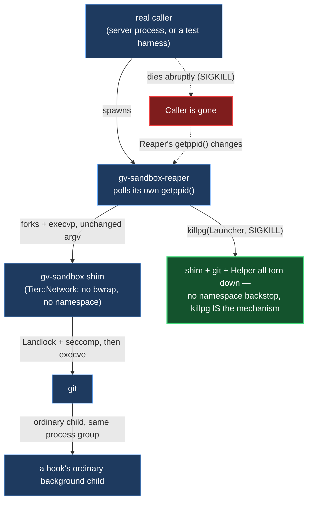

# ADR 0143 — `Tier::Network` gets the same parent-death reaper `Tier::Strict` already has, with one named residual

- **Status:** Accepted — implemented, mutation-proved two ways, both arms in
  code the test run compiles.
- **Date:** 2026-09-08
- **Issue:** #757
- **Related:** [ADR 0141](0141-a-sandboxed-process-must-not-survive-its-own-parents-death.md)
  (the reaper this ADR extends; its own Context, Alternatives and "How it was
  proved" sections cover the reaper's design and are not repeated here except
  where this decision changes them)

## Context

ADR 0141 built `gv-sandbox-reaper` and wired it in front of `Tier::Strict`'s
`bwrap` launcher, closing #728. It deliberately did **not** wrap
`Tier::Network`'s bare-shim launcher, and said why in its own "Scoped to
`Tier::Strict` only" section: `Tier::Network` has no pid namespace, so
`killpg` is not a backstop layered on top of the kernel's own namespace
teardown the way it is for `Tier::Strict` — it would be the *entire*
mechanism, and that PR had built no test proving it worked there. Shipping it
unproved is exactly the gap that PR's own review caught and corrected.

That left `Tier::Network` in the state #757 was filed to describe: **zero**
parent-death protection of any kind. `sandbox_argv_with_seccomp_profile`
returns the shim's own argv unwrapped for this tier — no `bwrap`, no
`--die-with-parent`, no reaper, nothing watching for the coordinating process
dying. If the server (or a test harness, or whatever else calls
`sandbox::spawn::command_async`) dies abruptly while a Network-tier git
operation is running — a fetch, a push, an `ls-remote` — the operation is
reparented to `systemd --user` (this box's real subreaper) and keeps running
with outbound network access, forever, with nothing watching.

#757's own investigation (filed by reading `sandbox_argv_with_seccomp_profile`
closely while reproducing #728) raised a further point ADR 0141 explicitly
left open: because `execve` replaces the process image, a Network-tier orphan
and an escaped Strict-tier one are byte-identical in `ps` output. The two real
orphans that motivated #728 (`git -C <tmp>/repo status --short`, reparented to
`systemd --user`) could equally well have been Network-tier orphans — a
certainty, not a race — rather than evidence of the Strict-tier startup race
ADR 0141 fixed. This ADR does not need to choose between those explanations
either; closing #757 removes the Network-tier explanation from future
evidence, whichever explained the two that were found.

## Decision

### `wrap_with_reaper` now recognizes both sandboxed launcher shapes

`sandbox::spawn::wrap_with_reaper` detects "should this be wrapped"
structurally, the same way ADR 0141 chose: by comparing the composed
program (`argv[0]`) against a resolved binary path, never by threading a
`Tier` through the function (which would need to see through
`CheckoutPolicy`'s private field). It already compared against
`bwrap::bwrap_path()` for `Tier::Strict`; this ADR adds a second comparison
against `shim::shim_path()`.

`sandbox_argv_with_seccomp_profile`'s three argv shapes make this exhaustive
without needing the tier itself:

1. `Tier::Unsandboxed` — `argv[0]` is the literal `"git"`. Matches neither
   comparison, stays unwrapped (INV-16 shapes 1/2: an operator-trusted,
   explicit, permanently-bannered operation — see ADR 0141's own reasoning for
   why this tier is out of scope, unchanged here).
2. `Tier::Strict` — `argv[0]` is the resolved `bwrap` path. Unchanged from ADR
   0141.
3. `Tier::Network` — transfer or checkout, `policy.tier` is `Network` either
   way — `argv[0]` is the resolved shim path directly (no `bwrap`: F3,
   `argv.rs`'s `network_tier_never_names_bwrap_and_never_unshares_net`,
   unsharing the network namespace breaks push). This is the new case this ADR
   wraps.

The wrap itself is unchanged: the caller's own pid (`std::process::id()`,
read before the reaper is spawned — ADR 0141's startup-race fix) is prepended,
`gv-sandbox-reaper` forks the composed launcher, registers
`PR_SET_PDEATHSIG(SIGKILL)` on it (the ordinary single-hop case), and polls
its own `getppid()` against the caller's pid — `killpg`-ing the whole process
group on a mismatch. None of `gv-sandbox-reaper/main.rs` changes; the
mechanism was already tier-agnostic; only the call site that decides whether
to invoke it does.

### The residual `killpg` does not close, proved rather than assumed

ADR 0141's arm-2 mutation (`killpg` → `kill` on the recorded pid alone)
**survived** under `Tier::Strict`, and that survival is exactly what led to
scoping that PR to `Tier::Strict` only: it meant `killpg`'s wider reach was
unproved for the tier where it would actually matter. This ADR builds that
missing proof directly, as a second acceptance test rather than a comment:

`Tier::Strict`'s pid namespace is a *kernel* guarantee — killing the
namespace's pid 1 makes the kernel tear down every task inside it,
regardless of what process group or session any of them assigned themselves.
`killpg` widening from a single target to the process's whole group is
therefore invisible under `Tier::Strict`: the namespace was always going to
reap everything either way (ADR 0141's own arm-2 analysis).

`Tier::Network` has no pid namespace. For this tier, `killpg` is not a
backstop on top of a stronger guarantee — it **is** the guarantee, and it
has the ordinary POSIX shape: it reaches every process still a member of the
group the reaper assigned at spawn time, and nothing else. A process that
calls `setsid()` — the double-forked orphan shape every other test in
`sandbox::lifecycle` uses — leaves that group by construction, and `killpg`
cannot follow it there. Closing that residual for `Tier::Network` would need
the same kernel-level namespace guarantee `Tier::Strict` has, which this tier
cannot take on without unsharing the network namespace it exists to keep —
directly contradicting F3, the reason this tier has no `bwrap` wrapper at
all.

This is a real, narrower guarantee than `Tier::Strict`'s, and it is exactly
what #757's third acceptance criterion asked for: "if not reachable within
this issue's scope, say why... with the mechanism that prevents a fix" — the
mechanism is `setsid`'s process-group detachment, proved rather than asserted
(see "How it was proved").

## Alternatives considered

**Track descendants some other way than the process group `killpg` reaches**
(e.g. a cgroup the reaper places every descendant in, walked and killed by
pid rather than relying on `setpgid`/`killpg`). Rejected for the same reason
ADR 0141 deferred a supervising cgroup scope generally: real, unresolved
interaction risk with `--unshare-net`-adjacent code elsewhere in this crate,
and out of proportion to what #757 actually asked for — an ordinary
Network-tier orphan (the shape that motivated the issue) is already closed by
the process-group mechanism this ADR adds.

**Leave `Tier::Network` unwrapped and only document the gap.** Rejected: #757
was filed specifically because "zero protection" for an entire tier is a
worse posture than "protection with one named, narrower residual" —
especially since the ordinary case (a caller dying abruptly, no deliberate
detachment involved) is exactly what this tier's real production traffic
looks like. A hostile hook detaching via `setsid` to outlive a supervisor is
already partially covered ground: `documented_gaps.rs`'s posture (INV-17,
"documented non-coverage is tested as non-coverage") is the same posture this
ADR takes for that one residual, rather than refusing to close anything until
every residual is closed too.

## Consequences

- Every `Tier::Network` sandboxed spawn now has one extra process in its tree
  (the reaper) when `gv-sandbox-reaper` is present on the host — the same
  degrade-quietly posture ADR 0141 established: a host missing the binary
  gets exactly the sandbox it had before, Landlock and seccomp unchanged, only
  the extra reaping guarantee absent (`sandbox::reaper::reaper_path` returning
  `None` is not a policy-construction failure for either tier).
- `Tier::Network`'s launcher exit status and terminating signal still pass
  through unchanged (`gv-sandbox-reaper`'s exit-status passthrough was already
  tier-agnostic; nothing in `main.rs` changed).
- **Named residual, carried forward from ADR 0141's 100ms poll interval**:
  bounded, unchanged.
- **New named residual, this ADR's own:** a double-forked `setsid` grandchild
  of a `Tier::Network` process is not reaped by this change. Documented in
  code (`sandbox::spawn::wrap_with_reaper`'s doc comment) and proved, not
  merely asserted, by
  `sandbox::lifecycle::a_network_tier_reaper_does_not_reach_a_double_forked_setsid_grandchild`.
- #728 overlap, checked directly: #728's reaper mechanism
  (`gv-sandbox-reaper`, `sandbox::reaper`, `sandbox::spawn::wrap_with_reaper`)
  is exactly the mechanism this ADR extends — there is no second, competing
  reaper design to reconcile. #728 is closed and already merged to `main`
  (`47041f77`) as of this ADR; this is a straightforward extension of its
  scope, not a fix racing it.

## How it was proved

Two new acceptance tests, both in `sandbox::lifecycle`, modeled directly on
ADR 0141's own #728 tests (same helper-process fixture,
`spawn_helper_owning_the_launcher` — reused unmodified, since it already takes
`&Policy` generically rather than assuming `Tier::Strict`):

**`a_reaper_process_reaps_a_network_tier_launcher_when_only_its_own_parent_is_sigkilled`**
is #757's positive case: a helper process (raw `fork`+`execvp`, standing in
for a real caller) becomes the actual OS parent of a `Tier::Network` composed
launcher, running an **ordinary** background hook (`ordinary_orphan_hook` — a
plain backgrounded `sh -c` loop, deliberately without `setsid`). SIGKILLing
the helper — never the launcher, never the reaper — reproduces #757's exact
finding pre-fix (an unbounded orphan) and confirms it is now reaped: the tick
log stops growing and the delayed marker is never written.

**`a_network_tier_reaper_does_not_reach_a_double_forked_setsid_grandchild`** is
the residual's proof, using the identical `orphan_hook` fixture every
`Tier::Strict` test in this file already uses (double-forked, `setsid`-
detached ticker plus delayed marker) against the same helper-dies scenario.
Its assertion is inverted from the positive test on purpose — it asserts the
ticker **does** keep ticking after the helper dies — with a doc comment
saying explicitly that a red result here is good news requiring the doc and
this ADR to be updated, not a regression to chase.

Both tests pass today, confirming the analysis: an ordinary Network-tier
orphan is reaped by `killpg` reaching the process group the reaper assigned;
a double-forked `setsid` orphan is not, because it left that group by
construction and `Tier::Network` has no kernel-level namespace backstop the
way `Tier::Strict` does.

`failure-atlas`'s `mutation_check`, same `run_key` across both arms, targets
both new lifecycle tests plus the existing `sandbox::argv`/`sandbox::spawn`
suites so a regression in either the detection or the wrap is caught by
whichever test actually exercises it:

| # | Shape | Mutation | Verdict |
|---|---|---|---|
| 1 | remove the mechanism | `is_network_shim_launch`'s `shim_path()` comparison deleted (always `false`) | **caught** |
| 2 | weaken the mechanism | the comparison changed from `argv.first() == Some(shim)` to `argv.first().is_some()` (wraps everything, including `Tier::Unsandboxed`'s bare `git`) | **caught** |

Both arms run against the same production build `cargo test -p
git-vista-server` compiles by default (`tests/forces_reaper_build.rs` and
`tests/forces_shim_build.rs` both pull their respective binaries into the
build plan) — no `cfg`, no target filter, nothing proved over code the run
never compiled.
