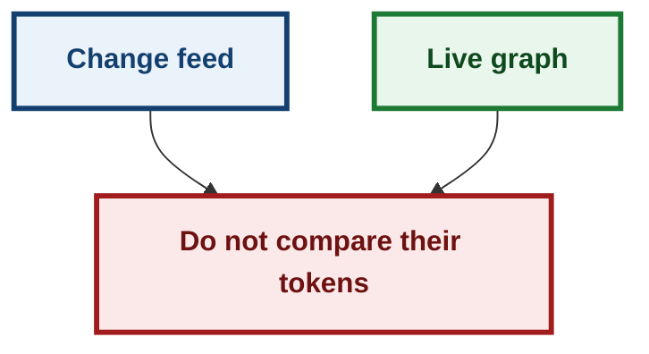
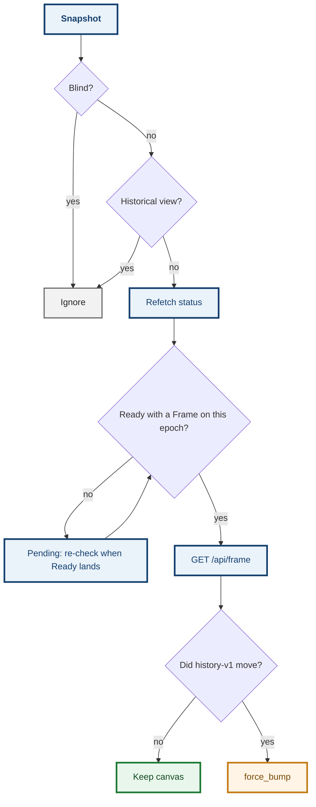

# ADR 0150 — The live graph follows history generation, not the planner token

- **Status:** Proposed — implemented for #852
- **Date:** 2026-09-18
- **Issue:** [#852](https://github.com/tom2025b/git-vista/issues/852)
- **Extends:** [0094](0094-the-sweep-is-the-only-authority.md) (the change feed is a reading, never a graph invalidation) · [0001](0001-repository-generation-token.md) (distinct generation recipes) · [0115](0115-a-mutation-proof-cannot-see-what-it-does-not-run.md)
- **Supersedes:** nothing
- **Amends:** [0094](0094-the-sweep-is-the-only-authority.md) § what the feed is *for* — it still does not rebuild a plan, and it still does not compare its token to the graph's

## Context

M12 taught the app to *say* when the repository moved underneath it. The change feed publishes the planner generation. The plan-freshness panel reads that feed. The live commit graph did not.

So a `git commit` in a terminal, an auto-checkpoint, or a checkout left the canvas showing the previous history until the user hit Refresh. In-app writes already remounted through `GraphCore::on_invalidate`. External writes only changed the freshness badge.

The obvious wiring — `on_invalidate` with the feed's generation — is the mix `staging.rs` already names: it "409s forever, never admits". Five generation recipes ship in this server. The feed carries the planner recipe (HEAD, refs, worktree status). The graph is pinned to history-v1 (committed topology, plus shallow). Those tokens are not comparable. Treating them as one would remount the canvas on every editor save, and after an in-app write it would remount *again* because the stored `GraphCore` token from settlement is also the planner recipe.

## Decision

The feed remains a hint. History-v1 remains the fact.

1. A change-feed snapshot with a generation is a **reading**. Blind (`generation: None`) is not. The first snapshot on a stream, and every snapshot after a gap, still count: `RefDelta::Unknown` is the absence of a named delta, not the absence of a reading.
2. Every reading refetches working-tree status. The chip is allowed to move when only the worktree moved.
3. The canvas remounts only when a live `GET /api/frame` disagrees with the Frame already on this epoch. That comparison is history-v1 against history-v1.
4. No displayed Frame (seed still loading) does **not** remount. Bumping then fights the in-flight seed. The Ready transition re-checks, so an external commit during first load cannot strand a stale page.
5. A historical as-of view does not follow live history. Refresh in that mode is still "reload this observation", never "return to live".
6. `GraphCore::on_invalidate` is not this path. After a write it stores the planner token. Feeding it a history-v1 token would look like movement every time.

A late Frame for a retired epoch is dropped: the probe captures the epoch, awaits the Frame, then re-reads the live epoch before bumping.

## Alternatives considered

| Alternative | Why it lost |
|---|---|
| `on_invalidate` with the feed token | Mixes planner and history-v1. Remounts on editor saves. After an in-app write, remounts a second time. |
| Remount on any `RefDelta::Named` with refs | HEAD's symbolic target is folded into `other` with worktree status. A checkout would not move the HEAD badge. |
| Skip `other` entirely | Same miss: checkout is `other`. |
| Put history-v1 on the change feed | A protocol change for a client that can already read `/api/frame`. The over-read of one extra Frame per repository change is the cheaper mistake. |
| Leave the graph until Refresh | That is the bug. The feed already knows something moved; keeping a picture of a repository that no longer exists is the state M12 removed for plans and then left standing for the graph. |

## Consequences

External commits, checkouts, and ref movement reload the live graph without a manual Refresh. Worktree-only edits refresh the status chip and leave the camera alone.

In-app writes still remount once through settlement. The follow-up probe then sees the same history-v1 Frame and does not bump again, provided the seed for that epoch has landed. A snapshot during `SeedLoading` waits for Ready.

The wasm wrapper is not compiled by `cargo test`. The decisions live in `features/freshness/core.rs`. A source census pins that `signals.rs` asks those functions, probes `/api/frame`, skips `on_invalidate`, and re-reads the epoch after the await.

Failure-atlas **678** (history comparison inverted) and **679** (reload with no displayed Frame, which would fight the in-flight seed) are both conclusive `caught`, at disjoint assertions.

**Signed:** grok · 2026-09-18T05:25:00Z
