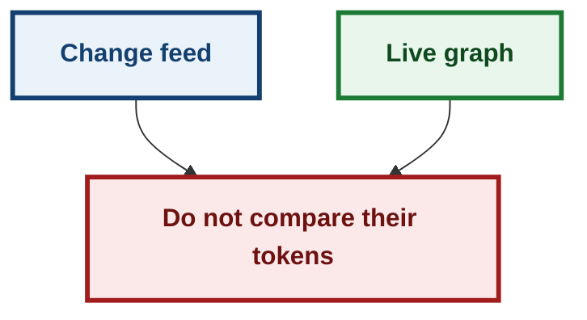
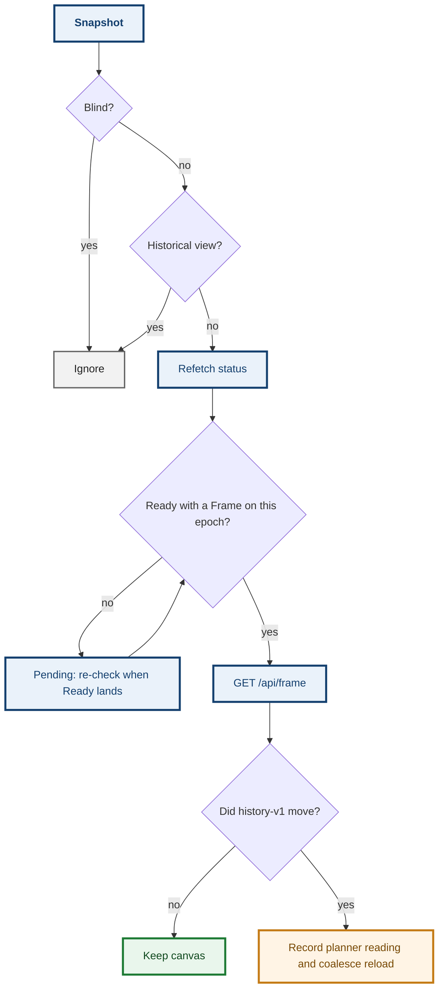

# ADR 0150 — The live graph follows history generation, not the planner token

- **Status:** Proposed — implemented for #852
- **Date:** 2026-09-18
- **Issue:** [#852](https://github.com/tom2025b/git-vista/issues/852)
- **Extends:** [0094](0094-the-sweep-is-the-only-authority.md) (the change feed is a reading, never a graph invalidation) · [0001](0001-repository-generation-token.md) (distinct generation recipes) · [0115](0115-a-mutation-proof-cannot-see-what-it-does-not-run.md)
- **Supersedes:** nothing
- **Amends:** [0094](0094-the-sweep-is-the-only-authority.md) § what the feed is *for* — it still does not rebuild a plan, and it still does not compare its token to the graph's

## Context

M12 taught the app to *say* when the repository moved underneath it. The change feed publishes the planner generation. The plan-freshness panel reads that feed. The live commit graph did not.

So a `git commit` in a terminal, an auto-checkpoint, or a checkout left the canvas showing the previous history until the user hit Refresh. In-app writes already remounted through `GraphCore::on_invalidate`. External writes only changed the freshness badge.

Directly passing every feed reading to `on_invalidate` would remount on editor saves, because the feed carries the planner recipe (HEAD, refs, worktree status). The graph is pinned to history-v1 (committed topology, plus shallow). Comparing those two recipes is the mix `staging.rs` names: it "409s forever, never admits". Five generation recipes ship in this server. The history comparison must establish committed movement first; only then can the feed's planner token identify the reading for settlement coalescing.

## Decision

The feed remains a hint. History-v1 remains the fact.

1. A change-feed snapshot with a generation is a **reading**. Blind (`generation: None`) is not. The first snapshot on a stream, and every snapshot after a gap, still count: `RefDelta::Unknown` is the absence of a named delta, not the absence of a reading.
2. Every reading refetches working-tree status. The chip is allowed to move when only the worktree moved.
3. The canvas remounts only when a live `GET /api/frame` disagrees with the Frame already on this epoch. That comparison is history-v1 against history-v1.
4. No displayed Frame (seed still loading) does **not** remount. Bumping then fights the in-flight seed. The Ready transition re-checks, so an external commit during first load cannot strand a stale page.
5. A historical as-of view does not follow live history. Refresh in that mode is still "reload this observation", never "return to live".
6. The history comparison never feeds a history-v1 token to `GraphCore::on_invalidate`. When history differs, `force_bump_for_feed` records the requesting feed reading's **planner** token in the same slot used by settlement. Equal planner tokens coalesce in either arrival order; history-v1 tokens are compared only to other history-v1 tokens.
7. A reading remains outstanding until a successful history comparison. Failed requests retry after 250 ms, 1 s, and 4 s, without needing another publication. The fourth failure enters `HistoryCheck::Failed { attempts, reason }`; it stays outstanding, is reported to the browser console, and a new reading or epoch (including Refresh) starts a fresh budget.

A late Frame for a retired epoch is dropped: the probe captures the epoch, awaits the Frame, then re-reads the live epoch before bumping.

## Alternatives considered

| Alternative | Why it lost |
|---|---|
| `on_invalidate` directly on every feed reading | Bypasses the history-v1 comparison and remounts on worktree-only editor saves. |
| Remount on any `RefDelta::Named` with refs | HEAD's symbolic target is folded into `other` with worktree status. A checkout would not move the HEAD badge. |
| Skip `other` entirely | Same miss: checkout is `other`. |
| Put history-v1 on the change feed | A protocol change for a client that can already read `/api/frame`. The over-read of one extra Frame per repository change is the cheaper mistake. |
| Leave the graph until Refresh | That is the bug. The feed already knows something moved; keeping a picture of a repository that no longer exists is the state M12 removed for plans and then left standing for the graph. |

## Consequences

External commits, checkouts, and ref movement reload the live graph without a manual Refresh. Worktree-only edits refresh the status chip and leave the camera alone.

An in-app write remounts once, whether its feed probe or settlement arrives first. The first reload records the planner generation; the other path recognizes it. A snapshot during `SeedLoading` waits for Ready, and that deferred check gets the same retry budget as an immediate check. A completion or retry timer from an obsolete ticket cannot overwrite a newer check. Retiring an epoch retains an outstanding check until the current epoch has an accepted Frame.

The wasm wrapper is not compiled by `cargo test`. `HistoryFollower` in `features/freshness/core.rs` owns both dispatch paths, pending checks, retry scheduling, terminal failure, and completion fencing. Executable host tests drive feed, Ready, timer, and completion events through that production scheduler. A small source census checks browser adapter wiring only; it is not evidence that scheduling works. The adapter fetches Frames, sleeps for the delay chosen by core, and publishes core state.

Decision log for #853: retain the existing no-argument `force_bump` API for manual refresh, repository selection, and drift callers; add `force_bump_for_feed` to record only planner provenance. Keep client probe failure separate from server sweep health. A dedicated visible probe-failure affordance is deferred; the failure state and console diagnostic are implemented within the authorized files.

Failure-atlas **678** (history comparison inverted) and **679** (reload with no displayed Frame, which would fight the in-flight seed) are both conclusive `caught`, at disjoint assertions.

**Signed:** grok · 2026-09-18T05:25:00Z

**Signed:** codex · 2026-09-26T12:41:25-04:00

last_edited_by: codex
