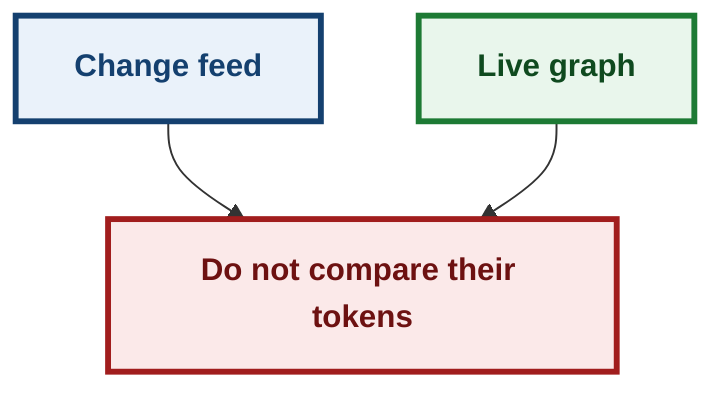
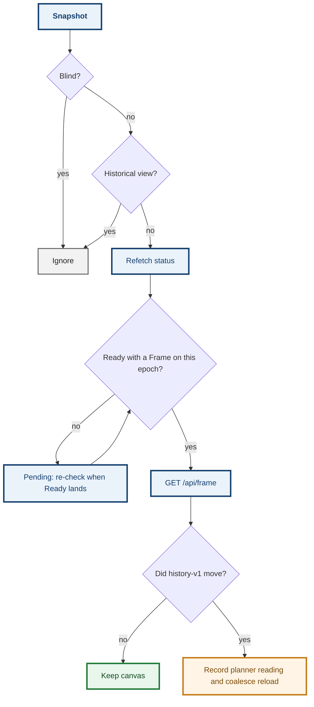
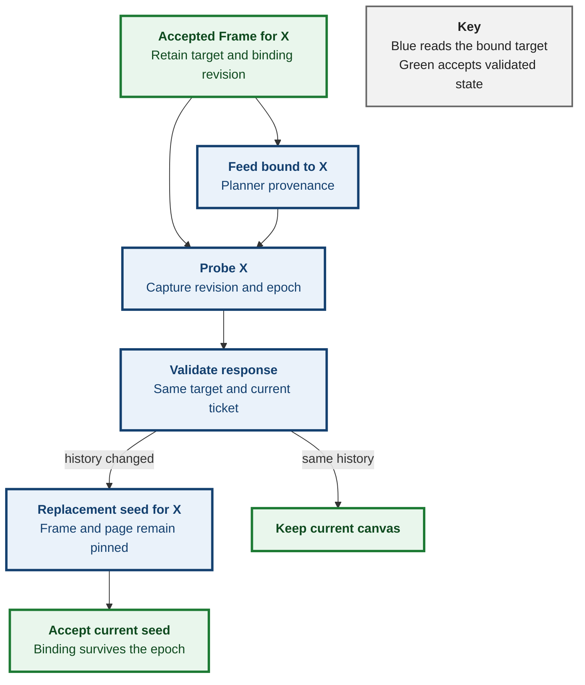
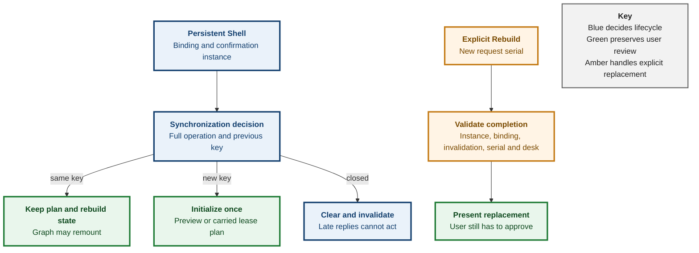
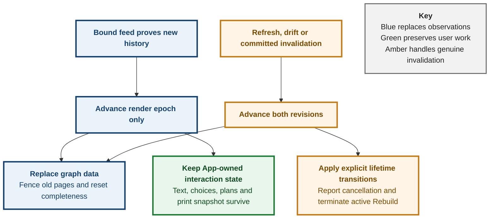

# ADR 0150 — The live graph follows history generation, not the planner token

- **Status:** Accepted (design) — Tom approved the 2026-09-26 amendment (v3, after three cross-family design rounds); #853 implementation in progress against it
- **Date:** 2026-09-18
- **Issue:** [#852](https://github.com/tom2025b/git-vista/issues/852)
- **Extends:** [0094](0094-the-sweep-is-the-only-authority.md) (the change feed is a reading, never a graph invalidation) · [0001](0001-repository-generation-token.md) (distinct generation recipes) · [0115](0115-a-mutation-proof-cannot-see-what-it-does-not-run.md)
- **Supersedes:** nothing
- **Amends:** [0094](0094-the-sweep-is-the-only-authority.md) § what the feed is *for* — it still does not rebuild a plan, and it still does not compare its token to the graph's

## Reader’s card — keep your work while the graph catches up

Today, a commit in another terminal can throw away conflict-resolution text you have typed into this branch’s app. With this fix, the graph will catch up without losing that text, your staging choices, or the plan you are reviewing. Your tab will stay on its repository even when another tab selects a different one. Force Push will open its confirmation or explain why it could not, and background updates will not interrupt a Rebuild you requested.

**Done — green:** Three original defects traced; four additional classes identified in source. **Watch — amber:** Design proposed; fixes not built. **Open — red:** Tom’s approval and passing browser tests still ahead.

**Tags — gray:** ADR 0150 · #852 / #853 · proposed · author codex · review Claude · approval Tom · landing max

## Context

M12 taught the app to *say* when the repository moved underneath it. The change feed publishes the planner generation. The plan-freshness panel reads that feed. The live commit graph did not.

So a `git commit` in a terminal, an auto-checkpoint, or a checkout left the canvas showing the previous history until the user hit Refresh. In-app writes already remounted through `GraphCore::on_invalidate`. External writes only changed the freshness badge.

Directly passing every feed reading to `on_invalidate` would remount on editor saves, because the feed carries the planner recipe (HEAD, refs, worktree status). The graph is pinned to history-v1 (committed topology, plus shallow). Comparing those two recipes is the mix `staging.rs` names: it "409s forever, never admits". Five generation recipes ship in this server. The history comparison must establish committed movement first; only then can the feed's planner token identify the reading for settlement coalescing.

```mermaid
flowchart TD
    FeedNode["<b>Change feed</b>"]
    GraphNode["<b>Live graph</b>"]
    MixNode["<b>Do not compare their tokens</b>"]
    FeedNode --> MixNode
    GraphNode --> MixNode

    classDef feed fill:#eaf2fa,color:#14406f,stroke:#14406f,stroke-width:3px
    classDef canvas fill:#e9f6ec,color:#0f4a1f,stroke:#1d7a34,stroke-width:3px
    classDef mix fill:#fbe9e9,color:#6d1111,stroke:#a11d1d,stroke-width:3px
    class FeedNode feed
    class GraphNode canvas
    class MixNode mix
```

## Decision

The feed remains a hint. History-v1 remains the fact.

1. A change-feed snapshot with a generation is a **reading**. Blind (`generation: None`) is not. The first snapshot on a stream, and every snapshot after a gap, still count: `RefDelta::Unknown` is the absence of a named delta, not the absence of a reading.
2. Every reading refetches working-tree status. The chip is allowed to move when only the worktree moved.
3. The canvas remounts only when a live `GET /api/frame` disagrees with the Frame already on this epoch. That comparison is history-v1 against history-v1.
4. No displayed Frame (seed still loading) does **not** remount. Bumping then fights the in-flight seed. The Ready transition re-checks, so an external commit during first load cannot strand a stale page.
5. A historical as-of view does not follow live history. Refresh in that mode is still "reload this observation", never "return to live".
6. The history comparison never feeds a history-v1 token to `GraphCore::on_invalidate`. When history differs, `force_bump_for_feed` records the requesting feed reading's **planner** token in the same slot used by settlement. Equal planner tokens coalesce in either arrival order; history-v1 tokens are compared only to other history-v1 tokens.
7. A reading remains outstanding until a successful history comparison. Failed requests retry after 250 ms, 1 s, and 4 s, without needing another publication. The fourth failure enters `HistoryCheck::Failed { attempts, reason }`; it stays outstanding, is reported to the browser console, and a new reading or epoch (including Refresh) starts a fresh budget.

```mermaid
flowchart TD
    S["<b>Snapshot</b>"]
    S --> B{"Blind?"}
    B -->|yes| I["Ignore"]
    B -->|no| H{"Historical view?"}
    H -->|yes| I
    H -->|no| ST["Refetch status"]
    ST --> R{"Ready with a Frame on this epoch?"}
    R -->|no| P["Pending: re-check when Ready lands"]
    R -->|yes| FR["GET /api/frame"]
    FR --> C{"Did history-v1 move?"}
    C -->|no| K["Keep canvas"]
    C -->|yes| M["Record planner reading and coalesce reload"]
    P --> R

    classDef step fill:#eaf2fa,color:#14406f,stroke:#14406f,stroke-width:3px
    classDef keep fill:#e9f6ec,color:#0f4a1f,stroke:#1d7a34,stroke-width:3px
    classDef move fill:#fff4e5,color:#7a4a00,stroke:#c47b16,stroke-width:3px
    classDef stop fill:#f2f2f2,color:#222222,stroke:#666666,stroke-width:2px
    class S,ST,FR,P step
    class K keep
    class M move
    class I stop
```

A late Frame for a retired epoch is dropped: the probe captures the epoch, awaits the Frame, then re-reads the live epoch before bumping.

## Alternatives considered

| Alternative | Why it lost |
|---|---|
| `on_invalidate` directly on every feed reading | Bypasses the history-v1 comparison and remounts on worktree-only editor saves. |
| Remount on any `RefDelta::Named` with refs | HEAD's symbolic target is folded into `other` with worktree status. A checkout would not move the HEAD badge. |
| Skip `other` entirely | Same miss: checkout is `other`. |
| Put history-v1 on the change feed | A protocol change for a client that can already read `/api/frame`. The over-read of one extra Frame per repository change is the cheaper mistake. |
| Leave the graph until Refresh | That is the bug. The feed already knows something moved; keeping a picture of a repository that no longer exists is the state M12 removed for plans and then left standing for the graph. |

## Consequences of the original decision

These are intended outcomes, not a claim that the current branch satisfies them. The amendment below records the blocking gaps and the proposed completion contract.

External commits, checkouts, and ref movement reload the live graph without a manual Refresh. Worktree-only edits refresh the status chip and leave the camera alone.

An in-app write remounts once, whether its feed probe or settlement arrives first. The first reload records the planner generation; the other path recognizes it. A snapshot during `SeedLoading` waits for Ready, and that deferred check gets the same retry budget as an immediate check. A completion or retry timer from an obsolete ticket cannot overwrite a newer check. Retiring an epoch retains an outstanding check until the current epoch has an accepted Frame.

The wasm wrapper is not compiled by `cargo test`. `HistoryFollower` in `features/freshness/core.rs` owns both dispatch paths, pending checks, retry scheduling, terminal failure, and completion fencing. Executable host tests drive feed, Ready, timer, and completion events through that production scheduler. A small source census checks browser adapter wiring only; it is not evidence that scheduling works. The adapter fetches Frames, sleeps for the delay chosen by core, and publishes core state.

Decision log for #853: retain the existing no-argument `force_bump` API for manual refresh, repository selection, and drift callers; add `force_bump_for_feed` to record only planner provenance. Keep client probe failure separate from server sweep health. A dedicated visible probe-failure affordance is deferred; the failure state and console diagnostic are implemented within the authorized files.

Failure-atlas **678** (history comparison inverted) and **679** (reload with no displayed Frame, which would fight the in-flight seed) are both conclusive `caught`, at disjoint assertions.

**Signed:** grok · 2026-09-18T05:25:00Z

**Signed:** codex · 2026-09-26T12:41:25-04:00

last_edited_by: codex

## 2026-09-26 amendment — a tab follows its accepted repository

**Design gate:** draft for cross-family review and Tom's approval. This amendment is the proposed replacement contract for the incomplete implementation at `98e06f26`. It qualifies the earlier Decision and Consequences wherever target identity or confirmation lifetime was unspecified. No code implementing this amendment has been approved or written in this step.

### 1. Diagnosis and evidence

Shared session selection is deliberate. The displayed graph retains a repository until it reloads. #853's defect is treating a change in the shared selection as a change within the displayed repository; no rule currently says which identity owns a tab's ongoing reads.

There are three independently blocking mechanisms:

- **Confirmation replacement.** An epoch rebuild mounts `confirm_modal_view` again inside the canvas. Its effect calls `preview.start` for the surviving confirmation, silently replacing the plan the user was reviewing. This lifecycle defect exists on main `af3b366c` too; automatic external-change reloads make it routinely reachable. A trace from run [36256669919](https://github.com/tom2025b/git-vista/actions/runs/36256669919), artifact `10910444207`, shows an unrequested second `/api/plan` at 16:50:42.221Z after the history change, followed by a replacement preview. The user did not click Rebuild.
- **Repository migration.** The feed follows the session selection; the probe and replacement seed request an unselected live Frame. Another tab selecting Y can therefore replace tab A's displayed X with Y. Pinning page 1 to the returned Frame makes that new seed internally consistent but does not preserve X. The same trace collection shows tab A fetching and displaying `fixture-repo` after another tab selected it.

- **Confirmation opener discarded.** Codex’s headless trace inspection of the rerun of [36256669919](https://github.com/tom2025b/git-vista/actions/runs/36256669919), job `108444769170`, artifact `10911995199`, identifies a third consumer of the epoch problem. In `test-results/rebuild-lease-cancel--664--3413f-ver-a-canceled-confirmation/trace.zip`, clicking Force Push starts a plain `/api/plan` at 17:16:08.882Z; it returns successfully. Frame requests at 17:16:08.933Z and 17:16:08.950Z show a changed history-v1 token. No second, leased-plan request follows. The failure is the opening helper’s wait for “What this plan says” at `rebuild-lease-cancel.spec.mjs:66`; line 131 is the test declaration. The test never reaches Rebuild or Cancel. The source explains the lost continuation: `menu/branch_items.rs` captures `next_seq()` and `request_key()` synchronously, then rechecks `operations.admit_intent` after the awaited plain plan; `features/operations/signals.rs` stamps and compares the graph epoch, and rejection returns silently. A feed-driven epoch retirement can therefore discard the opening request before there is a confirmation to preserve. This is distinct from replacing an already displayed plan.

The shared opener gate has eight production users: seven asynchronous sites in `menu/branch_items.rs` (four), `menu/remote_items.rs` (two), and `menu/commit_items.rs` (one), plus synchronous tag deletion in `menu/tag_items.rs`. Tag deletion has no await between capture and admission and is not evidence of this race. Force Push rechecks after its awaits; the other asynchronous sites admit their resolved pre-check. Fix the common gate and its adapters, rather than special-casing the browser test’s Force Push opener.

History-v1 is a digest of history inputs, **not repository identity**. X and Y can have identical tokens. Planner tokens likewise cannot substitute for target identity. The two-tab spec's whole-body foreign-OID assertion can detect graph migration; it does not by itself prove that a foreign plan replaced the confirmation or that the lease desk guard failed.

Reviewer-reported browser results are 143 passed on main, then 136 passed / 7 failed and 135 passed / 8 failed on this branch. The six plan-freshness failures occurred in both branch runs. `rebuild-lease-cancel.spec.mjs:131` failed only in the rerun; the trace above locates that failure in opening the confirmation, not in canceling a rebuild. This explains the observed failure, but the repaired build must still pass both the opener observation and the original held-reply cancellation scenario. Two runs do not establish deterministic failures.

#### X8 audit: additional consumers of the widened epoch meaning

Codex’s [X8 audit](/home/tom/projects/git-vista-reports/codex-x8-epoch-reader-audit-20260926.md), against `98e06f26`, found **37 executable `.epoch()` calls in 13 production files**, plus captured-epoch comparisons and indirect remount effects. This is the audit’s executable census, not the earlier rough 42-call count. Its **VERIFIED** label means source traced through the decision and mutation, not browser reproduction; **INFERRED** means a runtime or proposed-design consequence still needs a browser observation. It reconfirms the three original defects above and adds four classes:

| New class | Source-verified mechanism | Evidence limit |
|---|---|---|
| X8 class 1 — explicit Rebuild completion lost | `dialogs/confirm.rs:736,783` and `features/preview/signals.rs:244,295` carry the render epoch separately from the opener key. `rebuild_key_is_current` in `features/preview/core.rs:532` rejects an epoch change; `rebuild_commit` at :628–631 returns Drop and touches no state. Both success and failure can disappear. | **VERIFIED** rejection path. **INFERRED** v2 composition: preserving `PlanSlot::Rebuilding` while dropping its only completion can leave the confirmation rebuilding indefinitely. At the current head, remount-driven Clear can instead expose the older carried plan. Neither result is acceptable. |
| X8 class 2 — Stage result lost | `features/status/detail/view.rs:110–114` compares the epoch after Stage has already been sent. A feed bump suppresses both the explicit status refetch and any error notice. | **VERIFIED** source path; no browser reproduction claimed. The discarded UI continuation does not cancel the submitted write. |
| X8 class 3 — open surfaces closed | `features/status/detail/view.rs:82` closes the status popup on every graph epoch. `app/mod.rs:289–292` couples `print_open = false` to `complete = false`. Print size is also owned under the canvas. | **VERIFIED** forced closure/reset. Keeping Print open requires an explicit snapshot policy; simply leaving the flag true would not establish a coherent print document. |
| X8 class 4 — editing state destroyed | `app/canvas.rs:799–813` mounts overlays beneath the retiring graph. `viewer.rs:185–204` owns staging selections/reviewed patch state; :1038–1044 owns conflict source, block choices and authoritative hand-edited text. `features/stash/view.rs:203–204` owns the two stash-push options. Remount recreates that state. | **VERIFIED** ownership and destructive reset path, including loss of typed text even when only history refs moved. Exact behavior of pending Preview/Apply/resolve callbacks targeting disposed signals remains **INFERRED** and requires held-reply tests. |

The class-4 fixes differ by source. Staging requires both persistent state and a remount-safe initializer: its resource fetcher at `viewer.rs:230–232` explicitly clears selection and preview. Conflict source/choices/edited require persistent storage; their reset at :1055–1057 is inside the explicit “Resolve line by line” click handler, **not** an effect or resource initializer. Keep that click-driven reset, rather than inventing an automatic conflict initializer. Stash options are initialized to false at `features/stash/view.rs:203–204`; their only subsequent writes are the two checkbox handlers at :315/:323. They need persistent storage, with no mount-reset fetcher to move.

A minor adjacent source finding, verified during this round after X8, is `viewer.rs:285–289`: the newly mounted document effect resets blame window and history skip even when the same document remains open. It loses position, not typed content. Include those fields in document-session retention and make their reset conditional on an actual document transition. This is not a fifth severe class or a claimed browser reproduction.

The conflict editor’s own comment says hand-edited text becomes authoritative and must not be silently discarded. A history-only tag or commit can retire that owner without changing the edited file. This is a data-loss path, not just an outdated badge. The audit does not claim completeness over every future stateful surface; the design below changes the ownership rule so new interaction state need not acquire another feed exception.

### 2. Binding and replacement seeds

Introduce a host-testable tab binding owned above the canvas, in the graph core. Its state distinguishes **initial discovery**, **selecting a known target**, **bound**, and **automatic following unavailable**. A bound value retains the accepted Frame's opaque `worktree_id`, its `repo_id` when available for desk checks, and a monotonically increasing binding revision. A history epoch and a binding revision are different: an ordinary reload changes the epoch, not the repository binding.

The binding is captured when a Frame and its matching first page are accepted, **before any subsequent epoch bump**. It is not derived from `status_frame` or `status_repo`: `app/mod.rs` makes those unavailable when the accepted seed's epoch retires. A pending reload retains its own target even while the displayed Frame is temporarily absent.

The acceptance and request contract is:

1. Initial discovery may use an unselected Frame request only while this tab has never accepted a target. Authentication/network retries remain fenced discovery attempts; they cannot replace an established binding. Page 1 uses that Frame's worktree ID. Only a current discovery result may establish the first binding; a response from a superseded discovery is discarded.
2. Once bound to X, every background probe, Refresh, drift recovery, retry, and replacement seed requests X explicitly. The seed request captures `(binding revision, worktree ID, epoch, view)` before its first await. Its Frame must name X and its page must match that Frame's history generation. A mismatch is an error, never a new binding.
3. A successful accepted reload preserves the binding revision. No observer may mint a new binding revision merely because a Frame was fetched again or its generation changed.
4. A repository selection initiated in **this tab** is a separate transition. Mint a selection intent before awaiting, fence old callbacks, and pause following during that transition. On success, request the exact selected worktree, validate the candidate seed, then accept the new binding and attach its feed. A later intent supersedes an earlier selection response. On failure, retain the prior accepted target and restore following under a fresh revision; do not adopt the session default.
5. Picker selection and Open Worktree already know the selected ID. A successful Open URL operation returns a descriptor: use that descriptor's worktree, not a later default Frame, to establish its candidate target.
6. Open URL's existing `clone_settlement` bumps even on an ambiguous failed response to discover a possibly completed clone through the session default. That behavior is incompatible with this contract. On that error, retain the old target and preserve the existing warning that the clone may still have finished: check the repository picker before retrying, because retrying can create a duplicate clone. Do not silently discover some other tab's selection. Keep Open URL's intentional `shell.close_confirm()` before its reload on both success and error; synchronization must never resurrect that dismissed instance. This is an intentional change to default-target discovery, not removal of the existing recovery warning.
7. Historical views retain their explicit target and observation and do not consume live-follow actions. Return to live resumes that historical view's validated target, not the current session default. A historical view without a usable target requires explicit repository selection before automatic following resumes.

A probe ticket includes binding revision, worktree ID, epoch, request serial, and the bound feed's planner provenance. Completion checks the current binding and epoch again after awaiting, along with Ready/displayed state and the returned Frame identity. Stale completions and retry timers cannot bump, overwrite pending state, or reset a newer retry budget. A genuine same-target epoch retirement retains an outstanding check until Ready, as the existing retry contract requires.

Decision log: retain the current target across ordinary `force_bump` calls; explicit selection uses a distinct core transition. Do not overload an ordinary Refresh to rediscover a mutable session default.

```mermaid
flowchart TD
    A["<b>Accepted Frame for X</b><br/>Retain target and binding revision"]
    A --> F["<b>Feed bound to X</b><br/>Planner provenance"]
    A --> P["<b>Probe X</b><br/>Capture revision and epoch"]
    F --> P
    P --> V["<b>Validate response</b><br/>Same target and current ticket"]
    V -->|history changed| S["<b>Replacement seed for X</b><br/>Frame and page remain pinned"]
    V -->|same history| K["<b>Keep current canvas</b>"]
    S --> C["<b>Accept current seed</b><br/>Binding survives the epoch"]
    L["<b>Key</b><br/>Blue reads the bound target<br/>Green accepts validated state"]
    classDef readpath fill:#eaf2fa,color:#14406f,stroke:#14406f,stroke-width:3px
    classDef accepted fill:#e9f6ec,color:#0f4a1f,stroke:#1d7a34,stroke-width:3px
    classDef legendbox fill:#f2f2f2,color:#222222,stroke:#666666,stroke-width:2px
    class F,P,V,S readpath
    class A,K,C accepted
    class L legendbox
```

### 3. Feed provenance belongs to the connection

Extend `GET /api/repository/events` with optional `repo=<worktree-id>`, inheriting the existing documented opaque-selector convention in `handlers/read.rs:48–63`: malformed IDs are 400 and unregistered IDs are 404. **The `ChangeFeedSnapshot` JSON payload and event name remain unchanged.** This is an additive read API contract, not a change to shared session selection.

In `crates/git-vista-server/src/handlers/repository_events.rs`, accept a query, resolve it synchronously in the authenticated request handler using `handlers/read.rs::resolve_repo`, then attach reconciliation to that resolved target. Do not resolve the session selection inside the later-polled stream body.

| Request | Contract |
|---|---|
| Malformed or empty explicit selector | HTTP 400 before attaching a feed. Never interpreted as no selector. |
| Well-formed selector absent from the registry | HTTP 404 before attaching a feed. No default fallback and no path supplied by the client. |
| Registered explicit selector X | Attach to X. A later session selection of Y **does not close or retarget this connection**. A connection never switches targets. |
| Selector omitted by a legacy client | Preserve the existing session-following contract: capture `SelectionReader` inside the handler and close on selection change. |
| Reconnect of a bound client | Resolve the same explicit X again. If X is no longer registered, fail closed; do not reconnect to the default. |

For bound connections, the periodic session-selection check does not decide stream lifetime. The existing stream permit, keep-alive, 30-minute maximum lifetime, and disconnect cleanup still apply. A resolved connection stays attached to its captured target until termination; registry removal does not authorize retargeting. Reconnection revalidates registration.

In `freshness/signals.rs`, attach the feed only after a usable binding exists. Its URL carries the percent-encoded worktree ID and the existing protocol query. Connection state owns its EventSource, closures, and reconnect timer. Explicit binding changes close the old source, release its listeners, clear the old feed log, and cancel or logically retire its timers.

Every message, error callback, and reconnect timer carries both binding revision and a connection incarnation. Only the active pair may publish, clear the log, change health, or reconnect. A same-binding reconnect starts a new incarnation and resets sequence continuity. This prevents an old connection's delayed error from clearing a new connection's log and prevents colliding per-feed sequence numbers from hiding the first reading after a switch. Owner disposal closes the source and makes all remaining callbacks inert.

An explicit X connection gives its snapshots X provenance; no identity field is added to the payload. That provenance accompanies the feed log and probe tickets. It is never inferred from planner-token equality. A quiet X remains watched when the session sits on Y, so later X changes still reach tab A.

Cost: tabs bound to different worktrees can keep multiple reconciliation feeds and watchers alive. Feeds are shared by repository path (`reconciliation.rs:225–232`), not allocated once per tab. Dropping the final feed owner releases its watcher; retaining a tab retains its subscription. No extra connection is retained for the session default once a tab is bound.

The **32 stream permits are one process-wide pool shared by change feeds and operation progress streams** (`operations.rs:81`, `handlers/repository_events.rs:92`, `handlers/operations.rs:151`). A legacy feed releases its permit when it notices a session selection change, normally within the one-second selection check, before reconnecting. A bound feed deliberately retains its permit across that change, until disconnect or another termination condition, including the 30-minute maximum lifetime. This lengthens uninterrupted permit occupancy; legacy reconnection also reacquires a permit, so this is not a claim that binding adds another stream per tab. Exhaustion can refuse a newly requested **operation progress stream with HTTP 503**, impairing live progress reporting for a write already underway, as well as refusing a new change feed. Refusing a progress stream does not cancel the write.

**Policy:** accept this longer occupancy and the existing shared-pool refusal/recovery behavior for this amendment. Do not raise the cap, reserve a separate pool, or make feeds yield to operations; a pool split or priority policy is out of scope. Each active feed incarnation owns at most one reconnect timer, so retries cannot multiply chains or evade the cap. Section 8’s F1 permit tests must pin the consequence: an exhausted shared pool refuses both endpoint types with 503, and releasing a held stream makes capacity available again.

### 4. Reload and settlement coalescing within a binding

Coalescing is allowed only for the same current binding and the same planner generation. Clear the coalescing record on binding transitions, even when the new target happens to have the same token. Ordinary history epoch changes retain the record so feed-first and settlement-first delivery still produce one reload.

Operation settlement must carry trustworthy target provenance too. `OperationStatus` already contains repository and worktree identity; `features/operations/signals.rs` currently drops those fields when producing `Settlement`. Retain the server-reported identity through the operations core and graph invalidation decision, together with the tab binding revision captured for the operation. Never relabel a terminal record with whichever binding is current when it arrives.

A terminal record for another worktree, or an operation from a retired binding revision, may update its operation registry entry but cannot advance or populate the current graph's coalescing record. A resumed operation with no recoverable issuing revision cannot claim same-binding coalescing. Local outcomes without verified target provenance do not record a planner token; if a current bound view needs reconciliation, schedule a pinned history comparison instead. Absence of provenance is not evidence of equality.

Decision log: target identity qualifies planner-token coalescing; it does not replace history-v1 comparison or permit comparing planner and history tokens.

### 5. Separate history rendering from interaction lifetime

**Choose persistent interaction-state ownership plus the shared invalidation revision.** A feed-driven history reload is a rendering event, not a cancellation of user work. Repository binding remains a separate identity boundary. Category A work (seed/page reads, completeness, layout, status observations and their stale-result rejection) follows the **render epoch**. Category B work (pending user intent, user-opened surfaces, editor ownership and explicit Rebuild) uses the **invalidation revision**, with binding, instance and request identity where applicable. These are two applications of one distinction, not interchangeable checks. Category B does not mean “clear every plan on invalidation”: each transition must leave a defined visible state, as specified below.

Keep graph following active while an interaction is open. The confirmation’s displayed plan is never automatically re-derived merely because an epoch changed. Explicit Rebuild is the user’s separate instruction to replace it.

| Candidate | Decision |
|---|---|
| Defer reload while a confirmation is open | Rejected. A user can leave it open indefinitely, so the graph can starve indefinitely. Feed reconnects and the 30-minute stream lifetime do not bound the confirmation. A timeout would eventually force the same unsafe remount, and automatic dismissal would discard the user's work. |
| Add counter guards while keeping user-state signals owned by retiring views (P alone) | Rejected. Correct completion checks cannot preserve signals destroyed with their owner. Partial combinations can strand Rebuilding. |
| Hoist interaction state and its fetch/reset decisions, then apply the shared invalidation revision (S plus revision) | Chosen. Follow the existing App-owned StashDrawer pattern: render-only reloads may recreate views, but not their authoritative interaction state. Counters govern genuine invalidation and asynchronous admission. |
| Re-parent every overlay view above the canvas | Not chosen. Existing views have legitimate canvas/context dependencies. Moving the whole bundle broadens the change without eliminating the separate completion comparisons. Print alone moves because its new frozen snapshot removes that dependency. |
| Retain idempotent confirmation synchronization | Required. Preview already lives above the canvas, but the view still remounts. App-owned synchronization initializes each confirmation once and covers Refresh/drift remounts as well as feed reloads. Instance identity still protects Cancel/reopen. |

#### Persistent state, disposable rendering

The repository has already repaired this ownership defect once. `state.rs:223–234` documents how a stash write set a notice and then bumped the graph, destroying that notice about a frame later. Hoisting `StashDrawer` into App fixed it while leaving the Activity/stash view inside the canvas. `features/stash/signals.rs:105–114` now owns busy/inspecting/notice, but **not** the two locally created push options. Use that existing pattern for the remaining user-state owners, rather than moving all eight overlays.

Create one App-owned **EditorSession** in `features/diff/signals.rs`, carried through `Features` in `state.rs`, with pure lifetime/state transitions in `features/diff/core.rs`. It owns the current viewer document identity, staging selections and their reviewed patch/plan association, conflict source/choices/authoritative edited text, request serials, busy/error outcomes, and the associated document fetch state. Viewer navigation/selection state needed to reconstruct the same document belongs there too; DOM refs and render geometry remain view-local. Extend the existing App-owned StashDrawer with its push options. Editor state is initialized by an explicit document instance and retained on feed-only graph reloads; stash-option lifetime follows the binding/invalidation policy below. Bind document instances to validated repository/worktree identity; the stores do not read a temporarily absent `status_frame` to choose a new target.

Shell must advance a viewer/document instance synchronously on open, close and eviction, including closing and reopening the identical document before an observer tick. The document key carries binding revision, invalidation revision, instance and full document identity. A pure **synchronize document** decision returns Keep for the same key and Initialize/Retire only for a real lifecycle transition. Store the last processed key outside the canvas. Mounting `viewer_view` or `conflict_editor` only attaches rendering to the existing session; it is not permission to reset state or refetch. In particular, the current viewer resource at `viewer.rs:216–234` clears staging selection and preview when it starts a staging fetch: move that issuance/reset decision into the persistent session too. A same-key remount must neither run it again nor replace a ready staging document with loading state. The rule is shared by confirmation initialization, the staging loader and blame’s document-change effect: **a remount must not re-run an initializing fetch or effect that overwrites preserved state.** Reset blame window/history skip only on an actual document transition, not the first tick of a remounted effect.

Conflict editing needs no relocated reset decision: keep its existing user-click handler, writing the hoisted source/choices/edited signals through the current session. Hoisting these fields removes the remount loss; request admission still protects the existing asynchronous click/submit replies after close or replacement. Do not add automatic reinitialization on a new Frame. Stash options likewise need storage hoisting only: there is no loader clearing them. Retain them across same-binding render/status refresh and panel hide/show; reset them on an explicit new repository or genuine invalidation, not incidental view construction.

Callbacks must publish through this live session, guarded by captured binding/document instance/request serial and the invalidation revision. Never capture a view-owned signal or a disposed `StoredValue<RenderCtx>` as the output destination of Preview/Apply/resolve. Staging and conflict operations capture their validated desk and source preconditions when issued; replace their RenderCtx identity reads with the persistent document’s identity. A feed reload retains the same owner and admits a current reply. Close, identical reopen, explicit repository change or genuine invalidation rejects old publication; a sent write is not canceled by that rejection, and a target-labelled outcome may still be reported through the persistent operation notice seam. Real invalidation follows existing explicit-action reset policy; this amendment does not promise durable recovery after tab closure or blanket draft preservation across explicit repository changes.

Keep `viewer_view`, activity/stash and the other overlays in their current canvas location. The graph’s rows, layout, camera, RenderCtx and page loop continue to retire on the render epoch. While a seed loads or fails, an editor may temporarily be hidden by the graph phase, but its document state and pending outcomes remain intact and the same draft returns on Ready. It must not display a fresh empty editor, silently submit/retry, or reset source/choices when the replacement Frame arrives. The contract protects authoritative input and outcomes; it does not promise uninterrupted DOM focus through a render remount.

Mode/write availability remains a current observation and the server gates still hold; retaining draft state must not retain stale permission to write. Existing source/generation/stage preconditions reject stale Apply/Resolve without erasing the draft. The commit dialog is not a new hoisting target: its typed draft already comes from persistent state, and X8 checked it as protected. Preview and `print_open` are also already App-owned; their bugs are reset/issuance decisions, not missing storage.

Decision log: hoist state **and the authority to initialize it**, using StashDrawer as precedent. Keep canvas-dependent rendering in place. Do not substitute one counter comparison for ownership, or assume hoisted staging selections survive an unchanged remount-triggered staging loader.

#### Observations may refresh while an interaction remains open

Split App’s combined effect by trigger: (1) a changed render epoch resets history completeness; (2) that same render change drives `phase_for_epoch_bump`; (3) a changed binding/invalidation revision closes Print under the existing genuine-invalidation policy. Status-detail visibility likewise follows binding/invalidation changes, while its status resource retains render-epoch currency checks. Neither effect may treat every GraphCore write as a change in its selected revision.

Use the established seed-retry shape: retain the previously processed key in App-owned state, pass old/current values to a pure host-tested transition, then apply its returned actions. That transition returns no reset for equal keys even when the enclosing effect re-executes. Do not bury the rule in a wasm-only effect or rely on reading a different accessor to suppress notifications. Test the production transition and the adapter’s actions for repeated updates with identical invalidation revisions; a simple counter-transition test cannot prove this wiring.

**Print policy:** capture one complete, immutable print snapshot on explicit Open, including its repository label and geometry, and keep that snapshot and the chosen size while feed reloads refresh the background graph. Label it as the snapshot from opening; close and reopen to print newer history. The current graph’s `complete` still becomes false on every render reload, and no new Print snapshot may open until the current accepted graph is complete. The old snapshot must never be spliced with a new epoch or borrowed from disposed RenderCtx. Release it on close/real invalidation. Own the snapshot and size in App’s history UI state and mount Print there, outside the epoch/Ready branch; canvas only supplies the complete snapshot on explicit Open. This dissolves the current live-aggregate dependency, so Print remains visible during loading or seed failure. It deliberately trades memory for one open print document, not a second live graph per feed update. Repin the old print lifetime documentation and print CSS assumptions to this contract; other overlay ancestry is unchanged.

**Stage outcome policy:** a shared pure completion decision uses issuing binding, invalidation revision and action serial, not render epoch. After a feed reload, success still refetches current bound status and failure still reports the server error. Clear busy only for the matching request. A later binding/invalidation or superseding action may prohibit applying the outcome to the current status surface, but must not imply the sent write was canceled: retain an outcome/notice labelled with the request’s issuing context above the interaction owner, without refetching a different repository or replacing a newer dialog. That label identifies where the user initiated the request; it must not claim server-attested target identity when the endpoint response supplies none. This is completion reporting, not retrying the write.

#### Confirmation lifecycle and terminal Rebuild states

Keep `preview_action` as the existing classifier used by explicit Rebuild. Add a separate host-testable **confirmation synchronization** decision for the automatic mount path. `Preview::start` has one production caller, the mount effect; `Preview::rebuild` has its own caller in the Rebuild closure. Guarding synchronization therefore need not suppress Rebuild or redefine its classification.

The synchronization key consists of the tab binding revision, a confirmation instance serial, and the **full `OperationKind`**, including destination/context and any carried lease plan. Comparing only `DialogSubject`, operation kind, or slot occupancy is insufficient. The reduced Merge subject drops `into`; CherryPick drops `onto`; Push has no previewable subject.

The persistent Shell owns the confirmation serial and advances it synchronously on every open/replacement and every dismissal path, including Cancel, Escape, backdrop dismissal, overlay eviction, and repository selection. Reopening the same operation creates a new instance even if a reactive effect never observed the intermediate `None`. Closing invalidates the instance immediately; it does not depend on a canvas-owned observer surviving long enough to clear Preview.

Preview retains the last synchronized key and request state above the canvas. Install the synchronization effect once at App lifetime, using Shell's instance and full operation. `confirm_modal_view` remains in the canvas as a renderer plus explicit action handlers; it does not install another unconditional preview-start effect on each mount. Every asynchronous preview/rebuild completion checks the live confirmation instance and binding before changing state, independently of whether the synchronization effect has already run.

| Input to synchronization | Action |
|---|---|
| No current confirmation | Clear obsolete preview state and invalidate its requests. |
| Same full key during feed-only rendering, including Pending, Ready, Rebuilding, or RebuildFailed | Keep all state. No new request and no implicit retry. A genuine invalidation separately terminates any active Rebuild as described below; Keep must not strand it. |
| New key with a previewable operation | Retire prior state, record the full new key, and start its initial preview once. |
| New key with no previewable operation | Retire prior preview state and record the new key without requesting a preview. A force-with-lease plan continues to come from the operation. |

The last row is distinct from closing the confirmation. In particular, a feed-only remount of the **same** force-with-lease confirmation during `Rebuilding` or `RebuildFailed` must Keep, not Clear to `Absent`. A genuine invalidation terminates active Rebuilding as specified next. This preserves `plan_on_screen`'s rule that rebuilding/failure overrides its older carried lease plan.

Explicit Rebuild always mints a new request serial and starts a replacement, even for the same confirmation and operation. Preserve its current separate previewable and lease paths. Completion requires current binding revision, current confirmation instance, latest request serial, and matching repository/worktree identity on the returned plan. For explicit Rebuild, include the shared invalidation revision in `RebuildToken` and its core currency decision, in addition to binding, confirmation instance and request serial. A same-binding feed reload changes only the render epoch and must admit a valid success or failure completion. A genuine Refresh/drift/settlement invalidation cancels the in-flight Rebuild: if the same confirmation remains open, transition synchronously to a visibly interrupted/failed, execution-blocked state with explicit Rebuild available; do not leave Rebuilding waiting for a reply that will be dropped. Do not clear to Absent and re-enable an older carried lease plan. Explicit selection or Cancel invalidates the confirmation instance and its request without resurrecting it. Cancel followed by an identical reopen cannot revive a held success or failure reply.

**Atomic delivery requirement:** persistent state/idempotent synchronization, the RebuildToken/core fence change, and the terminal interruption transition must land together. Preserving Rebuilding while keeping its old render-epoch rejection is a regression, not a partial fix. A current completion for the wrong desk likewise exits Rebuilding into a visible blocked result while rejecting the foreign plan; an obsolete completion still touches nothing. A pure commit decision distinguishes these outcomes and performs each accepted transition once, without awaits between decision and writes.

Initial preview and replacement plan replies must be checked against the confirmation's expected desk before publication. A foreign plan cannot become the displayed plan; an explicit replacement that cannot supply a valid plan remains blocked with an explanation. Do not change the server's write authorization or weaken the existing lease desk check. User-triggered plan requests remain subject to the existing API's target behavior; this amendment fences their replies rather than silently adopting their target.

#### Pending openers need a separate invalidation fence

An opener has no confirmation instance yet. Its asynchronous pre-check therefore needs its own admission decision, separate from synchronization and explicit Rebuild. The old graph-epoch fence intentionally rejected Refresh, repository selection, drift recovery, and actual settlement reloads. #853 added frequent automatic feed reloads to that same epoch. The counter did not become intrinsically wrong: its meaning expanded beyond the events that should cancel a pending user request.

| Candidate | Decision |
|---|---|
| Replace opener epoch checks with binding revision and intent serial alone | Rejected. Repository selection and newer dialog ownership would remain fenced, but a real Refresh, drift recovery, or settlement reload on the same binding would newly admit older pre-checks. That is an unnecessary change to existing invalidation policy. |
| Keep a separate intent-invalidation revision alongside the render epoch | Chosen. Feed reloads remount the graph without canceling openers; existing invalidating reloads retain their meaning. The shared opener seam, explicit Rebuild currency, Stage completion, and interaction-lifetime transitions consume this revision. Category A epoch consumers keep their existing contracts. |

`GraphCore` owns a monotone **intent-invalidation revision** as well as its render epoch and binding revision. Use a private epoch-only advance for `force_bump_for_feed`; it must no longer call the public `force_bump` that invalidates intents. `force_bump` advances both render epoch and intent-invalidation revision. Both committed `on_invalidate` arms must use that same advancing path: the missing-generation arm and the changed-generation arm currently increment `self.epoch` directly, bypassing `force_bump`. Preserve planner-token recording and the binding-scoped coalescing contract while restructuring them. `Applied::NoChange`, including an already-coalesced settlement, advances neither counter. An explicit binding transition independently fences old openers immediately, before any replacement seed resolves.

Give `PendingIntent` a dedicated opener key with binding revision, intent-invalidation revision, and the full request target; retain its click-time serial and full operation. Do not put the new revision into a field misleadingly named `RequestKey::epoch`, or change the generic `RequestKey::is_current` contract for unrelated consumers. `Operations::request_key` captures this key synchronously before an await. A pure operations-core admission decision checks both revisions and existing intent-serial ordering; the same intent may recheck successfully, but cannot replace a newer admitted intent. `Operations::admit_intent` applies that decision at the existing shared seam. All asynchronous continuations must consult it before opening a dialog or publishing a pre-check error; Force Push retains checks after each awaited plan. Binding and serial checks remain necessary even though the extra counter preserves ordinary Refresh/drift rejection.

A genuine Refresh or drift while a pre-check is pending **refuses** that opener, as does a committed settlement reload or a changed binding. Do not automatically retry or replay a git action. Refusal becomes an explicit core outcome with a reason, and the adapter publishes a visible, nonmodal notice above the canvas, once per refused intent serial: for example, “The view changed before Force Push could open. Try again.” Use repository-change wording for a binding change. For a superseded request, report that a newer request replaced it, without dismissing, replacing, or stealing focus from the newer dialog. The notice survives a graph remount; it is not a console-only diagnostic or a modal opened through the confirmation-eviction path. Rendering and notice state belong to the already-listed App and operations files. Repeated admission checks must not multiply notices, and a late refusal must not clear a newer request’s state.

This deliberately separates two cases. Once a confirmation is open, its plan is retained and explicit Rebuild follows the instance/binding/request/invalidation rules above. Before it opens, Refresh and drift continue canceling its pre-check. A same-binding feed reload alone is allowed through, so a user can finish opening the confirmation while the graph catches up. The same revision also governs the other Category B consumers specified above; it is no longer an opener-only counter. A returned plan must still pass the expected-desk checks before display; allowing the continuation is not approval to execute it.

Decision log: choose a separate invalidation revision over a binding-only replacement; cover both direct settlement increments; retain click ordering; surface refusal without automatic retry. Synchronous tag deletion uses the shared key mechanically and keeps its existing behavior.

Decision log: persistent ownership preserves interaction state on feed reload; invalidation revision preserves genuine cancellation; lifecycle identity protects the approval step; request serial protects successive rebuilds; binding revision protects repository selection. The render epoch remains authoritative for rendering/fetch currency, not for all five responsibilities.

```mermaid
flowchart TD
    S["<b>Persistent Shell</b><br/>Binding and confirmation instance"]
    S --> D["<b>Synchronization decision</b><br/>Full operation and previous key"]
    D -->|same key| K["<b>Keep plan and rebuild state</b><br/>Graph may remount"]
    D -->|new key| N["<b>Initialize once</b><br/>Preview or carried lease plan"]
    D -->|closed| C["<b>Clear and invalidate</b><br/>Late replies cannot act"]
    R["<b>Explicit Rebuild</b><br/>New request serial"] --> V["<b>Validate completion</b><br/>Instance, binding, invalidation, serial and desk"]
    V --> A["<b>Present replacement</b><br/>User still has to approve"]
    L["<b>Key</b><br/>Blue decides lifecycle<br/>Green preserves user review<br/>Amber handles explicit replacement"]
    classDef decisionpath fill:#eaf2fa,color:#14406f,stroke:#14406f,stroke-width:3px
    classDef preserved fill:#e9f6ec,color:#0f4a1f,stroke:#1d7a34,stroke-width:3px
    classDef requested fill:#fff4e5,color:#7a4a00,stroke:#c47b16,stroke-width:3px
    classDef legendbox fill:#f2f2f2,color:#222222,stroke:#666666,stroke-width:2px
    class S,D,C decisionpath
    class K,N,A preserved
    class R,V requested
    class L legendbox
```

```mermaid
flowchart TD
    F["<b>Bound feed proves new history</b>"] --> R["<b>Advance render epoch only</b>"]
    R --> G["<b>Replace graph data</b><br/>Fence old pages and reset completeness"]
    R --> K["<b>Keep App-owned interaction state</b><br/>Text, choices, plans and print snapshot survive"]
    I["<b>Refresh, drift or committed invalidation</b>"] --> B["<b>Advance both revisions</b>"]
    B --> G
    B --> T["<b>Apply explicit lifetime transitions</b><br/>Report cancellation and terminate active Rebuild"]
    L["<b>Key</b><br/>Blue replaces observations<br/>Green preserves user work<br/>Amber handles genuine invalidation"]
    classDef renderpath fill:#eaf2fa,color:#14406f,stroke:#14406f,stroke-width:3px
    classDef keeppath fill:#e9f6ec,color:#0f4a1f,stroke:#1d7a34,stroke-width:3px
    classDef invalidatepath fill:#fff4e5,color:#7a4a00,stroke:#c47b16,stroke-width:3px
    classDef lifetimelegend fill:#f2f2f2,color:#222222,stroke:#666666,stroke-width:2px
    class F,R,G renderpath
    class K keeppath
    class I,B,T invalidatepath
    class L lifetimelegend
```

### 6. Missing identity and unavailable following

The concrete existing trigger is degraded/unregistered mode: `ResolvedHistoryTarget.handle` is absent and the Frame has no catalog worktree identity. Such a Frame, or one with an empty or invalid `worktree_id`, does not authorize automatic following. Render its accepted initial result if otherwise valid, but set **automatic following off** and disclose: "Automatic updates are unavailable because this view has no repository identity. Select a repository to reconnect."

Do not open an unselected feed, issue an unselected background probe, or use a missing selector on Refresh as a silent way to migrate. The recovery action is explicit repository selection. A bound target that becomes unregistered similarly retains the last accepted graph with an unavailable/error indication; it never falls back to the session default. Network failure and exhausted history-probe retries remain distinguishable from missing identity, with the existing bounded probe delays and a visible retry route for a known target.

### 7. Security boundary

The surface is repository targeting inside **one authenticated session shared by tabs**. This change lets an already authenticated client keep a read subscription to an explicitly registered worktree while the shared session default selects another one. It does not grant a new party access, add a listener, change session authentication, or authorize a git write.

The remaining gate is the existing registered-worktree resolver: the selector is an opaque ID, parsed and resolved by the server, never a filesystem path. Registration is not being claimed as a new per-user ACL; the new read selector has the same catalog reach as the existing explicit history reads. The adjacent dangerous option is accepting arbitrary paths or silently falling back from an invalid/unregistered ID to the default; both are forbidden.

For pending openers, the surface is admission of an already authenticated user’s pre-check continuation to a confirmation, not admission of a write. The separate counter preserves refusal on Refresh, drift, selection, and actual settlement reloads; only an automatic same-binding feed reload stops canceling that request. For force-with-lease, the captured expected tip remains the last-seen local remote-tracking ref, not a claim that origin was read live (`menu/branch_items.rs`, the comment following the plain-plan result). Returned-plan desk validation and the existing freshness verdict still guard presentation/approval, and execution still enforces the expected-tip lease. An older pre-check is not authority for an unconditional overwrite. The adjacent dangerous change would remove these gates or substitute unconditional force; neither is authorized. The original cancel trace contains no write and does not test an execution bypass.

Preserving an editor opens no new repository or execution authority. Staging generation/source checks and conflict-resolution source/stage tokens remain required even when typed text and selections survive. A retained input is the user’s draft, not proof that the worktree still matches it. Never “repair” a stale apply by silently changing expected tokens or retrying a write. Holding an interaction across loading also must not preserve stale write availability; server read-only and execution checks remain the boundary.

Keep loopback binding, bootstrap-token handling, CSRF protection, listener capabilities, protocol negotiation, stream limits, and the server's execution checks intact. A pinned read target is not authority to redirect a write. Preserve foreign-plan rejection and repository-selection teardown. No inspected evidence shows that a write occurred, that a foreign plan replaced the confirmation, or that authentication was bypassed.

### 8. Executable acceptance and deliberate breaks

The IDs below identify required production decisions; implementation must give each a host-testable function or core transition. They must run in host tests, with wasm adapters supplying inputs rather than duplicating policy. A source-string census establishes wiring only. X3/X4 decisions must operate on real persistent interaction/document state and processed lifecycle keys, not toy counters disconnected from the views. Host tests cannot prove App ownership or idempotent loader wiring: held-reply and exact-state browser observations below are mandatory, including temporary loading/None and replacement-seed failure. Repin relevant source censuses rather than deleting them.

| ID / decision | Positive and negative cases to execute | Specific mutation that must turn a test red |
|---|---|---|
| B1 — binding/seed acceptance | Initial acceptance binds X; old discovery and wrong-target seed are refused; an ordinary epoch preserves X. Equal history tokens on X/Y do not admit Y. | Remove target equality while keeping generation equality; a different-worktree test fails. |
| B2 — selection transition | A known selected target replaces X only for the current intent; failed/ambiguous clone retains X; late selection success cannot win. | Admit an older selection intent, or replace a failed selection with default discovery; the corresponding distinct tests fail. |
| B3 — request target derivation | Probe, Refresh, retry, drift seed and page all use the captured X selector after session Y; binding remains available while `status_frame` is None. | Remove the target from the core-derived replacement request; a request-target test fails even though the probe is still pinned. Browser tests separately prove the wasm adapter sends it. |
| F1 — server feed target/lifetime and shared permits | Explicit X resolves once and stays on X after selection Y; malformed selector is 400, unknown selector 404; legacy unselected stream closes on selection change. Exhausting the shared pool returns 503 from both feed and operation-progress endpoints; releasing a held stream restores capacity for a subsequent connection. | Reapply selection-change closure to bound streams, or fall back on unknown IDs; separate target tests fail. Separately bypass permit admission for either endpoint, or leak the permit on disconnect; the corresponding exhaustion or capacity-restored test fails. |
| F2 — callback admission/cleanup | Old source messages/errors/timers cannot touch a new log; same-target reconnect accepts its first snapshot despite sequence reuse; disposal cannot reconnect. | Remove incarnation or binding-revision comparison; an obsolete callback test fails. |
| H1 — history comparison and retries | Same-binding real mismatch reloads; worktree-only movement does not; missing Frame waits; failures use 250/1000/4000 ms then Failed; obsolete timers/completions do nothing. | Remove retry rearming; the no-new-feed-event recovery test fails. Separately remove binding comparison; a retired-binding completion test fails. |
| C1 — scoped coalescing | Feed-first and settlement-first each reload once within X; Y records and retired-X revisions cannot suppress or create X reloads; unknown provenance is not stored. | Compare token alone, dropping identity/revision; a same-token/different-binding test fails. |
| P1 — confirmation synchronization | Feed remount keeps App-owned state and the same full key; genuine remount retains the approved plan without refetch; new instance or different full operation initializes; feed preserves Pending/Rebuilding/RebuildFailed and genuine invalidation terminates active Rebuild. | Remove Keep and always Start; remount test fails. Separately compare only operation kind/reduced subject; a different-target/context test fails. These require distinct mutation records. |
| P2 — synchronous lifecycle identity | Cancel/eviction then reopen identical operation before an observer tick creates a new instance; held old success and failure cannot publish or reopen it. | Do not advance instance identity on close/open; the identical-reopen test fails. |
| P3 — explicit Rebuild and lease state | Same-operation Rebuild starts; same-instance force-with-lease feed remount retains Rebuilding/RebuildFailed; current valid replacement lands after a same-binding feed epoch bump; foreign desk is rejected. | Route explicit Rebuild through Keep, or Clear an unpreviewable same-instance confirmation; separate tests fail. Remove desk equality; a foreign-plan test fails. |
| O1 — opener admission and invalidation revision | An asynchronous Force Push pre-check survives a same-binding feed reload and rechecks with the same serial. Refresh, drift, explicit binding change, and both committed settlement arms refuse old pre-checks. NoChange advances neither counter; newer admitted intent wins; synchronous tag deletion still admits normally. | Stamp/compare the render epoch instead of the intent revision: the held-pre-check/feed test fails. Route feed through the invalidating bump: a separate counter-transition assertion fails. Omit the intent-revision advance from `force_bump`, the missing-generation settlement arm, or the changed-generation settlement arm: the respective refusal tests fail. Remove binding or serial checks: different-binding and newer-intent tests fail at distinct assertions. |
| O2 — observable opener refusal | Refresh/drift/binding refusal produces a visible reason and retry instruction once per serial, without replaying the request. A repeated refusal does not duplicate notices; a late superseded refusal cannot replace a newer dialog or its state. | Drop the refusal outcome/notice publication: the notice-state assertion fails. Separately route refusal through modal replacement or clear the newer intent: the preserved-dialog assertion fails. Browser observation must prove the adapter renders the notice, not just that core recorded it. |
| X1 — Rebuild completion (X8 class 1) | Hold each lease-plan await across feed reload: success lands and failure leaves Rebuilding visibly. Refresh/drift invalidates the reply but first terminates current Rebuilding into blocked interruption; foreign current reply cannot publish or leave busy forever; canceled/newer instances remain untouched. | Compare render epoch in RebuildToken currency: feed-success/failure tests fail. Separately omit the terminal interruption transition: the nonfeed-cancellation state test fails. Remove same-desk check: foreign-plan test fails. Browser must exercise persistent state, remounted rendering and both reply outcomes together. |
| X2 — Stage completion (X8 class 2) | Stage sent before feed bump still refetches bound status on success and reports failure; no duplicate write. Binding change routes a target-labelled outcome rather than updating another repository; old completion cannot clear newer busy state. | Restore the render-epoch completion guard: independent success-refetch and error-notice assertions fail. Remove binding/action-serial admission: different-target or newer-busy tests fail. Hold real browser replies across the feed reload for both outcomes. |
| X3 — surface lifetime and print snapshot (X8 class 3) | Feed bump keeps status details and Print open, preserving size and one frozen complete snapshot; new graph completeness resets. Genuine invalidation closes those surfaces. Opening a new print snapshot while the current graph is incomplete is refused. | Couple print/popup closure to render epoch: lifetime decision tests fail. Separately make the adapter reset on every GraphCore write despite an unchanged invalidation revision: the browser feed-survival test must fail, with its own mutation record. Preserve completeness on reload: separate incomplete-graph test fails. Replace the held print snapshot on feed acceptance: snapshot identity test fails. Browser proves unchanged open surfaces/print content and size across loading and Ready. |
| X4a — staging editor lifetime (X8 class 4) | Feed-only history change preserves selected hunks/lines, reviewed patch and its selection association; a same-key remount does not issue the initializing fetch. Held Preview/Apply response completes against the live document owner; close/reopen or binding replacement refuses obsolete publication. | Use render epoch in the document key: the session-retention test fails. Separately keep the hoisted signals but leave the unconditional reset in the remounted loader: the staging feed-survival browser test must fail, with its own mutation record distinct from the hoisting test. Remove document/request admission: old-reply test fails. Browser selects lines, previews, moves a ref, and compares exact selections/preview before and after; held-reply cases check success/error without duplicate apply. |
| X4b — conflict editor lifetime (X8 class 4) | Source, per-block choices and exact hand-typed text survive a history-only feed reload through loading/error/Ready. Existing source/stage mismatch still refuses apply without erasing the draft. Held resolve reply does not target a disposed/new editor. | Retire the persistent document on render reload, clear edited text, or replace choices on remount/accepted Frame: separate state assertions fail. Remove document-instance admission: canceled/reopened-editor test fails. Browser verifies exact typed text and choices, plus held success/error replies and unchanged stale-write refusal. |
| X4c — stash options (X8 class 4) | Feed-driven status/list refresh keeps Keep staged and Include untracked choices while recomputing current availability. Panel hide/show retains choices; new binding or genuine invalidation resets them. | Reset option state on render epoch or status refresh: option-retention test fails. Browser sets both options, causes a history-only reload, and verifies both remain checked. |
| X4d — minor document-position initializer | Same-document remount preserves blame window/history skip; a different document instance resets them. | Run the document-change reset on each mount regardless of the stored key: the position-retention test fails. Browser returns to the same blame window after a feed reload; do not count this as proof of typed-text retention. |
| U1 — identity availability | Absent/empty/invalid worktree ID disables auto-follow and shows recovery; registered target failure never selects default. | Treat None as permission for an unselected automatic request; the disabled-following test fails. |

Server host tests must exercise the actual HTTP query extraction/status mapping and a live SSE stream in isolated selection scopes, not just a helper returning an enum. Observe X publications after the session selects Y and prove Y publications are not emitted on X's stream. Exercise current auth/protocol requirements and permit/disconnect behavior through existing route infrastructure.

Browser acceptance includes all **143 original specs passing**, including `plan-freshness.spec.mjs`, `rebuild-lease-two-tabs.spec.mjs`, and `rebuild-lease-cancel.spec.mjs`. Do not delete, skip, relax, or replace their assertions. Add separate tests where needed; report their count in addition to the original 143/143 rather than lowering the floor or hiding added failures.

Additional browser observations must prove: X continues updating after tab B selects Y; Y does not appear in X's graph; a held X probe followed by session Y still reseeds X; an open confirmation retains its original plan and sends no extra `/api/plan` until explicit Rebuild; force-with-lease rebuild state survives reload; Cancel rejects held success and failure replies even across remounts. Equal-token/different-repository cases must be covered in executable host fixtures.

Add a controlled asynchronous-opener browser observation: hold the plain Force Push plan response, prove a same-binding feed-driven graph reload occurred, then release the reply. The leased-plan request and “What this plan says” confirmation must appear without another click. Separate cases hold the pre-check across a genuine Refresh or drift reload, then release it and observe a visible refusal with no automatic retry and no confirmation opened by the refused continuation. A newer confirmation must survive an older request’s refusal. These browser observations prove the wasm adapters use O1/O2; host counter tests alone cannot establish that.

The diagnosed rerun failure at the opening helper is the third mechanism above, not evidence about the later Cancel race. Run the original `rebuild-lease-cancel.spec.mjs` unchanged through its held success/failure reply scenarios on the repaired build. If another failure remains, diagnose its trace and stop for scope review when needed; neither the binding fix nor opener admission alone proves cancellation correct.

The four X8 classes and the minor follow-up require the additional browser cases in X1–X4d. Their VERIFIED source findings are not counted as browser passes. In particular, force a history-only ref update while typed conflict text is present, not a file-content change that could independently reset the editor; verify the text byte-for-byte after the new graph is Ready. Exercise the class-1 composition as one scenario, rather than separately proving that a state store survives and that an unrelated completion predicate returns true. No stage, patch-apply or resolve request may be resent merely because the graph refreshed.

After implementation run `cargo fmt --all -- --check`, `cargo clippy --workspace --all-targets -- -D warnings`, `cargo clippy -p git-vista --target wasm32-unknown-unknown --all-targets -- -D warnings`, `cargo test -p git-vista`, affected server tests, and the project gate. Read real pass/ignored counts; never use `--lib` for the frontend. Prefix heavy invocations with `buildlock` and use `CARGO_TARGET_DIR=/home/tom/.cargo-target/gv-853` with lane/job limits consistent with Titan.

Mutation sequence: implement, run baseline checks, max commits locally as author codex, then run scratch-only failure-atlas checks against that HEAD with one run key. Only `caught` records count; different mutation mechanisms must fail at distinct assertions. Neither author nor reviewer commits or pushes. Max pushes only after review and observes the pushed-head browser suite; a fresh security review precedes landing.

### 9. Implementation files and approval boundary

This is the proposed **build-step** file list, not permission to edit them during this ADR-only step. Paths are relative to the repository root. If implementation needs another file, stop and request a scope decision. Changes to source censuses must repin their actual adapter contract deliberately, not delete their protection.

**Server**

| Files | Purpose |
|---|---|
| `crates/git-vista-server/src/handlers/repository_events.rs` | Query selector, once-per-connection target resolution, explicit/legacy lifetime decision, and bound stream behavior. |
| `crates/git-vista-server/src/handlers/repository_events/binding_suite.rs` (new; included by the handler) | Actual handler/SSE tests for selectors, selection changes, connection lifetime, isolation, and shared permit refusal/release. Use the per-handler directory convention; a sibling `handlers/repository_events_suite.rs` is not authorized. |
| `crates/git-vista-server/src/handlers/read.rs` | Reuse or minimally expose the existing opaque-ID resolver/query seam; preserve its failure behavior. |
| `crates/git-vista-server/src/handlers/read/graph_suite.rs` | Pinned Frame and page tests across session selection, including identical topology on different targets. |

No `ChangeFeedSnapshot` schema, session-selection model, listener, middleware, authorization route policy, or server write API change is planned. The existing handler route continues pointing to the extended query-aware handler.

**Client**

| Files | Purpose |
|---|---|
| `crates/git-vista/src/features/graph/core.rs`; `crates/git-vista/src/features/graph/core/graph_core_suite.rs` | Persistent binding, selection/seed acceptance, target/revision fencing, scoped coalescing, and shared interaction invalidation revision. Document-session decisions live in diff core; surface/print trigger decisions live in history/status core. Test feed-only advances, `force_bump`, both committed `on_invalidate` arms, and NoChange. |
| `crates/git-vista/src/features/freshness/core.rs`; `crates/git-vista/src/features/freshness/core_suite.rs` | Bound feed/probe decisions, ticket/retry fencing, availability display policy, host tests, and deliberate updates to confirmation wiring censuses. |
| `crates/git-vista/src/features/freshness/signals.rs` | Owned bound EventSource lifecycle, pinned probes, cleanup/reconnect fencing, and pure-core adapters. |
| `crates/git-vista/src/api/graph.rs`; `crates/git-vista/src/api.rs` | Explicit Frame target support and exports; preserve compatibility for unrelated callers. |
| `crates/git-vista/src/app/mod.rs` | Accept/store binding before retirement, capture it in seeds, connect feed after acceptance, create persistent EditorSession and confirmation synchronization, own/render the frozen Print document outside the canvas, split print/completeness effects, and render unavailable-following disclosure plus persistent nonmodal outcome/refusal notices. |
| `crates/git-vista/src/app/canvas.rs` | Retain render-epoch graph and overlay rendering, pass persistent editor state/identity, and hand a complete print snapshot to App on explicit Open instead of owning Print’s lifetime. No wholesale overlay relocation. |
| `crates/git-vista/src/state.rs` | Carry the App-owned EditorSession through Features; document persistent-state ownership alongside the existing StashDrawer precedent. |
| `crates/git-vista/src/features/history/core.rs`; `crates/git-vista/src/print.rs` | Pure split-trigger/processed-key and print-snapshot decisions with host tests; frozen print model, retained size, and explicit Open/close/invalidation behavior. |
| `crates/git-vista/styles.css` | Only print-surface selector adjustments required by App-owned Print; preserve print isolation. Other overlay ancestry remains unchanged. |
| `crates/git-vista/src/features/status/detail/core.rs`; `crates/git-vista/src/features/status/detail/view.rs` | Host-tested popup lifetime and Stage-result admission/reporting, processed-key revision adapter, bound refetch, and scoped failure/outcome notices. |
| `crates/git-vista/src/viewer.rs`; `crates/git-vista/src/features/diff/staging_view.rs`; `crates/git-vista/src/features/diff/core.rs`; `crates/git-vista/src/features/diff/core/staging_actions_suite.rs` | Render the persistent session, remove mount-owned initialization/reset, replace RenderCtx identity borrows for writes, and host-test document/selection/conflict-state retention and completion admission. Preserve source/stage/generation checks. |
| `crates/git-vista/src/features/diff/signals.rs` (new); `crates/git-vista/src/features/diff/mod.rs` | App-owned EditorSession, persistent fetch/reset coordinator and reply sinks, with wasm adapters invoking core decisions; export the new module using existing target gating. |
| `crates/git-vista/src/features/stash/view.rs`; `crates/git-vista/src/features/stash/signals.rs`; `crates/git-vista/src/features/stash/core.rs` | Extend existing persistent StashDrawer with push options; render/refetch facts without resetting options and host-test lifecycle transitions. |
| `crates/git-vista/src/features/core_traits.rs` | Carry verified invalidation target provenance if needed by the shared invalidation type. |
| `crates/git-vista/src/features/operations/core.rs`; `crates/git-vista/src/features/operations/signals.rs` | Retain terminal record target, capture issuing binding revision, fence settlement effects, and test unknown/resumed provenance. Add dedicated opener key/admission and observable refusal decisions with host tests in the core; wire shared request/admission and persistent refusal state in signals. |
| `crates/git-vista/src/menu/branch_items.rs`; `crates/git-vista/src/menu/remote_items.rs`; `crates/git-vista/src/menu/commit_items.rs` | Seven asynchronous opener sites (four/two/one): capture the shared opener key, admit continuations before dialog/error publication, and surface refusal through the shared adapter. Preserve Force Push’s repeated post-await checks. |
| `crates/git-vista/src/menu/tag_items.rs` (mechanical only, if required) | One synchronous opener, with no await and no reproduced race. Authorized only for a call-site adjustment required by the dedicated opener-key API; otherwise leave unchanged. No behavioral fix here. |
| `crates/git-vista/src/features/shell/core.rs`; `crates/git-vista/src/features/shell/signals.rs` | Persistent confirmation and viewer/document instance transitions, with synchronous identity invalidation on all open/dismiss/eviction paths, including identical reopen. |
| `crates/git-vista/src/features/preview/core.rs`; `crates/git-vista/src/features/preview/core_suite.rs`; `crates/git-vista/src/features/preview/signals.rs` | Pure synchronization and completion decisions, stored full key, read/write lifecycle plumbing, desk checks, RebuildToken invalidation-revision fencing, terminal interruption/foreign-response transitions, and mutation tests. Repin existing `preview.start`/`preview.rebuild` source censuses where ownership changes. |
| `crates/git-vista/src/dialogs/confirm.rs` | Remove remount-owned unconditional start; retain explicit Rebuild routing and wire instance/binding/request/invalidation completion fences and terminal outcomes for the lease path, atomically with structural preservation. |
| `crates/git-vista/src/picker.rs`; `crates/git-vista/src/features/worktrees/view.rs`; `crates/git-vista/src/dialogs/open_url.rs` | Replace successful selection bumps with explicit known-target transitions; fence selection intents and ambiguous clone outcomes. The Open Worktree path in `dialogs/confirm.rs` changes too. |
| `crates/git-vista/src/features/dialogs/core.rs` | Update/test clone settlement's ambiguous-outcome policy rather than silently preserving default discovery. |
| `crates/git-vista/src/repo_selection_teardown_census.rs`; `crates/git-vista/src/features/worktrees/core_suite.rs` | Preserve and repin selection teardown assertions around the new binding transition rather than old `force_bump` spelling. |
| `crates/git-vista/src/activity.rs` | Historical selection passes the validated target; preserve confirmation dismissal when entering an observation. Pass persistent stash/editor session inputs where needed without changing overlay placement or treating feed-only reads as a new interaction. |
| `ci/browser/tests/live-history-binding.spec.mjs` (new) | Add target-binding, probe/reseed race, confirmation-remount, held async-opener/feed, visible Refresh/drift-refusal, and all X8 held-reply/editor/surface observations without weakening any existing test. |
| `docs/adr/0150-the-live-graph-follows-history-generation.md` | Record approved contract, actual evidence, limitations and implementation outcome. |

The existing three named browser spec files remain unchanged in the proposed build scope. Test-only hooks or fixtures outside the listed files require a specific scope addition rather than an improvised production bypass.

Decision log: this amendment chooses complete target-bound following, App-owned interaction state and fetch/reset authority, lifecycle-idempotent confirmation synchronization, and one shared invalidation revision for Category B decisions with visible terminal outcomes. This extends v2’s state ownership and opener-only revision scope; the broader overlay relocation considered during round 3 is not selected; binding and all original browser acceptance requirements remain. It does not authorize a narrower single-tab release, unselected fallback, weakening browser assertions, or an automatic build launch.

**Next gate:** Claude reviews this concrete amendment, max resolves findings and renders the reviewed document for Tom, and Tom approves the design before any code work. Max must record the build pre-flight and its exact agent/model assignments before dispatch; no additional agents are launched by this document. Rendering and the one-page reader card's visual verification remain max's step because only this Markdown file is editable now.

**Signed:** codex · 2026-09-26T13:42:36-04:00

last_edited_by: codex

**Signed:** codex · 2026-09-26T14:46:07-04:00

last_edited_by: codex

**Signed:** codex · 2026-09-26T15:33:21-04:00

last_edited_by: codex
