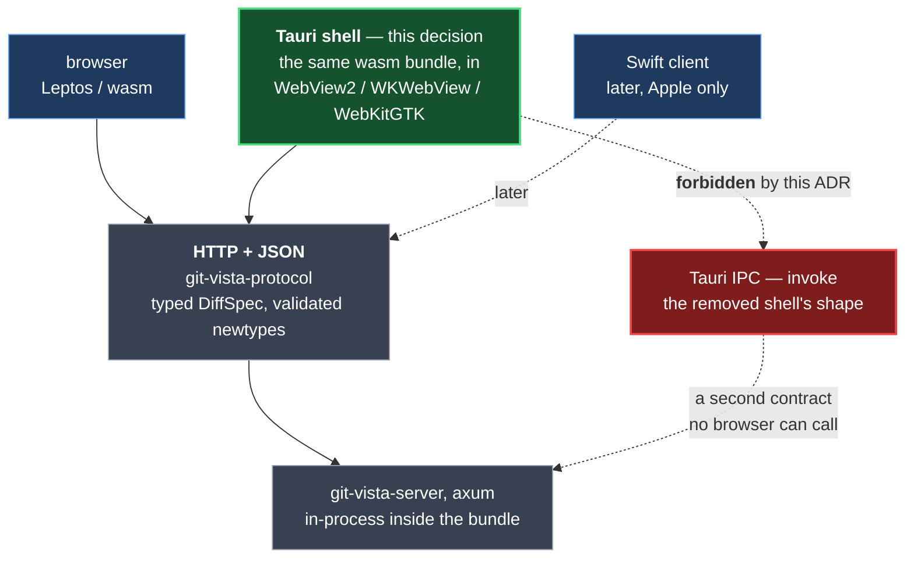

# ADR 0151 — The Windows client is a webview over the HTTP API, not a second UI

**Status:** Accepted (Tom, 2026-09-25)
**Date:** 2026-09-25
**Issue:** [#857](https://github.com/tom2025b/git-vista/issues/857) (M9.1), split out of [#367](https://github.com/tom2025b/git-vista/issues/367)
**Follows:** [0054](0054-linux-desktop-browser-is-the-verification-target.md) (the verification target, and the 2026-08-08 amendment this one argues with), [0002](0002-versioned-api-contract.md) (the versioned API contract), [0005](0005-lan-view-profile.md) (the loopback/LAN listener split), [0029](0029-strict-tier-hard-fail-when-unavailable.md) (hard-fail when a tier is unavailable), [0030](0030-git-process-sandbox.md) (the git-process sandbox)
**Supersedes:** nothing
**Superseded by:** nothing

This record **narrows ADR 0054's 2026-08-08 amendment for Windows only** — see "The
stated preference this argues against" below. It does not supersede 0054, whose body,
verification target and iPad deferral all stand. 0054 is not edited here; ADRs are
append-only and its back-link is the coordinator's to add.

## Context

M9 is Windows delivery. #858 (diagnose the Windows binary that refuses to start),
#859 (Windows CI) and #860 (audit the platform-conditional code) are all blocked on
this decision, so it is the first brick and it should be no wider than it has to be.

#367 stated the choice and declined to make it, for a stated reason: there was no
Windows box. There is one now — Titan, booted into Windows, which is where this ADR
was written and where every measurement below was taken.

### What the requirement actually is

#367's goal is easy to misread as "be native." It is not. The requirement it gives is
**no self-hosted tunnel**: reaching the app from anywhere but the local desktop meant
an SSH port-forward plus a single-use bootstrap token, and "a dropped tunnel and a
consumed token present identically." That is a failure of *reachability*, and every
option here fixes it the same way — by putting the server on the same machine as the
UI. Native rendering is a separate wish, and it should be priced separately.

### The stated preference this argues against

ADR 0054's amendment of 2026-08-08 records the owner's own words, and they point the
other way:

> "When I revisit this in a year or so I want to add Mac and Windows along with iPad —
> I will do it in Swift. A way to access this without the website at all."

0054 frames that as a *vision, not a commitment*, and a native client as an option
**alongside** the browser rather than a replacement. So this ADR is not filling a
blank. It argues against a preference that is on the record, and it owes a reason.

### What the Phase 13 removal was actually worth

#857 calls Tauri "a return, not a new direction" on the strength of 7 commits of
history. Measured rather than assumed:

```sh
git log --oneline -i --grep=tauri 98450fe6 | wc -l   # 10
git show --shortstat cb4ca646                        # 26 files changed, 171 insertions(+), 3502 deletions(-)
git show --numstat cb4ca646 -- Cargo.lock            # 121  3302  Cargo.lock
git show cb4ca646^:crates/git-vista/src-tauri/src/commands.rs
```

The revision `98450fe6` — `origin/main` as merged into this branch — is **in** the
command, not merely mentioned beside it. Left unpinned, that grep walks back from `HEAD`,
which on this branch includes the commits that carry this ADR, and most of their messages
say "Tauri" — so the count counts itself, and **can climb whenever a revision commit's
own message mentions Tauri**. Not every revision moves it: `6c780bf5` revised this ADR
and the unpinned figure did not budge, because that commit's message happens not to say
the word. That is the failure mode in miniature — a number whose value depends on how the
document describing it was worded. Any figure a document states about the history
containing that document needs a revision argument for the same reason. `--all` is worse
still: it depends on which remote refs a given clone has fetched, and two machines
measured 31 and 40 from the same repository.

The entire removed Rust shell was **32 lines across three files** — `commands.rs` (13),
`lib.rs` (13), `main.rs` (6) — plus a `tauri.conf.json`, a capabilities file, five binary
icons and their README. Of the 3,502 deleted lines, **3,302 were `Cargo.lock`**. Its one
command was a stub:

```rust
#[tauri::command]
pub fn list_commits(path: String) -> Graph {
    let _ = path; // TODO (Phase 4): git_vista_git::walk_history(...)
    layout::layout(Vec::new())
}
```

So the prior art is worth approximately nothing as code. It is worth two things as
lessons, and they point in opposite directions:

1. **The cost that killed it was system dependencies, not Tauri.** CODE_REVIEW.md
   (~line 100) records the removal as a Phase-4 stub that "still cost a whole CI job
   plus WebKitGTK/GTK/appindicator/librsvg system deps and a 5th workspace member."
   That is a *Linux* bill. Whether it carries to Windows is measured below — it does not.
2. **Its architecture is the thing not to repeat.** It reached the backend through
   Tauri IPC, which no browser can call — which is precisely why the axum server was
   built. A shell that returns on that design forks the contract. Decision §2 forbids it.

### What this box adds that #367 could not have

Every fact here was measured on this machine, on 2026-09-25, read-only. Nothing was
installed.

| Fact | Value | Command |
|---|---|---|
| OS | Windows 11 Pro 25H2, build 10.0.26200, AMD64 | `[System.Environment]::OSVersion.Version`; `(Get-ItemProperty 'HKLM:\SOFTWARE\Microsoft\Windows NT\CurrentVersion').DisplayVersion` |
| **WebView2 runtime** | **present, 153.0.4234.48** | `Get-ItemProperty 'HKLM:\SOFTWARE\WOW6432Node\Microsoft\EdgeUpdate\Clients\{F3017226-FE2A-4295-8BDF-00C3A9A7E4C5}'` → `pv` |
| Rust | 1.98.1, host `x86_64-pc-windows-msvc` | `rustc --version`; `rustup show` |
| Targets installed | `x86_64-pc-windows-msvc`, `wasm32-unknown-unknown` | `rustup show` |
| MSVC toolchain | **incomplete** — VS Community 2022 17.14.37628.2 with `VC.Tools.x86.x64` (so `link.exe` exists at `MSVC\14.44.35207\bin\HostX64\x64`), but **no Windows SDK**: `Windows Kits\10\Lib` does not exist, so `kernel32.lib` is unavailable and nothing links | `vswhere.exe -latest -requires Microsoft.VisualStudio.Component.VC.Tools.x86.x64`; `Test-Path "${env:ProgramFiles(x86)}\Windows Kits\10\Lib"` → `False` |
| node / npm / swift | all absent | `Get-Command node,npm,swift` |

The `ProductName` key on this box still reads `Windows 10 Pro`; that value is
famously stale on Windows 11 and the build number is the reliable one.

The load-bearing row is WebView2. **Tauri's only Windows runtime prerequisite is
already satisfied on a stock box, with no install step** — it ships with the OS from
Windows 11 onward. The four-package WebKitGTK/GTK/appindicator/librsvg bill that got
the shell deleted in Phase 13 is a Linux bill and does not carry here. The argument
that removed Tauri from this repository does not re-apply to the platform this
milestone is about.

Two more facts bear on the shape of the work:

- The Rust backend has reportedly linked on Windows at least once. #858 records a
  Windows-side effort on 2026-09-16/17 that produced "a linked ~30 MB binary that
  correctly refuses to start." **This rests on that issue report alone: no producing
  command, commit, branch or build log is recorded here**, and the binary was not
  located, run, or rebuilt for this ADR. It cannot have come from this box's current
  toolchain, which links nothing (see Verification). Cited only for the narrow claim
  that linking has succeeded somewhere, once — and #858 owns establishing even that.
- `wasm32-unknown-unknown` is an installed target here, so the frontend's target is in
  place — subject to the same missing-SDK caveat for anything that must link natively.

### The fact the issue does not frame, and it is the expensive one

#857 asks which GUI toolkit. The measurements say the toolkit is the cheap half.

Measured on this branch **after merging `origin/main` at 98450fe6**, which is PR #856
("gate gv-sandbox and seccompiler `cfg(unix)`, unblock Windows check") — a change that
landed while this ADR was being written and that moves these numbers:

Counted as **attributes**, anchored at line start so doc-comment prose about `cfg(unix)`
cannot inflate the number — an earlier draft of this ADR counted two such comment lines
and said 21:

```sh
git grep -cE '^\s*#!?\[cfg\(unix\)\]' -- crates | awk -F: '{n+=$2} END {print n+0}'        # 17
git grep -cE '^\s*#!?\[cfg\(not\(unix\)\)\]' -- crates | awk -F: '{n+=$2} END {print n+0}' # 2
git grep -cE '^\s*#!?\[cfg\(windows\)\]' -- crates | awk -F: '{n+=$2} END {print n+0}'     # 0
git grep -n "^\[target\.'cfg(unix)'" -- 'crates/*/Cargo.toml'   # 1 — git-vista-server/Cargo.toml:117
```

So: **19 platform-conditional attributes plus one manifest gate, every one of them keyed
on `unix`, and not one that names Windows.** Windows is still defined here only as *the
absence of unix* — it is never a case anyone wrote code for.

What #856 changed is worth stating precisely, and precisely is *not* "it made the package
checkable on Windows" — that is its stated **intent**, and this ADR has not verified the
result (see Verification). Its own manifest comment is careful about the same distinction:
*"This does NOT give the sandbox a Windows story; it makes the REST of the crate checkable
so the real portability gap list is visible instead of stopping here."*

What it did mechanically: the Linux pipeline moved to `bin/gv-sandbox/imp/mod.rs` behind
one `#[cfg(unix)]`, `seccompiler` moved under `[target.'cfg(unix)'.dependencies]`, and
`main.rs` became a trampoline whose non-unix arm is this
([`main.rs:44-51`](../../crates/git-vista-server/src/bin/gv-sandbox/main.rs)):

```rust
#[cfg(not(unix))]
fn main() {
    eprintln!(
        "gv-sandbox is a Linux-only sandbox shim (Landlock + seccomp, \
         M1.13b #66) and does not run on this platform."
    );
    std::process::exit(1);
}
```

That is the right shape, and its own doc comment is explicit that it is not a port:
*"This is NOT a Windows port of the sandbox — it is what makes the REST of the
`git-vista-server` package … checkable on non-unix targets at all."* The shim refuses to
run rather than running unsandboxed, which is the safe direction.

**But the server side of the sandbox has no platform conditionals at all** — a grep for
`cfg(unix)`, `cfg(not(unix))` or `cfg(target_os` across
`crates/git-vista-server/src/sandbox/` (tier selection, probe, spawn, lifecycle, reaper)
returns nothing, and that directory is compiled on every target.

At least one known blocker survives there. `sandbox/capabilities.rs` carries no platform
gate of any kind — its only `cfg` attributes are two `cfg(test)` — and `landlock_abi()`
issues a raw Linux syscall unconditionally
([`capabilities.rs:140`](../../crates/git-vista-server/src/sandbox/capabilities.rs)):

```rust
fn landlock_abi() -> i32 {
    let rc = unsafe {
        libc::syscall(                       // no cfg gate; `libc::syscall` is unix-only
            SYS_LANDLOCK_CREATE_RULESET,
```

So a Windows `cargo check` very likely still fails here, after #856. **Found by reading,
not by building** — nothing compiles on this box (Verification), so this is a code
citation rather than a compiler result, and #859 should expect a gap *list* rather than a
single fix. That is exactly what #856's manifest comment predicted it would expose.

And the boot probe **gates the process**
([`main.rs:223-226`](../../crates/git-vista-server/src/main.rs)):

```rust
// There is no degrade: a verdict other than `Contained` means no server,
// full stop (ADR 0029).
if let Err(refusal) = sandbox::probe::run_at_startup().await {
    eprintln!("error: {refusal}");
    std::process::exit(1);
}
```

`probe.rs`'s own header is equally plain: *"A verdict other than
[`ProbeVerdict::Contained`] refuses to start the server — no degrade, no 'run anyway
with hooks blocked'."* Landlock, seccomp and `bwrap` namespaces have no Windows
equivalent, so that composition cannot succeed there, so a Windows build reaches this
gate and exits — **before binding a listener, by existing and deliberate design.**

This is very likely the mechanism behind #858's binary that "compiled but refuses to
start," and it reframes that issue: the refusal looks like ADR 0029 working, not a port
bug. Stated as a hypothesis with its citation, not a diagnosis — this ADR did not run
that binary, and #858 owns confirming it.

So the real Windows question is not which window the graph is drawn in. It is **what a
Windows build's security posture is when no tier above `Tier::Unsandboxed` can exist**:
hard-fail as ADR 0029 does today, run unsandboxed with disclosure, or restrict the
operation set. #860 owns that call and it needs its own ADR. Until it is made, **no
Windows build boots at all** — which is why Decision §3 puts the server ahead of the
shell rather than treating that order as a preference.

That criterion — *cheapest shell, because the sandbox is the expensive part* — is what
decides this, and it decides it more firmly than #367's "smaller, straighter path" did.

## Decision

### 1. Tauri v2 is the Windows delivery shell

One frontend codebase reaches Windows, macOS, Linux and — later — iPad. The Leptos/wasm
commit graph (pan/zoom, hit-testing, roving focus, virtualized diff) is the hardest
code in the repository and it comes along unchanged rather than being rebuilt.

### 2. The shell is a webview over the HTTP API. Tauri IPC is forbidden

The bundled app runs `git-vista-server` in-process and the webview reaches it over
loopback HTTP, speaking the same `git-vista-protocol` contract as the browser. No
`#[tauri::command]`, no `invoke()`, no second data path — which is exactly what the
removed shell did and the single thing its history warns against.

This **confirms** ADR 0054's amendment rather than revising it (acceptance A3): the
HTTP API remains the durable product surface, and typed, mode-explicit endpoints like
`POST /api/diff/spec` — four named modes, validated newtypes, no implicit HEAD — stay
the right shape. The Tauri shell is one client among several, not the application.

This constraint is what makes the decision reversible, and that is the reason to hold
it even where IPC would be momentarily convenient:



Because every client speaks the same contract, a Swift client added later is an
*additional* consumer, not a fork. Choosing Tauri **over HTTP** therefore keeps the
owner's stated preference alive and makes it cheaper to act on; choosing Tauri over IPC
would have foreclosed it.

### 3. The first Windows artifact is the headless server, not the bundle

The bundle contains the server, and **the server does not currently boot on Windows by
design** — the ADR 0029 probe gate at `main.rs:223-226` exits before binding a listener
on any host where bwrap + Landlock + seccomp cannot compose, which is every Windows host.
#858's binary links and then refuses to start, and that is the most likely reason.

So this ordering is not prudence, it is arithmetic: a Tauri bundle shipped before #860
decides the Windows posture would be a window that opens on a server which exited at
startup. Wrapping an unproven server in a shell also hides the failure behind that
window — the same defect, harder to read.

So the order is **#858, then #860, then #859, then the bundle**: diagnose why it refuses
to start, decide the Windows sandbox posture, then build it in CI, and only then wrap it.

#860 comes before #859 deliberately. A CI job that builds a Windows binary which exits at
startup is green and proves nothing — this repository has a standing rule against exactly
that shape of test — and #860's answer may change what #859 is even supposed to build.
This is not a hedge or a rival option — the
server work is on the critical path to Tauri regardless, and it is the only step that
produces information. As a side effect the intermediate artifact is already useful on
the local desktop: server plus browser over loopback needs no port-forward and no token
crossing a network, which is #367's actual requirement met for the desktop case while
the shell is still being built.

### 4. iPad is deferred — explicitly, and on this path

**Deferred.** Not in M9, not scheduled, no intermediate access mechanism — which leaves
ADR 0054's position ("iPad support is deferred, full stop") unchanged.

What this decision adds is that the deferral now has a destination: Tauri v2 targets
iOS, so iPad arrives on the same codebase rather than needing a third UI. 0054's third
consequence stands as written — the touch code is dormant-until-then, not orphaned, so
ADR 0011's pointer-aware 12px slop and the `drag_threshold("touch")` path are kept for
the same reason 0054 gave, with a nearer destination than it had.

### 5. Swift is rejected for Windows — not retired

Swift loses here for one reason, stated plainly: **there is no SwiftUI on Windows, so
the one platform this milestone is about is the one platform Swift cannot serve without
a second UI stack** — and the graph frontend is rebuilt per framework, not ported. Its
strengths (real touch and Pencil, platform pickers, keychain, share sheet) are entirely
in the half of #367 that is out of scope for M9.

This ADR therefore does **not** decide macOS or iPad. It decides Windows, where Swift's
case is weakest, and §2 leaves the Apple question open on better terms than it found it.

## Alternatives considered

**B — native Swift clients (#857's option B, and the owner's stated instinct).**
Rejected for Windows: no SwiftUI there means two-to-three UI codebases against one API
instead of one, and the most intricate code in the repository is what gets rewritten.
Deferred, not refused, for Apple platforms — §2 keeps that door open.

**C — ship the plain server binary plus the browser, permanently, with no shell.**
Rejected as the *destination*, adopted as the *first step* (§3). It never satisfies
#367's "without the website at all," and on any device that is not the local desktop it
leaves the tunnel-and-token failure exactly where it was. But it is the only option that
is on the critical path of both of the others, so it is where the work starts.

**D — keep Git-Vista Linux-only and close M9.** Rejected: the owner has stated the
requirement twice, in #367 and in 0054's amendment, and has now provisioned hardware for
it. Recording "no" against that would need a reason this ADR does not have.

**E — Tauri, reached through IPC, as the removed shell did.** Rejected in §2. It is the
cheapest thing to build and the most expensive thing to own: two contracts, one of which
no browser can call, and every endpoint implemented twice.

## Security-model annotation

0054's amendment left a question explicitly for this ADR: *"bundling the server into a
native app does touch this boundary, because the loopback/LAN distinction ADR 0005 rests
on is drawn around a listening socket. An in-process server changes what that socket is
and who can reach it."*

Answered as far as this decision goes, with the rest named as open:

- **The socket survives.** §2 puts the webview on loopback HTTP rather than IPC, so ADR
  0005's boundary is still drawn around a real listening socket and its loopback/LAN
  split is intact. An IPC shell would have dissolved that boundary — a second reason for
  §2 beyond contract hygiene.
- **The bundled server binds loopback only.** The LAN view profile (0005) is a
  deliberate second listener, and shipping it enabled by default inside a desktop app
  would widen the boundary silently. It stays off unless separately decided.
- **Today's Windows posture is hard-fail, and it is inherited rather than chosen.**
  Landlock, seccomp and `bwrap` are Linux mechanisms with no Windows equivalent, so the
  boot probe cannot return `Contained` and `main.rs:223-226` exits before binding a
  listener — ADR 0029's rule, applied to a platform it was not written for. Since #856
  the `gv-sandbox` shim itself also exits 1 on non-unix rather than running unsandboxed,
  which is the safe direction; but `src/sandbox/` — tier selection, probe, spawn,
  lifecycle — still carries no platform conditional at all.
- **Open, and not decided here:** whether that inherited hard-fail is the *intended*
  Windows posture, or whether a Windows build should run unsandboxed with disclosure, or
  restrict the operation set to what it can defend. That is #860's audit and needs its
  own ADR. **This ADR does not authorise a silently unsandboxed Windows build**, and it
  notes that "make it boot" is the one way that decision could get made by accident.

## Consequences

- **#858, #859 and #860 unblock, and their order is now fixed** by §3: **#858 diagnose,
  #860 decide the posture, #859 CI, then bundle.** #860 is on the critical path rather
  than beside it — nothing ships on Windows until the posture question it owns is
  answered, because the boot gate is what stops the server today.
- **#859 needs a toolchain this box does not have.** The Windows SDK is absent, so
  nothing links here at all; and `cargo` run from Git Bash silently picks up coreutils
  `link.exe` instead of MSVC's. Both cost a session if undocumented (see Verification).
- **Tauri returns as a 13th workspace member**, not a 5th — the workspace listed four
  crates when the shell was deleted and lists twelve now (`Cargo.toml`, `[workspace]`).
  The CI job it costs is a real cost, and on Windows it buys a WebView2 target that needs
  no system packages.
- **The Phase-13 dependency bill is not re-incurred on Windows, and is re-incurred on
  Linux.** WebKitGTK/GTK/appindicator/librsvg return for any Linux Tauri build. Since the
  Linux desktop browser remains the verification target (0054, untouched), that bill can
  be deferred until a Linux bundle is actually wanted.
- **`POST /api/diff/spec` and its typed siblings become load-bearing**, not tidy. Every
  endpoint is a contract with a consumer this repository does not compile.
- **The graph frontend is written once**, and stays the thing worth optimising for all
  three client shapes.
- **A native-feel ceiling is accepted.** It is a webview; native polish is limited to what
  the web layer gives. That is the price of not writing the graph twice, and it is the
  concrete thing given up by not choosing Swift.

## What this ADR does not decide

macOS and iPad client shape beyond §4's deferral; the Windows sandbox posture (#860); the
installer and code-signing story; whether a Linux bundle is ever built. Each needs its own
record.

## Verification

No code changed; nothing was built, installed or configured. This is a decision record.

Every Windows fact above is a read-only measurement taken on this box on 2026-09-25 and
carries the command that produced it, in the table or in the fenced block beside it. The
repository facts — commit stats, removed sources, `cfg` counts, workspace membership —
are reproducible with the `git` and `grep` invocations quoted inline.

### The build check, attempted three ways — and what stopped it

PR #856's stated purpose was to unblock `cargo check` on Windows, so whether it now
builds here is evidence #859 wants. It was attempted. **It does not build on this box,
for a reason that is not git-vista's**, and the three failures are worth recording
because two of them are traps rather than results:

All three ran the same cargo invocation, from the repository root, against the default
host target `x86_64-pc-windows-msvc`:

```
cargo test -p git-vista-server --test adr_index_matches_the_files
```

What differed is the environment it was launched from. The three launches, verbatim:

```sh
# 1. Git Bash, cwd = repository root
cargo test -p git-vista-server --test adr_index_matches_the_files
```

```powershell
# 2. Windows PowerShell 5.1, no MSVC environment
Set-Location 'C:\Users\Admin\$HOME\projects\git-vista'
cargo test -p git-vista-server --test adr_index_matches_the_files
```

```powershell
# 3. Windows PowerShell 5.1 — vcvars64 and cargo inside ONE cmd child, so the
#    environment vcvars sets is still live when cargo runs.
Set-Location 'C:\Users\Admin\$HOME\projects\git-vista'
cmd /c '"C:\Program Files\Microsoft Visual Studio\2022\Community\VC\Auxiliary\Build\vcvars64.bat" >nul 2>&1 && cargo test -p git-vista-server --test adr_index_matches_the_files'
```

| Launch | Result |
|---|---|
| 1 — Git Bash | `link: extra operand '…rcgu.o'` / `Try 'link --help' for more information.` — that is **GNU coreutils `link` from Git Bash**, shadowing the MSVC linker on `PATH`. A misleading failure that says nothing about the code. |
| 2 — plain PowerShell | ``error: linker `link.exe` not found`` + *"please ensure that Visual Studio 2017 or later … were installed with the Visual C++ option"* — a plain shell has no MSVC environment. |
| 3 — `cmd /c` with vcvars64 and cargo together | The correct linker is found and named by cargo in the failing command line — `C:\Program Files\Microsoft Visual Studio\2022\Community\VC\Tools\MSVC\14.44.35207\bin\HostX64\x64\link.exe` — and then: `LINK : fatal error LNK1181: cannot open input file 'kernel32.lib'`. |

Launch 3's shape is the whole point of writing it out: both halves are inside the single
`cmd /c` string. `vcvars64.bat` in its own `cmd /c`, followed by cargo in the parent
shell, sets nothing that survives — and Windows PowerShell 5.1 has no `&&` operator at
all, so that spelling would not even parse. An earlier draft of this ADR wrote it the
wrong way round; the run itself was correct, the transcription was not.

The MSVC linker path above is quoted from cargo's own `note: "…link.exe" "/NOLOGO" …`
line in that third run; it was not looked up separately.

The first failing packages were `proc-macro2`, `thiserror`, `serde_core`, `getrandom`,
`heapless`, `quote`, `crc32fast` and `parking_lot_core` — all third-party **build
scripts**, none of them git-vista.

`kernel32.lib` ships with the **Windows SDK**, a separate VS component from the C++
tools, and it is not installed — `Test-Path "${env:ProgramFiles(x86)}\Windows Kits\10\Lib"`
and the `$env:ProgramFiles` equivalent both return `False`. So this box can compile Rust
but cannot link *any* native Windows binary; a hello-world would fail identically.

Two things follow, and the second matters more than the first:

1. **Whether #856 actually unblocked the Windows check is still unverified**, here or
   anywhere. This ADR does not claim it did; it cites only what #856's code *is*.
2. **#859 will need the Windows SDK and a correctly initialised MSVC environment before
   it can test anything**, and the Git Bash trap will waste a session if it is not
   written down. Installing the SDK is the owner's call and was not done.

Nothing was installed, built, or configured for this ADR. `vcvars64.bat` only sets
environment variables in a subshell from an already-installed toolchain.

The ADR-index invariant was therefore also checked by reproducing
`tests/adr_index_matches_the_files.rs`'s four assertions in shell rather than by running
them: file-number ↔ row-number in both directions, no duplicate rows, each row's link
target resolving to the real filename, and each H1 parsing under that test's
`heading_number` rule. CI will run the real test on Linux.

One measurement was deliberately **not** taken: why #858's binary refuses to start. That
is #858's job. The hypothesis offered above (the ADR 0029 boot gate) is labelled as one.

**Signed:** max · 2026-09-25T14:05:00-04:00
