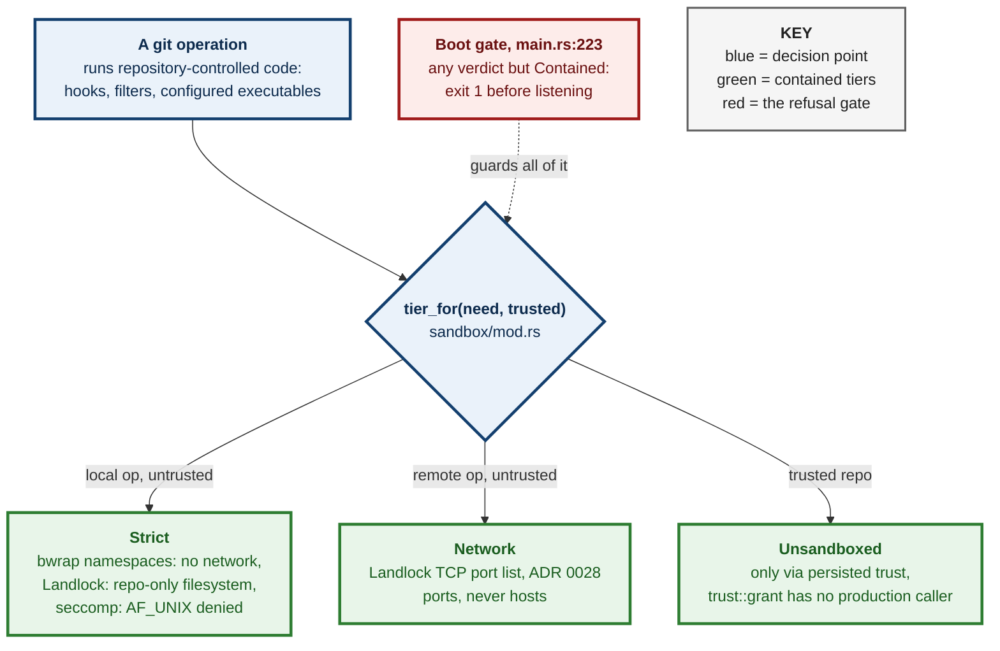
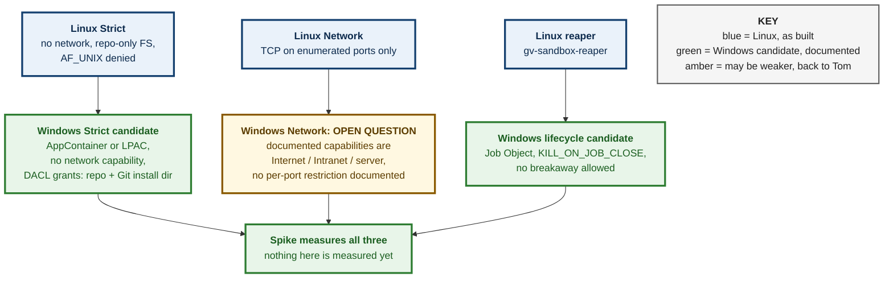
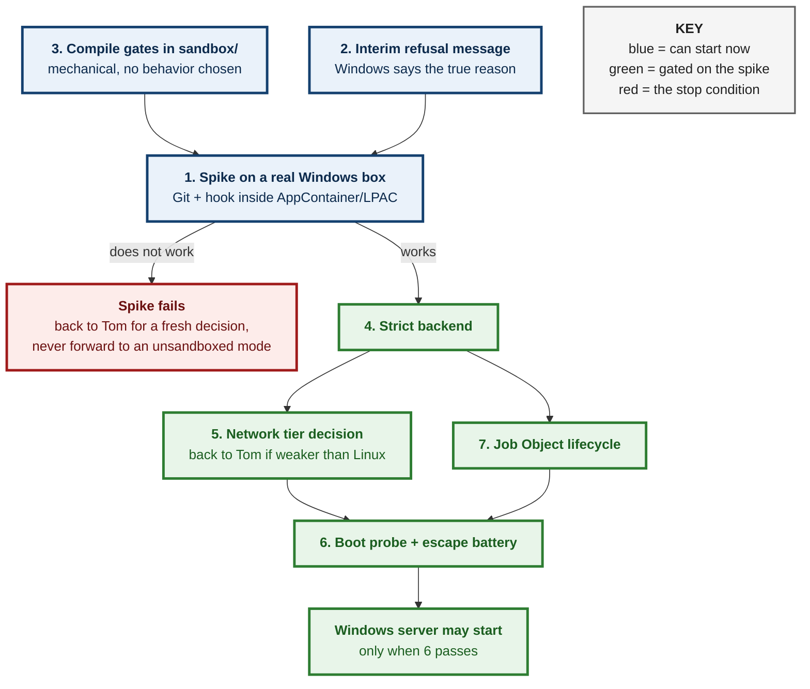

# ADR 0152 — Windows containment is a native backend, and Windows refuses to start until it exists

**Status:** Proposed — direction chosen by Tom (option (b), 2026-09-25 22:20 EDT); this document's details await his read
**Date:** 2026-09-25
**Issue:** [#860](https://github.com/tom2025b/git-vista/issues/860) (M14.4)
**Follows:** [0029](0029-strict-tier-hard-fail-when-unavailable.md) (hard-fail when the Strict tier is unavailable), [0030](0030-git-process-sandbox.md) (the git-process sandbox and its three tiers), [0151](0151-the-windows-client-is-a-webview-over-the-http-api.md) (the Windows client is a webview over the HTTP API)
**Supersedes:** nothing
**Superseded by:** nothing

## Context

ADR 0151 chose how Git-Vista reaches Windows: a Tauri v2 window around the
existing web UI, talking to an in-process `git-vista-server` over loopback
HTTP. That makes the server itself the thing that has to run on Windows.

The server will not start there today, and that is by design. Before it binds a
listener or runs any repository code, `main.rs:223` calls
`sandbox::probe::run_at_startup()` and exits with status 1 on any verdict other
than `Contained`. The comment above that call says why: *"There is no degrade: a
verdict other than `Contained` means no server, full stop (ADR 0029)."*
`Contained` means bubblewrap, Landlock and seccomp compose on this host.
None of the three exists on Windows.

Why the sandbox exists at all: Git runs code the repository controls (hooks,
filters, config keys that name executables). `SECURITY_MODEL.md` treats that code
as hostile. On Linux it runs inside one of three tiers (ADR 0030):

- **Strict**: no network, filesystem limited to the repository.
- **Network**: Landlock allows TCP only on an enumerated port list (ADR 0028).
- **Unsandboxed**: reachable only through persisted repository trust, and
  `trust::grant` has no production caller today (ADR 0030 §3).

The #860 investigation (codex on titan, 2026-09-25; every citation re-checked
against `main` before it was posted to the issue) re-read ADRs 0029 and 0030
and found a gap. ADR 0029 weighed hosts that *lack a prerequisite an operator can
install* (bubblewrap, user namespaces, a Landlock floor). It did not weigh a
platform where *no implementation exists at all*. Its reasoning (never degrade,
never silently pick a weaker tier, refusal must survive error propagation) still
applies to Windows. Its remedy ("install bubblewrap") does not. So Windows was a
genuine new decision, put to Tom as three options.

The diagram at the end of this section shows the Linux containment this has to
be matched against.

## Decision

1. **Direction: Windows gets a real, native containment backend** (option (b),
   chosen by Tom on 2026-09-25). Hostile repository code on Windows runs inside
   an OS-enforced boundary comparable in intent to Linux's Strict tier, never
   with the server account's own access.

2. **ADR 0029's reasoning applies to Windows unchanged.** No degrade, no silent
   weaker tier, no "run it anyway and warn". A refusal must survive error
   propagation; a failed observation must never read as a permissive answer.

3. **Until that backend exists and passes its own escape battery, Windows refuses
   to start.** This is option (a), kept as the *interim*, not rejected. One part
   of it is new work: today's refusal text can tell a Windows user to install
   `bwrap`, which is wrong advice on Windows. The interim refusal needs a
   Windows-specific message that names the real reason: "no Windows sandbox yet".

4. **Linux behavior does not change.** Every Windows change is additive and
   gated to non-unix targets (`cfg(windows)` / `cfg(not(unix))`), following the
   pattern #862 established. The seven required CI checks all run on Linux, and
   they remain the merge gate for every Windows PR. A Windows change that alters
   Linux behavior is a defect, whatever else it achieves.

5. **A feasibility spike gates all backend work, with a stated stop condition.**
   Before anything else is built, measure on a real Windows box whether Git for
   Windows runs inside an AppContainer or Less-Privileged AppContainer (LPAC)
   token that has only the grants the Strict tier would give it: read/execute on
   Git's own install directory, read/write on the repository, no network
   capability. Git for Windows is MSYS2-based and runs hooks through its bundled
   `sh.exe`, so "does Git's own runtime tolerate the container" is a real
   unknown, not a formality. The spike must exercise:
   - `git status` / `git commit` on a repository inside the grant,
   - a hook firing (`pre-commit` via Git's `sh.exe`),
   - a read of a file *outside* the grant, which must be denied,
   - a network connection attempt, which must be denied,
   - a credential-helper call, to see what happens.

   **Stop condition:** if Git for Windows cannot do this work inside the
   container with only those grants, the spike reports that to Tom and the
   direction goes back to him for a fresh decision. It does **not** fall through
   to an unsandboxed mode (option (c)), and it does not quietly widen the grants
   until something works.

6. **Candidate mechanism mapping: documented by Microsoft, not measured here.**
   Nothing below has been run on this project's hardware; the spike measures it.

   - **Strict → AppContainer/LPAC token with no network capability**, plus DACL
     grants on the repository and Git's install directory. Microsoft documents
     that an AppContainer's effective access is the *intersection* of the
     user's rights and the container's own SIDs. Access has to be granted
     explicitly, and a container without the network capability "cannot access
     the network" ([Launch an AppContainer](https://learn.microsoft.com/en-us/windows/win32/secauthz/implementing-an-appcontainer)).
     LPAC is stricter still: it needs explicit capabilities even for registry reads
     and COM (same page).
   - **Network → an open question the spike must answer.** Linux's Network tier
     allows TCP only on an enumerated port list. Microsoft describes AppContainer
     network access as coarse capabilities: *"Granular access can be granted
     for Internet access, Intranet access, and acting as a server"*
     ([AppContainer isolation](https://learn.microsoft.com/en-us/windows/win32/secauthz/appcontainer-isolation)).
     Neither page describes a per-port restriction. **If Windows can only express
     "outbound allowed" rather than "outbound on these ports", the Windows Network
     tier is a weaker boundary than Linux's.** That comes back to Tom, named as
     such, before the Network tier is built. It is not decided here and not
     assumed to be equivalent.
   - **Process lifecycle (the reaper's job) → a Job Object** with
     `JOB_OBJECT_LIMIT_KILL_ON_JOB_CLOSE` and neither breakaway limit set, so
     every descendant stays in the job and dies with it. Children created with
     `CreateProcess` join the parent's job by default
     ([Job Objects](https://learn.microsoft.com/en-us/windows/win32/procthread/job-objects)).
   - **Unsandboxed → unchanged.** It is still reachable only through persisted
     trust, which still has no production caller. This ADR does not add a
     Windows route to it.

The diagram at the end of this section maps each Linux tier to its Windows
candidate. The one link that may be weaker is marked amber.

## Alternatives considered

**(a) Refuse on Windows permanently.** Rejected as the *permanent* answer: it
means no native Windows server, ever, and 0151 has already committed to
delivering one. Kept as the **interim** (Decision §3).

**(c) Ship an explicitly consented, unsandboxed Windows mode.** Rejected. Without
containment, repository-controlled code runs with the server account's
privileges. It can read reachable files and credentials, reach the network,
modify other repositories, and leave processes running. Loopback binding,
bootstrap authentication, origin checks and CSRF protect the API boundary; they
do not contain a hostile hook that an authorized operation triggers.
`SECURITY_MODEL.md` draws exactly that line. There is also nothing to switch on:
`trust::grant` has no production caller (ADR 0030 §3). A consent flow would be
new security surface built to carry a posture ADR 0029 already refused.

**Degrade to a weaker tier when containment is unavailable.** Rejected for the
reason ADR 0029 gives: it hands a weaker policy to exactly the operations the
stronger one exists for.

**A Job-Object-only wrapper, labelled "sandboxed".** Rejected, and named here
because it is the easy adjacent mistake. Job Objects group processes, enforce
limits and kill trees. Microsoft notes that *"security limits must be set
individually for each process"*
([Job Objects](https://learn.microsoft.com/en-us/windows/win32/procthread/job-objects)).
A job does not restrict what files, credentials or network a process can reach.
Calling it a sandbox would be a boundary that is "silently narrower than it
sounds", the exact failure `SECURITY_MODEL.md`'s *Sandbox Mechanism Boundaries*
section exists to prevent. A Job Object is the right *lifecycle* tool (Decision
§6), never the containment itself.

## Consequences

- **No native Windows server until the backend ships.** The interim is an honest
  refusal, not a working product.
- **This is weeks of work, not days.** codex's #860 estimate was multiple
  engineer-weeks, plausibly a month or more with validation. That is an
  engineering estimate, not a measured schedule.
- **The spike can end the direction.** If Git for Windows cannot run inside the
  container, Decision §5's stop condition sends it back to Tom rather than
  forward to a weaker mode.
- **The Windows Network tier may end up weaker than Linux's**, and if it does,
  that is decided openly, not discovered later.
- **Linux is untouched throughout** (Decision §4), and Linux CI stays the gate.
- **Compile blockers inside `sandbox/` are now unblocked for mechanical fixing.**
  They were held until this direction was chosen: `capabilities.rs:140`'s
  ungated `libc::syscall`, `probe.rs:320`'s ungated `PermissionsExt::set_mode`,
  `trust.rs:58`'s ungated `OsStrExt`. Gating them compiles under option (b) and
  does not choose any security behavior.

**Work breakdown**, to be filed as M14 issues once this ADR lands, so each can
cite it:

1. **Spike: Git for Windows inside AppContainer/LPAC** (gates 4 to 7).
2. **Interim Windows refusal message:** accurate, names "no Windows sandbox yet".
3. **Compile gates in `sandbox/`:** the three blockers above.
4. **Windows Strict backend.**
5. **Windows Network tier decision:** back to Tom if it is weaker than Linux.
6. **Windows boot probe and escape battery:** behavioral probes replacing the
   Linux capability checks, proving denial rather than asserting it.
7. **Job Object lifecycle:** the reaper's Windows equivalent.

The diagram at the end of this section shows the order and where the stop
condition sits.

## What this does not decide

- The Windows Network tier's shape (Decision §6, left open for the spike).
- AppContainer versus LPAC. The spike measures what Git needs; LPAC is preferred
  if Git runs in it, because it grants less by default.
- macOS. #367's non-Windows scope is untouched.

## Evidence and its limits

Nothing in this record has been run on Windows. The server source citations
(`main.rs:223`, `capabilities.rs:140`, `probe.rs:320`, `trust.rs:58`) were
re-read on `main` at `30bbd565`. The Windows mechanism statements quote
Microsoft's documentation, fetched 2026-09-25; they describe documented
behavior, not measured behavior. The spike (work item 1) is where they become
measurements.

**Signed:** max · 2026-09-25T22:40:00-04:00
