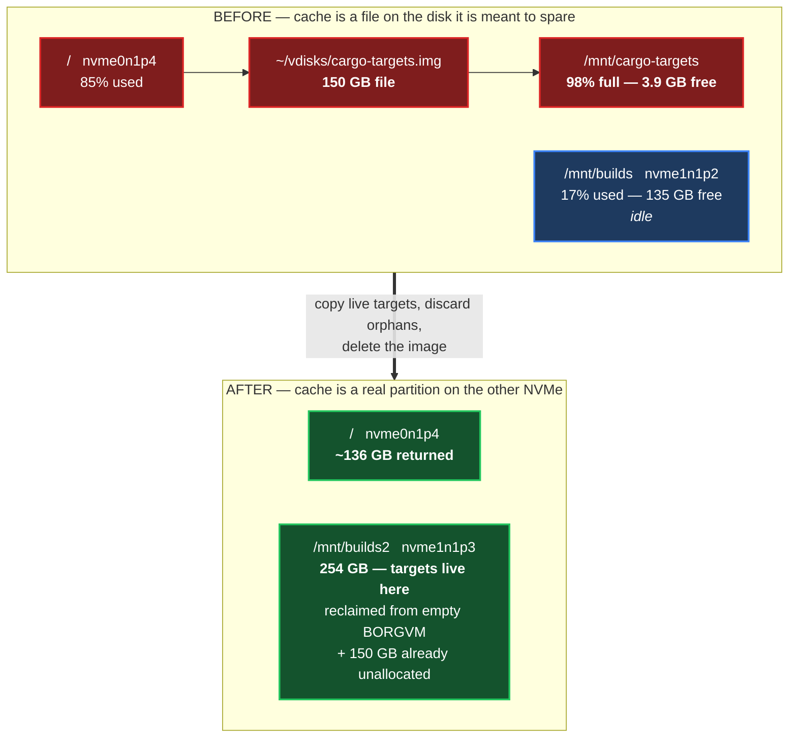

# 0153 — The build cache disk is discovered, not named

**Status:** Accepted — implemented in PR #886; the loop image's retirement is an operator step outside this repository.

## Context

Git-Vista's worktrees do not build into `target/` beside the checkout. `target/`
is a symlink onto a fast disk, because this repository's gates are heavy and the
root filesystem is neither the fastest disk on the box nor the one with room to
spare. `dev worktree` creates that symlink when it makes a worktree.

Until 2026-09-28 that disk was `/mnt/cargo-targets`: a 150 GB ext4 **loop image**
at `~/vdisks/cargo-targets.img`, itself a file on the root filesystem. It reached
**98% — 3.9 GB free of 147 GB** — while `/mnt/builds`, a real partition on the
second NVMe, sat at 17% with 135 GB free.

The loop image is the worse of the two in a way that is easy to miss: space freed
*inside* it returns nothing to `/`, because the image file is already allocated at
full size. Only deleting the image returns anything, and it returns ~136 GB at once.



## Decision

**`dev worktree` discovers the cache disk instead of naming one.** It walks a list
of known cache roots and uses the first whose mountpoint is genuinely mounted:

```bash
for root in /mnt/builds/targets /mnt/cargo-targets/targets; do
  if mountpoint -q "$(dirname "$root")" 2>/dev/null; then
    dest="$root/$name"; break
  fi
done
```

The pre-existing contract is deliberately unchanged: **a missing cache disk is a
slower build, never a failure.** With no cache root mounted, `dev` prints a NOTE
and lets cargo use a plain local `target/`.

`testbed_target_for` needed no change. It already derives its answer from the
worktree's own `target/` symlink *text*, so it follows wherever that points — the
property ADR 0130-era work called out as deliberate, now paying for itself.

## Why not simply edit the path

The literal path appears in **16 copies** of `dev`, one per worktree. Editing them
all makes 16 checkouts dirty, several on live lane branches, to encode a fact that
has now changed twice. The list makes the next move a one-line edit in one place,
and the machine-specific truth stays where it belongs — `~/.claude/hosts/titan.md`.

## The failure this actually prevents

Nothing would have *broken*. `mountpoint -q /mnt/cargo-targets` simply becomes
false once the image is gone, `dev` takes its "not mounted" branch, and every new
worktree builds on the system disk — no error, no red test, just the quiet loss of
the fast disk and the slow refilling of the partition this change exists to drain.
That is the same class of miss the comment directly above the block already warns
about, which is why the fix belongs in the same place as the warning.

## Consequences

- One `dev` for both boxes and for the next relocation; no per-worktree edits.
- **The cache moved twice on 2026-09-28, and the second move is the one that
  stands.** The first landed everything on `/mnt/builds`, which took it to 86%
  (24 GB free) — tighter than the disk it replaced, and an honest bad outcome.
  Reading the *physical* partition layout rather than `lsblk`'s number order then
  showed `nvme1n1` already carried **150 GB unallocated**, adjacent to a 109 GB
  `BORGVM` partition that had never held a byte. Those combined into `BUILDS2`
  (254 GB), and the targets moved there. Final state: `/mnt/builds2` 47% with
  130 GB free, `/mnt/builds` back to 17% with 135 GB free.
- **`lsblk` lists partitions by number, not by position.** Reading it as physical
  order produced a wrong plan — "grow BUILDS into the space after it" — when
  BUILDS is in fact the *last* partition and the free space lies before it, where
  growing would mean moving a partition's start under 139 GB of live data.
  Always derive layout from `/sys/block/<dev>/<part>/start`, never from list order.
- This is exactly why the root list exists rather than a literal path: the disk
  changed twice within a few hours, and only one line had to change each time.
- Orphaned target directories (24.4 GB, nothing referencing them) were **not**
  copied. They are discarded with the image rather than deleted separately.
- Retiring the image needs root and is left to the operator. This repository's
  change is safe and complete whether or not that step is ever taken.

## Verification

- `dev worktree` against a throwaway path linked to `/mnt/builds/targets`.
- `cargo check -p git-vista-core` finished in **2.89 s** against a relocated
  target — a *warm* cache, which is the evidence that mattered: it proves the copy
  preserved usable build state rather than merely the right number of bytes.
- Coverage audited directory by directory before anything was discarded, with
  control queries in both directions: zero `target` symlinks still pointing into
  `/mnt/cargo-targets`, sixteen pointing into `/mnt/builds`. The three
  `backupsage-*` entries that a loose glob flagged as referenced resolve to
  `~/.cargo-targets`, a different disk, and are genuinely stale duplicates.

**Signed:** max · 2026-09-28T09:25:00-04:00
