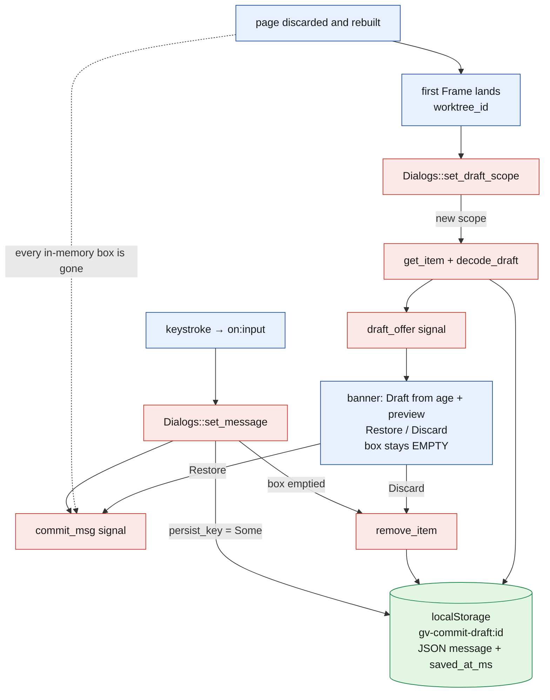
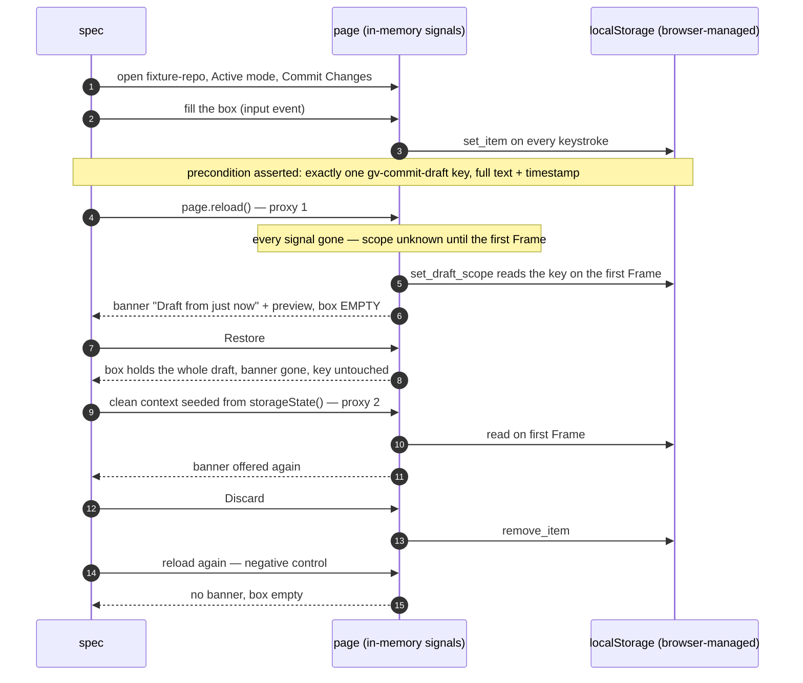
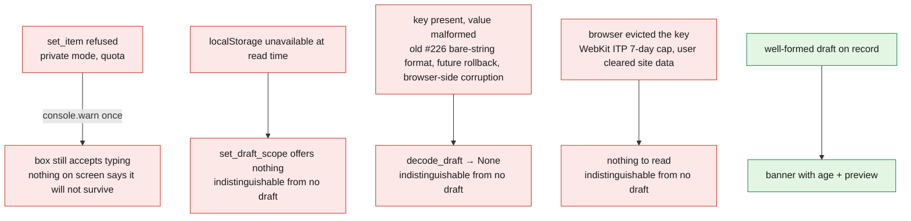

# Issue #396 — does the commit draft survive the page being thrown away?

Verification report, started 2026-09-08 from assigned base `0944c523` and
re-verified 2026-09-09 after rebasing onto `fb3708aa`. A verification, not a
redesign: no product code was changed.

## The short answer

- **Where the draft lives:** `localStorage`, under `gv-commit-draft:<worktree_id>`,
  as JSON `{ message, saved_at_ms }`, written synchronously on every keystroke.
  That is the storage class that survives a page being discarded and rebuilt.
  `sessionStorage` and in-memory state would not; ADR 0057 moved it off
  `sessionStorage` on 2026-08-17.
- **Closest reachable proxy for an iPad Safari suspension — passes.** A full
  page reload discards every in-memory app signal while retaining the origin's
  `localStorage`. The rebuilt commit dialog offers the draft back through the
  aged banner, the box stays empty, Restore fills it with the whole text,
  Discard deletes the key, and a further rebuild offers nothing. A second
  check repeats the read path in a clean browser context seeded from a
  serialized storage snapshot. `ci/browser/tests/commit-draft-reload.spec.mjs`.
- **What this does NOT prove:** the issue's criterion is *iPad Safari*, and
  its second criterion says *real iPad, not inferred*. Chromium on Linux
  cannot establish either. Both stay open.
- **Criterion three is not met today:** "if the draft cannot be recovered, the
  UI says so plainly." Every path on which a draft is lost or unreadable is
  silent in the UI. Details and the change needed are below.

Verdict for the issue: **`Refs #396`, not `Closes`.**

## Where the draft state is held, exactly

| State | Holder | Survives a page rebuild? |
|---|---|---|
| The text being typed | `Dialogs::commit_msg` (`RwSignal<String>`) | No — in memory |
| Which repository it belongs to | `Dialogs::draft_scope` | No — in memory; re-learned from the first Frame after rebuild |
| The offer shown in the banner | `Dialogs::draft_offer` | No — in memory; re-derived from storage on the first Frame |
| The persisted copy | `localStorage["gv-commit-draft:<worktree_id>"]` | **Yes** — browser-managed persistent origin storage |
| The amend message | `Dialogs::amend_msg` | No — in memory, and never persisted by design (#224) |

Files: `crates/git-vista/src/features/dialogs/signals.rs` (the `localStorage`
calls, wasm-only), `crates/git-vista/src/features/dialogs/commit.rs`
(`persist_key`, `encode_draft`, `decode_draft`, host-tested),
`crates/git-vista/src/features/dialogs/core.rs` (`commit_draft_key`,
`draft_scope_action`), `crates/git-vista/src/dialogs/commit.rs` (the banner
and the `<textarea>`), `crates/git-vista/src/app/mod.rs` (the effect that
feeds every Frame's `worktree_id` into `set_draft_scope`).



Red boxes are in memory and die with the page. The one green box is what a
rebuild can read back. The path from green to the textarea always goes
through the banner — ADR 0057's "never silent" ruling.

## What the proxy test does, and why it is only a proxy

iPad Safari can discard a background page; on return, the app must rebuild
without its old in-memory state and consult browser-managed storage. Chromium
on titan cannot reproduce Safari's suspension policy. The two checks it can
run against the storage/read-back boundary are:



Proxy 1 is the shape of a tab rebuilt on return. Proxy 2 proves that the app can
reconstruct the offer in a clean context from serialized storage without any
old app signal; because Playwright supplies that snapshot explicitly, it does
**not** prove browser-process crash recovery from disk. Neither proxy is WebKit
or iOS, and neither exercises Safari's own eviction and storage policies.

### Verification commands and result

Run from this checkout on 2026-09-09:

```text
ci/browser/run.sh commit-draft-reload harness-selfcheck --grep '#396'
4 passed (49.0s)

cargo test -p git-vista --bin git-vista-ui draft
9 passed; 0 failed; 1084 filtered out

node --check ci/browser/tests/commit-draft-reload.spec.mjs
node --check ci/browser/tests/harness-selfcheck.spec.mjs
node --check ci/browser/tests/helpers.mjs
all exited 0
```

### The assertion is proven able to go red, three ways

`harness-selfcheck.spec.mjs` runs the spec's own `expectDraftOffered` against
the mechanism broken three different ways, and requires each to fail for its
own named reason:

| Mutation | Kind | Must fail on |
|---|---|---|
| `localStorage.clear()` before the rebuild | mechanism removed — what a `sessionStorage` or never-written draft looks like after a suspension | "must be OFFERED back" |
| stored `message` swapped before the rebuild | wrong content behind a correct banner — the shape of a scope-misfiling bug | "must preview the stored text" |
| the box's `value` setter hooked so every `""` becomes the draft | silent auto-fill behind a correct banner — the exact failure ADR 0057 vetoed | "offered, never auto-filled" |

Two lessons paid for while writing them, kept here so the next person does
not pay again:

- **A one-off DOM edit is not a mutation of this modal.** The commit dialog's
  view re-renders whenever the status read lands and rebuilds the `<textarea>`
  from the signal, so `textarea.value = draft` was undone within seconds and
  the self-check reported "passed after the mutation" three runs out of three.
  A `MutationObserver` on insertion was no better: Leptos assigns `prop:value`
  after the element is in the tree. Only hooking the property setter itself
  survived the re-render.
- **The Restore step failed once in the first fifteen local runs** (box empty
  for the full 10 s after the click; banner state not captured) and did not
  reproduce in fourteen further runs, including eight back-to-back repeats of
  the same step with click instrumentation. Not diagnosed. The spec now
  attaches the modal's state (banner count, stored keys, status texts, box
  value) to that step's failure message, so a recurrence in CI will say which
  of "the click never reached the handler", "the offer was re-seeded" or
  "Discard was hit" it was. It is recorded here as an open observation, not
  waved away.

## Against the issue's three criteria

| Criterion | State | Evidence |
|---|---|---|
| A commit message in progress survives an iPad Safari background-tab suspension and a return to the tab | **Not verified.** The storage class is the right one and the read-back path works on a rebuilt page (Chromium). | the spec above |
| Verified on a real iPad, not inferred from desktop Safari | **Not met — structurally cannot be met on titan.** | — |
| If the draft cannot be recovered, the UI says so plainly rather than silently presenting an empty field | **Not met.** Every loss path is silent in the UI today. | below |

### Criterion three: where the UI is silent today



Only the green path speaks. The four red ones all end in an empty box with
no explanation — precisely "silently presenting an empty field". Two of them
(A and C) the client can actually *know* about; B it can know at read time;
D is genuinely indistinguishable from "no draft" without a second marker.

What would need to change for criterion three, sized as a small, separate PR:

1. A persistence state on `Dialogs` — say `DraftPersistence::{Saving,
   Refused, Unavailable}` — set by the write path (where
   `warn_persist_failed_once` fires today) and by the read path (when
   `local_storage()` is `None`), rendered as one plain line inside the commit
   modal: *"This browser refused to save the draft. It will not survive a
   reload."* The copy belongs in `features/dialogs/commit.rs` so it is
   host-tested.
2. Distinguish "key present but unreadable" from "no key" in
   `set_draft_scope`: `decode_draft` returning `None` over a `Some(raw)` is a
   different fact from `get_item` returning `None`, and today they collapse.
   Surface the first as its own line: *"A saved draft for this repository
   could not be read and was ignored."* ADR 0057 accepted silent decoding for
   the #226 format migration; that trade should be revisited under this
   criterion, or the ADR's consequence updated to say the silence is chosen.
3. Path D cannot be detected by the client. If it matters, a second
   `localStorage` marker written alongside the draft ("a draft existed for
   this scope at T") would let the client say *"a draft was saved here but
   the browser no longer has it"* — a design choice, not a bug fix, and the
   ITP cap deletes both keys together, so it only helps for partial loss.

## iPad-specific facts this run could not check

Documented WebKit behaviour, stated so the real-iPad pass knows what to look
for; none of it was verified here:

- **WebKit's Intelligent Tracking Prevention caps script-writable storage**,
  `localStorage` included, deleting it after seven days of Safari use without
  the user interacting with the site. A draft abandoned for a week can vanish
  by browser policy alone — and today the app would show an empty box with
  no explanation (path D above).
- **A home-screen web app and a Safari tab have separate storage** on iOS. A
  draft typed in one will not be offered in the other. Not a bug, but the
  real-iPad pass should include it so it is not reported as one.
- **Private Browsing** may refuse or discard `localStorage`; that is path A,
  and it is silent.
- Low-memory eviction of a background tab rebuilds the page on return, which
  is the shape proxy 1 models; whether the first Frame after that rebuild
  carries the same `worktree_id` (it must, for the scope rule to re-seed) is
  a server-side property that a tunnel re-connect could in principle disturb.
  The scope rule freezes on `None` and only re-seeds on a *different* id, so
  the failure would be "offered under the wrong scope", which mutation two
  above would catch if it ever showed up in the proxy.

## Boundaries, stated

- The handoff's allowed paths named `crates/git-vista-ui/**`, which does not
  exist; the frontend crate is `crates/git-vista` and its binary is
  `git-vista-ui`. No product code under either was changed.
- The only harness that reaches the wasm-only storage calls is
  `ci/browser/`, which the handoff did not list. The three test-side files
  changed there are the deliverable; nothing under `docs/SECURITY_MODEL.md`,
  `crates/gv-sandbox/**` or `.github/**` was touched.

**Signed:** fable · 2026-09-08T23:20:00-04:00

<!-- last_edited_by: fable · last_edited_at: 2026-09-08T23:20:00-04:00 -->
