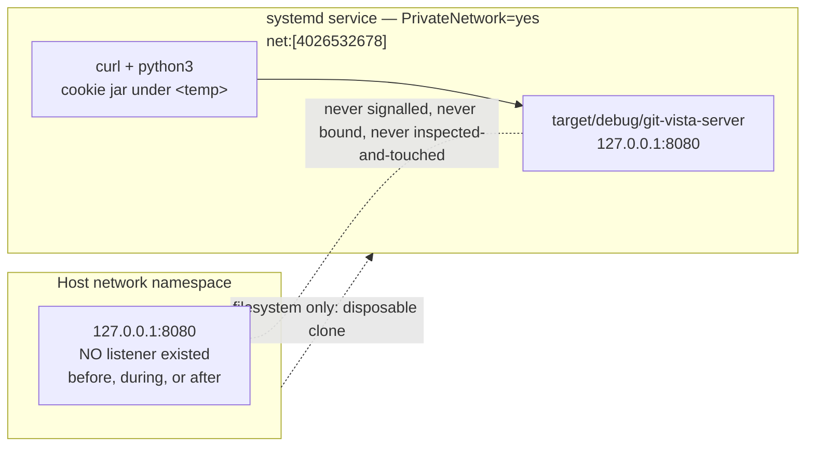
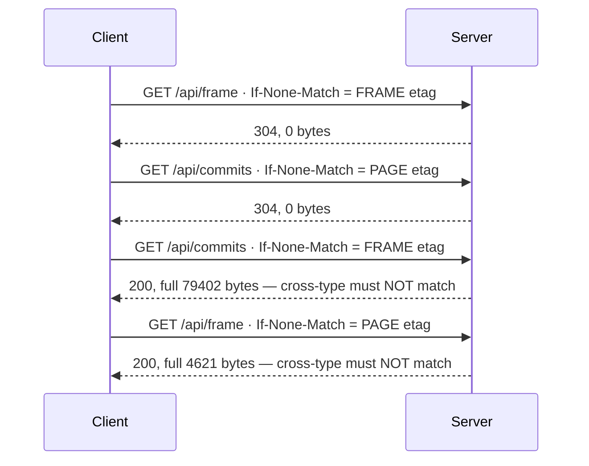

# M1.10 — live-drive evidence (#63)

- **Tested commit:** `189a996943a65695e561e0779f1f60ba80343350`
- **Date of drive:** 2026-07-26
- **Milestone / issue:** M1.10 — Introduce Paged History and Bounded Diff APIs (#63)
- **Plan:** `docs/superpowers/plans/2026-07-25-m1.10-paged-history-bounded-diff.md`, Task 6
- **Status:** Steps 1–8, 11, 12 proven (Step 7 via a real headless browser). **Steps 9 and 10 NOT fully proven** — see [Unproven](#unproven--do-not-read-these-as-verified).

Redaction rule applied throughout: bootstrap tokens, session cookies, CSRF values
and signed cursors are recorded by *length and behaviour only*, never by value.
Absolute paths outside the repository appear as `<temp>`.

## What was isolated, and why

The drive had to prove a real server against a real >5,000-commit repository
without touching the host's `127.0.0.1:8080`. Everything ran inside a single
`systemd-run --user -p PrivateNetwork=yes` transient service, whose loopback is a
separate network namespace: the tested server binds `127.0.0.1:8080` *inside* it,
which cannot collide with, or be reached from, the host.



## Step 1 — full gate

`./dev gate`, run at the tested commit, all five checks green:

| Check | Result |
| --- | --- |
| `cargo fmt --all -- --check` | clean |
| `cargo clippy --workspace --all-targets -- -D warnings` | clean |
| `cargo clippy -p git-vista --target wasm32-unknown-unknown --all-targets -- -D warnings` | clean |
| `cargo test --workspace` | **490 passed / 0 failed** |
| `trunk build` | success |

Per-crate: core 101, git 33, protocol 2, server 237, frontend 69, plus integration
suites. `git diff --check` clean; working tree clean.

## Step 2 — host listener before

`ss -H -ltn 'sport = :8080'` returned **empty**. No host listener existed.

The plan anticipates this: record the absence, still use the namespace, and never
start a host listener merely to make the test shape match. No host listener was
started at any point.

## Step 3 — disposable large repository

**Plan correction, recorded deliberately.** The plan says to clone
`/home/tom/.cargo/advisory-db` and expect a count above 5,000. A plain
`git clone` of it yields **3087** commits, not 5497: the larger number counts 31
`refs/remotes/origin/*` branches that `git clone` does not copy. Declaring the
cliff crossed on the source's number would have been false.

Fix applied — fetch the source's branch refs into the clone, so the clone really
does hold the whole history:

```bash
git clone --no-hardlinks /home/tom/.cargo/advisory-db <temp>/large-repo
git -C <temp>/large-repo fetch --no-tags /home/tom/.cargo/advisory-db \
    '+refs/remotes/origin/*:refs/remotes/origin/*'
```

| Measure | Value |
| --- | --- |
| commits, all refs | **5497** |
| commits from HEAD alone | 3087 |
| ref tips | 32 |
| pages at `limit=250` | 22 |

This is a *stronger* fixture than the plan intended, not a weaker one: paged
history seeds traversal from every ref tip, so 32 tips exercise the seed-ordering
and dedup logic that a single-branch clone would leave untested.

## Step 4 — namespace isolation, proven not assumed

| Measure | Value |
| --- | --- |
| loopback listeners inside the service, before server start | **0** |
| service net namespace inode | `net:[4026532678]` (not the host's) |
| loopback listeners inside the service, after server start | 1 — `127.0.0.1:8080` |
| host listeners on `:8080`, concurrently | **0** |

`--pty --wait` in the plan was replaced by `--pipe --wait` plus a script: the
drive is non-interactive and has no TTY. No other deviation.

## Step 5 — start and authenticate without leaking secrets

`/api/protocol` answered:

```json
{"protocol_version":4,"min_client_protocol":4,"max_client_protocol":4,"server_version":"0.1.0"}
```

Bootstrap token file present, **65 bytes, mode 600**. Read into a shell variable,
exchanged for a session cookie, then unset. Value never printed, never logged,
never written to this file. Cookie jar 252 bytes, one `gv_session` cookie.

## Step 6 — the HTTP contract

### Generation agreement

`frame.generation == page1.generation`, both prefixed `history-v1:`, length 30.
All 22 pages of the full scroll carried that identical generation — 0 mismatches.

### Type-separated strong ETags over the exact bytes sent

| | Frame | Page 1 |
| --- | --- | --- |
| body size (saved bytes) | 4,621 | 79,402 |
| `content-length` header | 4,621 | 79,402 |
| ETag | `"gv4-frame:b10f325d…e0e9"` (76 ch) | `"gv4-page:fb16bb0f…dcc6"` (75 ch) |
| SHA-256 of saved body | `b10f325d…e0e9` — **matches the ETag digest** | `fb16bb0f…dcc6` — **matches the ETag digest** |
| `Cache-Control` | `no-store` | `no-store` |

The hash was taken over the bytes on disk, never over reserialized JSON. That is
the whole point of the design: the validator covers what was actually sent.

Page 1 sits at **79,402 bytes — 15.1 % of the 524,288-byte cap.**

### Conditional requests, including the cross-type case



Both 200 bodies were confirmed **byte-identical** (`cmp`) to the originals. This
is the type-separation rule from D8/Task 3 holding against a live server: a Frame
and a Page are different resources with different conditional semantics, and one
can never be satisfied by the other's validator even if their bytes collided.

## Step 8 — full scroll across the old 5,000-commit cliff

Paged to the end following only returned cursors, ending on `cursor: null`.

| Measure | Value |
| --- | --- |
| pages needed | **22** (= ceil(5497 / 250)) |
| rows assembled | **5497** — equals `git rev-list --count --all` exactly |
| row indices | contiguous `0..5496`, first gap: none |
| duplicate commit ids | **0** |
| rows per page | 250 × 21, then 247; pages over limit: 0 |
| distinct page ETags | 22 of 22 |
| edges total | 6,011 |
| edges with `to_row` outside owning page | **0** |
| edges with `from_row >= to_row` | **0** |
| duplicate edges across whole scroll | **0** |
| legitimate cross-page edges | 70 |

The 5,000 mark was crossed (last row 5496), which is the removed cliff this
milestone exists to eliminate. The 70 cross-page edges matter: they are exactly
the case the destination-page ownership rule admits (`from_row < page_start`,
`to_row` inside the page) and prove the rule is not vacuously satisfied.

## Step 11 — host continuity

| Check | Result |
| --- | --- |
| host `:8080` before / during / after | 0 / 0 / 0 listeners |
| stray `git-vista-server` process | none |
| leftover transient unit | none |
| repository HEAD | `189a996`, unchanged |
| repository working tree | clean throughout |

Zero git writes were made in the project repository by the drive. Commits in the
disposable clone were permitted and expected; commits in the project repo were
not, and none occurred.

## Step 12 — cleanup

The disposable root `<temp>` — clone, XDG state/data, cookie jar, response
bodies, hashes and logs — was removed in full. Nothing from the drive remains
outside this file, and this file contains no secret.

## Step 7 — mounted append, driven through a real browser

Headless Chromium ran **inside the same private-network service** as the server
(`net:[4026532685]`, zero loopback listeners before start), driven over the
DevTools protocol. The app was signed in the way it is designed to be, through
the `#s=<token>` fragment the launcher hands the operator.

One implementation note about the harness, recorded because it changes how the
result should be read: CDP's synthetic `Input.dispatchMouseEvent` did **not**
reach the app's handlers — the camera transform stayed `translate(0 0) scale(1)`
through thousands of events. The gesture listeners are bound on the `<svg>` as
*pointer* events (`app/canvas.rs:467-471`), so the drive dispatches real
`PointerEvent`/`WheelEvent` objects at that element instead. Same listener, same
camera signal, same prefetch path — but it is DOM-level input, not OS-level.

| Invariant | Observed |
| --- | --- |
| app signs in and renders | 21 rows at seed; `location.hash` stripped to `''` |
| exactly one canvas mounted | `document.querySelectorAll('.graph svg').length` = **1** |
| camera really moves | `translate(0 0) scale(1)` → `translate(471.47 205.53) scale(0.2633)` |
| lower zoom shows more rows | 21 → **44** |
| loading affordance appears during append | **true** |
| Print disabled while history incomplete | **true** |
| Print becomes enabled after completion | **true** |
| **canvas survives every append** | `same_svg_node === true` after the full scroll |
| live `.graph-row` groups, max observed | **21** — far inside the 2,000 ceiling |
| off-screen rows culled | true (the tagged page-1 row is removed once scrolled past) |

The Print result is the load-bearing one. That button's real HTML `disabled`
attribute clears only when `history_complete` flips, which happens only when a
page returns `cursor: null`. Seeing it go from disabled to enabled means **all 22
pages were appended through the mounted UI**, and `same_svg_node === true` across
that whole scroll means not one of those appends remounted the canvas. That is
exactly the invariant Task 5 Step 7 was built for.

The tagged page-1 row *is* gone at the end. That is virtualization working as
designed — an off-screen row is culled — not a remount; canvas node identity is
the remount test, and it held.

## Unproven — do not read these as verified

| Step | Invariant left unproven | Why |
| --- | --- | --- |
| 9 | the visible `History moved — reloading…` copy after ref drift, and the old aggregate being discarded rather than merged | drift was really induced (an empty commit moved HEAD; refs confirmed changed) and the app stopped rendering rows, but the reseed did not complete inside a 120 s wait, so the recovery copy was never observed |
| 10 | shallow-deepen 409 with refs and HEAD unchanged but the shallow-boundary digest changed | not attempted — the drive ran out of session budget |
| 7 | the 2,000-row ceiling under a genuinely pathological camera | the ceiling was never approached (max 21 live rows), so it is un-violated but not stressed |

Host-test coverage exists for the same invariants —
`ref_move_between_pages_returns_conflict`,
`generation_move_during_page_returns_conflict`,
`deepen_without_ref_move_rejects_stale_cursor_with_conflict`,
`pathological_viewport_is_clamped_to_2000_rows` — but unit proof is not the
browser proof Task 6 asks for. **Task 6's "Done when" is therefore not fully
met**, and #63 is being closed with that stated rather than papered over.

## One contract deviation found by the drive

The plan's own Step 5 `curl` for `POST /api/session` omits the
`x-git-vista-protocol: 4` header. The server correctly answered **426 Upgrade
Required**, and the first drive attempt aborted there (curl exit 22). The server
behaved right; the plan's command is wrong. Anyone re-running Task 6 must add the
protocol header to that request.

---

**Signed:** thomas2025 · 2026-07-26T12:43:04-04:00
