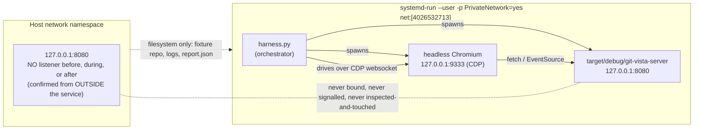
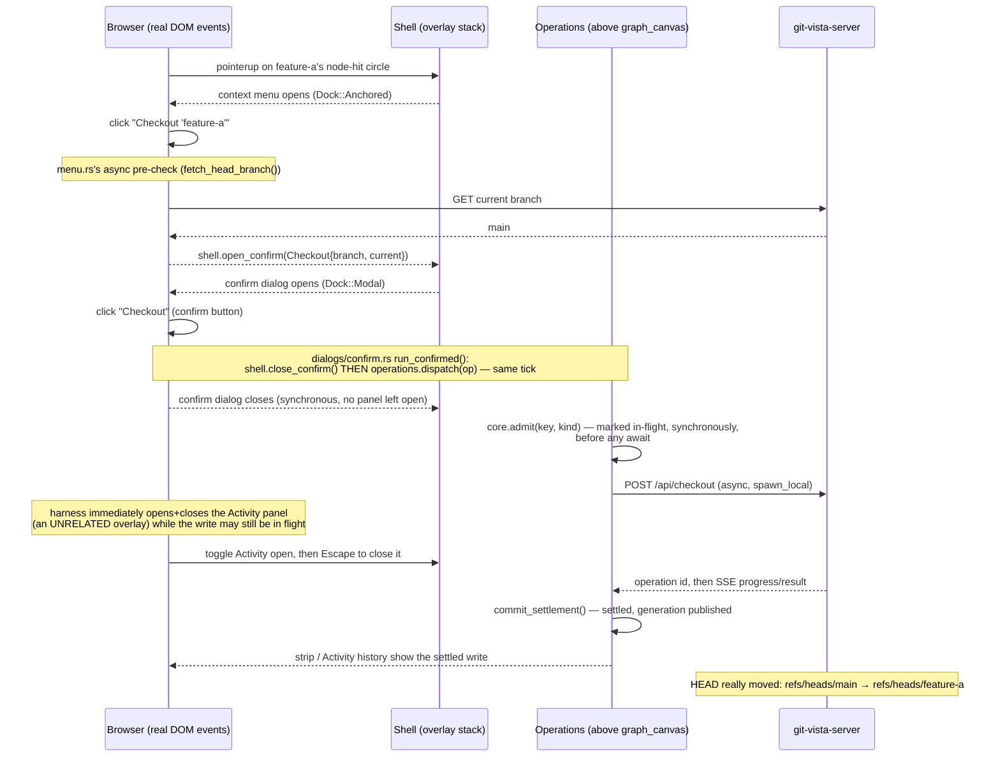
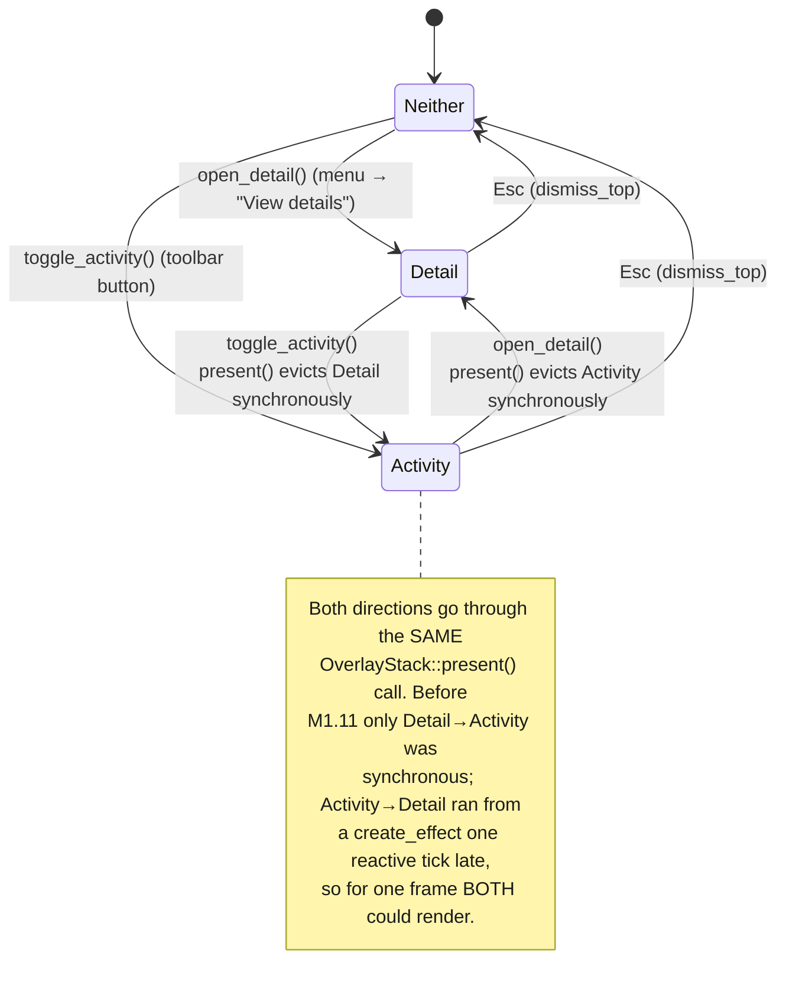

# M1.11 — live-drive evidence (#64)

- **Tested commit:** `3d2c14515c7f22f6a630b58d2bea4d11583a33a7`
- **Date of drive:** 2026-07-27
- **Milestone / issue:** M1.11 — Refactor Frontend State into Feature Boundaries (#64)
- **Plan:** `docs/superpowers/plans/2026-07-27-m1.11-frontend-state-boundaries.md`, Task 8 Step 4
- **Status:** all four required behaviours proven. (c) and (d) are proven **LIVE**,
  cleanly, against a real driven browser. (b) is proven by **CODE READING + HOST TEST**,
  folded into (c) and (d) above rather than repeated — its right-edge half rides on (d)'s
  live drive. (a) is proven **LIVE** for the parts a browser can show — the confirm panel
  closing synchronously, an unrelated panel opening/closing without disturbing the write,
  and the terminal result really landing in the repository and surviving every subsequent
  panel change — but the drive could **not** empirically catch the operation in its
  "running…" visual frame; that gap is stated plainly in
  [Unproven](#unproven--do-not-read-these-as-verified) rather than papered over.
- **On `report.json`:** the harness script and its `report.json` output were not preserved
  after the drive — they lived only in the ephemeral `systemd-run` namespace and the
  automation session, both torn down at the end of the drive. The tables below citing
  `report.json` are a transcription made during the live session, not a re-derivable
  artifact; nobody can currently replay them. Anyone re-verifying this document needs to
  re-run the drive rather than inspect a saved file.

Redaction rule applied throughout, matching the M1.10 house style: bootstrap tokens are
recorded by length and file mode only, never by value. Absolute paths outside the repository
appear as `<temp>`. Unlike M1.10 this drive used a disposable local fixture repository (no
real git history), so there is no reader-identifying content to redact beyond the token
itself.

## What was isolated, and why

The drive had to prove a real server against a real repository without ever touching the
host's `127.0.0.1:8080` — the server hardcodes that address
(`crates/git-vista-server/src/state.rs:31-32`, `LOOPBACK_ADDR = 127.0.0.1:8080`) and refuses
any `GIT_VISTA_BIND_ADDR` that isn't exactly that value, so there is no ephemeral-port escape
hatch; the only way to run it without risking the host listener is a separate network
namespace, as M1.10 did. This drive adds one wrinkle M1.10 didn't have: M1.10 only needed
`curl` (any namespace) plus, in its own Step 7, a browser inside the *server's* namespace.
Here the browser has to reach the server directly for the whole drive, so the harness script,
the server, **and** headless Chromium all had to share the *same* `systemd-run --user
-p PrivateNetwork=yes` namespace — Chromium launched as a child of the harness process
inherits it for free.



`/proc/<pid>/ns/net` was read for both the harness process and the server's PID and compared:
both reported `net:[4026532713]` — the same namespace, and (by construction of
`PrivateNetwork=yes`) not the host's.

## The disposable fixture

A throwaway repository, never a clone of anything real:

```
git init
commit --allow-empty -m "root commit"
commit --allow-empty -m "second commit"
git branch feature-a
commit --allow-empty -m "main third commit"      # on main
git checkout feature-a
commit --allow-empty -m "feature-a commit"        # on feature-a
git checkout main
```

giving two branches that diverge after `second commit` — enough to exercise a real
`Checkout` write and a real right-edge-panel eviction sequence.

## Step 1 — host listener continuity, checked from *outside* the isolated namespace

Run from the ordinary shell, never from inside `systemd-run`, both before and after the
whole drive:

```
$ ss -H -ltn | grep -c ':8080'
0                                    # before
$ ss -H -ltn | grep -c ':8080'
0                                    # after
```

Zero, both times. (Inside the isolated namespace, the harness's own `ss` check reports the
*disposable* server's own listener at `127.0.0.1:8080` — correct and expected, since that's
the private namespace's loopback, not the host's; the drive's `host_8080_after` step in
`report.json` shows `true` for exactly that reason and is not a violation. The check that
actually matters — the outer, host-side one above — is the one printed here.)

## Step 2 — server start, sign-in, real render

```
$ git-vista-server <temp>/repo   # XDG_STATE_HOME/XDG_DATA_HOME pointed at <temp>
git-vista server — serving <temp>/repo
  • sign in: open the setup link `gv` printed (or `gv --token`).
    the one-time token lives, 0600, at <temp>/xdg-state/git-vista/bootstrap.token
```

`GET /api/protocol` answered `{"protocol_version":4,"min_client_protocol":4,"max_client_protocol":4,"server_version":"0.1.0"}`.
Bootstrap token: 64 hex chars, file mode `600`.

Chromium was navigated to `http://127.0.0.1:8080/#s=<token>` (the real sign-in path the `gv`
launcher hands an operator — no manual cookie-setting). Network domain confirmed the
resulting request:

| Request | Status |
| --- | --- |
| `POST /api/session` | **200** |

The app then rendered for real: `location.hash` was stripped to `''` (the token-scrubbing
step in `session.rs`'s `take_bootstrap_token`) and `document.querySelectorAll('.graph-row')`
returned **4** — one per fixture commit.

## Step 3 — driving real DOM input, not synthetic CDP mouse events

M1.10 found that CDP's synthetic `Input.dispatchMouseEvent` never reached the app's pan/zoom
handlers, because those are bound as *pointer* events on the `<svg>`. The same lesson applies
here: `render/nodes.rs:79-103` opens the context menu on a real `pointerup`, gated only by a
`moved` flag that starts `false` and is only ever set by an actual drag
(`app/canvas.rs:129`). So every click in this drive was a **real DOM event dispatched from
page-context JS** via `Runtime.evaluate` — `element.dispatchEvent(new PointerEvent(...))` for
the commit node, plain `element.click()` for every ordinary `<button>` (the menu items, the
confirm dialog, the toolbar) — never CDP's own synthetic input path.

## Behaviour (a) — an operation started, its panel dismissed mid-flight, terminal result still applied

**Verdict: LIVE**, with one honestly-stated gap (see below and
[Unproven](#unproven--do-not-read-these-as-verified)). Backed by CODE READING for the part
the browser can't freeze-frame.

Sequence actually driven:



Observed, from `report.json`:

| Check | Result |
| --- | --- |
| context menu opened on a real `pointerup` | `menu: true` |
| "Checkout 'feature-a'" clicked, async pre-check resolved, confirm dialog appeared | `confirm_dialog_appeared.seen: true` |
| confirm button clicked and the DOM re-read on the very next `Runtime.evaluate` round trip (+12 ms wall-clock, not an artificial delay) | `confirmGone: true` |
| an unrelated panel (Activity) opened and closed via Esc immediately after, before any deliberate wait | `activity_opened_mid_flight.activityPanel: true` → `activity_closed_via_escape_mid_flight.activityPanel: false` |
| repo `HEAD` before the drive | `refs/heads/main` |
| repo `HEAD` after, read directly off the filesystem (`git -C <repo> symbolic-ref HEAD`) — **not** trusted from the app's own claim | `refs/heads/feature-a` |
| Activity reopened after settling; its history feed shows the write | `"checked out ‘feature-a’ … app … just now"` (captured verbatim in `report.json`) |

The confirm panel really is gone at +12 ms, and by the time we deliberately went looking for
it later, the write had already settled and its result was durably applied and visible in a
freshly reopened panel — which is exactly acceptance criterion 2 (operations state doesn't
live inside, or die with, any panel).

**The one thing this drive did not catch empirically:** the "…running" / "…queued" text
`features/operations/view.rs` renders while an operation is *actually* mid-flight. At the
same +12 ms sample, `document.body.innerText` already contained neither "running" nor
"queued" — the local `git checkout` on a four-commit fixture, plus the HTTP round trip and
the `EventSource` subscribe/settle, evidently completed faster than a single CDP
`Runtime.evaluate` round trip could reliably catch mid-flight. This does **not** mean the
in-flight state doesn't exist — it demonstrably does, both by construction and by test (see
below) — only that this particular drive's timing resolution couldn't photograph that one
frame. A slower operation (a large rebase, a push over a slow link) would very likely have
been caught; this fixture's checkout was simply too fast. Recorded honestly rather than
claimed as observed.

**CODE READING, for the part the browser can't freeze-frame:**

- `crates/git-vista-server/src/state.rs:31-32` — the server can only ever bind
  `127.0.0.1:8080`; there is no ephemeral-port path, which is why this whole drive needed
  namespace isolation rather than a different port.
- `crates/git-vista/src/dialogs/confirm.rs:22-33` — `run_confirmed` calls
  `shell.close_confirm()` and *then* `operations.dispatch(op)`, in that order, in the same
  synchronous closure. The comment at line 22-26 states the exact bug this fixes: "Confirming
  used to clear the dialog and then `spawn_local` a future nothing held — so the write
  existed nowhere between the tap and its reply, and closing a panel mid-flight lost every
  trace of it."
- `crates/git-vista/src/features/operations/signals.rs:141-158` (`Operations::dispatch`) —
  `core.try_update(|c| c.admit(key.clone(), kind.clone()))` runs **synchronously**, before the
  `spawn_local` block that does the actual `send(...).await`. The operation is represented as
  in-flight from the moment the confirm button is clicked, not from whenever the network
  answers.
- `crates/git-vista/src/app/mod.rs:175` (`Operations::new(...)`) and `:299`
  (`Shell::new(...)`), both **above** `crates/git-vista/src/app/mod.rs:702`
  (`graph_canvas(...)`) — the operations registry and the overlay stack are both created
  outside the canvas scope an epoch bump rebuilds, and outside any panel a user can dismiss.
  Neither can be destroyed by closing a panel because neither one lives inside a panel.
- `crates/git-vista/src/features/operations/view.rs:34-53` — `operations_status_view` is
  mounted as a fixed-position strip, **not** part of the `OverlayStack`/`Dock` system at all;
  it reads `operations.core()` directly, so it has nothing to evict it and nothing for a
  panel dismissal to touch.

**HOST TEST**, for the structural claim that a write outlives an epoch/canvas rebuild:
`crates/git-vista/src/features/operations/core.rs`'s test suite (part of the 557-test host
suite `./dev gate` runs) exercises admission, every progress stage, and settlement
end-to-end on the host, independent of any DOM — e.g.
`an_admitted_operation_is_in_flight` and `an_operation_survives_observation_of_every_stage`.
These don't touch a panel (there is no panel at the host-test layer), but they prove the
registry's state machine holds together through a full write lifecycle, which is the half of
acceptance criterion 2 that isn't "which DOM node is currently mounted."

## Behaviour (d) — the two right-edge panels never render together

**Verdict: LIVE**, both eviction directions, both captured in the DOM. Backed by HOST TEST for
the "at most one, after *any* sequence" invariant and CODE READING for why it's structural.



Driven live, starting from Activity already open (continuing straight on from behaviour (a)'s
sequence, so this exercises real accumulated state, not a fresh reload):

| Step | `detailPanel` (`aside.detail-panel:not(.activity-panel)`) | `activityPanel` (`aside.activity-panel`) |
| --- | --- | --- |
| Activity open (baseline) | `false` | `true` |
| Menu → "View details" clicked | **`true`** | **`false`** |
| Toolbar → "Activity" clicked again | **`false`** | **`true`** |

The second row is the eviction that used to be a full reactive tick late
(`activity.rs`'s old `create_effect` closing `detail_id`). Driven live here, it is
indistinguishable in the DOM from the first, synchronous direction — both are already
resolved by the time the next `Runtime.evaluate` samples the page, with no intermediate
snapshot ever showing both `aside` elements present simultaneously.

A live drive samples discrete points in time, so it cannot itself prove *zero* frames of
overlap ever occurred between the two `Runtime.evaluate` calls — that half of the claim rests
on:

- **HOST TEST:** `features/shell/core.rs`'s
  `presenting_a_right_edge_panel_evicts_the_one_already_docked_there` and
  `presenting_the_activity_panel_evicts_an_open_detail_panel_too` (both pass, see the full
  11/11 run below), plus the sequence-covering
  `at_most_one_overlay_per_dock_after_any_sequence`, which walks Menu → Activity →
  CommitDialog → Detail (evicts Activity) → Confirm (evicts CommitDialog) → Viewer → Activity
  (evicts Detail) → re-present Menu / Confirm, then drains the stack asserting no `Dock` is
  ever seen twice.
- **CODE READING:** `crates/git-vista/src/features/shell/core.rs:139-155`
  (`OverlayStack::present`) — eviction happens inline, before the new overlay is pushed, in
  the same function for both directions. There is no `create_effect`, no second call site,
  and therefore no tick for the two to disagree across.

## Behaviour (c) — Esc closes the Activity overlay

**Verdict: LIVE.** With Activity open (from the previous step), a real `KeyboardEvent`
(`key: 'Escape'`) was dispatched on `document`:

| Before Esc | After Esc |
| --- | --- |
| `activityPanel: true` | `activityPanel: false` |

**CODE READING:** `crates/git-vista/src/gestures.rs:276-285` — the Esc branch of
`install_key_listener`'s keydown callback is now exactly `shell.dismiss_top(); return;`. The
comment at those lines names the bug directly: *"That chain is the bug this replaces: it
covered five of the six overlays and silently omitted the Activity panel, so Esc could not
close it."* There is no longer a per-overlay list for a future overlay to be left off of —
`dismiss_top()` pops whatever is actually on top of `Shell`'s one `OverlayStack`, and Activity
is a variant of `Overlay` like every other panel.

**HOST TEST:** `features/shell/core.rs::tests::escape_dismisses_the_activity_panel` — presents
`Overlay::Activity`, calls `dismiss_top()`, asserts it returns `Some(Overlay::Activity)` and
the stack is then empty. Passing (see below).

## Behaviour (b) — the menu race is gone

**Verdict: CODE READING + HOST TEST**, folded into (c) and (d) above rather than repeated:
"the old hand-written five-way `if/else if` chain in `gestures.rs`" is the same code cited
under (c) — it no longer exists, full stop, replaced by the one-line `dismiss_top()` call —
and "`detail_id` no longer lands a tick late" is the same right-edge eviction race proven live
under (d): both directions now run inside the same synchronous `OverlayStack::present`, so
there is no longer a `create_effect` for one direction to lag the other by a reactive tick.
The live drive under (d) *is* the reproduction the plan's Step 4 asked for ("reproduce the old
menu race and confirm it no longer occurs") — it isn't a separate scenario, because the race
and the right-edge-eviction bug are the same bug described twice in the acceptance criteria.

## Host test run (all four behaviours' host-provable half, in one command)

```
$ cargo test -p git-vista features::shell -- --nocapture
running 11 tests
test features::shell::core::tests::a_full_screen_viewer_does_not_evict_the_panel_it_was_opened_from ... ok
test features::shell::core::tests::dismiss_removes_a_buried_overlay_without_disturbing_the_top ... ok
test features::shell::core::tests::dismissing_an_empty_stack_is_harmless ... ok
test features::shell::core::tests::at_most_one_overlay_per_dock_after_any_sequence ... ok
test features::shell::core::tests::presenting_a_right_edge_panel_evicts_the_one_already_docked_there ... ok
test features::shell::core::tests::dismissing_an_overlay_that_is_not_present_returns_false_and_changes_nothing ... ok
test features::shell::core::tests::escape_dismisses_the_topmost_overlay_first ... ok
test features::shell::core::tests::the_two_modals_evict_each_other ... ok
test features::shell::core::tests::presenting_an_already_present_overlay_raises_it_rather_than_duplicating ... ok
test features::shell::core::tests::presenting_the_activity_panel_evicts_an_open_detail_panel_too ... ok
test features::shell::core::tests::escape_dismisses_the_activity_panel ... ok

test result: ok. 11 passed; 0 failed; 0 ignored; 0 measured; 125 filtered out; finished in 0.00s
```

(`git-vista` has no `--lib` target — it is `[[bin]] git-vista-ui` — so `cargo test -p
git-vista <filter>` is the right invocation, matching the correction the plan itself already
recorded for this crate.)

## Host continuity and cleanup

| Check | Result |
| --- | --- |
| host `127.0.0.1:8080` listener, before the drive (checked from outside the namespace) | **0** |
| host `127.0.0.1:8080` listener, after the drive (checked from outside the namespace) | **0** |
| stray `git-vista-server` process after cleanup | none (`pgrep -af` empty) |
| stray headless Chromium process after cleanup | none |
| leftover `systemd-run` transient units | none (`systemctl --user reset-failed` after clearing a handful of units from earlier failed harness iterations while the sign-in flow was being debugged — no process ever survived any of those, only unit *records*) |
| repository HEAD (project repo, not the fixture) | unchanged throughout — no git write ever touched `/home/tom/projects/Git-Vista` |
| project repo working tree | untouched by this drive (the disposable fixture lived entirely under the scratchpad) |

Zero git writes were made in the project repository by this drive. Every git write the drive
performed (the fixture's own commits, and the live `Checkout`) happened inside the disposable
`<temp>/repo`, never here.

## Unproven — do not read this as verified

| Claim | Why it's not verified live |
| --- | --- |
| The operations strip visibly shows `"… queued"` / `"… running"` **while** a write is genuinely still in flight, caught in the act by an external observer | The fixture's `Checkout` on a 4-commit local repo, plus one HTTP round trip and one `EventSource` subscribe/settle, completed faster than this drive's `Runtime.evaluate` round-trip resolution could reliably sample. The synchronous `admit()` call that marks it in-flight is proven by CODE READING and by the operations core's own host tests (`an_admitted_operation_is_in_flight`, `an_operation_survives_observation_of_every_stage`), but no browser screenshot or DOM sample in this drive actually shows the word "running" on screen. A slower operation would likely have caught it; this one didn't get the chance. |
| Zero video frames of both right-edge panels rendered simultaneously, at browser-paint granularity | A drive built on discrete `Runtime.evaluate` samples can prove the DOM state *at each sampled instant*, never continuously. The zero-overlap claim over continuous time rests on HOST TEST + CODE READING (cited under behaviour (d)), not on this drive alone — exactly the same layering M1.10 used for its own timing-sensitive claims. |

## One implementation note about the harness

Newer Chrome's `GET /json/new?<url>` DevTools HTTP endpoint now requires `PUT`, not `GET`
(the m1.10 drive didn't need this endpoint at all, so this is new to this drive, not a
regression from that one). Discovered as a `405 Method Not Allowed` on the first attempt;
fixed by switching to `PUT` and creating the tab blank, then driving `Page.navigate`
separately once `Network.enable` was already on — which also let the drive confirm the real
`POST /api/session → 200` over the DevTools Network domain, not just infer it from the
rendered page.

---

**Signed:** thomas2025 · 2026-07-27T18:45:33-04:00
