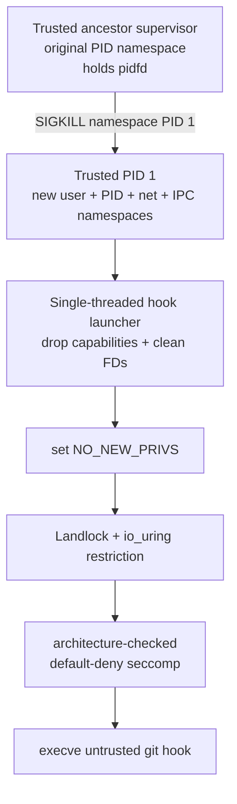

> **Provenance: independent specification lane, round 4 of #66.**
>
> Produced by a **Codex** session (different model family) working from primary kernel
> sources only — the running-kernel UAPI headers for Linux 7.0 and upstream documentation.
> It formed its conclusions **before** reading any Claude lane's output, which is the point:
> two Claude sessions share failure modes, and three prior design rounds died to assumptions
> nobody in the room questioned because everyone in the room was the same model.
>
> **Its measurements are not admissible and it says so itself.** It ran as uid 1000 inside an
> unprivileged user-namespace container, not as `tom` on this host, so it has neither the
> `docker` group nor `/run/user/1000/bus` nor the host's `/var/run/docker.sock`. Every
> empirical claim about this box comes from the Claude lanes; every claim here is
> **spec-derived** unless labelled otherwise.
>
> Kept verbatim as an immutable artifact. Do not edit it to agree with later findings —
> where it and the measured lanes disagree, the disagreement is the evidence.
>
> Reconciled against the real-host measurements in
> [`../specs/2026-07-28-m1.13-round4-verdict.md`](../specs/2026-07-28-m1.13-round4-verdict.md).

---

# Codex result — task C1 (isolation primitive for untrusted git hooks, #66)

**Status:** DRAFT CHECKPOINT — independent specification conclusion saved; namespace details incorporated; final source audit still in progress  
**Method:** specification-only. No host security measurement in this lane is valid because Codex is uid 1000 inside an unprivileged user-namespace container, not host user `tom`.

Claim labels apply to the paragraph or list they introduce:

- **[SPEC]** directly stated by the cited Linux UAPI, kernel documentation, or Linux man-pages specification.
- **[SPEC-CONSTRAINED JUDGMENT]** a design conclusion drawn from those stated semantics.
- **[SPEC SILENCE]** the checked specifications do not make the claimed guarantee.
- **[INFERENCE]** a kernel-model conclusion not expressly guaranteed by the checked prose.
- **[LANE FACT]** provenance or execution facts about this Codex lane, not host-security evidence.

Unlabelled source bullets are citations, not additional claims.

---

## The answer

**[SPEC-CONSTRAINED JUDGMENT]** There is no single unprivileged, same-uid Linux primitive here that creates a complete machine-security boundary. The defensible primitive is a deliberately composed sandbox, created by a trusted, single-threaded launcher before any repository-controlled code runs:

1. `PR_SET_NO_NEW_PRIVS` to make privilege gain through `execve` unavailable and to authorize unprivileged Landlock/seccomp installation.
2. Landlock ABI 6 or later for an inherited boundary over explicitly handled filesystem/TCP rights plus signal and **abstract** UNIX-socket scopes; ABI 8 is required only if the design relies on TSYNC across existing threads.
3. Seccomp with an architecture-checked **default-deny allowlist**, not merely a short denylist, plus either complete denial of io_uring or an inherited task-level io_uring filter.
4. A new PID namespace with a trusted PID 1 and an ancestor supervisor holding a `pidfd`, plus new network **and IPC** namespaces, for lifecycle, network-stack, System V IPC, and POSIX-message-queue isolation.
5. Strict descriptor hygiene before `execve`: close every descriptor except deliberate stdio/control descriptors; do not inherit connected sockets, namespace FDs, io_uring rings, pidfds, agent sockets, or directory FDs.



**[SPEC]** The mechanism making the base restrictions irrevocable is kernel inheritance and monotonic composition: a successful Landlock restriction remains on the restricted thread's descendants and that thread can only add restrictions; seccomp filters persist across allowed `fork`/`clone`/`execve` and additional filters only restrict further. `no_new_privs` is inherited across `fork`, `clone`, and `execve` and cannot be unset. ABI 8 TSYNC has separate whole-thread-group semantics discussed below.

**[SPEC-CONSTRAINED JUDGMENT]** The proposed three layers are useful defense in depth, but the claim “Landlock + deny `AF_UNIX` + PID/net namespaces closes all out-of-domain actuation” is too strong. The true claim is narrower:

> Repository-controlled code runs under explicitly handled Landlock rights and selected domain scopes, explicitly allowed syscall/io_uring operations, deliberately inherited descriptors, and PID/network/IPC namespaces, subject to the documented gaps below.

**[SPEC-CONSTRAINED JUDGMENT]** For a real host-security boundary against arbitrary same-uid code, use a different host principal with no ambient daemon authority, or a stronger privileged/VM boundary. Same uid plus shared writable trigger objects remains an honest ceiling even when direct socket RPC is closed.

## Where I disagree with the framing

### 1. `LANDLOCK_SCOPE_ABSTRACT_UNIX_SOCKET` does not cover pathname sockets

**[SPEC]** This is settled by the host-version Linux 7.0 UAPI, not inference. The header defines the scope as: **“Restrict a sandboxed process from connecting to an abstract UNIX socket created by a process outside the related Landlock domain.”** The only ABI-8 UNIX-socket scope constant is `LANDLOCK_SCOPE_ABSTRACT_UNIX_SOCKET`; there is no pathname-socket access right in that UAPI. Upstream later added pathname-socket mediation as `LANDLOCK_ACCESS_FS_RESOLVE_UNIX` in ABI 9, confirming that ABI 8 does not have it.

**[SPEC-CONSTRAINED JUDGMENT]** Therefore `/run/user/1000/bus`, `/var/run/docker.sock`, SSH-agent paths, GPG-agent paths, and other pathname sockets are outside Landlock ABI 8's connection mediation. The real-host D-Bus result supplied by Tom is consistent with the specification. A separate mechanism is mandatory rather than belt-and-braces on ABI 8; in the proposed design that mechanism is seccomp denial of AF_UNIX creation plus descriptor hygiene. A network namespace alone is not that mechanism because it isolates the abstract namespace, not filesystem pathnames.

Primary source:

- Host-version UAPI: `/usr/src/linux-hwe-7.0-headers-7.0.0-28/include/uapi/linux/landlock.h`, lines 361-383, especially 375-377.
- Linux 7.0 documentation: <https://docs.kernel.org/7.0/userspace-api/landlock.html#scope-flags>
- Later-ABI confirmation: Linux 7.1 documentation calls pathname UNIX sockets a limitation before ABI 9 and introduces `LANDLOCK_ACCESS_FS_RESOLVE_UNIX` at ABI 9: <https://docs.kernel.org/7.1/userspace-api/landlock.html#pathname-unix-sockets-abi-9>

### 2. Denying `socket(AF_UNIX)` is not, by itself, a closed class on Linux 7.0

**[SPEC]** Classic seccomp-BPF cannot dereference `sockaddr_un *`. Its input is `struct seccomp_data`: syscall number, audit architecture, instruction pointer, and six 64-bit argument **values**. The kernel documentation says directly: **“BPF programs may not dereference pointers.”** Thus cBPF can compare the scalar family argument to native `socket()`/`socketpair()`, but it cannot allowlist one pathname passed by pointer to `connect()` while denying another. For a multiplexed `socketcall()`, even its argument array is pointer-indirected, so a cBPF policy must deny the relevant subcall wholesale or reject that syscall ABI; it cannot inspect the nested family.

**[SPEC]** More importantly, Linux 7.0 exposes `IORING_OP_SOCKET` as well as `IORING_OP_CONNECT`. The upstream merge that introduced io_uring task filters explains that seccomp sees the `io_uring_enter` system call, not the operation data submitted through the ring. Before a separate io_uring task restriction existed, the documented security option was to deny `io_uring_setup(2)` entirely.

**[SPEC-CONSTRAINED JUDGMENT]** That is a concrete bypass of a naive `socket(AF_UNIX)` seccomp rule if io_uring remains available. Linux 7.0 offers two defensible choices:

- simplest: deny `io_uring_setup`, `io_uring_enter`, and `io_uring_register` and ensure no ring FD is inherited; or
- install a task-level io_uring cBPF policy before creating any ring, use `IO_URING_BPF_FILTER_DENY_REST`, and explicitly allow only reviewed opcodes while filtering `IORING_OP_SOCKET` by family. Task-level filters are inherited and descendants cannot loosen them, but pre-existing or imported rings are not covered by that creation-time guarantee.

**[SPEC-CONSTRAINED JUDGMENT]** Even after addressing io_uring, a socket-family policy must cover:

- `socket` and `socketpair`;
- compat/multiplexed `socketcall` by denying its socket-creation subcalls wholesale, or reject non-native audit architectures;
- alternate ABI encodings (including x32 handling on x86-64);
- inherited/pre-connected descriptors and listening sockets;
- any mechanism that can import a descriptor, such as a deliberately exposed user-notification broker.

**[SPEC + SPEC-CONSTRAINED JUDGMENT]** Linux's seccomp specification explicitly recommends allowlisting: a denylist must be updated for new syscalls and dangerous flags/options, and alternate representations can bypass it. Therefore, **denying the entire AF_UNIX family is class-level only at each correctly covered kernel entry point; the overall seccomp policy is still syscall-surface enumeration.** Landlock's object hooks are different in kind; a short seccomp denylist is not.

Primary sources:

- Host-version seccomp UAPI data shape and user-notification warning: `/usr/src/linux-hwe-7.0-headers-7.0.0-28/include/uapi/linux/seccomp.h`, lines 53-67 and 82-109.
- Linux seccomp specification: <https://docs.kernel.org/userspace-api/seccomp_filter.html>
- seccomp allowlist guidance and ABI caveats: <https://man7.org/linux/man-pages/man2/seccomp.2.html>
- Linux 7.0 io_uring UAPI contains `IORING_OP_SOCKET` and `IORING_REGISTER_BPF_FILTER`: `/usr/src/linux-hwe-7.0-headers-7.0.0-28/include/uapi/linux/io_uring.h`, lines 299 and 716-718.
- Linux 7.0 io_uring filter UAPI: `/usr/src/linux-hwe-7.0-headers-7.0.0-28/include/uapi/linux/io_uring/bpf_filter.h`.
- Upstream io_uring filter merge rationale: <https://kernel.googlesource.com/pub/scm/linux/kernel/git/wireless/wireless-next/+/591beb0e3a03258ef9c01893a5209845799a7c33#35>
- Inherited task-filter semantics: <https://kernel.googlesource.com/pub/scm/linux/kernel/git/axboe/liburing/+/refs/heads/master/man/io_uring_register_bpf_filter.3>

### 3. `SECCOMP_RET_USER_NOTIF` does not make pathname allowlisting safely transparent

**[SPEC]** User notification lets a trusted supervisor receive the numeric pointer and target PID and, with sufficient access, copy the target memory (the Linux man-page example uses `/proc/<pid>/mem` with notification-ID validation). That changes the answer from “cBPF cannot inspect the string” to “an external broker can inspect a snapshot.” `SECCOMP_IOCTL_NOTIF_ID_VALID` addresses target exit/PID-reuse races; it does not freeze the target's pointed-to memory.

**[SPEC]** It does **not** make `SECCOMP_USER_NOTIF_FLAG_CONTINUE` safe for security policy. Linux 7.0's UAPI warns that the target can rewrite pointer arguments while blocked, calls the race inherent, and states that a notifier using continuation cannot be the security-policy boundary. Copying pointed-to data before deciding does not help if the kernel later dereferences the attacker's original mutable memory.

**[SPEC SILENCE + SPEC-CONSTRAINED JUDGMENT]** User notification can spoof a return value and can inject an FD for an FD-producing operation. The checked specification does not provide a turnkey, race-free pathname allowlist for `connect()` on an existing target FD. A separately proven full-emulation broker that never uses `CONTINUE` for the security decision could change the engineering answer, but that is a new trusted component, not a capability of cBPF itself. For this design, all-or-nothing AF_UNIX denial is substantially easier to defend.

Primary sources:

- Linux 7.0 UAPI warning: `/usr/src/linux-hwe-7.0-headers-7.0.0-28/include/uapi/linux/seccomp.h`, lines 85-107.
- Kernel seccomp documentation, “Userspace Notification”: <https://docs.kernel.org/userspace-api/seccomp_filter.html#userspace-notification>
- Detailed notification API and TOCTOU warning: <https://man7.org/linux/man-pages/man2/seccomp_unotify.2.html>

## Landlock ABI 1 through 8

**[SPEC]** An ABI number means the kernel exposes those interfaces; it does not mean a process is automatically restricted by them. The ruleset must explicitly list every handled right and scope. The UAPI says actions not listed as handled **will not be denied** (except the historical special handling of `REFER`). This explicit contract preserves forward compatibility by intentionally not auto-denying future rights. ABI and Landlock errata are separately queryable concepts in Linux 7.0.

| ABI | Addition |
|---:|---|
| 1 | Initial filesystem rights: execute, open for read/write, read directories, remove entries, and create regular/special filesystem objects. `MAKE_SOCK` controls creating a socket inode, not connecting to it. |
| 2 | `LANDLOCK_ACCESS_FS_REFER` for cross-directory rename/link. |
| 3 | `LANDLOCK_ACCESS_FS_TRUNCATE`. |
| 4 | TCP-port `BIND_TCP` and `CONNECT_TCP`. |
| 5 | `LANDLOCK_ACCESS_FS_IOCTL_DEV` for device ioctls associated with newly opened device FDs. |
| 6 | `LANDLOCK_SCOPE_ABSTRACT_UNIX_SOCKET` and `LANDLOCK_SCOPE_SIGNAL`. |
| 7 | Landlock audit/logging-control flags; no new mediated resource class. |
| 8 | `LANDLOCK_RESTRICT_SELF_TSYNC`; no new mediated resource class. |

**[SPEC]** Historical `REFER` nuance: an ABI-1 ruleset cannot grant cross-directory reparenting, and Landlock denies it even though ABI 1 cannot list `REFER` as a handled right. ABI 2 adds the right needed to grant controlled cross-directory rename/link.

Primary mapping: <https://docs.kernel.org/7.0/userspace-api/landlock.html#previous-limitations>

### What ABI 8 guarantees—and what is older

**[SPEC]** ABI 8 adds only the optional `LANDLOCK_RESTRICT_SELF_TSYNC` operation. The other guarantees in this list entered with earlier ABIs:

- Enforced layers on a thread compose by intersection; a sandboxed thread may add but not remove its own inherited base restrictions.
- A successfully restricted thread's later children inherit the domain.
- Ptrace-like access is constrained by Landlock domain hierarchy.
- Signal and abstract-socket scopes restrict reaching outside the same/nested domain when explicitly selected at ABI 6 or later.
- File-descriptor-associated truncate/ioctl rights are fixed when a file is opened and remain attached if the FD is passed to another process.

**[SPEC]** “ABI 8” alone is not a statement that every published Landlock erratum is fixed. Linux 7.0 exposes a separate errata bitmask; a design that depends on an erratum-specific behavior must treat that as a separate contract.

**[SPEC]** On an ABI-8 kernel, calling `landlock_restrict_self()` **without** `LANDLOCK_RESTRICT_SELF_TSYNC` still restricts only the caller and its future children. TSYNC must be requested and succeed to apply atomically to all existing threads. Its documented semantics override sibling threads' Landlock domains and logging configurations rather than intersecting independently with each sibling's prior configuration; if the caller has `no_new_privs`, TSYNC enables it on the siblings too. Threads in one process are not a useful internal security boundary; nevertheless, a trusted single-threaded launcher avoids this subtlety.

### Minimum ABI for this design

**[SPEC-CONSTRAINED JUDGMENT]** State the minimum according to the property actually used:

- ABI 3 if the filesystem claim requires controlling truncation.
- ABI 5 if the claim also relies on device-ioctl mediation.
- ABI 6 for the proposed single-threaded launcher if it relies on Landlock signal and abstract-UNIX scopes.
- ABI 8 only if the launcher is already multithreaded and relies on atomic TSYNC.

No ABI through 8 mediates pathname UNIX-socket connection resolution. The host-version ABI-8 UAPI proves absence; the later upstream documentation positively records that `LANDLOCK_ACCESS_FS_RESOLVE_UNIX` starts at ABI 9. Because that positive confirmation is from a later source tree, it is corroboration, not a claim that the local 7.0 header contains ABI-9 text. A security product should fail closed when its stated minimum property is unavailable; silently applying a weaker “best effort” policy is incompatible with a hard isolation claim.

### Explicitly out of scope or limited at ABI 8

**[SPEC]** The documented/UAPI limits are:

- Pathname UNIX-socket connection resolution.
- Any access right the ruleset did not explicitly list as handled.
- Files/directories opened before sandboxing; inherited FDs retain their earlier authority.
- The documentation says `sendto()` on a previously connected socket is not scope-checked. **[SPEC-CONSTRAINED JUDGMENT]** A connection established before scoping therefore remains a dangerous retained capability.
- Some file-related actions accessible through `chdir`, `stat`, `flock`, `chmod`, `chown`, `setxattr`, `utime`, `fcntl`, and `access` cannot currently be restricted by Landlock.
- Pipes, sockets, and some special filesystems such as nsfs reached through `/proc/<pid>/fd` or `/proc/<pid>/ns` cannot be explicitly restricted, though Landlock's domain-based ptrace rule protects sensitive cross-domain `/proc` access.
- Device-ioctl control applies only to newly opened device files; inherited stdin/stdout/stderr are unaffected, and listed generic ioctls remain callable independently of `IOCTL_DEV`.
- The ABI-8 UAPI exposes only TCP bind/connect rights keyed by port number; it exposes no IP-address or UDP mediation.
- `mount` and `pivot_root` topology modification are denied for filesystem-restricted threads, but Landlock does not deny `chroot` itself.
- At most 16 Landlock policy layers may be stacked.
- OverlayFS layers and their merged hierarchy are distinct Landlock objects; restricting one does not automatically restrict the other.
- Signal and abstract-socket scopes have no per-object `landlock_add_rule()` exceptions.

**[SPEC-CONSTRAINED JUDGMENT]** Separately from the ABI-8 limit list, Landlock's documentation cautions that namespaces can help create sandboxes but are not designed as fine-grained access control and are complex when untrusted processes can manipulate them.

Primary sources:

- Host-version UAPI warnings and rights: `/usr/src/linux-hwe-7.0-headers-7.0.0-28/include/uapi/linux/landlock.h`.
- Linux 7.0 ABI mapping and errata: <https://docs.kernel.org/7.0/userspace-api/landlock.html#previous-limitations> and <https://docs.kernel.org/7.0/userspace-api/landlock.html#landlock-errata>
- Linux 7.0 current limitations: <https://docs.kernel.org/7.0/userspace-api/landlock.html#current-limitations>
- Linux 7.0 inheritance, IPC scoping, and FD rights: <https://docs.kernel.org/7.0/userspace-api/landlock.html#landlock-rules>

## Composition with `NO_NEW_PRIVS`, seccomp, and user namespaces

**[SPEC-CONSTRAINED JUDGMENT]** A fail-closed order for a dedicated launcher is:

1. In trusted, single-threaded code, create the required user/PID/network/IPC namespaces and establish UID/GID maps. Keep the ancestor supervisor outside; make the first child a trusted PID 1.
2. Let PID 1 fork a dedicated hook-launcher child. Build the Landlock ruleset and open only the `O_PATH` roots required to populate it while setup syscalls are still available.
3. Drop namespace capabilities, normalize environment/resource state, and close ambient descriptors, retaining only deliberate stdio/control descriptors and the temporary Landlock rule descriptors.
4. Set `PR_SET_NO_NEW_PRIVS`.
5. Before any ring exists, install a task-level default-deny io_uring policy; or choose the simpler policy of denying io_uring syscalls in the final seccomp filter.
6. Enforce Landlock, check success, then close all Landlock rule/ruleset descriptors.
7. Install the architecture-checked, default-deny seccomp filter **last**, because it should deny the namespace, Landlock, io_uring-registration, and policy-setup calls just used. If a launcher is multithreaded, Landlock TSYNC and seccomp TSYNC are separate operations and both outcomes must be checked; the preferred design avoids that state.
8. `execve` the hook only after every restriction succeeds. Fail the Git operation visibly on an unsupported required ABI, setup error, partial synchronization, or unexpected descriptor.

**[SPEC]** `no_new_privs` is inherited across `fork`, `clone`, and `execve`, cannot be unset, disables setuid/setgid and file-capability privilege gain through `execve`, and prevents LSM constraints from being relaxed on exec. It does **not** prevent non-`execve` privilege changes available to an already privileged task; the kernel documentation specifically notes `setuid()` and receipt of `SCM_RIGHTS`. It is not a sandbox by itself.

**[SPEC]** There is also a composition trap: the kernel documentation warns that `no_new_privs` may prevent an LSM from **tightening** constraints during a later `execve`. Apply Landlock explicitly before executing the hook; do not set NNP and then rely on an AppArmor/other-LSM profile transition at hook exec without separately proving that transition.

**[SPEC]** Unprivileged Landlock enforcement and seccomp filter installation each require either `CAP_SYS_ADMIN` in the task's user namespace or `no_new_privs`; setting `no_new_privs` first satisfies both without depending on namespace capabilities. If `fork`/`clone` and `execve` are allowed, seccomp filters are inherited/preserved; Landlock similarly guarantees the restricted thread's descendants remain in its domain.

**[SPEC]** A PID namespace does not become a kill boundary merely because it exists. The first child in the new PID namespace is PID 1. If that namespace init exits, the kernel sends `SIGKILL` to every process in the namespace. Subject to normal signal-permission checks, a process in an ancestor PID namespace can forcibly deliver `SIGKILL` or `SIGSTOP` to that PID 1; ordinary signals are accepted only if PID 1 installed a handler. `unshare(CLONE_NEWPID)` changes only the PID namespace of subsequently created children, not the caller. PID-namespace movement is one-way toward descendants; a process cannot enter an ancestor PID namespace.

**[SPEC-CONSTRAINED JUDGMENT]** The robust topology is therefore an outside trusted supervisor in the ancestor PID namespace holding a `pidfd` for a trusted child-namespace PID 1. PID 1 launches the restricted hook below itself. Timeout/cancellation sends `SIGKILL` to PID 1 from the ancestor; PID 1's exit triggers the kernel fan-out. A pidfd is a stable process reference and avoids PID-reuse races, but does not bypass signal permissions. Deny post-setup `setns`, `unshare`, and namespace-creating `clone` variants and do not inherit namespace FDs. This is kernel-enforced whole-namespace teardown, not a promise that all tasks disappear in one scheduler instant.

**[SPEC]** A network namespace isolates network devices, protocol stacks, routes, firewall state, port numbers, and the **abstract** UNIX-socket namespace. It does not isolate pathname UNIX sockets, whose names live in the filesystem. An IPC namespace separately isolates System V IPC objects and POSIX message queues. Therefore PID+network namespaces alone leave those IPC classes shared; add `CLONE_NEWIPC` or deny their syscall surface.

**[SPEC]** Creating a user namespace grants a full capability set only in that new user namespace, not its parent. If `CLONE_NEWUSER` is combined with other `CLONE_NEW*` flags, the user namespace is created first, enabling an unprivileged caller to create namespaces it owns. Those capabilities govern namespace-owned resources, so the trusted launcher must finish namespace setup and then drop capabilities before executing repository code.

**[SPEC SILENCE + INFERENCE]** The cited Landlock and `no_new_privs` prose explicitly guarantees inheritance across descendants/`execve`, and `no_new_privs` cannot be unset. The checked prose does **not** separately state a theorem named “`unshare(CLONE_NEWUSER)` preserves Landlock/seccomp.” Neither interface documents user-namespace creation as a reset path, but that conclusion should be verified by implementation tests. The design should deny further `unshare`/`setns` after setup rather than make its security case depend on that inference.

**[SPEC + SPEC-CONSTRAINED JUDGMENT]** Seccomp can compare `unshare()`'s scalar flag argument and, on a selected native ABI, raw `clone()`'s scalar flags. `clone3()` instead receives a pointer to `struct clone_args`, whose `flags` member cBPF cannot dereference. A policy that needs ordinary process creation but forbids new namespaces must therefore deny `clone3()` outright, use a separately proven broker, or accept that it cannot inspect those flags. This is another reason the final filter should default-deny unfamiliar entry points.

Primary sources:

- `NO_NEW_PRIVS`: <https://www.kernel.org/doc/html/latest/userspace-api/no_new_privs.html>
- Landlock enforcement requirements and inheritance: <https://docs.kernel.org/7.0/userspace-api/landlock.html#enforcing-a-ruleset>
- Seccomp requirements and inheritance: <https://docs.kernel.org/userspace-api/seccomp_filter.html#usage>
- PID namespace init and one-way semantics: <https://man7.org/linux/man-pages/man7/pid_namespaces.7.html>
- Stable signaling with a pidfd: <https://man7.org/linux/man-pages/man2/pidfd_send_signal.2.html>
- Network namespace coverage: <https://man7.org/linux/man-pages/man7/network_namespaces.7.html>
- IPC namespace coverage: <https://man7.org/linux/man-pages/man7/ipc_namespaces.7.html>
- User-namespace capability and creation ordering: <https://man7.org/linux/man-pages/man7/user_namespaces.7.html>
- `clone3()` pointer-shaped arguments: <https://man7.org/linux/man-pages/man2/clone.2.html>

## Why class denial is and is not different from instance enumeration

**[SPEC-CONSTRAINED JUDGMENT — direct answer]** Denying `AF_UNIX` is genuinely different from enumerating D-Bus, Docker, SSH-agent, GPG-agent, PipeWire, and other endpoint **instances**. At a native `socket()` or `socketpair()` entry point, one scalar comparison rejects the semantic family, including endpoints that do not exist yet. That removes endpoint-name enumeration.

It is **not** a complete closure when expressed as a short seccomp denylist. Linux exposes multiple creation/acquisition paths and representations (`socket`, `socketpair`, compat `socketcall`, io_uring, inherited or imported FDs). Seccomp's own specification calls it syscall-surface reduction rather than a sandbox. The io_uring counterexample proves that “deny the family in `socket()`” merely moved enumeration down one level and missed an entry point.

A **default-deny allowlist** is different in failure mode: new syscalls and unreviewed architectures fail closed, so an omitted compatibility case breaks the hook rather than silently granting a new kernel entry point. The policy still enumerates allowed syscall/io_uring operations, but that enumeration is safety-preserving if the default action is denial. This is the condition under which “deny the class” becomes a defensible closure of direct AF_UNIX acquisition—not when it is one deny rule surrounded by default allow.

**[SPEC SILENCE + SPEC-CONSTRAINED JUDGMENT]** AF_UNIX is only one out-of-domain actuation class. PID+network namespaces do not isolate System V IPC or POSIX queues; hence the IPC-namespace correction above. More generally, the Linux specifications do not enumerate every same-uid confused-deputy protocol. A hook can still affect an outside process through an explicitly writable object that process treats as instructions. Landlock cannot stop a deputy from reacting to an object the policy intentionally made writable, and namespace teardown cannot roll back an external side effect already triggered.

**[SPEC-CONSTRAINED JUDGMENT]** Do not accept the design if its security case is “we named all dangerous sockets.” Accept a narrower design only if it is stated and verified as:

- default-deny syscall and io_uring policy;
- no inherited ambient-authority descriptors;
- no imported descriptors and no external network stack;
- a separate IPC namespace or whole-class syscall denial for System V IPC/POSIX queues;
- explicit Landlock objects and rights;
- a trusted PID 1 plus ancestor `pidfd` supervisor for bounded lifetime;
- an explicit review of every writable shared object as a possible trigger/deputy interface.

## Evidence and lane validity

**[LANE FACT]** The only section-1 output produced before the empirical lane was stopped was:

```text
1000
tom
tom-hp-headless
7.0.0-28-generic
lockdown,capability,landlock,yama,apparmor,ima,evm/home/tom/projects/Git-Vista
setpriv: initgroups failed: Operation not permitted
```

**[LANE FACT]** The concatenated LSM/repo-path text is because the LSM file lacked a trailing newline. `setpriv --init-groups` failed in this already-unprivileged user-namespace environment. A later read-only `sudo -n` attempt reported host-root-owned `/etc/sudo.conf` as uid 65534 and `NO_NEW_PRIVS`; Tom correctly identified the container boundary. No negative host escape result from this environment is admissible, and no further empirical probes were run.

**[LANE FACT]** All other evidence in this document is source inspection. The host-version UAPI header tree was visible locally; the matching narrative Documentation tree was not installed, so the prose specification was read transparently from published upstream Linux 7.0/current primary sources. The later tree is used only where explicitly labelled (ABI-9 corroboration). No other lane's conclusion has been read.

## The honest ceiling

**[SPEC-CONSTRAINED JUDGMENT]** I would approve the corrected composite as a **constrained-execution layer** only after the io_uring, FD-import, compat-ABI, PID1, IPC-namespace, capability-drop, and fail-closed setup details are implemented and tested on the real host. I would not call it a complete boundary against arbitrary same-uid hostile code on a workstation whose same uid can influence outside deputies.

**[SPEC-CONSTRAINED JUDGMENT]** The strongest honest production statement is:

> Git-Vista executes repository hooks under irreversible, inherited kernel restrictions that substantially reduce filesystem, IPC, network, syscall, and lifetime authority. It fails the Git operation visibly when the hook cannot run under that policy. It does not claim full host isolation from all same-uid confused deputies or intentionally shared writable triggers.

**[SPEC-CONSTRAINED JUDGMENT]** If “malicious hook cannot obtain host-root-equivalent authority” is the required claim, run the git worker under a dedicated host uid without `docker`, session-bus, agent, desktop, libvirt, or user-service authority, or use a VM/privileged sandbox boundary. A new user namespace grants namespace-local capabilities and exposes additional kernel attack surface; no cited specification claims immunity from kernel vulnerabilities. PID-namespace teardown also does not provide CPU/memory accounting or roll back completed side effects. Do not promise arbitrary hook compatibility and strong isolation simultaneously: hooks requiring Docker, agents, or host IPC are requesting precisely the authority the sandbox must withhold.

## Confidence, per claim

- **Very high:** ABI 8 abstract scope excludes pathname sockets; the local UAPI text is explicit.
- **Very high:** classic seccomp-BPF cannot dereference `sockaddr_un *`; both UAPI data shape and kernel docs agree.
- **Very high:** `SECCOMP_USER_NOTIF_FLAG_CONTINUE` has an inherent pointer TOCTOU and is not safe as the policy boundary; the UAPI says so unusually bluntly.
- **Very high:** a naive `socket(AF_UNIX)` filter is bypassable through io_uring on Linux 7.0 unless io_uring is denied or separately filtered; the upstream merge rationale explicitly documents the mismatch.
- **High:** ABI 1-8 feature map and listed Landlock limitations.
- **High:** a short seccomp denylist is still enumeration; the seccomp specification itself recommends allowlisting.
- **High:** trusted PID-namespace PID 1 plus an ancestor kill handle gives kernel fan-out teardown; the man-pages specification is explicit about init exit and ancestor `SIGKILL`.
- **Medium:** exact implementation details for UID/GID mapping, capability dropping, and the syscall policy around `clone`/`clone3` require code review and host testing; this lane intentionally did neither.
- **Low / intentionally unclaimed:** completeness of every possible outside deputy channel. The specification itself does not enumerate all future kernel interfaces or external consumers of writable files.

## Post-review corrections (durable addendum)

These corrections arrived from the final read-only adversarial review immediately before a session interruption. They supersede any broader wording above.

- **[SPEC]** ABI 8 has `LANDLOCK_ACCESS_FS_MAKE_SOCK`, but that controls creating/linking/renaming a pathname socket inode. The absent ABI-8 capability is mediation of **connecting to/resolving an existing pathname socket**.
- **[SPEC]** Seccomp stacking is not unconditionally monotonic: a newer `SECCOMP_RET_USER_NOTIF` filter can override earlier USER_NOTIF/TRACE handling and continue a syscall. Use higher-precedence terminal denials for the boundary and prevent the target from installing filters.
- **[SPEC]** Seccomp reports syscall registers before kernel argument truncation; socket-family comparisons must use the effective low-width `int`. USER_NOTIF identifies the triggering thread (TID), not a generic process-wide PID.
- **[SPEC]** A PID namespace does not update an inherited procfs mount. Add a mount namespace with private propagation and either mount a fresh `/proc` for the child PID namespace or expose no `/proc` to the hook.
- **[SPEC]** An IPC namespace isolates System V IPC and POSIX message queues, but not pathname-based POSIX shared memory/named semaphores under `/dev/shm`. Provide a private `/dev/shm` or deny it through the filesystem policy.
- **[SPEC-CONSTRAINED JUDGMENT]** Keep trusted PID 1 outside the hook's child Landlock domain. Tether PID 1 to unexpected supervisor death with `PR_SET_PDEATHSIG` plus the documented parent-race check. After signaling PID 1 through its pidfd, use `waitid(P_PIDFD, ..., WEXITED)`; signal delivery alone is not proof of completed teardown.
- **[SPEC-CONSTRAINED JUDGMENT]** Prefer denying io_uring entirely. If it is retained, `DENY_REST` must cover all reviewed opcodes—not only `IORING_OP_SOCKET`—and the descriptor policy must prevent acquisition of pre-existing/imported rings.
- **[SPEC SILENCE]** PID1 reaping proves task teardown, not immediate quiescence or rollback of asynchronously submitted kernel/device side effects.

## Ready-to-paste prompt for Claude

```text
You are reconciling the independent specification lane with your existing real-host empirical lanes for Git-Vista issue #66 / M1.13.

Read this file in full first:
/home/tom/projects/Git-Vista/.claude/parallel/codex-result.md

Treat it as an immutable independent-evidence artifact: do not overwrite it. Do not rerun Codex's abandoned host probes, and do not treat results from Codex's unprivileged user-namespace container as evidence about Tom's host. Use only the already-collected real-host measurements from your own lanes for the empirical half.

Keep provenance explicit. Mark every integrated claim as SPEC, REAL-HOST MEASUREMENT, INFERENCE, or SPEC SILENCE. Where measurement and specification disagree, surface the conflict instead of averaging it away.

Start with a convergence table containing: question, specification result, real-host result, agreement/conflict, design consequence, confidence. Then reconcile these mandatory findings:

1. Landlock ABI 8 scopes only abstract UNIX sockets; pathname socket connection mediation first appears at ABI 9. Therefore `/run/user/1000/bus` behavior is architectural on ABI 8, not a missing directory rule.
2. Classic seccomp-BPF sees pointer values but cannot dereference `sockaddr_un`; native `socket()`/`socketpair()` family filtering is all-or-nothing. USER_NOTIF can let a broker inspect a snapshot, but `CONTINUE` has the documented inherent pointer TOCTOU and cannot be the policy boundary.
3. A naive `socket(AF_UNIX)` deny is bypassable through Linux 7.0 io_uring (`IORING_OP_SOCKET`) unless io_uring is denied or separately protected by a default-deny task filter. Include inherited/imported ring-FD hygiene and compat/x32 ABI handling.
4. A PID namespace is killable as a unit only through trusted namespace PID 1: an ancestor supervisor should retain a pidfd, tether PID 1 with PDEATHSIG, SIGKILL it on timeout/cancel, and wait/reap it. Add mount and IPC namespaces: inherited procfs keeps its mounter's PID view, and IPC namespaces still do not isolate pathname-based `/dev/shm` objects.
5. State the minimum Landlock ABI by property: ABI 6 for the listed single-thread filesystem/TCP/signal/abstract-socket design; ABI 8 only if relying on TSYNC across existing threads. ABI 8 itself does not activate any right and does not prove errata status.
6. Preserve the setup order and inheritance constraints: namespace/map setup while trusted, capability/FD cleanup, NO_NEW_PRIVS, io_uring policy, Landlock, seccomp last, then exec. Note that NNP persists and blocks exec privilege gain, but does not block non-exec changes or user-namespace creation; it may also interfere with LSM tightening on exec.
7. Answer the design judgment directly: denying AF_UNIX is genuinely class-level with respect to endpoint names, but not closed as a short default-allow syscall denylist. A default-deny syscall/io_uring policy changes omissions from silent bypasses into visible compatibility failures.
8. Keep the honest ceiling: call the result a constrained-execution layer, not a complete same-uid host boundary. Explicitly retain shared writable deputy/trigger objects, kernel vulnerabilities, resource accounting, and already-completed outside side effects as unclosed or separately controlled risks.

Do not approve implementation from prose alone. End with: (a) the exact revised security claim, (b) required design changes, (c) remaining spec gaps, and (d) a real-host acceptance-test matrix that tests the composed launcher rather than isolated primitives.
```

---

**Signed:** codex · 2026-07-28T01:11:01-04:00 (review addendum checkpoint)
