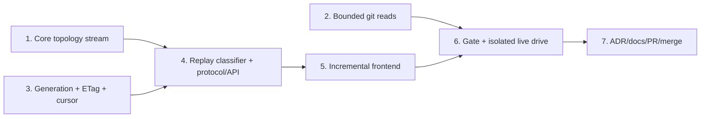

# M1.10 Paged History and Bounded Diff Implementation Plan

> **For agentic workers:** REQUIRED SUB-SKILL: Use superpowers:subagent-driven-development (recommended) or superpowers:executing-plans to implement this plan task-by-task. Steps use checkbox (`- [ ]`) syntax for tracking.

**Goal:** Deliver generation-pinned, stateless paged history; allocation-bounded cancellable diff/file reads; and an incremental virtualized history UI without disturbing the active host server.

**Architecture:** Preserve legacy graph behavior while extracting a checkpointable core topology stream, then implement accepted Choice A by deterministically replaying a gix Topo `DateOrder` walk and skipping to a signed absolute row offset on every page. Generic protocol envelopes carry core-owned graph types, and the mounted frontend canvas appends pages in place while generation drift restarts the aggregate.

**Tech Stack:** Rust 2024, gix 0.84 Topo traversal, Axum, Tokio async process I/O, Serde/JSON, HMAC-SHA256, base64url, Leptos/WASM, JavaScript canvas rendering, Trunk, systemd private network namespaces, Git/GitHub CLI.

## Global Constraints

- The accepted authority is `docs/superpowers/specs/2026-07-25-m1.10-verifier-amendment.md`; it governs wherever it conflicts with the original design or decision log.
- Implement Choice A exactly: stateless deterministic re-walk plus skip using `gix::traverse::commit::topo::Builder` with `topo::Sorting::DateOrder`, seeded by sorted `(full_ref_name, object_id)` tips.
- Preserve legacy `layout()` and `layout_with_refs()` ordering, colouring, badges, stubs, and fixtures; Task 1 is a narrow no-wire topology refactor.
- History generation is refs plus resolved HEAD only, uses `GenerationInputs`/`RepositoryGeneration`, and is encoded as `history-v1:<decimal>`; index and worktree state are excluded.
- Protocol compatibility is a hard `[4,4]` window; HTTP 409 serializes as `ErrorCode::Conflict` / `"conflict"`.
- Frame and page 1 honor explicit `If-None-Match`; cursor pages ignore it and validate the signed generation. Successful history responses use strong ETag `"g:history-v1:<decimal>"`.
- Signed cursors contain only generation plus `HistoryCursor { next_row: usize }`, use a per-process random HMAC-SHA256 key with a truncated 128-bit tag, and verify encoded length and signature before deserialization.
- Generic `HistoryFrame<R>` and `HistoryPage<R, E, S>` live in `git-vista-protocol`; protocol gains no production dependency on core. A core dev-dependency is allowed only for protocol goldens.
- `FrameStub` and `GraphRow` remain core domain types; stubs are delivered on the page that first resolves their anchor, and `GraphRow.color` stays authoritative.
- Remote reachability is exact and unbounded by `HISTORY_LIMIT`: walk all remote-tracking tips until every requested page OID is found or remote history ends. Retain `HISTORY_LIMIT` for activity code.
- Default page limit is 250 and request limit clamps to 1–1000. The default pathological fixture must serialize to at most 512 KiB; this is an integration budget, not a universal wire ceiling.
- Diff/file caps are 200 KB panel patch, 5 MB full patch, 2 MB file content, and 8 MiB for each `-z` metadata read. A metadata cap hit is an explicit error, never a partial file list.
- Convert exactly four `git_stdout` callers in `handlers/read.rs`; enable Tokio `io-util` directly; drain bounded stderr concurrently; kill and await git on cap or cancellation; add `--no-textconv` to all diff reads.
- Keep the intentionally unused `git_stdout` wrapper with a narrow `#[allow(dead_code)]` and D17 rationale. Leave unrelated `.output()` sites out of scope.
- Keep query DTOs open to the frontend's unknown cache-busting `t=` field, and register frame/page reads on both loopback and LAN-view routers.
- Extend the existing six-row-overscan viewport culler; do not add a second culler. Clamp visible-row selection to 2000 rows.
- Never restart, signal, replace, or bind against Tom's host loopback port-8080 iPad session. The live drive runs only in a private systemd network namespace with temporary XDG state/data and verifies the host listener PID is unchanged afterward.
- Each numbered task ends with a pushed `./dev wip` checkpoint. Preserve the source branch locally and remotely after merge.

---

## Execution map



## Setup and execution discipline

- Work from branch `feature/m1.10-introduce-paged-history-and-bounded-diff` at accepted-plan baseline commit `e5e7f08f5f14d379a12f53300e5131caa61300c1`.
- Before Task 1, run `./dev resume`, `git status -sb`, and `git rev-parse HEAD`. Expected: the named branch, no unintended source changes, and the baseline commit or a documented later plan-only checkpoint.
- Keep `handoff.md` current after every red/green cycle with the active task, completed checklist items, and an explicit next step.
- Execute tasks in order. Do not start Task 4 until Task 1's replay-classification equivalence gate and Task 3's cursor/generation tests are green.
- Use `./dev wip "..."` exactly where each task says to checkpoint; it supplies the required `claude_2010`/noreply commit identity and pushes the branch.

### Task 1: Extract checkpointable core topology without wire changes

**Files:**

- Create: `crates/git-vista-core/src/layout/stream.rs` — `StreamLayout`, checkpoint/chunk state, pending-edge resolution, lane high-water, and canonical edge ordering.
- Create: `crates/git-vista-core/src/layout/tests/stream.rs` — checkpoint, membership, cross-window, terminal, and serialized-equivalence tests.
- Modify: `crates/git-vista-core/src/layout/mod.rs` — declare/re-export the stream module, centralize the existing decoration pass, and make both public layout entry points delegate through the stream-backed topology wrapper.
- Modify: `crates/git-vista-core/src/layout/topology.rs` — retain `stable_topo_order` and `trunk_reserve_tip`; expose the lane helpers as `pub(super)` and remove the duplicate topology implementation.
- Modify: `crates/git-vista-core/src/layout/tests/mod.rs` — add `mod stream;` and share the existing fixture/assertion helpers.
- Verify unchanged: `crates/git-vista-core/src/layout/{color,badges}.rs`, `crates/git-vista-core/src/layout/tests/{topology,color,badges}.rs`, and `crates/git-vista-git/src/history.rs`.
- Do not modify in this task: `crates/git-vista-core/src/model.rs` or any protocol/server/frontend DTO.

**Interfaces:**

- Consumes: the existing deterministic children-before-parents vector produced by `stable_topo_order`, `CommitSummary`, `GraphRow`, `Edge`, `Oid`, `trunk_reserve_tip`, and the current post-topology colour/stub/badge functions.
- Produces: the following layout-only API for Task 4. It carries no repository generation and no gix traversal state:

```rust
#[derive(Debug, Clone, PartialEq, Eq)]
pub struct LayoutCheckpoint {
    open_lanes: Vec<Option<Oid>>,
    pending_edges: Vec<PendingEdge>,
    next_row: usize,
    lane_high_water: usize,
}

#[derive(Debug, Clone, Default, PartialEq, Eq)]
pub struct LayoutChunk {
    pub rows: Vec<GraphRow>,
    pub edges: Vec<Edge>,
    /// Commit-lane high-water through this checkpoint; stub lanes are excluded.
    pub lane_count: usize,
}

pub struct StreamLayout { /* checkpoint plus current chunk buffers */ }

impl StreamLayout {
    pub fn new(trunk_tip: Option<Oid>) -> Self;
    pub fn resume(checkpoint: LayoutCheckpoint) -> Self;
    pub fn push<F>(&mut self, commit: CommitSummary, parent_is_in_snapshot: F)
    where
        F: FnMut(&Oid) -> bool;
    pub fn checkpoint(self) -> (LayoutChunk, LayoutCheckpoint);
    pub fn finish(self) -> LayoutChunk;
}

pub fn canonicalize_edges(rows: &[GraphRow], edges: &mut [Edge]);
```

`push` must distinguish a locally present parent that arrives later from a missing/shallow parent. The former reserves a lane and a `PendingEdge`; the latter frees the lane and emits no edge. `canonicalize_edges` restores the legacy row-major/parent-vector order by sorting on `(from_row, parent_ordinal, to_row, from_lane, to_lane)`, recovering `parent_ordinal` from the rows rather than changing `Edge` on the wire.

- [ ] **Step 1: Add the red serialized-equivalence fixture**

Create `one_shot_windows_7_and_1_are_byte_identical` with a 12-commit DAG containing a trunk, two merged side lines, an octopus-style parent order, a tag, a local ref on an interior commit named `aaa`, equal-second tips, and a parent timestamp newer than a child. Normalize once with the unchanged `stable_topo_order`, then feed the same vector as one terminal window, windows of seven, and windows of one.

```rust
assert_eq!(serde_json::to_vec(&one_shot.rows).unwrap(),
           serde_json::to_vec(&windows_7.rows).unwrap());
assert_eq!(serde_json::to_vec(&one_shot.edges).unwrap(),
           serde_json::to_vec(&windows_7.edges).unwrap());
assert_eq!(serde_json::to_vec(&one_shot.rows).unwrap(),
           serde_json::to_vec(&windows_1.rows).unwrap());
assert_eq!(serde_json::to_vec(&one_shot.edges).unwrap(),
           serde_json::to_vec(&windows_1.edges).unwrap());
assert_eq!(one_shot.stubs, windows_7.stubs);
assert_eq!(one_shot.stubs, windows_1.stubs);
assert!(one_shot.stubs.iter().any(|stub| stub.name == "aaa"));
```

Run: `cargo test -p git-vista-core layout::tests::stream::one_shot_windows_7_and_1_are_byte_identical -- --exact --nocapture`

Expected: FAIL to compile because `layout::stream::StreamLayout` does not exist. A partial per-window layout should instead fail with reset row indices, lane reflow, or missing cross-window edges.

- [ ] **Step 2: Preserve absolute rows, lanes, and non-terminal state**

Add `checkpoint_keeps_absolute_rows_and_open_lanes`: feed `c -> b`, checkpoint, resume with `b -> a`, checkpoint, then finish with `a`. Assert absolute rows `[0, 1, 2]`, lane zero for all three, and `lane_count == 1`. Implement `new`, `resume`, lane selection, `next_row`, and monotonic high-water by adapting the one existing topology algorithm rather than copying it.

```rust
let (first, checkpoint) = stream_after(&[c], present(&[c, b, a])).checkpoint();
let (second, checkpoint) = StreamLayout::resume(checkpoint)
    .after(&[b], present(&[c, b, a])).checkpoint();
let third = StreamLayout::resume(checkpoint)
    .after(&[a], present(&[c, b, a])).finish();
assert_eq!(row_numbers(&[first, second, third]), vec![0, 1, 2]);
```

Run: `cargo test -p git-vista-core checkpoint_keeps_absolute_rows_and_open_lanes -- --nocapture`

Expected: PASS for rows/lanes after the minimal state implementation; cross-boundary edge tests remain red.

- [ ] **Step 3: Carry pending edges across checkpoints**

Add `cross_page_merge_edges_emit_once_when_parent_arrives` for `M -> [A, B]`, `A -> R`, `B -> R`, `R`, checkpointing after every commit. Assert exactly `M-A`, `M-B`, `A-R`, and `B-R`; no duplicate; and no chunk contains an edge whose `to_row` is beyond the last delivered row. Add `PendingEdge { parent, parent_ordinal, from_row, from_lane }`; resolve every match when its parent is pushed and retain unresolved entries in `LayoutCheckpoint`.

Run: `cargo test -p git-vista-core cross_page_merge_edges_emit_once_when_parent_arrives -- --nocapture`

Expected: PASS for membership/count, but the flagship serialized comparison remains red until edge order is canonicalized.

- [ ] **Step 4: Canonicalize exact edge order**

Add `canonical_edge_order_is_row_then_parent_vector_order` with merge parent-vector order different from parent arrival order. Implement:

```rust
edges.sort_by_key(|edge| {
    let parent = &rows[edge.to_row].commit.id;
    let ordinal = rows[edge.from_row]
        .commit.parents.iter().position(|oid| oid == parent)
        .expect("well-formed layout edge names a parent");
    (edge.from_row, ordinal, edge.to_row, edge.from_lane, edge.to_lane)
});
```

Run: `cargo test -p git-vista-core canonical_edge_order_is_row_then_parent_vector_order -- --nocapture`

Expected: PASS and exact `Vec<Edge>` equality rather than set equality.

- [ ] **Step 5: Pin exact parent membership and terminal behavior**

Add these tests before implementation:

- `dangling_parent_does_not_hold_lane_or_emit_edge`: predicate false yields one row, one lane, zero edges.
- `terminal_finish_discards_unresolved_edge`: predicate true but absent terminal parent yields no invalid edge.
- `trunk_reservation_survives_checkpoint_before_tip`: reserve `T`, push newer side `X -> T`, checkpoint, then `T`; assert `X` lane 1 and `T` lane 0.

Implement terminal cleanup and filter `trunk_tip` through the same membership set used by `push`. For the legacy one-shot wrapper, build `HashSet<Oid>` from normalized input and pass `|oid| present.contains(oid)`.

Run: `cargo test -p git-vista-core layout::tests::stream -- --nocapture`

Expected: PASS for membership, terminal, checkpoint, and edge-order tests.

- [ ] **Step 6: Delegate both legacy public entry points through one topology pass**

Keep the legacy wrapper order exactly:

```text
stable_topo_order
  -> exact membership set and filtered trunk tip
  -> StreamLayout feed + finish + canonicalize_edges
  -> assign_branch_colors
  -> current stub cascade grouping/lane widening
  -> attach_ref_badges
```

Extract only the common decoration helper in `layout/mod.rs`; do not stream or alter colour/stub/badge semantics in Task 1. Delete the old topology body so there is one lane algorithm.

Run: `cargo test -p git-vista-core layout::tests::stream::one_shot_windows_7_and_1_are_byte_identical -- --exact --nocapture`

Expected: PASS with byte-identical serialized rows/edges and identical interior stub output.

- [ ] **Step 7: Run the Task 1 regression net**

Run:

```bash
cargo test -p git-vista-core --lib -- --nocapture
cargo test -p git-vista-git a_branch_created_at_an_interior_commit_renders_as_a_stub -- --nocapture
cargo fmt --all -- --check
cargo clippy -p git-vista-core --all-targets -- -D warnings
cargo clippy -p git-vista-git --all-targets -- -D warnings
cargo test --workspace
git diff --check
```

Expected: PASS, including unchanged `layout_is_deterministic_whatever_order_ties_arrive_in`, `a_time_skewed_child_is_still_laid_out_above_its_parent`, `dangling_parents_are_skipped`, all colour/stub tests, and the issue-#28 interior-stub integration test.

**Done when:** one topology algorithm backs both legacy entry points; window 7/window 1 preserve absolute geometry and exact canonical edges; missing parents and terminal pending edges are safe; all existing visible layout semantics remain unchanged; no protocol/model/server/frontend file changed.

- [ ] **Step 8: Checkpoint Task 1**

Update `handoff.md`, inspect `git status --short`, then run:

```bash
./dev wip "wip(#63): checkpointable core topology layout"
```

Expected: the intended Task 1 files and handoff are committed and pushed; `./dev resume` identifies Task 2 as the next step.

### Task 2: Bound and cancel diff/file git reads

**Files:**

- Modify: `crates/git-vista-server/Cargo.toml` — add Tokio's `io-util` feature directly.
- Modify: `crates/git-vista-server/src/git_cmd.rs` — streaming capped stdout, concurrent bounded stderr drain, D17 wrapper, process-reaping and cancellation tests.
- Modify: `crates/git-vista-server/src/handlers/read.rs` — convert exactly three diff reads and one file read; add metadata cap, `--no-textconv`, repo-parameterized test seams, and pathological endpoint tests.
- Verify unchanged: `crates/git-vista-server/src/argv_boundary.rs` — tests must launch literal `git` and never add shell/`yes`/`dd`/`head` allowances.

**Interfaces:**

- Consumes: existing `git_error`, explicit git argv construction, `parse_name_status_z`, `fold_numstat_z`, `truncate_at_line`, `CommitDiff`, and `FileContent`.
- Produces:

```rust
pub(crate) async fn git_stdout_capped(
    repo: &Path,
    args: &[String],
    endpoint: &str,
    cap: usize,
) -> Result<(Vec<u8>, bool), (StatusCode, String)>;

#[allow(dead_code)] // D17: future callers fail safe at 8 MiB.
pub(crate) async fn git_stdout(
    repo: &Path,
    args: &[String],
    endpoint: &str,
) -> Result<Vec<u8>, (StatusCode, String)>;
```

The child uses `stdin(Stdio::null())`, piped stdout/stderr, and `kill_on_drop(true)`. Stdout retains at most `cap` bytes and reads one probe byte after exactly filling the cap. Stderr is drained concurrently to EOF while retaining at most 64 KiB. A cap hit is successful: explicitly kill and await the child, await the stderr task, return `(bytes, true)`, and do not reinterpret the killed status as a git error. Only the below-cap path checks exit status.

```rust
const DEFAULT_GIT_STDOUT_CAP: usize = 8 * 1024 * 1024;
const STDERR_CAPTURE_CAP: usize = 64 * 1024;
// handlers/read.rs
const DIFF_METADATA_CAP: usize = 8 * 1024 * 1024;
const DIFF_PATCH_CAP: usize = 200_000;
const DIFF_PATCH_CAP_FULL: usize = 5_000_000;
const FILE_CONTENT_CAP: usize = 2_000_000;
```

- [ ] **Step 1: Write red primitive tests around a real git child**

Add `git_stdout_capped_truncates_before_allocation_growth`, `git_stdout_capped_distinguishes_exact_cap_from_over_cap`, `git_stdout_capped_returns_small_output_verbatim`, and `git_stdout_capped_preserves_git_errors`. Build blobs in a temp repository through literal `git hash-object`/`git cat-file`, then assert:

```rust
let (bytes, truncated) = git_stdout_capped(repo.path(), &args, "test", 4096).await.unwrap();
assert_eq!(bytes.len(), 4096);
assert!(truncated);
```

Run: `cargo test -p git-vista-server git_stdout_capped -- --nocapture`

Expected: FAIL because `git_stdout_capped` and direct Tokio `io-util` support are absent.

- [ ] **Step 2: Implement the bounded reader and normal-path reaping**

Implement a private `read_to_cap` that reserves no more than the cap, reads until cap, probes once, and returns `Capped { bytes, truncated }`. Spawn the stderr drain before reading stdout.

```rust
match read_to_cap(stdout, cap).await? {
    Capped { bytes, truncated: true } => {
        let _ = child.kill().await;
        let _ = child.wait().await;
        let _ = stderr_task.await;
        Ok((bytes, true))
    }
    Capped { bytes, truncated: false } => {
        let status = child.wait().await.map_err(io_error)?;
        let stderr = stderr_task.await.unwrap_or_default();
        if status.success() { Ok((bytes, false)) }
        else { Err(git_error(endpoint, &stderr)) }
    }
}
```

Run: `cargo test -p git-vista-server git_stdout_capped -- --nocapture`

Expected: PASS for cap/exact-cap/small/error cases, with no lingering child process.

- [ ] **Step 3: Prove cancellation kills the owned child**

Add an internal test seam that reports `Child::id`. In `dropping_capped_read_kills_git_child`, start literal `git cat-file --batch` with its stdin held open, obtain the PID, abort/drop the read future, and poll `/proc/<pid>` with a short deadline. Assert the PID disappears; do not assert only that the Rust task ended.

Run: `cargo test -p git-vista-server dropping_capped_read_kills_git_child -- --exact --nocapture`

Expected: FAIL before `kill_on_drop(true)`; PASS after the child is owned by the dropped future. This test proves primitive cancellation, not an end-to-end TCP disconnect.

- [ ] **Step 4: Retain the bounded fail-safe wrapper**

Implement `git_stdout` as a thin call with `DEFAULT_GIT_STDOUT_CAP`; return bytes and deliberately discard its truncation bit. Apply only the narrow `#[allow(dead_code)]` shown in the interface because all four current callers become explicit and Clippy otherwise rejects the D17 fail-safe.

Run: `cargo clippy -p git-vista-server --all-targets -- -D warnings`

Expected: PASS with no crate- or module-wide lint allowance.

- [ ] **Step 5: Convert the three diff invocations with distinct semantics**

Build all three diff argv vectors with `--no-textconv`. Send `--name-status -z` and `--numstat -z` through `DIFF_METADATA_CAP`; if either reports truncation, return `StatusCode::PAYLOAD_TOO_LARGE` with `"diff metadata exceeded 8 MiB"`. Send `--patch` through the selected 200,000/5,000,000-byte cap.

```rust
let (name_status, names_truncated) =
    git_stdout_capped(repo, &name_args, "diff", DIFF_METADATA_CAP).await?;
if names_truncated {
    return Err((StatusCode::PAYLOAD_TOO_LARGE,
                "diff metadata exceeded 8 MiB".into()));
}
let (patch, truncated) =
    git_stdout_capped(repo, &patch_args, "diff", patch_cap).await?;
```

Use the reader boolean as the authoritative `CommitDiff.truncated`. On truncated text, `truncate_at_line` may tidy the bounded bytes; do not recompute truncation from lossy UTF-8 length.

Run: `cargo test -p git-vista-server bounded_diff_argv -- --nocapture`

Expected: the new argv/cap tests PASS and both metadata cap-hit tests return 413 rather than partial `files`.

- [ ] **Step 6: Convert file reads without triggering the parent fallback on a cap**

Call `git_stdout_capped(..., FILE_CONTENT_CAP)`. Treat `Ok((bytes, true))` as a successful truncated file; retry `id^:path` only for the existing missing-at-commit error path. Preserve line-boundary tidying for text and the existing binary representation.

Run: `cargo test -p git-vista-server bounded_file_read -- --nocapture`

Expected: a >2 MiB existing text file returns HTTP success, at most 2,000,000 source bytes before decoding, and `truncated == true`, with no parent fallback.

- [ ] **Step 7: Exercise the handlers with pathological repository content**

Extract `commit_diff_for_repo(repo, id, full)` and `file_at_commit_for_repo(repo, id, path)` so tests avoid global `CURRENT`. Build a ~50 MiB text file in fixed chunks plus a NUL-containing binary blob, commit and modify both, then add `bounded_diff_handles_large_text_and_binary_without_blob_leak` and `bounded_file_handler_caps_large_existing_file`.

Assert the panel patch is `<= DIFF_PATCH_CAP`, `truncated`, contains Git's `Binary files ... differ`, excludes the binary sentinel bytes, and gives that `DiffFile` `additions == None && deletions == None`. Assert the full patch is `<= DIFF_PATCH_CAP_FULL`, and the file response reports the 2 MB cap.

Run: `cargo test -p git-vista-server bounded_diff -- --nocapture`

Expected: PASS through the real handler helpers. The test must fail if a caller is switched back to `.output()` or post-allocation truncation.

- [ ] **Step 8: Verify exact scope and checkpoint**

Run:

```bash
rg -n "git_stdout\(" crates/git-vista-server/src/handlers/read.rs
rg -n "git_stdout_capped\(" crates/git-vista-server/src/handlers/read.rs
cargo test -p git-vista-server git_stdout_capped -- --nocapture
cargo test -p git-vista-server bounded_diff -- --nocapture
cargo fmt --all -- --check
cargo clippy -p git-vista-server --all-targets -- -D warnings
git diff --check
```

Expected: zero old calls and exactly four capped call sites in `handlers/read.rs`; all focused tests and lint pass. Unrelated `.output()` sites remain untouched.

**Done when:** cap allocation occurs before handler memory can grow; exactly four callers use explicit caps; metadata never truncates silently; binary textconv is disabled; cap paths kill/reap; dropped futures kill children; the endpoint fixture proves the wiring.

Update `handoff.md`, then run:

```bash
./dev wip "wip(#63): bound cancellable diff and file reads"
```

Expected: Task 2 is committed/pushed and `./dev resume` names Task 3 next.

### Task 3: Add history generation, ETags, signed offset cursors, and conflict semantics

**Files:**

- Create: `crates/git-vista-server/src/history.rs` — exact refs/HEAD snapshot, full traversal tips, history token/ETag helpers, offset cursor, generic signed codec, and drift errors.
- Modify: `crates/git-vista-server/src/main.rs` — declare `mod history;` only; Task 4 wires the process-wide codec into routers.
- Modify: `crates/git-vista-server/src/session.rs` — expose `random_secret_bytes() -> [u8; 32]`, implement `mint_secret()` through it, and reuse `ct_eq`.
- Modify: `crates/git-vista-server/Cargo.toml` — add direct `hmac = "0.12"` and `base64 = "0.22"` dependencies.
- Modify: `crates/git-vista-protocol/src/error.rs` — add `ErrorCode::Conflict`, status mappings, and stable wire tests; Task 4 performs the protocol v4 bump and goldens.
- Verify/reuse: `crates/git-vista-core/src/identity.rs` — `GenerationInputs` and `RepositoryGeneration`; do not add another digest implementation.

**Interfaces:**

- Produces an exact snapshot whose generation and Topo seeds come from the same repository read:

```rust
#[derive(Debug, Clone, PartialEq, Eq)]
pub(crate) struct HistoryTip {
    pub full_ref_name: String,
    pub object_id: Oid,
}

pub(crate) struct HistorySnapshot {
    pub refs: Vec<GitRef>,
    pub head_branch: Option<String>,
    pub resolved_head: Option<Oid>,
    pub tips: Vec<HistoryTip>, // sorted by (full_ref_name, object_id)
    pub generation: GenerationToken, // history-v1:<decimal>
}

pub(crate) async fn read_history_snapshot(
    repo: &Path,
) -> Result<HistorySnapshot, (StatusCode, String)>;

pub(crate) fn history_etag(generation: &GenerationToken) -> HeaderValue;
pub(crate) fn if_none_match(headers: &HeaderMap, generation: &GenerationToken) -> bool;
pub(crate) fn require_same_generation(
    expected: &GenerationToken,
    actual: &GenerationToken,
) -> Result<(), (StatusCode, String)>;
```

Open gix once. Record HEAD's full symbolic target and peeled object, enumerate branch/tag/remote refs using full names and peeled commit ids, build display `GitRef`s separately, remove duplicate tip pairs, and sort tips lexicographically by `(full_ref_name, object_id)`. Build the digest with:

```rust
let mut inputs = GenerationInputs::new();
inputs.field("recipe", "history-v1");
inputs.head(symbolic_head.as_deref(), resolved_head.as_ref());
for tip in &tips {
    inputs.reference(&tip.full_ref_name, &ObjectId::parse(tip.object_id.as_str())?);
}
let token = GenerationToken::new(format!("history-v1:{}", inputs.generation()))?;
```

Do not call `index()` or `worktree()`. HEAD is a generation input but not a duplicate traversal seed when the same target is already represented; a detached resolved HEAD must still be seeded under a deterministic pseudo-name such as `HEAD`.

- Produces a small, fixed-state signed cursor:

```rust
pub(crate) const MAX_ENCODED_CURSOR_LEN: usize = 512;
const CURSOR_FORMAT_VERSION: u8 = 1;
const CURSOR_TAG_BYTES: usize = 16;

#[derive(Debug, Clone, Copy, PartialEq, Eq, Serialize, Deserialize)]
pub(crate) struct HistoryCursor {
    pub next_row: usize,
}

#[derive(Serialize, Deserialize)]
struct CursorEnvelope<T> {
    version: u8,
    generation: GenerationToken,
    state: T,
}

pub(crate) struct DecodedCursor<T> {
    pub generation: GenerationToken,
    pub state: T,
}

pub(crate) struct CursorCodec { key: [u8; 32] }

impl CursorCodec {
    pub(crate) fn new() -> Self;
    #[cfg(test)] pub(crate) fn with_key(key: [u8; 32]) -> Self;
    pub(crate) fn encode<T: Serialize>(
        &self,
        generation: &GenerationToken,
        state: &T,
    ) -> Result<String, CursorError>;
    pub(crate) fn decode<T: DeserializeOwned>(
        &self,
        encoded: &str,
    ) -> Result<DecodedCursor<T>, CursorError>;
}
```

Wire form is `BASE64URL_NO_PAD(json-envelope).BASE64URL_NO_PAD(tag[0..16])`. Reject an input longer than 512 bytes before base64 allocation; require exactly one dot; decode bounded parts; recompute HMAC-SHA256; compare the 16-byte tag through `session::ct_eq`; only then deserialize and validate version. All codec errors map to the same generic HTTP 400 message. Process restart rotates the key, so pre-restart cursors deliberately fail and the frontend restarts at page 1.

- [ ] **Step 1: Add red snapshot/generation tests**

Add `history_generation_is_stable_across_ref_enumeration_order`, `history_generation_changes_when_ref_moves`, `history_generation_changes_when_symbolic_or_resolved_head_moves`, and `history_generation_ignores_index_and_worktree_changes`. Add `history_tips_use_sorted_full_names_and_ids` with local/remote/tag refs sharing one target and detached HEAD coverage.

Run: `cargo test -p git-vista-server history_generation -- --nocapture`

Expected: FAIL because `history`/`read_history_snapshot` do not exist.

- [ ] **Step 2: Implement the exact refs-plus-HEAD snapshot**

Reuse the classification behavior of `git-vista-git/src/refs.rs`, but retain the full gix ref name before producing the display-short `GitRef.name`. Do not derive traversal tips back from display refs. Feed the `recipe=history-v1` discriminator plus HEAD and sorted full refs to `GenerationInputs`.

Run: `cargo test -p git-vista-server history_generation -- --nocapture`

Expected: all generation/tip tests PASS; `git status --porcelain`, index changes, and untracked files leave the token byte-identical.

- [ ] **Step 3: Add and implement strong ETag matching**

Write `history_etag_is_quoted_and_strong` plus `if_none_match_accepts_exact_list_weak_and_star` and `if_none_match_rejects_malformed_or_different`. Required values:

```rust
assert_eq!(history_etag(&token).to_str().unwrap(),
           "\"g:history-v1:42\"");
for raw in ["\"g:history-v1:42\"",
            "\"other\", \"g:history-v1:42\"",
            "W/\"g:history-v1:42\"", "*"] {
    assert!(matches_generation(raw, &token));
}
```

Run: `cargo test -p git-vista-server if_none_match -- --nocapture`

Expected: FAIL before helpers, then PASS. A malformed header is a non-match, never a 500.

- [ ] **Step 4: Add red cursor authentication tests**

With `CursorCodec::with_key([0x5a; 32])`, add `signed_offset_cursor_round_trips`, `cursor_rejects_payload_tamper_before_deserialize`, `cursor_rejects_tag_tamper`, `cursor_rejects_malformed_base64_and_extra_part`, `cursor_rejects_wrong_version`, and `cursor_rejects_over_512_bytes_before_decode`. Use a test-only deserialize type whose visitor flips an `AtomicBool`; assert it remains false for a bad signature.

Run: `cargo test -p git-vista-server cursor_ -- --nocapture`

Expected: FAIL because `CursorCodec`/`HistoryCursor` are absent.

- [ ] **Step 5: Implement HMAC-before-deserialize and process-key rotation**

Expose entropy without changing existing session token text:

```rust
pub(crate) fn random_secret_bytes() -> [u8; 32] {
    let mut bytes = [0_u8; 32];
    getrandom::getrandom(&mut bytes).expect("OS CSPRNG unavailable");
    bytes
}

fn mint_secret() -> String { to_hex(&random_secret_bytes()) }
```

Implement codec encode/decode with `hmac::{Hmac, Mac}` and `base64::engine::general_purpose::URL_SAFE_NO_PAD`. Make the length guard the first decode branch and signature verification the last operation before `serde_json::from_slice`.

Run: `cargo test -p git-vista-server cursor_ -- --nocapture`

Expected: PASS, including encoded length comfortably below 512 bytes for `HistoryCursor { next_row: usize::MAX }` and a maximum decimal generation.

- [ ] **Step 6: Add typed conflict semantics and the reusable drift gate**

Add `Conflict` to `ErrorCode`, serialize it as `"conflict"`, map `http_status()` to 409 and `from_status(StatusCode::CONFLICT)` back to it. Implement `require_same_generation` with exact `"history moved"` wording.

```rust
assert_eq!(serde_json::to_string(&ErrorCode::Conflict).unwrap(), "\"conflict\"");
assert_eq!(ErrorCode::Conflict.http_status(), StatusCode::CONFLICT);
assert_eq!(ErrorCode::from_status(StatusCode::CONFLICT), ErrorCode::Conflict);
```

Run: `cargo test -p git-vista-protocol conflict -- --nocapture && cargo test -p git-vista-server require_same_generation -- --nocapture`

Expected: FAIL before the new variant/helper, then PASS. This intentionally changes all 409 envelopes and is completed under v4 in Task 4.

- [ ] **Step 7: Verify Task 3 and checkpoint**

Run:

```bash
cargo test -p git-vista-server history::tests -- --nocapture
cargo test -p git-vista-protocol error -- --nocapture
cargo fmt --all -- --check
cargo clippy -p git-vista-server --all-targets -- -D warnings
cargo clippy -p git-vista-protocol --all-targets -- -D warnings
git diff --check
```

Expected: all snapshot/ETag/cursor/drift/error tests PASS; Clippy confirms direct dependency use and no leaked private key material.

**Done when:** history and planner generations are visibly separate recipes; tip ordering uses full ref names and ids; ETags are deterministic; unsigned state is never deserialized; the cursor is fixed and small; restart key rotation invalidates old cursors; 409 is machine-readable `conflict`.

Update `handoff.md`, then run:

```bash
./dev wip "wip(#63): history generation ETags and signed cursors"
```

Expected: Task 3 is committed/pushed and Task 4 is the explicit next step.

### Task 4: Implement replay classification, protocol v4, and history endpoints

**Files:**

**Interfaces:**

### Task 5: Append paged history inside the mounted virtualized frontend

**Files:**

**Interfaces:**

### Task 6: Run the full gate and isolated large-repository live drive

**Files:**

**Interfaces:**

### Task 7: Record the architecture and complete the GitHub workflow

**Files:**

**Interfaces:**
