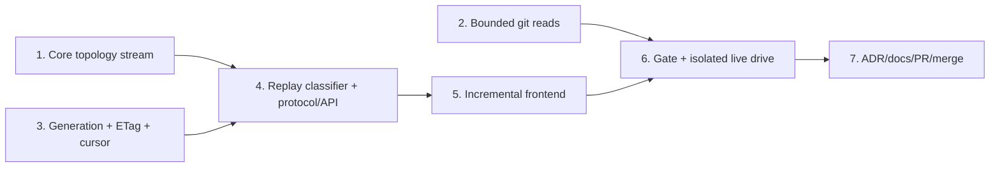
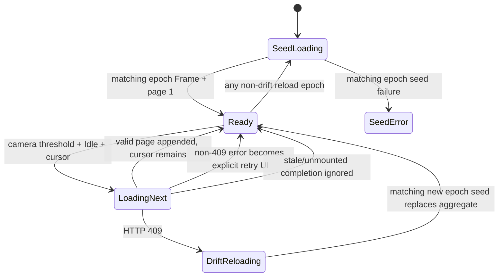
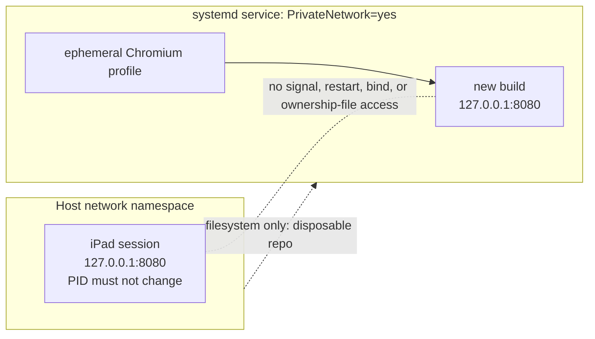

# M1.10 Paged History and Bounded Diff Implementation Plan

> **For agentic workers:** REQUIRED SUB-SKILL: Use superpowers:subagent-driven-development (recommended) or superpowers:executing-plans to implement this plan task-by-task. Steps use checkbox (`- [ ]`) syntax for tracking.

**Goal:** Deliver generation-pinned, stateless paged history; allocation-bounded cancellable diff/file reads; and an incremental virtualized history UI without disturbing the active host server.

**Architecture:** Preserve legacy graph behavior while extracting a checkpointable core topology stream, then implement accepted Choice A by deterministically replaying a gix Topo `DateOrder` walk and skipping to a signed absolute row offset on every page. Generic protocol envelopes carry core-owned graph types, and the mounted frontend canvas appends pages in place while generation drift restarts the aggregate.

**Tech Stack:** Rust 2024, gix 0.84 Topo traversal, Axum, Tokio async process I/O, Serde/JSON, HMAC-SHA256, base64url, Leptos/WASM, JavaScript canvas rendering, Trunk, systemd private network namespaces, Git/GitHub CLI.

## Global Constraints

- The corrective authority is `docs/superpowers/specs/2026-07-25-m1.10-verifier-amendment.md`; this plan must not implement a contradicted claim from the original design or decision log while that revision awaits independent re-review.
- Implement Choice A exactly: stateless deterministic re-walk plus skip using `gix::traverse::commit::topo::Builder` with `topo::Sorting::DateOrder`, seeded by sorted `(full_ref_name, object_id)` tips. Its object/find input must cut parents only when the current commit's OID is in the recorded shallow-boundary set; an unrecorded missing, wrong-kind, malformed, or corrupt object is an explicit read error.
- Preserve legacy `layout()` and `layout_with_refs()` ordering, colouring, badges, stubs, and fixtures; Task 1 is a narrow no-wire topology refactor.
- History generation uses `GenerationInputs`/`RepositoryGeneration` over sorted full refs, symbolic/resolved HEAD, and the validated, sorted, deduplicated `$GIT_DIR/shallow` OID set, and is encoded as `history-v1:<decimal>`. Each boundary uses a unique `shallow:<oid>` field; malformed shallow metadata is an explicit snapshot read error; index and worktree state remain excluded. Re-read all three inputs together before responding; after a walk error, return 409 if that re-read moved, otherwise return the explicit read error.
- Protocol compatibility is a hard `[4,4]` window; HTTP 409 serializes as `ErrorCode::Conflict` / `"conflict"`.
- History generation is a snapshot/cursor token, not an ETag. Serialize each selected Frame or Page once, SHA-256 those exact response bytes, and emit type-separated strong ETags `"gv4-frame:<hex-sha256>"` or `"gv4-page:<hex-sha256>"`. Frame and page 1 use RFC weak `If-None-Match` comparison; cursor pages ignore the precondition but return their body-derived Page ETag.
- Signed cursors contain a fixed-size opaque repository/worktree scope, generation, and `HistoryCursor { next_row: usize }`, use a per-process random HMAC-SHA256 key with a truncated 128-bit tag, and verify encoded length and signature before deserialization. Registered scopes bind both `RepositoryId` and `WorktreeId`; degraded targets get a per-process opaque binding tied to the resolved canonical target. Scope mismatch is a generic 400 before traversal, and the frontend carries Frame's `worktree_id` as `repo=` on every page request when present.
- Generic `HistoryFrame<R>` and `HistoryPage<R, E, S>` live in `git-vista-protocol`; protocol gains no production dependency on core. A core dev-dependency is allowed only for protocol goldens.
- `FrameStub` and `GraphRow` remain core domain types; stubs are delivered on the page that first resolves their anchor, and `GraphRow.color` stays authoritative.
- Remote reachability is exact and unbounded by `HISTORY_LIMIT`: walk all remote-tracking tips until every requested page OID is found or remote history ends. Retain `HISTORY_LIMIT` for activity code.
- Default page limit is 250 and request limit clamps to 1–1000. The default pathological fixture must serialize to at most 512 KiB; this is an integration budget, not a universal wire ceiling.
- Diff/file caps are 200 KB panel patch, 5 MB full patch, 2 MB file content, and 8 MiB for each `-z` metadata read. A metadata cap hit is an explicit error, never a partial file list.
- Convert exactly four `git_stdout` callers in `handlers/read.rs`; enable Tokio `io-util` directly; drain bounded stderr concurrently; explicitly kill/await git on a cap and rely on kill-on-drop when cancellation drops the future; add `--no-textconv` to all diff reads.
- Keep the intentionally unused `git_stdout` wrapper with a narrow `#[allow(dead_code)]` and D17 rationale. Leave unrelated `.output()` sites out of scope.
- Keep query DTOs open to the frontend's unknown cache-busting `t=` field, and register frame/page reads on both loopback and LAN-view routers.
- Every focused Rust test command must first prove its exact full harness name with a `--list`/`rg -x` command, then run that full name with `--exact`; each step below supplies both commands. A grouped gate must list-witness every test it claims. A successful zero-test or partial-filter run is never red/green evidence.
- Extend the existing six-row-overscan viewport culler; do not add a second culler. Clamp visible-row selection to 2000 rows.
- Never restart, signal, replace, or bind against Tom's host loopback port-8080 iPad session. The live drive runs only in a private systemd network namespace with temporary XDG state/data and verifies the host listener PID is unchanged afterward.
- Each numbered task ends with a pushed `./dev wip` checkpoint. Preserve the source branch locally and remotely after merge.

---

## Execution map



## Setup and execution discipline

- This plan was assembled on branch `feature/m1.10-introduce-paged-history-and-bounded-diff` at planning checkpoint `a46391a2cc86672e7b3973a81f74bdbe2d09ec64`; the final plan-only checkpoint must be a descendant of it.
- Before Task 1, run `./dev resume`, `git status -sb`, and `git rev-parse HEAD`. Expected: the named branch, no unintended source changes, and the final pushed plan checkpoint (or a documented descendant containing only approved follow-up edits).
- Keep `handoff.md` current after every red/green cycle with the active task, completed checklist items, and an explicit next step.
- Execute tasks in order. Do not start Task 4 until Task 1's replay-classification equivalence gate and Task 3's cursor/generation tests are green.
- Use `./dev wip "..."` exactly where each task says to checkpoint; it supplies the required `claude_2010`/noreply commit identity and pushes the branch.

### Task 1: Extract checkpointable core topology without wire changes

**Files:**

- Create: `crates/git-vista-core/src/layout/stream.rs` — `StreamLayout`, checkpoint/chunk state, pending/resolved edge sidecars, lane high-water, and full-aggregate canonical edge ordering.
- Create: `crates/git-vista-core/src/layout/tests/stream.rs` — checkpoint, membership, cross-window, terminal, and serialized-equivalence tests.
- Modify: `crates/git-vista-core/src/layout/mod.rs` — declare/re-export the stream module, centralize the existing decoration pass, and make both public layout entry points delegate through the stream-backed topology wrapper.
- Modify: `crates/git-vista-core/src/layout/topology.rs` — retain `stable_topo_order` and `trunk_reserve_tip`; expose the lane helpers as `pub(super)` and remove the duplicate topology implementation.
- Modify: `crates/git-vista-core/src/layout/tests/mod.rs` — add `mod stream;` and share the existing fixture/assertion helpers.
- Verify unchanged: `crates/git-vista-core/src/layout/{color,badges}.rs`, `crates/git-vista-core/src/layout/tests/{topology,color,badges}.rs`, and `crates/git-vista-git/src/history.rs`.
- Do not modify in this task: `crates/git-vista-core/src/model.rs` or any protocol/server/frontend DTO.

**Interfaces:**

- Consumes: the existing deterministic children-before-parents vector produced by `stable_topo_order`, `CommitSummary`, `GraphRow`, `Edge`, `Oid`, `trunk_reserve_tip`, and the current post-topology colour/stub/badge functions.
- Produces: the following layout-only API for Task 4. It carries no repository generation and no gix traversal state:

```rust
#[derive(Debug, Clone, PartialEq, Eq)]
pub struct LayoutCheckpoint {
    open_lanes: Vec<Option<Oid>>,
    pending_edges: Vec<PendingEdge>,
    next_row: usize,
    lane_high_water: usize,
}

#[derive(Debug, Clone, Default, PartialEq, Eq)]
pub struct LayoutChunk {
    pub rows: Vec<GraphRow>,
    pub resolved_edges: Vec<ResolvedEdge>,
    /// Commit-lane high-water through this checkpoint; stub lanes are excluded.
    pub lane_count: usize,
}

#[derive(Debug, Clone, PartialEq, Eq)]
pub struct PendingEdge {
    parent_oid: Oid,
    parent_ordinal: usize,
    from_row: usize,
    from_lane: usize,
}

#[derive(Debug, Clone, PartialEq, Eq)]
pub struct ResolvedEdge {
    pub edge: Edge,
    pub parent_ordinal: usize,
}

pub struct StreamLayout { /* checkpoint plus current chunk buffers */ }

impl StreamLayout {
    pub fn new(trunk_tip: Option<Oid>) -> Self;
    pub fn resume(checkpoint: LayoutCheckpoint) -> Self;
    pub fn push<F>(&mut self, commit: CommitSummary, parent_is_in_snapshot: F)
    where
        F: FnMut(&Oid) -> bool;
    pub fn checkpoint(self) -> (LayoutChunk, LayoutCheckpoint);
    pub fn finish(self) -> LayoutChunk;
}

pub fn sort_resolved_edges(edges: &mut [ResolvedEdge]);
pub fn strip_resolved_edges(edges: Vec<ResolvedEdge>) -> Vec<Edge>;
/// Full aggregate starting at absolute row zero only; never pass page-local rows.
pub fn canonicalize_edges(rows: &[GraphRow], edges: &mut [Edge]);
```

`push` distinguishes a parent included by its caller's exact membership predicate from one deliberately cut by that predicate. An included later parent reserves a lane and `PendingEdge`; a cut parent reserves nothing. Resolving a pending edge retains `parent_ordinal` in `ResolvedEdge`. `sort_resolved_edges` orders a chunk by `(from_row, parent_ordinal, to_row, from_lane, to_lane)` before `strip_resolved_edges` creates wire `Edge`s, so a later page never indexes an absolute `from_row` into its page-local rows. `canonicalize_edges(rows, edges)` recovers parent ordinal from rows only for legacy/full aggregates beginning at absolute row zero and for a completed-union oracle; it is forbidden on page-local row slices.

For a response window `[n, n + k)`, the chunk owns all and only resolved edges with `n <= edge.to_row < n + k`. `edge.from_row` may be below `n`. Future-parent edges remain pending at checkpoint; replay of a later request reconstructs them. Prefix-resolved edges are discarded below the response floor, so every edge is emitted exactly once on the page containing its destination.

- [ ] **Step 1: Add the red serialized-equivalence fixture**

Create `one_shot_windows_7_and_1_are_byte_identical` with a 12-commit DAG containing a trunk, two merged side lines, an octopus-style parent order, a tag, a local ref on an interior commit named `aaa`, equal-second tips, and a parent timestamp newer than a child. Normalize once with the unchanged `stable_topo_order`, then feed the same vector as one terminal window, windows of seven, and windows of one.

```rust
assert_eq!(serde_json::to_vec(&one_shot.rows).unwrap(),
           serde_json::to_vec(&windows_7.rows).unwrap());
assert_eq!(serde_json::to_vec(&one_shot.edges).unwrap(),
           serde_json::to_vec(&windows_7.edges).unwrap());
assert_eq!(serde_json::to_vec(&one_shot.rows).unwrap(),
           serde_json::to_vec(&windows_1.rows).unwrap());
assert_eq!(serde_json::to_vec(&one_shot.edges).unwrap(),
           serde_json::to_vec(&windows_1.edges).unwrap());
assert_eq!(one_shot.stubs, windows_7.stubs);
assert_eq!(one_shot.stubs, windows_1.stubs);
assert!(one_shot.stubs.iter().any(|stub| stub.name == "aaa"));
```

Run:

```bash
cargo test -p git-vista-core -- --list | rg -x 'layout::tests::stream::one_shot_windows_7_and_1_are_byte_identical: test'
cargo test -p git-vista-core layout::tests::stream::one_shot_windows_7_and_1_are_byte_identical -- --exact --nocapture
```

Expected: FAIL to compile because `layout::stream::StreamLayout` does not exist. A partial per-window layout should instead fail with reset row indices, lane reflow, or missing cross-window edges.

- [ ] **Step 2: Preserve absolute rows, lanes, and non-terminal state**

Add `checkpoint_keeps_absolute_rows_and_open_lanes`: feed `c -> b`, checkpoint, resume with `b -> a`, checkpoint, then finish with `a`. Assert absolute rows `[0, 1, 2]`, lane zero for all three, and `lane_count == 1`. Implement `new`, `resume`, lane selection, `next_row`, and monotonic high-water by adapting the one existing topology algorithm rather than copying it.

```rust
let present = HashSet::from([c.id.clone(), b.id.clone(), a.id.clone()]);
let mut stream = StreamLayout::new(None);
stream.push(c, |oid| present.contains(oid));
let (first, checkpoint) = stream.checkpoint();
let mut stream = StreamLayout::resume(checkpoint);
stream.push(b, |oid| present.contains(oid));
let (second, checkpoint) = stream.checkpoint();
let mut stream = StreamLayout::resume(checkpoint);
stream.push(a, |oid| present.contains(oid));
let third = stream.finish();
assert_eq!(row_numbers(&[first, second, third]), vec![0, 1, 2]);
```

Run:

```bash
cargo test -p git-vista-core -- --list | rg -x 'layout::tests::stream::checkpoint_keeps_absolute_rows_and_open_lanes: test'
cargo test -p git-vista-core layout::tests::stream::checkpoint_keeps_absolute_rows_and_open_lanes -- --exact --nocapture
```

Expected: PASS for rows/lanes after the minimal state implementation; cross-boundary edge tests remain red.

- [ ] **Step 3: Carry pending edges with destination-page ownership**

Add `cross_page_edges_belong_to_destination_page_and_emit_once` for `M -> [A, B]`, `A -> R`, `B -> R`, `R`, checkpointing after every commit. Assert exactly `M-A`, `M-B`, `A-R`, and `B-R` across all chunks with no duplicate. For each chunk `[n, n + k)`, assert every emitted edge has `n <= to_row < n + k`; allow `from_row < n`; and assert no unresolved future-parent edge is serialized. Add the exact `PendingEdge`/`ResolvedEdge` sidecars from the interface, resolve every matching parent when pushed, and retain only unresolved entries in `LayoutCheckpoint`.

Run:

```bash
cargo test -p git-vista-core -- --list | rg -x 'layout::tests::stream::cross_page_edges_belong_to_destination_page_and_emit_once: test'
cargo test -p git-vista-core layout::tests::stream::cross_page_edges_belong_to_destination_page_and_emit_once -- --exact --nocapture
```

Expected: PASS for destination ownership and exactly-once membership, but the flagship serialized comparison remains red until completed-union canonicalization is implemented.

- [ ] **Step 4: Separate page delivery order from full canonical order**

Add `canonical_edge_order_is_row_then_parent_vector_order` for a complete aggregate with merge parent-vector order different from parent arrival order. Keep the full-aggregate helper:

```rust
edges.sort_by_key(|edge| {
    let parent = &rows[edge.to_row].commit.id;
    let ordinal = rows[edge.from_row]
        .commit.parents.iter().position(|oid| oid == parent)
        .expect("well-formed layout edge names a parent");
    (edge.from_row, ordinal, edge.to_row, edge.from_lane, edge.to_lane)
});
```

Add `cross_page_edge_order_uses_resolved_sidecar_not_page_rows` with exact Topo order:

```text
M(row 0) -> [A(row 1), B(row 3)]
A(row 1) -> R(row 2)
```

Cut after `R`. Page 1 emits `M-A, A-R`; Page 2 owns `M-B`. Assert Page 2 sorts through `ResolvedEdge.parent_ordinal` without indexing its local row slice, raw concatenation is `M-A, A-R, M-B`, and a canonicalized clone of the completed union is `M-A, M-B, A-R` and equals the uninterrupted oracle.

Run:

```bash
cargo test -p git-vista-core -- --list | rg -x 'layout::tests::stream::canonical_edge_order_is_row_then_parent_vector_order: test'
cargo test -p git-vista-core layout::tests::stream::canonical_edge_order_is_row_then_parent_vector_order -- --exact --nocapture
cargo test -p git-vista-core -- --list | rg -x 'layout::tests::stream::cross_page_edge_order_uses_resolved_sidecar_not_page_rows: test'
cargo test -p git-vista-core layout::tests::stream::cross_page_edge_order_uses_resolved_sidecar_not_page_rows -- --exact --nocapture
```

Expected: PASS with deterministic per-chunk order, exact legacy/full-union canonical order, and no claim that raw Page-vector concatenation is globally canonical.

- [ ] **Step 5: Pin exact parent membership and terminal behavior**

Add these tests before implementation:

- `dangling_parent_does_not_hold_lane_or_emit_edge`: predicate false yields one row, one lane, zero edges.
- `terminal_finish_discards_unresolved_edge`: predicate true but absent terminal parent yields no invalid edge.
- `trunk_reservation_survives_checkpoint_before_tip`: reserve `T`, push newer side `X -> T`, checkpoint, then `T`; assert `X` lane 1 and `T` lane 0.

Implement terminal cleanup and filter `trunk_tip` through the same membership set used by `push`. For the legacy one-shot wrapper, build `HashSet<Oid>` from normalized input and pass `|oid| present.contains(oid)`.

Run:

```bash
cargo test -p git-vista-core -- --list | rg -x 'layout::tests::stream::dangling_parent_does_not_hold_lane_or_emit_edge: test'
cargo test -p git-vista-core layout::tests::stream::dangling_parent_does_not_hold_lane_or_emit_edge -- --exact --nocapture
cargo test -p git-vista-core -- --list | rg -x 'layout::tests::stream::terminal_finish_discards_unresolved_edge: test'
cargo test -p git-vista-core layout::tests::stream::terminal_finish_discards_unresolved_edge -- --exact --nocapture
cargo test -p git-vista-core -- --list | rg -x 'layout::tests::stream::trunk_reservation_survives_checkpoint_before_tip: test'
cargo test -p git-vista-core layout::tests::stream::trunk_reservation_survives_checkpoint_before_tip -- --exact --nocapture
```

Expected: PASS for the three witnessed membership, terminal, and checkpoint tests.

- [ ] **Step 6: Delegate both legacy public entry points through one topology pass**

Keep the legacy wrapper order exactly:

```text
stable_topo_order
  -> exact membership set and filtered trunk tip
  -> StreamLayout feed + finish
  -> strip ResolvedEdge sidecars + full-aggregate canonicalize_edges
  -> assign_branch_colors
  -> current stub cascade grouping/lane widening
  -> attach_ref_badges
```

Extract only the common decoration helper in `layout/mod.rs`; do not stream or alter colour/stub/badge semantics in Task 1. Delete the old topology body so there is one lane algorithm.

Run:

```bash
cargo test -p git-vista-core -- --list | rg -x 'layout::tests::stream::one_shot_windows_7_and_1_are_byte_identical: test'
cargo test -p git-vista-core layout::tests::stream::one_shot_windows_7_and_1_are_byte_identical -- --exact --nocapture
```

Expected: PASS with byte-identical serialized rows/edges and identical interior stub output.

- [ ] **Step 7: Run the Task 1 regression net**

Run:

```bash
cargo test -p git-vista-core -- --list | rg -x 'layout::tests::topology::layout_is_deterministic_whatever_order_ties_arrive_in: test'
cargo test -p git-vista-core layout::tests::topology::layout_is_deterministic_whatever_order_ties_arrive_in -- --exact --nocapture
cargo test -p git-vista-core -- --list | rg -x 'layout::tests::topology::a_time_skewed_child_is_still_laid_out_above_its_parent: test'
cargo test -p git-vista-core layout::tests::topology::a_time_skewed_child_is_still_laid_out_above_its_parent -- --exact --nocapture
cargo test -p git-vista-core -- --list | rg -x 'layout::tests::topology::dangling_parents_are_skipped: test'
cargo test -p git-vista-core layout::tests::topology::dangling_parents_are_skipped -- --exact --nocapture
cargo test -p git-vista-core --lib -- --nocapture
cargo test -p git-vista-git -- --list | rg -x 'history::tests::a_branch_created_at_an_interior_commit_renders_as_a_stub: test'
cargo test -p git-vista-git history::tests::a_branch_created_at_an_interior_commit_renders_as_a_stub -- --exact --nocapture
cargo fmt --all -- --check
cargo clippy -p git-vista-core --all-targets -- -D warnings
cargo clippy -p git-vista-git --all-targets -- -D warnings
cargo test --workspace
git diff --check
```

Expected: PASS, including unchanged `layout_is_deterministic_whatever_order_ties_arrive_in`, `a_time_skewed_child_is_still_laid_out_above_its_parent`, `dangling_parents_are_skipped`, all colour/stub tests, and the issue-#28 interior-stub integration test.

**Done when:** one topology algorithm backs both legacy entry points; window 7/window 1 preserve absolute geometry; `ResolvedEdge` retains source parent ordinal until wire stripping; every chunk owns each edge exactly once on its destination page; the adversarial `M(0), A(1), R(2), B(3)` cut proves page-local sidecar ordering and completed-union canonicalization; predicate-cut and terminal synthetic inputs are safe; all existing visible layout semantics remain unchanged; no protocol/model/server/frontend file changed.

- [ ] **Step 8: Checkpoint Task 1**

Update `handoff.md`, inspect `git status --short`, then run:

```bash
./dev wip "wip(#63): checkpointable core topology layout"
```

Expected: the intended Task 1 files and handoff are committed and pushed; `./dev resume` identifies Task 2 as the next step.

### Task 2: Bound and cancel diff/file git reads

**Files:**

- Modify: `crates/git-vista-server/Cargo.toml` — add Tokio's `io-util` feature directly.
- Modify: `crates/git-vista-server/src/git_cmd.rs` — streaming capped stdout, concurrent bounded stderr drain, a private pre-spawned-child seam, D17 wrapper, process-reaping and cancellation tests.
- Modify: `crates/git-vista-server/src/handlers/read.rs` — convert exactly three diff reads and one file read; add metadata cap, `--no-textconv`, repo-parameterized test seams, and pathological endpoint tests.
- Modify: `crates/git-vista-server/src/argv_boundary.rs` — add the automated four-call streaming source boundary; tests must still launch literal `git` and never add shell/`yes`/`dd`/`head` allowances.

**Interfaces:**

- Consumes: existing `git_error`, explicit git argv construction, `parse_name_status_z`, `fold_numstat_z`, `truncate_at_line`, `CommitDiff`, and `FileContent`.
- Produces:

```rust
pub(crate) async fn git_stdout_capped(
    repo: &Path,
    args: &[String],
    endpoint: &str,
    cap: usize,
) -> Result<(Vec<u8>, bool), (StatusCode, String)>;

#[allow(dead_code)] // D17: future callers fail safe at 8 MiB.
pub(crate) async fn git_stdout(
    repo: &Path,
    args: &[String],
    endpoint: &str,
) -> Result<Vec<u8>, (StatusCode, String)>;
```

The child uses `stdin(Stdio::null())`, piped stdout/stderr, and `kill_on_drop(true)`. Stdout retains at most `cap` bytes and reads one probe byte after exactly filling the cap. Stderr is drained concurrently to EOF while retaining at most 64 KiB. A cap hit is successful: explicitly kill and await the child, await the stderr task, return `(bytes, true)`, and do not reinterpret the killed status as a git error. Only the below-cap path checks exit status.

Factor the owned-child portion into a private `collect_child_stdout_capped` seam. `git_stdout_capped` configures and spawns the normal null-stdin child, then delegates to it. Tests may instead pass a pre-spawned literal `git cat-file --batch` child whose stdin writer remains open; the collector owns the child for its entire future, so cancellation drops the `kill_on_drop(true)` owner.

```rust
const DEFAULT_GIT_STDOUT_CAP: usize = 8 * 1024 * 1024;
const STDERR_CAPTURE_CAP: usize = 64 * 1024;
// handlers/read.rs
const DIFF_METADATA_CAP: usize = 8 * 1024 * 1024;
const DIFF_PATCH_CAP: usize = 200_000;
const DIFF_PATCH_CAP_FULL: usize = 5_000_000;
const FILE_CONTENT_CAP: usize = 2_000_000;
```

- [ ] **Step 1: Write red primitive tests around a real git child**

Add `git_stdout_capped_retains_at_most_cap`, `git_stdout_capped_distinguishes_exact_cap_from_over_cap`, `git_stdout_capped_returns_small_output_verbatim`, and `git_stdout_capped_preserves_git_errors`. Build blobs in a temp repository through literal `git hash-object`/`git cat-file`, then assert:

```rust
let (bytes, truncated) = git_stdout_capped(repo.path(), &args, "test", 4096).await.unwrap();
assert_eq!(bytes.len(), 4096);
assert!(truncated);
```

Witness and run each exact harness entry:

```bash
cargo test -p git-vista-server -- --list | rg -x 'git_cmd::tests::git_stdout_capped_retains_at_most_cap: test'
cargo test -p git-vista-server git_cmd::tests::git_stdout_capped_retains_at_most_cap -- --exact --nocapture
cargo test -p git-vista-server -- --list | rg -x 'git_cmd::tests::git_stdout_capped_distinguishes_exact_cap_from_over_cap: test'
cargo test -p git-vista-server git_cmd::tests::git_stdout_capped_distinguishes_exact_cap_from_over_cap -- --exact --nocapture
cargo test -p git-vista-server -- --list | rg -x 'git_cmd::tests::git_stdout_capped_returns_small_output_verbatim: test'
cargo test -p git-vista-server git_cmd::tests::git_stdout_capped_returns_small_output_verbatim -- --exact --nocapture
cargo test -p git-vista-server -- --list | rg -x 'git_cmd::tests::git_stdout_capped_preserves_git_errors: test'
cargo test -p git-vista-server git_cmd::tests::git_stdout_capped_preserves_git_errors -- --exact --nocapture
```

Expected: FAIL because `git_stdout_capped` and direct Tokio `io-util` support are absent.

- [ ] **Step 2: Implement the bounded reader and normal-path reaping**

Implement a private `read_to_cap` that reserves no more than the cap, reads until cap, probes once, and returns `Capped { bytes, truncated }`. Spawn the stderr drain before reading stdout.

```rust
match read_to_cap(stdout, cap).await? {
    Capped { bytes, truncated: true } => {
        let _ = child.kill().await;
        let _ = child.wait().await;
        let _ = stderr_task.await;
        Ok((bytes, true))
    }
    Capped { bytes, truncated: false } => {
        let status = child.wait().await.map_err(io_error)?;
        let stderr = stderr_task.await.unwrap_or_default();
        if status.success() { Ok((bytes, false)) }
        else { Err(git_error(endpoint, &stderr)) }
    }
}
```

Repeat the four witnessed exact commands from Step 1.

Expected: PASS for retained-length, cap/exact-cap, small-output, and error behavior. These returned-value assertions do not by themselves prove a pre-allocation memory bound; the cap algorithm and Step 8 source boundary supply that structural proof.

- [ ] **Step 3: Prove cancellation and cap completion kill the owned child**

Add `git_cmd::tests::dropping_capped_read_kills_git_child`. Start literal `git cat-file --batch` with its stdin held open, obtain `Child::id`, abort/drop the collector future, and poll `/proc/<pid>` with a short deadline. Assert the PID disappears; do not assert only that the Rust task ended.

Add `git_cmd::tests::capped_batch_kills_git_before_open_input_finishes`. Create an oversized blob in a temporary repository, start literal `git cat-file --batch`, write that object ID plus newline, and deliberately retain the stdin writer. Pass the child to `collect_child_stdout_capped` with a 4,096-byte cap. Assert the future returns exactly 4,096 retained bytes with `truncated == true` and the PID disappears while the writer is still open. This would hang if the collector waited for producer EOF instead of explicitly killing on the cap.

Run:

```bash
cargo test -p git-vista-server -- --list | rg -x 'git_cmd::tests::dropping_capped_read_kills_git_child: test'
cargo test -p git-vista-server git_cmd::tests::dropping_capped_read_kills_git_child -- --exact --nocapture
cargo test -p git-vista-server -- --list | rg -x 'git_cmd::tests::capped_batch_kills_git_before_open_input_finishes: test'
cargo test -p git-vista-server git_cmd::tests::capped_batch_kills_git_before_open_input_finishes -- --exact --nocapture
```

Expected: both tests FAIL before the ownership/kill behavior exists; PASS after the child is owned by the dropped future and the cap path kills and reaps before open-input EOF. These prove primitive process cancellation, not an end-to-end TCP disconnect.

- [ ] **Step 4: Retain the bounded fail-safe wrapper**

Implement `git_stdout` as a thin call with `DEFAULT_GIT_STDOUT_CAP`; return bytes and deliberately discard its truncation bit. Apply only the narrow `#[allow(dead_code)]` shown in the interface because all four current callers become explicit and Clippy otherwise rejects the D17 fail-safe.

Run: `cargo clippy -p git-vista-server --all-targets -- -D warnings`

Expected: PASS with no crate- or module-wide lint allowance.

- [ ] **Step 5: Convert the three diff invocations with distinct semantics**

First add `handlers::read::tests::bounded_diff_argv_uses_explicit_caps_and_no_textconv`, `handlers::read::tests::bounded_diff_name_status_cap_returns_413`, and `handlers::read::tests::bounded_diff_numstat_cap_returns_413`. Use repo-parameterized seams and test-sized injected metadata caps so both metadata branches cross the cap without giant fixtures.

Witness and run the red tests:

```bash
cargo test -p git-vista-server -- --list | rg -x 'handlers::read::tests::bounded_diff_argv_uses_explicit_caps_and_no_textconv: test'
cargo test -p git-vista-server handlers::read::tests::bounded_diff_argv_uses_explicit_caps_and_no_textconv -- --exact --nocapture
cargo test -p git-vista-server -- --list | rg -x 'handlers::read::tests::bounded_diff_name_status_cap_returns_413: test'
cargo test -p git-vista-server handlers::read::tests::bounded_diff_name_status_cap_returns_413 -- --exact --nocapture
cargo test -p git-vista-server -- --list | rg -x 'handlers::read::tests::bounded_diff_numstat_cap_returns_413: test'
cargo test -p git-vista-server handlers::read::tests::bounded_diff_numstat_cap_returns_413 -- --exact --nocapture
```

Expected: FAIL before the handler accepts explicit caps and builds the bounded argv.

Build all three diff argv vectors with `--no-textconv`. Send `--name-status -z` and `--numstat -z` through `DIFF_METADATA_CAP`; if either reports truncation, return `StatusCode::PAYLOAD_TOO_LARGE` with `"diff metadata exceeded 8 MiB"`. Send `--patch` through the selected 200,000/5,000,000-byte cap.

```rust
let (name_status, names_truncated) =
    git_stdout_capped(repo, &name_args, "diff", DIFF_METADATA_CAP).await?;
if names_truncated {
    return Err((StatusCode::PAYLOAD_TOO_LARGE,
                "diff metadata exceeded 8 MiB".into()));
}
let (patch, truncated) =
    git_stdout_capped(repo, &patch_args, "diff", patch_cap).await?;
```

Use the reader boolean as the authoritative `CommitDiff.truncated`. On truncated text, `truncate_at_line` may tidy the bounded bytes; do not recompute truncation from lossy UTF-8 length.

Repeat the three witnessed exact commands above.

Expected: PASS; all three argv vectors disable textconv, patch truncation is authoritative, and both metadata cap-hit paths return 413 rather than partial `files`.

- [ ] **Step 6: Convert file reads without triggering the parent fallback on a cap**

Add `handlers::read::tests::bounded_file_read_caps_without_parent_fallback`, witness it, and run it red:

```bash
cargo test -p git-vista-server -- --list | rg -x 'handlers::read::tests::bounded_file_read_caps_without_parent_fallback: test'
cargo test -p git-vista-server handlers::read::tests::bounded_file_read_caps_without_parent_fallback -- --exact --nocapture
```

Expected: FAIL while the file path remains unbounded or treats a cap as a missing object.

Call `git_stdout_capped(..., FILE_CONTENT_CAP)`. Treat `Ok((bytes, true))` as a successful truncated file; retry `id^:path` only for the existing missing-at-commit error path. Preserve line-boundary tidying for text and the existing binary representation.

Repeat the witnessed exact command above.

Expected: a >2 MiB existing text file returns HTTP success, at most 2,000,000 source bytes before decoding, and `truncated == true`, with no parent fallback.

- [ ] **Step 7: Exercise the handlers with pathological repository content**

Extract `commit_diff_for_repo(repo, id, full)` and `file_at_commit_for_repo(repo, id, path)` so tests avoid global `CURRENT`. Build a ~50 MiB text file in fixed chunks plus a NUL-containing binary blob, commit and modify both, then add `bounded_diff_handles_large_text_and_binary_without_blob_leak` and `bounded_file_handler_caps_large_existing_file`.

Assert the panel patch is `<= DIFF_PATCH_CAP`, `truncated`, contains Git's `Binary files ... differ`, excludes the binary sentinel bytes, and gives that `DiffFile` `additions == None && deletions == None`. Assert the full patch is `<= DIFF_PATCH_CAP_FULL`, and the file response reports the 2 MB cap.

Witness and run both exact handler fixtures:

```bash
cargo test -p git-vista-server -- --list | rg -x 'handlers::read::tests::bounded_diff_handles_large_text_and_binary_without_blob_leak: test'
cargo test -p git-vista-server handlers::read::tests::bounded_diff_handles_large_text_and_binary_without_blob_leak -- --exact --nocapture
cargo test -p git-vista-server -- --list | rg -x 'handlers::read::tests::bounded_file_handler_caps_large_existing_file: test'
cargo test -p git-vista-server handlers::read::tests::bounded_file_handler_caps_large_existing_file -- --exact --nocapture
```

Expected: PASS through the real handler helpers. These 50 MiB fixtures prove handler wiring and response semantics only; returned lengths alone do not prove the pre-allocation bound.

- [ ] **Step 8: Automate the streaming call-site boundary, verify, and checkpoint**

Add `argv_boundary::bounded_read_source_boundary_is_streaming_and_exactly_four`. Load `handlers/read.rs` as source and use a brace-aware helper to extract exactly one production body for each of `commit_diff_for_repo` and `file_at_commit_for_repo`. Across only those two bodies, assert exactly four `git_stdout_capped(` call sites and reject old `git_stdout(`, `.output()`, `.wait_with_output()`, and `Command::new`. Keep the scope narrow: the unrelated worktree-status path in the same file legitimately owns a direct process invocation.

Witness and run the exact structural guard:

```bash
cargo test -p git-vista-server -- --list | rg -x 'argv_boundary::bounded_read_source_boundary_is_streaming_and_exactly_four: test'
cargo test -p git-vista-server argv_boundary::bounded_read_source_boundary_is_streaming_and_exactly_four -- --exact --nocapture
```

Expected: FAIL until all four target reads cross the capped boundary; PASS only when the two extracted handler bodies contain exactly three bounded diff reads and one bounded file read with no direct-output escape hatch.

Run:

```bash
# Diagnostic only; the witnessed argv_boundary test above is the enforced count.
rg -n "git_stdout\(" crates/git-vista-server/src/handlers/read.rs
rg -n "git_stdout_capped\(" crates/git-vista-server/src/handlers/read.rs
cargo test -p git-vista-server -- --nocapture
cargo fmt --all -- --check
cargo clippy -p git-vista-server --all-targets -- -D warnings
git diff --check
```

Expected: diagnostics show zero old calls and exactly four capped call sites in the two target handlers; the automated source boundary, full crate tests, and lint pass. Unrelated `.output()` sites remain untouched.

**Done when:** the capped primitive and automated source boundary jointly prove reads cross a pre-allocation streaming cap; exactly four target callers use explicit caps; metadata never truncates silently; binary textconv is disabled; cap paths kill/reap before open-input EOF; dropped futures kill children; and the 50 MiB endpoint fixtures prove handler wiring and response semantics without being cited as allocation proof.

Update `handoff.md`, then run:

```bash
./dev wip "wip(#63): bound cancellable diff and file reads"
```

Expected: Task 2 is committed/pushed and `./dev resume` names Task 3 next.

### Task 3: Add history generation, ETags, signed offset cursors, and conflict semantics

**Files:**

- Create: `crates/git-vista-server/src/history.rs` — exact refs/HEAD/shallow snapshot, full traversal tips, representation-ETag helpers, target-scoped offset cursor, generic signed codec, and drift errors.
- Modify: `crates/git-vista-server/src/main.rs` — declare `mod history;` only; Task 4 wires the process-wide codec into routers.
- Modify: `crates/git-vista-server/src/session.rs` — expose `random_secret_bytes() -> [u8; 32]`, implement `mint_secret()` through it, and reuse `ct_eq`.
- Modify: `crates/git-vista-server/Cargo.toml` — add direct `hmac = "0.12"` and `base64 = "0.22"` dependencies; reuse the existing direct `sha2 = "0.10"` dependency.
- Modify: `crates/git-vista-protocol/src/error.rs` — add `ErrorCode::Conflict`, status mappings, and stable wire tests; Task 4 performs the protocol v4 bump and goldens.
- Verify/reuse: `crates/git-vista-core/src/identity.rs` — `GenerationInputs` and `RepositoryGeneration`; do not add another digest implementation.

**Interfaces:**

- Produces an exact snapshot whose generation and Topo seeds come from the same repository read:

```rust
#[derive(Debug, Clone, PartialEq, Eq)]
pub(crate) struct HistoryTip {
    pub full_ref_name: String,
    pub object_id: Oid,
}

pub(crate) struct HistorySnapshot {
    pub refs: Vec<GitRef>,
    pub head_branch: Option<String>,
    pub resolved_head: Option<Oid>,
    pub shallow_boundaries: Vec<Oid>, // validated, sorted, deduplicated
    pub tips: Vec<HistoryTip>, // sorted by (full_ref_name, object_id)
    pub generation: GenerationToken, // history-v1:<decimal>
}

pub(crate) async fn read_history_snapshot(
    repo: &Path,
) -> Result<HistorySnapshot, (StatusCode, String)>;

#[derive(Debug, Clone, Copy, PartialEq, Eq)]
pub(crate) enum RepresentationKind { Frame, Page }

pub(crate) fn representation_etag(
    kind: RepresentationKind,
    serialized_body: &[u8],
) -> HeaderValue;
pub(crate) fn if_none_match(headers: &HeaderMap, current: &HeaderValue) -> bool;
pub(crate) fn require_same_generation(
    expected: &GenerationToken,
    actual: &GenerationToken,
) -> Result<(), (StatusCode, String)>;
```

Open gix once. Record HEAD's full symbolic target and peeled object, enumerate branch/tag/remote refs into an internal `full_ref_targets: Vec<(String, Oid)>`, and call `repo.shallow_commits()` in that same repository read. Propagate malformed/unreadable shallow metadata, validate every returned object id, sort, and deduplicate it into `shallow_boundaries`. Build display `GitRef`s separately, add HEAD only to traversal seeds, remove duplicate tip pairs, and sort tips lexicographically by `(full_ref_name, object_id)`. Build generation from full refs, separate HEAD, and every canonical shallow boundary:

```rust
let mut inputs = GenerationInputs::new();
inputs.field("recipe", "history-v1");
inputs.head(symbolic_head.as_deref(), resolved_head.as_ref());
for (full_name, target) in &full_ref_targets {
    inputs.reference(full_name, &ObjectId::parse(target.as_str())?);
}
for oid in &shallow_boundaries {
    inputs.field(format!("shallow:{oid}"), "boundary");
}
let token = GenerationToken::new(format!("history-v1:{}", inputs.generation()))?;
```

Do not call `index()` or `worktree()`. `GenerationInputs::field` already sorts unique keys; do not create a second digest implementation. HEAD is a generation input but not a duplicate traversal seed when the same target is already represented; a detached resolved HEAD must still be seeded under a deterministic pseudo-name such as `HEAD`. Deeper fetches and unshallow operations change generation even when refs and HEAD do not.

`representation_etag` SHA-256 hashes the exact serialized response bytes once and returns quoted, type-separated strong tags: `"gv4-frame:<hex-sha256>"` or `"gv4-page:<hex-sha256>"`. History generation remains only the JSON/cursor snapshot token. `if_none_match` performs RFC weak comparison against the current representation tag; exact, weak, list-member, and `*` matches succeed, while malformed or nonmatching fields are ordinary nonmatches.

- Produces a small, fixed-state signed cursor:

```rust
pub(crate) const MAX_ENCODED_CURSOR_LEN: usize = 512;
const CURSOR_FORMAT_VERSION: u8 = 1;
const CURSOR_TAG_BYTES: usize = 16;

#[derive(Debug, Clone, Copy, PartialEq, Eq, Serialize, Deserialize)]
pub(crate) struct HistoryCursor {
    pub next_row: usize,
}

#[derive(Debug, Clone, Copy, PartialEq, Eq, Serialize, Deserialize)]
pub(crate) struct CursorScope([u8; 32]);

#[derive(Serialize, Deserialize)]
struct CursorEnvelope<T> {
    version: u8,
    scope: CursorScope,
    generation: GenerationToken,
    state: T,
}

pub(crate) struct DecodedCursor<T> {
    pub scope: CursorScope,
    pub generation: GenerationToken,
    pub state: T,
}

pub(crate) struct CursorCodec { key: [u8; 32] }

impl CursorCodec {
    pub(crate) fn new() -> Self;
    #[cfg(test)] pub(crate) fn with_key(key: [u8; 32]) -> Self;
    pub(crate) fn scope_for_target(
        &self,
        handle: Option<&RepositoryHandle>,
        resolved_canonical_target: &Path,
    ) -> CursorScope;
    pub(crate) fn encode<T: Serialize>(
        &self,
        scope: CursorScope,
        generation: &GenerationToken,
        state: &T,
    ) -> Result<String, CursorError>;
    pub(crate) fn decode<T: DeserializeOwned>(
        &self,
        encoded: &str,
    ) -> Result<DecodedCursor<T>, CursorError>;
}
```

`scope_for_target` hashes a domain-separated encoding. A registered target includes both `RepositoryHandle.repository` and `.worktree`; a degraded target uses a per-process keyed binding to its resolved canonical path, never puts the path on the wire, and differs after restart. Scope is target identity, not generation.

Wire form is `BASE64URL_NO_PAD(json-envelope).BASE64URL_NO_PAD(tag[0..16])`. Reject an input longer than 512 bytes before base64 allocation; require exactly one dot; decode bounded parts; recompute HMAC-SHA256; compare the 16-byte tag through `session::ct_eq`; only then deserialize and validate version. All codec errors map to the same generic HTTP 400 message. Process restart rotates the key, so pre-restart cursors deliberately fail and the frontend restarts at page 1. Task 4 resolves the target first and compares authenticated scope and generation before incrementing its walk counter.

- [ ] **Step 1: Add red snapshot/generation tests**

Add the seven exact tests below. The shallow-change fixture rewrites only `$GIT_DIR/shallow`, leaving canonical refs and symbolic/resolved HEAD byte-identical. The malformed fixture must propagate the `repo.shallow_commits()` read/parse error rather than treating the repository as unshallow.

```bash
cargo test -p git-vista-server -- --list | rg -x 'history::tests::history_generation_is_stable_across_ref_enumeration_order: test'
cargo test -p git-vista-server history::tests::history_generation_is_stable_across_ref_enumeration_order -- --exact --nocapture
cargo test -p git-vista-server -- --list | rg -x 'history::tests::history_generation_changes_when_ref_moves: test'
cargo test -p git-vista-server history::tests::history_generation_changes_when_ref_moves -- --exact --nocapture
cargo test -p git-vista-server -- --list | rg -x 'history::tests::history_generation_changes_when_symbolic_or_resolved_head_moves: test'
cargo test -p git-vista-server history::tests::history_generation_changes_when_symbolic_or_resolved_head_moves -- --exact --nocapture
cargo test -p git-vista-server -- --list | rg -x 'history::tests::history_generation_changes_when_shallow_boundary_changes_without_ref_move: test'
cargo test -p git-vista-server history::tests::history_generation_changes_when_shallow_boundary_changes_without_ref_move -- --exact --nocapture
cargo test -p git-vista-server -- --list | rg -x 'history::tests::history_generation_ignores_index_and_worktree_changes: test'
cargo test -p git-vista-server history::tests::history_generation_ignores_index_and_worktree_changes -- --exact --nocapture
cargo test -p git-vista-server -- --list | rg -x 'history::tests::history_tips_use_sorted_full_names_and_ids: test'
cargo test -p git-vista-server history::tests::history_tips_use_sorted_full_names_and_ids -- --exact --nocapture
cargo test -p git-vista-server -- --list | rg -x 'history::tests::malformed_shallow_metadata_is_snapshot_error: test'
cargo test -p git-vista-server history::tests::malformed_shallow_metadata_is_snapshot_error -- --exact --nocapture
```

Expected: FAIL because `history`/`read_history_snapshot` do not exist.

- [ ] **Step 2: Implement the exact refs-plus-HEAD-plus-shallow snapshot**

Reuse the classification behavior of `git-vista-git/src/refs.rs`, but retain the full gix ref name before producing display-short `GitRef.name`. Do not derive traversal tips back from display refs. Read and canonicalize `repo.shallow_commits()` from the same opened repository, feed `recipe=history-v1`, HEAD, sorted full refs, and one `shallow:<oid> = boundary` field per unique boundary to `GenerationInputs`, and propagate malformed metadata.

Repeat the complete witness-plus-exact block from Step 1.

Expected: all seven snapshot/generation tests PASS; deepen/unshallow without a ref move changes the token, while index changes, tracked edits, and untracked files leave it byte-identical.

- [ ] **Step 3: Add and implement exact-body representation ETags**

Write arbitrary-byte unit tests before Frame/Page handlers exist. Assert SHA-256 over the exact bytes, type separation for identical bytes, byte-change sensitivity, RFC weak/list/`*` matching, and malformed-as-nonmatch behavior.

```bash
cargo test -p git-vista-server -- --list | rg -x 'history::tests::representation_etag_is_type_prefixed_sha256_of_exact_body: test'
cargo test -p git-vista-server history::tests::representation_etag_is_type_prefixed_sha256_of_exact_body -- --exact --nocapture
cargo test -p git-vista-server -- --list | rg -x 'history::tests::changed_body_changes_representation_etag: test'
cargo test -p git-vista-server history::tests::changed_body_changes_representation_etag -- --exact --nocapture
cargo test -p git-vista-server -- --list | rg -x 'history::tests::if_none_match_uses_weak_comparison_for_exact_list_weak_and_star: test'
cargo test -p git-vista-server history::tests::if_none_match_uses_weak_comparison_for_exact_list_weak_and_star -- --exact --nocapture
cargo test -p git-vista-server -- --list | rg -x 'history::tests::if_none_match_treats_malformed_or_different_as_nonmatch: test'
cargo test -p git-vista-server history::tests::if_none_match_treats_malformed_or_different_as_nonmatch -- --exact --nocapture
```

Expected: FAIL before the helpers. Implement with the existing direct `sha2` dependency, rerun the complete witnessed block, and expect quoted `gv4-frame`/`gv4-page` tags to PASS. No test may derive a validator from `GenerationToken`.

- [ ] **Step 4: Add red scoped-cursor authentication tests**

With `CursorCodec::with_key([0x5a; 32])` and a non-default `CursorScope`, add the tests below. The scope test varies repository and worktree independently, proves degraded bindings vary by canonical target and process key, and asserts encoded cursor text contains no path. Use a test-only deserialize type whose visitor flips an `AtomicBool`; it must remain false for a bad signature.

```bash
cargo test -p git-vista-server -- --list | rg -x 'history::tests::signed_cursor_round_trips_with_target_scope: test'
cargo test -p git-vista-server history::tests::signed_cursor_round_trips_with_target_scope -- --exact --nocapture
cargo test -p git-vista-server -- --list | rg -x 'history::tests::cursor_scope_binds_repository_worktree_and_degraded_target: test'
cargo test -p git-vista-server history::tests::cursor_scope_binds_repository_worktree_and_degraded_target -- --exact --nocapture
cargo test -p git-vista-server -- --list | rg -x 'history::tests::cursor_rejects_payload_tamper_before_deserialize: test'
cargo test -p git-vista-server history::tests::cursor_rejects_payload_tamper_before_deserialize -- --exact --nocapture
cargo test -p git-vista-server -- --list | rg -x 'history::tests::cursor_rejects_tag_tamper: test'
cargo test -p git-vista-server history::tests::cursor_rejects_tag_tamper -- --exact --nocapture
cargo test -p git-vista-server -- --list | rg -x 'history::tests::cursor_rejects_malformed_base64_and_extra_part: test'
cargo test -p git-vista-server history::tests::cursor_rejects_malformed_base64_and_extra_part -- --exact --nocapture
cargo test -p git-vista-server -- --list | rg -x 'history::tests::cursor_rejects_wrong_version: test'
cargo test -p git-vista-server history::tests::cursor_rejects_wrong_version -- --exact --nocapture
cargo test -p git-vista-server -- --list | rg -x 'history::tests::cursor_rejects_over_512_bytes_before_decode: test'
cargo test -p git-vista-server history::tests::cursor_rejects_over_512_bytes_before_decode -- --exact --nocapture
```

Expected: FAIL because `CursorCodec`, `CursorScope`, and `HistoryCursor` are absent.

- [ ] **Step 5: Implement HMAC-before-deserialize and process-key rotation**

Expose entropy without changing existing session token text:

```rust
pub(crate) fn random_secret_bytes() -> [u8; 32] {
    let mut bytes = [0_u8; 32];
    getrandom::getrandom(&mut bytes).expect("OS CSPRNG unavailable");
    bytes
}

fn mint_secret() -> String { to_hex(&random_secret_bytes()) }
```

Implement codec encode/decode with `hmac::{Hmac, Mac}` and `base64::engine::general_purpose::URL_SAFE_NO_PAD`. Make the length guard the first decode branch and signature verification the last operation before `serde_json::from_slice`.

Repeat the complete witness-plus-exact block from Step 4.

Expected: PASS, including scope round-trip, HMAC-before-deserialize, process-bound degraded scope, and encoded length comfortably below 512 bytes for maximum row and decimal generation values.

- [ ] **Step 6: Add typed conflict semantics and the reusable drift gate**

Add `Conflict` to `ErrorCode`, serialize it as `"conflict"`, map `http_status()` to 409 and `from_status(StatusCode::CONFLICT)` back to it. Implement `require_same_generation` with exact `"history moved"` wording.

```rust
assert_eq!(serde_json::to_string(&ErrorCode::Conflict).unwrap(), "\"conflict\"");
assert_eq!(ErrorCode::Conflict.http_status(), StatusCode::CONFLICT);
assert_eq!(ErrorCode::from_status(StatusCode::CONFLICT), ErrorCode::Conflict);
```

Run each test with its own exact witness:

```bash
cargo test -p git-vista-protocol -- --list | rg -x 'error::tests::conflict_wire_and_status_mappings_are_stable: test'
cargo test -p git-vista-protocol error::tests::conflict_wire_and_status_mappings_are_stable -- --exact --nocapture
cargo test -p git-vista-server -- --list | rg -x 'history::tests::require_same_generation_returns_conflict_on_move: test'
cargo test -p git-vista-server history::tests::require_same_generation_returns_conflict_on_move -- --exact --nocapture
```

Expected: FAIL before the new variant/helper, then PASS. This intentionally changes all 409 envelopes and is completed under v4 in Task 4.

- [ ] **Step 7: Verify Task 3 and checkpoint**

Run:

```bash
cargo test -p git-vista-server -- --nocapture
cargo test -p git-vista-protocol -- --nocapture
cargo fmt --all -- --check
cargo clippy -p git-vista-server --all-targets -- -D warnings
cargo clippy -p git-vista-protocol --all-targets -- -D warnings
git diff --check
```

Expected: all snapshot/representation-ETag/scoped-cursor/drift/error tests PASS; Clippy confirms direct dependency use and no leaked private key or canonical path material.

**Done when:** history and planner generations are visibly separate recipes; sorted refs, symbolic/resolved HEAD, and the canonical shallow set all participate in history generation; Frame/Page validators are exact-body, type-separated, and distinct from generation; the fixed cursor contains opaque target scope plus generation and row only; tamper is rejected before deserialization and Task 4 has the authenticated scope needed to reject mismatch before traversal; restart key rotation invalidates old cursors; 409 is machine-readable `conflict`.

Update `handoff.md`, then run:

```bash
./dev wip "wip(#63): history generation ETags and signed cursors"
```

Expected: Task 3 is committed/pushed and Task 4 is the explicit next step.

### Task 4: Implement replay classification, protocol v4, and history endpoints

**Files:**

- Create: `crates/git-vista-core/src/layout/replay.rs` — streaming branch-claim colour, badge, and incremental stub classification used only by paged history.
- Create: `crates/git-vista-core/src/layout/tests/replay.rs` — property/regression oracle comparing replay classification to the existing whole-graph colour/stub fixtures.
- Modify: `crates/git-vista-core/src/layout/mod.rs` and `layout/tests/mod.rs` — export/register replay support.
- Modify: `crates/git-vista-core/src/model.rs` — add `FrameStub`; add `#[serde(default)] on_remote` to `GraphRow` and `CommitDetail`. Keep legacy `Graph.remote_commits` only as a non-paged compatibility field until frontend migration; it is absent from Frame/Page.
- Modify: `crates/git-vista-git/src/history.rs` and `src/lib.rs` — add shallow-aware Topo `DateOrder` callback walk and exact remote-membership helper; populate arbitrary `CommitDetail.on_remote` through the shared helper.
- Create: `crates/git-vista-protocol/src/history.rs` — generic transport envelopes.
- Modify: `crates/git-vista-protocol/src/lib.rs` — export history types.
- Modify: `crates/git-vista-protocol/src/version.rs` — protocol 4 prose and hard `4/4/4` constants.
- Modify: `crates/git-vista-protocol/Cargo.toml` — add `git-vista-core` as a dev-dependency only.
- Create: `crates/git-vista-protocol/tests/history_golden.rs`.
- Create: `crates/git-vista-protocol/tests/fixtures/history_frame_v4.json` and `history_page_v4.json`; do not modify `plan_v1.json`.
- Modify: `crates/git-vista-server/src/handlers/read.rs` — server-only Frame/Page aliases, resolved target/scope value, page builder, query clamp, frame/page handlers, 304/400/409 behavior, exact remote flags, and temp-repo handler tests.
- Modify: `crates/git-vista-server/src/main.rs` — mint one shared `Arc<CursorCodec>`, register `/api/frame` and paged `/api/commits` on both loopback and LAN-view routers, and update module prose.
- Modify: `crates/git-vista-server/src/state.rs` — update the graph-read comment but retain `HISTORY_LIMIT` for activity.

**Interfaces:**

- Core owns the domain additions and streaming classifier:

```rust
#[derive(Debug, Clone, PartialEq, Eq, Serialize, Deserialize)]
pub struct FrameStub {
    pub name: String,
    pub anchor_commit: Oid,
    pub lane_offset: usize,
    pub color: usize,
    pub depth: usize,
}

pub struct ReplayClassifier {
    /* pending winning claims + stable named slots + cumulative next_stub_offset */
}

impl ReplayClassifier {
    pub fn new(refs: &[GitRef], head_branch: Option<&str>) -> Self;
    /// Prefix rows still advance all transient state but return no response stubs.
    pub fn decorate(&mut self, row: &mut GraphRow, emit: bool) -> Vec<FrameStub>;
    pub fn branch_colors(&self) -> Vec<(String, usize)>;
}
```

For each replayed row, gather propagated and ref-tip claims, compare the established priority `(trunk_rank, is_remote, emitted_tip_row, branch_name)`, assign the winner's stable slot to `GraphRow.color`, attach refs as badges only when `emit`, and propagate only the winner along its first parent. An unclaimed row starts `~<short-id>`. A local ref whose tip is already owned by a higher-priority claim produces a `FrameStub` anchored by OID. All losing local refs at one anchor are name-sorted before receiving deterministic `lane_offset`/`depth` from cumulative `next_stub_offset`. Prefix replay uses `emit = false`: it reconstructs claims and advances stub offsets while suppressing prefix badges/stubs. Page carries only stubs whose anchor row it owns; Frame never carries stubs.

- Git supplies the exact accepted traversal and exact bounded-query remote result:

```rust
pub fn walk_history_topo<F>(
    path: &Path,
    sorted_tips: &[(String, Oid)],
    shallow_boundaries: &[Oid],
    visit: F,
) -> Result<(), RepoError>
where
    F: FnMut(CommitSummary) -> ControlFlow<()>;

pub fn remote_membership(
    path: &Path,
    requested: &HashSet<Oid>,
) -> Result<HashSet<Oid>, RepoError>;
```

`walk_history_topo` validates that `shallow_boundaries` is the canonical sorted/deduplicated set supplied by the snapshot, deduplicates tip object ids while preserving full-name/id order, and builds Topo `DateOrder` through a shallow-aware object/find adapter. In gix 0.84, implement the adapter through `gix::prelude::Find` and `gix::objs`: delegate every non-boundary object lookup unchanged; for a recorded boundary commit, load and validate that commit, rewrite only its raw commit bytes in the caller buffer with parent headers removed, and let Topo see a parentless commit. No direct `gix-object` dependency is needed.

Never pass raw `repo.objects.clone()` to Topo. Only a commit whose own OID is in the supplied set has parents cut. A missing boundary object is still an error; for every non-boundary commit, missing, wrong-kind, malformed, or corrupt objects/parents propagate as `RepoError`. Never infer shallow state from lookup failure.

The callback allows replay-and-skip without storing prior commits. Do not use `repo.rev_walk(...ByCommitTime...)`, add an OID tie-break, serialize gix state, or claim `O(page_size)`: page starting at row `n` rebuilds gix state and consumes rows `0..n`, and a full scroll is quadratic.

`remote_membership` seeds every remote-tracking tip, has no `HISTORY_LIMIT`, stops once every requested OID is found or the remote walk ends, and returns only the bounded requested subset. The commit-detail handler invokes it with a singleton arbitrary OID.

- Protocol owns only generic transport:

```rust
#[derive(Debug, Clone, PartialEq, Eq, Serialize, Deserialize)]
pub struct HistoryFrame<R> {
    pub generation: GenerationToken,
    pub refs: Vec<R>,
    pub head_branch: Option<String>,
    pub branch_colors: Vec<(String, usize)>,
    pub repo_label: Option<String>,
    pub repo_id: Option<String>,
    pub worktree_id: Option<String>,
    pub read_only: bool,
    pub resettable: bool,
    pub repo_url: Option<String>,
    pub remote_web_url: Option<String>,
}

#[derive(Debug, Clone, PartialEq, Eq, Serialize, Deserialize)]
pub struct HistoryPage<R, E, S> {
    pub rows: Vec<R>,
    pub edges: Vec<E>,
    pub stubs: Vec<S>,
    pub lane_count: usize,
    pub cursor: Option<String>,
    pub generation: GenerationToken,
}
```

Task 4 declares only the server aliases, in `crates/git-vista-server/src/handlers/read.rs`:

```rust
pub type Frame = HistoryFrame<GitRef>;
pub type Page = HistoryPage<GraphRow, Edge, FrameStub>;
```

Task 5 independently declares the same-shaped frontend aliases plus `HistoryInvariantError` in `crates/git-vista/src/history.rs`; the frontend never imports a server-private alias. The protocol golden uses core types only through its dev-dependency and does not prove frontend decoding. `Page.lane_count` is commit-lane high-water only. `Frame.branch_colors` contains stable named-ref slots; it is not a substitute for authoritative per-row synthetic colours.

- HTTP query/handler seams:

```rust
pub(crate) struct ResolvedHistoryTarget {
    pub path: PathBuf,
    pub read_only: bool,
    pub handle: Option<RepositoryHandle>,
    pub scope: CursorScope,
}

fn resolve_history_target(
    selector: Option<&str>,
    codec: &CursorCodec,
) -> Result<ResolvedHistoryTarget, (StatusCode, String)>;

#[derive(Deserialize)] // no deny_unknown_fields: frontend t= is accepted
pub(crate) struct PageQuery {
    #[serde(default)] repo: Option<String>,
    #[serde(default)] cursor: Option<String>,
    #[serde(default)] limit: Option<usize>,
}

const DEFAULT_PAGE_LIMIT: usize = 250;
const MAX_PAGE_LIMIT: usize = 1_000;
fn page_limit(raw: Option<usize>) -> usize {
    raw.unwrap_or(DEFAULT_PAGE_LIMIT).clamp(1, MAX_PAGE_LIMIT)
}

pub(crate) async fn frame(
    Extension(codec): Extension<Arc<CursorCodec>>,
    headers: HeaderMap,
    Query(query): Query<RepoQuery>,
) -> Result<Response, (StatusCode, String)>;

pub(crate) async fn commits(
    Extension(codec): Extension<Arc<CursorCodec>>,
    headers: HeaderMap,
    Query(query): Query<PageQuery>,
) -> Result<Response, (StatusCode, String)>;
```

Replace the tuple returned by the current `resolve_repo` seam with `ResolvedHistoryTarget`. Resolve and canonicalize the selected target once; an absent selector captures the mutable default selection once. Registered targets derive scope from both fields of `RepositoryHandle`; degraded targets derive the per-process opaque canonical-target binding. No path enters a cursor or response.

Page construction always follows this order:

1. Resolve `ResolvedHistoryTarget` before decoding any cursor, then read one combined refs + symbolic/resolved HEAD + canonical shallow snapshot.
2. Authenticate a cursor when present and compare its scope with the resolved target, then its generation with the snapshot, before incrementing the injected walk counter or opening Topo. Scope mismatch/tamper is generic 400; generation mismatch is 409.
3. Rebuild shallow-aware Topo `DateOrder` from the snapshot's sorted tips and exact shallow set. For each current boundary commit, pass a predicate that cuts all of its parents to `StreamLayout`; every non-boundary parent remains required.
4. For a request at row `n`, replay `[0,n)` through layout and classifier with response emission suppressed. Checkpoint `StreamLayout` immediately before row `n`, discard only that prefix `LayoutChunk`, resume the checkpoint, and retain the live classifier with its cumulative stub offset.
5. Emit `[n,n+k)`. The Page owns all and only resolved edges with `n <= to_row < n+k`, even when `from_row < n`, and all and only stubs whose anchor row is in the window. Sort page edges through `ResolvedEdge.parent_ordinal`, strip sidecars at the wire boundary, suppress prefix output, and leave future edges transient. Never call row-indexing `canonicalize_edges` on page-local rows; raw Page edge vectors need not concatenate into full canonical order.
6. Compute exact remote membership only for emitted OIDs. If traversal/object reading fails, re-read the combined snapshot first: return 409 when generation moved; otherwise return the explicit missing/wrong-kind/malformed/corrupt object or shallow-metadata error. After success, perform the same combined re-read and return 409 on movement.
7. Sign the next absolute row with the same target scope and stable generation, build the selected `Page`, serialize it once, and SHA-256 those exact bytes into its `gv4-page` tag. Frame similarly builds and serializes once into `gv4-frame` after its combined snapshot recheck.
8. Frame and page 1 evaluate `If-None-Match` against their own current representation tag using weak comparison; a match returns empty 304 with that ETag. Cursor pages ignore the precondition and return 200 with their own body-derived Page tag.

```mermaid
sequenceDiagram
  participant UI as Browser
  participant API as History handler
  participant Topo as gix Topo DateOrder
  participant Core as StreamLayout + ReplayClassifier
  UI->>API: GET /api/commits?cursor=...
  API->>API: resolve target/scope; read refs + HEAD + shallow
  API->>API: authenticate cursor; compare scope + generation
  API->>Topo: sorted tips + shallow-aware object adapter
  loop rows [0,n)
    Topo-->>Core: replay; suppress response buffers
  end
  API->>Core: checkpoint immediately before n
  loop rows [n,n+k)
    Topo-->>Core: emit destination edges + anchor stubs
  end
  API->>API: exact remote membership + combined re-read
  alt generation changed, including shallow set
    API-->>UI: 409 conflict
  else stable
    API->>API: sign scoped next row; serialize once; hash body
    API-->>UI: Page + body-derived ETag
  end
```

- [ ] **Step 1: Add model defaults and exact remote-reachability red tests**

Add `graph_row_deserializes_old_fixture_with_on_remote_false` and `commit_detail_deserializes_old_fixture_with_on_remote_false`. Add real-repo tests `remote_membership_finds_requested_commit_beyond_5000` and `commit_detail_marks_unloaded_remote_parent`: build >5,000 commits, place a remote-tracking ref at the tip, request the deep root and an arbitrary parent absent from a two-row page, and assert both are remote.

Run every claimed test separately:

```bash
cargo test -p git-vista-core -- --list | rg -x 'model::tests::graph_row_deserializes_old_fixture_with_on_remote_false: test'
cargo test -p git-vista-core model::tests::graph_row_deserializes_old_fixture_with_on_remote_false -- --exact --nocapture
cargo test -p git-vista-core -- --list | rg -x 'model::tests::commit_detail_deserializes_old_fixture_with_on_remote_false: test'
cargo test -p git-vista-core model::tests::commit_detail_deserializes_old_fixture_with_on_remote_false -- --exact --nocapture
cargo test -p git-vista-git -- --list | rg -x 'history::tests::remote_membership_finds_requested_commit_beyond_5000: test'
cargo test -p git-vista-git history::tests::remote_membership_finds_requested_commit_beyond_5000 -- --exact --nocapture
cargo test -p git-vista-server -- --list | rg -x 'handlers::read::tests::commit_detail_marks_unloaded_remote_parent: test'
cargo test -p git-vista-server handlers::read::tests::commit_detail_marks_unloaded_remote_parent -- --exact --nocapture
```

Expected: FAIL because the fields/helper are absent; the existing `read_remote_commits(..., HISTORY_LIMIT)` would miss the deep request.

- [ ] **Step 2: Implement the bounded requested-set remote walk**

Add `#[serde(default)] pub on_remote: bool` to both core types. Implement `remote_membership` to traverse until the requested set is exhausted, then have the detail handler set the returned `CommitDetail.on_remote` using the singleton helper.

Repeat the complete witness-plus-exact block from Step 1.

Expected: PASS beyond 5,000 and for the arbitrary unloaded parent; existing activity still compiles against retained `read_remote_commits`/`HISTORY_LIMIT`.

- [ ] **Step 3: Prove and implement real shallow-aware Topo traversal**

Add three real-repository tests. The first uses a depth-one clone whose recorded boundary still names absent parents. The second removes an unrecorded parent object. The third has independent wrong-kind and corrupt-parent cases. Synthetic `StreamLayout` membership fixtures do not satisfy this gate.

```bash
cargo test -p git-vista-git -- --list | rg -x 'history::tests::walk_history_topo_stops_at_recorded_shallow_boundary: test'
cargo test -p git-vista-git history::tests::walk_history_topo_stops_at_recorded_shallow_boundary -- --exact --nocapture
cargo test -p git-vista-git -- --list | rg -x 'history::tests::walk_history_topo_rejects_unrecorded_missing_parent: test'
cargo test -p git-vista-git history::tests::walk_history_topo_rejects_unrecorded_missing_parent -- --exact --nocapture
cargo test -p git-vista-git -- --list | rg -x 'history::tests::walk_history_topo_rejects_wrong_kind_or_corrupt_parent: test'
cargo test -p git-vista-git history::tests::walk_history_topo_rejects_wrong_kind_or_corrupt_parent -- --exact --nocapture
```

Expected: FAIL while raw Topo tries to load a shallow parent or unexplained failures are treated as a cut. Implement the gix 0.84 shallow-aware `Find` adapter from the interface, pass the canonical snapshot set into `walk_history_topo`, and repeat the complete witnessed block.

Expected after implementation: PASS; only a commit whose own OID is recorded shallow loses parents, while missing/wrong-kind/malformed/corrupt non-boundary objects remain explicit `RepoError`s.

- [ ] **Step 4: Prove and implement replay classification before any wire golden**

Parameterize the existing colour/stub fixtures so `whole_graph_and_replay_classifier_match` runs trunk/main/master/checked-out priority, local-versus-remote collision, equal tip row/name tie, issue-#28 interior stub, merge convergence, deleted-branch synthetic colour, same-anchor stub cascade, and clock-skew cases through both algorithms.

```rust
assert_eq!(replayed_rows.iter().map(|r| r.color).collect::<Vec<_>>(),
           whole.rows.iter().map(|r| r.color).collect::<Vec<_>>());
assert_eq!(replayed_badges, badges_by_oid(&whole));
assert_eq!(replayed_stubs, frame_stubs_by_anchor(&whole));
assert_eq!(replayed_branch_colors, named_slots(&whole, &refs));
```

Run:

```bash
cargo test -p git-vista-core -- --list | rg -x 'layout::tests::replay::whole_graph_and_replay_classifier_match: test'
cargo test -p git-vista-core layout::tests::replay::whole_graph_and_replay_classifier_match -- --exact --nocapture
```

Expected: FAIL because `ReplayClassifier`/`FrameStub` do not exist. Do not weaken any assertion to make a changed colour, stub name, anchor, depth, slot, or badge pass; such a mismatch reopens the amendment before endpoint work.

Implement the priority key, pending first-parent claim map, and cumulative `next_stub_offset` in `layout/replay.rs`. Prefix `emit = false` must reconstruct claims and advance same-anchor name-sorted stub offsets while suppressing response badges/stubs. Convert legacy `BranchStub` values to anchor-OID-relative `FrameStub` only in test oracle code; production paging emits `FrameStub` directly.

Repeat the witnessed exact command above.

Expected: PASS for every current fixture with exact colours/badges/stub semantics. Only then continue to protocol goldens.

- [ ] **Step 5: Prove Choice A ordering at every page boundary**

Add `topo_date_order_replay_matches_uninterrupted_at_every_boundary` around the normative reconvergence graph:

```text
       M(110)
      /      \
   A(90)    B(10)
      \      /
       C(100)
```

Extend it with multiple sorted full-name tips and equal timestamps. Capture one uninterrupted `walk_history_topo` OID sequence. For every boundary `0..=len`, rerun from the same sorted tips, discard `boundary`, collect the remainder in page sizes 1 and 7, and assert concatenation equals the oracle with no duplicate/gap. The oracle is the exact new Topo `DateOrder` walk, not legacy `stable_topo_order`.

This git-layer test owns OID replay order only; core Step 4 owns colour/stub equivalence and server Step 8 owns edge/stub Page delivery.

Run:

```bash
cargo test -p git-vista-git -- --list | rg -x 'history::tests::topo_date_order_replay_matches_uninterrupted_at_every_boundary: test'
cargo test -p git-vista-git history::tests::topo_date_order_replay_matches_uninterrupted_at_every_boundary -- --exact --nocapture
```

Expected: FAIL until the code uses `topo::Builder` + `DateOrder`; PASS must be independent of input ref enumeration order.

- [ ] **Step 6: Freeze generic protocol v4 envelopes**

Write `version::tests::protocol_v4_is_hard_compatibility_window`, `history_frame_v4_golden`, and `history_page_v4_golden` first. Goldens follow `plan_golden.rs`: each fixture deserializes through actual core nested types and reserializes byte-for-byte; Page includes `stubs`, Frame does not. Task 4 declares only server aliases; Task 5 separately proves frontend aliases/invariant errors.

Run red:

```bash
cargo test -p git-vista-protocol -- --list | rg -x 'version::tests::protocol_v4_is_hard_compatibility_window: test'
cargo test -p git-vista-protocol version::tests::protocol_v4_is_hard_compatibility_window -- --exact --nocapture
cargo test -p git-vista-protocol --test history_golden -- --list | rg -x 'history_frame_v4_golden: test'
cargo test -p git-vista-protocol --test history_golden history_frame_v4_golden -- --exact --nocapture
cargo test -p git-vista-protocol --test history_golden -- --list | rg -x 'history_page_v4_golden: test'
cargo test -p git-vista-protocol --test history_golden history_page_v4_golden -- --exact --nocapture
```

Expected: FAIL with missing types/fixtures and version 3. Implement generic structs, dev-dependency, exports, and hard `(4,4,4)` constants. Create each fixture intentionally, with a fresh witness before each exact invocation:

```bash
cargo test -p git-vista-protocol --test history_golden -- --list | rg -x 'history_frame_v4_golden: test'
REGEN_GOLDEN=1 cargo test -p git-vista-protocol --test history_golden history_frame_v4_golden -- --exact --nocapture
cargo test -p git-vista-protocol --test history_golden -- --list | rg -x 'history_page_v4_golden: test'
REGEN_GOLDEN=1 cargo test -p git-vista-protocol --test history_golden history_page_v4_golden -- --exact --nocapture
```

Then repeat the complete red witness-plus-exact block without `REGEN_GOLDEN`. Expected: PASS and `plan_v1.json` remains byte-identical.

- [ ] **Step 7: Add Frame and page-limit contract tests**

Against isolated temp repositories, add the exact tests below. Frame computes branch slots from refs without walking commits, carries resolved-target metadata, and never carries stubs. Build each selected Frame/Page body completely, serialize exactly once, hash those sent bytes, and build the response from the same buffer. All 200/304 responses retain the quoted ETag; auth middleware continues to provide `Cache-Control: no-store`.

```bash
cargo test -p git-vista-server -- --list | rg -x 'handlers::read::tests::page_limit_defaults_and_clamps: test'
cargo test -p git-vista-server handlers::read::tests::page_limit_defaults_and_clamps -- --exact --nocapture
cargo test -p git-vista-server -- --list | rg -x 'handlers::read::tests::frame_and_page_one_share_generation_but_have_distinct_etags: test'
cargo test -p git-vista-server handlers::read::tests::frame_and_page_one_share_generation_but_have_distinct_etags -- --exact --nocapture
cargo test -p git-vista-server -- --list | rg -x 'handlers::read::tests::frame_metadata_change_changes_etag_without_generation_change: test'
cargo test -p git-vista-server handlers::read::tests::frame_metadata_change_changes_etag_without_generation_change -- --exact --nocapture
cargo test -p git-vista-server -- --list | rg -x 'handlers::read::tests::default_selection_switch_same_history_changes_frame_etag: test'
cargo test -p git-vista-server handlers::read::tests::default_selection_switch_same_history_changes_frame_etag -- --exact --nocapture
cargo test -p git-vista-server -- --list | rg -x 'handlers::read::tests::page_one_limits_one_and_seven_have_distinct_etags: test'
cargo test -p git-vista-server handlers::read::tests::page_one_limits_one_and_seven_have_distinct_etags -- --exact --nocapture
cargo test -p git-vista-server -- --list | rg -x 'handlers::read::tests::frame_etag_cannot_304_page_one: test'
cargo test -p git-vista-server handlers::read::tests::frame_etag_cannot_304_page_one -- --exact --nocapture
cargo test -p git-vista-server -- --list | rg -x 'handlers::read::tests::frame_matching_validator_returns_304_empty: test'
cargo test -p git-vista-server handlers::read::tests::frame_matching_validator_returns_304_empty -- --exact --nocapture
cargo test -p git-vista-server -- --list | rg -x 'handlers::read::tests::page_one_matching_validator_returns_304_empty: test'
cargo test -p git-vista-server handlers::read::tests::page_one_matching_validator_returns_304_empty -- --exact --nocapture
cargo test -p git-vista-server -- --list | rg -x 'handlers::read::tests::frame_and_page_one_weak_list_and_star_validators_return_304_empty: test'
cargo test -p git-vista-server handlers::read::tests::frame_and_page_one_weak_list_and_star_validators_return_304_empty -- --exact --nocapture
```

Expected: FAIL before resolved-target handlers and exact-body serialization exist. Implement Frame plus page 1, repeat the complete witnessed block, and expect PASS: same generation, distinct `gv4-frame`/`gv4-page` tags, metadata/selection/limit changes reflected, empty 304 only for the representation's own weakly matching tag, and no Frame walk-counter increment.

- [ ] **Step 8: Add page replay, drift, tamper, and cursor-validator tests**

Add the exact handler tests below. Use an injected walk counter for all bad-cursor/scope cases. `deepen_without_ref_move_rejects_stale_cursor_with_conflict` leaves refs and symbolic/resolved HEAD byte-identical while changing the canonical shallow set; cover deepen and unshallow subcases and assert generation plus both fresh Frame/Page body tags change.

```bash
cargo test -p git-vista-server -- --list | rg -x 'handlers::read::tests::pages_are_contiguous_at_limits_one_and_seven: test'
cargo test -p git-vista-server handlers::read::tests::pages_are_contiguous_at_limits_one_and_seven -- --exact --nocapture
cargo test -p git-vista-server -- --list | rg -x 'handlers::read::tests::cursor_page_ignores_if_none_match: test'
cargo test -p git-vista-server handlers::read::tests::cursor_page_ignores_if_none_match -- --exact --nocapture
cargo test -p git-vista-server -- --list | rg -x 'handlers::read::tests::ref_move_between_pages_returns_conflict: test'
cargo test -p git-vista-server handlers::read::tests::ref_move_between_pages_returns_conflict -- --exact --nocapture
cargo test -p git-vista-server -- --list | rg -x 'handlers::read::tests::generation_move_during_page_returns_conflict: test'
cargo test -p git-vista-server handlers::read::tests::generation_move_during_page_returns_conflict -- --exact --nocapture
cargo test -p git-vista-server -- --list | rg -x 'handlers::read::tests::tampered_cursor_is_bad_request_before_walk: test'
cargo test -p git-vista-server handlers::read::tests::tampered_cursor_is_bad_request_before_walk -- --exact --nocapture
cargo test -p git-vista-server -- --list | rg -x 'handlers::read::tests::same_generation_other_repository_cursor_is_rejected_before_walk: test'
cargo test -p git-vista-server handlers::read::tests::same_generation_other_repository_cursor_is_rejected_before_walk -- --exact --nocapture
cargo test -p git-vista-server -- --list | rg -x 'handlers::read::tests::same_repository_sibling_worktree_cursor_is_rejected_before_walk: test'
cargo test -p git-vista-server handlers::read::tests::same_repository_sibling_worktree_cursor_is_rejected_before_walk -- --exact --nocapture
cargo test -p git-vista-server -- --list | rg -x 'handlers::read::tests::paged_edge_union_canonicalizes_to_uninterrupted_oracle_at_every_boundary: test'
cargo test -p git-vista-server handlers::read::tests::paged_edge_union_canonicalizes_to_uninterrupted_oracle_at_every_boundary -- --exact --nocapture
cargo test -p git-vista-server -- --list | rg -x 'handlers::read::tests::page_stubs_emit_once_on_anchor_page_with_stable_offsets: test'
cargo test -p git-vista-server handlers::read::tests::page_stubs_emit_once_on_anchor_page_with_stable_offsets -- --exact --nocapture
cargo test -p git-vista-server -- --list | rg -x 'handlers::read::tests::deepen_without_ref_move_rejects_stale_cursor_with_conflict: test'
cargo test -p git-vista-server handlers::read::tests::deepen_without_ref_move_rejects_stale_cursor_with_conflict -- --exact --nocapture
cargo test -p git-vista-server -- --list | rg -x 'handlers::read::tests::malformed_shallow_metadata_is_read_error: test'
cargo test -p git-vista-server handlers::read::tests::malformed_shallow_metadata_is_read_error -- --exact --nocapture
cargo test -p git-vista-server -- --list | rg -x 'handlers::read::tests::walk_error_after_snapshot_move_returns_conflict: test'
cargo test -p git-vista-server handlers::read::tests::walk_error_after_snapshot_move_returns_conflict -- --exact --nocapture
cargo test -p git-vista-server -- --list | rg -x 'handlers::read::tests::walk_error_with_stable_snapshot_returns_explicit_read_error: test'
cargo test -p git-vista-server handlers::read::tests::walk_error_with_stable_snapshot_returns_explicit_read_error -- --exact --nocapture
```

The every-boundary edge fixture includes adversarial Topo order `M(0) -> [A(1), B(3)]`, `A(1) -> R(2)` with a cut after `R`. For every Page `[n,n+k)`, assert rows are contiguous; each edge occurs exactly once on the Page containing `to_row`; `from_row < n` is allowed; future and prefix-resolved edges are absent; raw concatenated Page edge order is not required to be legacy order; and only a canonicalized clone of the completed union equals the uninterrupted new-pipeline oracle. The stub fixture separately proves each stub occurs once with its anchor Page, prefix stubs stay suppressed, and cumulative same-anchor name-sorted offsets equal uninterrupted classification.

Expected: FAIL before the replay handler. Implement the ordered handler pipeline from the interface and repeat the complete witnessed block. PASS requires target resolution and authenticated scope comparison before walk count; checkpoint immediately before `n`; `ResolvedEdge` page-local sorting; combined refs/HEAD/shallow reread on success and error; 409 precedence over a simultaneous walk error; explicit stable-snapshot read errors; cursor pages returning 200 with their own exact-body tag despite `If-None-Match`; and real middleware JSON `error.code == "conflict"` for drift.

- [ ] **Step 9: Prove shared router registration and the response budget**

Pass one `Arc<CursorCodec>` into `api_router`/`build_app` and both listener builds. Register GET `/api/frame` and GET `/api/commits` before the `full_routes` branch. Add authenticated router tests proving both reads exist on loopback and LAN while a representative write remains absent on LAN.

Create the specified pathological default-page fixture with 250 rows, large-but-realistic author/summary fields, merges/refs/stubs, and serialize `Page`; assert `body.len() <= 512 * 1024`. State in the assertion message that this is a fixture budget, not a universal metadata ceiling.

Run:

```bash
cargo test -p git-vista-server -- --list | rg -x 'handlers::read::tests::history_routes_exist_on_loopback_and_lan_read_profile: test'
cargo test -p git-vista-server handlers::read::tests::history_routes_exist_on_loopback_and_lan_read_profile -- --exact --nocapture
cargo test -p git-vista-server -- --list | rg -x 'handlers::read::tests::default_page_pathological_fixture_is_at_most_512_kib: test'
cargo test -p git-vista-server handlers::read::tests::default_page_pathological_fixture_is_at_most_512_kib -- --exact --nocapture
```

Expected: FAIL before both routers share the codec/routes. Implement registration, repeat the complete witnessed block, and expect PASS for both profiles, LAN write exclusion, and the fixture-only 512 KiB budget.

- [ ] **Step 10: Run the Task 4 gate and checkpoint**

Run:

```bash
cargo test -p git-vista-core --lib -- --nocapture
cargo test -p git-vista-git --lib -- --nocapture
cargo test -p git-vista-protocol -- --nocapture
cargo test -p git-vista-server -- --nocapture
cargo fmt --all -- --check
cargo clippy --workspace --all-targets -- -D warnings
cargo test --workspace
git diff --check
```

Expected: all witnessed focused proofs plus full equivalence, shallow traversal, ordering, golden, HTTP, budget, and existing suites PASS under protocol 4. No frontier cursor/state, raw Topo object store, page-local row canonicalization, generation-derived ETag, or `ByCommitTime` appears in the paged path.

**Done when:** real depth-one and corrupt-object fixtures prove the shallow-aware Topo boundary and explicit non-boundary errors; combined refs/HEAD/shallow drift and error reread precedence are proved; target scope mismatch/tamper is 400 before traversal and generation drift is 409; exact-body type-separated Frame/Page validators have correct weak 304 behavior; every edge/stub is delivered exactly once on its destination/anchor Page with sidecar ordering and completed-union canonical oracle; page colours/stubs match the legacy semantic oracle; server aliases and generic v4 fixtures are frozen without claiming frontend proof; Frame is O(refs) and stub-free; exact remote status and both router profiles pass; replay cost remains documented as quadratic.

Update `handoff.md`, then run:

```bash
./dev wip "wip(#63): protocol v4 stateless paged history"
```

Expected: Task 4 is committed/pushed with Task 5 next; the old frontend may be temporarily runtime-incompatible, Task 5 still owns frontend aliases/invariant errors, and the workspace compiles before UI migration.

### Task 5: Append paged history inside the mounted virtualized frontend

**Files:**

- Create: `crates/git-vista/src/history.rs` — frontend-owned Frame/Page aliases, `HistoryInvariantError`, epoch/cursor request state, host-compiled sole mutable aggregate, OID index, monotonic occupancy, public read-only geometry accessors, resolved stubs, and pure camera/overlay helpers with unit tests.
- Modify: `crates/git-vista/src/main.rs` — compile `history` for host tests as well as wasm.
- Modify: `crates/git-vista/src/api.rs` — `fetch_frame`, `fetch_page`, percent-encoded cursor, and status-bearing `HistoryFetchError` while retaining `t=` cache busting.
- Modify: `crates/git-vista/src/app/mod.rs` — epoch-tagged Frame + page-1 seed resource, `HistoryPhase`, App-owned phase/complete/print signals, Frame metadata reads, visible drift phase, and complete-only Print gate.
- Modify: `crates/git-vista/src/app/canvas.rs` — one `StoredValue<RenderCtx>` mutable aggregate owner inside the mounted canvas, reactive counts/epochs, cleanup-guarded camera-driven single-flight append, and fixed in-canvas loading/error affordances.
- Modify: `crates/git-vista/src/viewport.rs` — retain six-row overscan and add the explicit 2,000-row clamp/test.
- Modify: `crates/git-vista/src/geometry.rs` — incremental monotonic label occupancy and resolved-stub geometry/tests.
- Modify: `crates/git-vista/src/gestures.rs` — make `home` an `RwSignal<Camera>` so newly resolved/wider stubs update reset-home behavior.
- Modify: `crates/git-vista/src/render/mod.rs`, `render/edges.rs`, `render/labels.rs`, `render/nodes.rs`, and `render/stubs.rs` — define the single-owner `RenderCtx`, render Frame + aggregate, use safe endpoint lookup, consume layout/stub epochs, and draw OID-resolved stubs.
- Modify: `crates/git-vista/src/detail.rs` — use `CommitDetail.on_remote` for arbitrary parents instead of loaded-row membership.
- Modify: `crates/git-vista/src/print.rs` — read the mounted `StoredValue<RenderCtx>` and print only its completed aggregate; never accept a page-1 `Graph`/snapshot.
- Modify: `crates/git-vista/src/graph.rs` — migrate graph helpers/literals to Frame/Page aggregate inputs.
- Modify: `crates/git-vista/styles.css` — positioned graph panel plus fixed loading/error, drift, and disabled-print affordances outside the camera transform; preserve the unscrollable shell from ADR 0012.

**Interfaces:**

- Consumes: generic `HistoryFrame`/`HistoryPage` and `GenerationToken` from Task 4, `GitRef`/`GraphRow`/`Edge`/`FrameStub`/`CommitDetail.on_remote` from core, and the existing camera/viewport/render primitives.
- The frontend, not the server or protocol crate, owns these aliases in `crates/git-vista/src/history.rs`:

```rust
pub type Frame = HistoryFrame<GitRef>;
pub type Page = HistoryPage<GraphRow, Edge, FrameStub>;
```

- `api.rs` produces the status-bearing HTTP surface:

```rust
#[derive(Debug, Clone, PartialEq, Eq)]
pub enum HistoryFetchError {
    Network(String),
    Http { status: u16, message: String },
    Decode(String),
}

pub async fn fetch_frame() -> Result<Frame, HistoryFetchError>;
pub async fn fetch_page(
    cursor: Option<&str>,
    limit: usize,
) -> Result<Page, HistoryFetchError>;
```

Both functions retain `t=<millis>`, send no `If-None-Match`, use the existing protocol header, and check status before JSON decoding. `fetch_page` percent-encodes a cursor with `js_sys::encode_uri_component`, clamps `limit` to `1..=1000`, and preserves a versioned 409 as `HistoryFetchError::Http { status: 409, ... }`.

- `history.rs` produces these exact host-visible types:

```rust
pub const DEFAULT_PAGE_LIMIT: usize = 250;
pub const MAX_LIVE_ROWS: usize = 2_000;
pub const PREFETCH_VIEWPORTS: f64 = 1.5;

#[derive(Debug, Clone, PartialEq, Eq)]
pub enum HistoryInvariantError {
    GenerationMismatch {
        expected: GenerationToken,
        actual: GenerationToken,
    },
    CursorChanged {
        requested: String,
        current: Option<String>,
    },
    NonContiguousRow {
        expected: usize,
        actual: usize,
    },
    DuplicateOid(Oid),
    NonForwardEdge {
        from_row: usize,
        to_row: usize,
    },
    EdgeDestinationOutsidePage {
        page_start: usize,
        page_end: usize,
        to_row: usize,
    },
    LaneHighWaterRegressed {
        previous: usize,
        actual: usize,
    },
}

#[derive(Debug, Clone, PartialEq, Eq)]
pub struct ResolvedStub {
    pub stub: FrameStub,
    pub anchor_row: usize,
    pub anchor_lane: usize,
    pub lane: usize,
}

#[derive(Debug, Clone, PartialEq, Eq)]
pub struct LoadedHistory {
    pub rows: Vec<GraphRow>,
    pub edges: Vec<Edge>,
    pub stubs: Vec<FrameStub>,
    pub lane_high_water: usize,
    pub cursor: Option<String>,
    pub generation: GenerationToken,
    pub oid_to_row: HashMap<Oid, usize>,
    label_occupancy: Vec<usize>,
    text_x: Vec<i32>,
}

#[derive(Debug, Clone, Copy, PartialEq, Eq)]
pub struct AppendDelta {
    pub old_row_count: usize,
    pub prefix_geometry_changed: bool,
    pub stub_geometry_changed: bool,
}

impl LoadedHistory {
    pub fn from_first_page(page: Page) -> Result<Self, HistoryInvariantError>;
    pub fn append_page(
        &mut self,
        requested_cursor: &str,
        page: Page,
    ) -> Result<AppendDelta, HistoryInvariantError>;
    pub fn resolved_stubs(&self) -> Vec<ResolvedStub>;
    pub fn label_occupancy(&self) -> &[usize];
    pub fn text_x(&self) -> &[i32];
    pub fn is_complete(&self) -> bool { self.cursor.is_none() }
}

#[derive(Debug, Clone, PartialEq, Eq)]
pub enum PageLoadState {
    Idle,
    Loading { cursor: String },
    Error { cursor: String, message: String },
}

#[derive(Debug, Clone, PartialEq, Eq)]
pub struct PageRequestKey {
    pub epoch: u32,
    pub generation: GenerationToken,
    pub cursor: String,
}

impl PageRequestKey {
    pub fn is_current(
        &self,
        current_epoch: u32,
        current_generation: &GenerationToken,
        current_cursor: Option<&str>,
    ) -> bool;
}

pub fn should_prefetch(
    visible_end: usize,
    row_count: usize,
    viewport_h: f64,
    scale: f64,
    page_load: &PageLoadState,
    has_cursor: bool,
) -> bool;

pub fn show_fixed_loading_overlay(page_load: &PageLoadState) -> bool;
```

Implement `Display` for both error enums. `HistoryFetchError` displays its stored message (prefix decode failures with `Invalid history response: `); `HistoryInvariantError` displays the offending expected/actual generation, cursor, row, edge range, OID, or lane values. `HistorySeedError::Fetch`/`Invariant` delegates to those displays so seed and page error UI never falls back to an opaque enum name.

`from_first_page` and `append_page` share one row/index/edge validate-then-commit path. The seed loader checks Frame/page generation before calling `from_first_page`; `append_page` compares the response generation with the aggregate. For a page whose pre-append length is `page_start` and post-append length is `page_end`, validation completes in temporary values before any mutation and requires:

1. for a seed, the caller has already proved `frame.generation == page.generation`; for an append, `page.generation == self.generation`;
2. on cursor pages, `self.cursor.as_deref() == Some(requested_cursor)`;
3. every row at page-local offset `i` has `row.row == page_start + i` (therefore page 1 starts at zero and no page can create a gap or reorder);
4. every OID is unique across the existing aggregate and the candidate page;
5. every edge is forward (`from_row < to_row`); and
6. destination-page ownership for every edge:

```text
page_start <= edge.to_row < page_end
edge.from_row < edge.to_row
```

The destination rule admits a cross-page source (`edge.from_row < page_start`) but rejects a repeated prefix edge (`edge.to_row < page_start`) and a future edge (`edge.to_row >= page_end`). Because rows are contiguous and the edge is forward, its source is necessarily in the combined delivered range. Page edge order is append/delivery order; the frontend never assumes raw concatenation is whole-history canonical order.

Require `page.lane_count >= self.lane_high_water`. After validation, extend row occupancy, apply new edges, then recompute all resolved stubs against the new lane high-water and reapply them monotonically. `stub_geometry_changed` compares the complete before/after `ResolvedStub` vectors, so a lane-high-water increase that shifts an old stub is observable even when no new stub resolves. `prefix_geometry_changed` is true iff any occupancy/text-x index below `old_row_count` grows. Populate `text_x` from the committed occupancy before returning `AppendDelta`.

The server contract puts a stub on the page containing its `anchor_commit`. The client remains defensive: it retains a malformed unresolved `FrameStub`, but `resolved_stubs()` skips it without indexing or rendering it. Do not describe a stub-before-anchor sequence as valid server behavior.

The camera trigger remains pure:

```rust
let lookahead_rows = (PREFETCH_VIEWPORTS * viewport_h
    / (scale.max(f64::EPSILON) * ROW_HEIGHT)).ceil() as usize;
matches!(page_load, PageLoadState::Idle)
    && has_cursor
    && visible_end.saturating_add(lookahead_rows) >= row_count
```

Both `Loading` and `Error` suppress automatic requests. `show_fixed_loading_overlay` is true only for `Loading`; its view is an untransformed HTML child of `.graph`, not a child of the camera-transformed SVG `<g>`, so arbitrary over-pan cannot move it off-screen. No scroll listener is added; ADR 0012 keeps the shell unscrollable and graph navigation is camera pan/zoom.



`reload: RwSignal<u32>` remains the common epoch used by existing refresh/post-operation paths. App owns `history_phase`, `history_complete`, and `print_graph_open`. An App effect observes every reload epoch change, closes Print, sets complete false, and changes the phase to `SeedLoading { epoch }` unless the phase is already `DriftReloading { epoch }`. The seed resource is keyed by epoch and returns an epoch-tagged `HistorySeed`; only a result whose epoch still equals `reload.get_untracked()` may enter `Ready`. App renders `SeedLoading`, `SeedError`, or the exact `History moved — reloading…` drift copy before consulting the resource's retained prior value, so an old `Some(Ok(seed))` can never remount or mask the phase.

- [ ] **Step 1: Write red aggregate, ownership, request-state, and prefetch host tests**

Create these exact `history::tests`:

- `two_pages_append_without_mutating_prefix`;
- `first_page_nonzero_row_rejects_before_mutation`;
- `gap_or_reordered_page_rejects_before_mutation`;
- `oid_index_rejects_duplicate_before_mutation`;
- `generation_mismatch_rejects_before_mutation`;
- `stale_cursor_rejects_before_mutation`;
- `destination_page_accepts_cross_page_source_edge` (page 2 accepts `from_row < page_start` and `to_row == page_start`);
- `prefix_destination_edge_rejects_before_mutation` (page 2 rejects `to_row < page_start`);
- `future_destination_edge_rejects_before_mutation` (page 2 rejects `to_row >= page_end`);
- `lane_high_water_regression_rejects_before_mutation`;
- `valid_append_updates_cursor_lane_stubs_atomically`;
- `stale_page_request_key_is_not_current` (epoch, generation, and cursor mismatches are each false);
- `prefetch_uses_one_point_five_viewports_and_single_flight` (`Idle` may fetch; `Loading`, `Error`, and no cursor may not);
- `page_error_blocks_prefetch_until_explicit_retry` (`Error` is false, changing it to `Idle` is true at the same camera boundary); and
- `fixed_loading_overlay_depends_only_on_page_state` (`Loading` shows it; `Idle`/`Error` do not, and the view itself is outside the world transform).

For every append rejection test clone the entire `LoadedHistory` before the call and assert it is unchanged afterward; the nonzero page-1 test asserts `from_first_page` returns `NonContiguousRow { expected: 0, .. }`. For the edge tests use page 1 rows `0..2` and page 2 row `2`; accept `{ from_row: 0, to_row: 2 }`, reject a repeated `{ from_row: 0, to_row: 1 }`, and reject `{ from_row: 0, to_row: 3 }`.

Run: `cargo test -p git-vista history::tests -- --nocapture`

Expected: FAIL because the aliases/types/validators/request state are absent.

- [ ] **Step 2: Implement all-or-nothing aggregate and pure request state**

Implement the exact interfaces/invariants above using temporary rows/index/edges/stubs/occupancy/text-x values. Commit fields only after all checks pass. Build page 1 through the same validator, with `page_start == 0`; cursor pages additionally compare the cursor used for the HTTP request with the aggregate's current cursor.

Run: `cargo test -p git-vista history::tests -- --nocapture`

Expected: PASS for exact contiguity, destination-page edge ownership, atomic refusal, cursor/generation/request freshness, prefetch gating, and fixed-overlay state.

- [ ] **Step 3: Add geometry and resolved-stub regression tests**

In `geometry::tests`, add `cross_page_edge_monotonically_widens_old_label`, `straight_append_does_not_rekey_prefix`, `lane_high_water_shift_rekeys_all_resolved_stubs`, `same_page_stub_resolves_by_oid`, and `unresolved_stub_is_skipped_defensively`. Read geometry only through `LoadedHistory::label_occupancy()`/`text_x()`.

The malformed early-stub test asserts only that an unknown `anchor_commit` yields no `ResolvedStub` and cannot panic; it must not call that order a valid server sequence. The same-page test supplies the stub with its anchor row and asserts exact `anchor_row`, `anchor_lane`, and `lane_high_water + lane_offset`. The lane-shift test starts with an already resolved stub, appends a page with a larger commit-lane high-water, and asserts `stub_geometry_changed`, monotonic prefix occupancy, and the shifted stub lane.

Run: `cargo test -p git-vista geometry::tests -- --nocapture`

Expected: FAIL with whole-`Graph` geometry, then PASS without any shrink after append.

- [ ] **Step 4: Enforce the existing culler's 2,000-row ceiling**

Add `pathological_viewport_is_clamped_to_2000_rows` using 10,000 rows, extreme viewport height, and zoom. Preserve `OVERSCAN_ROWS == 6`, then clamp the existing range after overscan:

```rust
let end = end.min(start.saturating_add(MAX_LIVE_ROWS));
assert!(start <= end);
assert!(end - start <= MAX_LIVE_ROWS);
```

Run: `cargo test -p git-vista viewport::tests -- --nocapture`

Expected: FAIL because the current culler can return more than 2,000 for a pathological camera; PASS after the single existing culler enforces the cap.

- [ ] **Step 5: Add typed fetch errors and corrected wire requests**

Implement `fetch_frame` and `fetch_page`; use the same protocol header/query behavior as other API calls, keep `t=`, and never interpret 304 in the frontend because it sends no validator. Unit-test pure URL construction if already host-visible; otherwise verify the wasm path in Step 10.

```rust
if !response.ok() {
    let status = response.status();
    let message = decode_api_error(response).await;
    return Err(HistoryFetchError::Http { status, message });
}
```

Run: `cargo clippy -p git-vista --target wasm32-unknown-unknown --all-targets -- -D warnings`

Expected: PASS after every match handles `Network`, `Http`, and `Decode`; 409 status is no longer flattened into `String`.

- [ ] **Step 6: Seed Frame + page 1 with an explicit epoch/phase contract**

Add these exact App/history types:

```rust
#[derive(Debug, Clone, PartialEq, Eq)]
pub struct HistorySeed {
    pub epoch: u32,
    pub frame: Frame,
    pub loaded: LoadedHistory,
}

#[derive(Debug, Clone, PartialEq, Eq)]
enum HistorySeedError {
    Fetch(HistoryFetchError),
    Invariant(HistoryInvariantError),
}

#[derive(Debug, Clone, Copy, PartialEq, Eq)]
pub enum HistoryPhase {
    SeedLoading { epoch: u32 },
    Ready { epoch: u32 },
    DriftReloading { epoch: u32 },
    SeedError { epoch: u32 },
}

#[derive(Clone, Copy)]
pub struct HistoryUiSignals {
    pub phase: RwSignal<HistoryPhase>,
    pub complete: RwSignal<bool>,
    pub print_open: RwSignal<bool>,
}
```

Key the local seed resource on `reload.get()`. Its fetcher receives the epoch, fetches Frame then page 1, checks `frame.generation == page.generation`, builds `LoadedHistory::from_first_page(page)`, and returns `HistorySeed { epoch, frame, loaded }`; map HTTP and invariant failures to `HistorySeedError`. Only a matching epoch result sets `HistoryPhase::Ready` and initializes `history_complete` from `loaded.is_complete()`.

Move every repo metadata consumer from `Graph` to `HistorySeed.frame`, including UI mode, mode badge, resettable, repo label/ids/URLs, `head_branch`, read-only menus, and remote branches. Keep live `fetch_head_branch` only for operation dialogs requiring a fresh value. The App phase branch must precede the seed-resource match, as specified above.

Run: `cargo check -p git-vista --target wasm32-unknown-unknown`

Expected: PASS with no frontend import of a server-private alias and no metadata read from paged rows.

- [ ] **Step 7: Append in one mounted `StoredValue<RenderCtx>` with stale-request guards**

Use this exact mutable owner/signature:

```rust
pub struct RenderCtx {
    pub epoch: u32,
    pub frame: Frame,
    pub loaded: LoadedHistory,
    pub remote_branches: HashSet<String>,
}

pub(super) fn graph_canvas(
    seed: HistorySeed,
    reload: RwSignal<u32>,
    history_ui: HistoryUiSignals,
    nerd_icons: RwSignal<bool>,
    show_node_icons: RwSignal<bool>,
    activity_open: RwSignal<bool>,
) -> impl IntoView;
```

Move `seed.frame` and `seed.loaded` into one `store_value(RenderCtx { ... })`. There is no second mutable `LoadedHistory`, vector cache, resolved-stub cache, or print snapshot. Add `row_count: RwSignal<usize>`, `layout_epoch: RwSignal<u32>`, `stub_epoch: RwSignal<u32>`, `page_load: RwSignal<PageLoadState>`, and `home: RwSignal<Camera>`; the existing `visible` memo must read `row_count.get()` and keep `OVERSCAN_ROWS == 6`.

Create `alive: Rc<Cell<bool>>`, clone it into the page future, and set it false in `on_cleanup`. Before spawning, read the current cursor/generation from `ctx`, build `PageRequestKey { epoch: seed_epoch, generation, cursor }`, and set `PageLoadState::Loading { cursor }`. After `fetch_page` awaits:

1. return immediately when `alive.get()` is false;
2. use `ctx.try_with_value` to require `request_key.is_current(reload.get_untracked(), &loaded.generation, loaded.cursor.as_deref())`;
3. ignore a non-current result without writing any signal;
4. for a successful current response, call `ctx.try_update_value(|ctx| ctx.loaded.append_page(&request_key.cursor, page))`; and
5. write row/epoch/home/complete/load signals only if that `try_update_value` returned `Some(Ok(...))`.

On valid append, update `row_count`, set `history_ui.complete`, bump `layout_epoch` only for `prefix_geometry_changed`, and bump `stub_epoch` plus recompute `home` for `stub_geometry_changed`. Return `page_load` to `Idle` after success. Never bump `reload` for a successful page.

On a current non-409 fetch or invariant error, set `PageLoadState::Error { cursor, message }`; leave the aggregate/cursor unchanged. Render `Couldn't load more history. Retry` inside the fixed canvas affordance. Retry sets only `PageLoadState::Idle`, which re-enables the same pure threshold effect; no timer or automatic retry is allowed.

On a current 409, compute the next epoch, set `history_ui.phase` to `DriftReloading { epoch: next }` before setting `reload` to that epoch, close Print, and set complete false. Do not call `StoredValue::dispose()` manually: the App phase branch unmounts the canvas, its cleanup flips `alive`, and the old aggregate is dropped before the replacement seed can mount.

Run: `cargo check -p git-vista --target wasm32-unknown-unknown`

Expected: PASS with one canvas/listener owner across ordinary pages, one in-flight request per cursor, and no completion path that can mutate a stale/disposed owner.

- [ ] **Step 8: Make row/stub rendering reactive and remote-safe**

Every renderer reads rows/edges/stubs/text x through the single `RenderCtx.loaded`. Remove paged-path `Graph`, `remote_set`, and duplicate `row_color`/`text_x` vectors. Derive `remote_branches` once from `Frame.refs`; use `GraphRow.on_remote` for loaded-row links and `CommitDetail.on_remote` for arbitrary detail/parent links.

`build_edge` uses checked `rows.get(edge.from_row)` and `rows.get(edge.to_row)` and returns an empty view when either is absent. Stub builders accept only `ResolvedStub`. Make both eager stub layers consume `stub_epoch`: either key a `<For>` by stable stub identity plus epoch, or have the enclosing reactive closures call `stub_epoch.get()` before `render::stubs`/`render::stub_icons`. Include `layout_epoch` in node/message/meta/icon row keys. Render exactly one `<g class="graph-row" data-oid=...>` per visible row.

Pass `home: RwSignal<Camera>` into `install_key_listener`; the `0` key and Reset-view button read `home.get_untracked()` at activation time.

Run: `cargo clippy -p git-vista --target wasm32-unknown-unknown --all-targets -- -D warnings`

Expected: PASS with no unchecked edge/stub index, stale stub layer, loaded-row inference for detail, or duplicate aggregate.

- [ ] **Step 9: Render phase-safe drift, fixed loading/error UI, and complete-only Print**

Add `position: relative` to `.graph`. Render `.history-page-status` as an absolutely positioned bottom-center HTML child of the graph panel and a sibling of `<svg>`, never inside `<g transform=...>`. Show `Loading more history…` for `PageLoadState::Loading` at every camera position; show the non-409 message and Retry button for `Error`. Neither affordance replaces/unmounts the canvas.

App renders exact `History moved — reloading…` whenever `HistoryPhase::DriftReloading` is current, even while the seed resource retains its prior value. Only a matching new epoch seed clears it.

The topbar Print Graph button has the real HTML `disabled` attribute whenever `!history_complete.get()`, keeps tooltip `Load all history before printing.`, and checks `history_complete.get_untracked()` again in its click handler. Move the print view into the mounted canvas and use:

```rust
pub fn print_graph_view(
    ctx: StoredValue<RenderCtx>,
    open: RwSignal<bool>,
    nerd_icons: RwSignal<bool>,
) -> impl IntoView;
```

When open, print rows/edges from `ctx.loaded`, resolved stubs from `ctx.loaded.resolved_stubs()`, and metadata from `ctx.frame`. Do not fetch pages for Print. Any epoch change closes Print and sets complete false before the next seed starts.

Run: `(cd crates/git-vista && trunk build)`

Expected: the production bundle builds; over-pan always has a fixed loading affordance, retry is explicit, drift copy cannot be masked by stale seed data, and no partial-history Print action exists.

- [ ] **Step 10: Run the frontend verification matrix and checkpoint**

Run:

```bash
cargo test -p git-vista history::tests -- --nocapture
cargo test -p git-vista geometry::tests -- --nocapture
cargo test -p git-vista viewport::tests -- --nocapture
cargo test -p git-vista
cargo clippy -p git-vista --all-targets -- -D warnings
cargo clippy -p git-vista --target wasm32-unknown-unknown --all-targets -- -D warnings
(cd crates/git-vista && trunk build)
git diff --check
```

Expected: host aggregate/geometry/viewport tests PASS, native and wasm Clippy are warning-free, and Trunk emits the bundle. Host tests prove exact row contiguity, cursor/request freshness, destination-page edge ownership, error blocking, public geometry access, lane-shifted stub invalidation, and fixed-overlay state. Wasm Clippy/Trunk prove the exact App/canvas/render/print signatures compile. Do not claim mount preservation, cleanup, 409 phase ordering, Retry behavior, or fixed overlay placement is host-tested; Task 6 supplies that browser proof.

**Done when:** frontend-owned Frame/Page aliases and all invariant variants compile; Frame + page 1 mounts one canvas with one mutable aggregate owner; ordinary pages append without camera/listener remount or overlapping/stale writes; rows are exactly contiguous; every accepted edge belongs to the page containing its destination; culling never exceeds 2,000 `.graph-row` groups; cross-page text/stub geometry grows monotonically and consumes its epochs; unresolved malformed stubs and invalid edges cannot panic; non-409 errors stop until explicit Retry; pushed-only links work for loaded rows and arbitrary detail; fixed loading UI survives arbitrary over-pan; 409 visibly unmounts/discards the old aggregate and accepts only the matching replacement epoch; Print cannot open or retain a partial/stale history.

Update `handoff.md`, then run:

```bash
./dev wip "wip(#63): virtualized paged history frontend"
```

Expected: Task 5 is committed/pushed with the complete product path ready for Task 6's gate/live drive.

### Task 6: Run the full gate and isolated large-repository live drive

**Files:**

- Create: `docs/superpowers/evidence/2026-07-25-m1.10-live-drive.md` — tracked, redacted command/result evidence for the full gate, API budgets, browser drive, drift recovery, and host-listener before/after identity.
- Modify local/ignored: `handoff.md` — actual gate counts, live-drive result, host listener PID, and Task 7 next step.
- Create then remove: `/tmp/git-vista-m110-live.XXXXXX/` — disposable full and `file://` shallow clones, XDG state/data, cookie/profile, response bodies, exact-body hash inputs, and isolated logs. Never place secrets or temp evidence in the repository.
- Verify only: all workspace source/tests, `target/debug/git-vista-server`, and `crates/git-vista/dist/`; no source edit is expected unless a failing proof sends work back to the owning task.

**Interfaces:**

- Consumes: Tasks 1–5 at protocol v4, the real repository `/home/tom/.cargo/advisory-db` (currently known to exceed 5,000 commits), `./dev gate`, `systemd-run`, `ss`, curl/Chromium, and the existing session bootstrap flow.
- Produces: a tracked evidence record containing the exact tested commit, gate results/test counts, large-repo commit count, page/type-separated-ETag/body measurements, duplicate/gap result, culler maximum, ref-drift 409 UI result, shallow-deepen 409 result with unchanged refs/HEAD and changed shallow digest, Print result, isolated service PIDs, and identical healthy host port-8080 listener before/after. Redact cookies, bootstrap tokens, signed cursors, filesystem paths not already public in project docs, and response bodies containing them.

The network/process boundary is mandatory:



- [ ] **Step 1: Run the complete non-live gate first**

Run: `./dev gate`

Expected, in order: `cargo fmt` clean; native workspace Clippy clean; wasm frontend Clippy clean; all workspace tests pass; Trunk production build succeeds. Record the actual test count and bundle result in the evidence file. Any red result returns to Tasks 1–5; do not weaken a test or proceed to live validation.

Also run:

```bash
git diff --check
git status --short
git rev-parse HEAD
```

Expected: no whitespace error and only intended implementation/evidence/handoff state.

- [ ] **Step 2: Record the untouched host listener before creating anything**

Run: `ss -H -ltnp 'sport = :8080'`

Expected: the existing host `127.0.0.1:8080` listener remains healthy. Record its exact PID/process identity as `host_listener_before` without signaling it. If no listener exists, record that fact and still use the namespace; never start/stop a host listener merely to make the test shape match.

- [ ] **Step 3: Create and validate the disposable large repository**

Run:

```bash
m110_live_root=$(mktemp -d /tmp/git-vista-m110-live.XXXXXX)
git clone --no-hardlinks /home/tom/.cargo/advisory-db "$m110_live_root/large-repo"
git -C "$m110_live_root/large-repo" rev-list --count --all
mkdir -p "$m110_live_root/state" "$m110_live_root/data" "$m110_live_root/chromium"
```

Expected: the fresh count is greater than 5,000, crossing the removed cliff and requiring at least 21 default pages. If the source has drifted below 5,001, stop and choose another already-local real repo; do not download a replacement or claim the cliff was exercised.

- [ ] **Step 4: Enter one private-network service for both server and browser**

Obtain the required approval for the interactive transient service, then run from the repository root:

```bash
systemd-run --user --pty --wait --collect --same-dir \
  -p PrivateNetwork=yes \
  -E XDG_STATE_HOME="$m110_live_root/state" \
  -E XDG_DATA_HOME="$m110_live_root/data" \
  -E M110_REPO="$m110_live_root/large-repo" \
  -E M110_PROFILE="$m110_live_root/chromium" \
  -E DISPLAY -E WAYLAND_DISPLAY -E XAUTHORITY -E DBUS_SESSION_BUS_ADDRESS \
  /usr/bin/bash
```

Expected: a shell whose own loopback has no listener until the tested binary starts. Do not use `./gv`; its host ownership files describe Tom's real session.

- [ ] **Step 5: Start, contain, and authenticate the isolated build**

Inside the private shell, run:

```bash
set -o errexit -o nounset -o pipefail
mkdir -p "$XDG_STATE_HOME/git-vista" "$XDG_DATA_HOME/git-vista"
target/debug/git-vista-server "$M110_REPO" >"$XDG_STATE_HOME/server.log" 2>&1 &
m110_server_pid=$!
trap 'kill "$m110_server_pid" 2>/dev/null || true; wait "$m110_server_pid" 2>/dev/null || true' EXIT
for attempt in $(seq 1 100); do
  curl --fail --silent http://127.0.0.1:8080/api/protocol >"$XDG_STATE_HOME/protocol.json" && break
  sleep 0.1
done
test -s "$XDG_STATE_HOME/protocol.json"
test -s "$XDG_STATE_HOME/git-vista/bootstrap.token"
m110_token=$(tr -d '\n' <"$XDG_STATE_HOME/git-vista/bootstrap.token")
printf '{"token":"%s"}' "$m110_token" | curl --fail --silent \
  --cookie-jar "$XDG_STATE_HOME/cookies" \
  --header 'Content-Type: application/json' \
  --data-binary @- http://127.0.0.1:8080/api/session \
  >"$XDG_STATE_HOME/session.json"
unset m110_token
```

Expected: protocol endpoint answers, server PID is a child of the private service, token never reaches terminal/log/evidence, and cookie/session files remain only in the mode-protected temporary state root.

- [ ] **Step 6: Measure the HTTP contract without logging opaque state**

Inside the private shell, fetch protocol, Frame, and page 1 with the cookie and `x-git-vista-protocol: 4`, writing headers/body under the temp state root. Hash the exact saved body bytes, not reserialized JSON, and verify each representation against its own strong validator.

```bash
curl --fail --silent --dump-header "$XDG_STATE_HOME/frame.headers" \
  --cookie "$XDG_STATE_HOME/cookies" --header 'x-git-vista-protocol: 4' \
  http://127.0.0.1:8080/api/frame >"$XDG_STATE_HOME/frame.json"
curl --fail --silent --dump-header "$XDG_STATE_HOME/page1.headers" \
  --cookie "$XDG_STATE_HOME/cookies" --header 'x-git-vista-protocol: 4' \
  'http://127.0.0.1:8080/api/commits?limit=250' >"$XDG_STATE_HOME/page1.json"
wc -c "$XDG_STATE_HOME/page1.json"
python3 - \
  "$XDG_STATE_HOME/frame.json" "$XDG_STATE_HOME/frame.headers" \
  "$XDG_STATE_HOME/page1.json" "$XDG_STATE_HOME/page1.headers" \
  "$XDG_STATE_HOME/frame.etag" "$XDG_STATE_HOME/page1.etag" <<'PY'
import hashlib
import json
import pathlib
import sys


def header(path: str, name: str) -> str:
    wanted = name.casefold()
    values = []
    for line in pathlib.Path(path).read_text(encoding="iso-8859-1").splitlines():
        key, separator, value = line.partition(":")
        if separator and key.casefold() == wanted:
            values.append(value.strip())
    assert len(values) == 1, (name, values)
    return values[0]


frame_body = pathlib.Path(sys.argv[1]).read_bytes()
page_body = pathlib.Path(sys.argv[3]).read_bytes()
frame = json.loads(frame_body)
page = json.loads(page_body)
frame_etag = header(sys.argv[2], "etag")
page_etag = header(sys.argv[4], "etag")
assert frame["generation"] == page["generation"]
assert frame["generation"].startswith("history-v1:")
assert len(page["rows"]) == 250 and page["cursor"]
assert len(page_body) <= 524_288
assert header(sys.argv[2], "cache-control") == "no-store"
assert header(sys.argv[4], "cache-control") == "no-store"
assert frame_etag == f'"gv4-frame:{hashlib.sha256(frame_body).hexdigest()}"'
assert page_etag == f'"gv4-page:{hashlib.sha256(page_body).hexdigest()}"'
assert frame_etag != page_etag
pathlib.Path(sys.argv[5]).write_text(frame_etag, encoding="ascii")
pathlib.Path(sys.argv[6]).write_text(page_etag, encoding="ascii")
PY
m110_frame_etag=$(tr -d '\r\n' <"$XDG_STATE_HOME/frame.etag")
m110_page1_etag=$(tr -d '\r\n' <"$XDG_STATE_HOME/page1.etag")
test "$(curl --silent --output "$XDG_STATE_HOME/frame304.body" --write-out '%{http_code}' \
  --cookie "$XDG_STATE_HOME/cookies" --header 'x-git-vista-protocol: 4' \
  --header "If-None-Match: $m110_frame_etag" \
  http://127.0.0.1:8080/api/frame)" = 304
test ! -s "$XDG_STATE_HOME/frame304.body"
test "$(curl --silent --output "$XDG_STATE_HOME/page304.body" --write-out '%{http_code}' \
  --cookie "$XDG_STATE_HOME/cookies" --header 'x-git-vista-protocol: 4' \
  --header "If-None-Match: $m110_page1_etag" \
  'http://127.0.0.1:8080/api/commits?limit=250')" = 304
test ! -s "$XDG_STATE_HOME/page304.body"
test "$(curl --silent --output "$XDG_STATE_HOME/cross-validator.body" --write-out '%{http_code}' \
  --cookie "$XDG_STATE_HOME/cookies" --header 'x-git-vista-protocol: 4' \
  --header "If-None-Match: $m110_frame_etag" \
  'http://127.0.0.1:8080/api/commits?limit=250')" = 200
unset m110_frame_etag m110_page1_etag
```

Expected: protocol 4; Frame/page 1 generations match, but their exact-body strong ETags are distinct and exactly `"gv4-frame:<sha256>"` / `"gv4-page:<sha256>"`; both carry `Cache-Control: no-store`; each own validator returns an empty 304; the Frame tag sent to page 1 returns 200; page 1 has 250 rows, a non-null cursor, and body `<= 524288` bytes. Record hashes, sizes, and statuses only, never cursor/cookie/token text.

- [ ] **Step 7: Bootstrap the isolated browser profile and prove mounted append**

Read the freshly rotated bootstrap token only into a shell variable, use one short headless load to establish the browser session in the isolated profile, then open that same profile without a token-bearing URL:

```bash
m110_browser_token=$(tr -d '\n' <"$XDG_STATE_HOME/git-vista/bootstrap.token")
chromium --headless --virtual-time-budget=5000 --dump-dom \
  --user-data-dir="$M110_PROFILE" \
  "http://127.0.0.1:8080/#s=$m110_browser_token" \
  >"$XDG_STATE_HOME/bootstrap.dom" 2>"$XDG_STATE_HOME/chromium-bootstrap.log"
unset m110_browser_token
chromium --user-data-dir="$M110_PROFILE" http://127.0.0.1:8080/ \
  >"$XDG_STATE_HOME/chromium.log" 2>&1 &
m110_browser_pid=$!
```

Expected: the single-use token is consumed and rotated during the short headless process, is absent from the long-lived browser argv, and is never printed or copied into evidence. Keep Chromium in the same private service.

In DevTools, record the canvas transform and listener-bearing root identity. Pan until page 2 loads. Assert the transform and root identity are unchanged, loaded row count increases, `.graph-row` count never exceeds 2,000, the loading marker appears only while a page is in flight, and console contains no panic/error. Fast over-pan must show the in-canvas loading marker rather than a blank replacement view.

Expected: page append mutates the mounted aggregate; it does not refire the seed resource or teleport the camera home.

- [ ] **Step 8: Cross the old 5,000-commit cliff and verify exact sequence**

Continue fetching/panning until `cursor == null`. Capture only row OIDs into an in-memory DevTools set or a protected temp file; assert count equals the repository's reachable Topo pipeline count, every OID is unique, absolute rows are contiguous, and no page has a gap/duplicate or invalid edge endpoint. Record number of pages, total rows, peak `.graph-row`, and elapsed time—not cursor contents.

Expected: complete history crosses row 5,000, peak live row groups is `<= 2000`, UI stays responsive, and Print becomes enabled only at completion. Print output contains the same total rows; before completion its tooltip is exactly `Load all history before printing.`

- [ ] **Step 9: Drive real generation drift and visible recovery**

Reload to obtain a live cursor, then from a second host terminal run:

```bash
git -C "$m110_live_root/large-repo" update-ref refs/heads/m110-drift HEAD
```

Trigger the next page in the isolated browser. Expected: network response 409 with `error.code == "conflict"`; UI visibly shows `History moved — reloading…`; aggregate is discarded; fresh Frame + page 1 arrives with a new generation. After observing recovery, delete only the test ref:

```bash
git -C "$m110_live_root/large-repo" update-ref -d refs/heads/m110-drift
```

This explicit temp-repo ref deletion is recoverable from `HEAD` and does not touch the source repository.

- [ ] **Step 10: Prove shallow deepen drift without a ref or HEAD move**

Still inside the same private network namespace, close the disposable browser and stop/await only the first isolated server. Create a depth-300 local transport clone, record the canonical refs, symbolic/resolved HEAD, and SHA-256 of the shallow file, then start one new isolated server process that remains alive across the deepen:

```bash
kill "$m110_browser_pid" 2>/dev/null || true
wait "$m110_browser_pid" 2>/dev/null || true
kill "$m110_server_pid"
wait "$m110_server_pid"
git clone --depth=300 file:///home/tom/.cargo/advisory-db \
  "$m110_live_root/shallow-repo"
test "$(git -C "$m110_live_root/shallow-repo" rev-list --count HEAD)" -ge 300
git -C "$m110_live_root/shallow-repo" for-each-ref \
  --format='%(refname)%09%(objectname)' | LC_ALL=C sort \
  >"$m110_live_root/refs.before"
git -C "$m110_live_root/shallow-repo" symbolic-ref -q HEAD \
  >"$m110_live_root/head-symbolic.before"
git -C "$m110_live_root/shallow-repo" rev-parse HEAD \
  >"$m110_live_root/head-resolved.before"
m110_shallow_file=$(git -C "$m110_live_root/shallow-repo" rev-parse --git-path shallow)
sha256sum "$m110_shallow_file" | cut -d' ' -f1 \
  >"$m110_live_root/shallow.before"
export XDG_STATE_HOME="$m110_live_root/shallow-state"
export XDG_DATA_HOME="$m110_live_root/shallow-data"
mkdir -p "$XDG_STATE_HOME/git-vista" "$XDG_DATA_HOME/git-vista"
target/debug/git-vista-server "$m110_live_root/shallow-repo" \
  >"$XDG_STATE_HOME/server.log" 2>&1 &
m110_server_pid=$!
for attempt in $(seq 1 100); do
  curl --fail --silent http://127.0.0.1:8080/api/protocol \
    >"$XDG_STATE_HOME/protocol.json" && break
  sleep 0.1
done
test -s "$XDG_STATE_HOME/protocol.json"
m110_token=$(tr -d '\n' <"$XDG_STATE_HOME/git-vista/bootstrap.token")
printf '{"token":"%s"}' "$m110_token" | curl --fail --silent \
  --cookie-jar "$XDG_STATE_HOME/cookies" \
  --header 'Content-Type: application/json' --data-binary @- \
  http://127.0.0.1:8080/api/session >"$XDG_STATE_HOME/session.json"
unset m110_token
curl --fail --silent --dump-header "$XDG_STATE_HOME/frame-before.headers" \
  --cookie "$XDG_STATE_HOME/cookies" --header 'x-git-vista-protocol: 4' \
  http://127.0.0.1:8080/api/frame >"$XDG_STATE_HOME/frame-before.json"
curl --fail --silent --dump-header "$XDG_STATE_HOME/page-before.headers" \
  --cookie "$XDG_STATE_HOME/cookies" --header 'x-git-vista-protocol: 4' \
  'http://127.0.0.1:8080/api/commits?limit=250' \
  >"$XDG_STATE_HOME/page-before.json"
python3 - \
  "$XDG_STATE_HOME/frame-before.json" "$XDG_STATE_HOME/frame-before.headers" \
  "$XDG_STATE_HOME/page-before.json" "$XDG_STATE_HOME/page-before.headers" \
  "$XDG_STATE_HOME/before.json" "$XDG_STATE_HOME/old.cursor" <<'PY'
import hashlib
import json
import pathlib
import sys


def etag(path: str) -> str:
    values = [line.partition(":")[2].strip()
              for line in pathlib.Path(path).read_text(encoding="iso-8859-1").splitlines()
              if line.partition(":")[0].casefold() == "etag"]
    assert len(values) == 1
    return values[0]


frame_body = pathlib.Path(sys.argv[1]).read_bytes()
page_body = pathlib.Path(sys.argv[3]).read_bytes()
frame = json.loads(frame_body)
page = json.loads(page_body)
frame_tag = etag(sys.argv[2])
page_tag = etag(sys.argv[4])
assert frame["generation"] == page["generation"] and page["cursor"]
assert frame_tag == f'"gv4-frame:{hashlib.sha256(frame_body).hexdigest()}"'
assert page_tag == f'"gv4-page:{hashlib.sha256(page_body).hexdigest()}"'
assert frame_tag != page_tag
pathlib.Path(sys.argv[5]).write_text(json.dumps({
    "generation": frame["generation"],
    "frame_etag": frame_tag,
    "page_etag": page_tag,
}), encoding="utf-8")
pathlib.Path(sys.argv[6]).write_text(page["cursor"], encoding="ascii")
PY
chmod 600 "$XDG_STATE_HOME/old.cursor"
```

Deepen while that exact `m110_server_pid` remains alive. Prove the refs and both HEAD forms are byte-identical while the canonical shallow-set digest changes, then submit the protected old cursor without printing it:

```bash
m110_shallow_server_pid=$m110_server_pid
git -C "$m110_live_root/shallow-repo" fetch --deepen=50 origin
git -C "$m110_live_root/shallow-repo" for-each-ref \
  --format='%(refname)%09%(objectname)' | LC_ALL=C sort \
  >"$m110_live_root/refs.after"
git -C "$m110_live_root/shallow-repo" symbolic-ref -q HEAD \
  >"$m110_live_root/head-symbolic.after"
git -C "$m110_live_root/shallow-repo" rev-parse HEAD \
  >"$m110_live_root/head-resolved.after"
sha256sum "$m110_shallow_file" | cut -d' ' -f1 \
  >"$m110_live_root/shallow.after"
cmp -s "$m110_live_root/refs.before" "$m110_live_root/refs.after"
cmp -s "$m110_live_root/head-symbolic.before" "$m110_live_root/head-symbolic.after"
cmp -s "$m110_live_root/head-resolved.before" "$m110_live_root/head-resolved.after"
! cmp -s "$m110_live_root/shallow.before" "$m110_live_root/shallow.after"
test "$m110_server_pid" = "$m110_shallow_server_pid"
m110_stale_status=$(curl --silent \
  --output "$XDG_STATE_HOME/stale.body" --write-out '%{http_code}' \
  --cookie "$XDG_STATE_HOME/cookies" --header 'x-git-vista-protocol: 4' \
  --get --data-urlencode 'limit=250' \
  --data-urlencode "cursor@$XDG_STATE_HOME/old.cursor" \
  http://127.0.0.1:8080/api/commits)
test "$m110_stale_status" = 409
python3 -c 'import json,sys; assert json.load(open(sys.argv[1]))["error"]["code"] == "conflict"' \
  "$XDG_STATE_HOME/stale.body"
curl --fail --silent --dump-header "$XDG_STATE_HOME/frame-after.headers" \
  --cookie "$XDG_STATE_HOME/cookies" --header 'x-git-vista-protocol: 4' \
  http://127.0.0.1:8080/api/frame >"$XDG_STATE_HOME/frame-after.json"
curl --fail --silent --dump-header "$XDG_STATE_HOME/page-after.headers" \
  --cookie "$XDG_STATE_HOME/cookies" --header 'x-git-vista-protocol: 4' \
  'http://127.0.0.1:8080/api/commits?limit=250' \
  >"$XDG_STATE_HOME/page-after.json"
python3 - \
  "$XDG_STATE_HOME/before.json" \
  "$XDG_STATE_HOME/frame-after.json" "$XDG_STATE_HOME/frame-after.headers" \
  "$XDG_STATE_HOME/page-after.json" "$XDG_STATE_HOME/page-after.headers" <<'PY'
import hashlib
import json
import pathlib
import sys


def etag(path: str) -> str:
    values = [line.partition(":")[2].strip()
              for line in pathlib.Path(path).read_text(encoding="iso-8859-1").splitlines()
              if line.partition(":")[0].casefold() == "etag"]
    assert len(values) == 1
    return values[0]


before = json.loads(pathlib.Path(sys.argv[1]).read_text(encoding="utf-8"))
frame_body = pathlib.Path(sys.argv[2]).read_bytes()
page_body = pathlib.Path(sys.argv[4]).read_bytes()
frame = json.loads(frame_body)
page = json.loads(page_body)
frame_tag = etag(sys.argv[3])
page_tag = etag(sys.argv[5])
assert frame["generation"] == page["generation"]
assert frame["generation"] != before["generation"]
assert frame_tag == f'"gv4-frame:{hashlib.sha256(frame_body).hexdigest()}"'
assert page_tag == f'"gv4-page:{hashlib.sha256(page_body).hexdigest()}"'
assert frame_tag != page_tag
assert frame_tag != before["frame_etag"]
assert page_tag != before["page_etag"]
PY
unset m110_stale_status m110_shallow_server_pid
```

Expected: page 1 has a cursor before deepen; refs, symbolic HEAD, and resolved HEAD do not move; shallow-file SHA-256 changes; the same isolated server PID rejects the old cursor with 409/`conflict`; fresh Frame/page 1 share a new generation and carry new exact-body, type-separated validators. Evidence records only before/after digests, sizes, status, and PID equality—not cursor, cookie, token, or response body text.

- [ ] **Step 11: Stop only the private service and prove host continuity**

Close the isolated shell and let its EXIT trap terminate/await only the current `m110_server_pid`. Confirm the transient unit collected, then run on the host:

```bash
ss -H -ltnp 'sport = :8080'
```

Expected: the host listener identity/PID is byte-for-byte the recorded `host_listener_before` and responds as it did before. If it changed or disappeared, mark Task 6 failed; never restart it to hide the failure.

- [ ] **Step 12: Record redacted evidence, clean the explicit temp root, and checkpoint**

Write the actual commit/count/measurements/results to `docs/superpowers/evidence/2026-07-25-m1.10-live-drive.md`, including exact-body Frame/Page hashes and cross-validator status, the unchanged refs/symbolic-HEAD/resolved-HEAD proof, changed shallow digest, stale-cursor 409, same-process proof, and the caveat that physical-iPad feel remains Tom's check if the private namespace browser was unreachable from the device. Verify no token/cookie/cursor appears in the diff.

Before cleanup, validate the target exactly:

```bash
test -n "$m110_live_root"
case "$m110_live_root" in /tmp/git-vista-m110-live.*) ;; *) exit 1 ;; esac
rm -rf -- "$m110_live_root"
git diff --check
git status --short
```

Expected: only the explicit `/tmp/git-vista-m110-live.*` tree is removed; it is not recoverable, but contains only disposable clones/profile/state. Tracked evidence is redacted and `handoff.md` names Task 7.

**Done when:** full gate is green; a real >5,000-commit repo pages to completion with exact sequence and bounded live SVG; exact-body Frame/Page validators and cross-type non-match are proven; ref drift and shallow-only drift both yield 409; fresh generation/tags follow deepen; 409 reload and complete-only Print are visibly driven; response/body budgets are measured; isolated service is gone; pre-existing host listener has same healthy PID; evidence contains no secrets.

Run:

```bash
./dev wip "wip(#63): record isolated paged-history live drive"
```

Expected: evidence checkpoint committed/pushed and Task 7 next.

### Task 7: Record the architecture and complete the GitHub workflow

**Files:**

- Create: `docs/adr/0022-paged-history-and-bounded-reads.md` — durable architecture decision with two Mermaid diagrams.
- Modify: `docs/adr/README.md` — add ADR 0022's Accepted index row.
- Modify: `README.md` — replace one-shot history architecture with Frame + cursor pages and publish the measured budgets/UX.
- Modify: `docs/SECURITY_MODEL.md` — mark bounded/cancellable reads and signed cursors implemented, with the exact four-call-site scope.
- Regenerate tracked: `docs/SECURITY_MODEL.pdf` from the updated Markdown.
- Modify: `docs/superpowers/specs/2026-07-25-m1.10-verifier-amendment.md` — change implementation status from pending to implemented without rewriting its accepted choices.
- Modify: `docs/superpowers/specs/2026-07-25-m1.10-decision-log.md` — mark implementation complete and retain the amendment's authority over obsolete D10–D17 mechanics.
- Modify local/ignored: `design-docs/WORKLOG.md`, `.journal/2026-07-25.md`, and `handoff.md`.
- Regenerate local/ignored: `docs/adr/0022-paged-history-and-bounded-reads.pdf`, `design-docs/WORKLOG.pdf`, `/home/tom/Documents/journals/Git-Vista/Git-Vista-journal.pdf`, and `/home/tom/Documents/journals/all-repos-journal.pdf`.
- Create outside the repository: `/home/tom/projects/_claude-outputs/2026-07-25_m1.10-paged-history-bounded-diff_summary.md` — clean final handoff for Tom/cowork.
- Verify unchanged: tracked historical ADR PDFs `0016`–`0019` and `docs/adr/README.pdf`; do not fold the existing PDF-hygiene question into #63.

**Interfaces:**

- Consumes: the accepted amendment/decision log, Task 6 evidence, actual `./dev gate` output, live measurements, current branch/commit, PR/check/merge state, and issue #63.
- Produces: ADR 0022 and product/security docs that state the implemented contract precisely; rendered local archives whose paths/mtimes are reread; one pushed documentation checkpoint; one PR titled `M1.10: paged history and bounded reads` containing `Closes #63`; a verified merge with the source branch preserved locally/remotely; a closed issue; updated handoff/summary.

ADR 0022 must record these non-negotiable decisions:

```markdown
## Decision

1. History uses an O(refs) Frame and generic protocol-v4 Page envelopes; stubs
   arrive on the Page that resolves their anchor.
2. Cursors pin refs-plus-resolved-HEAD generation and carry a signed absolute
   next-row offset. Each page reconstructs gix Topo DateOrder from sorted
   full-ref-name/object-id tips, replays and skips; a full scroll is quadratic.
3. Generation drift is HTTP 409 / conflict; tamper is 400; Frame/page 1 support
   strong ETag revalidation while no-store remains.
4. Exactly four diff/file git reads are allocation-bounded and kill-on-drop;
   metadata has an explicit 8 MiB error cap and all diff reads use no-textconv.
5. Remote membership is exact for requested page/detail OIDs; the mounted
   frontend appends in place, culls to 2,000 row groups, reloads visibly on
   drift, and prints only complete history.
```

The two diagrams show (a) Browser → Frame/Page → signed generation → deterministic replay, and (b) bounded stdout/stderr/child cancellation versus the former `.output()` allocation. Consequences explicitly acknowledge replay's deep-page cost, per-process cursor-key rotation, incremental stub arrival, and the fact that unrelated git subprocess reads remain outside this milestone.

- [ ] **Step 1: Run red documentation contract checks**

Run:

```bash
test -s docs/adr/0022-paged-history-and-bounded-reads.md
rg -n '0022.*Paged history and bounded, cancellable reads' docs/adr/README.md
rg -n 'history-v1|Topo.*DateOrder|8 MiB|2,000' README.md docs/SECURITY_MODEL.md
```

Expected before documentation: the ADR file check exits 1 and the index/product/security searches lack the complete implementation contract. This is the documentation red phase; do not edit claims merely to satisfy text searches without Task 6 evidence.

- [ ] **Step 2: Write ADR 0022 from the implementation and evidence**

Follow ADR 0021's header, Context, Decision, and Consequences format. Use status `Accepted`, date `2026-07-25`, issue `#63`, and link ADRs 0001, 0013, 0017, and 0018. Include the exact Choice A replay order and do not repeat the rejected frontier-only `O(page_size)` claim.

Add this exact index row to `docs/adr/README.md`:

```markdown
| [0022](0022-paged-history-and-bounded-reads.md) | Paged history and bounded, cancellable reads | Accepted |
```

Run: `test -s docs/adr/0022-paged-history-and-bounded-reads.md`

Expected: PASS, and both Mermaid fences contain parseable, fully labeled nodes.

- [ ] **Step 3: Update README and security claims with measured scope**

In `README.md`, replace the one-shot `/api/commits` path with `/api/frame` plus generation-pinned `/api/commits?cursor=...`; state default 250/max 1,000, at most 2,000 live row groups, visible 409 reload, complete-only Print, and the 200 KB/5 MB/2 MB/8 MiB bounds. Say replay-and-skip is correctness-first and quadratic for a complete deep scroll.

In `docs/SECURITY_MODEL.md`, annotate the read-risk table, command-execution output/cancellation control, and security-testing output-limit/noisy-child bullets as implemented by ADR 0022/#63. State that HMAC/length verification precedes cursor deserialization, `--no-textconv` blocks textconv expansion, stderr retention is bounded, and dropping the primitive's future kills git. Do not claim the TCP disconnect itself was directly tested or that every `.output()` call was converted.

In the amendment and decision log, change only their status/implementation-note prose; preserve Tom's accepted Choice A and all roads-not-taken rationale.

Run:

```bash
rg -n '250|1,000|2,000|quadratic|History moved' README.md
rg -n 'HMAC|8 MiB|no-textconv|kill-on-drop|four' docs/SECURITY_MODEL.md
git diff --check
```

Expected: each claim has a matching Task 4–6 proof, and no obsolete frontier-resume claim is presented as implemented.

- [ ] **Step 4: Re-run documentation/link and full product gates**

Run:

```bash
rg -n '\]\([^)]*0022-paged-history-and-bounded-reads.md\)' docs README.md
git diff --check
./dev gate
```

Expected: ADR links resolve, whitespace is clean, and the same five-part gate from Task 6 remains green after documentation changes. Record the final actual counts; do not copy older counts from handoff.

- [ ] **Step 5: Render and verify the Markdown reading copies**

Run:

```bash
python3 design-docs/render.py \
  docs/adr/0022-paged-history-and-bounded-reads.md \
  docs/SECURITY_MODEL.md \
  design-docs/WORKLOG.md
stat -c '%n %s %y' \
  docs/adr/0022-paged-history-and-bounded-reads.pdf \
  docs/SECURITY_MODEL.pdf \
  design-docs/WORKLOG.pdf
```

Expected: all three PDFs exist, have non-zero size and current mtime; Mermaid diagrams render. `docs/SECURITY_MODEL.pdf` is the only tracked PDF changed. `git diff --name-only -- '*.pdf'` must show only that file; ignored ADR 0022/WORKLOG PDFs remain untracked and historical ADR/README PDFs remain byte-unchanged.

- [ ] **Step 6: Update local WORKLOG and journal from actual evidence**

Prepend one dated WORKLOG entry with the final branch/commit, gate result, actual large-repo commit/page counts, response bytes, peak SVG rows, 409 recovery, host PID continuity, and the verifier correction that stubs are page-delivered. Mark the earlier O(refs)-stubs design statement superseded rather than silently rewriting history.

Append one timestamped `.journal/2026-07-25.md` bullet in the established style. Use the existing printpdf journal workflow to regenerate both journal PDFs, then reread rather than trusting the write acknowledgement:

```bash
stat -c '%n %s %y' \
  /home/tom/Documents/journals/Git-Vista/Git-Vista-journal.pdf \
  /home/tom/Documents/journals/all-repos-journal.pdf
```

Expected: both files are non-zero with current mtimes and the journal entry contains no token, cookie, cursor, or path-only secret.

- [ ] **Step 7: Create the required final summary and update handoff**

Using `apply_patch`, create `/home/tom/projects/_claude-outputs/2026-07-25_m1.10-paged-history-bounded-diff_summary.md` with: goal/outcome; implementation commits; key interfaces; exact gate/live evidence; security boundaries; ADR/docs paths; PR/merge/issue state; preserved branch; rollback/recovery notes; next issue from `./dev roadmap`. Update `handoff.md` with the same authoritative state and one explicit next step.

Run:

```bash
test -s /home/tom/projects/_claude-outputs/2026-07-25_m1.10-paged-history-bounded-diff_summary.md
wc -l handoff.md
```

Expected: both handoffs are non-empty, agree with Git/GitHub evidence, and do not claim merge/closure before those reads succeed; update their final state again after Step 10.

- [ ] **Step 8: Inspect scope, checkpoint all tracked documentation, and push**

Run:

```bash
git status --short
git diff --check
git diff --stat
git diff -- docs/adr/0022-paged-history-and-bounded-reads.md docs/adr/README.md README.md docs/SECURITY_MODEL.md docs/superpowers/specs/2026-07-25-m1.10-verifier-amendment.md docs/superpowers/specs/2026-07-25-m1.10-decision-log.md
./dev wip "docs(#63): ADR 0022 paged history and bounded reads"
./dev resume
```

Expected: only intended tracked implementation/evidence/docs plus `docs/SECURITY_MODEL.pdf` enter the checkpoint; ignored local archives stay out; the pushed branch is `feature/m1.10-introduce-paged-history-and-bounded-diff` and has no unpushed commit.

- [ ] **Step 9: Create or reuse exactly one PR and verify it authoritatively**

First run:

```bash
gh auth status
gh pr list --state all --head feature/m1.10-introduce-paged-history-and-bounded-diff --json number,state,title,url,headRefName,baseRefName
```

If no PR exists, create it once:

```bash
gh pr create \
  --base main \
  --head feature/m1.10-introduce-paged-history-and-bounded-diff \
  --title "M1.10: paged history and bounded reads" \
  --body "Closes #63

Implements protocol-v4 generation-pinned history pages using deterministic
Topo DateOrder replay, bounded cancellable diff/file reads, and a mounted
camera-virtualized frontend. Includes full-gate and private-network live-drive
evidence for a real repository beyond the former 5,000-commit cliff."
```

If one exists, reuse it and correct its title/body/base through `gh pr edit`; never create a duplicate. Then reread:

```bash
gh pr view --json number,state,isDraft,title,body,url,headRefName,baseRefName,commits,statusCheckRollup
gh pr checks --watch
```

Expected: one open non-draft PR, base `main`, exact source branch, `Closes #63`, every intended commit present, and all required checks green. Connector/CLI success alone is not proof; the reread is authoritative.

- [ ] **Step 10: Merge only after approval, preserve the branch, and verify closure**

Present the green checks and Task 6 evidence to Tom and obtain explicit merge approval. Merge without any delete-branch option:

```bash
gh pr merge --merge
git fetch origin
gh pr view --json number,state,mergedAt,mergeCommit,url
gh issue view 63 --json number,state,title,url,milestone
git branch --list feature/m1.10-introduce-paged-history-and-bounded-diff
git ls-remote --heads origin feature/m1.10-introduce-paged-history-and-bounded-diff
m110_merge_oid=$(gh pr view --json mergeCommit --jq '.mergeCommit.oid')
git merge-base --is-ancestor "$m110_merge_oid" origin/main
```

Expected: PR state `MERGED`; issue #63 `CLOSED`; merge commit is reachable from `origin/main`; the feature branch still exists locally and remotely. Do not run `--delete-branch`, `git branch -d/-D`, or remote deletion.

- [ ] **Step 11: Finalize records from the verified merge state**

Update `handoff.md`, the external summary, WORKLOG, and journal with the reread PR number/URL, merge commit, issue-closed state, preserved branch, and exact next open issue from a fresh `./dev roadmap`. Regenerate and restat any local PDF whose source changed after Step 10.

Run:

```bash
./dev roadmap
git status -sb
git log --oneline --decorate -8
gh pr view --json state,mergedAt,mergeCommit,headRefName
gh issue view 63 --json state
```

Expected: tracked work is clean, authoritative Git/GitHub state agrees with both handoffs, the source branch is preserved, and the next task is explicit.

**Done when:** ADR/product/security docs describe the accepted implementation without obsolete frontier claims; Markdown/PDF/journal/summary artifacts are verified; final gate and live evidence are preserved; exactly one green PR closes #63; merge is verified; local and remote source branches remain; no tracked or external record overstates physical-iPad testing or secret handling.
