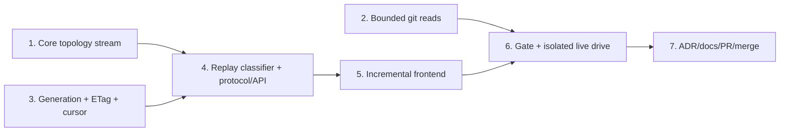

# M1.10 Paged History and Bounded Diff Implementation Plan

> **For agentic workers:** REQUIRED SUB-SKILL: Use superpowers:subagent-driven-development (recommended) or superpowers:executing-plans to implement this plan task-by-task. Steps use checkbox (`- [ ]`) syntax for tracking.

**Goal:** Deliver generation-pinned, stateless paged history; allocation-bounded cancellable diff/file reads; and an incremental virtualized history UI without disturbing the active host server.

**Architecture:** Preserve legacy graph behavior while extracting a checkpointable core topology stream, then implement accepted Choice A by deterministically replaying a gix Topo `DateOrder` walk and skipping to a signed absolute row offset on every page. Generic protocol envelopes carry core-owned graph types, and the mounted frontend canvas appends pages in place while generation drift restarts the aggregate.

**Tech Stack:** Rust 2024, gix 0.84 Topo traversal, Axum, Tokio async process I/O, Serde/JSON, HMAC-SHA256, base64url, Leptos/WASM, JavaScript canvas rendering, Trunk, systemd private network namespaces, Git/GitHub CLI.

## Global Constraints

- The accepted authority is `docs/superpowers/specs/2026-07-25-m1.10-verifier-amendment.md`; it governs wherever it conflicts with the original design or decision log.
- Implement Choice A exactly: stateless deterministic re-walk plus skip using `gix::traverse::commit::topo::Builder` with `topo::Sorting::DateOrder`, seeded by sorted `(full_ref_name, object_id)` tips.
- Preserve legacy `layout()` and `layout_with_refs()` ordering, colouring, badges, stubs, and fixtures; Task 1 is a narrow no-wire topology refactor.
- History generation is refs plus resolved HEAD only, uses `GenerationInputs`/`RepositoryGeneration`, and is encoded as `history-v1:<decimal>`; index and worktree state are excluded.
- Protocol compatibility is a hard `[4,4]` window; HTTP 409 serializes as `ErrorCode::Conflict` / `"conflict"`.
- Frame and page 1 honor explicit `If-None-Match`; cursor pages ignore it and validate the signed generation. Successful history responses use strong ETag `"g:history-v1:<decimal>"`.
- Signed cursors contain only generation plus `HistoryCursor { next_row: usize }`, use a per-process random HMAC-SHA256 key with a truncated 128-bit tag, and verify encoded length and signature before deserialization.
- Generic `HistoryFrame<R>` and `HistoryPage<R, E, S>` live in `git-vista-protocol`; protocol gains no production dependency on core. A core dev-dependency is allowed only for protocol goldens.
- `FrameStub` and `GraphRow` remain core domain types; stubs are delivered on the page that first resolves their anchor, and `GraphRow.color` stays authoritative.
- Remote reachability is exact and unbounded by `HISTORY_LIMIT`: walk all remote-tracking tips until every requested page OID is found or remote history ends. Retain `HISTORY_LIMIT` for activity code.
- Default page limit is 250 and request limit clamps to 1–1000. The default pathological fixture must serialize to at most 512 KiB; this is an integration budget, not a universal wire ceiling.
- Diff/file caps are 200 KB panel patch, 5 MB full patch, 2 MB file content, and 8 MiB for each `-z` metadata read. A metadata cap hit is an explicit error, never a partial file list.
- Convert exactly four `git_stdout` callers in `handlers/read.rs`; enable Tokio `io-util` directly; drain bounded stderr concurrently; kill and await git on cap or cancellation; add `--no-textconv` to all diff reads.
- Keep the intentionally unused `git_stdout` wrapper with a narrow `#[allow(dead_code)]` and D17 rationale. Leave unrelated `.output()` sites out of scope.
- Keep query DTOs open to the frontend's unknown cache-busting `t=` field, and register frame/page reads on both loopback and LAN-view routers.
- Extend the existing six-row-overscan viewport culler; do not add a second culler. Clamp visible-row selection to 2000 rows.
- Never restart, signal, replace, or bind against Tom's host loopback port-8080 iPad session. The live drive runs only in a private systemd network namespace with temporary XDG state/data and verifies the host listener PID is unchanged afterward.
- Each numbered task ends with a pushed `./dev wip` checkpoint. Preserve the source branch locally and remotely after merge.

---

## Execution map

## Setup and execution discipline

- Work from branch `feature/m1.10-introduce-paged-history-and-bounded-diff` at accepted-plan baseline commit `e5e7f08f5f14d379a12f53300e5131caa61300c1`.
- Before Task 1, run `./dev resume`, `git status -sb`, and `git rev-parse HEAD`. Expected: the named branch, no unintended source changes, and the baseline commit or a documented later plan-only checkpoint.
- Keep `handoff.md` current after every red/green cycle with the active task, completed checklist items, and an explicit next step.
- Execute tasks in order. Do not start Task 4 until Task 1's replay-classification equivalence gate and Task 3's cursor/generation tests are green.
- Use `./dev wip "..."` exactly where each task says to checkpoint; it supplies the required `claude_2010`/noreply commit identity and pushes the branch.

### Task 1: Extract checkpointable core topology without wire changes

**Files:**

**Interfaces:**

### Task 2: Bound and cancel diff/file git reads

**Files:**

**Interfaces:**

### Task 3: Add history generation, ETags, signed offset cursors, and conflict semantics

**Files:**

**Interfaces:**

### Task 4: Implement replay classification, protocol v4, and history endpoints

**Files:**

**Interfaces:**

### Task 5: Append paged history inside the mounted virtualized frontend

**Files:**

**Interfaces:**

### Task 6: Run the full gate and isolated large-repository live drive

**Files:**

**Interfaces:**

### Task 7: Record the architecture and complete the GitHub workflow

**Files:**

**Interfaces:**

