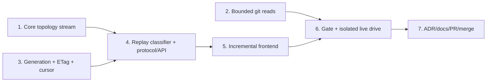
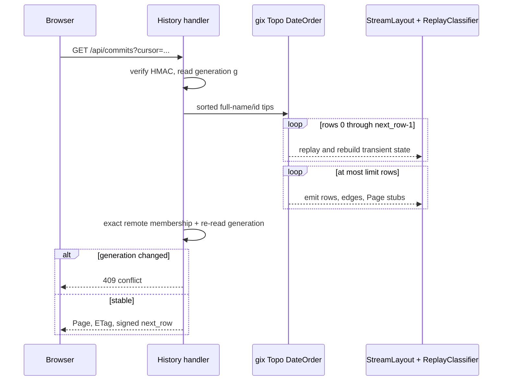
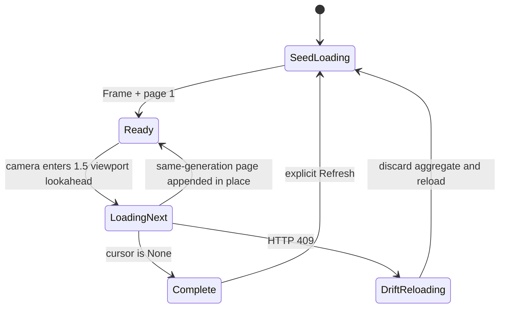
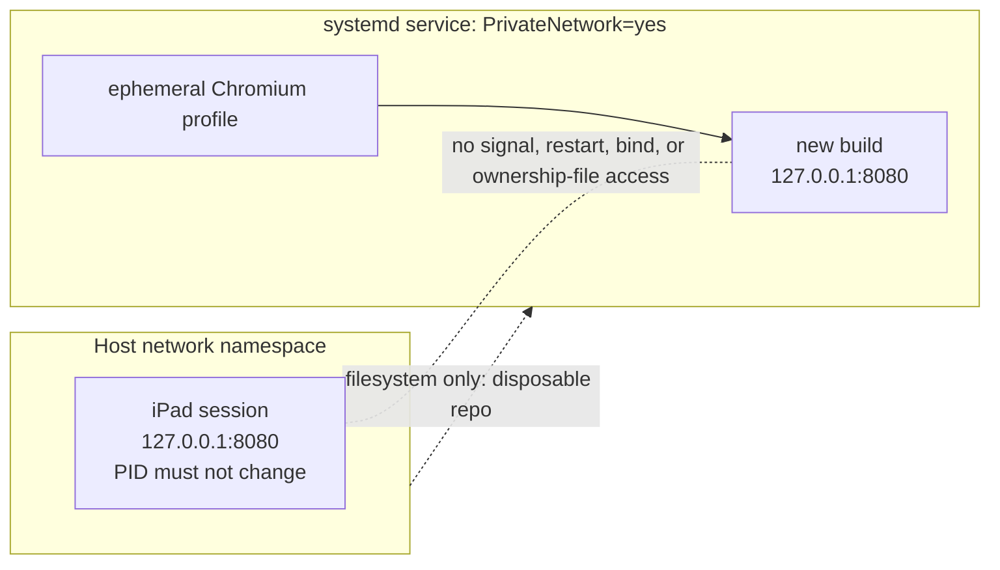

# M1.10 Paged History and Bounded Diff Implementation Plan

> **For agentic workers:** REQUIRED SUB-SKILL: Use superpowers:subagent-driven-development (recommended) or superpowers:executing-plans to implement this plan task-by-task. Steps use checkbox (`- [ ]`) syntax for tracking.

**Goal:** Deliver generation-pinned, stateless paged history; allocation-bounded cancellable diff/file reads; and an incremental virtualized history UI without disturbing the active host server.

**Architecture:** Preserve legacy graph behavior while extracting a checkpointable core topology stream, then implement accepted Choice A by deterministically replaying a gix Topo `DateOrder` walk and skipping to a signed absolute row offset on every page. Generic protocol envelopes carry core-owned graph types, and the mounted frontend canvas appends pages in place while generation drift restarts the aggregate.

**Tech Stack:** Rust 2024, gix 0.84 Topo traversal, Axum, Tokio async process I/O, Serde/JSON, HMAC-SHA256, base64url, Leptos/WASM, JavaScript canvas rendering, Trunk, systemd private network namespaces, Git/GitHub CLI.

## Global Constraints

- The accepted authority is `docs/superpowers/specs/2026-07-25-m1.10-verifier-amendment.md`; it governs wherever it conflicts with the original design or decision log.
- Implement Choice A exactly: stateless deterministic re-walk plus skip using `gix::traverse::commit::topo::Builder` with `topo::Sorting::DateOrder`, seeded by sorted `(full_ref_name, object_id)` tips.
- Preserve legacy `layout()` and `layout_with_refs()` ordering, colouring, badges, stubs, and fixtures; Task 1 is a narrow no-wire topology refactor.
- History generation is refs plus resolved HEAD only, uses `GenerationInputs`/`RepositoryGeneration`, and is encoded as `history-v1:<decimal>`; index and worktree state are excluded.
- Protocol compatibility is a hard `[4,4]` window; HTTP 409 serializes as `ErrorCode::Conflict` / `"conflict"`.
- Frame and page 1 honor explicit `If-None-Match`; cursor pages ignore it and validate the signed generation. Successful history responses use strong ETag `"g:history-v1:<decimal>"`.
- Signed cursors contain only generation plus `HistoryCursor { next_row: usize }`, use a per-process random HMAC-SHA256 key with a truncated 128-bit tag, and verify encoded length and signature before deserialization.
- Generic `HistoryFrame<R>` and `HistoryPage<R, E, S>` live in `git-vista-protocol`; protocol gains no production dependency on core. A core dev-dependency is allowed only for protocol goldens.
- `FrameStub` and `GraphRow` remain core domain types; stubs are delivered on the page that first resolves their anchor, and `GraphRow.color` stays authoritative.
- Remote reachability is exact and unbounded by `HISTORY_LIMIT`: walk all remote-tracking tips until every requested page OID is found or remote history ends. Retain `HISTORY_LIMIT` for activity code.
- Default page limit is 250 and request limit clamps to 1–1000. The default pathological fixture must serialize to at most 512 KiB; this is an integration budget, not a universal wire ceiling.
- Diff/file caps are 200 KB panel patch, 5 MB full patch, 2 MB file content, and 8 MiB for each `-z` metadata read. A metadata cap hit is an explicit error, never a partial file list.
- Convert exactly four `git_stdout` callers in `handlers/read.rs`; enable Tokio `io-util` directly; drain bounded stderr concurrently; explicitly kill/await git on a cap and rely on kill-on-drop when cancellation drops the future; add `--no-textconv` to all diff reads.
- Keep the intentionally unused `git_stdout` wrapper with a narrow `#[allow(dead_code)]` and D17 rationale. Leave unrelated `.output()` sites out of scope.
- Keep query DTOs open to the frontend's unknown cache-busting `t=` field, and register frame/page reads on both loopback and LAN-view routers.
- Extend the existing six-row-overscan viewport culler; do not add a second culler. Clamp visible-row selection to 2000 rows.
- Never restart, signal, replace, or bind against Tom's host loopback port-8080 iPad session. The live drive runs only in a private systemd network namespace with temporary XDG state/data and verifies the host listener PID is unchanged afterward.
- Each numbered task ends with a pushed `./dev wip` checkpoint. Preserve the source branch locally and remotely after merge.

---

## Execution map



## Setup and execution discipline

- This plan was assembled on branch `feature/m1.10-introduce-paged-history-and-bounded-diff` at planning checkpoint `a46391a2cc86672e7b3973a81f74bdbe2d09ec64`; the final plan-only checkpoint must be a descendant of it.
- Before Task 1, run `./dev resume`, `git status -sb`, and `git rev-parse HEAD`. Expected: the named branch, no unintended source changes, and the final pushed plan checkpoint (or a documented descendant containing only approved follow-up edits).
- Keep `handoff.md` current after every red/green cycle with the active task, completed checklist items, and an explicit next step.
- Execute tasks in order. Do not start Task 4 until Task 1's replay-classification equivalence gate and Task 3's cursor/generation tests are green.
- Use `./dev wip "..."` exactly where each task says to checkpoint; it supplies the required `claude_2010`/noreply commit identity and pushes the branch.

### Task 1: Extract checkpointable core topology without wire changes

**Files:**

- Create: `crates/git-vista-core/src/layout/stream.rs` — `StreamLayout`, checkpoint/chunk state, pending-edge resolution, lane high-water, and canonical edge ordering.
- Create: `crates/git-vista-core/src/layout/tests/stream.rs` — checkpoint, membership, cross-window, terminal, and serialized-equivalence tests.
- Modify: `crates/git-vista-core/src/layout/mod.rs` — declare/re-export the stream module, centralize the existing decoration pass, and make both public layout entry points delegate through the stream-backed topology wrapper.
- Modify: `crates/git-vista-core/src/layout/topology.rs` — retain `stable_topo_order` and `trunk_reserve_tip`; expose the lane helpers as `pub(super)` and remove the duplicate topology implementation.
- Modify: `crates/git-vista-core/src/layout/tests/mod.rs` — add `mod stream;` and share the existing fixture/assertion helpers.
- Verify unchanged: `crates/git-vista-core/src/layout/{color,badges}.rs`, `crates/git-vista-core/src/layout/tests/{topology,color,badges}.rs`, and `crates/git-vista-git/src/history.rs`.
- Do not modify in this task: `crates/git-vista-core/src/model.rs` or any protocol/server/frontend DTO.

**Interfaces:**

- Consumes: the existing deterministic children-before-parents vector produced by `stable_topo_order`, `CommitSummary`, `GraphRow`, `Edge`, `Oid`, `trunk_reserve_tip`, and the current post-topology colour/stub/badge functions.
- Produces: the following layout-only API for Task 4. It carries no repository generation and no gix traversal state:

```rust
#[derive(Debug, Clone, PartialEq, Eq)]
pub struct LayoutCheckpoint {
    open_lanes: Vec<Option<Oid>>,
    pending_edges: Vec<PendingEdge>,
    next_row: usize,
    lane_high_water: usize,
}

#[derive(Debug, Clone, Default, PartialEq, Eq)]
pub struct LayoutChunk {
    pub rows: Vec<GraphRow>,
    pub edges: Vec<Edge>,
    /// Commit-lane high-water through this checkpoint; stub lanes are excluded.
    pub lane_count: usize,
}

pub struct StreamLayout { /* checkpoint plus current chunk buffers */ }

impl StreamLayout {
    pub fn new(trunk_tip: Option<Oid>) -> Self;
    pub fn resume(checkpoint: LayoutCheckpoint) -> Self;
    pub fn push<F>(&mut self, commit: CommitSummary, parent_is_in_snapshot: F)
    where
        F: FnMut(&Oid) -> bool;
    pub fn checkpoint(self) -> (LayoutChunk, LayoutCheckpoint);
    pub fn finish(self) -> LayoutChunk;
}

pub fn canonicalize_edges(rows: &[GraphRow], edges: &mut [Edge]);
```

`push` must distinguish a locally present parent that arrives later from a missing/shallow parent. The former reserves a lane and a `PendingEdge`; the latter frees the lane and emits no edge. `canonicalize_edges` restores the legacy row-major/parent-vector order by sorting on `(from_row, parent_ordinal, to_row, from_lane, to_lane)`, recovering `parent_ordinal` from the rows rather than changing `Edge` on the wire.

- [ ] **Step 1: Add the red serialized-equivalence fixture**

Create `one_shot_windows_7_and_1_are_byte_identical` with a 12-commit DAG containing a trunk, two merged side lines, an octopus-style parent order, a tag, a local ref on an interior commit named `aaa`, equal-second tips, and a parent timestamp newer than a child. Normalize once with the unchanged `stable_topo_order`, then feed the same vector as one terminal window, windows of seven, and windows of one.

```rust
assert_eq!(serde_json::to_vec(&one_shot.rows).unwrap(),
           serde_json::to_vec(&windows_7.rows).unwrap());
assert_eq!(serde_json::to_vec(&one_shot.edges).unwrap(),
           serde_json::to_vec(&windows_7.edges).unwrap());
assert_eq!(serde_json::to_vec(&one_shot.rows).unwrap(),
           serde_json::to_vec(&windows_1.rows).unwrap());
assert_eq!(serde_json::to_vec(&one_shot.edges).unwrap(),
           serde_json::to_vec(&windows_1.edges).unwrap());
assert_eq!(one_shot.stubs, windows_7.stubs);
assert_eq!(one_shot.stubs, windows_1.stubs);
assert!(one_shot.stubs.iter().any(|stub| stub.name == "aaa"));
```

Run: `cargo test -p git-vista-core layout::tests::stream::one_shot_windows_7_and_1_are_byte_identical -- --exact --nocapture`

Expected: FAIL to compile because `layout::stream::StreamLayout` does not exist. A partial per-window layout should instead fail with reset row indices, lane reflow, or missing cross-window edges.

- [ ] **Step 2: Preserve absolute rows, lanes, and non-terminal state**

Add `checkpoint_keeps_absolute_rows_and_open_lanes`: feed `c -> b`, checkpoint, resume with `b -> a`, checkpoint, then finish with `a`. Assert absolute rows `[0, 1, 2]`, lane zero for all three, and `lane_count == 1`. Implement `new`, `resume`, lane selection, `next_row`, and monotonic high-water by adapting the one existing topology algorithm rather than copying it.

```rust
let present = HashSet::from([c.id.clone(), b.id.clone(), a.id.clone()]);
let mut stream = StreamLayout::new(None);
stream.push(c, |oid| present.contains(oid));
let (first, checkpoint) = stream.checkpoint();
let mut stream = StreamLayout::resume(checkpoint);
stream.push(b, |oid| present.contains(oid));
let (second, checkpoint) = stream.checkpoint();
let mut stream = StreamLayout::resume(checkpoint);
stream.push(a, |oid| present.contains(oid));
let third = stream.finish();
assert_eq!(row_numbers(&[first, second, third]), vec![0, 1, 2]);
```

Run: `cargo test -p git-vista-core checkpoint_keeps_absolute_rows_and_open_lanes -- --nocapture`

Expected: PASS for rows/lanes after the minimal state implementation; cross-boundary edge tests remain red.

- [ ] **Step 3: Carry pending edges across checkpoints**

Add `cross_page_merge_edges_emit_once_when_parent_arrives` for `M -> [A, B]`, `A -> R`, `B -> R`, `R`, checkpointing after every commit. Assert exactly `M-A`, `M-B`, `A-R`, and `B-R`; no duplicate; and no chunk contains an edge whose `to_row` is beyond the last delivered row. Add `PendingEdge { parent, parent_ordinal, from_row, from_lane }`; resolve every match when its parent is pushed and retain unresolved entries in `LayoutCheckpoint`.

Run: `cargo test -p git-vista-core cross_page_merge_edges_emit_once_when_parent_arrives -- --nocapture`

Expected: PASS for membership/count, but the flagship serialized comparison remains red until edge order is canonicalized.

- [ ] **Step 4: Canonicalize exact edge order**

Add `canonical_edge_order_is_row_then_parent_vector_order` with merge parent-vector order different from parent arrival order. Implement:

```rust
edges.sort_by_key(|edge| {
    let parent = &rows[edge.to_row].commit.id;
    let ordinal = rows[edge.from_row]
        .commit.parents.iter().position(|oid| oid == parent)
        .expect("well-formed layout edge names a parent");
    (edge.from_row, ordinal, edge.to_row, edge.from_lane, edge.to_lane)
});
```

Run: `cargo test -p git-vista-core canonical_edge_order_is_row_then_parent_vector_order -- --nocapture`

Expected: PASS and exact `Vec<Edge>` equality rather than set equality.

- [ ] **Step 5: Pin exact parent membership and terminal behavior**

Add these tests before implementation:

- `dangling_parent_does_not_hold_lane_or_emit_edge`: predicate false yields one row, one lane, zero edges.
- `terminal_finish_discards_unresolved_edge`: predicate true but absent terminal parent yields no invalid edge.
- `trunk_reservation_survives_checkpoint_before_tip`: reserve `T`, push newer side `X -> T`, checkpoint, then `T`; assert `X` lane 1 and `T` lane 0.

Implement terminal cleanup and filter `trunk_tip` through the same membership set used by `push`. For the legacy one-shot wrapper, build `HashSet<Oid>` from normalized input and pass `|oid| present.contains(oid)`.

Run: `cargo test -p git-vista-core layout::tests::stream -- --nocapture`

Expected: PASS for membership, terminal, checkpoint, and edge-order tests.

- [ ] **Step 6: Delegate both legacy public entry points through one topology pass**

Keep the legacy wrapper order exactly:

```text
stable_topo_order
  -> exact membership set and filtered trunk tip
  -> StreamLayout feed + finish + canonicalize_edges
  -> assign_branch_colors
  -> current stub cascade grouping/lane widening
  -> attach_ref_badges
```

Extract only the common decoration helper in `layout/mod.rs`; do not stream or alter colour/stub/badge semantics in Task 1. Delete the old topology body so there is one lane algorithm.

Run: `cargo test -p git-vista-core layout::tests::stream::one_shot_windows_7_and_1_are_byte_identical -- --exact --nocapture`

Expected: PASS with byte-identical serialized rows/edges and identical interior stub output.

- [ ] **Step 7: Run the Task 1 regression net**

Run:

```bash
cargo test -p git-vista-core --lib -- --nocapture
cargo test -p git-vista-git a_branch_created_at_an_interior_commit_renders_as_a_stub -- --nocapture
cargo fmt --all -- --check
cargo clippy -p git-vista-core --all-targets -- -D warnings
cargo clippy -p git-vista-git --all-targets -- -D warnings
cargo test --workspace
git diff --check
```

Expected: PASS, including unchanged `layout_is_deterministic_whatever_order_ties_arrive_in`, `a_time_skewed_child_is_still_laid_out_above_its_parent`, `dangling_parents_are_skipped`, all colour/stub tests, and the issue-#28 interior-stub integration test.

**Done when:** one topology algorithm backs both legacy entry points; window 7/window 1 preserve absolute geometry and exact canonical edges; missing parents and terminal pending edges are safe; all existing visible layout semantics remain unchanged; no protocol/model/server/frontend file changed.

- [ ] **Step 8: Checkpoint Task 1**

Update `handoff.md`, inspect `git status --short`, then run:

```bash
./dev wip "wip(#63): checkpointable core topology layout"
```

Expected: the intended Task 1 files and handoff are committed and pushed; `./dev resume` identifies Task 2 as the next step.

### Task 2: Bound and cancel diff/file git reads

**Files:**

- Modify: `crates/git-vista-server/Cargo.toml` — add Tokio's `io-util` feature directly.
- Modify: `crates/git-vista-server/src/git_cmd.rs` — streaming capped stdout, concurrent bounded stderr drain, D17 wrapper, process-reaping and cancellation tests.
- Modify: `crates/git-vista-server/src/handlers/read.rs` — convert exactly three diff reads and one file read; add metadata cap, `--no-textconv`, repo-parameterized test seams, and pathological endpoint tests.
- Verify unchanged: `crates/git-vista-server/src/argv_boundary.rs` — tests must launch literal `git` and never add shell/`yes`/`dd`/`head` allowances.

**Interfaces:**

- Consumes: existing `git_error`, explicit git argv construction, `parse_name_status_z`, `fold_numstat_z`, `truncate_at_line`, `CommitDiff`, and `FileContent`.
- Produces:

```rust
pub(crate) async fn git_stdout_capped(
    repo: &Path,
    args: &[String],
    endpoint: &str,
    cap: usize,
) -> Result<(Vec<u8>, bool), (StatusCode, String)>;

#[allow(dead_code)] // D17: future callers fail safe at 8 MiB.
pub(crate) async fn git_stdout(
    repo: &Path,
    args: &[String],
    endpoint: &str,
) -> Result<Vec<u8>, (StatusCode, String)>;
```

The child uses `stdin(Stdio::null())`, piped stdout/stderr, and `kill_on_drop(true)`. Stdout retains at most `cap` bytes and reads one probe byte after exactly filling the cap. Stderr is drained concurrently to EOF while retaining at most 64 KiB. A cap hit is successful: explicitly kill and await the child, await the stderr task, return `(bytes, true)`, and do not reinterpret the killed status as a git error. Only the below-cap path checks exit status.

```rust
const DEFAULT_GIT_STDOUT_CAP: usize = 8 * 1024 * 1024;
const STDERR_CAPTURE_CAP: usize = 64 * 1024;
// handlers/read.rs
const DIFF_METADATA_CAP: usize = 8 * 1024 * 1024;
const DIFF_PATCH_CAP: usize = 200_000;
const DIFF_PATCH_CAP_FULL: usize = 5_000_000;
const FILE_CONTENT_CAP: usize = 2_000_000;
```

- [ ] **Step 1: Write red primitive tests around a real git child**

Add `git_stdout_capped_truncates_before_allocation_growth`, `git_stdout_capped_distinguishes_exact_cap_from_over_cap`, `git_stdout_capped_returns_small_output_verbatim`, and `git_stdout_capped_preserves_git_errors`. Build blobs in a temp repository through literal `git hash-object`/`git cat-file`, then assert:

```rust
let (bytes, truncated) = git_stdout_capped(repo.path(), &args, "test", 4096).await.unwrap();
assert_eq!(bytes.len(), 4096);
assert!(truncated);
```

Run: `cargo test -p git-vista-server git_stdout_capped -- --nocapture`

Expected: FAIL because `git_stdout_capped` and direct Tokio `io-util` support are absent.

- [ ] **Step 2: Implement the bounded reader and normal-path reaping**

Implement a private `read_to_cap` that reserves no more than the cap, reads until cap, probes once, and returns `Capped { bytes, truncated }`. Spawn the stderr drain before reading stdout.

```rust
match read_to_cap(stdout, cap).await? {
    Capped { bytes, truncated: true } => {
        let _ = child.kill().await;
        let _ = child.wait().await;
        let _ = stderr_task.await;
        Ok((bytes, true))
    }
    Capped { bytes, truncated: false } => {
        let status = child.wait().await.map_err(io_error)?;
        let stderr = stderr_task.await.unwrap_or_default();
        if status.success() { Ok((bytes, false)) }
        else { Err(git_error(endpoint, &stderr)) }
    }
}
```

Run: `cargo test -p git-vista-server git_stdout_capped -- --nocapture`

Expected: PASS for cap/exact-cap/small/error cases, with no lingering child process.

- [ ] **Step 3: Prove cancellation kills the owned child**

Add an internal test seam that reports `Child::id`. In `dropping_capped_read_kills_git_child`, start literal `git cat-file --batch` with its stdin held open, obtain the PID, abort/drop the read future, and poll `/proc/<pid>` with a short deadline. Assert the PID disappears; do not assert only that the Rust task ended.

Run: `cargo test -p git-vista-server dropping_capped_read_kills_git_child -- --exact --nocapture`

Expected: FAIL before `kill_on_drop(true)`; PASS after the child is owned by the dropped future. This test proves primitive cancellation, not an end-to-end TCP disconnect.

- [ ] **Step 4: Retain the bounded fail-safe wrapper**

Implement `git_stdout` as a thin call with `DEFAULT_GIT_STDOUT_CAP`; return bytes and deliberately discard its truncation bit. Apply only the narrow `#[allow(dead_code)]` shown in the interface because all four current callers become explicit and Clippy otherwise rejects the D17 fail-safe.

Run: `cargo clippy -p git-vista-server --all-targets -- -D warnings`

Expected: PASS with no crate- or module-wide lint allowance.

- [ ] **Step 5: Convert the three diff invocations with distinct semantics**

Build all three diff argv vectors with `--no-textconv`. Send `--name-status -z` and `--numstat -z` through `DIFF_METADATA_CAP`; if either reports truncation, return `StatusCode::PAYLOAD_TOO_LARGE` with `"diff metadata exceeded 8 MiB"`. Send `--patch` through the selected 200,000/5,000,000-byte cap.

```rust
let (name_status, names_truncated) =
    git_stdout_capped(repo, &name_args, "diff", DIFF_METADATA_CAP).await?;
if names_truncated {
    return Err((StatusCode::PAYLOAD_TOO_LARGE,
                "diff metadata exceeded 8 MiB".into()));
}
let (patch, truncated) =
    git_stdout_capped(repo, &patch_args, "diff", patch_cap).await?;
```

Use the reader boolean as the authoritative `CommitDiff.truncated`. On truncated text, `truncate_at_line` may tidy the bounded bytes; do not recompute truncation from lossy UTF-8 length.

Run: `cargo test -p git-vista-server bounded_diff_argv -- --nocapture`

Expected: the new argv/cap tests PASS and both metadata cap-hit tests return 413 rather than partial `files`.

- [ ] **Step 6: Convert file reads without triggering the parent fallback on a cap**

Call `git_stdout_capped(..., FILE_CONTENT_CAP)`. Treat `Ok((bytes, true))` as a successful truncated file; retry `id^:path` only for the existing missing-at-commit error path. Preserve line-boundary tidying for text and the existing binary representation.

Run: `cargo test -p git-vista-server bounded_file_read -- --nocapture`

Expected: a >2 MiB existing text file returns HTTP success, at most 2,000,000 source bytes before decoding, and `truncated == true`, with no parent fallback.

- [ ] **Step 7: Exercise the handlers with pathological repository content**

Extract `commit_diff_for_repo(repo, id, full)` and `file_at_commit_for_repo(repo, id, path)` so tests avoid global `CURRENT`. Build a ~50 MiB text file in fixed chunks plus a NUL-containing binary blob, commit and modify both, then add `bounded_diff_handles_large_text_and_binary_without_blob_leak` and `bounded_file_handler_caps_large_existing_file`.

Assert the panel patch is `<= DIFF_PATCH_CAP`, `truncated`, contains Git's `Binary files ... differ`, excludes the binary sentinel bytes, and gives that `DiffFile` `additions == None && deletions == None`. Assert the full patch is `<= DIFF_PATCH_CAP_FULL`, and the file response reports the 2 MB cap.

Run: `cargo test -p git-vista-server bounded_diff -- --nocapture`

Expected: PASS through the real handler helpers. The test must fail if a caller is switched back to `.output()` or post-allocation truncation.

- [ ] **Step 8: Verify exact scope and checkpoint**

Run:

```bash
rg -n "git_stdout\(" crates/git-vista-server/src/handlers/read.rs
rg -n "git_stdout_capped\(" crates/git-vista-server/src/handlers/read.rs
cargo test -p git-vista-server git_stdout_capped -- --nocapture
cargo test -p git-vista-server bounded_diff -- --nocapture
cargo fmt --all -- --check
cargo clippy -p git-vista-server --all-targets -- -D warnings
git diff --check
```

Expected: zero old calls and exactly four capped call sites in `handlers/read.rs`; all focused tests and lint pass. Unrelated `.output()` sites remain untouched.

**Done when:** cap allocation occurs before handler memory can grow; exactly four callers use explicit caps; metadata never truncates silently; binary textconv is disabled; cap paths kill/reap; dropped futures kill children; the endpoint fixture proves the wiring.

Update `handoff.md`, then run:

```bash
./dev wip "wip(#63): bound cancellable diff and file reads"
```

Expected: Task 2 is committed/pushed and `./dev resume` names Task 3 next.

### Task 3: Add history generation, ETags, signed offset cursors, and conflict semantics

**Files:**

- Create: `crates/git-vista-server/src/history.rs` — exact refs/HEAD snapshot, full traversal tips, history token/ETag helpers, offset cursor, generic signed codec, and drift errors.
- Modify: `crates/git-vista-server/src/main.rs` — declare `mod history;` only; Task 4 wires the process-wide codec into routers.
- Modify: `crates/git-vista-server/src/session.rs` — expose `random_secret_bytes() -> [u8; 32]`, implement `mint_secret()` through it, and reuse `ct_eq`.
- Modify: `crates/git-vista-server/Cargo.toml` — add direct `hmac = "0.12"` and `base64 = "0.22"` dependencies.
- Modify: `crates/git-vista-protocol/src/error.rs` — add `ErrorCode::Conflict`, status mappings, and stable wire tests; Task 4 performs the protocol v4 bump and goldens.
- Verify/reuse: `crates/git-vista-core/src/identity.rs` — `GenerationInputs` and `RepositoryGeneration`; do not add another digest implementation.

**Interfaces:**

- Produces an exact snapshot whose generation and Topo seeds come from the same repository read:

```rust
#[derive(Debug, Clone, PartialEq, Eq)]
pub(crate) struct HistoryTip {
    pub full_ref_name: String,
    pub object_id: Oid,
}

pub(crate) struct HistorySnapshot {
    pub refs: Vec<GitRef>,
    pub head_branch: Option<String>,
    pub resolved_head: Option<Oid>,
    pub tips: Vec<HistoryTip>, // sorted by (full_ref_name, object_id)
    pub generation: GenerationToken, // history-v1:<decimal>
}

pub(crate) async fn read_history_snapshot(
    repo: &Path,
) -> Result<HistorySnapshot, (StatusCode, String)>;

pub(crate) fn history_etag(generation: &GenerationToken) -> HeaderValue;
pub(crate) fn if_none_match(headers: &HeaderMap, generation: &GenerationToken) -> bool;
pub(crate) fn require_same_generation(
    expected: &GenerationToken,
    actual: &GenerationToken,
) -> Result<(), (StatusCode, String)>;
```

Open gix once. Record HEAD's full symbolic target and peeled object, enumerate branch/tag/remote refs into an internal `full_ref_targets: Vec<(String, Oid)>`, build display `GitRef`s separately, add HEAD only to the traversal seeds, remove duplicate tip pairs, and sort tips lexicographically by `(full_ref_name, object_id)`. Build the digest from `full_ref_targets` plus the separate HEAD field:

```rust
let mut inputs = GenerationInputs::new();
inputs.field("recipe", "history-v1");
inputs.head(symbolic_head.as_deref(), resolved_head.as_ref());
for (full_name, target) in &full_ref_targets {
    inputs.reference(full_name, &ObjectId::parse(target.as_str())?);
}
let token = GenerationToken::new(format!("history-v1:{}", inputs.generation()))?;
```

Do not call `index()` or `worktree()`. HEAD is a generation input but not a duplicate traversal seed when the same target is already represented; a detached resolved HEAD must still be seeded under a deterministic pseudo-name such as `HEAD`.

- Produces a small, fixed-state signed cursor:

```rust
pub(crate) const MAX_ENCODED_CURSOR_LEN: usize = 512;
const CURSOR_FORMAT_VERSION: u8 = 1;
const CURSOR_TAG_BYTES: usize = 16;

#[derive(Debug, Clone, Copy, PartialEq, Eq, Serialize, Deserialize)]
pub(crate) struct HistoryCursor {
    pub next_row: usize,
}

#[derive(Serialize, Deserialize)]
struct CursorEnvelope<T> {
    version: u8,
    generation: GenerationToken,
    state: T,
}

pub(crate) struct DecodedCursor<T> {
    pub generation: GenerationToken,
    pub state: T,
}

pub(crate) struct CursorCodec { key: [u8; 32] }

impl CursorCodec {
    pub(crate) fn new() -> Self;
    #[cfg(test)] pub(crate) fn with_key(key: [u8; 32]) -> Self;
    pub(crate) fn encode<T: Serialize>(
        &self,
        generation: &GenerationToken,
        state: &T,
    ) -> Result<String, CursorError>;
    pub(crate) fn decode<T: DeserializeOwned>(
        &self,
        encoded: &str,
    ) -> Result<DecodedCursor<T>, CursorError>;
}
```

Wire form is `BASE64URL_NO_PAD(json-envelope).BASE64URL_NO_PAD(tag[0..16])`. Reject an input longer than 512 bytes before base64 allocation; require exactly one dot; decode bounded parts; recompute HMAC-SHA256; compare the 16-byte tag through `session::ct_eq`; only then deserialize and validate version. All codec errors map to the same generic HTTP 400 message. Process restart rotates the key, so pre-restart cursors deliberately fail and the frontend restarts at page 1.

- [ ] **Step 1: Add red snapshot/generation tests**

Add `history_generation_is_stable_across_ref_enumeration_order`, `history_generation_changes_when_ref_moves`, `history_generation_changes_when_symbolic_or_resolved_head_moves`, and `history_generation_ignores_index_and_worktree_changes`. Add `history_tips_use_sorted_full_names_and_ids` with local/remote/tag refs sharing one target and detached HEAD coverage.

Run: `cargo test -p git-vista-server history_generation -- --nocapture`

Expected: FAIL because `history`/`read_history_snapshot` do not exist.

- [ ] **Step 2: Implement the exact refs-plus-HEAD snapshot**

Reuse the classification behavior of `git-vista-git/src/refs.rs`, but retain the full gix ref name before producing the display-short `GitRef.name`. Do not derive traversal tips back from display refs. Feed the `recipe=history-v1` discriminator plus HEAD and sorted full refs to `GenerationInputs`.

Run: `cargo test -p git-vista-server history_generation -- --nocapture`

Expected: all generation/tip tests PASS; `git status --porcelain`, index changes, and untracked files leave the token byte-identical.

- [ ] **Step 3: Add and implement strong ETag matching**

Write `history_etag_is_quoted_and_strong` plus `if_none_match_accepts_exact_list_weak_and_star` and `if_none_match_rejects_malformed_or_different`. Required values:

```rust
assert_eq!(history_etag(&token).to_str().unwrap(),
           "\"g:history-v1:42\"");
for raw in ["\"g:history-v1:42\"",
            "\"other\", \"g:history-v1:42\"",
            "W/\"g:history-v1:42\"", "*"] {
    assert!(matches_generation(raw, &token));
}
```

Run: `cargo test -p git-vista-server if_none_match -- --nocapture`

Expected: FAIL before helpers, then PASS. A malformed header is a non-match, never a 500.

- [ ] **Step 4: Add red cursor authentication tests**

With `CursorCodec::with_key([0x5a; 32])`, add `signed_offset_cursor_round_trips`, `cursor_rejects_payload_tamper_before_deserialize`, `cursor_rejects_tag_tamper`, `cursor_rejects_malformed_base64_and_extra_part`, `cursor_rejects_wrong_version`, and `cursor_rejects_over_512_bytes_before_decode`. Use a test-only deserialize type whose visitor flips an `AtomicBool`; assert it remains false for a bad signature.

Run: `cargo test -p git-vista-server cursor_ -- --nocapture`

Expected: FAIL because `CursorCodec`/`HistoryCursor` are absent.

- [ ] **Step 5: Implement HMAC-before-deserialize and process-key rotation**

Expose entropy without changing existing session token text:

```rust
pub(crate) fn random_secret_bytes() -> [u8; 32] {
    let mut bytes = [0_u8; 32];
    getrandom::getrandom(&mut bytes).expect("OS CSPRNG unavailable");
    bytes
}

fn mint_secret() -> String { to_hex(&random_secret_bytes()) }
```

Implement codec encode/decode with `hmac::{Hmac, Mac}` and `base64::engine::general_purpose::URL_SAFE_NO_PAD`. Make the length guard the first decode branch and signature verification the last operation before `serde_json::from_slice`.

Run: `cargo test -p git-vista-server cursor_ -- --nocapture`

Expected: PASS, including encoded length comfortably below 512 bytes for `HistoryCursor { next_row: usize::MAX }` and a maximum decimal generation.

- [ ] **Step 6: Add typed conflict semantics and the reusable drift gate**

Add `Conflict` to `ErrorCode`, serialize it as `"conflict"`, map `http_status()` to 409 and `from_status(StatusCode::CONFLICT)` back to it. Implement `require_same_generation` with exact `"history moved"` wording.

```rust
assert_eq!(serde_json::to_string(&ErrorCode::Conflict).unwrap(), "\"conflict\"");
assert_eq!(ErrorCode::Conflict.http_status(), StatusCode::CONFLICT);
assert_eq!(ErrorCode::from_status(StatusCode::CONFLICT), ErrorCode::Conflict);
```

Run: `cargo test -p git-vista-protocol conflict -- --nocapture && cargo test -p git-vista-server require_same_generation -- --nocapture`

Expected: FAIL before the new variant/helper, then PASS. This intentionally changes all 409 envelopes and is completed under v4 in Task 4.

- [ ] **Step 7: Verify Task 3 and checkpoint**

Run:

```bash
cargo test -p git-vista-server history::tests -- --nocapture
cargo test -p git-vista-protocol error -- --nocapture
cargo fmt --all -- --check
cargo clippy -p git-vista-server --all-targets -- -D warnings
cargo clippy -p git-vista-protocol --all-targets -- -D warnings
git diff --check
```

Expected: all snapshot/ETag/cursor/drift/error tests PASS; Clippy confirms direct dependency use and no leaked private key material.

**Done when:** history and planner generations are visibly separate recipes; tip ordering uses full ref names and ids; ETags are deterministic; unsigned state is never deserialized; the cursor is fixed and small; restart key rotation invalidates old cursors; 409 is machine-readable `conflict`.

Update `handoff.md`, then run:

```bash
./dev wip "wip(#63): history generation ETags and signed cursors"
```

Expected: Task 3 is committed/pushed and Task 4 is the explicit next step.

### Task 4: Implement replay classification, protocol v4, and history endpoints

**Files:**

- Create: `crates/git-vista-core/src/layout/replay.rs` — streaming branch-claim colour, badge, and incremental stub classification used only by paged history.
- Create: `crates/git-vista-core/src/layout/tests/replay.rs` — property/regression oracle comparing replay classification to the existing whole-graph colour/stub fixtures.
- Modify: `crates/git-vista-core/src/layout/mod.rs` and `layout/tests/mod.rs` — export/register replay support.
- Modify: `crates/git-vista-core/src/model.rs` — add `FrameStub`; add `#[serde(default)] on_remote` to `GraphRow` and `CommitDetail`. Keep legacy `Graph.remote_commits` only as a non-paged compatibility field until frontend migration; it is absent from Frame/Page.
- Modify: `crates/git-vista-git/src/history.rs` and `src/lib.rs` — add exact Topo `DateOrder` callback walk and exact remote-membership helper; populate arbitrary `CommitDetail.on_remote` through the shared helper.
- Create: `crates/git-vista-protocol/src/history.rs` — generic transport envelopes.
- Modify: `crates/git-vista-protocol/src/lib.rs` — export history types.
- Modify: `crates/git-vista-protocol/src/version.rs` — protocol 4 prose and hard `4/4/4` constants.
- Modify: `crates/git-vista-protocol/Cargo.toml` — add `git-vista-core` as a dev-dependency only.
- Create: `crates/git-vista-protocol/tests/history_golden.rs`.
- Create: `crates/git-vista-protocol/tests/fixtures/history_frame_v4.json` and `history_page_v4.json`; do not modify `plan_v1.json`.
- Modify: `crates/git-vista-server/src/handlers/read.rs` — Frame/Page aliases, page builder, query clamp, frame/page handlers, 304/409/tamper behavior, exact remote flags, and temp-repo handler tests.
- Modify: `crates/git-vista-server/src/main.rs` — mint one shared `Arc<CursorCodec>`, register `/api/frame` and paged `/api/commits` on both loopback and LAN-view routers, and update module prose.
- Modify: `crates/git-vista-server/src/state.rs` — update the graph-read comment but retain `HISTORY_LIMIT` for activity.

**Interfaces:**

- Core owns the domain additions and streaming classifier:

```rust
#[derive(Debug, Clone, PartialEq, Eq, Serialize, Deserialize)]
pub struct FrameStub {
    pub name: String,
    pub anchor_commit: Oid,
    pub lane_offset: usize,
    pub color: usize,
    pub depth: usize,
}

pub struct ReplayClassifier { /* pending winning claims + stable stub slots */ }

impl ReplayClassifier {
    pub fn new(refs: &[GitRef], head_branch: Option<&str>) -> Self;
    pub fn decorate(&mut self, row: &mut GraphRow) -> Vec<FrameStub>;
    pub fn branch_colors(&self) -> Vec<(String, usize)>;
}
```

For each emitted row, gather propagated and ref-tip claims, compare the established priority `(trunk_rank, is_remote, emitted_tip_row, branch_name)`, assign the winner's stable slot to `GraphRow.color`, attach non-stub refs as badges, and propagate only the winner along its first parent. An unclaimed row starts `~<short-id>`. A local ref whose tip is already owned by a higher-priority claim produces a `FrameStub` on this page, anchored by OID. Stubs sharing an anchor sort by name and receive deterministic `lane_offset`/`depth`; Page carries them, Frame never does.

- Git supplies the exact accepted traversal and exact bounded-query remote result:

```rust
pub fn walk_history_topo<F>(
    path: &Path,
    sorted_tips: &[(String, Oid)],
    visit: F,
) -> Result<(), RepoError>
where
    F: FnMut(CommitSummary) -> ControlFlow<()>;

pub fn remote_membership(
    path: &Path,
    requested: &HashSet<Oid>,
) -> Result<HashSet<Oid>, RepoError>;
```

`walk_history_topo` deduplicates object ids while preserving the supplied full-name/id order, then constructs:

```rust
let walk = gix::traverse::commit::topo::Builder::from_iters(
    repo.objects.clone(),
    tip_ids,
    None::<Vec<gix::ObjectId>>,
)
.sorting(gix::traverse::commit::topo::Sorting::DateOrder)
.build()?;
```

The callback allows replay-and-skip without storing prior commits. Do not use `repo.rev_walk(...ByCommitTime...)`, add an OID tie-break, serialize gix state, or claim `O(page_size)`: page starting at row `n` rebuilds gix state and consumes rows `0..n`, and a full scroll is quadratic.

`remote_membership` seeds every remote-tracking tip, has no `HISTORY_LIMIT`, stops once every requested OID is found or the remote walk ends, and returns only the bounded requested subset. The commit-detail handler invokes it with a singleton arbitrary OID.

- Protocol owns only generic transport:

```rust
#[derive(Debug, Clone, PartialEq, Eq, Serialize, Deserialize)]
pub struct HistoryFrame<R> {
    pub generation: GenerationToken,
    pub refs: Vec<R>,
    pub head_branch: Option<String>,
    pub branch_colors: Vec<(String, usize)>,
    pub repo_label: Option<String>,
    pub repo_id: Option<String>,
    pub worktree_id: Option<String>,
    pub read_only: bool,
    pub resettable: bool,
    pub repo_url: Option<String>,
    pub remote_web_url: Option<String>,
}

#[derive(Debug, Clone, PartialEq, Eq, Serialize, Deserialize)]
pub struct HistoryPage<R, E, S> {
    pub rows: Vec<R>,
    pub edges: Vec<E>,
    pub stubs: Vec<S>,
    pub lane_count: usize,
    pub cursor: Option<String>,
    pub generation: GenerationToken,
}
```

The server/frontend aliases are exactly:

```rust
pub type Frame = HistoryFrame<GitRef>;
pub type Page = HistoryPage<GraphRow, Edge, FrameStub>;
```

`Page.lane_count` is commit-lane high-water only. `Frame.branch_colors` contains stable named-ref slots; it is not a substitute for authoritative per-row synthetic colours.

- HTTP query/handler seams:

```rust
#[derive(Deserialize)] // no deny_unknown_fields: frontend t= is accepted
pub(crate) struct PageQuery {
    #[serde(default)] repo: Option<String>,
    #[serde(default)] cursor: Option<String>,
    #[serde(default)] limit: Option<usize>,
}

const DEFAULT_PAGE_LIMIT: usize = 250;
const MAX_PAGE_LIMIT: usize = 1_000;
fn page_limit(raw: Option<usize>) -> usize {
    raw.unwrap_or(DEFAULT_PAGE_LIMIT).clamp(1, MAX_PAGE_LIMIT)
}

pub(crate) async fn frame(
    headers: HeaderMap,
    Query(query): Query<RepoQuery>,
) -> Result<Response, (StatusCode, String)>;

pub(crate) async fn commits(
    Extension(codec): Extension<Arc<CursorCodec>>,
    headers: HeaderMap,
    Query(query): Query<PageQuery>,
) -> Result<Response, (StatusCode, String)>;
```

Page construction always does: read snapshot; validate signed generation for cursor pages; rebuild Topo `DateOrder` from sorted tips; replay layout and classification through `next_row` while discarding response buffers; emit at most `limit`; compute exact remote membership for emitted OIDs; finish or checkpoint; re-read generation; return 409 if it moved; sign `next_row + emitted`; attach the original ETag. Page 1 alone honors `If-None-Match`; a cursor page ignores it.



- [ ] **Step 1: Add model defaults and exact remote-reachability red tests**

Add `graph_row_deserializes_old_fixture_with_on_remote_false` and `commit_detail_deserializes_old_fixture_with_on_remote_false`. Add real-repo tests `remote_membership_finds_requested_commit_beyond_5000` and `commit_detail_marks_unloaded_remote_parent`: build >5,000 commits, place a remote-tracking ref at the tip, request the deep root and an arbitrary parent absent from a two-row page, and assert both are remote.

Run: `cargo test -p git-vista-git remote_membership -- --nocapture`

Expected: FAIL because the fields/helper are absent; the existing `read_remote_commits(..., HISTORY_LIMIT)` would miss the deep request.

- [ ] **Step 2: Implement the bounded requested-set remote walk**

Add `#[serde(default)] pub on_remote: bool` to both core types. Implement `remote_membership` to traverse until the requested set is exhausted, then have the detail handler set the returned `CommitDetail.on_remote` using the singleton helper.

Run: `cargo test -p git-vista-git remote_membership -- --nocapture`

Expected: PASS beyond 5,000 and for the arbitrary unloaded parent; existing activity still compiles against retained `read_remote_commits`/`HISTORY_LIMIT`.

- [ ] **Step 3: Write replay-classifier property tests before any wire golden**

Parameterize the existing colour/stub fixtures so `whole_graph_and_replay_classifier_match` runs trunk/main/master/checked-out priority, local-versus-remote collision, equal tip row/name tie, issue-#28 interior stub, merge convergence, deleted-branch synthetic colour, same-anchor stub cascade, and clock-skew cases through both algorithms.

```rust
assert_eq!(replayed_rows.iter().map(|r| r.color).collect::<Vec<_>>(),
           whole.rows.iter().map(|r| r.color).collect::<Vec<_>>());
assert_eq!(replayed_badges, badges_by_oid(&whole));
assert_eq!(replayed_stubs, frame_stubs_by_anchor(&whole));
assert_eq!(replayed_branch_colors, named_slots(&whole, &refs));
```

Run: `cargo test -p git-vista-core whole_graph_and_replay_classifier_match -- --exact --nocapture`

Expected: FAIL because `ReplayClassifier`/`FrameStub` do not exist. Do not weaken any assertion to make a changed colour, stub name, anchor, depth, slot, or badge pass; such a mismatch reopens the amendment before endpoint work.

- [ ] **Step 4: Implement winning-claim propagation and incremental stubs**

Implement the priority key and pending first-parent claim map in `layout/replay.rs`. Convert legacy `BranchStub` values to the new anchor-OID-relative `FrameStub` only in test oracle code; production paging emits `FrameStub` directly when the anchor row is classified.

Run: `cargo test -p git-vista-core whole_graph_and_replay_classifier_match -- --exact --nocapture`

Expected: PASS for every current fixture with exact colours/badges/stub semantics. Only then continue to protocol goldens.

- [ ] **Step 5: Prove Choice A ordering at every page boundary**

Add `topo_date_order_replay_matches_uninterrupted_at_every_boundary` around the normative reconvergence graph:

```text
       M(110)
      /      \
   A(90)    B(10)
      \      /
       C(100)
```

Extend it with multiple sorted full-name tips and equal timestamps. Capture one uninterrupted `walk_history_topo` OID sequence. For every boundary `0..=len`, rerun from the same sorted tips, discard `boundary`, collect the remainder in page sizes 1 and 7, and assert concatenation equals the oracle with no duplicate/gap. Also compare rows, canonical edges, colours, and stubs to one uninterrupted invocation of the same new pipeline—not legacy `stable_topo_order`.

Run: `cargo test -p git-vista-git topo_date_order_replay_matches_uninterrupted_at_every_boundary -- --exact --nocapture`

Expected: FAIL until the code uses `topo::Builder` + `DateOrder`; PASS must be independent of input ref enumeration order.

- [ ] **Step 6: Freeze generic protocol v4 envelopes**

Write protocol tests first asserting `(PROTOCOL_VERSION, MIN_CLIENT_PROTOCOL, MAX_CLIENT_PROTOCOL) == (4, 4, 4)`. Add `history_frame_v4_golden` and `history_page_v4_golden` following `plan_golden.rs`: fixture deserializes to a builder using actual core nested types, and reserialization is byte-for-byte identical. Page fixture must include `stubs`; Frame fixture must not.

Run: `cargo test -p git-vista-protocol --test history_golden -- --nocapture`

Expected: FAIL with missing types/fixtures and version 3. Implement the generic structs, dev-dependency, exports, constants, and fixtures; rerun with `REGEN_GOLDEN=1` only for the first intentional creation, then rerun without it. Leave `plan_v1.json` byte-identical.

- [ ] **Step 7: Add Frame and page-limit contract tests**

Add `page_limit_defaults_and_clamps` asserting `None -> 250`, `0 -> 1`, `1 -> 1`, `1000 -> 1000`, `1001 -> 1000`. Against an isolated temp repo, add `frame_and_page_one_share_generation_and_etag`, `frame_matching_validator_returns_304_empty`, and `page_one_matching_validator_returns_304_empty`.

Frame computes branch slots from refs without walking commits, carries repo metadata from the current handler, and never carries stubs. All 200/304 responses must retain the quoted ETag; auth middleware continues to provide `Cache-Control: no-store`.

Run: `cargo test -p git-vista-server history_frame -- --nocapture`

Expected: FAIL before handlers/routes, then PASS with no commit-walk counter increment for Frame.

- [ ] **Step 8: Add page replay, drift, tamper, and cursor-validator tests**

Add `pages_are_contiguous_at_limits_one_and_seven`, `cursor_page_ignores_if_none_match`, `ref_move_between_pages_returns_conflict`, `generation_move_during_page_returns_conflict`, and `tampered_cursor_is_bad_request_before_walk`. Assert absolute row numbers are contiguous, OID sets disjoint, generations identical, no edge endpoint exceeds rows delivered through that page, `cursor == None` only at end, cursor response is 200 despite matching validator, both pre/post drift paths are 409, and real middleware JSON has `error.code == "conflict"`. Use an injected walk counter to prove tamper returns 400 before layout.

Run: `cargo test -p git-vista-server history_page -- --nocapture`

Expected: FAIL before replay handler; PASS after the handler uses `HistoryCursor { next_row }`, double generation checks, and the one shared codec.

- [ ] **Step 9: Prove shared router registration and the response budget**

Pass one `Arc<CursorCodec>` into `api_router`/`build_app` and both listener builds. Register GET `/api/frame` and GET `/api/commits` before the `full_routes` branch. Add authenticated router tests proving both reads exist on loopback and LAN while a representative write remains absent on LAN.

Create the specified pathological default-page fixture with 250 rows, large-but-realistic author/summary fields, merges/refs/stubs, and serialize `Page`; assert `body.len() <= 512 * 1024`. State in the assertion message that this is a fixture budget, not a universal metadata ceiling.

Run: `cargo test -p git-vista-server history_routes -- --nocapture`

Expected: PASS for both profiles and `default_page_pathological_fixture_is_at_most_512_kib`.

- [ ] **Step 10: Run the Task 4 gate and checkpoint**

Run:

```bash
cargo test -p git-vista-core whole_graph_and_replay_classifier_match -- --nocapture
cargo test -p git-vista-git topo_date_order_replay_matches_uninterrupted_at_every_boundary -- --nocapture
cargo test -p git-vista-protocol --test history_golden -- --nocapture
cargo test -p git-vista-protocol -- --nocapture
cargo test -p git-vista-server history -- --nocapture
cargo fmt --all -- --check
cargo clippy --workspace --all-targets -- -D warnings
cargo test --workspace
git diff --check
```

Expected: all equivalence, ordering, golden, HTTP, budget, and existing suites PASS under protocol 4. No frontier cursor/state or `ByCommitTime` appears in the paged path.

**Done when:** the accepted Topo `DateOrder` replay order has every-boundary proof; page colours/stubs match the legacy oracle; generic v4 wire fixtures are frozen; Frame is O(refs) and stub-free; pages are generation-pinned, exact-remote-aware, 304/400/409-correct, and shared by both router profiles; replay cost is documented as quadratic.

Update `handoff.md`, then run:

```bash
./dev wip "wip(#63): protocol v4 stateless paged history"
```

Expected: Task 4 is committed/pushed with Task 5 next; the old frontend may be temporarily runtime-incompatible but the workspace still compiles before UI migration.

### Task 5: Append paged history inside the mounted virtualized frontend

**Files:**

- Create: `crates/git-vista/src/history.rs` — host-compiled aggregate, append invariants, OID index, monotonic occupancy, resolved stubs, and camera-threshold helper with unit tests.
- Modify: `crates/git-vista/src/main.rs` — compile `history` for host tests as well as wasm.
- Modify: `crates/git-vista/src/api.rs` — `fetch_frame`, `fetch_page`, percent-encoded cursor, and status-bearing `HistoryFetchError` while retaining `t=` cache busting.
- Modify: `crates/git-vista/src/app/mod.rs` — Frame + page-1 seed resource, Frame metadata reads, visible drift phase, and complete-only Print gate.
- Modify: `crates/git-vista/src/app/canvas.rs` — aggregate state inside the mounted canvas, reactive counts/epochs, camera-driven single-flight append, and in-canvas loading marker.
- Modify: `crates/git-vista/src/viewport.rs` — retain six-row overscan and add the explicit 2,000-row clamp/test.
- Modify: `crates/git-vista/src/geometry.rs` — incremental monotonic label occupancy and resolved-stub geometry/tests.
- Modify: `crates/git-vista/src/gestures.rs` — make `home` an `RwSignal<Camera>` so newly resolved/wider stubs update reset-home behavior.
- Modify: `crates/git-vista/src/render/mod.rs`, `render/edges.rs`, `render/labels.rs`, `render/nodes.rs`, and `render/stubs.rs` — render Frame + aggregate, safe endpoint lookup, epoch keys, and OID-resolved stubs.
- Modify: `crates/git-vista/src/detail.rs` — use `CommitDetail.on_remote` for arbitrary parents instead of loaded-row membership.
- Modify: `crates/git-vista/src/print.rs` — print only the completed loaded aggregate.
- Modify: `crates/git-vista/src/graph.rs` — migrate graph helpers/literals to Frame/Page aggregate inputs.
- Modify: `crates/git-vista/styles.css` — loading/drift/disabled-print affordances; preserve the unscrollable shell from ADR 0012.

**Interfaces:**

- Consumes: Task 4 aliases `Frame = HistoryFrame<GitRef>` and `Page = HistoryPage<GraphRow, Edge, FrameStub>`, `GenerationToken`, `CommitDetail.on_remote`, and existing camera/viewport/render primitives.
- Produces the typed fetch surface:

```rust
#[derive(Debug, Clone, PartialEq, Eq)]
pub enum HistoryFetchError {
    Network(String),
    Http { status: u16, message: String },
    Decode(String),
}

pub async fn fetch_frame() -> Result<Frame, HistoryFetchError>;
pub async fn fetch_page(
    cursor: Option<&str>,
    limit: usize,
) -> Result<Page, HistoryFetchError>;
```

Both functions keep the existing `?t=<millis>` cache buster and do not send `If-None-Match` in M1.10. `fetch_page` uses `js_sys::encode_uri_component`, clamps `limit` to `1..=1000`, checks HTTP status before JSON decoding, and preserves 409 in `HistoryFetchError::Http` after decoding the versioned `ApiError` message.

- Produces host-testable aggregate/trigger state:

```rust
pub const DEFAULT_PAGE_LIMIT: usize = 250;
pub const MAX_LIVE_ROWS: usize = 2_000;
pub const PREFETCH_VIEWPORTS: f64 = 1.5;

pub struct ResolvedStub {
    pub stub: FrameStub,
    pub anchor_row: usize,
    pub anchor_lane: usize,
    pub lane: usize,
}

pub struct LoadedHistory {
    pub rows: Vec<GraphRow>,
    pub edges: Vec<Edge>,
    pub stubs: Vec<FrameStub>,
    pub lane_high_water: usize,
    pub cursor: Option<String>,
    pub generation: GenerationToken,
    pub oid_to_row: HashMap<Oid, usize>,
    label_occupancy: Vec<usize>,
}

pub struct AppendDelta {
    pub old_row_count: usize,
    pub prefix_geometry_changed: bool,
}

impl LoadedHistory {
    pub fn from_first_page(page: Page) -> Result<Self, HistoryInvariantError>;
    pub fn append_page(&mut self, page: Page)
        -> Result<AppendDelta, HistoryInvariantError>;
    pub fn resolved_stubs(&self) -> Vec<ResolvedStub>;
    pub fn is_complete(&self) -> bool { self.cursor.is_none() }
}

pub fn should_prefetch(
    visible_end: usize,
    row_count: usize,
    viewport_h: f64,
    scale: f64,
    loading: bool,
    has_cursor: bool,
) -> bool;
```

`append_page` validates generation, strictly increasing absolute row numbers, unique OIDs, and every edge endpoint against the combined delivered range before mutating any field. It appends only; old rows/lanes never change. It extends label occupancy monotonically for new edges and resolved stubs and marks `prefix_geometry_changed` only when an index `< old_row_count` grows. Stub lane is `lane_high_water + lane_offset`; unresolved `anchor_commit`s are skipped until their row arrives.

The camera trigger is pure:

```rust
let lookahead_rows = (PREFETCH_VIEWPORTS * viewport_h
    / (scale.max(f64::EPSILON) * ROW_HEIGHT)).ceil() as usize;
has_cursor && !loading
    && visible_end.saturating_add(lookahead_rows) >= row_count
```

No scroll listener is added; ADR 0012 keeps the shell unscrollable and graph navigation is camera pan/zoom.



- [ ] **Step 1: Write red aggregate and prefetch host tests**

Create `two_pages_append_without_mutating_prefix`, `oid_index_rejects_duplicate_before_mutation`, `generation_mismatch_rejects_before_mutation`, `future_edge_endpoint_rejects_before_mutation`, `valid_append_updates_cursor_lane_stubs_atomically`, and `prefetch_uses_one_point_five_viewports_and_single_flight`.

```rust
let prefix = serde_json::to_vec(&loaded.rows).unwrap();
let delta = loaded.append_page(page_two).unwrap();
assert_eq!(serde_json::to_vec(&loaded.rows[..delta.old_row_count]).unwrap(), prefix);
assert_eq!(loaded.rows.iter().map(|row| row.row).collect::<Vec<_>>(),
           (0..loaded.rows.len()).collect::<Vec<_>>());
assert!(should_prefetch(boundary, rows, 800.0, 1.0, false, true));
assert!(!should_prefetch(boundary, rows, 800.0, 1.0, true, true));
assert!(!should_prefetch(boundary, rows, 800.0, 1.0, false, false));
```

Run: `cargo test -p git-vista history::tests -- --nocapture`

Expected: FAIL because the `history` module/types are absent.

- [ ] **Step 2: Implement all-or-nothing aggregate append**

Validate into temporary index/edge/stub/occupancy values first; mutate `LoadedHistory` only after every invariant passes. Build the initial aggregate through the same validation path so page 1 cannot bypass endpoint checks.

Run: `cargo test -p git-vista history::tests -- --nocapture`

Expected: PASS for order, prefix immutability, duplicate/generation/edge refusal, cursor, lane, stub, and trigger cases.

- [ ] **Step 3: Add geometry and resolved-stub regression tests**

Add `cross_page_edge_monotonically_widens_old_label`, `straight_append_does_not_rekey_prefix`, and `stub_resolves_only_after_anchor_page_arrives`. Page 2 should add a long edge spanning an old row; assert its old x/occupancy increases and `prefix_geometry_changed`; adding only rows below the prefix must leave the flag false. Assert an unknown anchor produces no `ResolvedStub`, then resolves to the anchor's row/lane and `lane_high_water + lane_offset` after append.

Run: `cargo test -p git-vista geometry::tests -- --nocapture`

Expected: FAIL with whole-Graph-only `label_x_per_row`, then PASS with incremental monotonic occupancy. Existing geometry must never shrink after append.

- [ ] **Step 4: Enforce the existing culler's 2,000-row ceiling**

Add `pathological_viewport_is_clamped_to_2000_rows` using 10,000 rows, extreme viewport height, and zoom. Preserve `OVERSCAN_ROWS == 6`, then clamp the existing range after overscan:

```rust
let end = end.min(start.saturating_add(MAX_LIVE_ROWS));
assert!(start <= end);
assert!(end - start <= MAX_LIVE_ROWS);
```

Run: `cargo test -p git-vista viewport::tests -- --nocapture`

Expected: FAIL because the current culler can return more than 2,000 for a pathological camera; PASS after the single existing culler enforces the cap.

- [ ] **Step 5: Add typed fetch errors and corrected wire requests**

Implement `fetch_frame` and `fetch_page`; use the same protocol header/query behavior as other API calls, keep `t=`, and never interpret 304 in the frontend because it sends no validator. Unit-test pure URL construction if already host-visible; otherwise verify the wasm path in Step 10.

```rust
if !response.ok() {
    let status = response.status();
    let message = decode_api_error(response).await;
    return Err(HistoryFetchError::Http { status, message });
}
```

Run: `cargo clippy -p git-vista --target wasm32-unknown-unknown --all-targets -- -D warnings`

Expected: PASS after every match handles `Network`, `Http`, and `Decode`; 409 status is no longer flattened into `String`.

- [ ] **Step 6: Seed Frame + page 1 without duplicating metadata**

Change the App resource to fetch Frame then page 1 and reject mismatched generation before mounting. Move repo label/ids/URLs, `head_branch`, `read_only`, `resettable`, and mode/print metadata reads from `Graph` to Frame. Keep the live `fetch_head_branch` only for operation dialogs that require a fresh value.

Run: `cargo check -p git-vista --target wasm32-unknown-unknown`

Expected: compile failures identify every legacy `Graph` metadata consumer; PASS only after all seed/render paths use Frame + `LoadedHistory`.

- [ ] **Step 7: Append inside the mounted canvas without resetting camera/listeners**

Store `LoadedHistory` in the mounted canvas and add signals `row_count`, `layout_epoch`, `stub_epoch`, `loading_next`, `history_complete`, and reactive `home`. Trigger `fetch_page` from the current camera-derived visible range through `should_prefetch`; set `loading_next` before spawning and clear it on every result. On valid append update `row_count`; bump `layout_epoch` only when `prefix_geometry_changed`; bump `stub_epoch` when newly resolved stubs alter the gutter. Never bump App's seed `reload` on successful append.

Run: `cargo check -p git-vista --target wasm32-unknown-unknown`

Expected: PASS with one mounted canvas/resource instance across ordinary pages.

- [ ] **Step 8: Make renderers defensive and row keys geometry-aware**

Change `RenderCtx` to own Frame metadata plus loaded vectors/OID index/resolved stubs/`text_x`; remove the paged-path `remote_set`. Use `GraphRow.on_remote` for row links and `CommitDetail.on_remote` in detail. `build_edge` uses `rows.get(edge.from_row)`/`rows.get(edge.to_row)` and returns an empty view on invalid indices. Stub rendering consumes only `ResolvedStub`. Include `layout_epoch` in node/message/meta/icon `<For>` keys, and render each row wrapper as `<g class="graph-row" data-oid=...>`.

Run: `cargo clippy -p git-vista --target wasm32-unknown-unknown --all-targets -- -D warnings`

Expected: PASS with no direct `rows[index]` in edge/stub paths and no loaded-row inference for arbitrary detail links.

- [ ] **Step 9: Implement visible drift recovery, over-pan loading, and complete-only Print**

On `HistoryFetchError::Http { status: 409, .. }`, set a visible phase with exact text `History moved — reloading…`, dispose/clear the aggregate, then increment seed `reload` to fetch a fresh Frame + page 1. This exceptional reload may reset camera; ordinary append may not. Add an in-canvas loading marker at `node_cy(row_count)` so fast over-pan never shows an unexplained blank.

Disable Print Graph while `cursor.is_some()` and set tooltip `Load all history before printing.` Do not auto-fetch pages for Print. Once complete, assemble print data from the full loaded aggregate and resolved stubs.

Run: `(cd crates/git-vista && trunk build)`

Expected: production bundle builds; partial-history Print has no enabled action path.

- [ ] **Step 10: Run the frontend verification matrix and checkpoint**

Run:

```bash
cargo test -p git-vista history::tests -- --nocapture
cargo test -p git-vista geometry::tests -- --nocapture
cargo test -p git-vista viewport::tests -- --nocapture
cargo test -p git-vista
cargo clippy -p git-vista --all-targets -- -D warnings
cargo clippy -p git-vista --target wasm32-unknown-unknown --all-targets -- -D warnings
(cd crates/git-vista && trunk build)
git diff --check
```

Expected: host aggregate/geometry/viewport tests PASS, native and wasm Clippy are warning-free, and Trunk emits the bundle. Do not claim append/409 wasm wiring is host-tested; Task 6 supplies the browser proof.

**Done when:** Frame + page 1 mounts once; page 2 appends without camera/listener reset or overlapping fetch; culling never exceeds 2,000 `.graph-row` groups; cross-page geometry changes are monotonic and selectively rekeyed; unresolved stubs/invalid edges cannot panic; pushed-only links work for loaded rows and arbitrary detail; 409 is visible; Print cannot present a prefix as complete.

Update `handoff.md`, then run:

```bash
./dev wip "wip(#63): virtualized paged history frontend"
```

Expected: Task 5 is committed/pushed with the complete product path ready for Task 6's gate/live drive.

### Task 6: Run the full gate and isolated large-repository live drive

**Files:**

- Create: `docs/superpowers/evidence/2026-07-25-m1.10-live-drive.md` — tracked, redacted command/result evidence for the full gate, API budgets, browser drive, drift recovery, and host-listener before/after identity.
- Modify local/ignored: `handoff.md` — actual gate counts, live-drive result, host listener PID, and Task 7 next step.
- Create then remove: `/tmp/git-vista-m110-live.XXXXXX/` — disposable clone, XDG state/data, cookie/profile, response bodies, and isolated logs. Never place secrets or temp evidence in the repository.
- Verify only: all workspace source/tests, `target/debug/git-vista-server`, and `crates/git-vista/dist/`; no source edit is expected unless a failing proof sends work back to the owning task.

**Interfaces:**

- Consumes: Tasks 1–5 at protocol v4, the real repository `/home/tom/.cargo/advisory-db` (currently known to exceed 5,000 commits), `./dev gate`, `systemd-run`, `ss`, curl/Chromium, and the existing session bootstrap flow.
- Produces: a tracked evidence record containing the exact tested commit, gate results/test counts, large-repo commit count, page/ETag/body measurements, duplicate/gap result, culler maximum, 409 UI result, Print result, isolated service PID, and identical healthy host port-8080 listener before/after. Redact cookies, bootstrap tokens, signed cursors, filesystem paths not already public in project docs, and response bodies containing them.

The network/process boundary is mandatory:



- [ ] **Step 1: Run the complete non-live gate first**

Run: `./dev gate`

Expected, in order: `cargo fmt` clean; native workspace Clippy clean; wasm frontend Clippy clean; all workspace tests pass; Trunk production build succeeds. Record the actual test count and bundle result in the evidence file. Any red result returns to Tasks 1–5; do not weaken a test or proceed to live validation.

Also run:

```bash
git diff --check
git status --short
git rev-parse HEAD
```

Expected: no whitespace error and only intended implementation/evidence/handoff state.

- [ ] **Step 2: Record the untouched host listener before creating anything**

Run: `ss -H -ltnp 'sport = :8080'`

Expected: the existing host `127.0.0.1:8080` listener remains healthy. Record its exact PID/process identity as `host_listener_before` without signaling it. If no listener exists, record that fact and still use the namespace; never start/stop a host listener merely to make the test shape match.

- [ ] **Step 3: Create and validate the disposable large repository**

Run:

```bash
m110_live_root=$(mktemp -d /tmp/git-vista-m110-live.XXXXXX)
git clone --no-hardlinks /home/tom/.cargo/advisory-db "$m110_live_root/large-repo"
git -C "$m110_live_root/large-repo" rev-list --count --all
mkdir -p "$m110_live_root/state" "$m110_live_root/data" "$m110_live_root/chromium"
```

Expected: the fresh count is greater than 5,000, crossing the removed cliff and requiring at least 21 default pages. If the source has drifted below 5,001, stop and choose another already-local real repo; do not download a replacement or claim the cliff was exercised.

- [ ] **Step 4: Enter one private-network service for both server and browser**

Obtain the required approval for the interactive transient service, then run from the repository root:

```bash
systemd-run --user --pty --wait --collect --same-dir \
  -p PrivateNetwork=yes \
  -E XDG_STATE_HOME="$m110_live_root/state" \
  -E XDG_DATA_HOME="$m110_live_root/data" \
  -E M110_REPO="$m110_live_root/large-repo" \
  -E M110_PROFILE="$m110_live_root/chromium" \
  -E DISPLAY -E WAYLAND_DISPLAY -E XAUTHORITY -E DBUS_SESSION_BUS_ADDRESS \
  /usr/bin/bash
```

Expected: a shell whose own loopback has no listener until the tested binary starts. Do not use `./gv`; its host ownership files describe Tom's real session.

- [ ] **Step 5: Start, contain, and authenticate the isolated build**

Inside the private shell, run:

```bash
set -o errexit -o nounset -o pipefail
mkdir -p "$XDG_STATE_HOME/git-vista" "$XDG_DATA_HOME/git-vista"
target/debug/git-vista-server "$M110_REPO" >"$XDG_STATE_HOME/server.log" 2>&1 &
m110_server_pid=$!
trap 'kill "$m110_server_pid" 2>/dev/null || true; wait "$m110_server_pid" 2>/dev/null || true' EXIT
for attempt in $(seq 1 100); do
  curl --fail --silent http://127.0.0.1:8080/api/protocol >"$XDG_STATE_HOME/protocol.json" && break
  sleep 0.1
done
test -s "$XDG_STATE_HOME/protocol.json"
test -s "$XDG_STATE_HOME/git-vista/bootstrap.token"
m110_token=$(tr -d '\n' <"$XDG_STATE_HOME/git-vista/bootstrap.token")
printf '{"token":"%s"}' "$m110_token" | curl --fail --silent \
  --cookie-jar "$XDG_STATE_HOME/cookies" \
  --header 'Content-Type: application/json' \
  --data-binary @- http://127.0.0.1:8080/api/session \
  >"$XDG_STATE_HOME/session.json"
unset m110_token
```

Expected: protocol endpoint answers, server PID is a child of the private service, token never reaches terminal/log/evidence, and cookie/session files remain only in the mode-protected temporary state root.

- [ ] **Step 6: Measure the HTTP contract without logging opaque state**

Inside the private shell, fetch protocol, Frame, and page 1 with the cookie and `x-git-vista-protocol: 4`, writing headers/body under the temp state root. Use a short Python assertion script from stdin or one-line invocations to check JSON without `jq`.

```bash
curl --fail --silent --dump-header "$XDG_STATE_HOME/frame.headers" \
  --cookie "$XDG_STATE_HOME/cookies" --header 'x-git-vista-protocol: 4' \
  http://127.0.0.1:8080/api/frame >"$XDG_STATE_HOME/frame.json"
curl --fail --silent --dump-header "$XDG_STATE_HOME/page1.headers" \
  --cookie "$XDG_STATE_HOME/cookies" --header 'x-git-vista-protocol: 4' \
  'http://127.0.0.1:8080/api/commits?limit=250' >"$XDG_STATE_HOME/page1.json"
wc -c "$XDG_STATE_HOME/page1.json"
python3 -c 'import json,sys; p=json.load(open(sys.argv[1])); assert len(p["rows"])==250; assert p["cursor"]; assert p["generation"].startswith("history-v1:")' "$XDG_STATE_HOME/page1.json"
```

Expected: protocol 4; Frame/page 1 generations and strong ETags match; both carry `Cache-Control: no-store`; page 1 has 250 rows, a non-null cursor, and body `<= 524288` bytes. Record values/counts only, never cursor/cookie/token text.

- [ ] **Step 7: Bootstrap the isolated browser profile and prove mounted append**

Read the freshly rotated bootstrap token only into a shell variable, use one short headless load to establish the browser session in the isolated profile, then open that same profile without a token-bearing URL:

```bash
m110_browser_token=$(tr -d '\n' <"$XDG_STATE_HOME/git-vista/bootstrap.token")
chromium --headless --virtual-time-budget=5000 --dump-dom \
  --user-data-dir="$M110_PROFILE" \
  "http://127.0.0.1:8080/#s=$m110_browser_token" \
  >"$XDG_STATE_HOME/bootstrap.dom" 2>"$XDG_STATE_HOME/chromium-bootstrap.log"
unset m110_browser_token
chromium --user-data-dir="$M110_PROFILE" http://127.0.0.1:8080/ \
  >"$XDG_STATE_HOME/chromium.log" 2>&1 &
m110_browser_pid=$!
```

Expected: the single-use token is consumed and rotated during the short headless process, is absent from the long-lived browser argv, and is never printed or copied into evidence. Keep Chromium in the same private service.

In DevTools, record the canvas transform and listener-bearing root identity. Pan until page 2 loads. Assert the transform and root identity are unchanged, loaded row count increases, `.graph-row` count never exceeds 2,000, the loading marker appears only while a page is in flight, and console contains no panic/error. Fast over-pan must show the in-canvas loading marker rather than a blank replacement view.

Expected: page append mutates the mounted aggregate; it does not refire the seed resource or teleport the camera home.

- [ ] **Step 8: Cross the old 5,000-commit cliff and verify exact sequence**

Continue fetching/panning until `cursor == null`. Capture only row OIDs into an in-memory DevTools set or a protected temp file; assert count equals the repository's reachable Topo pipeline count, every OID is unique, absolute rows are contiguous, and no page has a gap/duplicate or invalid edge endpoint. Record number of pages, total rows, peak `.graph-row`, and elapsed time—not cursor contents.

Expected: complete history crosses row 5,000, peak live row groups is `<= 2000`, UI stays responsive, and Print becomes enabled only at completion. Print output contains the same total rows; before completion its tooltip is exactly `Load all history before printing.`

- [ ] **Step 9: Drive real generation drift and visible recovery**

Reload to obtain a live cursor, then from a second host terminal run:

```bash
git -C "$m110_live_root/large-repo" update-ref refs/heads/m110-drift HEAD
```

Trigger the next page in the isolated browser. Expected: network response 409 with `error.code == "conflict"`; UI visibly shows `History moved — reloading…`; aggregate is discarded; fresh Frame + page 1 arrives with a new generation. After observing recovery, delete only the test ref:

```bash
git -C "$m110_live_root/large-repo" update-ref -d refs/heads/m110-drift
```

This explicit temp-repo ref deletion is recoverable from `HEAD` and does not touch the source repository.

- [ ] **Step 10: Stop only the private service and prove host continuity**

Close the isolated browser, exit the private shell, and let its EXIT trap terminate/await only `m110_server_pid`. Confirm the transient unit collected, then run on the host:

```bash
ss -H -ltnp 'sport = :8080'
```

Expected: the host listener identity/PID is byte-for-byte the recorded `host_listener_before` and responds as it did before. If it changed or disappeared, mark Task 6 failed; never restart it to hide the failure.

- [ ] **Step 11: Record redacted evidence, clean the explicit temp root, and checkpoint**

Write the actual commit/count/measurements/results to `docs/superpowers/evidence/2026-07-25-m1.10-live-drive.md`, including the caveat that physical-iPad feel remains Tom's check if the private namespace browser was unreachable from the device. Verify no token/cookie/cursor appears in the diff.

Before cleanup, validate the target exactly:

```bash
test -n "$m110_live_root"
case "$m110_live_root" in /tmp/git-vista-m110-live.*) ;; *) exit 1 ;; esac
rm -rf -- "$m110_live_root"
git diff --check
git status --short
```

Expected: only the explicit `/tmp/git-vista-m110-live.*` tree is removed; it is not recoverable, but contains only the disposable clone/profile/state. The tracked evidence is redacted and `handoff.md` names Task 7.

**Done when:** full gate is green; a real >5,000-commit repo pages to completion with exact sequence and bounded live SVG; 409 reload and complete-only Print are visibly driven; response/body budgets are measured; the isolated service is gone; the pre-existing host listener has the same healthy PID; evidence contains no secrets.

Run:

```bash
./dev wip "wip(#63): record isolated paged-history live drive"
```

Expected: the evidence checkpoint is committed/pushed and Task 7 is next.

### Task 7: Record the architecture and complete the GitHub workflow

**Files:**

- Create: `docs/adr/0022-paged-history-and-bounded-reads.md` — durable architecture decision with two Mermaid diagrams.
- Modify: `docs/adr/README.md` — add ADR 0022's Accepted index row.
- Modify: `README.md` — replace one-shot history architecture with Frame + cursor pages and publish the measured budgets/UX.
- Modify: `docs/SECURITY_MODEL.md` — mark bounded/cancellable reads and signed cursors implemented, with the exact four-call-site scope.
- Regenerate tracked: `docs/SECURITY_MODEL.pdf` from the updated Markdown.
- Modify: `docs/superpowers/specs/2026-07-25-m1.10-verifier-amendment.md` — change implementation status from pending to implemented without rewriting its accepted choices.
- Modify: `docs/superpowers/specs/2026-07-25-m1.10-decision-log.md` — mark implementation complete and retain the amendment's authority over obsolete D10–D17 mechanics.
- Modify local/ignored: `design-docs/WORKLOG.md`, `.journal/2026-07-25.md`, and `handoff.md`.
- Regenerate local/ignored: `docs/adr/0022-paged-history-and-bounded-reads.pdf`, `design-docs/WORKLOG.pdf`, `/home/tom/Documents/journals/Git-Vista/Git-Vista-journal.pdf`, and `/home/tom/Documents/journals/all-repos-journal.pdf`.
- Create outside the repository: `/home/tom/projects/_claude-outputs/2026-07-25_m1.10-paged-history-bounded-diff_summary.md` — clean final handoff for Tom/cowork.
- Verify unchanged: tracked historical ADR PDFs `0016`–`0019` and `docs/adr/README.pdf`; do not fold the existing PDF-hygiene question into #63.

**Interfaces:**

- Consumes: the accepted amendment/decision log, Task 6 evidence, actual `./dev gate` output, live measurements, current branch/commit, PR/check/merge state, and issue #63.
- Produces: ADR 0022 and product/security docs that state the implemented contract precisely; rendered local archives whose paths/mtimes are reread; one pushed documentation checkpoint; one PR titled `M1.10: paged history and bounded reads` containing `Closes #63`; a verified merge with the source branch preserved locally/remotely; a closed issue; updated handoff/summary.

ADR 0022 must record these non-negotiable decisions:

```markdown
## Decision

1. History uses an O(refs) Frame and generic protocol-v4 Page envelopes; stubs
   arrive on the Page that resolves their anchor.
2. Cursors pin refs-plus-resolved-HEAD generation and carry a signed absolute
   next-row offset. Each page reconstructs gix Topo DateOrder from sorted
   full-ref-name/object-id tips, replays and skips; a full scroll is quadratic.
3. Generation drift is HTTP 409 / conflict; tamper is 400; Frame/page 1 support
   strong ETag revalidation while no-store remains.
4. Exactly four diff/file git reads are allocation-bounded and kill-on-drop;
   metadata has an explicit 8 MiB error cap and all diff reads use no-textconv.
5. Remote membership is exact for requested page/detail OIDs; the mounted
   frontend appends in place, culls to 2,000 row groups, reloads visibly on
   drift, and prints only complete history.
```

The two diagrams show (a) Browser → Frame/Page → signed generation → deterministic replay, and (b) bounded stdout/stderr/child cancellation versus the former `.output()` allocation. Consequences explicitly acknowledge replay's deep-page cost, per-process cursor-key rotation, incremental stub arrival, and the fact that unrelated git subprocess reads remain outside this milestone.

- [ ] **Step 1: Run red documentation contract checks**

Run:

```bash
test -s docs/adr/0022-paged-history-and-bounded-reads.md
rg -n '0022.*Paged history and bounded, cancellable reads' docs/adr/README.md
rg -n 'history-v1|Topo.*DateOrder|8 MiB|2,000' README.md docs/SECURITY_MODEL.md
```

Expected before documentation: the ADR file check exits 1 and the index/product/security searches lack the complete implementation contract. This is the documentation red phase; do not edit claims merely to satisfy text searches without Task 6 evidence.

- [ ] **Step 2: Write ADR 0022 from the implementation and evidence**

Follow ADR 0021's header, Context, Decision, and Consequences format. Use status `Accepted`, date `2026-07-25`, issue `#63`, and link ADRs 0001, 0013, 0017, and 0018. Include the exact Choice A replay order and do not repeat the rejected frontier-only `O(page_size)` claim.

Add this exact index row to `docs/adr/README.md`:

```markdown
| [0022](0022-paged-history-and-bounded-reads.md) | Paged history and bounded, cancellable reads | Accepted |
```

Run: `test -s docs/adr/0022-paged-history-and-bounded-reads.md`

Expected: PASS, and both Mermaid fences contain parseable, fully labeled nodes.

- [ ] **Step 3: Update README and security claims with measured scope**

In `README.md`, replace the one-shot `/api/commits` path with `/api/frame` plus generation-pinned `/api/commits?cursor=...`; state default 250/max 1,000, at most 2,000 live row groups, visible 409 reload, complete-only Print, and the 200 KB/5 MB/2 MB/8 MiB bounds. Say replay-and-skip is correctness-first and quadratic for a complete deep scroll.

In `docs/SECURITY_MODEL.md`, annotate the read-risk table, command-execution output/cancellation control, and security-testing output-limit/noisy-child bullets as implemented by ADR 0022/#63. State that HMAC/length verification precedes cursor deserialization, `--no-textconv` blocks textconv expansion, stderr retention is bounded, and dropping the primitive's future kills git. Do not claim the TCP disconnect itself was directly tested or that every `.output()` call was converted.

In the amendment and decision log, change only their status/implementation-note prose; preserve Tom's accepted Choice A and all roads-not-taken rationale.

Run:

```bash
rg -n '250|1,000|2,000|quadratic|History moved' README.md
rg -n 'HMAC|8 MiB|no-textconv|kill-on-drop|four' docs/SECURITY_MODEL.md
git diff --check
```

Expected: each claim has a matching Task 4–6 proof, and no obsolete frontier-resume claim is presented as implemented.

- [ ] **Step 4: Re-run documentation/link and full product gates**

Run:

```bash
rg -n '\]\([^)]*0022-paged-history-and-bounded-reads.md\)' docs README.md
git diff --check
./dev gate
```

Expected: ADR links resolve, whitespace is clean, and the same five-part gate from Task 6 remains green after documentation changes. Record the final actual counts; do not copy older counts from handoff.

- [ ] **Step 5: Render and verify the Markdown reading copies**

Run:

```bash
python3 design-docs/render.py \
  docs/adr/0022-paged-history-and-bounded-reads.md \
  docs/SECURITY_MODEL.md \
  design-docs/WORKLOG.md
stat -c '%n %s %y' \
  docs/adr/0022-paged-history-and-bounded-reads.pdf \
  docs/SECURITY_MODEL.pdf \
  design-docs/WORKLOG.pdf
```

Expected: all three PDFs exist, have non-zero size and current mtime; Mermaid diagrams render. `docs/SECURITY_MODEL.pdf` is the only tracked PDF changed. `git diff --name-only -- '*.pdf'` must show only that file; ignored ADR 0022/WORKLOG PDFs remain untracked and historical ADR/README PDFs remain byte-unchanged.

- [ ] **Step 6: Update local WORKLOG and journal from actual evidence**

Prepend one dated WORKLOG entry with the final branch/commit, gate result, actual large-repo commit/page counts, response bytes, peak SVG rows, 409 recovery, host PID continuity, and the verifier correction that stubs are page-delivered. Mark the earlier O(refs)-stubs design statement superseded rather than silently rewriting history.

Append one timestamped `.journal/2026-07-25.md` bullet in the established style. Use the existing printpdf journal workflow to regenerate both journal PDFs, then reread rather than trusting the write acknowledgement:

```bash
stat -c '%n %s %y' \
  /home/tom/Documents/journals/Git-Vista/Git-Vista-journal.pdf \
  /home/tom/Documents/journals/all-repos-journal.pdf
```

Expected: both files are non-zero with current mtimes and the journal entry contains no token, cookie, cursor, or path-only secret.

- [ ] **Step 7: Create the required final summary and update handoff**

Using `apply_patch`, create `/home/tom/projects/_claude-outputs/2026-07-25_m1.10-paged-history-bounded-diff_summary.md` with: goal/outcome; implementation commits; key interfaces; exact gate/live evidence; security boundaries; ADR/docs paths; PR/merge/issue state; preserved branch; rollback/recovery notes; next issue from `./dev roadmap`. Update `handoff.md` with the same authoritative state and one explicit next step.

Run:

```bash
test -s /home/tom/projects/_claude-outputs/2026-07-25_m1.10-paged-history-bounded-diff_summary.md
wc -l handoff.md
```

Expected: both handoffs are non-empty, agree with Git/GitHub evidence, and do not claim merge/closure before those reads succeed; update their final state again after Step 10.

- [ ] **Step 8: Inspect scope, checkpoint all tracked documentation, and push**

Run:

```bash
git status --short
git diff --check
git diff --stat
git diff -- docs/adr/0022-paged-history-and-bounded-reads.md docs/adr/README.md README.md docs/SECURITY_MODEL.md docs/superpowers/specs/2026-07-25-m1.10-verifier-amendment.md docs/superpowers/specs/2026-07-25-m1.10-decision-log.md
./dev wip "docs(#63): ADR 0022 paged history and bounded reads"
./dev resume
```

Expected: only intended tracked implementation/evidence/docs plus `docs/SECURITY_MODEL.pdf` enter the checkpoint; ignored local archives stay out; the pushed branch is `feature/m1.10-introduce-paged-history-and-bounded-diff` and has no unpushed commit.

- [ ] **Step 9: Create or reuse exactly one PR and verify it authoritatively**

First run:

```bash
gh auth status
gh pr list --state all --head feature/m1.10-introduce-paged-history-and-bounded-diff --json number,state,title,url,headRefName,baseRefName
```

If no PR exists, create it once:

```bash
gh pr create \
  --base main \
  --head feature/m1.10-introduce-paged-history-and-bounded-diff \
  --title "M1.10: paged history and bounded reads" \
  --body "Closes #63

Implements protocol-v4 generation-pinned history pages using deterministic
Topo DateOrder replay, bounded cancellable diff/file reads, and a mounted
camera-virtualized frontend. Includes full-gate and private-network live-drive
evidence for a real repository beyond the former 5,000-commit cliff."
```

If one exists, reuse it and correct its title/body/base through `gh pr edit`; never create a duplicate. Then reread:

```bash
gh pr view --json number,state,isDraft,title,body,url,headRefName,baseRefName,commits,statusCheckRollup
gh pr checks --watch
```

Expected: one open non-draft PR, base `main`, exact source branch, `Closes #63`, every intended commit present, and all required checks green. Connector/CLI success alone is not proof; the reread is authoritative.

- [ ] **Step 10: Merge only after approval, preserve the branch, and verify closure**

Present the green checks and Task 6 evidence to Tom and obtain explicit merge approval. Merge without any delete-branch option:

```bash
gh pr merge --merge
git fetch origin
gh pr view --json number,state,mergedAt,mergeCommit,url
gh issue view 63 --json number,state,title,url,milestone
git branch --list feature/m1.10-introduce-paged-history-and-bounded-diff
git ls-remote --heads origin feature/m1.10-introduce-paged-history-and-bounded-diff
m110_merge_oid=$(gh pr view --json mergeCommit --jq '.mergeCommit.oid')
git merge-base --is-ancestor "$m110_merge_oid" origin/main
```

Expected: PR state `MERGED`; issue #63 `CLOSED`; merge commit is reachable from `origin/main`; the feature branch still exists locally and remotely. Do not run `--delete-branch`, `git branch -d/-D`, or remote deletion.

- [ ] **Step 11: Finalize records from the verified merge state**

Update `handoff.md`, the external summary, WORKLOG, and journal with the reread PR number/URL, merge commit, issue-closed state, preserved branch, and exact next open issue from a fresh `./dev roadmap`. Regenerate and restat any local PDF whose source changed after Step 10.

Run:

```bash
./dev roadmap
git status -sb
git log --oneline --decorate -8
gh pr view --json state,mergedAt,mergeCommit,headRefName
gh issue view 63 --json state
```

Expected: tracked work is clean, authoritative Git/GitHub state agrees with both handoffs, the source branch is preserved, and the next task is explicit.

**Done when:** ADR/product/security docs describe the accepted implementation without obsolete frontier claims; Markdown/PDF/journal/summary artifacts are verified; final gate and live evidence are preserved; exactly one green PR closes #63; merge is verified; local and remote source branches remain; no tracked or external record overstates physical-iPad testing or secret handling.
