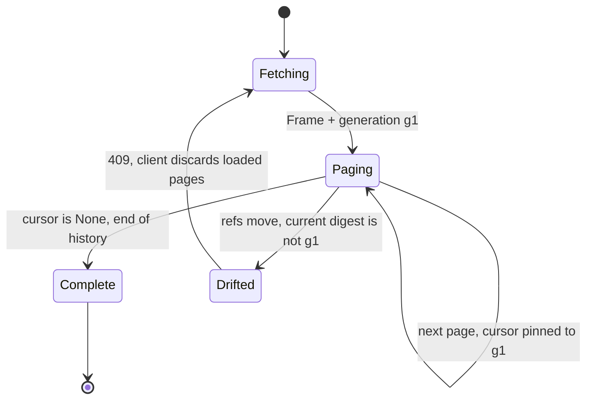
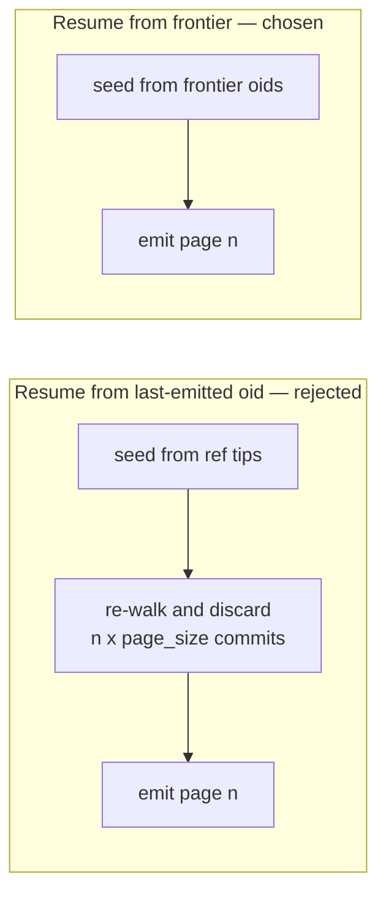

# M1.10 — Decision Log and Roads Not Taken

- **Status:** Accepted — implementation pending
- **Date:** 2026-07-25
- **Milestone / issue:** M1.10 — Introduce Paged History and Bounded Diff APIs
  (#63), milestone M1 — V1 Foundation
- **Branch:** `feature/m1.10-introduce-paged-history-and-bounded-diff`
- **Kind:** Decision record. Not an ADR — see
  [Relationship to other records](#relationship-to-other-records).

> **Implementation amendment:** code verification found that gix cannot resume
> correctly from the frontier-only cursor described here. Tom selected
> stateless deterministic re-walk + skip. The
> [M1.10 verifier amendment](2026-07-25-m1.10-verifier-amendment.md) governs
> implementation wherever it conflicts with D10–D17 below.

## Purpose

M1.10 replaces unbounded history and diff responses with cursor pagination,
bounded reads, and a virtualizing frontend. Seventeen decisions shape that work,
and every one of them closed off an alternative that a later maintainer could
reasonably propose again.

This document records, for each decision: what was decided, what else was on the
table, why the alternative was rejected, what the chosen path costs, and — most
importantly — **what evidence would justify reopening it**. The last of those is
the part that ages best. A decision without a revisit condition becomes folklore.

Read the implementation spec for *what* is being built. Read this for *why it is
not the other thing*.

## Background: the state M1.10 starts from

Two read paths are unbounded in ways the rest of the server is not.

`GET /api/commits` walks up to `HISTORY_LIMIT = 5_000` commits
(`crates/git-vista-server/src/state.rs`), lays the entire result out via
`layout::layout_with_refs`, and returns it as one document. There is no cursor
and no window. The 5 000 ceiling is not a memory bound but a cliff: below it
everything is returned; above it, history silently disappears.

`GET /api/diff/{id}` and `GET /api/file/{id}/{*path}` appear bounded —
`DIFF_PATCH_CAP` (200 000 bytes), `DIFF_PATCH_CAP_FULL` (5 000 000) and
`FILE_CONTENT_CAP` (2 000 000) all exist and all set a `truncated` flag. Reading
`crates/git-vista-server/src/git_cmd.rs` established that they are ineffective as
memory controls: `git_stdout` uses `tokio::process::Command::output()`, which
buffers the whole of git's stdout into a `Vec<u8>` before the handler sees any of
it. The caps then truncate an allocation that has already been made in full. A
commit carrying a 500 MB generated file produces a 500 MB server allocation and
a 200 KB response. The existing caps bound the response size, but not the
server's memory use.

`.output()` also has no `kill_on_drop`, so a client that abandons a request
leaves git running against a future nobody awaits.

```mermaid
flowchart LR
  subgraph today["Today — git_stdout"]
    A1["git diff --patch"] --> A2["Command::output&#40;&#41;<br/>buffers all stdout first"]
    A2 --> A3["500 MB Vec&lt;u8&gt; in RAM"]
    A3 --> A4["truncate to DIFF_PATCH_CAP"]
    A4 --> A5["200 KB response"]
  end
  subgraph m110["M1.10 — git_stdout_capped"]
    B1["git diff --patch"] --> B2["read incrementally"]
    B2 --> B3{"bytes read &ge; cap?"}
    B3 -->|no| B2
    B3 -->|yes| B4["stop reading,<br/>drop child = kill git"]
    B4 --> B5["200 KB response,<br/>allocation bounded by cap"]
  end
```



The response is identical in both columns. The allocation is not, and that is
the whole of the defect.

**This finding reframed the milestone.** It began as "add limits" and became
"the limits are fictional and the fix is structural" — which is why D4 is the
decision it is, and why the implementation order in the spec places the bounding
work before the wire change.

The decisions that follow respond to these constraints: an unbounded, unpaged
history read; caps that bound responses rather than allocations; and no way to
cancel work a client has abandoned.

---

## Architectural decisions

### D1 — Stable layout across paged history

**Decision.** Paging uses an append-only windowed layout. The server maintains a
resumable layout state — open lanes, pending edges, and the traversal frontier —
carried in an opaque cursor. Page *n+1* appends beneath page *n* with every
previously assigned lane, row index, and colour unchanged.

The distinction the decision turns on, drawn schematically — the same commit,
delivered by page 2, under each model:

```text
  append-only (chosen)                recompute per window
  ────────────────────                ─────────────────────
  page 1   ●                          page 1   ●
           ●                                   ●
           ●──┐                                ●──┐
  ─────────────── page boundary ──────────────────────────
  page 2   │  ●   lanes carried       page 2   ●  │   lanes reassigned from
           │  ●   across the cut               ●  │   scratch: the same commit
           │  ●                                ●  │   lands in a different lane
                                                       and a different colour
```

**Alternatives considered.**

1. *Recompute the layout per window.* Each page lays itself out independently.
2. *Page a flat commit list only; leave the graph capped.* Add a paged
   plain-list endpoint and leave `/api/commits` as the capped whole-graph read.

**Why rejected.**

Lane assignment depends on which lines of development are live at a given point
in the walk, and that set differs per window. Under alternative 1 a commit's
lane and colour would depend on which page delivered it, so the graph would
visibly shift sideways and recolour at every page boundary. A graph whose lanes
are not stable does not encode topology; it becomes decoration. This is the one
failure mode that would make the feature worse than the cliff it replaces.

Alternative 2 satisfies the issue's wording while missing its purpose: the graph
view — the product's reason to exist — still could not scroll past its cap, and
the 5 000-commit cliff would survive for a later milestone to hit again.

**Tradeoff / cost.** The layout refactor is the highest-risk element of M1.10.
Three whole-graph computations must be re-expressed: `stable_topo_order` (a
global sort, see D13), `assign_branch_colors` (walks every row), and stub
placement (see D11). The risk is managed by ordering rather than avoided — the
streaming layout lands first, with equivalence tests, before any wire change.

**Revisit when.** The layout equivalence test (one-shot versus windowed output
must be byte-identical) requires increasingly special-cased handling to pass.
That would indicate the streaming model is fighting the data rather than
describing it, and that bounded reflow may be the cheaper contract after all.

---

### D2 — Generation-pinned cursors, `409 Conflict` on drift

**Decision.** Each cursor records the `generation` it was minted under — a
digest over the sorted `(refname, target oid)` pairs of every ref plus HEAD's
resolved target. If the current refs no longer digest to that value when the
cursor is presented, the request is refused with `409 Conflict` and the client
restarts from page 1.



**Alternatives considered.**

1. *Best-effort cursors with no pin* — a bare position, no consistency claim.
2. *Server-held snapshot sessions* — keep each cursor's traversal alive in
   server memory under a TTL.

**Why rejected.**

Alternative 1 reproduces the classic offset-pagination defect: a commit created
during paging shifts the walk, so commits appear twice or vanish between pages,
with no error and no signal. It is worse here than in a list, because a missing
commit silently breaks an edge and the resulting graph is wrong in a way the
user cannot detect.

Alternative 2 gives the strongest consistency — a snapshot could be paged
indefinitely while the repository moved — at the cost of per-cursor server
memory, an eviction lifecycle, and a new resource class that can leak. Every
open browser tab would pin a traversal. On the deployment this project targets
(a single small host serving a browser over an SSH tunnel) that is the wrong
resource to spend.

**Tradeoff / cost.** A user who commits mid-scroll loses their scroll position:
the client discards loaded pages and refetches from page 1. This is surfaced as
a visible "history moved — reloading" state rather than a silent swap, because a
graph that rearranges under the user's finger without explanation is worse than
one that says why.

**Consistency contract (normative).**

> A cursor describes a position in a snapshot of history identified by its
> generation. Pages fetched with cursors sharing one generation are mutually
> consistent: every commit reachable from the snapshot's ref tips appears in
> exactly one page, in commit-time order, and no commit appears twice. The
> server does not hold the snapshot open — it resumes the walk from the frontier
> carried in the cursor (D15) and refuses with `409` if the current refs no
> longer digest to the cursor's generation, so a stale cursor is never served
> silently-wrong data.

Commit-time order is not a strict total order — two commits can share a
timestamp — so ties are broken by commit id, in both the walk and the digest,
making the order deterministic across requests within a generation.

**Precedent.** This is deliberately the same shape as ADR 0018's plan-staleness
gate: pin a token, compare on use, refuse on drift. Nothing is held open, so
nothing can leak.

**Revisit when.** `409` responses become common in ordinary use. They should be
rare, since they require a ref to move *during* a scroll. A high rate would be
evidence that server-held snapshots earn their cost after all.

---

### D3 — Full server, protocol, and frontend scope in one issue

**Decision.** M1.10 delivers the paged API, the bounded reads, the protocol
change, and the virtualizing frontend together.

**Alternatives considered.**

1. *Server and protocol only*, deferring virtualization to #64 (the frontend
   state refactor, the next issue in the milestone).
2. *Split by concern* — memory-safety as one change, paging as another.

**Why rejected.**

Under alternative 1, acceptance criterion 5 ("the frontend virtualizes results
against performance budgets") would go unmet, and — more practically — the
server would page while the client still requested and rendered everything, so
no observable improvement would exist until #64 landed. The work would be done
but not yet real.

Alternative 2 was rejected as a *scope* split and adopted as an *ordering* one.
The memory fix is independently valuable, so it is step 2 of the implementation
plan, deliberately placed before the wire change: an interruption after that
step still leaves the server safe.

**Tradeoff / cost.** A larger change set and a longer-lived branch. Mitigated by
the six-step implementation order in the spec, each step a pushed checkpoint.

---

### D4 — `git_stdout_capped`: streaming, bounded, and cancellable

**Decision.** Introduce a streaming primitive that spawns git with
`Stdio::piped()` and `kill_on_drop(true)`, reads stdout incrementally, stops at a
caller-supplied cap, and drops (killing) the child at that point:

```rust
async fn git_stdout_capped(
    repo: &Path,
    args: &[String],
    endpoint: &str,
    cap: usize,
) -> Result<(Vec<u8>, bool /* truncated */), (StatusCode, String)>;
```

Allocation is bounded by `cap` by construction rather than by post-hoc
truncation. stderr is drained concurrently into a small bounded buffer so a
chatty git cannot block on a full pipe while stdout is not being read.

**Alternatives considered.**

1. *Retain `.output()`, add a pre-flight size guard* — query `--numstat` first
   and refuse over-budget diffs before requesting the patch.
2. *Streaming reader now, cancellation later.*

**Why rejected.**

Alternative 1 treats the symptom. In-budget diffs are still buffered in full,
there is still no mid-read cancellation, and the guard is a second git
invocation that can itself be wrong — output size is not a reliable function of
numstat totals. It also leaves the misleading shape in place: caps that look
like memory bounds but are not.

Alternative 2 splits work that is cheaper together. `kill_on_drop` is not an
additional feature layered on the streaming reader; it is a property of owning
the `Child`. Deferring it would require inventing a separate cancellation
mechanism later — a token, or a registry of in-flight reads — to recover
something the first change already provides.

**Tradeoff / cost.** Every call site must pass an explicit cap. There are four,
all in `crates/git-vista-server/src/handlers/read.rs` (three diff reads and one
file read). `git_stdout` survives as a bounded wrapper (D17) so future callers
cannot be silently unbounded.

**Note on cancellation.** No separate mechanism is needed or wanted. When a
client aborts, axum drops the handler future, which drops the `Child`, which
kills git. Cancellation falls out of bounding the read correctly.

---

### D5 — `--no-textconv` and git's own binary detection

**Decision.** All diff reads pass `--no-textconv`. Git then emits
`Binary files a/x and b/x differ` in place of blob bytes, and `--numstat`
reports `-` for both counts — which `fold_numstat_z` already maps to
`additions: None, deletions: None`, the existing representation of "binary" in
the file list (`DiffFile` carries no separate flag). Blob bytes therefore cannot
enter the patch at all, rather than entering it and being truncated afterwards.

**Alternatives considered.**

1. *Add a per-file byte budget*, eliding any single file's hunk text past a
   threshold.
2. *Both* — `--no-textconv` and a per-file budget.

**Why rejected.**

A per-file budget defends against a genuinely different case: one very large
*text* diff consuming the whole patch budget. But the total patch cap already
bounds the response, so the budget would only change *which* content survives
truncation, not whether the server is safe. It costs a new per-file elision flag
in the DTO, corresponding frontend handling, and tests. Rejected as premature
rather than wrong.

**Tradeoff / cost.** A commit whose first file is enormous can still consume the
patch budget before more interesting files are reached. The `truncated` flag
tells the user this happened, but not what was lost.

**Revisit when.** Truncation is observed to routinely hide the file a user cares
about behind one generated file. That is a usage signal, available only after
the feature ships, and it is the evidence that would justify the DTO cost.

---

### D6 — Protocol version 4, compatibility window `[4, 4]`

**Decision.** `PROTOCOL_VERSION` moves from 3 to 4 and the client window
`[MIN_CLIENT_PROTOCOL, MAX_CLIENT_PROTOCOL]` moves from `[3, 3]` to `[4, 4]` —
a hard break, with no dual-shape period.

**Alternatives considered.**

1. *Window `[3, 4]`* — serve the legacy unpaged shape to v3 clients and the
   paged shape to v4.
2. *No bump; additive optional fields* — add `cursor` and `generation` as
   optional fields and keep the default response unpaged.

**Why rejected.**

Alternative 1 requires a dual-shape code path in the handler and doubled tests.
Because nothing ever forces the legacy path's removal, that cost is permanent.
The server and the WASM frontend are built from one repository and ship
together; there is no third-party client the window would protect. Its only
beneficiary is a stale cached bundle, which the existing incompatibility error
already handles correctly and visibly.

Alternative 2 makes paging opt-in, which leaves the unbounded path as the
default. The hazard survives, and every future reader must know to opt out of
it.

**Tradeoff / cost.** A client running an old bundle receives a protocol
incompatibility error rather than a degraded-but-working view. This is the
intended behaviour: an explicit error beats a silently wrong graph.

**Precedent.** ADR 0013 took the same posture for the clone-descriptor change at
protocol v2.

---

### D7 — iPad-oriented performance budgets

**Decision.**

| Budget | Value |
| --- | --- |
| Page size | 250 commits default; `limit` clamped to 1000 |
| Live SVG row groups | ≤ 2000 |
| Page response size | ≤ 512 KB at the default limit |
| Pan / zoom | smooth on the target iPad |

The first three are asserted in tests. The fourth is verified by driving the
running application, per the project's definition of done.

**Alternatives considered.**

1. *Desktop-first budgets* — 1000 commits per page, ~10 000 live DOM rows.
2. *Defer the numbers* — specify the mechanism, tune constants during
   implementation against a real large repository.

**Why rejected.**

Alternative 1 optimises for the machine that is not the constraint. The iPad is
this project's primary target and the reason several existing controls exist —
the `no-store` cache policy, the diff caps, the tunnel workflow. Larger pages
and a heavier DOM would be comfortable on the development host and janky on the
device that matters.

Alternative 2 is honest but produces a budget with no number, which is not a
budget: nothing is assertable, and acceptance criterion 5 explicitly requires
performance budgets to virtualize against. The constants remain tunable; they
simply have to start somewhere testable.

**Tradeoff / cost.** More round trips than a desktop-tuned client would need,
and constants that are provisional by construction.

**Revisit when.** Measurement on a real large repository, on the target device,
shows headroom or shortfall. These numbers are starting points and are expected
to move once there is evidence.

---

### D8 — Real `ETag`s alongside `Cache-Control: no-store`

**Decision.** Every paged read emits `ETag: "g:<digest>"` derived from the
generation (D2), and honours `If-None-Match` with `304 Not Modified` on the
frame and on page 1. `Cache-Control: no-store` is retained on all reads.

The combination is deliberate, not contradictory. `no-store` prevents iOS Safari
from persisting a stale graph across application and device restarts — a defect
this project has already been bitten by and fixed. The `ETag` serves explicit
revalidation that the client asks for, plus cursor pinning. Caching stays off;
the freshness check is performed by the application.

**Alternatives considered.**

1. *An opaque generation in the JSON body only*, with no HTTP-level `ETag` or
   `304`.
2. *Extend `ETag`s to the diff and file reads*, whose content at a fixed commit
   id is immutable and therefore ideal for caching.

**Why rejected.**

Alternative 1 requires the full frame to be re-transferred on every poll even
when nothing has moved, and offers no standard-shaped revalidation path for a
future client.

Alternative 2 is genuinely attractive on the merits — an immutable diff is the
best possible `304` candidate. It is rejected here because it reintroduces cache
semantics on endpoints that were deliberately made `no-store`, and the earlier
cache defect was expensive enough that widening that surface deserves its own
decision and its own ADR rather than riding along with this one.

**Tradeoff / cost.** Diff and file reads keep re-transferring content that could
have been revalidated cheaply.

**Revisit when.** Diff or file re-transfer is measured as a real bottleneck on
the tunnel path. At that point, `ETag`s for immutable-by-id reads should be
proposed as a standalone decision.

---

### D9 — Pathological-repository integration testing

**Decision.** The memory bound is proven by an integration test that builds a
temporary repository in-test containing a large generated text file
(approximately 50 MB) and a binary blob, then asserts that the diff response
stays under the cap, that `truncated` is set, that the patch contains
`Binary files … differ` and none of the blob's bytes, and that the binary file's
entry carries absent line counts. A unit test covers `git_stdout_capped`
directly, including that dropping the future kills the child.

**Alternatives considered.**

1. *Unit-test the capped reader alone*, trusting the handlers to wire it
   correctly.
2. *Both* — unit and integration.

**Why rejected.**

Alternative 1 proves only that the reader caps, not that the handlers call it
with the correct cap. The defect class being fixed is precisely "the cap exists
but is applied too late": a reader-only unit test would pass against the current
broken code, because `DIFF_PATCH_CAP` does truncate correctly — after the
allocation has already happened.

Alternative 2 was in fact adopted. Both tests are specified, because they prove
different properties: the unit test proves the primitive, the integration test
proves the wiring.

**Tradeoff / cost.** Fixture-repository construction makes the suite slower. The
cost is accepted; it is the only evidence that the endpoint — not merely the
helper — is bounded.

---

## Derived design decisions

These follow from D1–D9 and from close reading of the existing implementation.
Each was a real fork, and several are worth knowing were considered.

### D10 — `Frame` / `Page` separation

**Decision.** The response splits into a whole-repository `Frame` (refs, head
branch, per-branch colour slots, stubs, repository labels and ids, read-only and
resettable flags, forge URLs, and the generation) and cursor-paged `Page`s (rows,
edges, lane count, next cursor, generation). The frame is `O(refs)`, not
`O(commits)`: reading every ref in a large repository is cheap, walking every
commit is not.

```mermaid
flowchart TD
  R[("repository")] --> F["Frame — O&#40;refs&#41;<br/>refs, head branch, branch colours,<br/>stubs, generation, repo metadata"]
  R --> W["commit walk — commit-time order"]
  W --> P1["Page 1<br/>rows, edges, cursor"]
  P1 -->|cursor| P2["Page 2<br/>rows, edges, cursor"]
  P2 -->|cursor| PN["Page n<br/>cursor is None at the end"]
  F -.->|generation must match| P1
  F -.->|stub anchors resolve<br/>against loaded rows| P2
```



**Alternative.** Repeat the ref set in every page. Simpler on the client, but it
re-transmits the full ref set N times and leaves no single place where the
generation is defined.

### D11 — `anchor_row` → `anchor_commit`, absolute stub `lane` → `lane_offset`

**Decision.** `BranchStub` today carries `anchor_row: usize`, `anchor_lane:
usize`, and an absolute `lane: usize` allocated upward from `graph.lane_count`.
All three are meaningful only against a completed whole-graph layout. The frame
therefore carries a relative form — `anchor_commit: Oid`, `lane_offset: usize`,
plus `name`, `color`, and `depth` — and the client resolves it once the anchor's
row is loaded:

```text
anchor_row  = index of anchor_commit among loaded rows   (absent => not drawn)
anchor_lane = rows[anchor_row].lane
lane        = lane_high_water + 1 + lane_offset
```

**Alternative.** None viable. A row index cannot be computed before the page
containing that row is laid out. This decision is forced by D1, not chosen.

**Tradeoff.** Stubs shift one column right when a later page widens the graph —
a repaint of a few short lines in the right-hand gutter, not a reflow of
history. It preserves the invariant that stub cascades sit clear of every commit
lane. A stub anchored below the loaded window is not drawn, which is correct: it
is not visible either. The cascade grouping itself (stubs sharing an anchor stack
into a staircase, ordered deterministically by branch name) depends only on refs
and remains a frame-side computation.

### D12 — `remote_commits` → per-row `on_remote`

**Decision.** `Graph.remote_commits: Vec<String>` — today the set of every
commit reachable from a remote-tracking ref — becomes a per-row `on_remote: bool`
computed for each window as it is laid out.

**Alternative.** Keep the set in the frame. Rejected because it grows with
repository size without bound, which would reintroduce an unbounded field in the
very change that removes one. The behaviour it supports — linking only pushed
objects, so a link can never 404 (issue #12) — is unchanged; only the
representation moves.

### D13 — Drop `stable_topo_order` from the paged path

**Decision.** The paged walk relies on commit-time ordering, which
`walk_history` already uses
(`Sorting::ByCommitTime(CommitTimeOrder::NewestFirst)`) and which is resumable.
`stable_topo_order` is not used on the paged path.

**Alternative.** Retain topological ordering. Rejected because it is a global
sort over the entire commit set with no windowed form. Its guarantees are
re-expressed as invariants of the streaming layout and proven by the equivalence
test rather than asserted by the sort.

### D14 — Signed opaque cursors

**Decision.** Cursors are versioned structs, serialized, signed with a
per-process key (truncated HMAC-SHA256), and base64url-encoded. A cursor failing
signature verification is rejected with `400` before any allocation. Field sizes
are capped: `open_lanes` and `pending_edges` at 256 entries each, `frontier` at
1024, giving the encoded cursor a fixed worst-case size.

**Alternative.** An unsigned opaque blob. Rejected because `open_lanes` and
`frontier` are vectors that drive server-side allocation — an unsigned cursor is
a client-authored allocation. ADR 0017 already establishes that the browser may
not author server state; this applies the same rule one layer down. A graph
genuinely wider than 256 concurrent lanes is laid out with the overflow
collapsed into the rightmost lane rather than growing the cursor without limit.

### D15 — Cursors carry the traversal frontier

**Decision.** The cursor carries `frontier` — the set of commits reached but not
yet emitted, i.e. the walk's own priority queue — rather than only the last
commit emitted. Re-seeding `rev_walk` from those oids resumes the identical
commit-time traversal at the identical point, at `O(page_size)` per page.



The upper path costs `O(n × page_size)` at page *n*; the lower path costs
`O(page_size)` at every page.

**Alternative.** Resume from a single "last emitted" oid. Rejected because it
forces each page to re-seed from the ref tips and discard everything already
emitted, making page *n* cost `O(n × page_size)` — a quadratic full scroll. That
is the exact failure mode M1.10 exists to remove, reintroduced one layer down.

**Tradeoff.** The frontier is bounded by graph *width*, not length — one entry
per concurrently live line of development — and is capped at 1024 entries. A
graph wider than the cap falls back to re-seeding from the ref tips and skipping
`next_row` commits: correct, merely slower. The cap degrades performance, not
truth.

**Historical note.** This defect was present in the first draft of the
implementation spec, which carried only a resume oid, and was caught in review
before implementation began.

### D16 — Reimplement `layout_with_refs` on top of `StreamLayout`

**Decision.** The existing whole-graph entry point is reimplemented over the new
streaming layout — feed every commit, finish once — rather than maintained
alongside it.

**Alternative.** Keep two implementations. Rejected because they would drift,
and the existing layout test suite would stop covering the path that actually
runs. Delegation makes that suite the regression net for the refactor, which is
the cheapest safety available for D1's risk.

### D17 — `git_stdout` retained as a bounded wrapper

**Decision.** `git_stdout` survives as a thin wrapper over `git_stdout_capped`
with a default 8 MiB ceiling. The four existing diff and file call sites are
converted to pass their real caps explicitly.

**Alternative.** Delete it and convert every caller by hand. Rejected because
the wrapper guarantees that any caller added later is bounded by default — a
fail-safe rather than fail-open posture. The default ceiling is deliberately far
above every real caller's cap, so it never masks a missing explicit one in
normal operation.

---

## Process decisions

Retained because they affect how the milestone is executed, not merely how it
was arrived at.

| Decision | Alternative, and why not |
| --- | --- |
| Verify what actually landed before starting new work — `./dev resume`, `git log`, `gh pr list` | Trusting `handoff.md` alone. It is written before work finishes, so it records intent rather than outcome. Git is the ground truth. Confirmed useful after an unplanned interruption to the previous session, which turned out to have lost nothing. |
| Design before implementation | Proceeding straight to code. The whole-graph layout constraint (D1) would otherwise have surfaced mid-implementation, after the endpoint shape had already been committed to. |
| Bounding before the wire change | Implementing paging first. Step 2 of the implementation order is independently valuable, so an interruption after it still leaves the server safe. |

---

## Revisit signals

Concrete conditions that justify reopening a decision. Absent these, the
decisions above stand.

| Decision | Reopen when | What to reconsider |
| --- | --- | --- |
| D1 | The layout equivalence test needs mounting special cases to stay green | Whether bounded reflow is a cheaper contract than absolute lane stability |
| D2 | `409` responses are common in ordinary use, not rare | Server-held snapshot sessions, with an explicit memory budget and eviction policy |
| D5 | Truncation routinely hides the file of interest behind one generated file | A per-file byte budget and the DTO elision flag it requires |
| D7 | Measurement on a real large repository on the target device shows headroom or shortfall | Page size, live-row ceiling, and response-size budget |
| D8 | Diff or file re-transfer is measured as a bottleneck on the tunnel path | `ETag`s for immutable-by-id reads, as a standalone decision with its own ADR |
| D14 | Repositories wider than 256 concurrent lanes are encountered in practice | The lane cap and the overflow-collapse behaviour |
| D15 | The 1024-entry frontier cap is hit on real repositories | The cap value, or a compact frontier encoding |
| D17 | A caller is found relying on the 8 MiB default rather than an explicit cap | Whether the wrapper masks more than it protects |

---

## Relationship to other records

- **M1.10 implementation spec** — `2026-07-25-m1.10-paged-history-bounded-diff.md`.
  Defines the endpoints, DTOs, `LayoutCursor` shape, test plan, and the six-step
  implementation order. This document explains the reasoning behind those
  choices and does not restate them; where the two differ, the spec governs
  *what* is built and this document governs *why*.
- **[ADR 0017](../../adr/0017-no-arbitrary-argv-from-the-browser.md) — No
  arbitrary argv from the browser.** D14's signed cursors apply
  the same principle one layer down: the browser may echo server state back, but
  may not author it. ADR 0017 covers argv construction; this milestone extends
  the principle to cursor state that drives allocation.
- **[ADR 0018](../../adr/0018-plan-staleness-enforcement.md) — Stale, tampered
  or expired plans never execute.** D2's
  generation pinning reuses that pattern — pin a token, compare on use, refuse
  on drift — for reads rather than writes. The mechanism is analogous; the
  subject differs.
- **[ADR 0013](../../adr/0013-clone-descriptor-protocol-bump.md) — Protocol v2
  for the clone response.** Precedent for D6's hard
  protocol bump over a dual-shape compatibility window.
- **ADR 0022 — Paged history and bounded reads** *(planned, to be written with
  the implementation)*. Will record, in the ADR series' own format, the three
  decisions that are expensive to reverse: the `Frame`/`Page` split with the DTO
  changes it forces (D10–D12), the generation-pinned cursor with `409` on drift
  (D2), and signed opaque cursors as an instance of ADR 0017's rule (D14). The
  ADR is the durable summary; this document is the fuller record of alternatives
  behind it and is not superseded by it.
- **`docs/SECURITY_MODEL.md`** — to be annotated where the bounded reads and
  cursor signing implement it. The memory bound is a denial-of-service control,
  not solely a performance measure.

---

**Signed:** thomas2010 · 2026-07-25T16:55:00-04:00
