# M1.10 — Verifier Amendment

- **Status:** Accepted — implementation pending
- **Date:** 2026-07-25
- **Issue:** #63, M1.10 “Introduce Paged History and Bounded Diff APIs”
- **Branch:** `feature/m1.10-introduce-paged-history-and-bounded-diff`
- **Authority:** Tom chose **A — stateless deterministic re-walk + skip** on
  2026-07-25. This corrective revision preserves that choice and incorporates
  the completed core, server/protocol, cross-page, and frontend verifier reports.

## Purpose

The first M1.10 design was intentionally verified against current code before
implementation. That verification found several load-bearing assumptions that
do not hold in gix 0.84 or in Git-Vista's current layout/frontend. This amendment
repairs those mechanics while preserving the milestone's goals: incremental
history transfer, stable append-only geometry, bounded cancellable diff/file
reads, generation-pinned consistency, and a virtualized iPad UI.

Independent corrective re-review completed CLEAN on 2026-07-25, and Tom
explicitly accepted this revision on 2026-07-25. This file is therefore
normative where it conflicts with:

- `design-docs/2026-07-25-m1.10-paged-history-bounded-diff.md`; and
- `docs/superpowers/specs/2026-07-25-m1.10-decision-log.md`, including the
  superseded frontier mechanics in D1 and D10–D15 and the corrected contracts
  recorded in D2, D8, and D14.

The original decision log remains the rationale record. Unchanged decisions
remain accepted. The first amendment review and scoped re-review are preserved
at `/tmp/m110-amendment-review.md` and `/tmp/m110-amendment-rereview.md`. The
completed implementation-plan reviews are preserved at
`/tmp/m110-plan-review.md` (2 Critical, 4 Important),
`/tmp/m110-crosspage-risk.md` (1 deduplicated Important-equivalent), and
`/tmp/m110-plan-frontend-review.md` (9 Important). The representation-validator
follow-up is `/tmp/m110-plan-review-etag-followup.md`; the consolidated
2-Critical/14-Important correction map is `/tmp/m110-plan-fix-map.md`. Final
post-correction reports are `/tmp/m110-plan-corrective-rereview.md` (CLEAN),
`/tmp/m110-plan-frontend-rereview.md` (CLEAN), and
`/tmp/m110-final-design-review.md` (CLEAN). The reviewed plan is pushed at
`2c775bf`; no production code exists yet.

## 1. Traversal: replay and skip, not frontier-only resume

The installed gix walk owns both a priority queue and a growing `seen` set.
`Sorting::ByCommitTime` compares timestamps only; it has no commit-id tie-break.
Serializing only the remaining frontier loses visited membership and heap shape.
After merge reconvergence, a resumed walk can emit a commit twice even though
the repository generation did not change.

The signed cursor therefore carries a fixed-size target scope, generation, and
absolute next-row offset, not a traversal frontier or layout checkpoint:

```rust
struct CursorEnvelope<T> {
    version: u8,
    scope: CursorScope,
    generation: GenerationToken,
    state: T,
}

pub struct HistoryCursor {
    pub next_row: usize,
}
```

For every page, the server:

1. resolves the selected repository/worktree and its opaque cursor scope;
2. reads one snapshot containing refs, resolved HEAD, and the validated,
   canonical shallow-boundary set;
3. authenticates a cursor, if present, then compares its scope and generation
   with that resolved target and snapshot before starting a walk;
4. reads traversal tips directly from gix as `(full_ref_name, object_id)` pairs
   (not the display-short `GitRef.name`) and sorts by that tuple;
5. constructs `gix::traverse::commit::topo::Builder` with
   `topo::Sorting::DateOrder` from those sorted tips through an object adapter
   that removes parent links only for commits recorded as shallow boundaries;
6. replays rows `[0, next_row)`, checkpoints immediately before `next_row`, and
   discards only the prefix response buffers while retaining transient layout
   and colour-claim state for this request;
7. emits at most the requested window and signs the next absolute row; and
8. re-reads refs, HEAD, and the shallow set before responding, returning
   `409 Conflict` if that generation moved during the work.

If traversal reports a read error, the server performs the same final snapshot
read first: generation drift wins as `409`; otherwise the explicit object or
shallow-metadata error is returned. It never converts an unexplained read
failure into a shallow boundary.

```mermaid
sequenceDiagram
  participant UI as Browser
  participant API as History API
  participant Git as Deterministic walk
  UI->>API: page(cursor: generation g, next_row n)
  API->>API: resolve target; read refs + HEAD + shallow set
  API->>API: authenticate cursor; compare scope + generation
  alt generation differs from g
    API-->>UI: 409 history moved
  else generation matches g
    API->>Git: rebuild boundary-aware walk from sorted tips
    Git-->>API: replay rows 0 through n-1; checkpoint before n
    Git-->>API: emit next bounded window
    API->>API: recheck generation and sign n + rows_emitted
    API-->>UI: Page + ETag + next cursor
  end
```

This is correctness-first and stateless. Page `n` repeats work for earlier
rows; a complete scroll is quadratic in commit count. The implementation and
ADR must say so plainly. `O(page_size)` per page is no longer claimed. A
generation-keyed disk index may replace replay later if real-device measurement
shows deep paging is too slow.

Cursor consistency is scoped to cursors minted by the current process and the
repository/worktree for which each cursor was minted. Cursor HMAC keys rotate at
process restart, so an old cursor is rejected and the client restarts at page 1.
The exact paged ordering contract is the installed gix Topo `DateOrder` walk
seeded by the sorted full-name/id tip tuple above. No object-id tie-break is
claimed.

This order is intentionally allowed to differ from the legacy
`stable_topo_order` graph. D13 already accepted dropping that global sort from
the paged path; protocol v4 makes the visible ordering change explicit. Task 1
still preserves legacy `layout()`/`layout_with_refs()` behavior. Endpoint tests
compare paged rows, canonical edges, colours, and stubs with one uninterrupted
run of the exact new Topo `DateOrder` pipeline, while the unchanged legacy suite
continues to guard the old entry points.

Required regression: the merge-reconvergence fixture below, page boundaries at
every row, equal timestamps, and clock skew must yield the same OID sequence as
one uninterrupted invocation, without duplicates or gaps.

```text
       M(110)
      /      \
   A(90)    B(10)
      \      /
       C(100)
```

## 2. Core layout checkpoint remains a narrow no-wire refactor

Task 1 extracts the current topology pass into `layout::stream` and proves that
one-shot, window-7, and window-1 feeds produce byte-identical rows and
canonically ordered edges. It does not claim to make gix traversal resumable.

`stable_topo_order`, whole-graph branch colouring, current stub classification,
and badge attachment remain around the stream-backed topology wrapper for the
existing `layout()` and `layout_with_refs()` entry points. Existing colour,
clock-skew, dangling-parent, and issue-#28 interior-stub tests remain unchanged.

The stream push interface must receive the exact boundary decision established
by the repository snapshot. A commit whose own OID is in the recorded shallow
set has all of its parent links cut: no parent lane is reserved and no parent
edge is emitted. For every non-boundary commit, every recorded parent must
resolve as a valid commit object; a missing, wrong-kind, malformed, or corrupt
object is a history read error, not an inferred shallow edge. A defensive core
`finish` may drop unresolved synthetic input, but the server must not serialize
such input as a valid repository history response.

Cross-page edges use a response-floor contract. For a Page covering absolute
rows `[n, n + k)`, it owns all and only edges whose parent endpoint satisfies
`n <= edge.to_row < n + k`; `edge.from_row` may be in the discarded prefix.
`PendingEdge` retains at least `{ parent_oid, parent_ordinal, from_row,
from_lane }`. Resolution creates an internal
`ResolvedEdge { edge, parent_ordinal }`, allowing deterministic page-local sort
without indexing absolute rows into a page-local row vector. At a non-terminal
checkpoint, future-parent edges remain transient and are reconstructed by the
next stateless replay. Prefix-resolved edges are discarded and are not emitted
again.

The legacy/full-aggregate canonical order remains source row then source-parent
ordinal. Raw Page edge vectors are deterministic within each response but are
not required to concatenate into that global order: a later Page can resolve an
edge from an earlier source row. Equivalence tests canonicalize a clone of the
completed union against the uninterrupted oracle, and separately prove
exactly-once destination-page ownership. The row-indexing
`canonicalize_edges(rows, edges)` helper is full-aggregate/legacy-only.

## 3. Corrected frame/page contract and crate ownership

Current stub detection walks first-parent ownership chains and depends on row
order. Stubs cannot be computed from refs alone. They move from `Frame` to the
page that first resolves their anchor commit.

Generic transport envelopes live in `git-vista-protocol/src/history.rs`; the
protocol crate does not gain a production dependency on core. Server and
frontend each own aliases supplying core domain types. The frontend aliases and
its concrete `HistoryInvariantError` live in `crates/git-vista/src/history.rs`;
the frontend never imports a server-private alias. A core dev-dependency is
permitted only in protocol golden tests.

```rust
// git-vista-protocol
pub struct HistoryFrame<R> {
    pub generation: GenerationToken,
    pub refs: Vec<R>,
    pub head_branch: Option<String>,
    pub branch_colors: Vec<(String, usize)>,
    pub repo_label: Option<String>,
    pub repo_id: Option<String>,
    pub worktree_id: Option<String>,
    pub read_only: bool,
    pub resettable: bool,
    pub repo_url: Option<String>,
    pub remote_web_url: Option<String>,
}

pub struct HistoryPage<R, E, S> {
    pub rows: Vec<R>,
    pub edges: Vec<E>,
    pub stubs: Vec<S>,
    pub lane_count: usize,
    pub cursor: Option<String>,
    pub generation: GenerationToken,
}

// git-vista-core
pub struct FrameStub {
    pub name: String,
    pub anchor_commit: Oid,
    pub lane_offset: usize,
    pub color: usize,
    pub depth: usize,
}

// declared independently by the server and frontend
pub type Frame = HistoryFrame<GitRef>;
pub type Page = HistoryPage<GraphRow, Edge, FrameStub>;
```

`Page.lane_count` means commit-lane high-water only. The frontend resolves
loaded stubs and widens its local drawing gutter beyond that value. The final
legacy `Graph.lane_count` continues to include stub lanes.

`GraphRow.color` remains authoritative. `Frame.branch_colors` provides stable
slots for named refs, but synthetic unclaimed lines still receive per-row
colours and must not be derived from the frame map.

## 4. Replayed streaming colour and stub classification

While replaying rows, the server rebuilds colour ownership without retaining a
whole graph:

- A ref tip introduces a claim whose priority is the current established key:
  trunk rank, local before remote, emitted tip row, then branch name.
- Claims propagate only through the winning claim's first-parent chain.
- When claims converge, the highest-priority claim wins.
- An unclaimed row starts a synthetic `~<short-id>` claim.
- A local ref whose tip row is already owned by a higher-priority claim becomes
  a page-delivered `FrameStub` anchored by commit id.
- Refs are attached as badges only when their target row is emitted.

A Page owns all and only stubs whose anchor row is among that Page's rows.
Replaying a later request recomputes prefix stubs but suppresses them below the
response floor. The classifier retains a transient cumulative
`next_stub_offset` (never cursor state); it groups all losing local refs at one
anchor, sorts them by name, and assigns the same offsets/depths as the
uninterrupted classifier. A valid server sequence therefore never delivers a
stub before its anchor. Skipping an unresolved stub remains frontend defensive
handling for malformed input, not an expected paging sequence.

Before protocol goldens freeze this shape, property tests must run the current
colour/stub fixtures through both whole-graph and replayed streaming
classification. Any changed row colour, stub name, anchor, depth, or stable
slot stops the endpoint task and reopens this section; tests are not weakened.

## 5. Remote status remains correct for arbitrary commit detail

`Graph.remote_commits` is removed from paged history. Each emitted `GraphRow`
gains `on_remote: bool`, with `#[serde(default)]` for old fixtures.

The detail panel can navigate to a parent whose history row is not loaded.
Therefore `CommitDetail` also gains `on_remote: bool`; commit/forge links in
the detail UI use that field rather than loaded-row membership. This preserves
issue #12's “never link an unpushed object” behavior.

Remote membership is exact and has no `HISTORY_LIMIT`: seed a gix walk from all
remote-tracking tips, traverse until every requested page OID is found or the
remote history ends, and return membership for that bounded requested set. The
detail endpoint uses the same helper for its one arbitrary OID. Tests cover a
pushed row beyond 5,000 and an unloaded parent opened through commit detail.

## 6. Generation, ETags, cursor signing, and protocol errors

History generation reuses `GenerationInputs` and `RepositoryGeneration` with a
distinct algorithm discriminator. Its inputs are the sorted full-name/ref-target
pairs, symbolic and resolved HEAD, and every OID in the validated, sorted,
deduplicated `$GIT_DIR/shallow` boundary. Each shallow OID occupies a unique
canonical field such as `shallow:<oid> = boundary`. Its opaque wire form remains
`history-v1:<decimal>`. Index and worktree state are excluded, so ordinary edits
do not trigger cursor drift, while deepen/unshallow does even if no ref moves.

History generation is a snapshot-consistency token, not an HTTP representation
validator. Each successful endpoint representation is handled as follows:

1. Build the selected Frame or Page completely and serialize it exactly once to
   the JSON bytes that will be sent.
2. Compute SHA-256 over those exact bytes and emit the type-separated strong tag
   `"gv4-frame:<hex-sha256>"` or `"gv4-page:<hex-sha256>"`. This covers Frame
   metadata and Page offset, limit, rows, geometry, and process-key-specific next
   cursor. If content coding is introduced later, the coded representation must
   get its own validator namespace.
3. Frame and page 1 evaluate `If-None-Match` against their current tag using RFC
   weak comparison: an exact strong tag, its `W/` form, any matching list member,
   or `*` matches. A match returns an empty `304` carrying the current ETag; a
   malformed or nonmatching field returns the normal `200` body and ETag.
4. Cursor pages authenticate and validate scope/generation, ignore
   `If-None-Match`, and return `200` with their own body-derived Page ETag.

HMAC-SHA256 cursors use a per-process random key and a truncated 128-bit tag.
Encoded-length and signature checks happen before state deserialization. The
signed envelope binds a fixed-size opaque repository/worktree scope, generation,
and `HistoryCursor { next_row }`. Registered targets bind both `RepositoryId` and
`WorktreeId`; a degraded target without a registered handle receives a
per-process opaque binding tied to its resolved canonical target without placing
that path on the wire. Scope mismatch is the same generic bad-cursor `400` as
tamper and is rejected before any walk. The frontend carries Frame's
`worktree_id` as `repo=` on page requests when present. Generation drift is
`409`; protocol v4 serializes every 409 as machine-readable `"conflict"` under
the hard `[4,4]` window. `Cache-Control: no-store` continues to come from auth
middleware.

The encoded cursor is therefore small and fixed. The abandoned frontier,
open-lane, pending-edge, and classifier state are not URL state; process restart
rotates the key and deliberately invalidates old cursors.

## 7. Response budget and topology inputs

Default page limit remains 250 and request limit clamps to 1–1000. The 512 KiB
value remains the accepted pathological-fixture integration budget from D7/D9,
not a universal wire ceiling: commit author, summary, refs, and parent counts
are not yet contractually truncated. M1.10 does not silently change or reject
valid commit metadata using invented limits. The implementation test serializes
the specified large fixture's default page and requires it to remain at or below
512 KiB.

The raw Topo builder must not receive `repo.objects.clone()` without shallow
filtering: it loads discovered parents for ordering before layout can classify
them. A snapshot-aware object/find adapter presents every recorded boundary
commit to Topo with its parent links cut. For a non-boundary commit, all recorded
parents must resolve as valid commit objects; missing, wrong-kind, or corrupt
objects and malformed shallow metadata are explicit read errors. Tests use a
real depth-one clone, deepen/unshallow without a ref move, and non-shallow
missing/corrupt fixtures; synthetic `StreamLayout` membership tests remain
necessary but are not traversal proof.

Diff/file values stay unchanged: 200 KB panel patch, 5 MB full patch, and 2 MB
file content. The two `-z` metadata reads use a separate 8 MiB cap; hitting it
returns an explicit error because `CommitDiff.truncated` describes patch text
only and cannot represent a partial file list. The new streaming reader enforces
allocation bounds before bytes enter handler memory, drains bounded stderr
concurrently, and kills git when capped or dropped. All diff reads use
`--no-textconv`.

This task converts exactly four `git_stdout` callers in
`handlers/read.rs`—three diff reads and one file read. It does not claim to
bound unrelated `.output()` sites elsewhere in the server.

Proof of that allocation claim is structural. Primitive tests prove the reader
never retains more than the cap and that a literal `git cat-file --batch`
producer is killed while its input remains open. An automated source-boundary
test rejects `.output()`, direct process reads, and old `git_stdout` use in the
production read-handler path and asserts exactly four capped call sites. The
large handler fixtures prove response wiring and semantics only. Returned length
or post-hoc truncation alone is not evidence of pre-allocation bounding.

## 8. Frontend corrections

The viewport culler already exists. M1.10 extends it; it does not create a
second culler or replace its measured six-row overscan. The corrected frontend
contract is:

- `crates/git-vista/src/history.rs` owns the frontend `Frame`/`Page` aliases,
  `HistoryInvariantError`, and host-testable aggregate/state helpers.
- `HistorySeed { reload_epoch, frame, first_page }` creates one
  `StoredValue<RenderCtx { frame, loaded: LoadedHistory, ... }>` as the only
  owner of loaded rows, edges, stubs, OID index, cursor, and geometry. App owns
  `history_phase`, `history_complete`, and `print_graph_open`, passes their
  handles to the mounted canvas, and makes Print read that same aggregate.
  Every new seed closes Print and unmounts/disposes the old aggregate first.
- `HistoryPhase::{SeedLoading, Ready, DriftReloading, SeedError}` carries a
  reload epoch. `DriftReloading` dominates any retained successful resource and
  is rendered before resource matching. Only a successful seed tagged with the
  current epoch may transition to `Ready`.
- `PageLoadState::{Idle, Loading { reload_epoch, generation, cursor }, Error {
  cursor, message }}` replaces a boolean. Each page future captures that key and
  an `Rc<Cell<bool>>` cleanup guard or abort handle. Before any aggregate or
  signal write, completion verifies liveness and matching epoch, generation,
  and cursor, then uses `try_update_value`.
- Automatic prefetch runs only in `Idle`. A non-409 failure enters visible
  `Error`, suppresses the effect, and requires explicit Retry or seed reset; it
  cannot create a request loop.
- Page append validates, before mutation, `row.row == old_row_count + offset`,
  unique OIDs, exact generation, unique edges, and the destination-page edge
  rule from §2. Thus page 1 starts at zero and later pages cannot contain gaps.
- `LoadedHistory` exposes `text_x()` or an equivalent read-only cache. Append
  finishes temporary occupancy/text geometry before committing state or raising
  `layout_epoch`; tests and RenderCtx consume that one API.
- `AppendDelta` reports both `prefix_geometry_changed` and
  `stub_geometry_changed`. Stub geometry comparison covers the complete
  before/after resolved-stub set, including existing stubs shifted by a larger
  lane high-water. Shifted stubs are reapplied to monotonic occupancy, reactive
  `home` is recomputed, and both stub/icon layers consume `stub_epoch` or
  equivalent stable reactive keys.
- Stub resolution is by `anchor_commit`; an unresolved stub is skipped only as
  malformed-input defence. Renderers use checked edge endpoints.
- `row_count` remains reactive; the pure camera threshold requests near 1.5
  viewport heights from the loaded tail. Visible rows retain six-row overscan
  and an explicit 2000-row hard clamp.
- When a page is loading and `visible.start >= row_count`, an untransformed
  in-canvas overlay remains visible. A world-space marker at
  `node_cy(row_count)` alone does not satisfy fast over-pan.
- `remote_branches` is derived from `Frame.refs`; row/detail links use their
  explicit `on_remote` fields. Canvas `home` remains reactive.
- “Print Graph” stays disabled until `cursor == None`; it never silently prints
  a prefix or auto-fetches all pages merely for printing.
- The frontend keeps cache-busting `t=` and sends no `If-None-Match` in M1.10.
  Server contract tests prove future-client ETag/304 behavior.
- Host tests cover pure aggregate, reducer, threshold, viewport, and geometry
  helpers. Wasm lifecycle wiring is verified by wasm Clippy, Trunk, and the live
  drive; it is not claimed as host-tested.

```mermaid
stateDiagram-v2
  [*] --> SeedLoading
  SeedLoading --> Ready: matching-epoch Frame + page 1
  SeedLoading --> SeedError: seed failure
  Ready --> Ready: append succeeds in place
  Ready --> SeedError: page failure; explicit Retry
  Ready --> DriftReloading: 409 generation drift
  DriftReloading --> SeedLoading: old canvas unmounted; epoch advances
  SeedError --> SeedLoading: Retry or refresh
```



## 9. Implementation order and proof gates

1. Behavior-preserving `layout::stream` topology extraction and equivalence
   tests; no wire change.
2. Bounded cancellable git reads and pathological diff/file fixtures.
3. History generation, representation-ETag helpers, scoped signed offset cursor,
   and conflict code.
4. Replay colour/stub property tests, then corrected Frame/Page protocol v4 and
   endpoints.
5. Frontend append, typed fetch errors, drift recovery, geometry updates, and
   explicit culling/print budgets.
6. Full `./dev gate`, then isolated live drive against a large repository in a
   private systemd network namespace whose own loopback:8080 is disjoint from
   the host. Use temporary XDG state/data, record the host listener PID before
   the drive, and require the same healthy PID afterward. Never restart, signal,
   or replace Tom's host port-8080 iPad session.
7. ADR 0022, ADR index, SECURITY_MODEL annotation, WORKLOG/PDF/journal, PR,
   verified merge, preserved source branch, and issue closure.

Every numbered step is a pushed `./dev wip` checkpoint. The implementation plan
must contain exact files, fail-first tests, expected failures, concrete commands,
and a checkable done condition for each step.

Every focused test command must prove its selection. A command using `--exact`
names the full module-qualified harness name and is preceded by a `--list` check
that finds that exact test; grouped commands either name a declared module or
list-witness every test claimed by the step. A successful zero-test or partial
filter run is never accepted as a red or green gate. The bounded-read gate also
includes the automated structural source-boundary assertion from §7.

The plan also carries these verified integration constraints:

- enable Tokio's `io-util` feature directly;
- resolve the intentionally unused bounded `git_stdout` wrapper with a narrow
  `#[allow(dead_code)]` plus D17 rationale, or explicitly amend D17 and remove it;
- leave page query DTOs open to the frontend's unknown `t=` field;
- register frame/page reads on both loopback and LAN-view routers; and
- retain `HISTORY_LIMIT` for activity code that still consumes it.

## Consequences

- The corrected contract makes cursor correctness and bounded URL state
  implementable; independent re-review is CLEAN and Tom explicitly accepted it
  on 2026-07-25, lifting the production-code gate.
- Deep pages trade speed for statelessness; this is accepted for M1.10 and must
  be measured on the target iPad before considering a disk index.
- Stubs arrive incrementally rather than in the frame.
- Current graph semantics remain the test oracle; verifier-driven property tests
  stop silent colour/stub regressions.
- The implementation is larger than the first draft. No correction identified
  by the listed reviews is intentionally deferred into coding.

---

Recorded by Codex from Tom's explicit choice A and completed verifier evidence;
corrective revision drafted, corrected, and independently re-reviewed CLEAN on
2026-07-25; Tom explicitly accepted it on 2026-07-25. Implementation pending.
