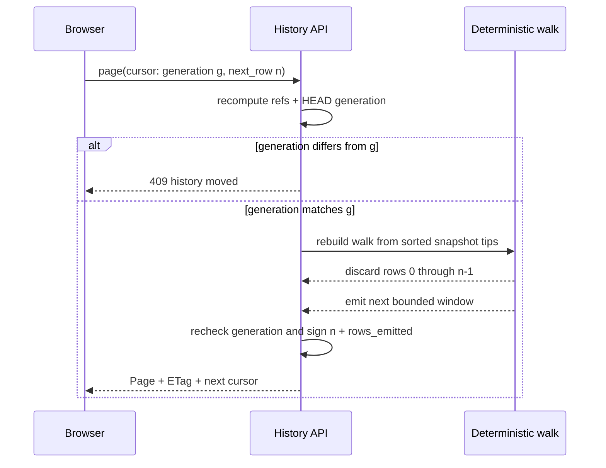
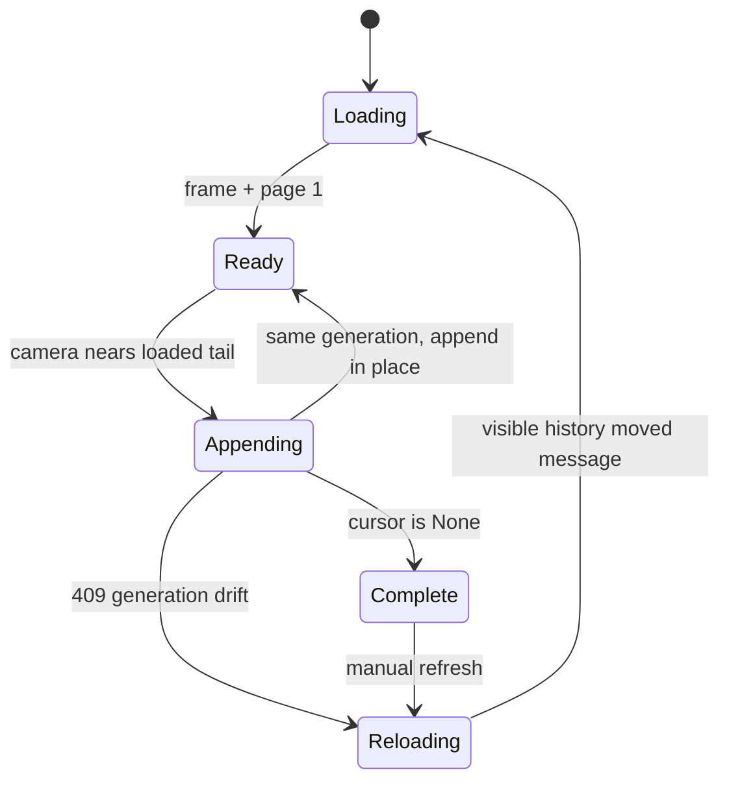

# M1.10 — Verifier Amendment

- **Status:** Draft — choice A accepted; verifier-review corrections in progress
- **Date:** 2026-07-25
- **Issue:** #63, M1.10 “Introduce Paged History and Bounded Diff APIs”
- **Branch:** `feature/m1.10-introduce-paged-history-and-bounded-diff`
- **Authority:** Tom chose **A — stateless deterministic re-walk + skip** on
  2026-07-25. The completed core, server/protocol, and frontend verifier reports
  govern wherever they contradict the earlier implementation spec.

## Purpose

The first M1.10 design was intentionally verified against current code before
implementation. That verification found several load-bearing assumptions that
do not hold in gix 0.84 or in Git-Vista's current layout/frontend. This amendment
repairs those mechanics while preserving the milestone's goals: incremental
history transfer, stable append-only geometry, bounded cancellable diff/file
reads, generation-pinned consistency, and a virtualized iPad UI.

This file is normative where it conflicts with:

- `design-docs/2026-07-25-m1.10-paged-history-bounded-diff.md`; and
- `docs/superpowers/specs/2026-07-25-m1.10-decision-log.md` D10–D17.

The original decision log remains the rationale record. Unchanged decisions
remain accepted. This amendment must not drive implementation until its
independent review at `/tmp/m110-amendment-review.md` is clean.

## 1. Traversal: replay and skip, not frontier-only resume

The installed gix walk owns both a priority queue and a growing `seen` set.
`Sorting::ByCommitTime` compares timestamps only; it has no commit-id tie-break.
Serializing only the remaining frontier loses visited membership and heap shape.
After merge reconvergence, a resumed walk can emit a commit twice even though
the repository generation did not change.

The signed cursor therefore carries a generation and absolute next-row offset,
not a traversal frontier:

```rust
pub struct HistoryCursor {
    pub next_row: usize,
}
```

For every page, the server:

1. reads one refs-plus-HEAD history generation;
2. sorts traversal tips deterministically by full ref name and object id;
3. constructs the same topological/date-ordered walk from those tips;
4. consumes and discards `next_row` commits while rebuilding transient layout
   and colour-claim state;
5. emits at most the requested window and signs the next absolute row; and
6. re-reads the generation before responding, returning `409 Conflict` if it
   moved during the work.



This is correctness-first and stateless. Page `n` repeats work for earlier
rows; a complete scroll is quadratic in commit count. The implementation and
ADR must say so plainly. `O(page_size)` per page is no longer claimed. A
generation-keyed disk index may replace replay later if real-device measurement
shows deep paging is too slow.

Cursor consistency is scoped to cursors minted by the current process. Cursor
HMAC keys rotate at process restart, so an old cursor is rejected and the
client restarts at page 1. The implementation must not claim an object-id tie
break unless its chosen walk actually implements and tests one.

Required regression: the merge-reconvergence fixture below, page boundaries at
every row, equal timestamps, and clock skew must yield the same OID sequence as
one uninterrupted invocation, without duplicates or gaps.

```text
       M(110)
      /      \
   A(90)    B(10)
      \      /
       C(100)
```

## 2. Core layout checkpoint remains a narrow no-wire refactor

Task 1 extracts the current topology pass into `layout::stream` and proves that
one-shot, window-7, and window-1 feeds produce byte-identical rows and
canonically ordered edges. It does not claim to make gix traversal resumable.

`stable_topo_order`, whole-graph branch colouring, current stub classification,
and badge attachment remain around the stream-backed topology wrapper for the
existing `layout()` and `layout_with_refs()` entry points. Existing colour,
clock-skew, dangling-parent, and issue-#28 interior-stub tests remain unchanged.

The stream push interface must receive exact parent membership. “Parent arrives
later” reserves a lane and pending edge; “missing/shallow parent” frees the lane
and emits no edge. A terminal finish drops unresolved dangling edges.

## 3. Corrected frame/page contract

Current stub detection walks first-parent ownership chains and depends on row
order. Stubs cannot be computed from refs alone. They move from `Frame` to the
page that first resolves their anchor commit.

```rust
pub struct Frame {
    pub generation: GenerationToken,
    pub refs: Vec<GitRef>,
    pub head_branch: Option<String>,
    pub branch_colors: Vec<(String, usize)>,
    pub repo_label: Option<String>,
    pub repo_id: Option<String>,
    pub worktree_id: Option<String>,
    pub read_only: bool,
    pub resettable: bool,
    pub repo_url: Option<String>,
    pub remote_web_url: Option<String>,
}

pub struct Page {
    pub rows: Vec<GraphRow>,
    pub edges: Vec<Edge>,
    pub stubs: Vec<FrameStub>,
    pub lane_count: usize,
    pub cursor: Option<String>,
    pub generation: GenerationToken,
}

pub struct FrameStub {
    pub name: String,
    pub anchor_commit: Oid,
    pub lane_offset: usize,
    pub color: usize,
    pub depth: usize,
}
```

`Page.lane_count` means commit-lane high-water only. The frontend resolves
loaded stubs and widens its local drawing gutter beyond that value. The final
legacy `Graph.lane_count` continues to include stub lanes.

`GraphRow.color` remains authoritative. `Frame.branch_colors` provides stable
slots for named refs, but synthetic unclaimed lines still receive per-row
colours and must not be derived from the frame map.

## 4. Replayed streaming colour and stub classification

While replaying rows, the server rebuilds colour ownership without retaining a
whole graph:

- A ref tip introduces a claim whose priority is the current established key:
  trunk rank, local before remote, emitted tip row, then branch name.
- Claims propagate only through the winning claim's first-parent chain.
- When claims converge, the highest-priority claim wins.
- An unclaimed row starts a synthetic `~<short-id>` claim.
- A local ref whose tip row is already owned by a higher-priority claim becomes
  a page-delivered `FrameStub` anchored by commit id.
- Refs are attached as badges only when their target row is emitted.

Before protocol goldens freeze this shape, property tests must run the current
colour/stub fixtures through both whole-graph and replayed streaming
classification. Any changed row colour, stub name, anchor, depth, or stable
slot stops the endpoint task and reopens this section; tests are not weakened.

## 5. Remote status remains correct for arbitrary commit detail

`Graph.remote_commits` is removed from paged history. Each emitted `GraphRow`
gains `on_remote: bool`, with `#[serde(default)]` for old fixtures.

The detail panel can navigate to a parent whose history row is not loaded.
Therefore `CommitDetail` also gains `on_remote: bool`; commit/forge links in
the detail UI use that field rather than loaded-row membership. This preserves
issue #12's “never link an unpushed object” behavior.

## 6. Generation, ETags, cursor signing, and protocol errors

History generation reuses `GenerationInputs` and `RepositoryGeneration` with a
distinct refs-plus-resolved-HEAD recipe and algorithm discriminator. Its opaque
wire form is `history-v1:<decimal>`. Index and worktree state are excluded, so
ordinary edits do not trigger cursor drift.

- Strong ETag: `"g:history-v1:<decimal>"`.
- Frame and page 1 honor explicit `If-None-Match` with `304`.
- Cursor pages ignore `If-None-Match` and always validate their signed
  generation.
- HMAC-SHA256 cursors use a per-process random key and a truncated 128-bit tag.
- Signature and encoded-length checks happen before state deserialization.
- Tamper is `400`; generation drift is `409`.
- Protocol v4 adds `ErrorCode::Conflict`; all 409 envelopes become
  machine-readable `"conflict"` under the hard `[4,4]` window.
- `Cache-Control: no-store` continues to come from auth middleware.

Because choice A's cursor contains only `next_row`, its encoded size is small
and fixed. The abandoned frontier/open-lane vector caps are not part of the URL
cursor.

## 7. Bounded response and topology inputs

Default page limit remains 250 and request limit clamps to 1–1000. Default-page
JSON has a hard 512 KiB response ceiling, not merely a fixture expectation.

- Commit summary is UTF-8-safe truncated to 1024 bytes for history rows.
- Author display name is UTF-8-safe truncated to 256 bytes for history rows.
- A commit with more than 256 parents fails the history page with a stable
  client error rather than allocating an unbounded edge set.
- Page construction stops before adding a row that would exceed 512 KiB. When
  at least one row already fits, it returns that shorter page and advances by
  the emitted count. A single row that still cannot fit after field caps fails
  explicitly rather than violating the budget.

Diff/file values stay unchanged: 200 KB panel patch, 5 MB full patch, and 2 MB
file content. The new streaming reader enforces allocation bounds before those
bytes enter handler memory, drains bounded stderr concurrently, and kills git
when capped or dropped. All diff reads use `--no-textconv`.

## 8. Frontend corrections

The viewport culler already exists. M1.10 extends it; it does not create a
second culler or replace its measured six-row overscan.

- Page append mutates state inside the mounted canvas so camera/listeners are
  preserved.
- `row_count` is reactive; a pure camera-threshold helper requests the next
  page near 1.5 viewport heights from the loaded tail.
- Visible-row selection has an explicit 2000-row hard clamp and host test.
- Cross-page edges/stubs update a monotonic label-occupancy table; already
  loaded visible labels repaint only when prior geometry changed.
- `409` shows “history moved — reloading”, clears the aggregate, then refetches
  frame plus page 1.
- Stub resolution is by `anchor_commit`; unresolved stubs are skipped safely.
- Renderers use checked edge endpoints.
- “Print Graph” stays disabled until `cursor == None`; it never silently prints
  a partial history and never auto-fetches all pages merely for printing.
- The frontend keeps cache-busting `t=` and does not send `If-None-Match` in
  M1.10. Server contract tests prove ETag/304 behavior for future clients.



## 9. Implementation order and proof gates

1. Behavior-preserving `layout::stream` topology extraction and equivalence
   tests; no wire change.
2. Bounded cancellable git reads and pathological diff/file fixtures.
3. History generation, ETag helpers, signed offset cursor, and conflict code.
4. Replay colour/stub property tests, then corrected Frame/Page protocol v4 and
   endpoints.
5. Frontend append, typed fetch errors, drift recovery, geometry updates, and
   explicit culling/print budgets.
6. Full `./dev gate`, then isolated live drive against a large repository on a
   separate port. Never restart or replace Tom's port-8080 iPad session.
7. ADR 0022, ADR index, SECURITY_MODEL annotation, WORKLOG/PDF/journal, PR,
   verified merge, preserved source branch, and issue closure.

Every numbered step is a pushed `./dev wip` checkpoint. The implementation plan
must contain exact files, fail-first tests, expected failures, concrete commands,
and a checkable done condition for each step.

## Consequences

- Cursor correctness and bounded URL state are restored.
- Deep pages trade speed for statelessness; this is accepted for M1.10 and must
  be measured on the target iPad before considering a disk index.
- Stubs arrive incrementally rather than in the frame.
- Current graph semantics remain the test oracle; verifier-driven property tests
  stop silent colour/stub regressions.
- The implementation is larger than the first draft, but no known contradiction
  is deferred into coding.

---

Recorded by Codex from Tom's explicit choice A and completed verifier evidence,
2026-07-25T18:36:16-04:00.
