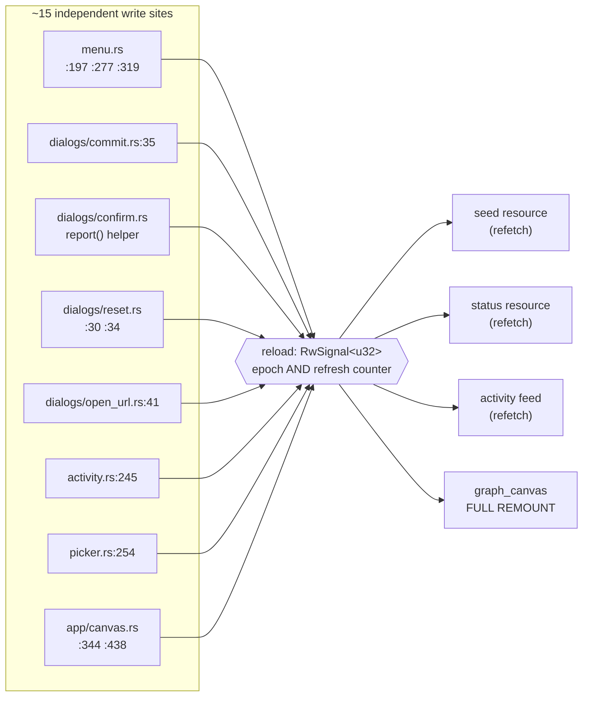
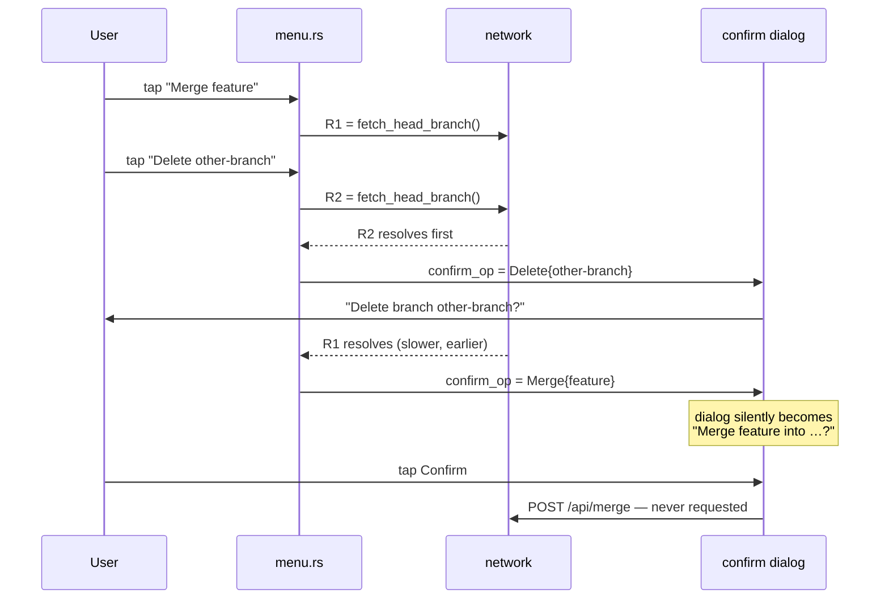
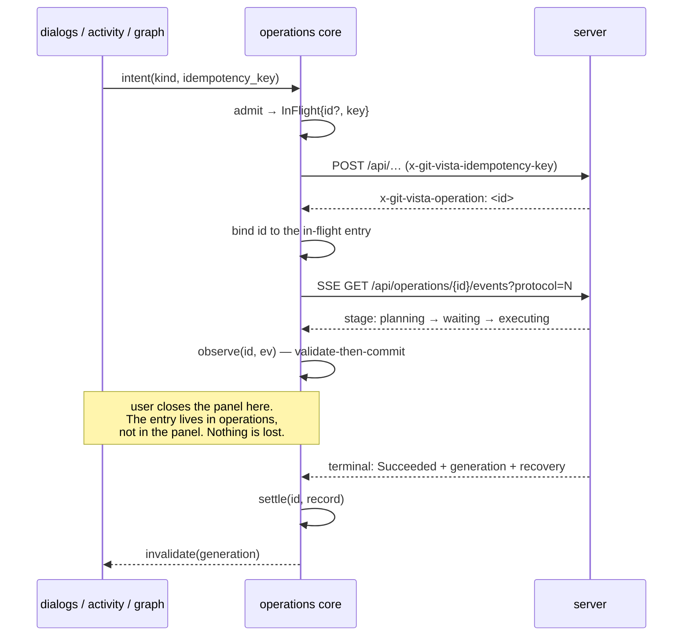

# M1.11 — Frontend state in feature boundaries (design)

- **Status:** Accepted — implementation pending
- **Date:** 2026-07-27
- **Milestone / issue:** M1.11 — Refactor Frontend State into Feature Boundaries (#64)
- **Depends on:** M1.02 (versioned API contract), M1.08 (#61, idempotent operation
  lifecycles — ADR 0020), M1.10 (#63, paged history and bounded reads — ADR 0022)
- **Constrains:** ADR 0012 (the app shell never scrolls)

## Context

The frontend crate is ~10k lines of Leptos 0.6 (`csr` only, wasm32-gated). It went
through one successful decomposition already — the monolithic `app.rs` was split into
`app/mod.rs`, `app/canvas.rs`, `menu.rs`, `dialogs/`, `detail.rs`, `state.rs`. That split
was **by file**, not by ownership: `state.rs`'s own docstring records that the per-overlay
signals "ended up shared across several modules." This design finishes the job by splitting
along *ownership* lines instead.

Five concrete problems motivate it. Each was found by reading the code, not by inspection
of the issue text.

### 1. `reload` is a god-signal

`reload: RwSignal<u32>` (`app/mod.rs:146`) has roughly fifteen write sites spread across
`app/mod.rs`, `app/canvas.rs`, `menu.rs`, `dialogs/{commit,confirm,reset,open_url}.rs`,
`activity.rs`, and `picker.rs`. It carries two unrelated meanings at once: the
**paged-history epoch** that M1.10 uses to fence stale page writes, and a legacy
**"something changed, re-read everything" counter**. There is no dispatcher — every write
site independently decides the whole application is stale.



### 2. A graph remount destroys every overlay

`menu`, `commit_dialog`, `confirm_op`, `detail_id` and `viewer_doc` are created *inside*
`graph_canvas` (`app/canvas.rs:127-146,170-175`). The graph section matches on
`history_ui.phase` and calls `graph_canvas(...)` fresh on every epoch change
(`app/mod.rs:555-654`, `:637-644`), which destroys that scope and everything in it. So
acceptance criterion 2 — *operation state survives panel and route changes* — fails today
by construction, for every overlay that lives in the canvas.

There is no router at all: `leptos_router` is not a dependency, `mount_to_body` runs once
(`main.rs:82`), and every "panel" is a conditional render distinguished by z-index. "Route
changes" in this codebase therefore means **overlay and epoch transitions**, and this design
treats them as such rather than inventing URL routing that M1.12's iPad shell has not asked
for.

### 3. A race that can execute the wrong git operation

Every branch item in `menu.rs` performs a live `fetch_head_branch()` pre-check and then
**unconditionally** writes the shared `confirm_op` signal in its continuation
(`menu.rs:352-363`, `:378-389`, `:422-433`, `:540-548`). Two menu actions in flight
resolve in network order, not click order:



`run_confirmed()` reads `confirm_op.get_untracked()` at click time
(`dialogs/confirm.rs:23-27`), so a tap landing after the swap fires an operation the user
never chose. The 400 ms `DIALOG_GUARD_MS` (`state.rs:138`) narrows the window but does not
close it — it guards against accidental taps, not against the target changing underneath.

A second, cosmetic instance: `picker.rs:47`'s `rescan_msg` is written by both the rescan
(`:184-192`) and delete-clone (`:111-119`) paths with no request identity, so the status
line can describe the wrong operation.

### 4. Generation binding covers reads only

M1.10 minted `GenerationToken` and put it in four places on the wire. Only the read half
reaches the frontend:

| Wire field | Frontend today |
|---|---|
| `HistoryFrame.generation` (`protocol/history.rs:29`) | stored, compared (`history.rs:166`, `app/mod.rs:120`) |
| `HistoryPage.generation` (`protocol/history.rs:53`) | checked on every page (`history.rs:228`) |
| `Plan.generation` (`protocol/plan.rs:348`) | **never used — no Plan is built or submitted** |
| `OperationRecord.generation` (`protocol/operation.rs:169`) | **never read back** |

Every write follows the pre-M1.10 shape: fire the request, then bump `reload` and re-read
everything. Strong Frame/Page ETags are 0 % consumed — `api.rs:333-334` documents that no
`If-None-Match` is ever sent, and reads are cache-busted with `t=<ms>` instead.

### 5. Operation state does not exist

`run_confirmed()` sets `confirm_op` to `None` **before** it spawns the request
(`dialogs/confirm.rs:23-33`). There is no in-flight flag, no progress, no pending list, no
typed result for merge, push, checkout, delete, rebase or undo. Nothing can survive a panel
change because nothing is tracked. Failures surface through a native `window.alert()`
(`dialogs/mod.rs:37-41`), entirely outside the reactive tree.

Meanwhile ADR 0020 already shipped the server half: durable operation identity, the
`x-git-vista-operation` response header, idempotency keys minted per user action, a
reconnectable SSE stream at `GET /api/operations/{id}/events`, and a terminal record
carrying the post-execution generation and a typed `RecoveryStrategy`. ADR 0020 explicitly
deferred the client work to "a frontend whose state refactor is a later issue." This is that
issue.

## Decision

### D1 — The state-core pattern

Every feature area owns a **framework-free state core**: a plain Rust struct with transition
methods, no `leptos` or `web-sys` imports, compiled on the host target and unit-tested by
the existing `cargo test --workspace`. The reactive layer is a thin wasm-only wrapper that
holds the core in a signal and forwards transitions.

This is not a new idea in this codebase — it is exactly what M1.10 already proved with
`LoadedHistory` (`history.rs`), whose docstring records the intent: "deliberately DOM-free
and host-compiled … unit-tested on the host rather than only exercised in a browser."
Seventeen of its host tests already run in the gate.

```rust
// features/<area>/core.rs — host-compiled, no leptos
pub struct OperationsCore { /* … */ }

pub enum Applied { Committed(Effect), RejectedStale, RejectedUnknown }

impl OperationsCore {
    pub fn admit(&mut self, key: IdempotencyKey, op: OperationKind) -> Result<OpId, Rejected>;
    pub fn observe(&mut self, id: OpId, ev: ProgressEvent) -> Applied;
    pub fn settle(&mut self, id: OpId, rec: OperationRecord) -> Applied;
}

// features/<area>/signals.rs — #[cfg(target_arch = "wasm32")] only
pub struct Operations { core: RwSignal<OperationsCore> }
```

**Transitions are validate-then-commit.** A rejected transition leaves the core byte-identical
to what it was, exactly as `LoadedHistory::apply_page` does (`history.rs:222-353`). This is
what makes criterion 4 testable rather than aspirational: a stale apply is an assertion about
a value, not about a rendered DOM.

**Consequence for criterion 5.** "Component tests cover state transitions" is satisfied by
host-target tests over the cores, inside today's five-check gate, with no
`wasm-bindgen-test`, no `.cargo/config.toml` runner, and no headless browser added to CI.
This is a deliberate narrowing and it is recorded as such: these tests prove the state
machine, not that Leptos re-renders from it. The rendering half stays covered by
`trunk build`, the wasm32 clippy pass, and the live-drive evidence the milestone already
requires. The alternative — a browser toolchain on an 8 GB box — was rejected as
disproportionate for the coverage it adds. That trade is revisited if a bug ever escapes the
cores and reaches rendering.

### D2 — Eight feature modules, six built and two declared

```
crates/git-vista/src/features/
  shell/       app chrome, overlay stack, settings, print mode
  session/     repository identity, sign-in, CSRF, LAN flag, UI mode, picker, mode select
  graph/       LoadedHistory, RenderCtx, camera, viewport, epoch
  operations/  in-flight registry, SSE progress, generation reconciliation
  activity/    feed, undoables
  dialogs/     confirm, commit, reset, open-url
  status/      SEAM — module and trait only, no behaviour
  diff/        SEAM — module and trait only, no behaviour
```

Working-tree status and diff views are M2 work (#68, #69) and do not exist. They get a
declared module and the state-core trait, and nothing else. Writing speculative state for
features whose requirements are not yet fixed would be worse than leaving a shaped hole.
`activity.rs:102`'s duplicate status `Resource` — a second, independently-fetched copy of the
same `fetch_status()` data the topbar already holds (`app/mod.rs:256`) — collapses into the
one `status` seam so M2 inherits a single owner.

```mermaid
flowchart TD
    subgraph shell["shell — owns app chrome + overlay stack"]
        OV["OverlayStack<br/>(who is on top, what Esc closes)"]
    end
    subgraph session["session"]
        SS["identity · CSRF · LAN · UI mode<br/>(was 3 thread_locals in api.rs)"]
    end
    subgraph graph["graph"]
        GC["LoadedHistory + RenderCtx<br/>+ camera · GraphEpoch"]
    end
    subgraph ops["operations"]
        OC["in-flight registry keyed by OpId<br/>+ SSE + generation reconcile"]
    end
    subgraph act["activity"]
        AC["feed · undoables"]
    end
    subgraph dlg["dialogs"]
        DC["confirm · commit · reset · open-url"]
    end
    ST["status — SEAM (M2)"]
    DF["diff — SEAM (M2)"]

    dlg -- "intent" --> ops
    act -- "intent" --> ops
    graph -- "intent" --> ops
    ops -- "invalidate(generation)" --> graph
    ops -- "invalidate(generation)" --> act
    ops -. "invalidate" .-> ST
    session -- "repo changed" --> graph
    shell --> OV
```

**The direction of every arrow is a rule.** Features raise *intent* to `operations`;
`operations` publishes *invalidation* back. No feature writes another feature's state
directly. Today ten such writes exist — `activity.rs:377-390` opens the graph's context
menu, `activity.rs:339-346` writes the confirm dialog, `dialogs/open_url.rs:42` drives the
picker's `mode_for`, `picker.rs:171-175` reproduces the open-url dialog's three-write open
sequence verbatim, and so on. Each becomes a call into the owning module's API.

### D3 — Split the god-signal

`reload` decomposes into two things with distinct meanings:

- **`GraphEpoch`** — owned by `graph`, bumped only by events that genuinely invalidate the
  graph's topology (repository switch, 409 drift, explicit user Refresh). It keeps the
  fencing role M1.10 gave it, unchanged.
- **Targeted invalidation** — published by `operations` when an operation settles, carrying
  the terminal record's post-execution `generation`. A feature that holds server state
  compares that generation against its own and re-reads only if it actually moved.

The blanket "bump the counter, re-read everything" write disappears from all fifteen sites.
This is what makes criterion 3 — *server state is distinct from local view state* — mean
something operationally: only server-cache state responds to invalidation; camera, zoom,
scroll, selection and dialog-open flags do not.

Recon classified all 33 current state holders. The classification is the migration's
worklist, and each holder lands in exactly one of:

| Class | Responds to invalidation? | Examples |
|---|---|---|
| `server-cache` | yes, generation-gated | seed, status, activity feed, `RenderCtx` |
| `local-view` | never | camera, viewport, scroll, selection |
| `session` | only on repository change | identity, CSRF, LAN flag, UI mode |
| `ephemeral-ui` | never | dialog-open flags, hover, menu position |
| `derived` | recomputed | history phase, `home`, lane counts |
| `persisted` | never (localStorage) | `nerd_icons`, `show_node_icons` |

### D4 — A real operations store

`operations` holds an in-flight registry keyed by the server's operation id, subscribes to
`GET /api/operations/{id}/events`, and applies the terminal record:



Survival is then **structural, not defensive**: the entry survives a panel change because it
never lived in the panel. That is why this design does not simply lift the canvas-scoped
signals up to `App` — that would satisfy the letter of criterion 2 while leaving no in-flight
state to survive, the SSE stream unused, and `reload` intact.

Reconnection follows for free: an operation id outlives the page, so a resumed session can
re-attach to a stream it did not start. That matters on the iPad-over-SSH-tunnel path this
project is built for, which is the same motivation ADR 0020 recorded.

### D5 — Request identity on every async continuation

Generalize M1.10's `PageRequestKey` (`history.rs:490-508`) into a small
`RequestKey { epoch, generation, target }` used by **every** `spawn_local` continuation that
writes shared state. A continuation checks `is_current()` before it commits, exactly as
`app/canvas.rs:313-322` already does for pages.

This closes both races in §3 by construction rather than by adding a bespoke guard to each
site. Leptos `Resource`s get this for free from their internal version counter
(`leptos_reactive-0.6.15/src/resource.rs:1375-1421`) — but only when the source key actually
changes, which is why the bare `spawn_local` sites in `menu.rs` and `picker.rs` are exposed
and the `Resource`-backed panels are not.

### D6 — The session module absorbs the thread-locals

`api.rs` keeps three module-global `thread_local!`s: `CSRF_TOKEN` (`:41`), `UI_MODE` (`:58`)
and `VIA_LAN` (`:72`). They are read directly — bypassing reactivity entirely — from six
sites in `app/mod.rs` and `picker.rs`, so a flip of `via_lan` re-renders nothing.
`set_ui_mode` is written from two unrelated places (`app/mod.rs:321-329` and
`picker.rs:251`). All three move into `session` as ordinary state, and `api.rs` receives what
it needs as a parameter.

`api.rs` otherwise stays exactly as it is. Its docstring already claims what this design
wants — "pure data plumbing — no UI — so this stays testable on its own away from the view
code" — and that claim is true apart from the three globals.

## Alternatives considered

- **Add `wasm-bindgen-test` plus a headless browser to the gate.** Literal reading of
  "component tests." Rejected for now: a browser and driver to pin in CI, a new
  `.cargo/config.toml` runner, DOM-timing flakiness on a small box, and a second test idiom
  to maintain — for coverage that mostly duplicates what host-target cores already assert.
  Revisit if a defect ever escapes the cores into rendering.
- **Lift the canvas-scoped overlay signals to `App` and stop there.** Much cheaper, and it
  does satisfy criterion 2 read narrowly. Rejected: it leaves no operation state to survive,
  the SSE stream unused, `reload` a god-signal, and both races open. It buys the checkbox,
  not the property.
- **Introduce `leptos_router` and make panels real routes.** Rejected as out of scope and
  premature: M1.12 (#65) owns the adaptive iPad shell and may well want a different
  navigation model. Inventing URL routing now would constrain that issue and risks
  re-litigating ADR 0012's non-scrolling shell.
- **Migrate all eight areas including status and diff.** Rejected: their requirements live in
  M2 (#68, #69). Seams cost nothing and constrain nothing; speculative state would.
- **Split #64 into child issues.** Genuinely tempting for an XL. Not taken, because the plan
  decomposes into independently-gated tasks that each end at a green checkpoint, which gives
  the same resumability without three rounds of branch/PR/merge ceremony. Revisit if the
  first two tasks overrun.

## Consequences

- Criterion 5 is met by host-target tests in the existing gate. No new CI job, no browser.
  The narrowing is explicit and recorded above, not glossed.
- Criterion 4 extends from graph-only to every feature area, and writes gain the generation
  binding `Plan`/`OperationRecord` were designed for in M1.10.
- Criterion 2 is met structurally — operation state is not owned by any panel.
- Two real defects close as a side effect of D5, one of which can currently execute a git
  operation the user did not request.
- `reload`'s fifteen write sites collapse to a small number of typed invalidation publishes.
- Every state holder gains exactly one owning module, so a later reader can answer "who
  writes this?" from the module tree instead of a repo-wide grep.
- **Cost:** this touches nearly every file in the crate. The migration is sequenced so each
  task ends green and checkpointed, and `trunk build` plus wasm32 clippy stay in the gate
  throughout to catch reactive-layer breakage the host tests cannot see.
- ADR 0012's non-scrolling shell invariant is unchanged: `shell` owns the overlay stack, and
  every scroll stays in its own inner overflow container.

## Verification

1. `./dev gate` green — fmt, native clippy, wasm32 clippy, `cargo test --workspace`,
   `trunk build`.
2. Host tests per feature core, covering every transition including the rejection paths.
3. A live drive against a real repository proving: an operation started, its panel closed
   mid-flight, and its terminal result still applied; the two races no longer reproduce; and
   a stale response demonstrably refused rather than absorbed.
4. Per the milestone's definition of done, an ADR recording the feature-boundary and
   state-core decisions, with `docs/SECURITY_MODEL.md` annotated where the session module
   takes over CSRF and LAN-mode state.

**Signed:** thomas2025 · 2026-07-27T00:03:46-04:00
