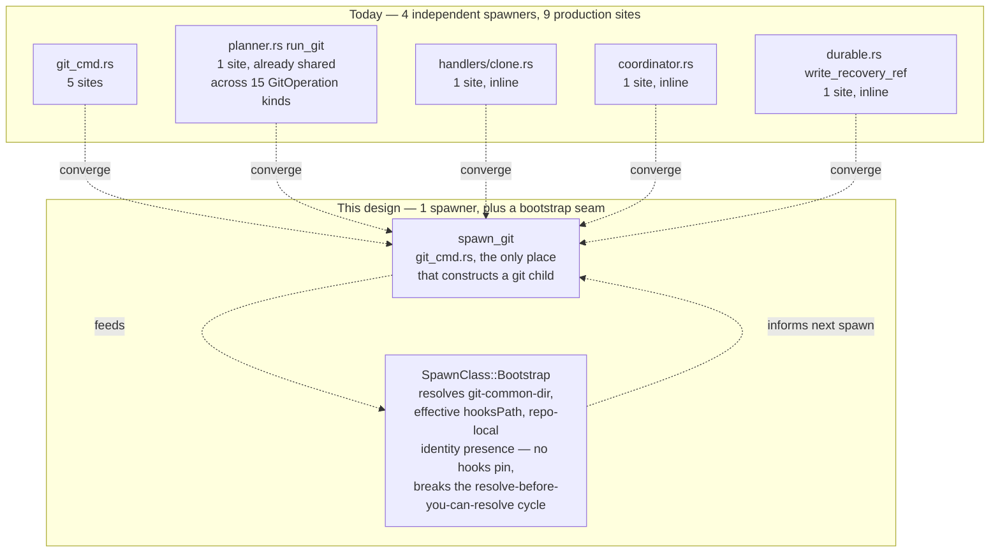
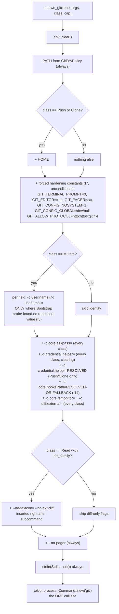
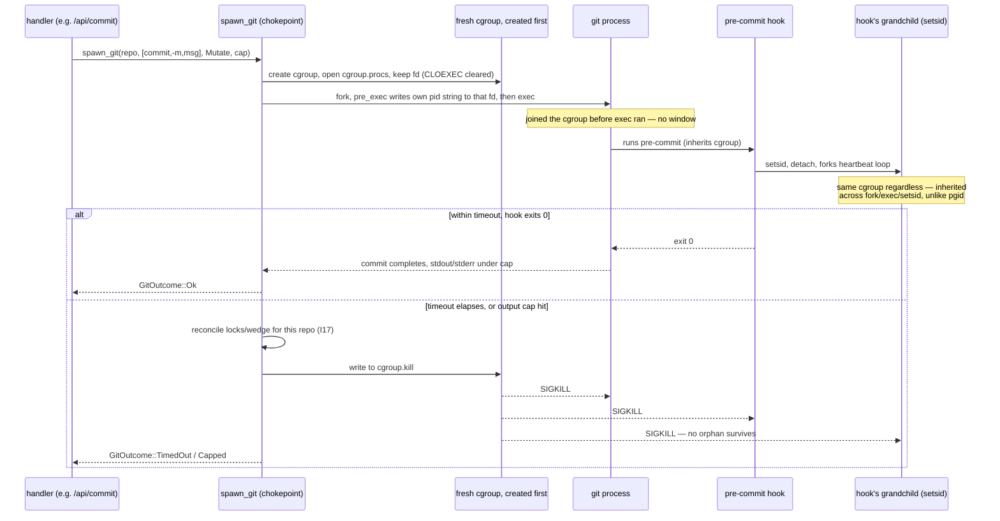
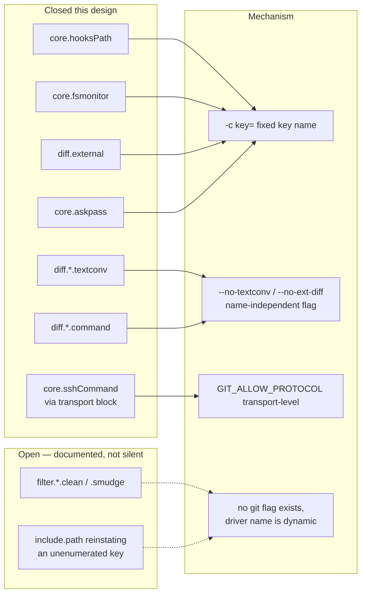
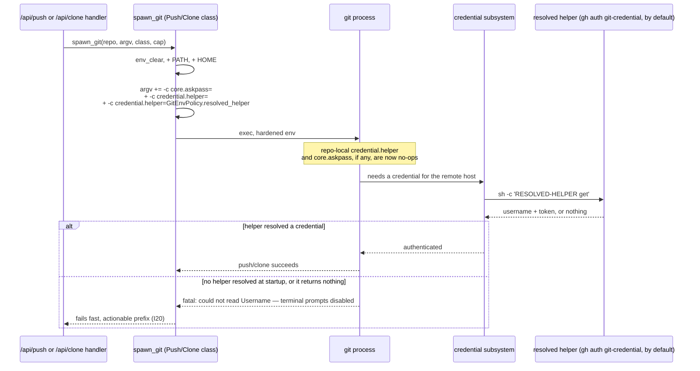
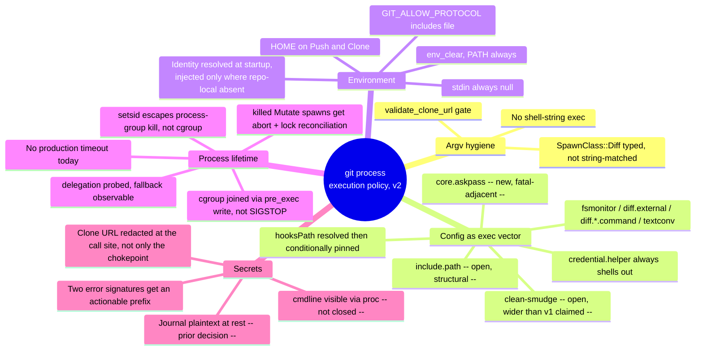

# M1.13 — Centralize git process execution policy (design)

- **Status:** Proposed — design pass only, no production code changed
- **Date:** 2026-07-27 (v1) · revised 2026-07-27 (v2, this revision)
- **Milestone / issue:** M1.13 — Centralize Git Process Execution Policy (#66), Critical, security boundary
- **Depends on:** M1.10 (#63, bounded reads — `git_stdout_capped`, ADR for the output cap)
- **Constrains:** every future `GitOperation` variant and every future handler that shells out to git

This document settles invariants and a test strategy. It changes no file under `crates/`.
Every codebase claim below is cited `file:line`; every git-behaviour claim is either lifted
from `/tmp/…/scratchpad/verified-facts.md` (cited as **[facts]**), independently tested in the
v1 session in a throwaway `mktemp -d` repo (cited **[tested]**), or tested again for this
revision (cited **[tested v2]**) — git 2.43.0 throughout. Nothing here asserts behaviour from
memory.

## Revision history

**v1 failed refutation.** Three independent lenses (attacker, operator, verifier) each returned
`needs-revision`: 6 fatal findings, 13 serious, 6 minor, all empirically tested against real git
and against v1's own text — not argued. Full findings: `m1.13-findings.md`. v1's central failure
mode: it treated "suppress system+global config, pin `core.hooksPath`, hand-enumerate a few
config keys" as sufficient, and stopped testing at the edges of the codebase it already had
citations for. Every fatal finding is a case where the refuting agent pushed one step further —
a second dynamic-name config key, a second SpawnClass that also needed an env var, a mechanism
that deadlocks under the exact API the codebase actually calls — and v1 hadn't gone there.

**What structurally changed in v2:**

1. **Commit identity is resolved once at startup, in an un-hardened environment, and injected
   per-spawn only where repo-local identity is absent** (new invariant, §A.2) — not omitted from
   `Mutate`, and not force-overridden. **[tested v2]** below shows `-c user.name=` unconditionally
   *wins* over repo-local config exactly like every other `-c`, so the naive "always inject"
   reading of the orchestrator's FIX A would have silently broken repo-local identity; the
   correct mechanism probes for repo-local presence first and injects only on absence.
2. **`core.hooksPath` is resolved, canonicalized, and validated before it is pinned** — honoured
   when it resolves inside the repository's own worktree or common dir (husky/lefthook/
   pre-commit keep working), overridden with a surfaced warning only when it resolves outside
   (§A.3, §A.4).
3. **Cancellation joins the cgroup by having the child write its own pid to `cgroup.procs` from
   `pre_exec`, before `exec`** — not by SIGSTOP-then-migrate-then-SIGCONT, which v1 specified and
   which deadlocks `Command::spawn()` itself (§A.5).
4. **`GIT_ALLOW_PROTOCOL` includes `file`** — v1's value silently broke the crate's own
   `contract_suite.rs` push tests, which use local bare repos as remotes (§A.2).
5. **A named, general rule replaces hand-enumeration for dynamic-name config keys**: any key
   whose name is chosen by `.gitattributes` or a driver name (`diff.<n>.command`,
   `diff.<n>.textconv`, `filter.<n>.clean`/`.smudge`) cannot be closed by `-c key=` and needs a
   name-independent flag or is named an open gap; `diff.<n>.command` (a sibling of the textconv
   case v1 already handled) was the concrete miss (§A.3, §A.6).
6. **§B is now an enumerated list of what's still shipped as a knowing regression**, re-derived
   after the above fixes, not a single "it's just SSH push" framing that turned out to be wrong
   on both halves of that sentence.
7. **Several structural gaps get their own invariant** rather than living only in prose:
   `core.askpass`, `include.path`, post-kill lock/wedge reconciliation, a startup probe that the
   config-suppression environment variables are actually being honoured by the git binary
   present, and a cgroup-delegation-availability probe with an observable fallback.

Invariant numbers are **not** preserved from v1 — this is a rewrite of the affected sections, not
a patch note, and re-using v1's numbering while inserting eight new invariants in the middle would
be more confusing than a clean renumber. Findings are cited by content, not by v1 invariant ID.

## Context

### The chokepoint doesn't exist yet — four independent low-level spawners

The issue's premise — "centralize" — presumes one entry point to converge on. Reading the
crate shows there isn't one yet; there are four, each with its own inline
`tokio::process::Command::new("git")`:

| Low-level spawner | Callers today |
|---|---|
| `git_cmd.rs` (`git_stdout_capped`, `rev_parse`, `is_ancestor`, `git_ok`, `git_ref_exists` — `git_cmd.rs:133,238,257,270,292`) | `handlers/read.rs` diff/file/history/frame endpoints, `planner.rs`'s journal helpers, `handlers/reset.rs` |
| `planner.rs`'s own `run_git` (`planner.rs:1023-1030`) | all 15 `GitOperation` executions (`planner.rs:1000-1016`) — this one *is* already a single chokepoint for the planner's own world |
| `handlers/clone.rs:110` (inline) | `/api/clone` only |
| `coordinator.rs:118` (`absolute_git_dir`) | `refuse_if_git_busy` (`coordinator.rs:103-113`) |
| `durable.rs:425` (`write_recovery_ref`) | the detached post-operation recovery-ref pipeline |

Counted directly (`grep -rn 'Command::new("git")' crates`, 48 hits workspace-wide): **9 are
production spawn sites, all in `git-vista-server`, none inside a `#[cfg(test)]` boundary**:
`git_cmd.rs` ×5, `planner.rs` ×1, `handlers/read.rs` ×1 (`read.rs:852`, `worktree_status`),
`handlers/clone.rs` ×1, `coordinator.rs` ×1, `durable.rs` ×1 (`durable.rs:425`,
`write_recovery_ref` — the file's *next* `Command::new("git")`, at `durable.rs:459`, is
`read_recovery_ref`, which **is** `#[cfg(test)]`; easy to conflate the two on a skim, which is
exactly how v1's source material undercounted by one).

The remaining 39 occurrences are test fixtures: `git-vista-server`'s own `#[cfg(test)]` modules
(`git_cmd.rs`, `state.rs`, `coordinator.rs`, `durable.rs`, `history.rs`, `handlers/read.rs`,
`journal.rs`, `catalog.rs`, `planner/{contract,coordination,lifecycle}_suite.rs`) plus
`git-vista-git/src/history.rs`'s test module. That last one matters: **`git-vista-git` spawns
no git process in production at all** — `walk_history`/`read_commit`/etc. (`git-vista-git/src/history.rs:27,212,326,393,484`)
read via `gix`, per the workspace README's own division of labour. Its `Command::new("git")`
calls exist only to build fixture repos for its tests to read. So this design's scope is
exactly `git-vista-server`; `git-vista-git` is already compliant by construction.



### The tension the facts file surfaces

Acceptance criterion 1 says "no shell-string execution is used." At the argv layer that is
already true — every site above is `Command::new("git")` plus discrete `.arg()`s, never
`sh -c`. But **[facts]** proves config itself is a shell-execution vector: a `credential.helper`
value is *always* run through a shell (`sh -c`) by git's own credential subsystem, `!`-prefixed
or not — **[tested]**, `git -c credential.helper=/path/to/script credential fill`, both with and
without a leading `!`, both showed `parent-comm=sh` for the helper process. So "no shell
execution" cannot mean "git never shells out to anything" — it has to mean "git-vista's own
invocation is argv-only, and the set of config keys that can direct git to run something is
either (a) a fixed key name the chokepoint always overrides with `-c key=`, (b) a dynamic key
name the chokepoint closes with a name-independent flag, or (c) a named, tested, still-open gap
— never an unenumerated surface." That third category is v1's core mistake, corrected in §A.3
and §A.6 below: hand-enumeration of fixed keys is the *secondary* mechanism, not the primary one,
precisely because it cannot see a dynamic key by construction.

## A. Invariants

Grouped by the four things the issue asks to settle: the chokepoint, the environment,
config-scope, and hooks/filters/secrets, plus a startup-verification group added in this
revision. Each is either backed by a cited test in §C or explicitly named a documented gap in
§D.

### A.1 — The chokepoint

**I1. Exactly one function in `git-vista-server` may construct a git child process.**
It lives in `git_cmd.rs` — the natural home; it already owns the output-capping policy
(`git_cmd.rs:1-14`) this design extends to env/config/timeout/cancellation.

```rust
// git_cmd.rs — the only permitted constructor of a git child in this crate.
pub(crate) async fn spawn_git(
    repo: &Path,
    args: &[&str],
    class: SpawnClass,   // Bootstrap | Read{diff_family} | Mutate | Push | Clone
    cap: OutputCap,      // reuses git_stdout_capped's byte-cap shape
) -> Result<GitOutcome, GitSpawnError>
```

`SpawnClass` gained two members relative to v1: `Bootstrap` (§A.1 below — the seam that resolves
config *about* a repo without recursing into the pin it's trying to compute) and a `diff_family`
flag carried on `Read` rather than left to string-inspection of `args[0]` (§A.3, closing a
separate finding about unsafe argv surgery).

`planner.rs`'s `run_git` (`planner.rs:1023-1030`), the inline spawns in `clone.rs:110`,
`coordinator.rs:118` and `durable.rs:425`, and `git_cmd.rs`'s own four smaller helpers
(`rev_parse`, `is_ancestor`, `git_ok`, `git_ref_exists`) all become thin callers of `spawn_git`
instead of independent `Command::new("git")` constructions. This is not a new pattern for the
codebase: `planner.rs`'s `run_git` already *is* a one-function chokepoint for the planner's own
15 operations (`planner.rs:1000-1016` all route through it) — this design generalizes that
shape to the whole crate rather than inventing one.

**I2. A new call site that bypasses `spawn_git` is structurally prevented by a
`clippy::disallowed-methods` lint wired into the existing gate — with the backstop mechanism
itself proven to work, not asserted by an unreliable grep.**

Weighed options (unchanged from v1's reasoning, which survived refutation on this point):

| Option | Verdict |
|---|---|
| Module privacy (`tokio::process` unreachable outside `git_cmd.rs`) | **Rejected.** Rust has no mechanism to restrict which *files within one crate* may import an external crate's item. |
| A newtype only the chokepoint can construct | **Rejected alone.** Real value, but on its own it's convention, not prevention. |
| `clippy::disallowed-methods` lint | **Chosen as primary.** `./dev gate` already runs `cargo clippy --workspace --all-targets -- -D warnings` (`dev:50`). Add a `clippy.toml` disallowing `std::process::Command::new` and `tokio::process::Command::new`; `#[allow(clippy::disallowed_methods)]` scoped to exactly the `spawn_git` function and to each `#[cfg(test)] mod tests` block that legitimately needs raw git. |

**v2 change: the backstop is no longer a grep-based test.** v1 proposed
`chokepoint_is_the_only_production_spawner`, asserting `grep -c 'Command::new("git")' … outside
any #[cfg(test)] boundary == 1`. That's not computable by a "cheap" heuristic for this crate:
`#[cfg(test)]` appears as an inner block attribute inside a production fn (`durable.rs:174`,
inside the production `db_path()`), as an item attribute on one fn (`durable.rs:456`, on
`read_recovery_ref`), and as a `mod tests` attribute (`durable.rs:487`) — three different
syntactic shapes in one file — while `planner/coordination_suite.rs`, `planner/lifecycle_suite.rs`
and `planner/contract_suite.rs` carry **zero** `#[cfg(test)]` text at the file level at all (the
gate lives on the `mod` declarations at `planner.rs:1813-1822`), so a file-local grep reports 8
phantom production spawners in those three files alone and is red on a clean tree. A
first-`cfg(test)`-wins heuristic simultaneously *mis*classifies the genuinely-production
`durable.rs:425` as a test. Any heuristic simple enough to be cheap is wrong in both directions
on this exact crate; anything correct is a parser or a hard-coded file allowlist — the fragility
I2 already rejected for the "line-number allowlist" option.

The replacement backstop tests the *mechanism*, not a recomputed count: a `trybuild`/
`compile_fail` fixture crate with the real `clippy.toml` in scope, containing a deliberate
`std::process::Command::new("git")` outside any allowed module, asserted to fail
`cargo clippy -- -D warnings` with the disallowed-methods diagnostic. This proves the lint is
present, wired to the gate, and actually fires — the property the grep was trying to stand in
for — without needing to recompute a fragile file-classification count on every run. See
`clippy_disallowed_methods_lint_is_present_and_effective` in §C.

**I3. Test-module spawn sites are explicitly out of scope of the chokepoint.** All ~39 of them
construct real, throwaway repos under `tempfile::tempdir()` to assert against genuine git
behaviour — they are not reachable from any HTTP request, carry no caller-supplied data, and
several (`git_cmd.rs`'s own suite) exist specifically to test `spawn_git`'s own machinery and
therefore cannot themselves route through it. Each `#[cfg(test)] mod tests` block gets its own
`#![allow(clippy::disallowed_methods)]`.

**I4. `SpawnClass::Bootstrap` breaks the resolve-before-you-can-pin recursion.** Two things this
design needs to know *about* a repo before it can safely build the rest of a spawn's argv —
the absolute git-common-dir (for `core.hooksPath`'s fallback target, §A.3) and whether repo-local
identity is present (§A.2) — themselves require a git spawn to discover. `Bootstrap`-class
spawns skip the `core.hooksPath` pin and the identity injection entirely (they run `rev-parse`
and `config --get`/`--local --get` only, which dispatch no hooks and touch no working tree), so
resolving them doesn't recurse into needing themselves resolved first. The resolved values —
absolute common-dir, hooksPath decision (honour-in-place vs. override-with-warning), and
per-field repo-local-identity presence — are cached per repo path in shared state so a
`Bootstrap` round only happens once per repo per server lifetime (or until the repo's config
changes, out of scope for cache-invalidation detail in this design pass).

### A.2 — The environment allowlist

Tom's rule: `env_clear()`, then explicitly restore only what a **shipped** capability needs, each
justified in writing. **[facts]** (`env -i PATH=$PATH git …`) proves `--version`, `rev-parse
--git-dir`, `status --porcelain`, and `commit` (given identity) all work with nothing but `PATH`
— `GIT_EXEC_PATH` is *not* required.

| Variable | In allowlist? | Justification |
|---|---|---|
| `PATH` | **Yes, always** | Without it `Command::new("git")` can't resolve the binary, and git's own subcommand dispatch needs it too — **[facts]** shows `GIT_EXEC_PATH` itself isn't required, git finds its own subcommands via `PATH` search. |
| `HOME` | **Yes, `Push` and `Clone`** | Both are the shipped capabilities that need it. `exec_push` (`planner.rs:1419-1441`) authenticates over HTTPS via a credential helper whose default value resolves from the *operator's own* config (§A.3) and which needs `gh`'s token store, resolved from `HOME` (`~/.config/gh/hosts.yml` — **[facts]**). `/api/clone` needs exactly the same thing: cloning a private repository is the case `/api/clone` exists for (v1 wrongly denied Clone this and denied it the helper, discussed under regression 1 in §B). `Read`, `Mutate` and `Bootstrap` get no `HOME` — no shipped capability on those classes touches a credential store. |
| `GPG_TTY`, `GNUPGHOME` | **No** | No signing operation ships. A later milestone that ships signed commits adds this with its own written justification (§D's widening procedure). |
| `SSH_AUTH_SOCK` | **No** | The repo's own remote is `https://github.com/tom2025b/git-vista.git` (**[facts]**), and **[facts]** independently shows SSH to GitHub fails here even with an agent running. `validate_clone_url` (`dto.rs:217-237`) accepts only `http(s)://`/`git://` — SSH clone URLs are rejected before they ever reach a spawn. Closed further, structurally, by `GIT_ALLOW_PROTOCOL` below. |
| `GIT_EXEC_PATH` | **No** | **[facts]** directly disproves the need. |
| `LANG`/`LC_ALL`/`USER`/`LOGNAME`/`TMPDIR` | **No** | Commit identity comes from resolved-and-injected `-c user.name`/`user.email` (below), not `$USER`; porcelain output formats are documented locale-stable. Not allowlisted defensively. |

**I5. Commit identity is resolved once at server startup, in the real (un-hardened) process
environment, and injected on `Mutate`-class spawns as `-c user.name=<v> -c user.email=<v>` —
per-field, and only for a field repo-local config does not already define.** This is the
orchestrator's FIX A, with the mechanism its prescribed text left as "verify how `-c` interacts
with repo-local config and design accordingly" — verified here, and it is *not* the naive
reading:

**[tested v2]**, throwaway repo with `git config user.name RepoLocal` / `user.email
repo@local`:

```
$ env -i PATH=/usr/bin:/bin git -c user.name=Injected -c user.email=injected@example.com commit -m test -q
$ git log -1 --format='%an <%ae>'
Injected <injected@example.com>
```

`-c user.name=` **unconditionally wins**, exactly like every other `-c` (consistent with
**[facts]**'s `core.hooksPath` finding that command-line `-c` beats every file scope, repo-local
included — this generalizes, it isn't special to hooksPath). So a design that "resolves identity
at startup and injects it on every Mutate spawn" **would silently override repo-local identity**
on the 57% of his catalog that *does* have repo-local identity set — trading one violation
(commit fails in 43% of repos) for another (wrong author recorded in the other 57%), and neither
is acceptable.

The correct mechanism, per field: before adding the `-c user.name=<startup>` flag, check whether
the repo already defines it locally —

```
$ git config --local --get user.name    # exit 1, nothing printed, when repo has no local entry
```

**[tested v2]** confirms `--local` restricts the read to the repo-local file specifically,
regardless of whether global/system config also defines the key (a fake global config with
`user.name = GlobalUser` present, `--local --get user.name` still exits 1 against a repo with no
repo-local entry). So: `-c user.name=<startup>` is added to a `Mutate` spawn's argv **only when
`git config --local --get user.name` (run once, `Bootstrap`-class, cached per repo) reports
absent**; same independently for `user.email`. When both are present locally, no identity flags
are added at all and repo-local config governs exactly as it does at the CLI today — repo-local
wins **by construction** (by omission of the override), not by a special-cased precedence rule
fighting `-c`'s normal behaviour.

The startup value itself is resolved once, at server start, with the process's *actual*
environment (not `env_clear()`'d): `git config --get user.name` / `--get user.email` (equivalently
`git var GIT_AUTHOR_IDENT`, which is what he actually verified working for the CLI). This makes
a Git-Vista commit in a repo with only global identity **identical by construction** to what his
CLI would have written there — the stronger property than either failing or silently diverging.
If the startup resolution itself finds nothing (no global, no system identity anywhere — a bare
new host), the stored fallback is `None`/`None`, no identity flags are ever added, and a `Mutate`
commit in a repo lacking repo-local identity fails with git's own "Please tell me who you are"
text — exactly parity with what the CLI would do in that same situation, not a regression.

**I6. Every `spawn_git` call starts from `env_clear()` and inherits nothing implicitly; the only
variable present on every spawn is `PATH`, `HOME` is added on `Push`/`Clone`, and the resolved
identity is added on `Mutate` per-field-conditionally per I5.**

### A.3 — Forced constants and the config-scope policy

**I7. A fixed set of hardening variables and flags is forced on every spawn, regardless of
`SpawnClass`** — constants the chokepoint always sets, not "restored" from the allowlist:

| Forced value | Effect | Status today |
|---|---|---|
| `GIT_TERMINAL_PROMPT=0` | No interactive credential/host-key prompt can ever be posed | **Already set, but process-wide and incidental** — `main.rs:124` sets it once in `main()`, so all 9 sites inherit it *today* only because nothing has ever unset or overridden it, not because anything guarantees it. This design makes it a **per-spawn, structural** constant on `spawn_git`'s own argv/env construction instead of a global mutation a future call site could shadow (e.g. by building its own `Command` and inheriting a *different* process-wide state, or by `main.rs` losing the line in a refactor with no test catching it). The distinction matters precisely because "process-wide today" and "guaranteed on every future spawn" are different claims, and only the second is what this design's own tests can pin. |
| `GIT_EDITOR=true` | Any git subcommand that would open `$EDITOR` gets a no-op instead of hanging | Same caveat: already set process-wide at `main.rs:125`, made per-spawn/structural here. |
| `GIT_PAGER=cat`, and `--no-pager` on argv | Belt-and-braces against a pager hang | **[tested-by-survey]**: piped/non-tty stdout already defeats git's pager auto-detection today — currently *incidental* (every site happens to pipe/`.output()`-capture stdout), made explicit here. |
| `GIT_CONFIG_NOSYSTEM=1` **and** `GIT_CONFIG_GLOBAL=/dev/null` | Suppresses system *and* global config — **[facts]** proves `NOSYSTEM` alone does not suppress global, both are required together | New production behaviour. See I11 for the case this fails silently. |
| `GIT_ALLOW_PROTOCOL=http:https:git:file` | git refuses to dial ssh (or any transport not in the list) — **[tested]**: without it, `git fetch` against `ssh://` dials out and fails on DNS/auth; with it, git fails instantly with `fatal: transport 'ssh' not allowed`, before `core.sshCommand` is ever consulted | **New, and `file` is required, not optional** — **[tested]**: `GIT_ALLOW_PROTOCOL=http:https:git` (v1's value, no `file`) makes `git push`/`fetch`/`clone` against a local bare-repo or `file://` remote fail with `fatal: transport 'file' not allowed`. `crates/git-vista-server/src/planner/contract_suite.rs:405-425` (`push_branch_executes_through_the_pipeline`) and its siblings at `:199`, `:417`, `:1012` create a bare repo at a *local path* and push to it through the real pipeline — under v1's value, `./dev gate`'s own test suite goes red with no hint an env var the chokepoint added is responsible. `file` invokes git's own upload-pack/receive-pack over a path, not a configurable external program, so including it costs nothing against the actual goal (blocking `ssh` so `core.sshCommand` is never consulted). |
| `-c core.askpass=` | Clears any repo-local `core.askpass`, unconditionally, on **every** `SpawnClass` | **New — a distinct fatal-adjacent gap v1 missed entirely.** `core.askpass` names a program git runs to obtain credentials and is consulted **before** `GIT_TERMINAL_PROMPT` is checked — **[tested]**: a repo-local `core.askpass` script ran and supplied a username even under `GIT_TERMINAL_PROMPT=0`, defeating the fail-fast contract §B pins for push. `GIT_ASKPASS`/`SSH_ASKPASS` (the *environment*-variable forms of the same mechanism) are already handled — `env_clear()` drops them, stated explicitly here rather than left implicit — but the *config* form needs its own `-c` clear, same as `credential.helper` below, and for the same reason (`include.path`, I12) it must be sent on every class, not only `Push`. |
| `-c credential.helper=` (clearing) on **every** class; `-c credential.helper=<resolved>` (the working helper) added only on `Push`/`Clone` | Defeats a hostile or merely stale repo-local credential helper on every class; supplies a working one only where authentication is actually needed | **Changed from v1**, which sent the reset-then-set pair only on `Push`. §A.4/I12 (`include.path`) is why the *clearing* half must be universal: a repo-local `include.path` can reinstate a helper on a class that never intended to authenticate at all. |
| `.stdin(Stdio::null())` on every spawn | Removes the inherited-stdin hang vector: `tokio::process::Command::output()` inherits the parent's stdin by default (unlike `std::process::Command::output()`), and 8 of the 9 production sites use bare `tokio::process::Command` with no stdin configured today — only `git_stdout_capped` (`git_cmd.rs:137`) nulls it | New — closes a real, currently-open gap found by direct harness comparison. |

**I8. The chokepoint's environment values are threaded through as an explicit, constructible
parameter (`GitEnvPolicy`) — never read from `std::env::var` inside each call.** Production wires
the real process environment once, at server startup (this is also where I5's identity fallback
and the credential-helper default, I13, are resolved), into a `GitEnvPolicy` held in shared
state; a test constructs its own `GitEnvPolicy` with fixture values and passes it directly,
without racing `std::env::set_var` across parallel tests.



**[facts]** established the load-bearing scope fact: `GIT_CONFIG_NOSYSTEM=1` does not touch
global config, `GIT_CONFIG_GLOBAL=/dev/null` does, and command-line `-c` beats every file scope,
including a repo-local redirect. This revision extends and corrects that table:

| Config key | System scope | Global scope | Repo-local scope | Command-line `-c` |
|---|---|---|---|---|
| `core.hooksPath` | suppressed | suppressed | **visible — cannot be suppressed by env** | resolved-then-conditionally-pinned, not blindly overridden — I14 |
| `core.fsmonitor` | suppressed | suppressed | **visible** | `-c core.fsmonitor=` neutralizes it — **[tested]** |
| `diff.external` | suppressed | suppressed | **visible** | `-c diff.external=` neutralizes it — **[tested]** |
| `diff.<name>.textconv` | suppressed | suppressed | **visible**, driver *name* comes from `.gitattributes`, dynamic | `--no-textconv` neutralizes it **regardless of driver name** — **[tested]**; a fixed `-c` can't, the key name is dynamic |
| `diff.<name>.command` | suppressed | suppressed | **visible**, same dynamic-name shape as textconv, but a *separate* mechanism (`diff.external`'s per-driver twin, selected via `diff=<name>` in `.gitattributes`) | `--no-ext-diff` — **[tested]**, real merge-commit fixture, `diff.<n>.command` ran and replaced the patch under `--no-textconv` alone; `--no-ext-diff` neutralizes it and does not affect textconv (different code path) |
| `filter.<name>.clean`/`.smudge` | suppressed | suppressed | **visible**, dynamic name | **no equivalent flag exists** — open, §A.6 |
| `core.sshCommand` | suppressed | suppressed | **visible, but unreachable** | not needed — `GIT_ALLOW_PROTOCOL` refuses the ssh transport before this key is ever consulted — **[tested]** |
| `core.askpass` | suppressed | suppressed | **visible, consulted before `GIT_TERMINAL_PROMPT`** | `-c core.askpass=` neutralizes it — **[tested]**, every class (I7) |
| `credential.helper` | suppressed | suppressed | **visible, and *additive*, not overridden** | `-c credential.helper=` (empty, clears) **then** `-c credential.helper=<ours>` required, in that order, every class for the clear, `Push`/`Clone` for the set — **[tested]**, see §B |
| `include.path`/`includeIf.*` | suppressed (default lookup path only) | suppressed (default lookup path only) | **visible, and defeats the above suppression**: a repo-local `include.path` names an arbitrary file (e.g. the operator's real `~/.gitconfig`, absolute-path-guessable and leaked in git-vista's own clone destinations/errors) and git parses it as config at repo-local precedence, regardless of `GIT_CONFIG_NOSYSTEM`/`GIT_CONFIG_GLOBAL` | **no `-c` disables includes** — open, structural, bounded by the fact that the two specific dangerous keys it could reinstate (`credential.helper`, `core.askpass`) are cleared on every class regardless of *source* scope, so the practically dangerous sub-case is closed even though the general include mechanism is not — see §B, §D |

**Correction from v1:** the "System scope: suppressed / Global scope: suppressed" wording is
replaced above with "suppressed (default lookup path only)" for exactly the two rows where it
matters, because `GIT_CONFIG_GLOBAL=/dev/null` and `GIT_CONFIG_NOSYSTEM=1` suppress the *default
lookup paths* for those scopes — they do not, and cannot, prevent repo-local config from naming
those same files (or any other file) explicitly via `include.path`. v1's I13 argued the clean/
smudge gap was "arguably already closed as a side effect" because `git lfs install` writes to
global config, which `GIT_CONFIG_GLOBAL=/dev/null` suppresses — **that argument is retracted**:
**[tested]** shows a repo-local `include.path` pointed at a stand-in for the operator's real
`~/.gitconfig` reinstates both a `filter.lfs.clean` entry and a `core.askpass` entry from that
"suppressed" file, and both were consulted/invoked. The residual width of the clean/smudge gap is
restated at its true size in §A.6/I18, not narrowed by an untested side-effect claim.

**I9. Repo-local config is visible by design and cannot be suppressed by environment variables —
a `git` design invariant, not a gap in this policy.** What closes each specific dangerous key is
an explicit, enumerated `-c` override or name-independent flag the chokepoint always sends —
never a claim that repo-local config is neutralized in general. Stated plainly for the threat
model: **an operator who adds a repository to git-vista's catalog is trusting that repository's
`.git/config` by definition** — nothing in this design can or should change that. What this
design defends against is a **hostile clone target**, a **repository whose tracked
`.gitattributes` names an already-locally-configured driver**, or a **repository whose
repo-local config tries to reinstate a suppressed scope via `include.path`** — the enumerated
`-c`/flag list above closes every one of those except the one named gap (filter clean/smudge with
a pre-existing globally- or system-configured driver name, now correctly described as open rather
than incidentally closed).

**Standing rule (new in v2), stated once so it governs every future addition to this table:**
**a config key whose name is fixed is closed with `-c key=`; a config key whose name is dynamic
— chosen by `.gitattributes` or a driver-name lookup — cannot be closed that way and needs
either a name-independent flag (`--no-textconv`, `--no-ext-diff`) or must be named an explicit
open gap.** `diff.<n>.command`, `diff.<n>.textconv`, and `filter.<n>.clean`/`.smudge` are the
three known members of the dynamic-name category as of this design; any future git config
surface added to this table must be classified into one of the two buckets explicitly, not
silently assumed fixed-name.

**I10. `core.hooksPath` is resolved and validated, then pinned — not blindly overridden.**
v1 pinned `-c core.hooksPath=<git-common-dir>/hooks` unconditionally. **[tested]** shows this
silently disables husky/lefthook/`pre-commit`-framework setups — all of which set **repo-local**
`core.hooksPath` (`.husky/_`, `.lefthook`, `.githooks`) — a direct violation of Decision 2 ("a
client that silently skips your pre-commit hook is lying to you"), and v1's own test
(`hooks_pinned_path_ignores_repo_local_hookspath_redirect`) asserted that exact broken behaviour
as the contract.

The corrected mechanism, resolved once per repo via a `Bootstrap`-class spawn and cached (I4):

1. Read the repo's **effective** `core.hooksPath` with system and global already suppressed:
   `GIT_CONFIG_NOSYSTEM=1 GIT_CONFIG_GLOBAL=/dev/null git config --get core.hooksPath`. Absent
   `include.path` shenanigans (I9's named residual), this reflects repo-local scope only.
2. Resolve it to an absolute path with `--path-format=absolute --git-common-dir` as the base for
   a relative value — **[tested]**: `git rev-parse --git-common-dir` alone returns a path
   **relative to git's own cwd** (`.git` from the top-level, `../.git` from a subdirectory);
   interpolated verbatim into `-c core.hooksPath=`, a relative value resolves against the
   worktree top-level, so a spawn issued from any non-top cwd — or, concretely, `clone.rs:110-115`
   which passes no `-C` at all — silently points outside the repo and **no hook fires, exit 0**.
   `--path-format=absolute` is required (git ≥2.31; see I19's version floor) and the resolved
   value is always asserted absolute before use.
3. Canonicalize the resolved path and check whether it lies **inside the repository's own
   worktree or common dir**. If it does — the husky/lefthook/pre-commit shape — pin
   `-c core.hooksPath=<that absolute path>` and hooks fire exactly as the operator configured
   them. If it resolves **outside** — the actual hostile-redirect case, or global/system scope
   trying to redirect it (already suppressed, but belt-and-braces) — pin
   `-c core.hooksPath=<absolute-common-dir>/hooks` instead **and surface a warning** in the
   operation's response rather than silently succeeding, per Decision 2's "not lying to the
   user."
4. When no repo-local `core.hooksPath` is set at all, the effective value from step 1 is empty;
   pin the absolute default (`<common-dir>/hooks`) with no warning — this is the ordinary case.

This keeps repo-local hooks working (Decision 2), keeps the permitted source explicit and
testable (a value the chokepoint computed and validated, not an unvalidated pass-through), and
still blocks the actual threat (a redirect resolving outside the repo).

### A.4 — The hook envelope

The envelope is not something hooks opt into; it is unconditional chokepoint behaviour on every
spawn, because the survey found hook-firing varies per operation and even per branch of the same
operation (fast-forward vs. real merge, success vs. abort) — special-casing "hook-bearing"
operations would mean re-deriving and maintaining that table by hand.

**I11. Bounded runtime.** Every spawn carries a timeout, keyed by `SpawnClass`:

| `SpawnClass` | Timeout | Reasoning |
|---|---|---|
| `Bootstrap` (`rev-parse`, `config --get`/`--local --get` only) | 10s | No hooks dispatch, no network; should be near-instant |
| `Read` (status, diff, cat-file, rev-parse, branch listing) | 20s | Local-only, no network |
| `Mutate` (commit, branch, checkout, merge, rebase, revert, reset, stage/unstage, delete, restore) | 30s | Local-only, but may run an arbitrary repo-local hook — the timeout bounds a hanging hook, not the git command |
| `Push` | 120s | Only class that dials a network |
| `Clone` | 300s | Only class where payload size is attacker-influenced (a user-pasted URL) |

Not empirically load-tested this session — Tom's call to adjust.

**I12. Bounded output.** Every spawn reuses `git_stdout_capped`'s existing shape
(`git_cmd.rs:38-95`) — an 8 MiB stdout cap, a 64 KiB stderr cap drained concurrently, kill-on-cap
— extended to cover hook output, since a hook writing to stdout/stderr writes into the same pipes
the parent `git` process already owns.

**I13. Cancellation reaches the whole process tree, via a per-spawn cgroup — joined by the child
writing its own pid into `cgroup.procs` from `pre_exec`, before `exec`.**

**v2 correction — this replaces v1's SIGSTOP-then-migrate-then-SIGCONT mechanism, which
deadlocks.** **[tested]**: `std::process::Command::spawn()` (which `tokio::process::Command`
wraps) opens a CLOEXEC error pipe before forking and **blocks reading it** until the child either
execs (pipe closes → EOF) or writes an errno. `pre_exec` runs in the child **before** `exec`. A
child that raises `SIGSTOP` on itself there never reaches `exec`, so the pipe never closes and
`spawn()` never returns — the parent is wedged *inside* `spawn()`, before there is even a future
for I11's timeout to apply to. Reproduced directly: a harness with `pre_exec(|| { libc::raise(
libc::SIGSTOP); Ok(()) })` then `.spawn()` — `timeout 8 ./harness` → `EXIT=124`, the
"spawn() RETURNED" line never printed. In production this would hang the very first
`/api/commit` forever and leak a stopped process.

**The corrected mechanism**: create the cgroup in the parent **before** calling `spawn()`, open
`<cg>/cgroup.procs` and keep the raw fd across the fork (clear its `CLOEXEC` flag), then in
`pre_exec` perform a single async-signal-safe `write(fd, "0\n", 2)` — writing `"0"` to
`cgroup.procs` adds *the calling process* (the child, at the point it calls this, still
pre-`exec`) to that cgroup. The child then execs immediately: no stop, no cont, no window in
which a fast-forking hook's grandchild could land in the wrong cgroup, and `spawn()` returns
normally because the child reaches `exec` without ever blocking on a signal from the parent.
Cancellation is unchanged from v1's reasoning: write to the cgroup's `cgroup.kill` (kernel ≥5.14,
cgroup v2) — cgroup membership is inherited across `fork`/`exec`/`setsid` alike and cannot be
escaped without `CAP_SYS_ADMIN`, which a hook process won't have. This was chosen over
process-group + `killpg` because a hook that calls `setsid` itself (one line) escapes its
starting process group into a new session the group-kill can never reach — confirmed directly:
a `setsid`'d grandchild survived a `.kill().await` + `.wait().await` on the direct git child, its
heartbeat file still growing a full second later, reparented to init, in its own session distinct
from git's. `PR_SET_PDEATHSIG` was considered and rejected too: a single parent-child binding
that doesn't cascade past one hop, and Linux clears it on `setsid()` for the new session leader
regardless.

`CLONE_INTO_CGROUP` (Linux 5.7+, atomic, no manual `cgroup.procs` write needed) is the more
elegant alternative but requires the raw `clone3` syscall, which neither `std` nor `tokio` expose
directly — worth revisiting at implementation time if a suitable crate exists; the
write-to-`cgroup.procs`-from-`pre_exec` pattern needs nothing beyond what's already available and
is the recommendation here. **[tested]**: cgroup v2 is mounted and `cgroup.kill` files exist under
`/sys/fs/cgroup` on the dev host; write-permission for the server's own UID to create a delegated
subtree needs confirming at implementation time (typically via a systemd unit with
`Delegate=yes`), and I19 below makes the fallback observable rather than silently degraded.



**I14. Hardened environment reaches hooks for free**, because a hook is a child of the
already-hardened `git` process — `env_clear()` plus the fixed allowlist apply to the `git`
invocation itself, and every git subprocess (hooks included) inherits from *that* process. No
separate hardening step for hooks is needed or possible to bypass from inside a hook script,
short of the hook re-execing something with a hand-built environment of its own — a
local-operator-trust question (I9), not a gap in this design.

**I15. Recovery from a killed `Mutate` spawn is a chokepoint responsibility, not left to the
next request to discover a wedged repository.** Two distinct failure shapes, both real:

1. **Orphaned `index.lock`.** git's own atexit handler removes `.git/index.lock` on SIGTERM/
   SIGINT, but `cgroup.kill` sends SIGKILL, which is uncatchable — the lock survives.
   `refuse_if_git_busy` (`coordinator.rs:103-113`) refuses on the mere *existence* of
   `index.lock`, no staleness/age/pid check, and nothing in production ever removes one. **[tested]**:
   a slow `filter.*.clean` (the already-accepted open gap, I18) held `.git/index.lock` during
   `git add -A`; SIGKILLing the whole tree (the exact shape `cgroup.kill` produces) left the lock
   file present after the git process was confirmed gone — `refuse_if_git_busy` then returns
   `409` for **every** subsequent commit/stage/checkout/merge/rebase/push against that repo,
   permanently, from one HTTP request.
2. **Half-applied `Mutate` operations with no abort path.** SIGKILL is not `--abort`. The
   codebase already knows a hung rebase must be recovered, not left dangling —
   `planner.rs:1484-1486`: "a failed rebase … is `--abort`ed so a browser-only user is never left
   mid-rebase with no shell to fix it," honoured by `exec_rebase` (`planner.rs:1525`) on a
   *non-zero exit*. A `cgroup.kill`'d rebase never reaches that branch — the process is simply
   gone. **[tested]**: a rebase SIGKILL'd mid-hook left `.git/rebase-merge` present, HEAD detached,
   **no** `index.lock` (so `refuse_if_git_busy` reports the repo healthy), and a subsequent commit
   on the detached HEAD silently orphaned itself on the next `checkout main`. `GitOperation`
   (`plan.rs:153-219`) has no `AbortRebase`/`AbortMerge`/`AbortRevert` variant to reach for even if
   the UI wanted to offer one.

**Prescribed recovery, both parts required:**

- On any `TimedOut`/`Capped` outcome from a `Mutate`-class spawn, the chokepoint runs a bounded
  recovery spawn appropriate to the operation that was in flight — `rebase --abort`,
  `merge --abort`, `revert --abort` — **before** returning the error to the caller, so a killed
  spawn inherits `exec_rebase`'s existing safety instead of bypassing it. This recovery spawn is
  itself a `Mutate`-class `spawn_git` call (bounded, hardened) — not a raw, unhardened rescue
  command.
- The chokepoint records which lock paths a kill *may* have orphaned for the repo it just killed
  (`<git-dir>/index.lock` at minimum; ref locks and `packed-refs.lock` for ref-touching classes)
  and removes exactly those — scoped to the repo it owns the kill for, never a blanket "delete any
  stale lock," which would race a legitimate external git process working the same repo outside
  git-vista.
- `refuse_if_git_busy` (`coordinator.rs:103-113`) is widened to also refuse on the presence of
  `rebase-merge`, `rebase-apply`, `MERGE_HEAD`, `CHERRY_PICK_HEAD`, `REVERT_HEAD`, with a message
  naming the actual state ("a rebase is in progress") rather than the generic "another git
  process is working" — this is a fix to `coordinator.rs` that this design makes load-bearing,
  so it belongs in scope here even though it isn't itself a spawn-policy change.

**I16. `SpawnClass` for read-side diff commands carries its diff-family flags as a typed
property, not string surgery on caller-supplied argv.** `--no-textconv` is diff-family-only and
is a hard error on other subcommands — **[tested]**: `git status --no-textconv` →
`error: unknown option 'no-textconv'`; `git log --no-textconv` and `git diff --no-textconv` are
fine. `--no-pager`, by contrast, is a genuine top-level flag, safe everywhere. A chokepoint that
appended `--no-textconv` unconditionally would 500 every non-diff spawn (`rev_parse`,
`is_ancestor`, `git_ref_exists`, `worktree_status` at `read.rs:852`); one that appends it based on
parsing `args[0]` at the chokepoint is argv surgery on caller-supplied vectors — the exact class
of thing this milestone exists to make safe, and the kind of thing that is easy to get positionally
wrong (splicing after the subcommand but before a `--` pathspec separator).

The fix: `SpawnClass::Read` carries a `diff_family: bool` set by the **caller**, who already
knows which subcommand it's building (`handlers/read.rs`'s diff/history endpoints pass `true`;
everything else passes `false`, defaulted). `spawn_git` `debug_assert!`s that `diff_family: true`
is only ever paired with `args[0]` in a fixed, enumerated set (`{diff, log, show, format-patch,
blame}`) and inserts `--no-textconv --no-ext-diff` at a fixed position — index 1, immediately
after the subcommand, before any pathspec — only for that class. This makes the flag set a
property the type system carries, not a runtime string match the chokepoint has to keep in sync
with every future caller.

### A.5 — Cgroup delegation is a host property, and the fallback is observable, not silent

**I17. A `cgroup_delegation_is_available()` probe runs once at startup and its result is logged
and asserted by CI, not discovered by a flaky test.** **[tested]**: on the dev host, the current
cgroup is delegated (`/user.slice/.../tmux-spawn-*.scope`, owned `tom:tom`, `mkdir` inside it
succeeds, `cgroup.kill` genuinely reached a `setsid`'d grandchild). But `/sys/fs/cgroup` and
`/sys/fs/cgroup/system.slice` are both `root`-owned `dr-xr-xr-x`/`drwxr-xr-x` — a process running
in a non-delegated cgroup gets `EACCES` on `mkdir` there and the weaker process-group fallback is
taken silently. Since this is a host property, not a code property, a single cancellation test
that assumes delegation will fail on a host without it while the code is behaving exactly as
designed — the design does not get to assume CI runs in a delegated cgroup.

Fix: probe for delegation at startup (attempt to create and immediately remove a throwaway
subtree), log the result, and expose it so tests choose the right assertion rather than guessing.
Two paired tests replace the single one v1 proposed (§C): one asserts full tree-reaping under
delegation, the other asserts the fallback is *reported* (a degraded-mode flag surfaced, not
hidden) and that the direct child is still reaped even without delegation. CI's job for this
crate should assert which path it actually exercised, so a silent downgrade to the weaker policy
is loud rather than green.

### A.6 — The non-hook execution surface: what closes and what doesn't

Filters, `fsmonitor`, `textconv`, `diff.external`/`diff.<n>.command` are not a hooks question at
all — none are `githooks(5)` entries — so a hooks-only design leaves them all open.

| Mechanism | Closed? | How |
|---|---|---|
| `core.hooksPath` redirect | **Closed, correctly** | resolve-then-conditionally-pin — I10 |
| `core.fsmonitor` (fires on `status`, `add -A`) | **Closed** | `-c core.fsmonitor=` on every spawn — **[tested]** |
| `diff.external` | **Closed** | `-c diff.external=` on every diff-family spawn — **[tested]** |
| `diff.<name>.textconv` | **Closed** | `--no-textconv`, name-independent — **[tested]** |
| `diff.<name>.command` | **Closed** | `--no-ext-diff`, name-independent — **[tested v2]**, the gap this revision adds; same class as textconv, missed in v1's own generalization of its own rule |
| `core.sshCommand` | **Closed, structurally** | `GIT_ALLOW_PROTOCOL` refuses the ssh transport before this key is consulted |
| `core.askpass` | **Closed** | `-c core.askpass=`, every class — **[tested]**, the fatal gap v1 missed entirely |
| `filter.<name>.clean`/`.smudge` | **Open — documented gap, not silently accepted** | No git flag disables attribute-driven filters generically; dynamic driver name |

**I18. The clean/smudge gap is explicitly named at its true width.** The filter *program* can
never come from a tracked file — git's own security design — so a bare clone of an untrusted
repository cannot *inject* a new filter program via `.gitattributes` alone; the residual risk is
live only when the operator's own environment already has a filter name pre-configured (git-lfs
being the concrete example, `git lfs install` writes `filter.lfs.*` to global config). **v1's
claim that `GIT_CONFIG_GLOBAL=/dev/null` "arguably already closes this as a side effect" is
retracted** — **[tested]** shows a repo-local `include.path` pointed at that same "suppressed"
global file reinstates the `filter.lfs.clean` entry from it, and `git add` with a matching
`.gitattributes` invoked it. The gap is therefore live whenever **either** (a) the deploy host has
git-lfs (or similar) configured system- or globally, **or** (b) an operator-added repository's own
`.git/config` sets `include.path` at a file that defines such a filter — (b) is reachable purely
through repo-local config, which is the operator's own trust boundary (I9), so it is named as an
open gap rather than treated as a contradiction of "operator config is trusted."



### A.7 — Secrets are redacted

**I19. "Redacted" means every sink that can carry attacker- or operator-supplied text passes
through one redaction function before it reaches a log line, a stored row, or an HTTP response —
with the redaction applied at the sink that actually sees the raw text, which is not always the
chokepoint.**

| Sink | Redaction applied |
|---|---|
| `clone.rs:109` (`println!` of the raw clone URL) | **Applied at the call site, not the chokepoint.** This line executes *before* `spawn_git` is ever called — a chokepoint-side wrapper structurally cannot see it. `redact_url(...)` is a small function both `clone.rs` and `spawn_git`'s own logging can import; the handler wraps its own `println!` argument directly. |
| `clone.rs:129-139` (failed clone: git's stderr to `eprintln!` and the HTTP response body) | Same `redact_url` applied to git's stderr text before either sink — git's own error text can echo the URL it was given, so the strip runs on the *output* too, not just the input. |
| `planner.rs`'s `run_branch_cmd` (`planner.rs:1320-1341`, used by `exec_push`) — failed push's stderr | Same strip, identical sink shape. |
| `git_cmd.rs`'s `git_error` (`git_cmd.rs:109-118`) | Applied unconditionally at this one function — cheap insurance for a future caller that touches a remote/credential-bearing command. |
| `durable.rs`'s operations journal (`durable.rs:41-43`) | **Not redacted at rest** — a prior, already-documented plaintext-at-rest design choice this design doesn't reopen; `redact_operation` (`durable.rs:480-485`) strips fields only from log lines. |
| `clone.rs:114` (`.arg(&url)`, visible via `/proc/<pid>/cmdline`) | **Not closed by this design** — a process-isolation question, not a redaction one; named for completeness. |

Concretely: `redact_url(s: &str) -> String` finds `scheme://` and, if the authority segment up to
the next `/` contains an `@`, replaces everything before it with `***`. Named test in §C.

**I20. The user-facing error text for the two failure signatures this design newly makes
reachable gets one prepended, actionable line — git's own text stays, verbatim, below it.**
`stderr_stdout_or` (`planner.rs:1055-1066`) forwards git's raw stderr today; that's honest about
*why* git failed, not about what an iPad-only operator with no shell should do next. Two known
signatures get a one-line prefix at the chokepoint's error-formatting boundary:

- `could not read Username for` → prefix "Git-Vista couldn't authenticate to github.com — run
  `gh auth login` on the host, then retry."
- `Author identity unknown` / `unable to auto-detect email address` → prefix "Git-Vista couldn't
  determine a commit identity for this repository — set `user.name`/`user.email` on the host
  (globally, or `git config` inside the repo), then retry." (This should now be rare given I5's
  startup fallback, but remains reachable on a genuinely identity-less host.)

Not a rewrite of the B3 verbatim-forwarding posture — a prefix, tested by asserting it appears in
the HTTP body for the relevant §C fixture.

### A.8 — Startup verification: the suppression environment must be proven, not assumed

**I21. The server refuses to start (or logs loudly and marks itself degraded) unless a startup
probe confirms `GIT_CONFIG_NOSYSTEM`/`GIT_CONFIG_GLOBAL` are actually suppressing config on the
git binary present on `PATH`.** `GIT_CONFIG_GLOBAL` is a comparatively recent variable; a git
that doesn't recognise it treats it as a no-op rather than an error, and the same is true of a
typo in the variable name. **[tested]**: `GIT_CONFIG_GLOBAL_TYPO=/dev/null git status --porcelain`
→ `rc=0`, no diagnostic; `GIT_CONFIG_GLOBAL=/nope/nothere git status --porcelain` → `rc=0`, no
diagnostic. Neither a too-old git nor a typo produces any signal — the entire A.3 config-scope
table would be silently void, and most of §C's hook tests would stay green regardless (they
assert the *hostile* marker is absent, which a pin that fires nothing on a broken-suppression host
still satisfies).

The probe: at startup, plant a sentinel key in a temp file, point `GIT_CONFIG_GLOBAL` at it,
confirm `git config --get <sentinel-key>` (with the real allowlisted env, `GIT_CONFIG_GLOBAL`
pointed elsewhere) does **not** see it. Pair with an explicit minimum-git-version constant checked
at the same time (this design's `--path-format=absolute` dependency alone needs git ≥2.31),
logged/refused the same way. Named test: `global_config_suppression_is_actually_effective_on_this_git`.

## B. Regressions this knowingly ships

**Re-derived after the fixes above** — not the single "it's just SSH push" framing v1 used, which
was wrong in both directions (the real regression wasn't SSH, and there turned out to be more
than one).

1. **HTTPS push/clone losing the credential helper, absent re-injection.** Still the sharpest
   named regression. `GIT_CONFIG_GLOBAL=/dev/null` suppresses the global `credential.https://
   github.com.helper` entry along with everything else in that scope. **Mitigated, not
   eliminated**, by the narrowest controlled re-injection below — extended in this revision to
   cover `Clone` as well as `Push` (v1 denied Clone both `HOME` and the helper, which meant the
   *only* way to authenticate a private clone was to embed `user:token@host` in the URL — putting
   a PAT on argv, visible via `/proc/<pid>/cmdline`, precisely the sink §A.7 names as not closed).
   **[tested]**: `git ls-remote` against `tom2025b/teacher-thing` (private) fails
   with `terminal prompts disabled` under the hardened env with no helper; succeeds today at the
   CLI via the global helper.
2. **Commit identity for repos with only global/system identity.** **Closed** by I5's
   startup-resolved, per-field-conditional injection — this was v1's other fatal finding
   (43% of his 21-repo catalog lacks repo-local identity) and is no longer a regression. Residual:
   a host with *no* identity configured anywhere still fails, matching CLI parity, not a
   regression.
3. **Local file-transport remotes (bare mirrors, `file://` siblings).** **Closed** by including
   `file` in `GIT_ALLOW_PROTOCOL` — was on track to be a second, undisclosed regression (and would
   have turned the crate's own `contract_suite.rs` push tests red); now explicit and tested
   (`push_to_a_local_path_remote_succeeds_through_spawn_git` in §C).
4. **`core.excludesFile` (global gitignore) is suppressed.** `worktree_status` (`read.rs:852`)
   will report as untracked any file the operator's *global* `.gitignore_global` hides but the
   repo's own tracked `.gitignore` does not. **[tested]**: a file hidden by a global excludesFile
   showed as `?? notes.txt` under the hardened env, invisible under the operator's normal
   environment. **Decision, stated deliberately rather than left incidental: accepted.** The
   repo's own `.gitignore` is the sole authority under git-vista — arguably more correct for a
   multi-repo, multi-operator-config catalog server than depending on whichever host happens to be
   running the server's global config. Pinned by test so the behaviour is chosen, not accidental.
5. **`filter.*.clean`/`.smudge`.** Open, §A.6/I18, at its corrected (wider than v1 claimed) scope.
6. **`include.path` generally.** Open, structural — no `-c` disables includes — bounded to the
   two specific dangerous keys (`credential.helper`, `core.askpass`) that are now cleared
   regardless of which scope/source supplied them, per I7/I9.
7. **Cgroup delegation unavailable on some hosts.** Falls back to process-group `killpg`, which a
   `setsid`-calling hook (or grandchild) can still escape — now *reported* (I17), not silent.
8. **Error text for two known failure signatures gets one actionable prefix (I20); everything
   else git says is still forwarded verbatim**, unactionable-from-an-iPad or not — a UX gap, not
   a security one, and out of scope to fully solve here.

### The narrowest controlled re-injection

**Recommendation, not a menu:** on `Push` and `Clone`, re-inject `HOME` (A.2), and add, in this
exact order:

```
-c credential.helper= -c credential.helper=<resolved-at-startup>
```

The **first** flag (empty value) is not optional: `credential.helper` is **multi-valued** —
every configured occurrence across every visible scope is tried in order, and a later
`-c credential.helper=<x>` does **not** replace an earlier one, it *adds*. **[tested]**: a
repo-local `credential.helper` pointed at a hostile script plus a bare `-c credential.helper=ours`
appended (no clear) ran **both**, hostile first. Only `-c credential.helper= -c
credential.helper=ours` clears the accumulated list first.

**Changed from v1: the helper value is resolved once at server startup into `GitEnvPolicy`, not
hard-coded as a source literal.** v1's own two-lens contradiction is why: §B's security argument
("a fixed, server-authored literal, chosen once at chokepoint-authoring time … no interpolation
for anything to inject into") is incompatible with §C's own test list, which needs the helper to
be a marker script the test controls
(`credential_helper_reset_defeats_a_preexisting_repo_local_helper`) — a hard-coded literal cannot
be substituted by a test. Making it a startup-resolved `GitEnvPolicy` field resolves both:
production populates it from `git config --get-urlmatch credential.helper <origin-url>` (real
environment, at startup — respecting the operator's actual per-host scoping,
`credential.https://github.com.helper` in his case, rather than an unscoped literal that could
leak a GitHub token toward an unrelated host), tests populate it from a fixture script path, and
the security property the design actually needs — *the string is server-authored at startup and
never composed from request or repo data* — survives intact and is directly testable
(`push_helper_value_is_never_derived_from_request_or_repo_data`, §C). If resolution finds nothing,
startup logs a clear warning ("no credential helper resolved; push/clone against authenticated
remotes will fail") rather than shipping a silently broken literal path (v1's hard-coded
`/usr/bin/gh` would break on any host where `gh` lives elsewhere).



## C. Test strategy

Two fixture families. Every named invariant has a test below; an invariant with no test is not
settled. No assertion compares elapsed time against a tight bound — every timing-shaped test uses
a short, explicitly injected timeout against a generous, order-of-magnitude-larger outer bound.

### Fake-git-on-PATH — what a fake binary can and can't prove

Exercises properties of *any child process the chokepoint spawns* — not git's own config/hook/
attribute machinery, which a fake binary doesn't implement.

**Parallelism (I8):** tests do not call `std::env::set_var`; each builds its own `GitEnvPolicy`
and passes it directly into `spawn_git`'s test seam.

| Test | Fixture | Invariant pinned |
|---|---|---|
| `spawn_git_kills_a_hanging_child_within_its_injected_budget` | `fake-git-hangs`: `sleep 999999`, never exits | I11 |
| `spawn_git_caps_output_from_any_binary_named_git` | `fake-git-chatty`: writes past the cap, ignoring SIGTERM | I12 |
| `spawn_git_direct_child_env_is_exactly_the_allowlist` | `fake-git-dumps-env`: dumps its own `env` to stdout | I6/I7 — the **direct** child, byte-exact `assert_eq!` against the expected set; this is the test that actually catches a wholesale-inherit regression |
| `spawn_git_child_is_in_its_own_cgroup_before_exec` | `fake-git-reports-cgroup`: reads and prints its own `/proc/self/cgroup` immediately on start | I13 — asserts the isolated cgroup path, proving no window exists between spawn and migration |
| `spawn_git_cancellation_reaps_a_self_detaching_grandchild` | `fake-git-spawns-grandchild`: `setsid`s a heartbeat loop, then sleeps | I13 (under delegation — paired with the fallback test below, I17) |
| `spawn_git_never_supplies_a_tty_or_open_stdin_to_a_prompting_child` | `fake-git-prompts`: writes a prompt to stdout, blocks reading stdin | I7 (stdin), I11 — asserts immediate EOF on stdin |
| `clippy_disallowed_methods_lint_is_present_and_effective` | `trybuild`/`compile_fail` fixture with a deliberate `Command::new("git")` outside `spawn_git` | I2 — replaces v1's infeasible grep-count test; proves the enforcement mechanism itself fires |

### Real-git fixtures — what genuinely needs the real binary

| Test | Fixture | Invariant pinned |
|---|---|---|
| `repo_local_hookspath_inside_the_worktree_is_honoured` | Husky shape: repo-local `core.hooksPath = .husky/_`, a real hook there | I10 — the **positive** case v1's tests never asserted |
| `hookspath_pointing_outside_the_repo_is_overridden_and_reported` | Repo-local `core.hooksPath` pointed at `/tmp/hostile` | I10 — asserts override to the pinned default **and** a surfaced warning |
| `pinned_hooks_path_actually_fires_the_repos_own_hook_from_a_subdirectory` | Normal `.git/hooks/pre-commit`, spawn issued with a cwd/`-C` under a subdirectory | I10 — catches the relative-path silent-no-op bug specifically |
| `git_dispatched_child_env_carries_no_inherited_host_variables` | A real `pre-commit` hook dumping `env`, asserted as a **denylist** (`SSH_AUTH_SOCK`, `GPG_TTY`, `GNUPGHOME`, `GITHUB_TOKEN`, no arbitrary host var), tolerating git's own `GIT_*` injections and `PATH` prefix | I6/I7 — the honest complement to the fake-git exact-match test, since real git injects `GIT_AUTHOR_*`, `GIT_INDEX_FILE`, etc. into every hook and rewrites `GIT_EDITOR`/`PATH` itself |
| `hook_process_tree_is_fully_reaped_on_cancellation` | Real `pre-commit` that `setsid`s a heartbeat grandchild, then sleeps past budget | I13, real-hook shape (kept alongside the fake-git version — genuinely different code paths) |
| `hook_runtime_is_bounded_by_the_shared_envelope` | Real `pre-commit` sleeping 10s, `Mutate` budget injected as 200ms | I11 over a real hook |
| `hook_output_is_capped_like_any_other_child_output` | Real hook writing tens of MB to stdout | I12 over a real hook |
| `a_killed_mutate_spawn_recovers_its_repository_state` | Rebase started under a short injected budget, a hook sleeping past it, killed via `cgroup.kill` | I15 — asserts the repo is back on its original branch, no `rebase-merge` dir, no orphaned `index.lock`, and a following `/api/stage`-shaped call is **not** refused with 409 |
| `core_fsmonitor_is_neutralized_on_status_and_stage_all` | Repo-local `core.fsmonitor` marker script, `Read` and `Mutate` classes | I7 (A.3 table) |
| `diff_external_is_neutralized` | Repo-local `diff.external` marker script | I7 |
| `textconv_is_neutralized_regardless_of_driver_name` | Repo-local `.gitattributes` + `diff.<random-name>.textconv`, random per run | I16 |
| `external_diff_driver_is_neutralized_regardless_of_driver_name` | Repo-local `.gitattributes` (`* diff=<random-name>`) + `diff.<random-name>.command`, asserted against a **merge commit** (`against_first_parent` branch of `diff_argv`, `read.rs:597-614`, reachable via `GET /api/diff/{oid}`) so it exercises the actual `git diff A B` code path, not the non-merge `show` form which would pass vacuously | I16/A.6's new row — the concrete miss v1 shipped |
| `repo_local_askpass_is_never_executed` | Repo-local `core.askpass` marker script, remote requiring auth | I7 — asserts the marker is absent and the failure text is exactly the terminal-prompts-disabled message |
| `repo_local_include_path_cannot_reinstate_a_credential_helper` | Repo-local `include.path` pointed at a file defining a hostile `credential.helper` | I9/A.3's `include.path` row — asserts it never runs on a `Read`-class spawn |
| `commit_succeeds_in_a_repo_whose_identity_is_global_only` | No repo-local identity, `GitEnvPolicy` startup-resolved from a fixture "global" identity | I5 — the fatal finding's positive case |
| `repo_local_identity_wins_over_the_injected_startup_value` | Repo-local `user.name`/`user.email` set, `GitEnvPolicy` carries a *different* startup value | I5 — the correction v1's naive reading would have broken |
| `push_to_a_local_path_remote_succeeds_through_spawn_git` | Real bare repo at a local filesystem path, pushed via `spawn_git`'s `Push` class | I7 (`GIT_ALLOW_PROTOCOL` includes `file`) — regression guard so the collateral can't silently return |
| `ssh_transport_is_refused_before_any_transport_command_runs` | `origin` set to `ssh://git@example.invalid/x.git` | I7 — asserts `transport 'ssh' not allowed` and near-instant failure |
| `credential_helper_reset_defeats_a_preexisting_repo_local_helper` | Repo-local `credential.helper` hostile marker script, `Push`-class spawn | §B — hostile script's marker never written, only the injected one's is |
| `push_helper_value_is_never_derived_from_request_or_repo_data` | `GitEnvPolicy` populated only from startup resolution; assert no request- or repo-supplied string ever reaches the helper field | §B — the property v1's "fixed literal" language claimed without a mechanism that could prove it |
| `push_without_reinjection_fails_fast_never_hangs` | Loopback HTTP fixture (`127.0.0.1:0`), `401` + `WWW-Authenticate: Basic` for the ref advertisement | §B — deterministic, offline |
| `push_with_reinjection_authenticates_against_the_fixture` | Same loopback server, Basic-auth-gated, fixed test credential from the resolved helper | §B — positive case |
| `clone_with_reinjection_authenticates_against_a_private_fixture` | Same shape as push, `Clone` class | §B — the Clone extension v1 didn't have |
| `cancellation_reaps_grandchild_under_cgroup_policy` | Real hook, `setsid` grandchild, run only when `cgroup_delegation_is_available()` probes true | I17 |
| `cancellation_fallback_is_reported_when_delegation_is_unavailable` | Same fixture, forced-unavailable path (e.g. a non-delegated cgroup mount namespace in CI) | I17 — asserts degraded mode is surfaced and the direct child is still reaped |
| `global_config_suppression_is_actually_effective_on_this_git` | Sentinel key in a fake `GIT_CONFIG_GLOBAL` target, probed at simulated startup | I21 |
| `worktree_status_ignore_semantics_are_repo_local_only` | Fixture "global" excludesFile hiding a file the repo's own `.gitignore` does not | §B regression 4 — pins the deliberate decision |
| `redact_url_strips_userinfo_from_log_and_response_sinks` | Clone attempt against `https://faketoken123@example.invalid/x.git`, asserted against the **actual clone-path stdout/log capture**, not just the chokepoint's own tracing output | I19 — must cover `clone.rs:109`'s call-site print, the sink v1's test would have passed vacuously on |
| `error_prefix_is_prepended_for_known_auth_and_identity_failures` | Loopback-401 push fixture (auth) and identity-less repo (identity) | I20 |

## D. What this deliberately does not do

- **Does not sandbox git itself.** A hostile repo an operator explicitly adds to the catalog is
  trusted input, by definition (I9) — that boundary is unchanged and out of scope.
- **Does not close the `filter.*.clean`/`.smudge` surface** (§A.6, I18), at its corrected,
  wider-than-v1 scope (system/global *or* a repo-local `include.path`).
- **Does not close the general `include.path` mechanism** — no `-c` disables includes; the two
  concretely dangerous keys it could reinstate are closed independently (I7/I9), the mechanism
  itself is not.
- **Does not verify cgroup delegation on the actual deploy target** — confirmed available on the
  dev host only (I13); the fallback is named and now observable rather than silent (I17).
- **Does not add GPG/SSH-agent allowlist entries** — no shipped capability needs them (A.2).
- **Does not change `durable.rs`'s existing plaintext-at-rest journal design** (A.7) — a prior,
  already-documented trade-off this design doesn't reopen.
- **Does not address the `/proc/<pid>/cmdline` local-observability sink** for a credentialed
  clone URL (A.7) — a process-isolation question, not a process-*execution-policy* question.
- **Does not pick exact timeout values with load-test evidence** (A.4) — proposed starting
  defaults for Tom to adjust, not measured minimums.
- **Does not fully solve unactionable git error text** — two known signatures get a prefix
  (I20); everything else is still forwarded verbatim, per the codebase's existing posture.

### Safe procedure for a later milestone to widen the allowlist

Unchanged from v1, carried forward:

1. Name the exact **shipped** capability that needs the new variable.
2. Cite the code path (`file:line`) that will call it, the same way every entry in A.2's table
   does today.
3. Write the justification into an ADR amendment before merging — the same bar as any other
   security-boundary change.
4. Add a test scoped to the *specific* `SpawnClass` that needs it, asserting presence there and
   **absence** on every other — the shape `spawn_git_direct_child_env_is_exactly_the_allowlist`
   already establishes.
5. Never widen defensively. If the capability turns out not to need the variable, that's a reason
   to stop, not a reason to keep it "just in case."



## Verification (once implemented, out of scope for this design pass)

1. `./dev gate` green with the new `clippy.toml` disallowed-methods entry in place.
2. Every test named in §C passing, including the loopback-HTTP-fixture push/clone tests, with no
   dependency on live network reachability, and including the cgroup-delegation-paired tests
   passing on whichever side of the probe the CI host actually falls on.
3. A live drive (per the project's definition-of-done for anything touching
   `docs/SECURITY_MODEL.md`) proving: a real push and a real clone against the operator's actual
   GitHub remotes still succeed under the hardened policy; a real husky-shaped repo-local hook
   still fires and still bounds correctly; a real repo with only global identity still commits
   with the right author; `worktree_status` still answers under load with `core.fsmonitor`
   neutralized.
4. An ADR recording this design's decisions (env allowlist, identity resolution, config-scope
   policy, cgroup-based cancellation via the `pre_exec`-write join, the credential-helper
   reset-then-set finding, the `core.hooksPath` resolve-then-pin rule), and
   `docs/SECURITY_MODEL.md` annotated at the process-execution section once implemented.

**Signed:** thomas2025 · 2026-07-27T20:45:00-04:00
