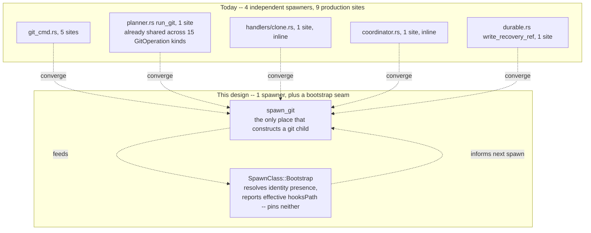
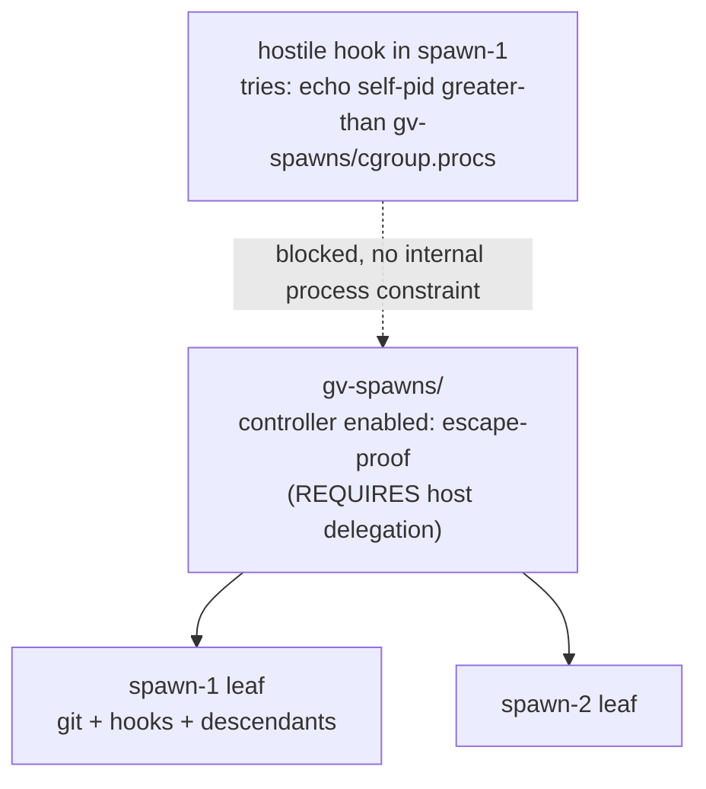
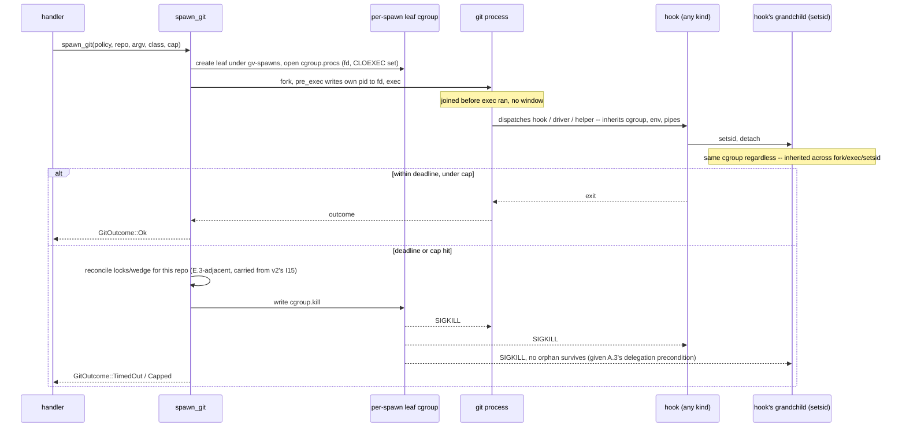
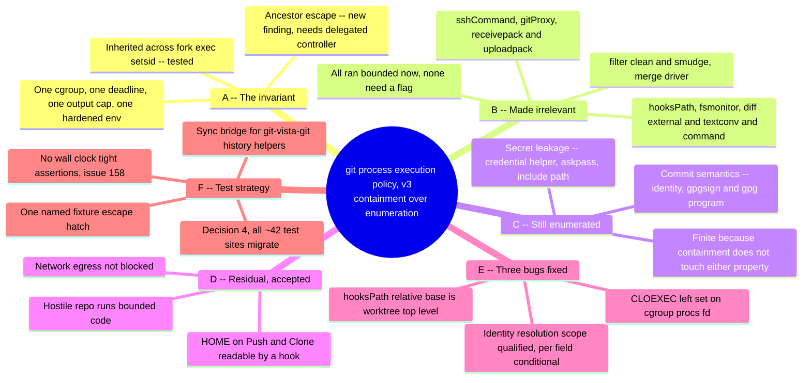

# M1.13 — Centralize git process execution policy (design)

> **⚠️ SUPERSEDED — do not implement from this document.**
>
> This is the **v3 (containment)** design. It **failed its refutation pass**, as did v1 and
> v2 before it. It is kept on `main` as evidence of how the problem was reasoned about, not
> as a specification.
>
> The load-bearing claim here — that anything git spawns can be confined to one bounded,
> killable cgroup — **is false on this host**. A same-uid process writes its own pid into a
> sibling or ancestor `cgroup.procs` and leaves the leaf that `cgroup.kill` targets;
> directory permissions do not help, because the adversary owns the directory. Proven by
> direct test: see
> [`../evidence/2026-07-27-m1.13-cgroup-containment-limits.md`](../evidence/2026-07-27-m1.13-cgroup-containment-limits.md).
>
> Read [`../evidence/m1.13-design-trail/`](../evidence/m1.13-design-trail/) before touching
> #66 — it carries both refutation rounds with tested scenarios, the verified git-behaviour
> facts, and the binding decision that test spawn sites are in scope.
>
> Round 4 replaced containment with a composed boundary and reached a different conclusion.
> Its verdict document is the current record.

- **Status:** SUPERSEDED (was: Proposed — design pass only, no production code changed)
- **Date:** 2026-07-27 (v1) · revised 2026-07-27 (v2) · rewritten 2026-07-27 (v3, this revision)
- **Milestone / issue:** M1.13 — Centralize Git Process Execution Policy (#66), Critical, security boundary
- **Depends on:** M1.10 (#63, bounded reads — `git_stdout_capped`, ADR for the output cap)
- **Constrains:** every future `GitOperation` variant and every future handler that shells out to git

This document settles invariants and a test strategy. It changes no file under `crates/`.
Every codebase claim is cited `file:line`; every git-behaviour claim is either lifted from
`/tmp/…/scratchpad/verified-facts.md` (**[facts]**), tested by the v1/v2 refutation rounds
(**[tested]**, findings files cited by content), or tested fresh for this revision
(**[tested v3]**) — git 2.43.0, kernel 7.0.0-28, cgroup v2, throughout.

## Revision history

**v1 failed refutation**: 6 fatal findings across three lenses. Central mistake: treated
"suppress system+global config, pin `core.hooksPath`, hand-enumerate a few config keys" as
sufficient.

**v2 failed refutation**: 6 more fatal findings, after fixing all of v1's. Central mistake:
enumeration doesn't converge. Each round's fixes uncovered a new dynamic-name config key
(`diff.<n>.command` after `diff.<n>.textconv`; `merge.<n>.driver` after both; `core.gitProxy`
after `core.sshCommand`; `remote.<n>.receivepack`/`.uploadpack` after re-enabling the `file`
transport; `commit.gpgsign`+`gpg.program` missed entirely). Two rounds, twelve fatal findings,
and the set of "config keys that can name a program" kept growing. That is not a converging
process — it is proof the process cannot converge, because git's own extension surface is
open-ended by design (any config key can, in principle, name a hook, driver, or helper; a new
git release can add one at any time).

**v3 reframes around containment (this revision).** Tom's decision, restated precisely in §A:
instead of trying to prevent execution of every possible attacker-named program (open-ended,
proven non-convergent), make execution safe by construction — everything git spawns, however
many hops of fork/exec/setsid, runs inside one bounded, killable envelope. Under containment it
stops mattering *which* config key named the program; enumeration demotes from the primary
defence to a small, closed set that containment cannot cover by nature (§C). This is why v3 is
**substantially shorter** than v2: the entire dynamic-name standing rule, the per-key `-c`/flag
table, the diff-family flag-splicing mechanism (I16), and roughly a dozen "closed via flag X"
rows are deleted outright — not replaced with new mitigations, *removed*, because containment
already covers what they were for. What survives from v2 unchanged: the chokepoint shape itself
(§A.1 below), the environment allowlist's minimalism (Decision 1), and the credential-helper
reset-then-set mechanism (§C, unrelated to the enumeration/containment question).

New in this revision, beyond the reframe itself: an empirical finding of my own (§A.3) that the
naive construction of "just `mkdir` a cgroup under whatever the server already runs in" does
**not** actually guarantee the inheritance property the containment invariant depends on — a
same-uid process can migrate itself one level up and outrun that spawn's kill. This is exactly
the kind of thing the last two rounds' refutations found by testing instead of asserting, so it
gets the same treatment here rather than being asserted away.

## Context — the chokepoint doesn't exist yet

Unchanged from v2: reading the crate shows four independent low-level spawners, not one.

| Low-level spawner | Callers today |
|---|---|
| `git_cmd.rs` (`git_stdout_capped`, `rev_parse`, `is_ancestor`, `git_ok`, `git_ref_exists` — `git_cmd.rs:133,238,257,270,292`) | `handlers/read.rs` diff/file/history/frame endpoints, `planner.rs`'s journal helpers, `handlers/reset.rs` |
| `planner.rs`'s own `run_git` (`planner.rs:1023-1030`) | all 15 `GitOperation` executions (`planner.rs:1000-1016`) |
| `handlers/clone.rs:110` (inline) | `/api/clone` only |
| `coordinator.rs:118` (`absolute_git_dir`) | `refuse_if_git_busy` (`coordinator.rs:103-113`) |
| `durable.rs:425` (`write_recovery_ref`) | the detached recovery-ref pipeline |

**9 production spawn sites**, all in `git-vista-server`, none inside `#[cfg(test)]`: `git_cmd.rs`
×5, `planner.rs` ×1, `handlers/read.rs` ×1 (`read.rs:852`, `worktree_status`),
`handlers/clone.rs` ×1, `coordinator.rs` ×1, `durable.rs` ×1 (`durable.rs:425` —
`durable.rs:459`'s `read_recovery_ref` **is** `#[cfg(test)]`, easy to conflate on a skim).
`git-vista-git` spawns no git process in production at all — it reads via `gix` — so this
design's scope is `git-vista-server` only.



**I1. Exactly one function may construct a git child process.** Signature, corrected from v2 per
the [round2] finding that the documented signature and the tests both needed a threadable policy
object that the code block didn't have:

```rust
// git_cmd.rs -- the only permitted constructor of a git child in this crate.
pub(crate) async fn spawn_git(
    policy: &GitEnvPolicy,
    repo: &Path,
    args: &[&str],
    class: SpawnClass,   // Bootstrap | Read | Mutate | Push | Clone
    cap: OutputCap,
) -> Result<GitOutcome, GitSpawnError>
```

`SpawnClass` has **no `diff_family` flag** in this revision — the flag existed in v2 purely to
splice `--no-textconv`/`--no-ext-diff` onto diff-family argv, and that whole mechanism is
deleted (§B): under containment a textconv/ext-diff program running is no more dangerous than
any other hook, so there is nothing left to splice.

`GitEnvPolicy` carries: `path`, `home`, `identity: Option<(String, String)>` (resolved at
startup, scope-qualified — §E.2), `credential_helper` resolution (per-repo, at spawn time — see
§C), per-class timeouts, and a `delegation: DelegationMode` (`Probe | ForceUnavailable`, a test
seam so cancellation-fallback tests don't need an actual non-delegated host).

**I2. `clippy::disallowed-methods`, proven by a `compile_fail` fixture, not a grep.** Unchanged
from v2 — the grep-based backstop v1 proposed is not computable for this crate (`#[cfg(test)]`
appears in three different syntactic shapes across the files that matter, and three whole files
carry no `#[cfg(test)]` text at all despite being test-only). `clippy.toml` disallows
`std::process::Command::new`/`tokio::process::Command::new`; `#[allow(...)]` scoped to
`spawn_git` and to each `#[cfg(test)] mod tests` block. Backstop test:
`clippy_disallowed_methods_lint_is_present_and_effective`, a `trybuild`/`compile_fail` fixture
proving the lint fires, not a recomputed count.

**I3. Under Decision 4, test-module spawn sites are in scope, not exempted — see §F.**

## A. The containment invariant

### A.1 — Statement

> Every process git spawns for a given operation — the `git` binary itself, any hook, any
> `.gitattributes`-selected filter/diff/merge driver, any credential helper, any `gpg.program`,
> any transport helper (`receive-pack`, `core.gitProxy`) — however many times it forks, execs,
> or calls `setsid` — runs inside the **same bounded envelope**: the same cgroup, the same
> `SpawnClass`-keyed deadline, the same aggregate output cap (stdout+stderr, capped whether it's
> the direct child or a grandchild writing into the same inherited pipe), the same hardened,
> minimal environment (inherited automatically — no separate hardening step reaches a hook),
> and — on timeout, cap breach, or client cancellation — dies as one unit via a single write to
> that envelope's `cgroup.kill`.

Under this invariant it stops mattering *which* config key or `.gitattributes` entry named the
program: whatever it is, it is contained by construction, not by having been enumerated in
advance.

### A.2 — Proof, part 1: cgroup membership survives fork/exec/setsid

This is not new to v3 — round 1's process-tree findings already established it, and it is
re-verified here directly:

**[tested v3]**: created a cgroup, launched a process that joins it, that process then calls
`setsid` on a detached grandchild running a 200ms heartbeat loop (the exact escape that defeats
process-group/`killpg`-based cancellation, per round 1). After 1.5s the heartbeat file had 8
lines. A single write of `1` to the cgroup's `cgroup.kill` was issued. 1.5s and 2.5s later the
heartbeat file was still at 8 lines (frozen), `cgroup.procs` was empty, and `rmdir` on the now-
empty cgroup succeeded. The `setsid`'d grandchild — reparented to init, in its own session,
outside the process group `killpg` would have targeted — died anyway, because cgroup membership
is a kernel property of the task, inherited unconditionally across `fork`, `exec`, and `setsid`
alike, and `cgroup.kill` walks the whole subtree. This is the mechanism the containment
invariant rests on, and it holds.

### A.3 — Proof, part 2: the ancestor-escape boundary condition (new finding)

The proof above shows a spawned tree cannot escape **downward** complexity (forking, execing,
detaching). It does not by itself show the tree cannot escape **upward** — migrate itself into
an *ancestor* cgroup that is not the target of this spawn's `cgroup.kill`. The task brief asks
this proof be done rather than asserted, so it was tested directly:

**[tested v3]**: from inside a per-spawn leaf cgroup (created as a plain `mkdir` under the
server's own already-delegated cgroup, the naive construction), a same-uid process wrote its own
pid to the **immediate parent's** `cgroup.procs` — the write succeeded, and the process was now a
member of the parent cgroup, outside the leaf that would be killed. **Escape succeeded.**
Retested one level further up (`user@1000.service`, two levels above the leaf): the identical
write was refused (`Permission denied`), even though the file is owned by the same uid. The
difference is `cgroup.subtree_control`: `user@1000.service` has controllers delegated to its
children, and cgroup v2's "no internal process" constraint means a cgroup that is distributing
controllers to children cannot itself hold a process directly — the kernel enforces this
regardless of file ownership. The immediate parent (the session scope) has an **empty**
`cgroup.subtree_control` on this host — no controller is delegated below it — so nothing stops a
same-uid process from joining it directly.

**What this means for the invariant:** "the same cgroup, inherited by all descendants" holds
unconditionally for ordinary forking/execing/detaching (part 1). It does **not** hold against a
process that specifically knows its own cgroup path (trivially discoverable via
`/proc/self/cgroup`) and deliberately migrates upward, **unless** the chokepoint's own parent
cgroup for spawns has at least one controller delegated to it — which makes it a non-leaf under
cgroup v2's own rules, and the kernel then refuses any direct-process-membership write to it,
closing the escape by the same mechanism that blocked the second test above.

**Prescribed construction:** the chokepoint creates one long-lived, non-leaf `gv-spawns/` cgroup
at startup and enables at least one controller on it (`pids` is enough — it needs no policy
value, just to exist) via `echo +pids > gv-spawns/cgroup.subtree_control`. Each spawn gets a leaf
directly under `gv-spawns/`. This requires the controller to already be delegated to whatever
cgroup `gv-spawns/` is created under — a deployment property (typically `systemd`'s
`Delegate=pids` or similar on the unit hosting the server), not something userspace code can
grant itself. **On this dev host, that delegation is not present** (`cgroup.subtree_control` on
the session scope is empty) — verified directly, not assumed. The startup probe (I17-equivalent,
carried from v2) must therefore check **both** "can I create a cgroup and write `cgroup.kill`"
**and** "can I enable a controller on `gv-spawns/`, making upward escape kernel-refused" — and
report degraded mode, loudly, when the second check fails, exactly as it already does for plain
delegation unavailability. This is a genuine, load-bearing gap this design did not have before
this test and is recorded honestly in §D rather than assumed away.



### A.4 — What's bounded together

- **Deadline**: `SpawnClass`-keyed (`Bootstrap` 10s, `Read` 20s, `Mutate` 30s, `Push` 120s,
  `Clone` 300s — starting defaults, Tom's call to adjust, not load-tested this pass).
- **Output cap**: reuses `git_stdout_capped`'s existing shape (`git_cmd.rs:38-95`) — 8 MiB
  stdout, 64 KiB stderr, drained concurrently, kill-on-cap. This is enforced on the **pipe**, not
  the cgroup — a hook that writes into the same inherited stdout/stderr fd is capped regardless
  of cgroup membership, so the ancestor-escape gap in §A.3 does not weaken it.
- **Environment**: `env_clear()` plus the minimal allowlist (§B's Decision-1 table, unchanged
  from v2) is set once on the direct `git` child; every descendant, hook included, inherits it —
  there is no separate hardening step to reach or bypass (I14 in v2, unchanged: a hook re-execing
  something with a hand-built environment of its own is a local-operator-trust question, not a
  gap this design can close).
- **Cancellation**: the child joins the cgroup by writing its own pid to a pre-opened
  `cgroup.procs` fd from `pre_exec`, before `exec` — not the SIGSTOP-then-migrate-then-SIGCONT
  mechanism v1 proposed, which deadlocks `Command::spawn()` itself (**[tested]**, round 1: the
  parent blocks reading the CLOEXEC error pipe until the child execs or errors; a child that
  SIGSTOPs itself pre-exec never reaches either, so `spawn()` never returns). See §E.3 for the fd
  handling itself, one of the three confirmed bugs.



## B. What containment makes irrelevant

Every row below was a load-bearing invariant in v1 or v2, each earning its own `-c` override or
name-independent flag, several of them the direct subject of a fatal refutation finding. Under
containment none of them need a closing mechanism at all — the program they name still runs, but
it runs bounded, and that's now sufficient.

| Config key (v1/v2 mechanism) | Why containment covers it |
|---|---|
| `core.hooksPath` (v2: resolve, validate inside/outside repo, conditionally pin + warn) | Whatever directory it points to, whatever fires from it, runs in the envelope. Resolution is kept — see §E.1 — but only for **reporting**, never for gating. Deleted: the entire override-with-warning branch, the "inside vs outside the repo" predicate. |
| `core.fsmonitor` (v2: `-c core.fsmonitor=`) | Contained. Deleted. |
| `diff.external` (v2: `-c diff.external=`) | Contained. Deleted. |
| `diff.<n>.textconv` (v2: `--no-textconv`, name-independent) | Contained. Deleted, along with the `SpawnClass::Read{diff_family}` typed-flag mechanism (I16) that existed only to splice this in safely. |
| `diff.<n>.command` (v2: `--no-ext-diff`) | Contained. Deleted. |
| `filter.<n>.clean`/`.smudge` (v2: named open gap, no flag exists) | Contained — this is the cleanest illustration of the reframe: v1/v2 spent an entire invariant (I18) explaining *why* this couldn't be closed and how wide the gap was. Under containment there is nothing to explain; it was never actually a gap, only a gap under the enumeration frame. |
| `merge.<n>.driver` ([round2] fatal finding: decides committed **content**, not just execution) | Execution is contained. Content is a distinct question, addressed below, not by this design — see the residual-risk note in §D. |
| `core.sshCommand` (v2: closed via `GIT_ALLOW_PROTOCOL` transport denial) | Contained regardless of transport. `GIT_ALLOW_PROTOCOL` is *kept*, narrowed to `http:https:file`, but now purely as a Decision-1 minimal-capability choice (no shipped capability needs `ssh`/`git://`) — not as an execution-safety mechanism. |
| `core.gitProxy` ([round2] fatal finding: the `git://` transport's own analogue of `core.sshCommand`, no `-c` closes it) | Contained. The transport is still excluded from `GIT_ALLOW_PROTOCOL` (Decision 1: not a shipped capability — plaintext, unauthenticated, and `validate_clone_url` already rejects it, `dto.rs:227`), but that is a capability decision, not a containment gap being patched. |
| `remote.<n>.receivepack`/`.uploadpack` ([round2] fatal finding, dynamic name, reachable once `file` is allowed) | Contained. v2 needed `--receive-pack=git-receive-pack`/`--upload-pack=git-upload-pack` specifically to close this; deleted, because whatever program the repo names now runs bounded. |
| `include.path` reinstating any of the above | Moot for all of them — containment doesn't care which scope introduced the exec vector. `include.path`'s remaining relevance narrows to the two categories in §C (it can still reinstate `credential.helper`/`core.askpass`, or an identity/signing setting) — see §C's closing note. |

**Net effect on the document's shape:** v2's §A.3 config-scope table (14 rows), the standing rule
about dynamic-name keys, §A.6's "what closes and what doesn't" table plus its mermaid, and I16's
whole typed-diff-flag mechanism are gone. That is the shrink the task asked to be visible.

## C. What still needs enumeration, and why it's finite

Two categories only. Both are finite for the **same underlying reason**: containment bounds *how
long code runs and whether it can escape*, and neither category is a "how long/whether it
escapes" problem.

### C.1 — Secret leakage

A hostile helper that runs for exactly its allotted timeout, produces output within the cap, and
is cleanly killed at the deadline has still had that entire window to read a credential and POST
it to an attacker's server. **Containment bounds the blast radius of ongoing execution; it does
not un-send a request that already left the sandbox.** A leaked GitHub PAT is exactly as
leaked whether the process that leaked it was killed after 1 second or ran to completion — the
kill happens *after* the leak, not before it. This is a fundamentally different property than
"did the process stay contained," and no amount of tightening the envelope touches it.

Members, all fixed-name (not `.gitattributes`-selected, not driver-name-dependent, so `-c key=`
closure is exact and complete, no name-independence problem):

- `credential.helper` — **multi-valued and additive**: a later `-c credential.helper=X` does not
  replace an earlier repo-local value, it appends, and every configured occurrence runs in order
  (**[tested]**, v2: hostile-then-ours both ran, hostile first, unless the clearing empty value
  precedes the set). Fix, unchanged from v2: `-c credential.helper= -c credential.helper=<resolved>`,
  clear first, on **every** class (the clear), the working value added only on `Push`/`Clone`.
  Resolved per-repo at spawn time via `git config --get-urlmatch credential.helper <origin-url>`
  against the operator's real, un-hardened startup environment — **not** a single value resolved
  once against one URL ([round2] fatal: a single startup resolution is wrong or empty for every
  host but the one it was resolved against, since the operator's config scopes the helper
  per-host).
- `core.askpass` (+ its env-variable twins `GIT_ASKPASS`/`SSH_ASKPASS`, already dropped by
  `env_clear()`) — consulted **before** `GIT_TERMINAL_PROMPT` is checked (**[tested]**: a
  repo-local `core.askpass` script ran and supplied a username even under
  `GIT_TERMINAL_PROMPT=0`). Fix: `-c core.askpass=`, every class.
- `include.path`/`includeIf.*` — cannot itself be disabled by any `-c`, but its danger is now
  narrow: it can only still matter by reinstating one of the members of this section (or §C.2),
  since everything else it could reinstate is covered by containment (§B). The clearing flags
  above are sent unconditionally, regardless of which scope supplied the value they're clearing,
  which closes the practical case even though the general mechanism stays open (unchanged
  conclusion from v2, now resting on a narrower set of things that matter).

The sinks these secrets can reach still need redaction, unrelated to containment: `redact_url`
applied at `clone.rs:109`'s call-site `println!` (not a chokepoint wrapper — that line runs
*before* `spawn_git` is ever called, so a chokepoint-side fix structurally cannot see it — this
was a v1 miss, carried forward fixed), at `clone.rs:129-139`'s failed-clone stderr/response
sinks, at `run_branch_cmd`'s failed-push stderr (`planner.rs:1320-1341`), and at `git_cmd.rs`'s
`git_error` (`git_cmd.rs:109-118`). `clone.rs:114`'s `.arg(&url)` visible via `/proc/<pid>/cmdline`
is a process-isolation question, named but not closed (§D).

### C.2 — Commit semantics

Identity and signing don't describe *how* code ran — they describe what the resulting commit
**means**: who is claimed to have authored it, and whether it carries a cryptographic assertion
of trust. A `gpg.program` that runs perfectly inside the envelope, exits 0, and produces a
well-formed signature is not a containment failure at all — the failure, if any, is that it
signed something with a key or identity the operator didn't intend. This is a meaning question,
not an execution question, so no amount of bounding the process touches it.

- **Identity.** `user.name`/`user.email`. Two independent bugs here, fixed in §E.2 (one of the
  three confirmed bugs): the startup resolution must be scope-qualified (not run from inside the
  server's own repo), and injection must be per-field-conditional on repo-local absence (`-c`
  always wins, so unconditional injection would silently overwrite legitimate repo-local
  identity).
- **Signing.** `commit.gpgsign` (the enabler, fixed-name) plus `gpg.program`/`gpg.<format>.program`
  (the executable-naming key, which varies with `gpg.format` — `openpgp`/`x509` use
  `gpg.program`, `ssh` uses `gpg.ssh.program` — a small, enumerable, **known-finite** set of
  format variants, unlike a `.gitattributes`-selected driver name which is open-ended). **[round2
  finding, fatal, previously unenumerated]**: repo-local `commit.gpgsign=true` + `gpg.program=`
  executes an arbitrary binary on every `git commit` — the single most common `Mutate` operation
  — and neither key appeared in any v1/v2 table. Fix: force `-c commit.gpgsign=false` (and
  `-c tag.gpgsign=false`, defensively, if a tag operation ever ships) on every `Mutate` spawn.
  This closes the **enabler**, which is what makes it work despite the program-key name varying:
  there is no signing operation shipped (Decision 1's environment table already says so for
  `GPG_TTY`/`GNUPGHOME`), so there is nothing to sign with even if the enabler were left on, but
  forcing the enabler off is the cheap, direct closure and doesn't depend on that being true
  forever. If a later milestone ships signed commits, this constant flips as part of that ADR,
  per the widening procedure in §H.

**Why this set is closeable where the execution set wasn't:** every member above is a fixed
config-key name (or, for signing, a small enumerable format-variant family) — none is
`.gitattributes`-selected or driver-name-dependent. The execution set failed to converge
specifically *because* git lets a tracked file (`.gitattributes`) choose an arbitrary config-key
suffix, and any given `-c key=` can only close a key whose name you already know. Secret-leakage
and commit-semantics keys don't have that shape: they're a short, named, git-documented list, and
containment is not a substitute defence for either category by nature, so there is no pressure to
keep discovering new members the way there was for execution — a new git release could add a new
*hook* or driver, and it's automatically covered by §A; it would have to add a fundamentally new
*kind of thing that leaks a secret or asserts authorship/trust* to grow this list, which is a much
rarer event than "a new config key can name a program."

## D. Residual risk, stated plainly

**Accepted, per Tom's explicit decision: a hostile repository can still run code.** What it can
do, bounded:

- Read repository contents and anything else readable under the server's own OS-user permissions
  — no sandboxing, no filesystem namespace (Decision-2-adjacent: an operator who adds a repo to
  the catalog is trusting that repo's `.git/config` and tracked files by definition, unchanged
  from v2's I9).
- Consume the full deadline for its `SpawnClass` before being killed.
- Emit output up to the aggregate cap.
- Attempt network egress — **nothing in this design blocks outbound connections from a hook or
  driver**; no network namespace or firewall layer is in scope. A hook can `curl` a credential it
  finds to an attacker's server within its timeout window, same shape as §C.1.
- On `Push`/`Clone` specifically, read `HOME` (allowlisted there for the credential helper) —
  concretely, a repo-local hook running on those two classes can read `~/.config/gh/hosts.yml` or
  run `gh auth token` directly ([round2] SERIOUS finding, re-tested: `env -i PATH=... HOME=$HOME
  sh -c '/usr/bin/gh auth token'` returns a live token). This is the accepted price of Decision 2
  (hooks genuinely run) composed with needing `HOME` for private-repo authentication; named here
  rather than left implicit.
- Have its output (a custom diff/merge driver's stdout) become what the operator is shown or,
  for a merge driver, what gets committed. This is **ordinary repo content**, not a privilege
  question — the operator already fully controls file content in any repo they can commit to;
  containment does not need to, and does not, validate content, only execution.

**What it cannot do, given the deployment precondition in §A.3 holds** (a controller delegated to
`gv-spawns/`):

- Outlive its `SpawnClass` deadline.
- Escape the process-tree kill via `setsid` or any depth of forking.
- Gain OS privilege beyond the server's own uid — no setuid path exists in this design.
- Persist after the cgroup is killed and reaped.

**What it can do if that precondition does *not* hold** (verified false on the dev host as of
this writing, §A.3): migrate itself one level up, out of its own spawn's kill target, and
outlive that spawn's deadline — bounded still to the server's own uid and cgroup subtree (no new
privilege, no escape into unrelated space), but no longer bounded to *that spawn's* timeout. This
is recorded as an open, load-bearing deployment requirement, not glossed over.

## E. Fix the three confirmed bugs

### E.1 — Relative `core.hooksPath` resolves against the worktree top-level, not the common dir

Under containment this is no longer a safety bug (§B: wherever hooks come from, they're
contained) — it survives as a **correctness/reporting** bug, because the chokepoint still
resolves the effective `core.hooksPath` once per repo (`Bootstrap`-class, cached) purely so the
operation's response can state truthfully where hooks ran from, in the spirit of Decision 2's "a
client that silently skips your hook is lying to you" — now strengthened to "never overrides,
always tells the truth about where it looked," since there is no override branch left at all.

**[tested v3]**, husky-shaped fixture, repo-local `core.hooksPath = .husky/_`:

```
TOP    = git rev-parse --path-format=absolute --show-toplevel
COMMON = git rev-parse --path-format=absolute --git-common-dir
```

| Base used for the relative value | Resolved path | Hook fires? |
|---|---|---|
| `$COMMON/.husky/_` (v2's prescribed base) | `<repo>/.git/.husky/_` | **No** — directory doesn't exist |
| `$TOP/.husky/_` (correct) | `<repo>/.husky/_` | **Yes** |
| git's own resolution (baseline, no override at all) | same as the correct row, cwd-independent | **Yes** |

Since v3 never pins `core.hooksPath` at all (§B), the bug can only resurface in the reporting
path — resolve with `--path-format=absolute --show-toplevel` as the base for a relative value,
never `--git-common-dir` (that's only the base for the *fallback default*, `<common-dir>/hooks`,
which is what git itself uses when no repo-local value is set — a fact, not a chokepoint
decision). Named test: `resolved_hookspath_report_matches_the_hook_that_actually_fired`
(husky fixture, relative value, asserts the reported path equals the one git itself resolved to
and that the hook's own marker output is present — a positive assertion, not "the hostile marker
is absent," which is the shape that let v1/v2's own tests pass against a fire-nothing pin).

### E.2 — Startup identity resolution must be scope-qualified, and injection per-field-conditional

**[tested v3]**, from inside a repo carrying repo-local identity (`ServerRepoLocal
<serverrepo@local>`, standing in for the server's own checkout — exactly the shape
`/home/tom/projects/Git-Vista` itself is in, since `gv:461` `cd`s into `$REPO` before `gv:488`
launches the server):

| Read | Result | Correct? |
|---|---|---|
| `git config --get user.name` (unqualified, cwd inside a repo) | `ServerRepoLocal` | **No** — picks up repo-local scope of whatever repo the server happens to be sitting in |
| `git var GIT_AUTHOR_IDENT` (same cwd) | `ServerRepoLocal <serverrepo@local> ...` | **No** — same defect, v2 offered this as "equivalent," it isn't |
| `git config --global --get user.name` | `tomb` (the operator's actual global identity) | **Yes** — scope-bound, immune to which repo the server's cwd happens to be |

Fix: resolve the startup identity with `git config --global --get user.name`/`--get user.email`
(system-scope fallback if global is absent), **never** an unqualified read run from the server's
own working directory. This closes the [round2] fatal finding directly: v2's own worked example
(`git config --get user.name` from `/home/tom/projects/Git-Vista` returning `tom2025b`, the
server's *own* repo-local identity, not the operator's real `tomb`) would have misattributed
every commit made through Git-Vista in the 9-of-21 catalog repos with no repo-local identity of
their own — exactly the population the fix exists to serve.

**Per-field injection stays conditional on repo-local absence**, mechanism unchanged from v2
(**[tested]**, re-confirmed: `-c user.name=Injected` unconditionally wins over repo-local config,
same as every other `-c`, so unconditional injection would silently overwrite legitimate
repo-local identity in the 57% of the catalog that has one) — with one correction from [round2]'s
minor finding: the presence probe must be the **hardened-environment effective read**
(`GIT_CONFIG_NOSYSTEM=1 GIT_CONFIG_GLOBAL=/dev/null git config --get user.name`), not
`--local --get`. `--local` only sees the repo-local *file*; it reports "absent" for a repo whose
identity is actually supplied via a repo-local `include.path`, causing the startup value to be
injected on top of — and, because `-c` always wins, silently override — the identity the CLI
would actually use. The hardened effective read sees exactly what the repo provides once system
and global are suppressed, includes and all, which is the property the probe is actually meant to
answer.

### E.3 — Do not clear `CLOEXEC` on the `cgroup.procs` fd

**[round2] fatal finding, re-affirmed, not re-tested this pass** (the round2 probes are thorough
enough to cite rather than duplicate: two harnesses, one with `CLOEXEC` cleared and one without,
run against a real hostile-hook shape). Summary: `fork()` preserves file descriptors regardless
of `FD_CLOEXEC` — the flag only takes effect at `execve`, which happens *after* the `pre_exec`
write completes. Clearing `CLOEXEC` therefore buys the join-before-exec mechanism (§A.4) nothing
— the write already succeeds pre-exec either way — and instead leaks a **writable** handle on
`<cg>/cgroup.procs` into the git process and every hook it dispatches. Round 2's probe with
`CLOEXEC` cleared showed a hostile hook script enumerating `/proc/self/fd`, finding the leaked
handle, and writing the **server's own pid** into the per-spawn kill cgroup — converting the
timeout's routine `cgroup.kill` into a whole-server SIGKILL, reachable from one HTTP request
against a repo with a hostile `pre-commit` hook. Fix: open `cgroup.procs` with `CLOEXEC` **set**
(Rust's default for `File::open`) and do nothing to clear it. The `pre_exec` write still succeeds
(it runs before `exec`); the fd is then closed automatically by `execve`, so neither git nor any
hook ever observes it. Named test, carried from round 2's fix:
`cgroup_procs_fd_is_not_inherited_past_exec` (asserts the direct child's `/proc/<pid>/fd`
contains no descriptor resolving to a `cgroup.procs` path).

## F. Test strategy

Every named invariant has a test; an invariant with no test is not settled. **No assertion
compares elapsed time against a tight bound** — flaky-test issue #158 is open specifically
because of this class of test; timing-shaped tests use a short, explicitly injected budget
(`GitEnvPolicy`-carried, not `std::env::set_var`, which races across parallel tests) against a
generous, order-of-magnitude-larger outer deadline, or assert on a state transition (heartbeat
file stops growing) rather than a clock read.

### Containment invariants (§A)

| Test | Fixture | Pins |
|---|---|---|
| `spawn_git_child_is_in_its_own_cgroup_before_exec` | fake-git-on-PATH reporting its own `/proc/self/cgroup` immediately on start | A.2 — no window between spawn and cgroup join |
| `cgroup_procs_fd_is_not_inherited_past_exec` | fake-git dumping its own `/proc/self/fd` | E.3 |
| `spawn_git_cancellation_reaps_a_self_detaching_grandchild` | fake-git that `setsid`s a heartbeat loop | A.2, under delegation |
| `ancestor_migration_is_refused_when_gv_spawns_is_non_leaf` | real cgroup fixture: process attempts `echo self > gv-spawns/cgroup.procs` from inside a leaf | A.3 — the escape-boundary proof, made a standing regression test, not just a design-time probe |
| `cgroup_delegation_and_controller_probe_reports_degraded_mode_when_unavailable` | `DelegationMode::ForceUnavailable` seam on `GitEnvPolicy`, no reliance on the actual CI host's cgroup layout | A.3 — never silently downgraded |
| `spawn_git_kills_a_hanging_child_within_its_injected_budget` | fake-git-hangs, short injected budget | A.4 |
| `spawn_git_caps_output_from_any_binary_named_git` | fake-git-chatty, ignores SIGTERM | A.4 |
| `spawn_git_direct_child_env_is_exactly_the_allowlist` | fake-git dumps its own `env`, byte-exact `assert_eq!` | Decision 1 allowlist |
| `git_dispatched_child_env_carries_no_inherited_host_variables` | real hook dumping `env`, asserted as a **denylist** (no `SSH_AUTH_SOCK`/`GPG_TTY`/`GNUPGHOME`/arbitrary host var), tolerating git's own `GIT_*` injections | Decision 1, real-hook shape — [round1] finding: a byte-exact assertion at this observation point fails on a *correct* implementation, since git injects `GIT_AUTHOR_*` etc. into every hook |
| `clippy_disallowed_methods_lint_is_present_and_effective` | `compile_fail` fixture | I2 |

### Things containment made irrelevant — regression guards that a re-enumeration doesn't creep back in

One test per formerly-enumerated key, asserting the program **runs** (not that it's blocked) and
that it runs bounded — this is the inverse of v2's tests, and its existence is itself evidence
the shrink is real:

| Test | Fixture | Confirms |
|---|---|---|
| `custom_diff_and_merge_drivers_run_but_are_bounded_by_the_same_envelope` | repo-local `diff.<random>.textconv`/`.command`, `merge.<random>.driver`, all firing normally | §B — no flag suppresses them, and a slow one still respects the deadline |
| `core_fsmonitor_and_hooks_path_redirect_are_honoured_not_overridden` | repo-local `core.fsmonitor`, husky-shaped `core.hooksPath` | §B, E.1 — both fire exactly as configured |
| `local_file_transport_and_receive_pack_override_run_bounded` | local bare remote, repo-local `remote.origin.receivepack` | §B — no `--receive-pack=` override needed |

### Secret leakage and commit semantics (§C — the enumerated residue)

| Test | Fixture | Pins |
|---|---|---|
| `repo_local_askpass_is_never_executed` | repo-local `core.askpass` marker script, auth-requiring remote | C.1 |
| `credential_helper_reset_defeats_a_preexisting_repo_local_helper` | repo-local hostile helper + injected helper, `Push` class | C.1 |
| `credential_helper_is_resolved_per_repo_via_get_urlmatch_not_once_at_startup` | two fixture repos with different origin hosts, distinct per-host helper config | C.1 — [round2] fix |
| `repo_local_include_path_cannot_reinstate_a_credential_helper_or_askpass` | repo-local `include.path` → hostile helper/askpass | C.1 |
| `commit_succeeds_in_a_repo_whose_identity_is_global_only` | no repo-local identity, `GitEnvPolicy` startup-resolved from fixture global | C.2, E.2 |
| `repo_local_identity_wins_over_the_injected_startup_value` | repo-local identity set, distinct startup value | C.2, E.2 |
| `startup_identity_ignores_the_servers_own_repo_local_config` | cwd fixture inside a repo with distinctive repo-local identity, distinct fixture global | C.2, E.2 — the bug's own regression guard |
| `identity_probe_sees_include_path_sourced_identity_as_present` | repo-local `include.path` supplying identity, no direct repo-local entry | C.2, E.2 — [round2] minor fix |
| `repo_local_signing_config_never_executes_a_signing_program` | `commit.gpgsign=true` + `gpg.program`, and the `gpg.format=ssh`/`gpg.ssh.program` variant | C.2 — [round2] fatal finding |
| `redact_url_strips_userinfo_from_the_actual_clone_path_stdout` | clone against `https://faketoken123@example.invalid/x.git`, asserted against the real captured stdout of the clone-path spawn, not just chokepoint tracing | C.1 — must cover `clone.rs:109`, the sink a chokepoint-only fix cannot reach |
| `push_without_reinjection_fails_fast` / `push_with_reinjection_authenticates_against_the_fixture` / `clone_with_reinjection_authenticates_against_a_private_fixture` | loopback HTTP fixture, `401` + Basic auth | §D regression 1, unchanged from v2 |

### Decision 4 — all ~42 test-module spawn sites migrate through `spawn_git`

Binding, per Tom's decision (`m1.13-decision-test-sites.md`), restated here as the design must:

1. **Scope**: `I2`'s enforcement (the `clippy.toml` disallowed-methods lint) covers `#[cfg(test)]`
   modules too, repo-wide — not a production-only gate. Every one of the ~42 test spawn sites
   across `git_cmd.rs`, `state.rs`, `coordinator.rs`, `durable.rs`, `history.rs`, `handlers/read.rs`,
   `journal.rs`, `catalog.rs`, `planner/{contract,coordination,lifecycle}_suite.rs`, and
   `git-vista-git/src/history.rs`'s test module routes through `spawn_git`, or through the one
   named exemption below.
2. **Fixture-setup exemption, decided**: a single, named, greppable helper —
   `test_support::raw_git_for_fixture_setup` — is the *only* permitted direct `Command::new`
   outside `spawn_git` and `git_cmd.rs`'s own machinery tests (which test `spawn_git` itself and
   therefore cannot route through it). It exists for the narrow cases where a fixture genuinely
   needs something the policy forbids — setting identity via plain `git config` rather than `-c`,
   for instance, to build a repo whose repo-local identity a later assertion depends on. Every
   other test spawn — including ordinary `git init`/seed-commit fixture setup — goes through
   `spawn_git`, deliberately: seeding under the real env policy is itself evidence the policy
   doesn't break ordinary repo setup, which is exactly the property a bypassing fixture would
   never prove.
3. **The sync/async question, decided.** `spawn_git` is async (`tokio::process::Command`).
   `git-vista-git/src/history.rs`'s test helpers use `std::process::Command` synchronously to
   build fixture repos. Rather than maintain a second, sync chokepoint implementation (a second
   place to get the env policy right, drifting from the first), those helpers gain one
   test-only sync wrapper — `block_on_spawn_git(policy, repo, args, class, cap)` — that
   constructs (or reuses, per-test-thread) a minimal `tokio::runtime::Runtime` and blocks on the
   real async `spawn_git`. This is strictly a test-harness convenience; it adds no second
   enforcement surface, and `git-vista-git`'s own production code remains untouched (it never
   spawns git at all — §Context).
4. **This migration is part of #66's definition of done**, not a follow-up — a deferred migration
   never happens, per Tom's stated reasoning: a test suite that bypasses the chokepoint provides
   false coverage of exactly the invariants this design exists to pin.

## G. Estimate

Chokepoint + 9 production sites + containment mechanism (cgroup creation, controller-delegation
probe, `pre_exec` join, `cgroup.kill` cancellation, post-kill reconciliation) + the two
enumerated categories (§C) + the three bug fixes (§E): comparable to v2's estimate for the
equivalent scope, **materially smaller** than v2's actual invariant count because the entire
dynamic-name enumeration apparatus (§B) is deleted rather than implemented.

**Decision 4 adds, on top of that:**

- ~42 test-module call sites migrated, across at least 9 files in two crates.
- One new test-support helper (`raw_git_for_fixture_setup`) and one new sync/async bridge
  (`block_on_spawn_git`), both small but both need their own tests (that the escape hatch is
  actually narrow, that the sync bridge doesn't leak a runtime across test threads).
- Expect latent-assumption surfacing: a test that silently depended on inherited environment, or
  on a hook firing under the *old*, unhardened raw-`Command` shape, will need its fixture
  rebuilt once it runs through the real policy. This is not a defect in the migration — it is the
  migration doing its job.
- Sequencing, per Tom's decision: the chokepoint and the 9 production sites first, with a stable
  `spawn_git`/`GitEnvPolicy` API; the ~42 test sites become a clean, delegable follow-on task
  with an unambiguous acceptance criterion (`clippy::disallowed-methods` clean, `./dev gate`
  green) — well-suited to a cheaper model/effort tier once the chokepoint exists, per the
  standing subagent-sizing rule.

## H. What this deliberately does not do

- **Does not sandbox git itself.** A repo an operator adds to the catalog is trusted input by
  definition (§D) — unchanged from v1/v2.
- **Does not validate merge/diff/textconv driver *output***, only bounds the process that
  produces it (§B, §D) — a content-integrity question, out of scope for a process-*execution*
  policy.
- **Does not close the general `include.path` mechanism** — narrowed to mattering only for §C's
  two categories, not eliminated.
- **Does not verify the controller-delegation precondition (§A.3) on the actual deploy target** —
  confirmed **absent** on the dev host, which is itself the finding; closing it is a deployment
  task (systemd `Delegate=` configuration), out of scope for this design pass, and the startup
  probe reports degraded mode rather than assuming it.
- **Does not add GPG/SSH-agent allowlist entries** — no shipped capability needs them (Decision 1).
- **Does not change `durable.rs`'s existing plaintext-at-rest journal design** — a prior,
  already-documented trade-off this design doesn't reopen.
- **Does not address the `/proc/<pid>/cmdline` local-observability sink** for a credentialed
  clone URL — a process-isolation question, not a process-execution-*policy* question.
- **Does not pick exact timeout values with load-test evidence** — starting defaults, Tom's call
  to adjust.
- **Does not block network egress from a contained process** (§D) — no network namespace/firewall
  layer is in scope; a contained hook can still dial out within its deadline.
- **Does not fully solve unactionable git error text** — the two known signatures
  (`could not read Username for`, `Author identity unknown`/`unable to auto-detect email
  address`) get one prepended actionable line, carried unchanged from v2; everything else git
  says is still forwarded verbatim.

### Safe procedure for a later milestone to widen either enumerated category (§C)

Unchanged from v1/v2, carried forward — this procedure was never about execution, so containment
doesn't touch it:

1. Name the exact **shipped** capability that needs the new key/variable.
2. Cite the code path (`file:line`) that will call it.
3. Write the justification into an ADR amendment before merging.
4. Add a test scoped to the specific `SpawnClass` that needs it, asserting presence there and
   absence on every other.
5. Never widen defensively.



## Verification (once implemented, out of scope for this design pass)

1. `./dev gate` green with the new `clippy.toml` disallowed-methods entry in place, scope
   including test modules per Decision 4.
2. Every test named in §F passing, including the controller-delegation probe reporting its actual
   state on the CI host rather than assuming it.
3. A live drive (per the project's definition-of-done for anything touching
   `docs/SECURITY_MODEL.md`): a real push and clone against the operator's actual GitHub remotes
   succeed; a real husky-shaped repo-local hook fires and is bounded; a repo with only global
   identity commits with the right author; `worktree_status` answers under load with a
   repo-local `core.fsmonitor` present and firing (not suppressed — §B).
4. An ADR recording: the containment reframe itself and why enumeration was abandoned as the
   primary mechanism, the env allowlist, identity resolution, the two enumerated residual
   categories, the cgroup-based cancellation mechanism including the ancestor-escape precondition
   and its deployment requirement, the credential-helper per-repo resolution, and the
   never-override `core.hooksPath` posture — plus `docs/SECURITY_MODEL.md` annotated at the
   process-execution section once implemented.

**Signed:** thomas2025 · 2026-07-27T21:20:00-04:00
