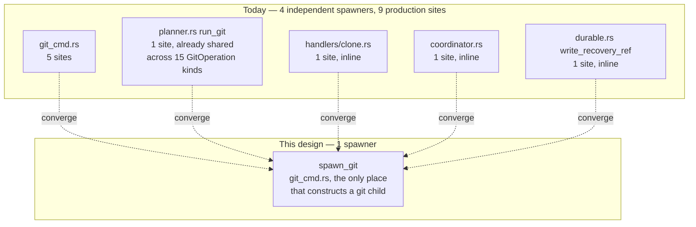
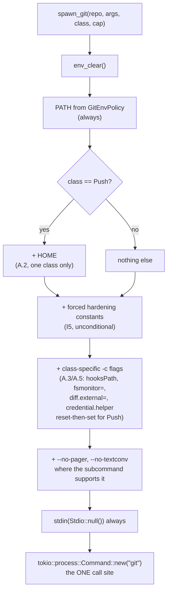
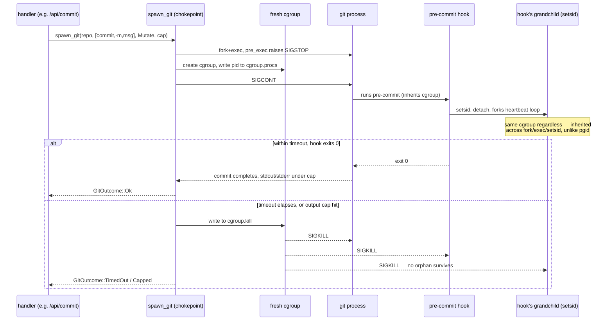
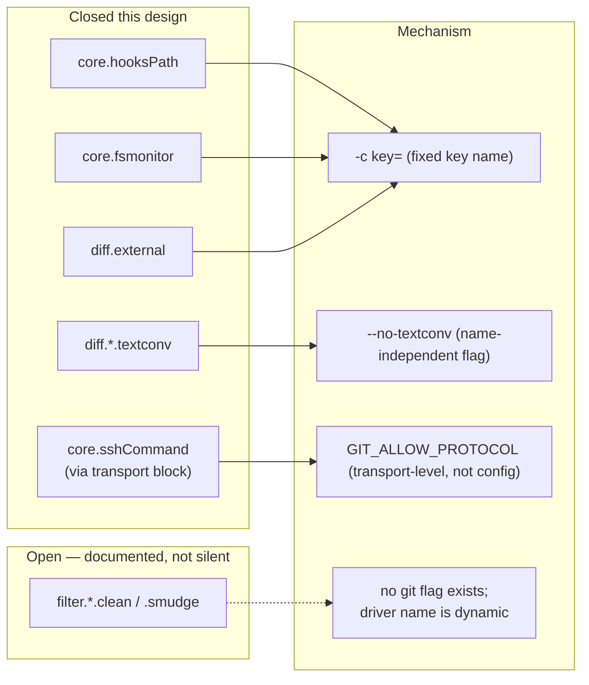
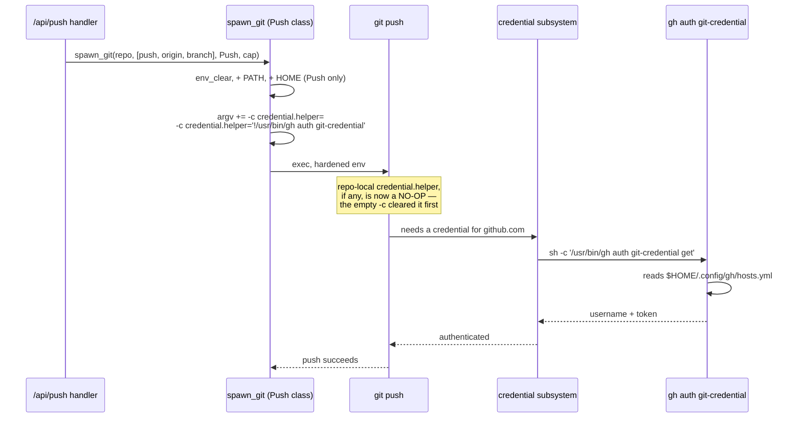
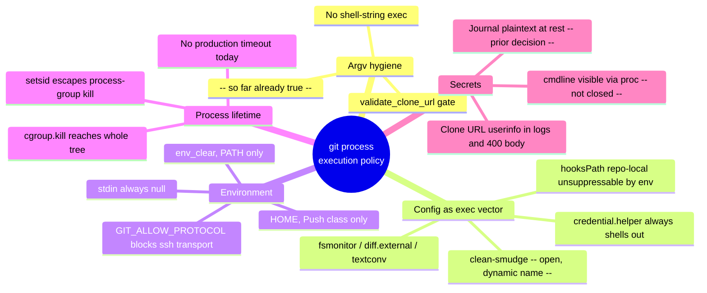

# M1.13 — Centralize git process execution policy (design)

- **Status:** Proposed — design pass only, no production code changed
- **Date:** 2026-07-27
- **Milestone / issue:** M1.13 — Centralize Git Process Execution Policy (#66), Critical, security boundary
- **Depends on:** M1.10 (#63, bounded reads — `git_stdout_capped`, ADR for the output cap)
- **Constrains:** every future `GitOperation` variant and every future handler that shells out to git

This document settles invariants and a test strategy. It changes no file under `crates/`.
Every codebase claim below is cited `file:line`; every git-behaviour claim is either lifted
from `/tmp/…/scratchpad/verified-facts.md` (cited as **[facts]**) or independently tested this
session in a throwaway `mktemp -d` repo, git 2.43.0 — cited as **[tested]** with the command
shown. Nothing here asserts behaviour from memory.

## Context

### The chokepoint doesn't exist yet — four independent low-level spawners

The issue's premise — "centralize" — presumes one entry point to converge on. Reading the
crate shows there isn't one yet; there are four, each with its own inline
`tokio::process::Command::new("git")`:

| Low-level spawner | Callers today |
|---|---|
| `git_cmd.rs` (`git_stdout_capped`, `rev_parse`, `is_ancestor`, `git_ok`, `git_ref_exists` — `git_cmd.rs:133,238,257,270,292`) | `handlers/read.rs` diff/file/history/frame endpoints, `planner.rs`'s journal helpers, `handlers/reset.rs` |
| `planner.rs`'s own `run_git` (`planner.rs:1023-1030`) | all 15 `GitOperation` executions (`planner.rs:1000-1016`) — this one *is* already a single chokepoint for the planner's own world |
| `handlers/clone.rs:110` (inline) | `/api/clone` only |
| `coordinator.rs:118` (`absolute_git_dir`) | `refuse_if_git_busy` (`coordinator.rs:103-113`) |
| `durable.rs:425` (`write_recovery_ref`) | the detached post-operation recovery-ref pipeline |

Counted directly (`grep -rn 'Command::new("git")' crates`, 48 hits workspace-wide): **9 are
production spawn sites, all in `git-vista-server`, none inside a `#[cfg(test)]` boundary**:
`git_cmd.rs` ×5, `planner.rs` ×1, `handlers/read.rs` ×1 (`read.rs:852`, `worktree_status`),
`handlers/clone.rs` ×1, `coordinator.rs` ×1, `durable.rs` ×1. That is one more than the task
brief's count of 8 — `durable.rs:425` was missed there, confirmed by checking it sits above
`write_recovery_ref`'s doc comment with no `#[cfg(test)]` above it (the file's *next*
`Command::new("git")`, at `durable.rs:459`, is `read_recovery_ref`, which **is** `#[cfg(test)]`
— easy to conflate the two on a skim).

The remaining 39 occurrences are test fixtures: `git-vista-server`'s own `#[cfg(test)]` modules
(`git_cmd.rs`, `state.rs`, `coordinator.rs`, `durable.rs`, `history.rs`, `handlers/read.rs`,
`journal.rs`, `catalog.rs`, `planner/{contract,coordination,lifecycle}_suite.rs`) plus
`git-vista-git/src/history.rs`'s test module. That last one matters: **`git-vista-git` spawns
no git process in production at all** — `walk_history`/`read_commit`/etc. (`git-vista-git/src/history.rs:27,212,326,393,484`)
read via `gix`, per the workspace README's own division of labour. Its `Command::new("git")`
calls exist only to build fixture repos for its tests to read. So this design's scope is
exactly `git-vista-server`; `git-vista-git` is already compliant by construction.



### The tension the facts file surfaces

Acceptance criterion 1 says "no shell-string execution is used." At the argv layer that is
already true — every site above is `Command::new("git")` plus discrete `.arg()`s, never
`sh -c`. But **[facts]** proves config itself is a shell-execution vector: a `credential.helper`
value is *always* run through a shell (`sh -c`) by git's own credential subsystem, `!`-prefixed
or not — **[tested]**, `git -c credential.helper=/path/to/script credential fill`, both with and
without a leading `!`, both showed `parent-comm=sh` for the helper process. So "no shell
execution" cannot mean "git never shells out to anything" — it has to mean "git-vista's own
invocation is argv-only, and the *set of config that can direct git to run anything* is a
fixed, explicit, server-authored list — never data sourced from a repo the caller doesn't
control." That reframing is what Decision 1 (environment) and the config-scope policy below
are built to deliver.

## A. Invariants

Sixteen checkable propositions, grouped by the four things the issue asks to settle: the
chokepoint, the environment, config-scope, and hooks/filters/secrets. Each is either backed by
a cited test in §C or explicitly named a documented gap in §A.5.

### A.1 — The chokepoint

**I1. Exactly one function in `git-vista-server` may construct a git child process.**
It lives in `git_cmd.rs` — the natural home; it already owns the output-capping policy
(`git_cmd.rs:1-14`) this design extends to env/config/timeout/cancellation. Illustratively:

```rust
// git_cmd.rs — the only permitted constructor of a git child in this crate.
pub(crate) async fn spawn_git(
    repo: &Path,
    args: &[&str],
    class: SpawnClass,   // Read | Mutate | Push  (drives env, timeout, -c flags — A.2/A.3)
    cap: OutputCap,      // reuses git_stdout_capped's byte-cap shape
) -> Result<GitOutcome, GitSpawnError>
```

`planner.rs`'s `run_git` (`planner.rs:1023-1030`), the inline spawns in `clone.rs:110`,
`coordinator.rs:118` and `durable.rs:425`, and `git_cmd.rs`'s own four smaller helpers
(`rev_parse`, `is_ancestor`, `git_ok`, `git_ref_exists`) all become thin callers of `spawn_git`
instead of independent `Command::new("git")` constructions. This is not a new pattern for the
codebase: `planner.rs`'s `run_git` already *is* a one-function chokepoint for the planner's own
15 operations (`planner.rs:1000-1016` all route through it) — this design generalizes that
shape to the whole crate rather than inventing one.

**I2. A new call site that bypasses `spawn_git` is structurally prevented, not just
discouraged — enforced by a `clippy::disallowed-methods` lint wired into the existing gate,
backed by a redundant grep-count regression test.**

Weighed options:

| Option | Verdict |
|---|---|
| Module privacy (`tokio::process` unreachable outside `git_cmd.rs`) | **Rejected.** Rust has no mechanism to restrict which *files within one crate* may import an external crate's item — `tokio` is a normal `git-vista-server` dependency, reachable from any module. Nothing stops a new file writing `use tokio::process::Command;` itself. |
| A newtype only the chokepoint can construct | **Rejected alone.** Real value (it makes the *intended* path pleasant to use), but on its own it's convention, not prevention — nothing stops a new call site ignoring the newtype and calling `Command::new("git")` directly, which is exactly how the crate got 4 spawners in the first place. |
| A grep-the-tree test | **Kept as a backstop, not the primary.** Cheap, but a maintained *allowlist of exact line numbers* is fragile (a formatting pass shifts every line) and only fires at `cargo test` time, after code review may already have approved the PR. |
| `clippy::disallowed-methods` lint | **Chosen as primary.** Already-adopted infrastructure: `./dev gate` runs `cargo clippy --workspace --all-targets -- -D warnings` (`dev:50`) with no `clippy.toml` yet. Add one, disallowing `std::process::Command::new` and `tokio::process::Command::new`; `#[allow(clippy::disallowed_methods)]` scoped to exactly the `spawn_git` function (and to each `#[cfg(test)] mod tests` block that legitimately needs raw git — I3). A bypassing call site fails the build the same gate check that already blocks every merge, with a message naming the disallowed method — no separate CI job, no line-number bookkeeping. |

Primary + backstop: `clippy::disallowed-methods` catches it at compile time on every gate run;
the grep-count test (`chokepoint_is_the_only_production_spawner`, §C) is a second, independent
signal that doesn't depend on clippy configuration surviving a future edit, and is cheap enough
to keep as belt-and-braces (the `dto.rs:222-223` comment already uses exactly that phrase for a
similar redundant-check posture in this codebase).

**I3. Test-module spawn sites are explicitly out of scope of the chokepoint.** All ~39 of them
(precisely counted above; the task brief's "~42" is in the right range but not exact — plausibly
counted before a recent test file split) construct real, throwaway repos under `tempfile::tempdir()`
to assert against genuine git behaviour — they are not reachable from any HTTP request, carry no
caller-supplied data, and several (`git_cmd.rs`'s own suite) exist specifically to test
`spawn_git`'s own machinery and therefore cannot themselves route through it. The chokepoint's
job is to police the code path an attacker's HTTP request can reach; test fixtures aren't on
that path. Each `#[cfg(test)] mod tests` block gets its own
`#![allow(clippy::disallowed_methods)]`, so the lint's production/test line is drawn at exactly
the same boundary `#[cfg(test)]` already draws, and can't drift from it silently — allowing the
whole crate globally would defeat I2.

### A.2 — The environment allowlist

Tom's rule: `env_clear()`, then explicitly restore only what a **shipped** capability needs, each
justified in writing. **[facts]** (`env -i PATH=$PATH git …`) proves `--version`, `rev-parse
--git-dir`, `status --porcelain`, and `commit` (given identity) all work with nothing but `PATH`
— `GIT_EXEC_PATH` is *not* required. Building the allowlist from that floor, not from caution:

| Variable | In allowlist? | Justification |
|---|---|---|
| `PATH` | **Yes, always** | Without it `Command::new("git")` can't resolve the binary at all, and `git`'s own subprocess dispatch (for anything under `libexec/git-core`) needs it too, even though **[facts]** shows `GIT_EXEC_PATH` itself isn't required — git finds its own subcommands via `PATH` search when unset. |
| `HOME` | **Yes, `SpawnClass::Push` only** | The *only* shipped capability that needs it: `exec_push` (`planner.rs:1419-1441`) authenticates over HTTPS via a **global**-config credential helper (`credential.https://github.com.helper = !/usr/bin/gh auth git-credential` — **[facts]**), and `gh` resolves its token store from `HOME` (`~/.config/gh/hosts.yml` — **[facts]**). Every other `SpawnClass` — including `Clone`, whose URL a user pastes and which may carry its own embedded `user:token@host` userinfo, needing no helper at all — gets no `HOME`. See §B for exactly how it's re-injected. |
| `GPG_TTY`, `GNUPGHOME` | **No** | No signing operation ships. Per Tom's explicit instruction: do not pre-emptively allow. A later milestone that ships signed commits adds this with its own written justification (§D). |
| `SSH_AUTH_SOCK` | **No** | The repo's own remote is `https://github.com/tom2025b/git-vista.git` (**[facts]**, `git remote -v`), and **[facts]** independently shows SSH to GitHub fails here even with an agent running. No shipped capability dials SSH. `validate_clone_url` (`dto.rs:217-237`) accepts only `https://`, `http://`, `git://` — SSH clone URLs are rejected before they ever reach a spawn. Closed further, structurally, below (I5). |
| `GIT_EXEC_PATH` | **No** | **[facts]** directly disproves the need. |
| `LANG`/`LC_ALL`/`USER`/`LOGNAME`/`TMPDIR` | **No** | Nothing in **[facts]** or this session's testing shows a shipped call needing them; commit identity comes from **repo-local** config (`user.name`/`user.email` — **[facts]**), not `$USER`, and porcelain output formats are documented locale-stable. Not allowlisting defensively, per instruction. |

**I4. Every `spawn_git` call starts from `env_clear()` and inherits nothing implicitly; the only
variable present on every spawn is `PATH`, and `HOME` is added on exactly one `SpawnClass`.**

**I5. A fixed set of hardening variables and flags is forced on every spawn, regardless of
`SpawnClass`** — these aren't "restored" from the allowlist, they're constants the chokepoint
always sets, several of them *new* production behaviour this design adds (flagged where so):

| Forced value | Effect | Status today |
|---|---|---|
| `GIT_TERMINAL_PROMPT=0` | No interactive credential/host-key prompt can ever be posed | Already set, but process-wide in `main.rs:124`, inherited incidentally by all 9 sites. This design makes it a per-spawn constant instead — see the stdin note below for why "already set" wasn't the whole story. |
| `GIT_EDITOR=true` | Any git subcommand that would open `$EDITOR` (an interactive rebase, an amend with no `-m`) gets a no-op editor instead of hanging | Already set, same caveat as above |
| `GIT_PAGER=cat`, and `--no-pager` on argv | Belt-and-braces against a pager hang | **[tested-by-survey]**: piped/non-tty stdout already defeats git's pager auto-detection today, so this is currently *incidental*, not structural — every one of the 9 sites happens to pipe or `.output()`-capture stdout. This design makes it explicit rather than relying on every future call site remembering to pipe stdout. |
| `GIT_CONFIG_NOSYSTEM=1` **and** `GIT_CONFIG_GLOBAL=/dev/null` | Suppresses system *and* global config | **[facts]** proves `NOSYSTEM` alone does **not** suppress global — both are required together. New production behaviour (neither is set anywhere today). |
| `GIT_ALLOW_PROTOCOL=http:https:git` | git refuses to dial *any* other transport — **[tested]**, `git fetch` against an `ssh://` remote: without it, git dials ssh and fails on DNS/auth (slow-ish, network-shaped failure); with it, git fails instantly with `fatal: transport 'ssh' not allowed`, before `core.sshCommand` is ever consulted. | New. Closes the SSH surface *structurally* — see A.5, this fully answers the `core.sshCommand` question the survey left as "transport-gated." |
| `.stdin(Stdio::null())` on every spawn, not only `git_stdout_capped`'s | Removes the inherited-stdin hang vector the survey's "surprises" flagged: `tokio::process::Command::output()` inherits the parent's stdin by default (unlike `std::process::Command::output()`), and 8 of the 9 production sites use bare `tokio::process::Command` with no stdin configured today | New — closes a real, currently-open gap the survey found by direct harness comparison |

**I6. The chokepoint's environment values (the `PATH` it forwards, the forced constants above)
are threaded through as an explicit, constructible parameter to `spawn_git` — never read from
`std::env::var` inside each call.** Production wires the real process environment once, at
server startup, into a small `GitEnvPolicy` held in shared state; a test constructs its own
`GitEnvPolicy` with a fixture `PATH` and passes it directly. This is what makes the fake-git-on-PATH
tests in §C possible *without* mutating `std::env::set_var` — see the parallelism discussion
there for why that distinction matters.



### A.3 — Config-scope policy

**[facts]** established the load-bearing fact: `GIT_CONFIG_NOSYSTEM=1` does not touch global
config, `GIT_CONFIG_GLOBAL=/dev/null` does, and command-line `-c` beats every file scope,
including a repo-local redirect. This session extended that table to the single-valued config
keys the survey flagged as a separate, non-hook surface, and found command-line `-c key=`
neutralizes every one of them the same way, plus one more mechanism (`credential.helper`) that
does **not** behave the same way, discovered by testing it directly.

| Config key | System scope | Global scope | Repo-local scope | Command-line `-c` |
|---|---|---|---|---|
| `core.hooksPath` | suppressed (`NOSYSTEM`) | suppressed (`GLOBAL=/dev/null`) | **visible — cannot be suppressed by env** | wins over all three — **[facts]** |
| `core.fsmonitor` | suppressed | suppressed | **visible** | `-c core.fsmonitor=` neutralizes it — **[tested]** |
| `diff.external` | suppressed | suppressed | **visible** | `-c diff.external=` neutralizes it — **[tested]** |
| `diff.<name>.textconv` | suppressed | suppressed | **visible**, and the driver *name* comes from `.gitattributes`, which env can't suppress either | `--no-textconv` on the argv neutralizes it **regardless of driver name** — **[tested]**; a fixed `-c` can't, because the key name is dynamic |
| `filter.<name>.clean`/`.smudge` | suppressed | suppressed | **visible**, dynamic name, same as textconv | **no equivalent flag exists** for `add`/`commit`/`checkout` — **open**, see A.5 |
| `core.sshCommand` | suppressed | suppressed | **visible, but unreachable** | not needed — `GIT_ALLOW_PROTOCOL` (I5) refuses the ssh transport before this key is ever consulted — **[tested]** |
| `credential.helper` | suppressed | suppressed | **visible, and *additive*, not overridden** | `-c credential.helper=` (empty, clears the accumulated list) **then** `-c credential.helper=<ours>` (in that order) is required — a bare `-c credential.helper=<ours>` appended after a repo-local entry runs **both**, not just ours — **[tested]**, see §B |

**I7. Repo-local config is visible by design and cannot be suppressed by environment variables
— this is a `git` design invariant, not a gap in this policy.** What closes each specific
dangerous key is an explicit, enumerated `-c` override the chokepoint always sends, not a claim
that repo-local config is neutralized in general. Stated plainly for the threat model: **an
operator who adds a repository to git-vista's catalog is trusting that repository's `.git/config`
by definition** — nothing in this design can or should change that, since `.git/config` is not
attacker-controlled by a *remote client's HTTP request*; it's local operator input. What this
design defends against is a **hostile clone target** or a **repository whose tracked
`.gitattributes` names an already-locally-configured driver** (survey's filter-surface point 1) —
neither of which is "the operator's own config," and both of which the enumerated `-c` list
above closes except for the one named gap.

**I8. `core.hooksPath` is pinned to an explicit, chokepoint-computed path on every spawn:**
`-c core.hooksPath=<git-common-dir>/hooks`, resolved via `git rev-parse --git-common-dir` (not
`--absolute-git-dir`, which `coordinator.rs:118` already uses for the *worktree's own* git dir
for the unrelated `index.lock` check — hooks live in the **common** dir, so a linked-worktree
repository must resolve the common dir specifically, or the pin silently points at the wrong
place for that repo shape; git-vista does not appear to serve linked worktrees today, but the
pin should still resolve correctly if one is ever added, so the resolution helper is written
generally, not assumed-single-worktree). This is what makes "the permitted hook source is
explicit and testable" concrete: the permitted source is a value the chokepoint computes and
inlines into every command's own argv, so no scope — system, global, or repo-local — has an
opportunity to redirect it, and a test can assert exactly that by planting a hostile
`core.hooksPath` in each of the three scopes and confirming only the pinned directory's hook
ever fires.

### A.4 — The hook envelope

The framing that resolves an otherwise awkward classification question (*which* `GitOperation`s
"count" as hook-bearing, given the survey found the answer varies per operation and even per
branch of the same operation — fast-forward vs. real merge, success vs. abort): **the envelope
is not something hooks opt into. It is unconditional chokepoint behaviour on every spawn.**
`reference-transaction` alone fires on nearly every ref-touching command in the survey's table,
so trying to special-case "hook-bearing" operations would mean re-deriving, and keeping in sync,
exactly the table the survey already built empirically — fragile, and unnecessary, since the
envelope costs nothing extra to apply uniformly.

**I9. Bounded runtime.** Every spawn carries a timeout, keyed by `SpawnClass`, because no
production timeout exists anywhere today (an explicit fact from the task brief, confirmed by
reading every one of the 9 sites above — none constructs a `tokio::time::timeout`). Proposed
starting defaults — **not empirically load-tested this session, Tom's call to adjust**:

| `SpawnClass` | Timeout | Reasoning |
|---|---|---|
| `Read` (status, diff, cat-file, rev-parse, branch listing) | 20s | Local-only, no network; **[facts]**'s `env -i` run of each of these returned near-instantly |
| `Mutate` (commit, branch, checkout, merge, rebase, revert, reset, stage/unstage, delete, restore, `ResetTestRepo`) | 30s | Local-only, but may run an arbitrary repo-local hook — the timeout is what bounds a hanging hook (see below), not the git command itself |
| `Push` | 120s | Only class that dials a network |
| `Clone` | 300s | Only class where the payload size is attacker-influenced (a user-pasted URL) rather than repo-local; a large upstream repo legitimately takes longer |

Because the envelope is unconditional, a hanging **hook** is caught by exactly the same timeout
as a hanging **git command** — from the chokepoint's perspective they're indistinguishable
(the hook runs as a synchronous child of the `git` process it's watching), and that's the point:
one mechanism, no hook-specific branch of logic to get wrong.

**I10. Bounded output.** Every spawn reuses `git_stdout_capped`'s existing shape (`git_cmd.rs:38-95`)
— an 8 MiB stdout cap, a 64 KiB stderr cap drained concurrently, kill-on-cap — extended to cover
**hook** output too, since a hook writing to stdout/stderr is writing into the same pipes the
parent `git` process already owns; no separate capture path is needed for hook chattiness, the
existing cap already bounds whatever the whole process tree writes to those two pipes.

**I11. Cancellation reaches the whole process tree, not just the direct child — via a per-spawn
cgroup, not a process group.** The survey's own tokio-harness test is decisive and is adopted
here without re-testing: `kill_on_drop(true)` / `.kill().await` + `.wait().await` (the exact
shape `collect_child_stdout_capped` already uses, `git_cmd.rs:191-193,197`) reaped the direct
git child immediately but left a `setsid`'d grandchild alive and still writing a heartbeat file a
full second later, reparented to init. Process-group + `killpg` was considered and rejected for
the same reason the survey gives: a hook that calls `setsid` itself (one line) escapes its
starting process group into a session the group-kill can never reach — confirmed directly in the
survey's `ps` output (`sid` distinct from the git/hook group). `PR_SET_PDEATHSIG` was considered
and rejected too: it's a single parent-child binding that doesn't cascade past one hop, and Linux
clears it on `setsid()` for the new session leader regardless. **The chosen mechanism**: place
every spawned git process into its own, freshly created cgroup before it can fork anything, and
cancel by writing to that cgroup's `cgroup.kill` (kernel ≥5.14, cgroup v2) — cgroup membership is
inherited across `fork`/`exec`/`setsid` alike and cannot be escaped without `CAP_SYS_ADMIN`, which
a hook process won't have. **[tested]** this session: cgroup v2 is mounted and `cgroup.kill` files
exist under `/sys/fs/cgroup` on this box (`mount | grep cgroup2`, `find /sys/fs/cgroup -name
cgroup.kill`), so the mechanism is available on the dev host; write-permission for the server's
own UID to create a delegated subtree needs confirming at implementation time (typically granted
via a systemd unit with `Delegate=yes`, or a user-owned cgroup subtree), and a documented
fallback (process-group `killpg` — weaker, but non-zero) is specified for a deploy target where
cgroup delegation isn't available, with the fallback's known gap (this same `setsid` escape)
stated plainly rather than silently accepted.

The known race in "put the child in its own cgroup": there is a window between `spawn()`
returning and the chokepoint writing the child's pid into `cgroup.procs`, during which a very
fast hook could already have forked a grandchild that lands in the *chokepoint's own* cgroup
instead of the isolated one. The recommended closure — flagged as an implementation-time detail,
not fully specified here — is the standard `pre_exec` pattern: the spawned process raises
`SIGSTOP` on itself immediately after `fork` (via `CommandExt::pre_exec`, unsafe, already a
supported hook on `tokio::process::Command` since it wraps `std::process::Command`), the parent
migrates the now-stopped pid into its dedicated cgroup, then sends `SIGCONT`. This guarantees no
descendant can be forked before the migration completes. `CLONE_INTO_CGROUP` (Linux 5.7+, atomic,
no stop/cont dance) is the more elegant alternative but requires the raw `clone3` syscall, which
neither `std` nor `tokio` expose directly; worth revisiting at implementation time if a suitable
crate exists, but the `SIGSTOP`/migrate/`SIGCONT` pattern needs nothing beyond what's already
available and is the recommendation here.



**I12. Hardened environment reaches hooks for free, because a hook is a child of the already-
hardened `git` process** — `env_clear()` plus the fixed allowlist (A.2) apply to the `git`
invocation itself, and every git subprocess (hooks included) inherits from *that* process, not
from git-vista-server's own environment. No separate hardening step for hooks is needed or
possible to bypass from inside a hook script, short of the hook explicitly re-execing something
with a hand-built environment of its own — which is a local-operator-trust question (I7), not a
gap in this design.

### A.5 — The non-hook execution surface: what closes and what doesn't

The survey's second finding (filters, `fsmonitor`, `textconv`, `diff.external`) is not a hooks
question at all — none of these are `githooks(5)` entries — so a hooks-only design, as the task
brief warns, would leave them all open. This session's testing (A.3's table) shows most of them
close the same way `core.hooksPath` does:

| Mechanism | Closed? | How |
|---|---|---|
| `core.hooksPath` redirect | **Closed** | `-c core.hooksPath=<pinned>` — I8 |
| `core.fsmonitor` (fires on `status`, `add -A`) | **Closed** | `-c core.fsmonitor=` on every spawn — **[tested]** |
| `diff.external` | **Closed** | `-c diff.external=` on every diff-family spawn — **[tested]** |
| `diff.<name>.textconv` | **Closed** | `--no-textconv` on every diff-family spawn, independent of the driver's name — **[tested]** |
| `core.sshCommand` | **Closed, structurally** | `GIT_ALLOW_PROTOCOL=http:https:git` refuses the ssh transport itself before this key is ever consulted — **[tested]**, and stronger than the survey's own framing ("transport-gated, not tested further") since this design forces the one env var that makes the gate unconditional |
| `filter.<name>.clean` / `.smudge` | **Open — documented gap, not silently accepted** | No git flag disables attribute-driven filters generically, and the driver *name* is dynamic (read from `.gitattributes`), so a fixed `-c filter.<name>.clean=` can't be enumerated in advance the way `core.fsmonitor` (a single, fixed key) can |

**I13. The clean/smudge gap is explicitly named, not silently left open**, and is bounded by a
fact the survey already established: the filter *program* can never come from a tracked file —
git's own security design (survey, filter_surface §1) — so a bare clone of an untrusted
repository cannot *inject* a new filter program via `.gitattributes` alone. The residual risk is
narrower than "any repo can run arbitrary code": it's live only when the **operator's own**
environment already has a filter name pre-configured globally for some other purpose (git-lfs
being the concrete example the survey names — `git lfs install` writes `filter.lfs.*` to the
*global* config, which this design's `GIT_CONFIG_GLOBAL=/dev/null` already suppresses, so on a
host with no OTHER means of setting it, the gap is arguably already closed as a side effect;
this hasn't been independently tested and is not claimed as closed above pending that test — see
§C). Whether a host in git-vista's actual deployment has git-lfs configured **system**-wide (also
suppressed by `GIT_CONFIG_NOSYSTEM=1`) is the only remaining path, and is a fact about the deploy
host, not about this policy — worth Tom confirming for the real target, but out of scope for a
design pass over the code.



### A.6 — Secrets are redacted

**I14. "Redacted" means: every sink that can carry attacker- or operator-supplied text passes
through one redaction function before it reaches a log line, a stored row, or an HTTP response —
not that each call site remembers to scrub its own string.** The survey's `secret_sinks` finding
names six concrete sinks; this design's answer per sink:

| Sink | Redaction applied |
|---|---|
| `clone.rs:109` (`println!` of the raw clone URL) | Strip userinfo (`user:token@` between scheme and host) before logging — a regex/parse on the URL's authority component, applied at the chokepoint's own logging wrapper so `spawn_git`'s callers don't each need to remember it |
| `clone.rs:129-139` (failed clone: git's stderr to both `eprintln!` and the HTTP response body) | Same userinfo-strip applied to git's stderr text before either sink — git's own error text can echo the URL it was given, so the strip has to run on the *output*, not just the *input* |
| `planner.rs` `run_branch_cmd` (`planner.rs:1320-1341`, used by `exec_push`) — failed push's stderr to `eprintln!` and the response body | Same strip, lower probability (the URL is repo-local config, not request-controlled) but identical sink shape, so identical treatment rather than a special case |
| `git_cmd.rs`'s `git_error` (`git_cmd.rs:109-118`) | Generic: none of today's `git_stdout_capped` callers touch a remote/credential-bearing command, but the strip runs unconditionally at this one function since every `git_stdout_capped` caller funnels through it — cheap insurance against a future caller that does |
| `durable.rs`'s operations journal (`durable.rs:41-43`) | **Not** redacted at rest — this is a plaintext-at-rest design choice already made and documented in the module's own doc comment; `redact_operation` (`durable.rs:480-485`) strips fields only from log lines, never from the stored row. `GitOperation`'s closed vocabulary (`plan.rs:153-219`) carries no URL/credential field — branch names and commit messages are the only free text, and this design doesn't change that existing, already-documented trade-off |
| `clone.rs:114` (`.arg(&url)` — visible via `/proc/<pid>/cmdline`) | **Not closed by this design** — a real local-observability sink, but the mitigation is process isolation (who else can read `/proc/<pid>` on the host), not a redaction function; named for completeness, out of scope the same way disk-level `/proc` permissions are out of scope for a process-execution-policy design |

Concretely: a `redact_url(s: &str) -> String` helper that finds `scheme://` and, if the
authority segment up to the next `/` contains an `@`, replaces everything before that `@` with
`***`. Applied at exactly two points: (1) the chokepoint's own log line for any spawn whose argv
contained a URL-shaped argument, and (2) the point where git's stderr is about to be written to
either `eprintln!` or an HTTP response body, for the same class of spawn. Named test in §C.

## B. The regression this knowingly ships

**Not SSH.** Per **[facts]**, the repo's own remote is HTTPS, and the real casualty of `env_clear()`
+ suppressed global config is **HTTPS push losing its credential helper**, because that helper
lives in **global** config (`credential.https://github.com.helper = !/usr/bin/gh auth
git-credential`), which `GIT_CONFIG_GLOBAL=/dev/null` suppresses along with everything else in
that scope.

**Exact expected behaviour, pinned by test:** under the strict policy with no re-injection, a
push against a real HTTPS remote fails **fast** and **cleanly** — never hangs (that's what
`GIT_TERMINAL_PROMPT=0` buys structurally, not incidentally), never silently succeeds. **[tested]**
this session, against `github.com` with a syntactically valid but nonexistent path (so the DNS
resolves and git actually reaches the credential-decision point, not a network-agnostic DNS
failure):

```
$ time git -c ... push origin main
fatal: could not read Username for 'https://github.com': terminal prompts disabled
0.164s–1.3s total, exit 128
```

The user-facing message is git's own text, forwarded verbatim per the codebase's existing B3
posture (`git_cmd.rs:6`) — `"could not read Username for 'https://github.com': terminal prompts
disabled"` — which is honest about *why* it failed rather than a generic "push failed," and
costs nothing extra to implement since it's exactly what `stderr_stdout_or` (`planner.rs:1055-1066`)
already forwards today.

### The narrowest controlled re-injection

**Recommendation, not a menu:** re-inject `HOME` on `SpawnClass::Push` only (A.2), and on that
same spawn's argv, add **two** `-c` flags in this exact order:

```
-c credential.helper= -c credential.helper='!/usr/bin/gh auth git-credential'
```

The **first** flag (empty value) is not optional and is the one genuinely new finding from this
session's testing, not previously documented anywhere: `credential.helper` is a **multi-valued**
config key — every configured occurrence across every visible scope is tried in the order
encountered, and a later `-c credential.helper=<x>` does **not** replace an earlier one, it
*adds* to the list. **[tested]**: with a **repo-local** `credential.helper` pointed at a hostile
script and a command-line `-c credential.helper=<ours>` appended (no clearing flag), **both**
fired — the hostile helper ran first, then ours. Only prefixing an empty `-c credential.helper=`
*before* the real one clears the accumulated list and leaves exactly one helper configured:

```
$ git -c credential.helper=/tmp/hostile -c credential.helper=/tmp/ours credential fill
HOSTILE ran with action=get
OURS ran with action=get
$ git -c credential.helper= -c credential.helper=/tmp/ours credential fill
OURS ran with action=get
```

This is a materially different mechanism from `core.hooksPath`'s single-valued override
(A.3) and would be a real, silent gap if the design copied that pattern here without testing it
separately — a repository added to git-vista's catalog with a pre-existing, hostile repo-local
`credential.helper` would otherwise have that helper invoked (with `get`/`store`/`erase` actions,
and whatever git passes it) on every push under the "hardened" policy, unless the clear-then-set
order is used.

The `!`-prefixed helper is a shell invocation (git always runs credential helpers through `sh -c`,
**[tested]** above shows both `!`-prefixed and plain-path forms land under `parent-comm=sh` — this
is inherent to git's credential subsystem, not something this design can avoid while still using
any credential helper at all). What makes this an acceptable, narrow exception to "no
shell-string execution" rather than a hole in it: the string reaching the shell is a **fixed,
server-authored literal**, chosen once at chokepoint-authoring time — never composed from a URL,
branch name, commit message, or any other request- or repo-supplied text. There is no
interpolation for anything to inject into.

`HOME` (not the narrower `XDG_CONFIG_HOME`) is the concrete recommendation: it's what
**[facts]** actually verified (`gh` reads `~/.config/gh/hosts.yml`, i.e. `$HOME/.config/gh/...`),
and it's `gh`'s own documented default resolution. `XDG_CONFIG_HOME` would be narrower in
principle, but this session didn't verify `gh`'s exact XDG precedence order, and the instruction
is to give one concrete, tested recommendation rather than an untested alternative dressed as a
choice.



## C. Test strategy

Two fixture families, exactly as the issue demands. Every named test states the invariant it
pins; an invariant with no test below is not settled. No assertion compares elapsed time against
a tight bound — every timing-shaped test uses a short, explicitly injected timeout (a parameter,
never a real-world default) against a generous, order-of-magnitude-larger outer bound, so a slow
CI box makes the test slower, never flaky.

### Fake-git-on-PATH — what a fake binary can and can't prove

A fake `git` on `PATH` can only exercise properties of *any child process the chokepoint spawns*
— it cannot exercise git's own config/hook/attribute machinery, since a fake binary doesn't
implement any of that. That boundary is what separates this list from the real-git list below.

**Parallelism, addressed structurally (I6):** tests do not call `std::env::set_var("PATH", …)` —
that would race every other test running concurrently in the same `cargo test` process, sharing
one process-wide environment. Instead each test builds its own `GitEnvPolicy { path: <fixture
dir>, .. }` and passes it directly into `spawn_git`/its test seam — a per-call parameter, never a
process-global mutation, so tests parallelize exactly as freely as any other pure-function test.

| Test | Fixture | Invariant pinned |
|---|---|---|
| `spawn_git_kills_a_hanging_child_within_its_injected_budget` | `fake-git-hangs`: `#!/bin/sh` + `sleep 999999`, never exits | I9 — bounded runtime, via a short injected timeout (e.g. 200ms) against a generous outer bound (5s), no exact-timing assertion |
| `spawn_git_caps_output_from_any_binary_named_git` | `fake-git-chatty`: writes past the cap in a tight loop, ignoring SIGTERM | I10 — output cap is a property of the reader, not of git's own buffering behaviour; redundant with the real-git caps in `git_cmd.rs`'s existing suite, proving the cap logic doesn't secretly depend on real git |
| `spawn_git_cancellation_reaps_a_self_detaching_grandchild` | `fake-git-spawns-grandchild`: on start, `setsid`s a heartbeat-writing loop, then itself sleeps | I11 — reproduces the survey's tokio-harness finding through the actual `spawn_git` cancellation path (cgroup kill), not a standalone probe; asserts the grandchild's `/proc/<pid>` entry is gone, not just that the collector's future returned |
| `spawn_git_never_supplies_a_tty_or_open_stdin_to_a_prompting_child` | `fake-git-prompts`: writes a literal prompt string to stdout, then blocks reading stdin | I5 (stdin), I9 — asserts the fake sees immediate EOF on stdin (proving `Stdio::null()` is unconditional across every `SpawnClass`, not just `git_stdout_capped`'s pre-existing site) and/or is killed by budget if it ignores EOF and sleeps anyway |
| `chokepoint_is_the_only_production_spawner` | none — static check | I1/I2 backstop: `grep -c 'Command::new("git")' crates/git-vista-server/src --include=*.rs -r` outside any `#[cfg(test)]` boundary equals exactly 1 (the line inside `spawn_git` itself); a second production `Command::new("git")` anywhere fails this test independent of whether clippy configuration regresses |

### Real-git fixtures — what genuinely needs the real binary

Everything that depends on git's own config parsing, hook dispatch, or attribute resolution —
none of that exists in a fake binary, so these all spin up a real, throwaway
`tempfile::tempdir()` repo and real `git`.

| Test | Fixture | Invariant pinned |
|---|---|---|
| `hooks_pinned_path_ignores_global_hookspath_redirect` | Global `core.hooksPath` pointed at a hostile hook dir, via `spawn_git` | I8 — reproduces **[facts]**'s finding through the actual chokepoint, not raw git |
| `hooks_pinned_path_ignores_repo_local_hookspath_redirect` | **Repo-local** `.git/config` sets `core.hooksPath` to a hostile dir (the scope **[facts]** shows env can't touch) | I8, I7 — the repo-local half, not covered by the facts file's own test, which only tried global |
| `hook_process_tree_is_fully_reaped_on_cancellation` | A real `pre-commit` hook that `setsid`s a heartbeat-writing grandchild, then sleeps past budget | I11, via the real-hook shape (not the fake-git approximation above) — both are kept, since a fake binary and a real hook are genuinely different code paths in git |
| `hook_runtime_is_bounded_by_the_shared_envelope` | A real `pre-commit` hook that sleeps 10s, `Mutate`-class budget injected as 200ms for the test | I9, over a real hook specifically — asserts the *commit* fails/times out, never hangs, using the same short-budget/generous-outer-bound pattern |
| `hook_output_is_capped_like_any_other_child_output` | A real hook that writes tens of MB to stdout | I10, over a real hook — "a hook that floods output," named explicitly in the task |
| `core_fsmonitor_is_neutralized_on_status_and_stage_all` | Repo-local `core.fsmonitor` set to a marker script, via `spawn_git`'s `Read` and `Mutate` classes | I10 (A.5 table) — the survey's sharpest finding, closed and pinned |
| `diff_external_is_neutralized` | Repo-local `diff.external` set to a marker script | A.5 table |
| `textconv_is_neutralized_regardless_of_driver_name` | Repo-local `.gitattributes` + `diff.<random-name>.textconv`, name generated per test run so the test can't accidentally hardcode a name the flag happens to catch | A.5 table — proves `--no-textconv`'s name-independence, not just one hardcoded case |
| `clean_smudge_filter_still_fires_documented_gap` | Repo-local clean/smudge filter, via `spawn_git`'s `Mutate` (`add`) class | I13 — a **positive** assertion that the filter *does* still fire, so a future change that silently closes (or silently reopens, if someone "fixes" it wrong) this named gap doesn't pass unnoticed; the gap is itself a checkable proposition |
| `ssh_transport_is_refused_before_any_transport_command_runs` | `origin` remote set to `ssh://git@example.invalid/x.git` (unreachable, doesn't matter — the point is the refusal happens before any dial) | I5 (`GIT_ALLOW_PROTOCOL`) — asserts the specific `transport 'ssh' not allowed` message and a near-instant failure, not a DNS-timeout-shaped one |
| `credential_helper_reset_defeats_a_preexisting_repo_local_helper` | Repo-local `credential.helper` set to a hostile marker script, `Push`-class spawn against a local fixture (below) | §B's finding — asserts the hostile script's marker file is **never written**, only the injected one's is |
| `push_without_reinjection_fails_fast_never_hangs` | A local loopback HTTP fixture server (bound to `127.0.0.1:0`, ephemeral port) that answers any request with `401` + `WWW-Authenticate: Basic realm="git-vista-test"` for the smart-HTTP ref advertisement, used as the push remote's URL | §B's regression, pinned deterministically and offline — no dependency on `github.com`'s real reachability in CI, unlike this session's own ad-hoc verification against the live host. The 401 challenge is what makes git actually reach the credential-decision point rather than failing on DNS first, matching **[tested]**'s two-case finding (unresolvable host fails on DNS instead) |
| `push_with_reinjection_authenticates_against_the_fixture` | Same loopback server, now also serving a Basic-auth-gated fixture accepting a fixed test credential the injected helper returns | §B — the positive case: re-injection actually restores the capability, not just fails safely without it |
| `spawn_git_env_is_env_clear_plus_exactly_the_allowlist` | `Read`/`Mutate`/`Push` classes each spawn a real `git rev-parse --show-toplevel` inside a script that dumps its own `env` first (a real, tiny, checked-in fixture script substituted as the *target* of a `-c core.hooksPath` no — simpler: use `env` itself via `GIT_EXTERNAL_DIFF` or a trivial pre-commit hook that dumps env, since that's a real git-dispatched child) | I4 — asserts the child's actual environment (not the chokepoint's *intent*) contains exactly `PATH` (+`HOME` for `Push`) plus the forced constants (I5), nothing else — the one test that would catch an accidental wholesale-inherit regression |
| `redact_url_strips_userinfo_from_log_and_response_sinks` | A clone attempt against `https://faketoken123@example.invalid/x.git` (fails — host doesn't resolve) | I14 — asserts neither the captured log line nor the HTTP error body contains the literal string `faketoken123` |

## D. What this deliberately does not do

- **Does not sandbox git itself.** This is a process-execution policy for *how git-vista invokes
  git*, not a container/seccomp boundary around what git can do once running with a trusted
  repo's config. A hostile repo an operator explicitly adds to the catalog is trusted input, by
  definition (I7) — that boundary is unchanged and out of scope.
- **Does not close the `filter.*.clean`/`.smudge` surface** (A.5, I13). Documented, tested-as-open,
  not silently accepted.
- **Does not verify cgroup delegation on the actual deploy target** — confirmed available on this
  dev host only (I11); a documented, weaker fallback (process-group `killpg`) is named for a host
  where delegation isn't grantable, with its known gap (the same `setsid` escape) stated, not hidden.
- **Does not add GPG/SSH-agent allowlist entries** — no shipped capability needs them (A.2).
- **Does not change `durable.rs`'s existing plaintext-at-rest journal design** (A.6) — that's a
  prior, already-documented trade-off this design doesn't reopen.
- **Does not address the `/proc/<pid>/cmdline` local-observability sink** for a credentialed
  clone URL (A.6) — a process-isolation question, not a process-*execution-policy* question.
- **Does not pick exact timeout values with load-test evidence** (A.4) — the four numbers in the
  `SpawnClass` table are proposed starting defaults for Tom to adjust, not measured minimums.

### Safe procedure for a later milestone to widen the allowlist

Because a security-boundary change is exactly the kind of decision this codebase's standing
instructions require an ADR for, widening this allowlist later should follow, in order:

1. Name the exact **shipped** capability that needs the new variable — not a capability planned
   for a future milestone, and not "in case something needs it later."
2. Cite the code path (`file:line`) that will call it, the same way every entry in A.2's table
   does today.
3. Write the justification into an ADR amendment (or a new ADR, per the project's convention)
   before merging — the same bar as any other security-boundary change, not a lighter one because
   it's "just an env var."
4. Add a test scoped to the *specific* `SpawnClass` that needs it, asserting the variable is
   present on that class and **absent** on every other — the same shape as
   `spawn_git_env_is_env_clear_plus_exactly_the_allowlist` above, extended, not replaced.
5. Never widen defensively. If the capability turns out not to need the variable after all
   (discovered while writing the test in step 4), that's a reason to stop, not a reason to keep
   the entry "just in case" — exactly Tom's instruction for this design pass, carried forward as
   the standing rule for every future one.



## Verification (once implemented, out of scope for this design pass)

1. `./dev gate` green with the new `clippy.toml` disallowed-methods entry in place.
2. Every test named in §C passing, including the two loopback-HTTP-fixture push tests, with no
   dependency on live network reachability.
3. A live drive (per the project's definition-of-done for anything touching `docs/SECURITY_MODEL.md`)
   proving: a real push against the operator's actual GitHub remote still succeeds under the
   hardened policy; a real hook still fires and still bounds correctly; `worktree_status` still
   answers under load with `core.fsmonitor` neutralized.
4. An ADR recording this design's decisions (env allowlist, config-scope policy, cgroup-based
   cancellation, the credential-helper reset-then-set finding), and `docs/SECURITY_MODEL.md`
   annotated at the process-execution section once implemented.

**Signed:** thomas2025 · 2026-07-27T20:05:00-04:00
