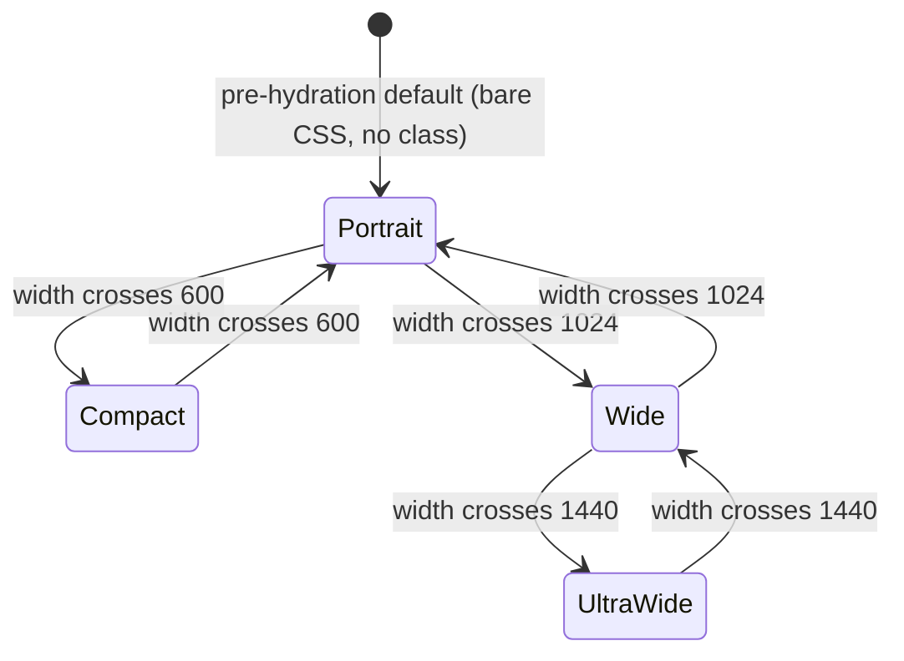
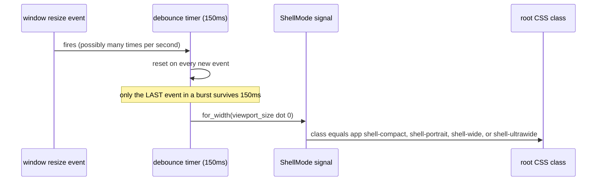

# M1.12 — the adaptive shell, sub-project 1: `ShellMode` and the four layouts

**Status:** approved by Tom, 2026-07-28. Ready for `writing-plans`.
**Issue:** #65 (M1.12), first of six decomposed sub-projects (see `handoff.md`).
**Depends on:** nothing. This is the foundation everything else in #65 keys off.

## Context

`crates/git-vista/styles.css` has zero responsive breakpoints today — one layout at
every window size, from a narrow Stage Manager split to an external monitor.
`docs/IPAD_DESIGN.md:30` specifies four distinct layouts the product actually needs.
This sub-project closes that gap: nothing about detents, accessibility, state
preservation, density, or PWA behaviour is in scope here — those are sub-projects
2 through 6.

## Decision already made — Rust owns the mode

A `ShellMode` signal lives in Rust. Its value becomes a single CSS class on the root
element. The stylesheet keys off that class and uses **no `@media` queries for mode
at all**. Rejected: a hybrid where CSS owns pure layout and Rust only drives
behavioural differences — a breakpoint duplicated in both places (a `768px` in CSS,
a `760px` in Rust) creates a band of widths where the two disagree, a bug that only
reproduces at one exact window size. One decider, one answer, always.

## The enum and its breakpoints — approved

```rust
// crates/git-vista/src/features/shell/core.rs

#[derive(Debug, Clone, Copy, PartialEq, Eq)]
pub enum ShellMode {
    Compact,
    Portrait,
    Wide,
    UltraWide,
}

impl ShellMode {
    pub fn for_width(width: f64) -> Self {
        if width < 600.0 {
            Self::Compact
        } else if width < 1024.0 {
            Self::Portrait
        } else if width < 1440.0 {
            Self::Wide
        } else {
            Self::UltraWide
        }
    }

    pub fn css_class(self) -> &'static str {
        match self {
            Self::Compact => "shell-compact",
            Self::Portrait => "shell-portrait",
            Self::Wide => "shell-wide",
            Self::UltraWide => "shell-ultrawide",
        }
    }
}
```

| Variant | Width | Serves |
|---|---|---|
| `Compact` | `< 600` | narrow Stage Manager / split (320–375pt) |
| `Portrait` | `600 – 1023` | iPad portrait (834pt), medium split (507–678pt) |
| `Wide` | `1024 – 1439` | iPad landscape (1194pt) |
| `UltraWide` | `≥ 1440` | external monitor — a web app can only ever see a width, never that a display is external, so this name says only what's actually knowable |



`for_width` is a **pure function** — no `#[cfg]`, host-testable, no wasm dependency.
This is the ADR 0024 pattern (`core.rs` framework-free, `signals.rs` thin wasm glue)
already used in M1.11 and already present in this same `features/shell/` module for
the overlay stack.

**Boundary chosen deliberately, not hedged:** 600px cuts through iPad's *medium*
split-screen band (507–678px), so the same physical configuration can land in
`Compact` at 520px and `Portrait` at 650px. Approved anyway — responding to actual
available space is more honest than a device label, and the cost (one Apple-named
size band tests as two layouts) is bounded.

## No hysteresis — debounce instead

`for_width` never consults history — the same width always yields the same mode.
Stability under a Stage Manager drag comes from **debouncing** the resize signal,
not from sticky enter/exit thresholds:

```rust
// crates/git-vista/src/features/shell/signals.rs (wasm32 only)

pub fn install_mode_signal() -> RwSignal<ShellMode> {
    let mode = create_rw_signal(ShellMode::for_width(gestures::viewport_size().0));
    if let Some(win) = web_sys::window() {
        let timer: Rc<RefCell<Option<i32>>> = Rc::new(RefCell::new(None));
        let cb = Closure::<dyn FnMut()>::new(move || {
            if let Some(id) = timer.borrow_mut().take() {
                win_for_clear.clear_timeout_with_handle(id);
            }
            let mode = mode; // captured
            let inner = Closure::once(move || mode.set(ShellMode::for_width(gestures::viewport_size().0)));
            let id = win.set_timeout_with_callback_and_timeout_and_arguments_0(
                inner.as_ref().unchecked_ref(), 150,
            ).ok();
            inner.forget();
            *timer.borrow_mut() = id;
        });
        let _ = win.add_event_listener_with_callback("resize", cb.as_ref().unchecked_ref());
        on_cleanup(move || { /* remove_event_listener_with_callback, mirroring gestures.rs's install_resize_listener */ });
    }
    mode
}
```



Reuses `gestures.rs:33`'s `viewport_size()` (already handles the iOS `visualViewport`
vs `inner_width` distinction — a menu-placement helper, and the exact same "what's
actually on screen right now" question this needs) rather than a second
width-reading path. Reuses the add-listener/`on_cleanup`/remove-listener shape from
`gestures.rs:234`'s `install_resize_listener` rather than inventing a new pattern.

**Rejected: hysteresis** (sticky enter/exit thresholds). It would fully suppress
flip-flop during a slow drag across a boundary, where 150ms debouncing only
suppresses the high-frequency case. Rejected anyway: hysteresis makes mode a
function of `(width, previous_mode)` rather than `width` alone, so one width has two
possible answers depending on approach direction — exactly the property that made
Rust-owns-the-signal worth choosing over the hybrid in the first place. If real
device testing shows the slow-drag case is actually a problem, that is a finding to
bring back, not a risk to design around blind now.

## Pre-hydration default

Before the WASM bundle loads, or if it fails, there is no `ShellMode` and therefore
no mode class. `index.html`'s `<body>` (currently empty, `mount_to_body` populates
it) gets no default class and no inline script computing one. The bare stylesheet —
no mode class present — must render as a legitimate single-column layout. This is
correct at every width, just not optimal for the hydration window, and it costs zero
duplication.

**Rejected:** a hard-coded default class (wrong on the most common device, iPad
portrait, on every load) and an inline `<script>` computing the class from
`innerWidth` before WASM loads (relocates the exact CSS/Rust duplication problem
that got the hybrid design rejected into `index.html` instead).

## Wiring into `App`

`crates/git-vista/src/app/mod.rs`'s root view is `<main class="app">` (line 388).
`ShellMode` is provided as context alongside the existing `Activity` / `Dialogs`
feature signals, and the root class becomes reactive:

```rust
let mode = features::shell::signals::install_mode_signal();
provide_context(mode);

view! {
    <main class=move || format!("app {}", mode.get().css_class())>
```

## The four layout skeletons

Each mode's CSS lives under its class, replacing the single unconditional layout.
Content per `docs/IPAD_DESIGN.md:30`'s existing ASCII specs:

- **`.shell-wide`, `.shell-ultrawide`** — three columns: left rail (repository /
  worktree selection), center canvas (graph, status, diff — unchanged from today),
  right inspector. `UltraWide` differs from `Wide` only in density (tighter grid,
  more visible rows) — same skeleton, not a fifth layout. Density tuning itself is
  sub-project 5's job; this sub-project only needs the skeleton to exist and accept
  a density variant later without restructuring.
- **`.shell-portrait`** — single column: header strip, graph/status/diff surface,
  contextual action dock, inspector as a bottom sheet. **The bottom sheet itself
  (detents, drag) is sub-project 2** — this sub-project's job is only that the
  inspector's dock resolves to *something* coherent in this mode (even a naive
  fixed-height panel is an acceptable placeholder) rather than trying to render the
  three-column skeleton in one column.
- **`.shell-compact`** — same single-column shape as `Portrait`, tuned for "one
  primary task visible at a time" per the spec's own wording — less simultaneous
  chrome than `Portrait` allows.

**Explicitly out of scope for this sub-project:** the `Dock` enum in
`features/shell/core.rs` currently resolves `RightEdge` unconditionally to the right
panel gutter. Making `RightEdge` mode-aware (or introducing a `BottomSheet` dock) is
sub-project 2's design question — this sub-project ships the mode signal and the
CSS skeletons; the dock-resolution rewrite is deliberately deferred so this slice
stays shippable on its own.

## Testing

- `ShellMode::for_width` — table-driven over the four boundaries and their
  midpoints, host-testable, no wasm target needed.
- `css_class()` — one assertion per variant.
- Debounce timing is wasm-only and needs a `wasm-bindgen-test` (or manual device
  verification, noted honestly if automated coverage isn't practical) rather than a
  host test.
- Visual: each of the four modes renders without layout breakage at its
  representative width (834/1194/1024/1440+), verified in a real browser per the
  project's UI-testing standard (drive it, don't just trust unit tests).

## Definition of done

- `ShellMode` in `core.rs`, table-tested.
- `install_mode_signal` in `signals.rs`, debounced, cleaned up on drop.
- `App`'s root class reactive to mode.
- Four CSS skeletons replacing the single unconditional layout, each rendering
  coherently (not perfectly finished — detents/density/accessibility land in later
  sub-projects) at its representative width.
- `./dev gate` green.
