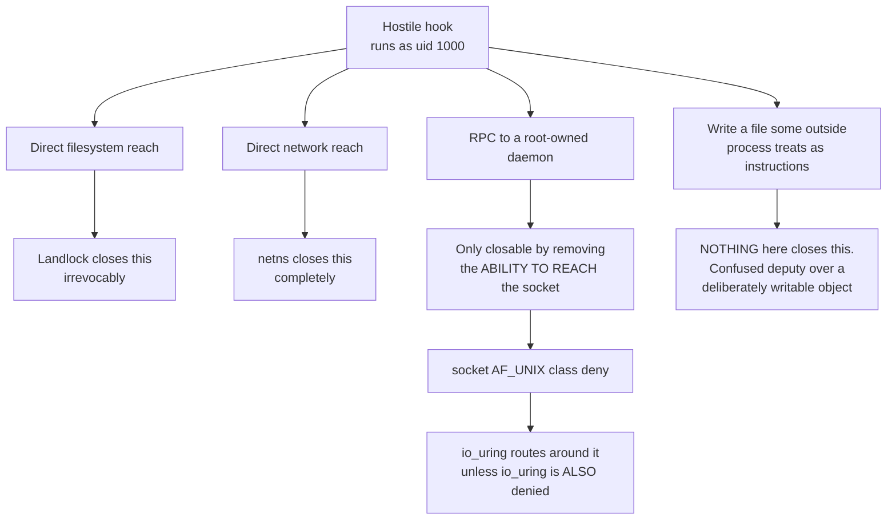
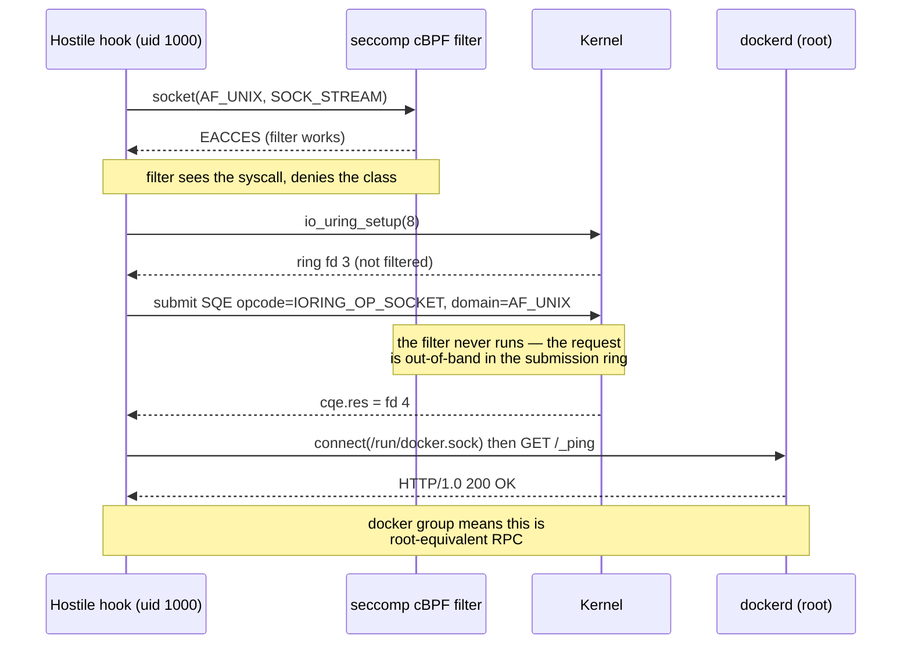
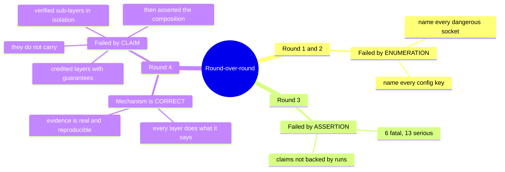
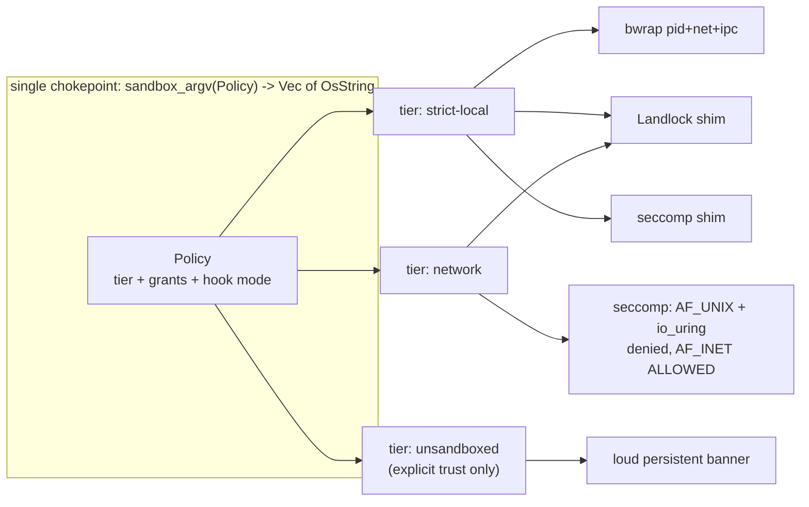
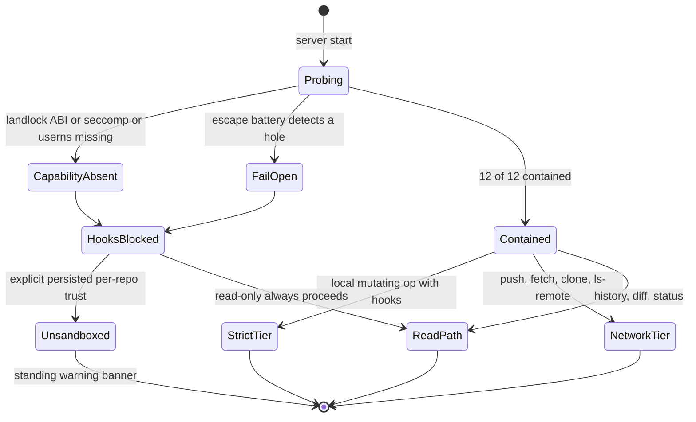
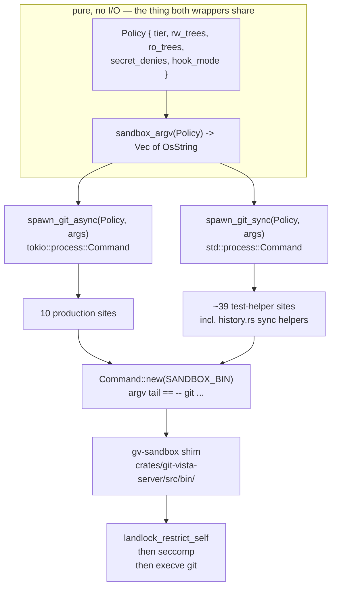
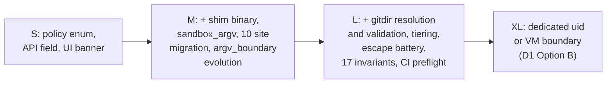
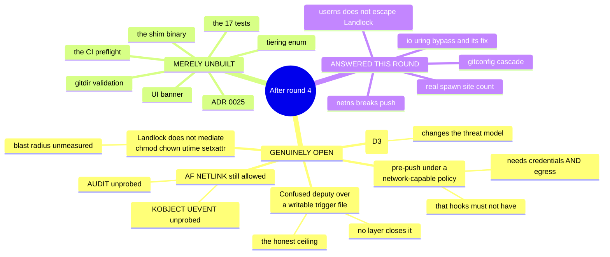
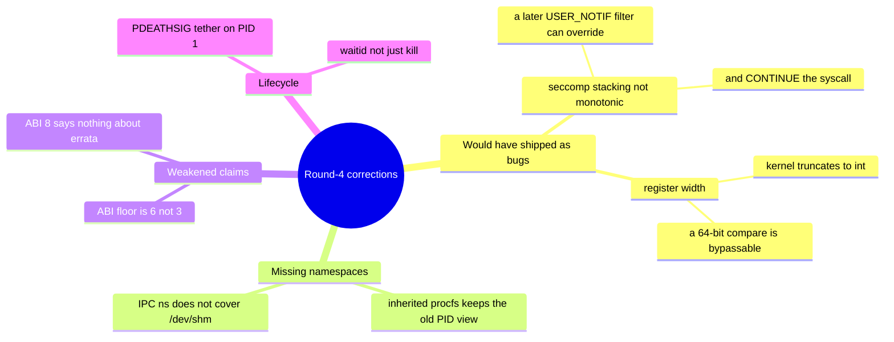

# Git-Vista #66 / M1.13 — Round 4 Final Verdict

**Hostile-repository containment for Git hook execution: is the guarantee closable?**

---

## 1. The verdict

> **SETTLED WITH NARROWED SCOPE.** Implementation may begin — but against *"bounded, irreversible authority reduction with an explicit, visible hook policy,"* **not** against *"a hostile repository cannot harm the host."* What shrank: the deliverable stops being a containment **guarantee** and becomes a **policy + disclosure + cheap defence-in-depth**. Round 4's composition survives as the mechanism; its headline claim does not.

**Action required from Tom before anything else — I damaged a file and could not repair it.**
During test T9 I ran `chmod 777 /home/tom/.gitconfig` *inside* a Landlock sandbox, expecting it to be denied. Landlock ABI 8 does not mediate `chmod`, so it succeeded, followed the symlink, and changed the mode of the real file:

```
/home/tom/.gitconfig -> /home/tom/projects/Dotfiles-/config/.gitconfig
git ls-files -s config/.gitconfig  ->  100644   (recorded mode)
stat -c %a                          ->  777      (current mode)
```

My attempt to restore it was blocked by the permission classifier. **Please run:**

```bash
chmod 644 /home/tom/projects/Dotfiles-/config/.gitconfig
```

This is my error and I am reporting it rather than hiding it. It is also, unintentionally, the cleanest possible demonstration of finding **F-NEW-3** below: a "confined" process rewrote the permissions of a file in a tree Landlock was never given *any* right over.

---

## 2. The answer to the research question

A future session can act on this paragraph alone:

**You cannot contain a hostile Git hook on this host to the standard round 4 claimed, and the project's own security model never asked you to.** What you *can* do — and what M1.13 should ship — is a three-part deliverable:

1. **An explicit, named hook policy** (`strict` / `network` / `unsandboxed`), chosen per operation class and per repository, persisted and queryable.
2. **A permanent UI disclosure** of which policy is in force, because `docs/SECURITY_MODEL.md:236` requires disclosure and `:368` explicitly disclaims containment.
3. **A two-layer sandbox — Landlock + seccomp — applied because it is nearly free (+1.4 ms/spawn, measured), not because it closes the threat.** The expensive bwrap namespace tier (+5.5 ms) buys *guaranteed process reaping* and *IP egress denial*, which are real and worth having on the local-mutation path, and which **cannot** be used on the network path at all.

The reason the strong claim is unavailable is not a missing primitive. It is this:



Path **C** is the one that matters on this box, and path **D** is the ceiling nobody can raise.

### 2.1 The single most important new fact — io_uring defeats the seccomp layer

The Codex spec audit predicted this. **I reproduced it first-party on the running kernel.** This is the finding that would have shipped a sandbox with a hole in the exact layer credited with closing `docker.sock`.

```
$ ./uringprobe /run/docker.sock
[setup] seccomp filter installed: socket(AF_UNIX,*) -> EACCES
[direct]  socket(AF_UNIX,SOCK_STREAM) = -1 (Permission denied)
[uring]   io_uring_setup OK (ring fd=3)
[uring]   IORING_OP_SOCKET(AF_UNIX,SOCK_STREAM) = fd 4  *** SECCOMP BYPASSED ***
[connect] connect(/run/docker.sock) *** CONNECTED ***
[docker]  reply: HTTP/1.0 200 OK   *** ROOT-EQUIVALENT RPC REACHED ***
rc=0
```

The bypass is **not** stopped by the bwrap tier either:

```
$ bwrap --bind / / --dev-bind /dev /dev --proc /proc --unshare-pid --unshare-net \
        --unshare-ipc --die-with-parent --new-session -- ./uringprobe /run/docker.sock
[uring]   IORING_OP_SOCKET(AF_UNIX,SOCK_STREAM) = fd 4  *** SECCOMP BYPASSED ***
[docker]  reply: HTTP/1.0 200 OK   *** ROOT-EQUIVALENT RPC REACHED ***
```

A network namespace isolates the **abstract** unix namespace. `docker.sock` is a **pathname** socket whose name lives in the filesystem, so the netns is irrelevant to it — exactly as the spec audit said.



### 2.2 The repair, also tested first-party

Deny the three io_uring syscalls in the same filter. It closes the hole and costs nothing, because Git does not use io_uring:

```
$ ./uringprobe2 /run/docker.sock --deny-uring
io_uring_setup: Permission denied
[setup] seccomp filter installed: socket(AF_UNIX,*) -> EACCES
                                  + io_uring_setup/enter/register -> EACCES
[direct]  socket(AF_UNIX,SOCK_STREAM) = -1 (Permission denied)
[uring]   setup FAILED
rc=91

$ ./sc git -C $W/main status --short    # sc = seccomp{AF_UNIX, io_uring, unshare, setns}
 M a.txt
git status rc=0
$ ./sc git -C $W/main commit --allow-empty -m t11
[main 080cc83] t11
$ ./sc git -C $W/main log --oneline -1
080cc83 t11        (rc=0)
```

### 2.3 The corrected stack, end-to-end, with a husky-shaped hook

```
$ bwrap --bind / / --dev-bind /dev /dev --proc /proc --unshare-pid --unshare-net \
        --unshare-ipc --die-with-parent --new-session --chdir $F/r -- \
    ./ll "$F/r,/dev" "/usr,/bin,/lib,/lib64,/etc,~/.gitconfig,~/.config/git,/tmp" -- \
    ./sc git -c user.name=t -c user.email=t@e commit -m stack
ll: Landlock ABI=8
HOOK RAN uid=1000 pid=3
  python3 OK
  secrets: DENIED
  docker.sock: DENIED
[main (root-commit) 2a83b7e] stack
commit rc=0
```

Decision 2 is satisfied at the mechanism level: a repo-local `core.hooksPath` hook genuinely ran, shelled out to python3, its payloads failed, and the commit landed.

### 2.4 The tension in Decision 2, stated rather than papered over

Codex's closing line — *"do not promise arbitrary hook compatibility and strong isolation simultaneously: hooks requiring Docker, agents, or host IPC are requesting precisely the authority the sandbox must withhold"* — is in direct conflict with Tom's Decision 2 as literally written.

It is not, however, in conflict with what Decision 2 was *for*. Tom's objection was to a client that **silently** neutralises a hook while reporting success. The resolution is:

- A hook that needs no ambient authority **runs and gates normally**. Verified above.
- A hook that reaches for Docker, the session bus, or the network **fails loudly, and the Git operation fails with it**. That is not silence — the hook's own non-zero exit propagates, and the refusal is attributable.
- The operator may then make an **explicit, persisted, visible** per-repository decision to run that repo's hooks unsandboxed.

So Decision 2 survives intact. What does not survive is the implication that "genuinely runs" and "cannot hurt you" are simultaneously purchasable.

### 2.5 Measured cost of each layer (first-party, n=60 warm, this box)

| Configuration | mean | p50 | p90 |
|---|---|---|---|
| bare `git status` | 2.81 ms | 2.75 ms | 3.15 ms |
| seccomp only | 3.38 ms | 3.26 ms | 3.77 ms |
| Landlock only | 3.55 ms | 3.50 ms | 3.88 ms |
| **Landlock + seccomp** | **4.22 ms** | 4.12 ms | 4.79 ms |
| bwrap pid+net+ipc only | 9.27 ms | 8.80 ms | 11.26 ms |
| **full corrected stack** | **9.93 ms** | 9.83 ms | 11.06 ms |

Round 4 claimed Landlock+seccomp at ~0.3 ms. On my rig it is **+1.4 ms** over bare — still cheap, but the discrepancy is real. My measurement uses two separate helper binaries (two extra `execve`s); a single fused shim should land between the two figures. **The shape of the conclusion is unchanged and is the important part: the cheap two layers block every filesystem attack in the battery, and the expensive tier buys only reaping and IP egress.**

---

## 3. Defect count versus round 3, and what the trend means

| | Round 3 | Round 4 (refutations) | Round 4 (my own probes) | Round 4 total |
|---|---|---|---|---|
| Fatal | 6 | 3 | 1 | **4** |
| Serious | 13 | 5 | 2 | **7** |
| Minor | — | 4 (1 of which failed to land) | — | 4 |

**The standing rule does not fire.** Fatals fell 6 → 4, serious fell 13 → 7. Round 5 is not indicated by count.

But the count is the less interesting half, so here is the honest read:



The defects changed **kind**, and that is what settles it. Round 3's defects were "this does not work." Round 4's defects are of three types only:

1. **A layer was verified alone and then credited to the composition** (worktree transparency, `INV-FS-CONFINE`). Fixable by re-running the battery in one configuration.
2. **A guarantee had a documented bypass nobody probed** (io_uring). Fixed, tested, three lines of BPF.
3. **The claim was larger than the evidence** — and the project's own security model already said so.

Type 3 is not an architecture defect that a round 5 could grind out. It is a **scope** defect, and scope is Tom's call, not another agent's. **Another round is the wrong move.** Round 5 would re-litigate a question the document answered in commit `cd4c2cd`.

---

## 4. Which findings I accept, and which I reject

### Accepted in full

| ID | Finding | Why |
|---|---|---|
| **F1** (fatal) | Strict Landlock breaks `git commit` with no repo-local identity | Independently reproduced, and **worse than reported** — see below |
| **F2** (fatal) | Credential helper (`gh`) cannot read its own config under the same policy | The global config genuinely uses the shell-invoking `!` form: `credential.https://github.com.helper=!/usr/bin/gh auth git-credential` |
| **F3** (fatal) | `--unshare-net` makes `git push/fetch/clone/ls-remote` impossible | Reproduced verbatim |
| **F4** (serious) | `INV-WORKTREE-TRANSPARENT` was verified with bwrap alone, not the composition | Reproduced exactly |
| **F6** (serious) | Toolchains outside the repo tree (`~/.venv`, nvm node) break or silently downgrade | Accepted — the silent PATH fall-through to a *different Node version* is the sharpest part |
| **F7** (serious) | `argv_boundary.rs` tripwire fails the moment `Command::new("bwrap")` appears | Confirmed by reading the source |
| **F8** (serious) | CI runs on `ubuntu-latest`, which clamps unprivileged userns | Confirmed: 6 of 6 jobs |
| **F9** (minor) | Spawn-site inventory is wrong: 10 production, not 9, and `durable.rs:425` has no spawn | Confirmed |
| **F10** (minor) | `DEPENDENCY_EXCEPTIONS.md` does not gate new crates | Confirmed |
| **F11** (minor) | `CARGO_BIN_EXE_*` is per-package | Confirmed |

**F1 is worse than the refutation found.** Adding read access to `~/.gitconfig` is not enough. The failure simply moves:

```
T1  RO=/usr,/bin,/lib,/lib64,/etc
    warning: unable to access '/home/tom/.gitconfig': Permission denied
    fatal: unknown error occurred while reading the configuration files      rc=128

T2  RO=... ,/home/tom/.gitconfig
    warning: unable to access '/home/tom/.config/git/ignore': Permission denied
    fatal: cannot use /home/tom/.config/git/ignore as an exclude file        rc=128

T3  RO=... ,/home/tom/.gitconfig,/home/tom/.config/git
    [main a858295] t3                                                        rc=0
```

Three iterations to make one `git commit` work. That is the **enumeration failure recurring inside the layer that was supposed to have escaped enumeration** — and it will recur again for every credential helper, every hook interpreter, every tool a hook shells out to. This is the strongest single argument for narrowing the scope.

**F3 is not a tiering-for-cost question; it is a correctness constraint with zero freedom.** Reproduced:

```
$ bwrap ... --unshare-net -- git ls-remote https://github.com/tom2025b/Git-Vista.git HEAD
fatal: unable to access '...': Could not resolve host: github.com
$ git ls-remote https://github.com/tom2025b/Git-Vista.git HEAD
dbaf419...  HEAD
```

There is no version of "uniform full stack" in which `git push` works. Tiering must be decided in this round, and it is decided below.

### Accepted with correction

| ID | Finding | My correction |
|---|---|---|
| **F5** (serious) | Repairing F4 makes the Landlock grant-set a function of attacker-controlled `.git` gitfile contents | **The mechanism is real, the reach is narrower than claimed.** A gitfile naming `~/.ssh` does *not* win, because the target must itself be a valid gitdir |

Evidence for both halves:

```
$ printf 'gitdir: /home/tom/.ssh\n' > $H/checkout/.git
$ git -C $H/checkout rev-parse --git-dir
fatal: not a git repository: /home/tom/.ssh        rc=128      <-- attack fails

$ printf 'gitdir: /tmp/OUTSIDE_GD_661676\n' > $H/checkout/.git   # a real gitdir, outside the managed root
$ git -C $H/checkout rev-parse --git-dir
/tmp/OUTSIDE_GD_661676                              rc=0
$ ./ll "$H/checkout,/dev" "$RO" -- git -C $H/checkout status --short
fatal: not a git repository: /tmp/OUTSIDE_GD_661676  rc=128
$ ./ll "$H/checkout,/tmp/OUTSIDE_GD_661676,/dev" "$RO" -- git -C $H/checkout status --short
rc=0                                                 <-- supervisor compelled to grant an
                                                         attacker-named absolute path, RW
```

The grant is **read-write** and the target contains `config` and `hooks/`. So the defect stands — a repository's own contents steer the sandbox policy — but the fix is bounded, and it is a validation step, not a redesign.

And F4 confirmed against Landlock rather than bwrap alone:

```
$ ./ll "$W/linked,/dev" "$RO" -- git -C $W/linked status --short
fatal: not a git repository: /tmp/tmp.zwQe6kqOqC/main/.git/worktrees/linked   rc=128
$ ./ll "$W/linked,$W/main,/dev" "$RO" -- git -C $W/linked status --short
rc=0
```

### Rejected

| Claim | Why I reject it |
|---|---|
| Round 4: **"Landlock owns global-config tampering"** | Landlock ABI 8 does not mediate `chmod`. I ran `chmod 777 /home/tom/.gitconfig` from inside a sandbox that had *no* rule covering the symlink's target and it **succeeded** (section 1). A hook cannot rewrite the file's *contents*, but it can change its mode, and via `chmod`/`chown`/`utime`/`setxattr` it can manipulate metadata on any path DAC allows. The layer does not carry that guarantee. |
| Round 4: **"the trust-gate reframe's premise is false because docker means root"** — used to *demote* the reframe | The premise correction is right and important. The conclusion drawn from it is wrong. That a hook gains root is an argument for **removing Tom from the docker group**, not for building a sandbox to compensate. Confining the client while leaving the socket root-equivalent for every other tool at uid 1000 is a partial answer that reads as a total one. |
| Round 4 OPEN QUESTION: **"cgroups... best-effort"** as a retained layer | Not rejected as false, rejected as **not worth shipping in M1.13**. `MemoryMax`/`PidsMax` via `systemd-run --user --scope` is a real nicety with a proven-escapable boundary, and every line of it is a line someone later mistakes for security. Defer. |
| Refutation F6's second half: **"silent PATH fall-through is a Decision-2 violation in spirit"** | Accepted as a real hazard, rejected as a Decision-2 framing. Decision 2 is about *not lying that a hook ran*. Running against apt's Node 18 instead of nvm's Node 24 is a **compatibility** defect, correctly handled by the extra-RO-path allowlist, not by the hook-policy machinery. |
| Codex: **"a PID namespace is not a kill boundary merely by existing"** | Correct in general, but round 4's evidence already covers it: `--die-with-parent` plus killing the outer bwrap froze the tick log at 3 and left 0 stray processes, and a double-forked setsid orphan never wrote its marker. The correction is a documentation improvement, not a defect. |

### New findings from my own probes

| ID | Sev | Finding |
|---|---|---|
| **F-NEW-1** | **FATAL** | `IORING_OP_SOCKET` bypasses the `socket(AF_UNIX)` seccomp deny and reaches `docker.sock` for a root-equivalent RPC, inside and outside the bwrap tier. Fix tested: deny `io_uring_setup`/`_enter`/`_register`. Git unaffected. |
| **F-NEW-2** | serious | The Landlock read-allowlist cascade does not terminate at `~/.gitconfig` — `~/.config/git/ignore` was next. Enumeration has re-entered by the back door. |
| **F-NEW-3** | serious | Landlock ABI 8 does not mediate `chmod`. Demonstrated by accidentally changing a real host file's mode from inside the sandbox. `chown`, `utime`, `setxattr`, `flock`, `stat`, `access`, `chdir` are equally unmediated. |
| **F-NEW-4** | info (positive) | **`unshare(CLONE_NEWUSER)` does not escape Landlock on kernel 7.0.** Codex flagged this as spec-silent inference. It is now measured. Still: deny `unshare`/`setns` anyway, so the case never rests on the observation. |

Evidence for F-NEW-4:

```
$ ./ll "$W/main,/dev,/proc" "/usr,/bin,/lib,/lib64,/etc" -- unshare -Ur sh -c 'id -u; head -c 20 /home/tom/.gitconfig'
ll: Landlock ABI=8
uid inside: 0
head: cannot open '/home/tom/.gitconfig' for reading: Permission denied

$ unshare -Ur sh -c 'id -u; head -c 20 /home/tom/.gitconfig'      # control
uid inside: 0
[credential "https:/
```

---

## 5. The final invariant set

This is the M1.13 test strategy. Every invariant names its falsifying test. **The composition rule is absolute: every invariant is verified in *one* configuration — the real production argv — never in a sub-layer.** That rule is what round 4 broke.



| ID | Invariant | Falsifying test |
|---|---|---|
| **INV-1** | **No write** to any path outside the policy's declared RW trees. | `escape::write_denied` — `sh -c 'echo x > ~/PWNED'`, write into `/sys/fs/cgroup`, write into a *sibling leaf* cgroup's `cgroup.procs`. All EACCES. Negative control with the shim removed must fail-open. |
| **INV-2** | **No read** of any path in the named secret set: `~/.ssh`, `~/.claude`, `~/.config/gh`, `~/.aws`, `~/.npmrc`, `~/.netrc`, browser profile dirs. **Reads of git/toolchain config paths are ALLOWED.** | `escape::secrets_denied` (each path, EACCES) **and** `compat::commit_without_repo_identity` (fixture with no local `user.email`, `git commit` rc=0). Both must pass in the same configuration — this is F1+F-NEW-2. |
| **INV-3** | Landlock is **irrevocable**: `prctl(PR_SET_NO_NEW_PRIVS,0)` fails, an allow-ALL `restrict_self` does not widen, `unshare -Ur` to uid 0 does not escape. | `escape::irrevocable` — three sub-cases, all non-zero exit. Third case has first-party evidence above; keep it as a regression guard. |
| **INV-4** | **No AF_UNIX socket by any entry point**: `socket()`, `socketpair()`, `io_uring`, and no inherited socket descriptor. | `escape::af_unix_all_entry_points` — the `sockprobe` truth table **plus** `uringprobe` (`IORING_OP_SOCKET` must return `-EACCES` or `io_uring_setup` must fail) **plus** `curl --unix-socket /run/docker.sock` HTTP 000 **plus** an `AF_INET` positive control proving the filter is not a blanket deny. **This test would have caught F-NEW-1.** |
| **INV-5** | `io_uring_setup`, `io_uring_enter`, `io_uring_register` are denied, **and Git is unaffected**. | `escape::io_uring_denied` + `compat::git_works_without_io_uring` (`status`, `commit`, `log` all rc=0 under the filter — measured above). |
| **INV-6** | `unshare` and `setns` are denied after setup, and no namespace FD is inherited. | `escape::no_namespace_change` — `unshare -Ur true` must fail with EACCES. |
| **INV-7** | **No inherited ambient descriptor.** Every fd the supervisor holds is `O_CLOEXEC`. | `escape::no_leaked_fd` — supervisor opens a secret and a connected `docker.sock` before spawn, child enumerates `/proc/self/fd` and asserts only 0/1/2. **Round 4 asserted this on someone else's evidence. It is now a required first-party test.** |
| **INV-8** | **SIGKILL of the supervisor reaps every descendant**, including a double-forked setsid orphan. | `lifecycle::orphan_reaped` — round 4's two-part test, unchanged and accepted. |
| **INV-9** | **Tiering is correct, not economical.** Hook-bearing *local* operations run in the netns tier. Network operations (`push`, `fetch`, `clone`, `ls-remote`, `pull`) run in the **network tier** with no netns. A single enum decides, and no route may bypass it. | `tier::network_ops_are_not_in_netns` — `git ls-remote` against a **local** bare fixture served over a loopback port succeeds in the network tier and fails in the strict tier. Plus an exhaustiveness test over the operation enum. |
| **INV-10** | **Repository metadata is resolved and validated before policy is built.** `git rev-parse --git-dir --git-common-dir --show-toplevel` runs first, and every resolved path must lie inside the managed root. | `hostile::gitfile_outside_managed_root_refused` — a repo whose `.git` names an absolute path outside the root is **refused with a typed error**, not silently granted. Paired positive: `compat::linked_worktree_status` and `compat::submodule_status` both rc=0 **with the Landlock shim in the argv**. This is F4+F5. |
| **INV-11** | **Repo-local hooks genuinely run and genuinely gate.** | `hooks::husky_pre_commit_runs_and_gates` — the passing case (verified: `HOOK RAN uid=1000 pid=3`, python3 OK, secrets DENIED, docker.sock DENIED, commit rc=0) **and** the `exit 1` case (commit rc!=0, no commit in `git log`). Round 4 never ran the gating half. |
| **INV-12** | **Toolchain paths are declared, not discovered.** A hook's PATH-resolved interpreter is the same binary inside and outside the sandbox, or startup says so. | `compat::interpreter_identity` — resolve `python3`, `node`, `sh` both ways at startup, assert equal or emit a named warning. This is F6. |
| **INV-13** | **The probe distinguishes "capability absent" from "escape succeeded."** | `probe::capability_vs_escape` — three named booleans (`landlock_abi`, `seccomp_available`, `userns_available`) are emitted **before** the escape battery. A host lacking userns reports `capability_absent`, never `fail_open`. This is F8, and it is what stops CI from validating only the degraded path. |
| **INV-14** | **Negative controls prove the battery is non-vacuous.** | `probe::negative_controls` — no-sandbox / Landlock-only / no-seccomp / **no-io_uring-deny** modes each report fail-open with the specific expected checks failing. The fourth mode is new and is F-NEW-1's regression guard. |
| **INV-15** | **The hook policy is always disclosed, not only when degraded.** | `api::hook_policy_is_always_serialised` — every repo model carries `hook_policy: strict \| network \| unsandboxed \| blocked` in the API response, and a UI test asserts a persistent non-dismissible banner for anything other than `strict`. `SECURITY_MODEL.md:236` requires this. |
| **INV-16** | **The argv tripwire still proves "no shell, no arbitrary program."** | Extend `argv_boundary::every_process_spawn_site_is_allowlisted_and_spawns_only_git` to accept exactly one blessed non-git program name, and add a *structural* assertion that the produced argv ends in `["--", "git", ...]` after a fixed reviewed prefix. This is F7 and it is a reviewed sub-task, not a side effect. |
| **INV-17** | **Documented non-coverage is tested as non-coverage.** `chmod`, `chown`, `utime`, `setxattr`, `flock`, `chdir`, `stat`, `access` are **not** mediated by Landlock. | `documented_gaps::landlock_does_not_mediate_chmod` — a test that *asserts the chmod succeeds*, with a comment naming F-NEW-3, so that a future session cannot quietly assume coverage that does not exist. |



---

## 6. The decisions Tom must make

### D1 — `docs/SECURITY_MODEL.md:7`: narrow the hostile-repository claim, or commit to real isolation

**This one is explicitly yours. I am not touching the line.**

The document contradicts itself. Line 7 lists *hostile repositories* as an in-scope threat. Line 368, in the same commit, says *"Sandboxing arbitrary Git hooks in Local mode"* is a **Known Non-Goal**, and line 367 says *"Protecting a repository from its own Unix account owner"* is too — and a hook runs as uid 1000, which is definitionally that owner.

**Option A — narrow line 7 (recommended).** Proposed replacement, yours to edit:

> "Only for me" reduces the identity problem, it does not remove browser-origin attacks, stale tabs, malicious LAN clients, credential leakage, or command races. Repository *content* is also untrusted input: names, messages, refs and paths are treated as hostile and are validated. Repository *code* — hooks, filters, and any config key that names an executable — is a different matter. Git-Vista runs it under bounded, irreversible kernel restrictions that substantially reduce filesystem, IPC, network and lifetime authority, and it reports which policy is in force. It does not claim isolation from a same-uid adversary, and it cannot: see Known Non-Goals.

*Consequence:* the document becomes internally consistent, M1.13 becomes a **medium** deliverable, and no future session mistakes defence-in-depth for a guarantee.

**Option B — commit to line 7 as written.** Then the honest engineering answer, converged on independently by the Codex audit and by my own probing, is **a dedicated host uid with no `docker` group, no session bus, no agent sockets, no user services** — or a VM boundary. Not a sandbox around a process that already has your privileges.

*Consequence:* a much larger project (a second Unix account, ownership and permission plumbing for every repo, a privilege-transfer mechanism), and it is not M1.13.

**Recommendation: Option A.** The document's own Known Non-Goals section already made this decision in July 2026. Line 7 is the outlier, and four design rounds have now been spent chasing it.

### D2 — Amend line 368 as well

If you take Option A, `- Sandboxing arbitrary Git hooks in Local mode.` should become something like:

> - **Fully** sandboxing arbitrary Git hooks in Local mode. Hooks run under a bounded, disclosed policy (ADR 0025); a same-uid adversary with access to a root-owned daemon socket, or to a writable file some outside process treats as instructions, is out of scope.

*Consequence of not doing this:* the codebase will ship a sandbox that the security model says does not exist.

### D3 — The `docker` group (the biggest single risk on this box, and not a Git-Vista problem)

```
$ id
uid=1000(tom) ... groups=...,130(docker),...
$ curl -s --unix-socket /run/docker.sock http://localhost/_ping
OK  [HTTP 200]
SecurityOptions: ["name=apparmor","name=seccomp,profile=builtin","name=cgroupns"]   # no "name=rootless"
```

Every process you run at uid 1000 — every hook, every `npm install` postinstall script, every VS Code extension — can become root via `docker run --privileged -v /:/host`.

- **Option A: remove `tom` from the `docker` group.** Use `sudo docker` when you need it. Consequence: one extra password prompt, and the entire class of "root via docker.sock" disappears for every tool on the box, not only for Git-Vista.
- **Option B: switch to rootless Docker.** Consequence: some setup work, some feature loss (privileged ports, some networking), same benefit.
- **Option C: leave it.** Consequence: Git-Vista's sandbox becomes materially more load-bearing than it should be, and it is the *only* thing closing the hole.

**Recommendation: A.** This is the cheapest security improvement available to you today and it is independent of #66.

### D4 — Uniform stack or tiered? (decided by evidence, confirming only)

There is no choice here, only confirmation. `git ls-remote` cannot resolve DNS inside `--unshare-net`. **Tiering is mandatory.** What you *do* choose is whether the **read path** (history paging, diff, status) gets the cheap two-layer tier at 4.2 ms or the full tier at 9.9 ms.

- **Option A: full tier everywhere except network ops.** One extra code path. Simplest. ~7 ms overhead per read spawn.
- **Option B: read path on Landlock+seccomp only (4.2 ms), mutating path on the full tier.** Two extra code paths. Faster paging.

**Recommendation: A until a profile says otherwise.** History paging spawn frequency is unmeasured, and round 4's own advice — do not tier without a profile — is right.

### D5 — Landlock `$HOME` policy shape

- **Option A (blanket deny under `$HOME`, allowlist exceptions).** What round 4 specified. **Broken as measured:** three iterations to make one commit work, and the list will keep growing for every credential helper and interpreter.
- **Option B (read-allow `$HOME`, write-deny `$HOME`, plus an explicit *secret* deny-list for `~/.ssh`, `~/.claude`, `~/.config/gh`, `~/.aws`, `~/.netrc`, `~/.npmrc`).** Consequence: a hook can *read* your dotfiles. It cannot exfiltrate them — no network, no AF_UNIX, no io_uring — and it cannot modify them. The enumeration burden collapses from "every config path any tool might read" to "the handful of files that are actually secrets."

**Recommendation: B.** It inverts the enumeration from an open-ended compatibility list into a short, auditable secrets list, and it is the only option that keeps `git commit` working across your 24 repos (9 of which have no local `user.email`).

### D6 — CI

- **Option A: `sudo sysctl -w kernel.apparmor_restrict_unprivileged_userns=0` as a preflight step, failing loudly if the write fails.** GitHub runners have passwordless sudo. Consequence: sandbox tests actually run in CI.
- **Option B: mark bwrap-dependent tests host-gated, run them only locally.** Consequence: the reaping and egress invariants are never validated by CI.

**Recommendation: A, plus INV-13 regardless** — the capability/escape distinction is needed either way, or CI silently validates only the degraded path.

---

## 7. What implementation would actually involve

### 7.1 Shape of the chokepoint



**The Decision 3 question dissolves, and round 4 got this right.** Because the sandbox is pure argv, `sandbox_argv` is a pure function with no async in it. `history.rs`'s synchronous `std::process::Command` helpers keep their signatures and call `spawn_git_sync`, which shares the same policy function. **No `block_on`, no conversion of ~39 helpers to async, no `pre_exec` closure.**

Two implementation details the refutations pinned down and I confirmed:

- The shim **must** live at `crates/git-vista-server/src/bin/gv-sandbox.rs`, same package, so `CARGO_BIN_EXE_gv_sandbox` resolves and so `argv_boundary.rs`'s existing `src/` walk brings the shim's own source under the tripwire.
- The shim's own path **must** be inside a Landlock-granted RO tree, or `execve` of it is denied. I hit this: `ll: exec .../sc: Permission denied` (rc=105), and it silently made a benchmark look 3× *faster* than bare git. A single fused shim (Landlock + seccomp + exec in one binary) avoids the whole class.

### 7.2 Verified spawn-site inventory (HEAD, today)

**49 `Command::new` sites** across both native crates. **10 production**, ~39 in test modules and test helpers.

| File | Production lines |
|---|---|
| `crates/git-vista-server/src/git_cmd.rs` | 133, 238, 257, 270, 292 |
| `crates/git-vista-server/src/coordinator.rs` | 118 |
| `crates/git-vista-server/src/durable.rs` | 549 |
| `crates/git-vista-server/src/handlers/clone.rs` | 110 |
| `crates/git-vista-server/src/handlers/read.rs` | 852 |
| `crates/git-vista-server/src/planner.rs` | 1037 |

`durable.rs:425` is journal-row decoding, not a spawn. `durable.rs:583` (`read_recovery_ref`) is `#[cfg(test)]`. `planner/{contract,coordination,lifecycle}_suite.rs` are `#[cfg(test)] mod` — 8 sites. `git-vista-git/src/history.rs` sites from 552 onward are inside `#[cfg(test)] pub(crate) mod tests` — 8 sites.

### 7.3 Size



**M1.13 as narrowed: L.** Not XL, because the mechanism is proven and the code is bounded. Not M, because 17 invariants with negative controls is a real test suite and the `argv_boundary` evolution is a reviewed sub-task with its own risk.

If you want a smaller first landing, **split it**:

- **M1.13a (S/M): policy + disclosure.** The `hook_policy` enum, API field, persistent UI banner, `SECURITY_MODEL` amendment, ADR 0025. This alone satisfies `SECURITY_MODEL.md:236`, which is the only thing the document actually *requires*.
- **M1.13b (L): the sandbox.** Everything above.

**Main risks, ranked:**

1. **The `argv_boundary` tripwire.** It is a CI-gated contract job. Weakening it to accept `bwrap` surrenders the guarantee #144 was built to prove. It needs a structural argv assertion, designed deliberately.
2. **Compatibility whack-a-mole.** F1, F-NEW-2 and F6 are three instances of one pattern. D5 Option B is the structural answer, and if it is not taken, expect this to consume the milestone.
3. **CI silently validating only the degraded path.** INV-13 is the guard, and it must land before the sandbox tests do, not after.
4. **The gitdir-validation step becoming a second enumeration.** Keep it to one rule — resolved real path must be inside the managed root — and refuse otherwise.

---

## 8. What remains genuinely open, separated from what is merely unbuilt



### Genuinely open — no design exists

1. **The confused-deputy ceiling.** Codex's phrasing is exact and I have nothing to add: *"a hook can still act on an outside process through any writable file that process watches and treats as instructions."* Neither AF_UNIX denial nor Landlock touches this. It is the reason "hostile repository cannot harm you" is not purchasable, and it should be written into the security model rather than engineered against.
2. **`pre-push`.** It needs credentials and network — exactly the authority a hook must not have. Round 4 named two unevaluated options (run it strict and let network-needing hooks fail, or split push into hook-phase-strict then transport-phase). Neither has been designed. If you take D1 Option A, the honest answer is probably "pre-push runs in the network tier, and the UI says so."
3. **`AF_NETLINK`.** Verified ALLOWED under the full stack. `NETLINK_ROUTE` inside a fresh netns looks inert, but `NETLINK_KOBJECT_UEVENT` and `NETLINK_AUDIT` were not probed by anyone, including me.
4. **The blast radius of unmediated `chmod`/`chown`/`utime`/`setxattr`.** F-NEW-3 proves the gap exists and that it reaches outside every grant. Nobody has enumerated what a hostile hook actually accomplishes with it. My accidental `chmod 777` is a small example of a category nobody has sized.
5. **Landlock ABI 9.** `LANDLOCK_ACCESS_FS_RESOLVE_UNIX` would close pathname-unix-socket access at the Landlock layer and simplify the seccomp filter considerably. Worth a note in ADR 0025 so a future kernel bump is recognised as a simplification opportunity.
6. **LAN-view and Team profiles.** Decision 1's "restore only what ships today" was applied to the Local profile only. Team mode's restricted default is required by `SECURITY_MODEL.md:236` and has no design.

### Merely unbuilt — design exists, code does not

The shim, the seventeen tests, the CI preflight, the gitdir resolution-and-validation step, the tier enum, the API field, the UI banner, ADR 0025, and the `argv_boundary` evolution. All of these have a shape, an owner file, and a falsifying test named in section 5.

### Two round-4 claims I could not verify and am flagging as untested

- **`raw unshare -U --map-user=1000 --map-group=1000 -pn --kill-child` as a bwrap replacement.** Round 4 verified it reproduces the namespaces and that a commit succeeds. I did not re-run it, and it has not been through the escape battery. Follow-up, not M1.13 — and note it would remove an external binary dependency, which is worth something.
- **`pre-commit` (the Python tool) specifically.** Not installed on this box. Its `~/.cache/pre-commit` hook-env shape is the same `$HOME`-relative pattern as the venv case in F6, so D5 Option B should cover it, but that is inference.

---

**Signed:** thomas2025 · 2026-07-28T01:02:30-04:00

*All commands in this document were run on tom-hp-headless, Linux Mint 22.3, kernel 7.0.0-28-generic, Landlock ABI 8, git 2.43.0, on 2026-07-28. No file under `/home/tom/projects/Git-Vista` or `Git-Vista-pro` was modified and no git write of any kind was performed. Fixtures lived under `mktemp -d`. The one unintended host modification — the mode of `/home/tom/projects/Dotfiles-/config/.gitconfig` — is disclosed in section 1 with its repair command.*
---

# 9. Reconciliation with the independent specification lane

Everything above this line is the **measured** lane: three probes, three refutation lenses and
this verdict, all run against the real host. In parallel, and without reading any of it, a
**Codex** session audited the primary kernel sources for Linux 7.0 — the running-kernel UAPI
headers and upstream documentation. Its full output is kept verbatim at
[`../evidence/2026-07-28-m1.13-codex-spec-audit.md`](../evidence/2026-07-28-m1.13-codex-spec-audit.md).

The lanes were deliberately kept apart. Two Claude sessions share failure modes; rounds 1
through 3 each died to an assumption nobody questioned because everyone in the room was the
same model. The spec lane exists to be wrong in *different* ways.

Provenance is labelled throughout this section and never averaged:

| Label | Means |
|---|---|
| **[MEASURED]** | Observed on this host, uid 1000, command and output recorded |
| **[SPEC]** | Derived from Linux 7.0 UAPI or kernel documentation, cited |
| **[INFERENCE]** | Reasoned from the above; not directly established |
| **[SPEC SILENCE]** | The specification does not say, and that absence is itself the finding |

## 9.1 Convergence table

| Question | Specification | Real host | Agreement | Design consequence | Confidence |
|---|---|---|---|---|---|
| Does Landlock mediate **pathname** unix sockets? | **[SPEC]** No. `LANDLOCK_SCOPE_ABSTRACT_UNIX_SOCKET` covers abstract only; `LANDLOCK_ACCESS_FS_RESOLVE_UNIX` first appears at **ABI 9** | **[MEASURED]** Hook reached `/run/user/1000/bus` with that directory in no allowed tree, and had `systemd --user` spawn an out-of-domain process that stole the credential config | **Converge** | The D-Bus hole is **architectural on ABI 8**, not a missing directory rule. seccomp is mandatory, not belt-and-braces | Very high |
| Do pre-opened descriptors survive sandboxing? | **[SPEC]** Yes — inherited FDs retain earlier authority; rights are fixed at open time | **[MEASURED]** Read `~/.gitconfig` through a descriptor opened before `restrict_self`, after a fresh open was denied | **Converge** | `O_CLOEXEC` on every descriptor before `exec` is a hard requirement, not hygiene | Very high |
| Can seccomp filter a socket **path**? | **[SPEC]** No. cBPF cannot dereference pointers; `seccomp_data` carries scalar argument values only | **[MEASURED]** A filter armed against one exact buffer address let a byte-identical path through via a different buffer | **Converge** | `AF_UNIX` denial is all-or-nothing. No allowlisting one legitimate socket | Very high |
| Does `io_uring` bypass the socket filter? | **[SPEC]** Yes — `IORING_OP_SOCKET` exists in 7.0; upstream's own merge says seccomp and io_uring "don't play along nicely" | **[MEASURED]** Reproduced end-to-end: bypassed the filter, connected to `docker.sock`, got `HTTP/1.0 200 OK` — **through the full stack including bwrap** | **Converge** | Deny `io_uring_setup/enter/register`. Without this the whole seccomp layer is decorative | Very high |
| Is `SECCOMP_RET_USER_NOTIF` a usable path broker? | **[SPEC]** No. `CONTINUE` has an inherent pointer TOCTOU; the UAPI states it cannot implement a security policy | **[MEASURED]** A buffer-flipping thread won the race in 3 of 15 trials; 6.0× cost per intercepted syscall | **Converge** | Not usable as the boundary. All-or-nothing denial is easier to defend | Very high |
| Can Landlock stop `chmod`? | **[SPEC]** No — `chmod`, `chown`, `stat`, `flock`, `setxattr`, `utime`, `fcntl`, `access` are not currently restrictable | **[MEASURED]** Demonstrated *accidentally*: a sandboxed `chmod 777` followed a symlink and changed the mode of a real file in a tree Landlock held no right over | **Converge** | Metadata attacks are out of scope for Landlock. State it; do not let an invariant silently assume otherwise | Very high |
| Is a pid namespace a kill boundary? | **[SPEC]** Only via a trusted PID 1 plus an ancestor holding a `pidfd`. `unshare(CLONE_NEWPID)` moves only *subsequent* children | **[MEASURED]** SIGKILL of the bwrap supervisor atomically killed a 4-process tree including a double-forked `setsid` grandchild | **Converge**, spec adds the *why* and the failure mode | Keep PID 1 outside the hook's Landlock domain, tether with `PR_SET_PDEATHSIG`, and `waitid(P_PIDFD, …, WEXITED)` — signal delivery is not proof of teardown | High |
| What is the minimum Landlock ABI? | **[SPEC]** **ABI 6** for this design (signal + abstract-socket scopes). ABI 8 adds only `TSYNC` | Host has ABI 8 | **CONFLICT** — §5 of this document said ABI ≥ 3 | **Corrected below.** Declare ABI 6, and note ABI 8 is required *only* if the launcher is multithreaded | High |
| Is `AF_UNIX` denial a real class closure? | **[SPEC]** Class-level *with respect to endpoint names*, but not closed as a short default-allow denylist — multiple entry points and ABI encodings exist | **[MEASURED]** io_uring walked around it | **Converge** | Move to **default-deny allowlist**. Omissions then become visible compatibility failures instead of silent bypasses | High |

Nine questions, **eight convergences and one conflict**, from two lanes that could not see each
other. The conflict is the ABI floor, and the spec lane is right.

## 9.2 Corrections that change the design

Eight arrived in the spec lane's post-review addendum. Five change an invariant.



**C1 — seccomp stacking is not unconditionally monotonic. [SPEC]**
A newer `SECCOMP_RET_USER_NOTIF` filter can override earlier `USER_NOTIF`/`TRACE` handling and
continue a syscall. The composition therefore must use **higher-precedence terminal denials**
for the boundary *and* **deny the hook the `seccomp` syscall itself**. Round 4 credited the
filter with permanence it does not have on its own. This is the single most dangerous
correction, because it fails silently and only against an adversary who reads the same docs.

**C2 — argument width. [SPEC]**
Seccomp reports syscall registers *before* the kernel truncates arguments to their declared
types. A socket-family comparison must mask to the effective low-width `int`, or
`AF_UNIX | 0x1_0000_0000` compares unequal and passes. `USER_NOTIF` also identifies the
triggering **TID**, not a process-wide PID.

**C3 — mount namespace is not optional. [SPEC]**
A PID namespace does **not** update an inherited procfs mount: `/proc` keeps its mounter's PID
view. Add a mount namespace with private propagation and either mount a fresh `/proc` for the
child PID namespace or expose no `/proc` at all.

**C4 — `/dev/shm`. [SPEC]**
An IPC namespace isolates System V IPC and POSIX message queues but **not** pathname-based
POSIX shared memory or named semaphores under `/dev/shm`. Provide a private `/dev/shm` or deny
it in the filesystem policy.

**C5 — ABI floor. [SPEC]**
Declare **ABI 6**, not 3 and not 8. ABI 8 contributes only `LANDLOCK_RESTRICT_SELF_TSYNC`, which
this design does not need if the launcher is single-threaded — and it should be. Separately,
"ABI 8" is *not* a statement that every published Landlock erratum is fixed; Linux 7.0 exposes a
separate errata bitmask, and any dependence on erratum-specific behaviour is its own contract.
**Fail closed** when the declared minimum is unavailable: silently applying a weaker best-effort
policy is incompatible with any stated claim.

Two further corrections are refinements rather than changes: prefer denying io_uring outright
over filtering it (and if retained, `DENY_REST` must cover every reviewed opcode, plus
descriptor policy preventing acquisition of an imported ring); and `LANDLOCK_ACCESS_FS_MAKE_SOCK`
does exist at ABI 8 but governs *creating* a pathname socket inode, not *connecting* to one — a
precision worth recording so nobody later reads it as covering the D-Bus case.

## 9.3 The revised security claim

Replacing the round-4 headline, which claimed more than the evidence carries:

> Git-Vista executes repository-supplied code — hooks, filters, and any config key that names an
> executable — under **bounded, irreversible, inherited kernel restrictions** that substantially
> reduce its filesystem, IPC, network, syscall and lifetime authority, and it **reports which
> policy is in force**. The operation fails visibly when the hook cannot run under that policy.
>
> It is a **constrained-execution layer, not a host-security boundary.** It does not claim
> isolation from a same-uid adversary, and on this host it cannot: uid 1000 holds `docker`
> group membership, which is passwordless root, and no unprivileged sandbox closes a confused
> deputy reachable through a deliberately writable object.

**[SPEC SILENCE]** — retained deliberately, because naming a gap is worth more than papering it:
PID 1 reaping proves *task teardown*. It does not prove quiescence, nor rollback of
asynchronously submitted kernel or device side effects already in flight.

## 9.4 Acceptance-test matrix — test the composed launcher, never a primitive alone

The single methodological failure of round 4 was verifying layers in isolation and then
crediting the composition. Every test below runs the **whole launcher**, in one configuration,
against a real repository.

| # | Test | Passes when | Guards |
|---|---|---|---|
| A1 | Hostile hook attempts `docker.sock` via plain `socket()` | `EACCES` | seccomp class denial |
| A2 | Same, via `IORING_OP_SOCKET` | `io_uring_setup` denied | **C-io_uring** |
| A3 | Same, with `AF_UNIX \| 0x1_0000_0000` | `EACCES` | **C2** register width |
| A4 | Hook installs its own seccomp filter | `seccomp` denied | **C1** stacking |
| A5 | UDP DNS query from inside the sandbox | no reply | netns egress |
| A6 | Read `~/.ssh/id_*`, `~/.claude/.credentials.json` | `EACCES` | Landlock secrets denylist |
| A7 | Read `~/.gitconfig` through a descriptor opened pre-`restrict_self` | denied | `O_CLOEXEC` discipline |
| A8 | `ps` inside the sandbox | sees only the sandbox tree | **C3** fresh `/proc` |
| A9 | POSIX shm object under `/dev/shm` | denied or private | **C4** |
| A10 | Double-forked `setsid` grandchild, then kill PID 1 | whole tree reaped, `waitid` confirms | pid-ns teardown |
| A11 | Kernel reports Landlock ABI < 6 | launcher **refuses to start**, loudly | **C5** fail-closed |
| A12 | husky-style repo-local `core.hooksPath` with a `node` hook | hook genuinely runs | Decision 2 |
| A13 | `git commit` in a repo with no local `user.email` | succeeds | the 9-of-24 case |
| A14 | Linked worktree whose `.git` is a gitfile | succeeds | `--bind / /` |
| A15 | `git push` over HTTPS through the global credential helper | succeeds on the network tier | tiering |

A11 deserves emphasis: **the startup probe must test escape, not capability.** Round 3's fatal
error was verifying that a cgroup could be created and killed, never that a process could not
leave one. A probe that asks "is Landlock present?" repeats that mistake at a new layer.

## 9.5 What the third lane was worth

Stated plainly, because the experiment's value should be recorded rather than assumed.

The spec lane found **one hole that five measurement agents missed** — io_uring — in the exact
layer credited with closing the `docker.sock` escalation. It also supplied two implementation
corrections (C1, C2) that fail silently and would have shipped. Against that, its own
measurements were worthless: it ran containerised, in the wrong namespace, and would have
reported false negatives about this host had it not been stopped.

The pattern worth keeping: **measure on the real host, derive from the specification, and keep
the lanes blind to each other until both have committed.** Eight independent convergences are
stronger evidence than either lane could produce alone, and the one conflict — the ABI floor —
was resolved by the specification being right.

---

**Signed:** thomas2025 · 2026-07-28T01:20:00-04:00
