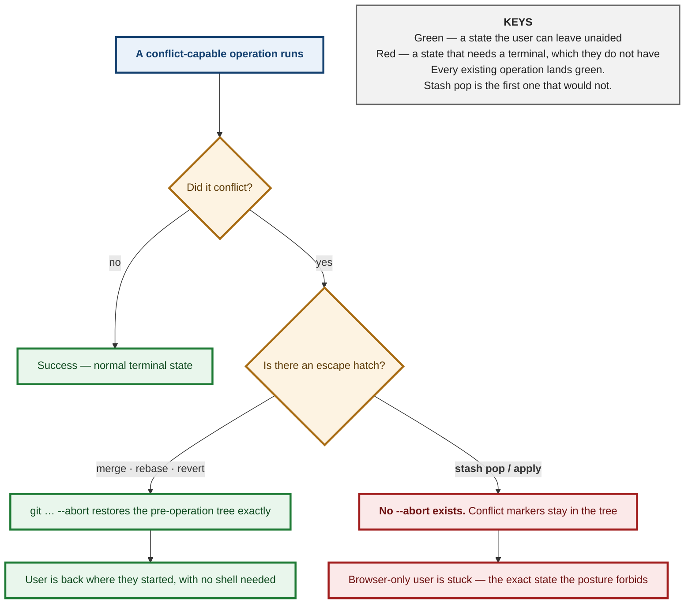
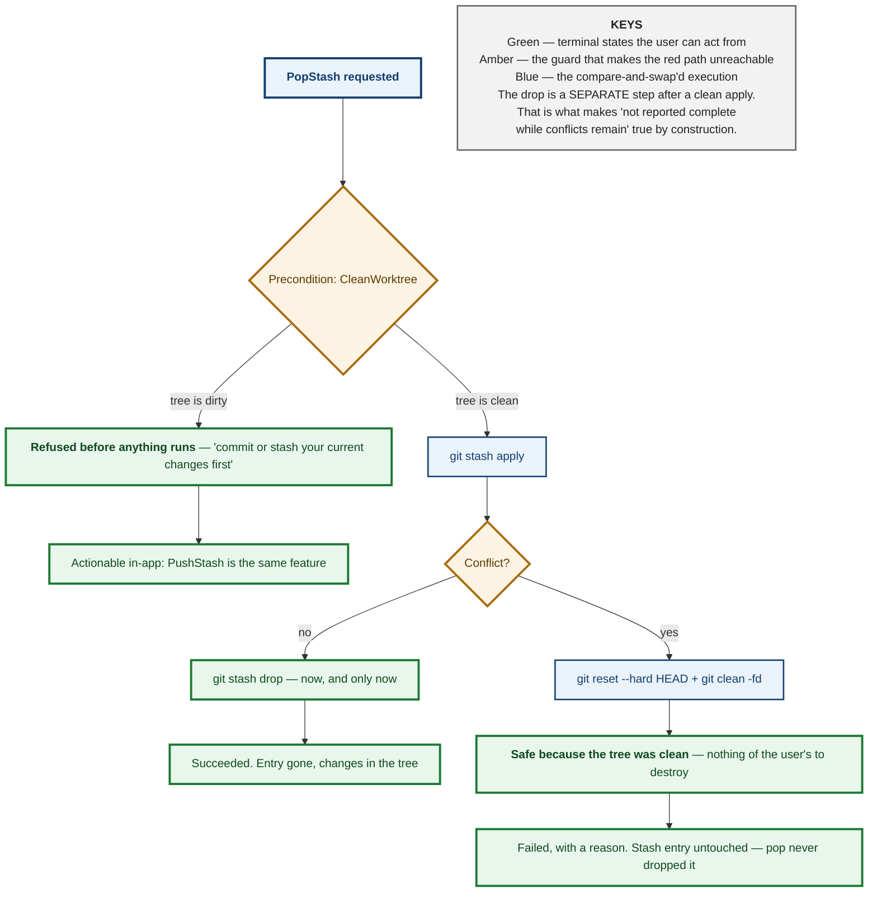

# M3.24 — Complete Stash Workflows: Decision Spec


<div style="background:#FF6B00;color:#fff;margin:3mm -14mm 0 -14mm;padding:9mm 14mm 8mm 14mm">
<p style="display:inline-block;border:1mm solid #fff;padding:2.5mm 5mm;font-size:18pt;font-weight:bold;letter-spacing:3pt;margin:0 0 4mm 0">SAVE</p>
<p style="font-size:11pt;letter-spacing:3.2pt;text-transform:uppercase;font-weight:bold;margin:0 0 1.5mm 0;opacity:.93">Git-Vista &middot; milestone 3 &middot; issue #77</p>
<p style="font-size:29pt;font-weight:bold;letter-spacing:-1pt;line-height:1.02;margin:0 0 3mm 0">A proper drawer</p>
<p style="font-size:16pt;font-weight:bold;line-height:1.2;margin:0">Put work aside half-finished. Get it back exactly as you left it.</p>
</div>

<div style="padding:5mm 0 0 0">

<p style="font-size:13pt;line-height:1.34;margin:0 0 4.5mm 0;color:#141414">Git has a drawer for work you have to stop halfway
through. It is famously easy to lose things in, and one of its commands can
leave you stuck in a mess that normally needs a terminal to escape. This app has
no terminal &mdash; so the question is not "how do we call these commands" but
"which can we offer at all, safely." Nothing is built yet: five places in the
code say "stash", and reading every one shows none of them runs it.</p>

<p style="font-size:11pt;text-transform:uppercase;letter-spacing:1.5pt;font-weight:bold;color:#7A2E00;margin:0 0 2.5mm 0">What this document decides</p>

<div style="border-left:4mm solid #a86b12;background:#fdf6ea;padding:2.2mm 0 2.2mm 3.6mm;margin:0 0 2.5mm 0">
<p style="font-size:13.8pt;font-weight:bold;margin:0 0 1mm 0;line-height:1.2;color:#5c3a05">One command has no undo, and that shapes everything</p>
<p style="font-size:11.6pt;line-height:1.3;margin:0;color:#232323">Every other risky thing the app does can be called off halfway
&mdash; interrupted merge, interrupted rebase, both fine. The drawer's "take it
back out" command has no such escape hatch: if it goes wrong it just leaves the
mess in place. With no terminal to fix it from, the app must not create that
situation at all.</p>
</div>

<div style="border-left:4mm solid #1d7a34;background:#eef7f0;padding:2.2mm 0 2.2mm 3.6mm;margin:0 0 2.5mm 0">
<p style="font-size:13.8pt;font-weight:bold;margin:0 0 1mm 0;line-height:1.2;color:#0f4a1f">The fix is to only open the drawer over a tidy desk</p>
<p style="font-size:11.6pt;line-height:1.3;margin:0;color:#232323">If the desk is clear when you take work back out, "call it
off" just means clearing it again &mdash; something the app can always do. So
taking work out requires a clean start. That is a real restriction, and this
document argues it is the right one.</p>
</div>

<div style="border-left:4mm solid #1d7a34;background:#eef7f0;padding:2.2mm 0 2.2mm 3.6mm;margin:0 0 2.5mm 0">
<p style="font-size:13.8pt;font-weight:bold;margin:0 0 1mm 0;line-height:1.2;color:#0f4a1f">Throwing a drawer away is survivable too</p>
<p style="font-size:11.6pt;line-height:1.3;margin:0;color:#232323">Deleting a stashed item does not really delete it for about a
month. The app already has a trick for holding on to things git is about to
forget, built for a different feature &mdash; it works here unchanged.</p>
</div>

<div style="border-left:4mm solid #a11d1d;background:#fbeeee;padding:2.2mm 0 2.2mm 3.6mm;margin:0 0 2.5mm 0">
<p style="font-size:13.8pt;font-weight:bold;margin:0 0 1mm 0;line-height:1.2;color:#6d1111">Two questions are yours, not mine</p>
<p style="font-size:11.6pt;line-height:1.3;margin:0;color:#232323">Whether "take it back out" should be offered at all before conflict
resolution exists, and whether the clean-desk rule is too strict. Both are
judgement calls about how you want to work, so they are written down as
questions rather than quietly decided.</p>
</div>

</div>

<div style="background:#7A2E00;color:#fff;padding:4.5mm 14mm 5mm 14mm;margin:5.5mm -14mm 0 -14mm">
<p style="font-size:11.6pt;margin:0 0 1.6mm 0;line-height:1.3"><span style="display:inline-block;background:#FF6B00;color:#fff;font-size:9.5pt;font-weight:bold;padding:1mm 2.6mm;margin-right:2.6mm;letter-spacing:.7pt">MILESTONE</span> M3 &mdash; Parallel Work &amp; Recovery</p>
<p style="font-size:11.6pt;margin:0 0 1.6mm 0;line-height:1.3"><span style="display:inline-block;background:#FF6B00;color:#fff;font-size:9.5pt;font-weight:bold;padding:1mm 2.6mm;margin-right:2.6mm;letter-spacing:.7pt">THIS DOC</span> the design for issue #77, which had none</p>
<p style="font-size:11.6pt;margin:0 0 1.6mm 0;line-height:1.3"><span style="display:inline-block;background:#FF6B00;color:#fff;font-size:9.5pt;font-weight:bold;padding:1mm 2.6mm;margin-right:2.6mm;letter-spacing:.7pt">STATUS</span> design only &mdash; no code written</p>
<p style="font-size:11.6pt;margin:0 0 1.6mm 0;line-height:1.3"><span style="display:inline-block;background:#FF6B00;color:#fff;font-size:9.5pt;font-weight:bold;padding:1mm 2.6mm;margin-right:2.6mm;letter-spacing:.7pt">WAIT</span> two open questions for Tom before an ADR</p>
</div>

<div style="page-break-after:always"></div>

**Status:** Design spec, pre-ADR — the design #77 has been missing.
**Fills the gap named in:** `docs/superpowers/specs/2026-08-18-m3-recovery-center.md`, which recorded that no stash design was ever produced (the agent assigned it hit the structured-output retry cap five times and returned nothing) and declined to invent one.
**Depends on:** M1.09 (#62, `durable.rs`), M2.15, M2.16 — as the issue states.

---

## Context

Issue #77 asks for "stash list, inspect, create, apply, pop, drop, and
branch-from-stash workflows", with five acceptance criteria:

> - Stash content is inspectable before apply or drop.
> - Staged and untracked options are explicit.
> - Conflicts enter the shared continuation workflow.
> - Pop is not reported complete while conflicts remain.
> - Activity and generation updates are correct.

Two of those five turn out to be the whole problem, and one of them names
something that does not exist. This spec takes them in the order the code
forces rather than the order they are written.

### What exists today: nothing, verified hit by hit

`grep -rn stash --include='*.rs' crates` returns hits in six files. Counting
them would suggest stash support is partially present. Reading them shows it is
not:

| hit | what it actually is |
|---|---|
| `sandbox/dispatch.rs:78` | a **test** — `local_subcommands_do_not_need_the_network` asserts `git stash` classifies as `NetworkNeed::Local`. A classification, not a call site. |
| `planner.rs:5536` | a **test fixture string** inside `revert_conflict_marker_ignores_a_dirty_tree_refusal`, quoting git's own *"Please commit your changes or stash them before you merge"*. |
| `planner/pull.rs:695` | the same git message, same purpose. |
| `argv_boundary.rs:254` | a comment stating that an older entry reading *"reflog/stash reads, static args"* **is stale** — i.e. explicitly recording that stash reads are *not* there. |
| `activity.rs:302` | prose comparing recovery pins to *"the loose objects `git diff`, `git stash`…"* leave behind. |
| `git-vista/src/icons.rs` (×6) | UI glyphs. Art, not behaviour. |

**No production code path invokes `git stash`.** This matches — and independently
re-confirms — the finding recorded in the recovery-center spec. It is genuinely
greenfield, which is the easiest possible starting position and worth saying
before proposing anything.

### The governing constraint, and it is already written down

`planner.rs:4021`:

> `git rebase <base>` of the checked-out branch (`/api/rebase`). A failed rebase
> (almost always conflicts) is `--abort`ed **so a browser-only user is never left
> mid-rebase with no shell to fix it.**

`/api/undo`'s revert path says the same thing (`planner.rs:4183`), and aborts at
*either* failure point (`planner.rs:4197`).

This is not a stylistic preference. It is the app's core posture: **the user has
no terminal.** Any state the app can enter, the app must be able to leave. Every
existing conflict-capable operation obeys it by calling `--abort`.

How seriously it is taken shows in the revert path, which aborts at **either**
of two distinct failure points and says why: *"Cleanup is `git revert --abort`
at EITHER failure point, and that is a decision"* (`planner.rs:4197`), because
`--abort` restores the pre-revert tree identically whether the failure came from
a conflict or from the compute step that follows it. The code did not settle for
handling the likely failure; it handled both, so that no reachable path ends in
a tree the user cannot leave.

That is the standard a stash design has to meet, and it is the standard `git
stash pop` cannot meet by itself.



### The acceptance criterion that names something that does not exist

> *Conflicts enter the shared continuation workflow.*

**There is no shared continuation workflow.** Grepping `continuation` across
`git-vista-server/src` and `git-vista-protocol/src` returns three hits, all in
`sandbox/network_exec.rs`, all about UTF-8 continuation bytes. The app's actual
answer to a conflict today is the opposite of continuing: it aborts and restores.

That criterion is therefore a dependency on unbuilt work, not a description of
something to plug into. This spec says so rather than writing a design against
an imaginary interface — the same discipline the recovery-center spec applied
when it refused to invent the stash design it was asked to reconcile against.

---

## The problem, precisely

`git stash pop` differs from every operation the app already runs, in two ways
that compound:

**1. There is no `git stash pop --abort`.** Git offers no such subcommand. On
conflict, pop leaves the merge in the index and conflict markers in the files,
and stops.

**2. On conflict, pop does *not* drop the stash entry.** This is documented git
behaviour and it is the one piece of good news: the entry survives, so nothing
is lost by the failure itself. It is also exactly why the app must not report
success — the operation is half-done in the tree and fully-undone in the stash
list, which is the most confusing state a user could be handed.

Together these produce the acceptance criterion *"Pop is not reported complete
while conflicts remain"*. That criterion is correct and this design satisfies
it — but satisfying it is not sufficient, because a truthful "not complete"
still leaves a browser-only user in a tree they cannot clean up.

### Why "just reset --hard" is wrong

The obvious abort is `git reset --hard HEAD` plus `git clean`. Against a tree
that was **dirty before the pop**, that destroys the user's own uncommitted
work — work that was never in the stash and has no recovery anywhere. It would
turn a recoverable annoyance into the single most destructive thing the app can
do, while wearing the label "abort".

The distinction matters: `rebase --abort` restores a *recorded* pre-operation
state. `reset --hard` restores a *commit*. Those coincide only when the tree was
clean to begin with.

---

## Decision

### 1. Read operations first, and they are unconditionally safe

`ListStashes` and `InspectStash` are reads. They spawn `git stash list
--format=…` and `git stash show -p <ref>`, add no `GitOperation` variant (the
enum is for mutations), and satisfy the first acceptance criterion —
*"stash content is inspectable before apply or drop"* — on their own.

They should ship first and separately. They are useful with no write path at
all: a stash list you can read is strictly better than the current state, in
which stashes made outside the app are invisible to it.

### 2. Four new `GitOperation` variants

`GitOperation` has, deliberately, **no catch-all variant** — its doc says a new
kind of mutation *must* extend the enum, and the wire name is then pinned by a
golden fixture (`plan_golden.rs:1119` reads the enum body out of the source).
So each stash mutation is named explicitly:

```rust
/// `git stash push [--keep-index] [--include-untracked] [-m <message>]`
/// (`/api/stash/push`). Both flags are REQUIRED fields with no default:
/// acceptance criterion "staged and untracked options are explicit" is a
/// vocabulary requirement, not a UI one, and a bool with a default is how a
/// UI quietly stops asking.
PushStash {
    message: Option<StashMessage>,
    /// `--keep-index`: leave staged changes staged in the tree as well as
    /// stashing them.
    keep_index: bool,
    /// `--include-untracked`: sweep untracked files in too. Without this,
    /// stashing then switching branches leaves them behind, which is the
    /// single most common way a user believes the drawer lost their work.
    include_untracked: bool,
},
/// `git stash apply <entry>` — restore a stash's changes, KEEPING the entry
/// (`/api/stash/apply`). `expected_oid` is compare-and-swap on the entry's
/// commit: refused if the stash list moved under us.
ApplyStash { entry: StashEntryRef, expected_oid: CommitOid },
/// `git stash pop <entry>` — apply, then drop on success only
/// (`/api/stash/pop`). Modelled as apply-then-drop rather than as git's
/// single command; see "Pop is apply-then-drop" below.
PopStash { entry: StashEntryRef, expected_oid: CommitOid },
/// `git stash drop <entry>` — discard an entry (`/api/stash/drop`).
/// Recoverable via RecreateStashEntry until gc, and the durable recovery
/// pin extends that; see "Recovery" below.
DropStash { entry: StashEntryRef, expected_oid: CommitOid },
```

`StashEntryRef` is the positional `stash@{n}` form **plus** the resolved oid, and
the oid is what actually executes. Positional refs renumber on every drop:
`stash@{1}` names a different commit before and after `stash@{0}` is dropped.
A design that passed only the position would have a time-of-check/time-of-use
bug that deletes the wrong stash — which is the worst possible bug in a feature
whose purpose is not losing things.

**`BranchFromStash` is deliberately not in this list.** `git stash branch` is
`checkout -b` + `apply` + `drop` as one command, and it is the *only* stash
operation that is conflict-free by construction, because it checks out the
commit the stash was made from. That makes it both the safest thing here and a
composite of a checkout the app already models. It belongs in a follow-up slice
once `PushStash`/`ApplyStash` exist; folding it in now would mean designing a
multi-ref composite before the single-ref cases are settled.

### 3. Risk and preconditions

| operation | `RiskLevel` | preconditions |
|---|---|---|
| `PushStash` | `Reversible` | — (git refuses an empty stash itself) |
| `ApplyStash` | `Reversible` | `CleanWorktree` |
| `PopStash` | `Reversible` | `CleanWorktree` |
| `DropStash` | `Destructive` | — |

`DropStash` is `Destructive` on the same reasoning `ForceDeleteBranch` is:
commits become unreachable. It is *recoverable* (below), and `RiskLevel` is
about what can be lost, not about whether an undo was built — `ForceDeleteBranch`
is `Destructive` and carries `RecreateBranch` in exactly the same way.

`PushStash` needs no `CleanWorktree` — a dirty tree is its whole input.

### 4. `CleanWorktree` on apply and pop is the load-bearing decision

**Require a clean working tree before restoring a stash.** Then, and only then,
the abort path is `git reset --hard HEAD` + `git clean -fd` — and that is
provably safe, because a clean tree means there is nothing of the user's to
destroy. The app regains the `--abort` equivalence every other conflict-capable
operation has.

This is a real restriction, and it is worth being honest that it forbids a
workflow git allows: applying a stash on top of other uncommitted edits. The
argument for accepting it:

- **Conflicts remain possible, so the guard is not vacuous.** The common
  stash → pull → pop sequence conflicts precisely because HEAD moved, with a
  perfectly clean tree. The precondition removes the *unrecoverable* conflicts
  while leaving the ordinary ones, which the abort path then handles.
- **The precondition already exists and is already enforced twice.**
  `Precondition::CleanWorktree` is live for the rebase and hard-reset paths, its
  live check is `git status --porcelain=v2` in `Observed`, and `enforce_fresh`
  re-verifies it immediately before execution (`planner.rs:723-728`) so a tree
  that got dirty between planning and executing is a refused race rather than a
  clobber. No new machinery.
- **The refusal is actionable without a shell.** "Commit or stash your current
  changes first" is advice the user can take *inside this app* — `PushStash` is
  right there. A refusal that can be resolved with the feature's own other
  button is a very different thing from a dead end.



### 5. Pop is apply-then-drop, executed as two steps

Do not shell out to `git stash pop`. Run `git stash apply <oid>`, and on a clean
apply run `git stash drop <oid>`.

The behaviour is identical to git's own pop in the success case, and strictly
better in the failure case: the app decides when the entry is destroyed instead
of relying on git's internal ordering, and the acceptance criterion *"pop is not
reported complete while conflicts remain"* becomes **true by construction**
rather than by a status-parsing check that could drift.

It also makes the operation's shape match its `RecoveryStrategy`. A single
opaque `pop` has no clean recovery to name; apply-then-drop does — see below.

### 6. Recovery, and the existing pin generalises for free

`RecoveryStrategy` today is entirely ref-shaped: `ResetRef`, `RecreateBranch`,
`DeleteCreatedBranch`, `RecreateTag`, `DeleteCreatedTag`. A stash entry is not
a branch or a tag — it lives at `refs/stash` with a reflog, and each entry is a
commit. So one new variant:

```rust
/// Re-create a dropped stash entry with `git stash store <at>`. Holds until
/// git gc prunes the commit — and `durable`'s recovery pin
/// (`refs/git-vista/recovery/<id>`) keeps it reachable, exactly as it does
/// for a deleted annotated tag's object.
RecreateStashEntry { at: CommitOid, message: Option<StashMessage> },
```

**The pin mechanism transfers unchanged, and that is the strongest argument for
this shape.** `RecreateTag`'s doc already sets the precedent verbatim: *"the
recovery pin points a real ref at `at`, keeping the tag object reachable — so
taking this strategy's oid durable is also what protects it from gc. A
message-carrying shape would have had nothing to pin."*

A dropped stash is the same situation: a dangling commit, alive for
`gc.reflogExpireUnreachable` (30 days by default, environment-verified on this
box in the recovery-center spec), and made durable-length-safe by a real ref
pointing at it. `git stash store <commit> -m <message>` re-creates the entry
from that oid.

The `message` field carries only the human label. Unlike the tag case — where
re-running `git tag -a` would mint a look-alike and lose the signature forever —
a stash's identity **is** its commit, so storing the oid restores the entry
exactly. The message is cosmetic recovery on top of exact recovery, not a
substitute for it.

`PushStash`'s own recovery is `NotNeeded`: it only moves working-tree state into
a new, listed, inspectable entry, and destroys nothing. `ApplyStash`'s is
`NotNeeded` for the same reason — the entry survives an apply by definition.

### 7. Generation and activity

Both criteria are satisfied by existing machinery, with one thing to be careful
about.

`Observed.status` — `git status --porcelain=v2` — is already a generation input
(#145), *"so uncommitted-work changes count as the repository moving"*
(`planner.rs:719-721`). Every stash operation changes the working tree, so every
one of them moves the generation with no new plumbing.

The care point: `refs/stash` is **not** under `refs/heads/`, so a stash push or
drop moves no branch. Any generation input that watches only branch tips would
miss it entirely — a stash push would look like "nothing happened" to a client
polling refs. The `status` input is what saves this, and it saves it only because
the working tree necessarily changes too. `DropStash` is the edge case to check
during implementation: dropping an entry changes `refs/stash` and the stash
reflog **without touching the working tree at all**, so it may be the one stash
operation that moves no existing generation input. If so it needs one, and that
is a concrete thing to verify with a test rather than assume.

---

## What this design does NOT do

Stated explicitly, because a spec that quietly drops an acceptance criterion is
worse than one that argues against it.

- **No in-app conflict resolution.** The third criterion's "shared continuation
  workflow" does not exist. This design routes conflicts to abort-and-report,
  which is what merge, rebase and revert all do today. When a continuation
  workflow is built, `ApplyStash`/`PopStash` should be revisited — and the
  `CleanWorktree` precondition may become relaxable at that point, since a
  continuation workflow implies a way out that is not `reset --hard`.
- **No `BranchFromStash`.** Deferred with reasons above.
- **No stash of a specific path.** `git stash push -- <pathspec>` is a real
  feature and a real ask, but it is partial-selection, which M2.17b already has
  its own vocabulary for (`ApplyStagingSelection`). Designing a second partial
  path here would be the "two ways to spell one mutation" mistake the
  `PushBranch` doc explicitly warns against.
- **No autostash.** `rebase --autostash` is a different feature wearing a
  similar word.

---

## Open questions — Tom's, not mine

**1. Should `PopStash` ship at all in the first slice?**
`ApplyStash` + `DropStash` compose to the same result, with the user in control
of when the entry dies, and with the intermediate state visible and inspectable.
Pop's only advantage is one click. Given that pop is the operation that
motivated every guard in this document, there is a coherent argument for
shipping apply and drop first and adding pop once conflicts have a real
resolution path. The counter-argument is that "apply then drop" is exactly the
kind of two-step ritual this app exists to abolish.

**2. Is `CleanWorktree` on apply/pop too strict?**
It forbids something git allows, and the workflow it forbids — layering a stash
on top of live edits — is one experienced users do deliberately. The alternative
is to allow a dirty tree and accept that some conflicts become unrecoverable
without a shell, which contradicts the app's stated posture. A third option
exists and is worth naming: allow a dirty tree, but take an automatic safety
stash of it first, so the abort path restores from that. That is more moving
parts, and a failure in the safety-stash path fails in the worst possible way,
but it does preserve the workflow.

Both are judgement calls about how you want to work rather than facts about the
code, which is why they are questions here instead of decisions.

---

## Alternatives considered

**Call `git stash pop` directly and parse its output.** Fewer moving parts, and
matches what a user typing git would do. Rejected because the entry's fate is
then decided inside git, and the app has to infer from stderr whether the entry
survived. The app already has a hard-won lesson about exactly this: the revert
path carries a dedicated `looks_like_revert_conflict` helper *and* a test
(`revert_conflict_marker_ignores_a_dirty_tree_refusal`, `planner.rs:5533`)
proving that a refusal which never touched the tree must not read as a conflict.
That test exists because output-shape inference got it wrong once. Splitting pop
into two commands removes the need to infer at all.

**Allow a dirty tree and abort by restoring from a pre-operation diff.** Capture
`git diff HEAD` before the apply, and re-apply it on failure. Rejected: it fails
for untracked files and for binary content unless further widened, and a restore
that is *itself* an apply can conflict — leaving the user in the same trap, one
level deeper, at exactly the moment they are already in trouble.

**Model stash entries as refs and reuse `RecreateBranch`.** A stash entry is a
commit, so `RecreateBranch { name, at }` could technically re-create one as a
branch. Rejected: it would put the recovered work somewhere the stash list does
not show, silently converting a stash into a branch. Recovery should restore
what was lost, not something adjacent to it.

**Skip `DropStash` entirely** — never destroy, let the list grow. Superficially
matches the "nothing deletes" posture that serves the backup tooling well.
Rejected because a stash list nobody can prune becomes unusable within weeks,
and unlike a backup archive, stashes are *meant* to be transient. The right
answer is a recoverable delete, which is what `RecreateStashEntry` provides.

---

## Consequences

**The first slice is small and useful on its own:** `ListStashes` +
`InspectStash`, two reads, no enum change, no risk. Stashes made outside the app
stop being invisible to it.

**Four new `GitOperation` variants and one new `RecoveryStrategy` variant**, each
pinned by the golden fixture, each with an explicit `RiskLevel` and precondition
set. No new storage, no new sidecar, no changes to `durable.rs`.

**The `CleanWorktree` precondition is the whole safety argument**, so it is also
the thing most worth mutation-testing: a test that removes it must go red, and a
test that pins "pop reports failure and leaves the entry intact on conflict"
must be provable against a real conflicting stash rather than a mocked one.

**`DropStash`'s generation input is an open verification item**, not an
assumption — it is the one operation here that may not move any existing input.

**Two questions block the ADR**, not the code: the reads can be built while they
are open.

---

**Signed:** max · 2026-08-18T10:30:00-04:00
