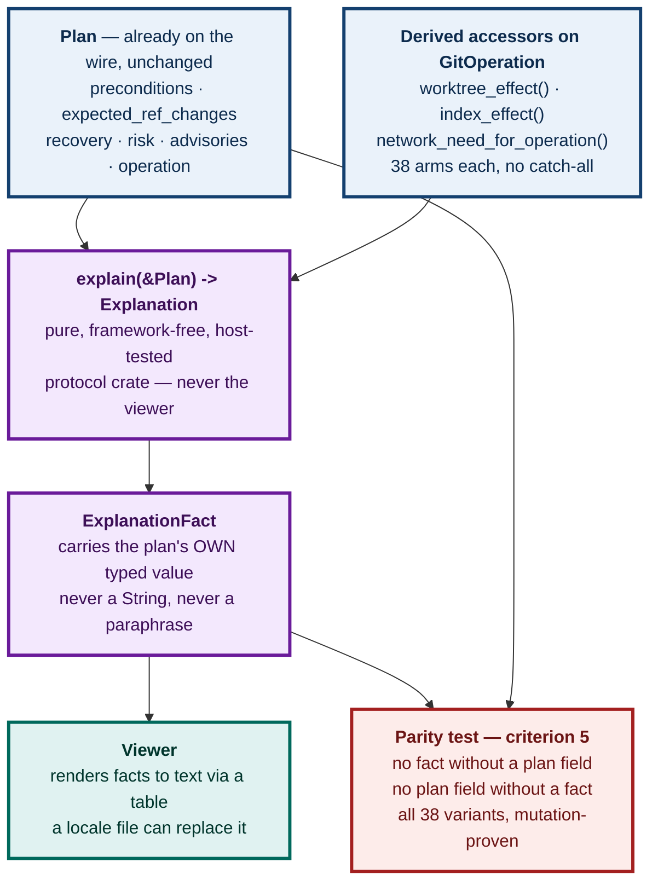

# M6.39 — Explain Mode over the typed operation vocabulary

**Issue:** [#92](https://github.com/tom2025b/git-vista/issues/92) · **Milestone:** M6 — Teaching Professional Semantics [V2] · **Size:** L
**Depends on:** M1.06 (typed operation vocabulary), M1.09 (durable journal), M4.27 (comparison) — all shipped.

---

## 1. What this is, in plain language

Git-Vista already refuses to run a write until it has built a **plan** and you have approved it. That plan is not a string of shell — it is a typed object that says what must be true first, which refs will move, how risky it is, and how to get back.

Today the app shows you that plan. **It does not explain it.**

Explain Mode makes every plan carry its own explanation, in ordinary language, derived from the plan itself. Not a tooltip written by hand for each button — a rendering of the same typed facts the server is about to enforce. If the plan says a precondition exists, the explanation says so. If it doesn't, the explanation can't invent one.

That last sentence is the whole design. Everything below serves it.

---

## 2. Goal and acceptance criteria

From the issue, verbatim:

> Explain operation preconditions, ref movement, index/worktree effects, remote effects, and recovery using the same typed plans as production workflows.

| # | Criterion | How this design satisfies it |
|---|---|---|
| 1 | Explanations derive from typed plans, not endpoint strings | `explain(&Plan) -> Explanation` is a pure function of the struct; no endpoint, no argv, no `String` input |
| 2 | Expert users can collapse them | Per-section collapse, persisted per topic |
| 3 | Terminology links to visual objects | A `RefChange` names a ref the graph already draws; a `CommitOid` links to its dot |
| 4 | Translation is possible | `ExplanationFact` is a typed enum carrying typed params. No English exists below the viewer |
| 5 | Tests compare explanation facts with plan facts | A two-directional parity test over all 38 operations, mutation-proven two ways |

**Owner decisions already taken** (2026-08-23): all 38 operations at once, not per family; **always-inline collapsible**, not a global mode.

---

## 3. The finding that shaped the design

The issue names five things to explain. **Four are already fields on `Plan`** (`crates/git-vista-protocol/src/plan.rs:1537`):

| Issue's phrase | Existing field |
|---|---|
| preconditions | `preconditions: Vec<Precondition>` — 8 variants |
| ref movement | `expected_ref_changes: Vec<RefChange>` |
| recovery | `recovery: RecoveryStrategy` — 12 variants |
| (bonus) | `risk: RiskLevel`, `advisories: Vec<Advisory>` |

**Two are not: index/worktree effects, and remote effects.**

The investigation into whether that forces a wire-protocol change produced the decisive fact:

- `network_need(args: &[&str]) -> NetworkNeed` (`git-vista-server/src/sandbox/mod.rs:662`) classifies **argv**. This is the "endpoint string" shape criterion 1 forbids. It is not the precedent.
- `network_need_for_operation(op: &GitOperation) -> NetworkNeed` (`git-vista-server/src/sandbox/mod.rs:723`) matches on the **typed operation**. This *is* the precedent, and it proves the pattern already works here.

Both, plus `enum NetworkNeed` itself (`sandbox/mod.rs:606`), are `pub(crate)` inside the **server** crate — invisible to any explain layer and to the frontend.

**Conclusion: no wire-format change is needed.** Both missing dimensions become derived accessors on the closed vocabulary in the protocol crate. `Plan` gains no field, so there is no version gate, and none of the `#[serde(default)]` hazard that `Plan`'s own doc comment warns about for `advisories`:

> *"No `#[serde(default)]` … a plan from a build that predates this field is a version mismatch and must fail loudly at the version gate, not arrive with an empty list that reads as 'checked, nothing to report'."*

#92 is a feature PR. It is not a protocol change followed by a feature.

---

## 4. Architecture

### 4.1 Where the code lives

```
crates/git-vista-protocol/src/
  plan.rs        GitOperation (38 variants) — gains 2 accessors, re-exports a 3rd
  effects.rs     NEW — WorktreeEffect, IndexEffect, NetworkNeed (moved), and
                 the three classifiers over GitOperation
  explain.rs     NEW — Explanation, Section, Topic, ExplanationFact, explain(&Plan)
```

The protocol crate, not the server and not the viewer. Three reasons, in order of weight:

1. **`cargo test` never compiles the wasm viewer.** This is not theoretical — it is the lesson #432 paid for six days ago, and the reason `features/conflicts/markers.rs` is a framework-free core with ten host tests rather than logic inside `viewer.rs`. Deciding what a plan *means* inside the viewer would pin criterion 5 with nothing but a green gate.
2. `Plan` and `GitOperation` already live there, and the viewer already depends on it.
3. Both server and client can compute the same explanation from the same input, so there is nothing to keep in sync.

### 4.2 Data flow

The viewer already holds a `Plan`. It calls `explain(&plan)` locally. Nothing new crosses the wire.



### 4.3 The fact vocabulary

```rust
pub struct Explanation { pub sections: Vec<Section> }

pub struct Section { pub topic: Topic, pub facts: Vec<ExplanationFact> }

pub enum Topic {
    MustBeTrueFirst,   // preconditions
    WhatMoves,         // expected_ref_changes
    IndexAndWorktree,  // index_effect + worktree_effect
    Remote,            // network need
    HowToUndo,         // recovery
    WorthKnowing,      // risk + advisories
}

pub enum ExplanationFact {
    Precondition(Precondition),
    RefMoves(RefChange),
    Worktree(WorktreeEffect),
    Index(IndexEffect),
    Remote(NetworkNeed),
    Recovery(RecoveryStrategy),
    Advisory(Advisory),
    Risk(RiskLevel),
}
```

**A fact carries the plan's own typed value.** It does not restate it in prose, and it does not summarise it. That is what turns criterion 5 from a judgement call into a mechanical check, and it is what makes translation a rendering concern rather than a rewrite.

Roughly 25 fact kinds: 8 `Precondition` variants + 12 `RecoveryStrategy` variants + `RefChange`, `RiskLevel`, `Advisory`, and the three effect enums.

### 4.4 The new accessors

```rust
impl GitOperation {
    pub fn worktree_effect(&self) -> WorktreeEffect;
    pub fn index_effect(&self) -> IndexEffect;
}
```

**38 explicit arms each. No catch-all `_ =>`.** A wildcard is exactly how a newly added operation would silently acquire a wrong explanation; an inexhaustive match is a compile error, which is the entire benefit of a closed vocabulary. This mirrors the discipline `network_need_for_operation` already follows.

Draft shapes, to be settled during implementation against the real variants:

```rust
pub enum WorktreeEffect { Untouched, FilesRewritten, FilesRemoved, MayConflict, RequiresClean }
pub enum IndexEffect    { Untouched, EntriesStaged, EntriesUnstaged, StagesResolved, Rebuilt }
```

### 4.5 The one move, and its risk

`NetworkNeed` and `network_need_for_operation` move from `git-vista-server/src/sandbox/mod.rs` into `git-vista-protocol/src/effects.rs` and become `pub`.

**This is security-adjacent.** The sandbox uses `NetworkNeed` to decide whether to force askpass hardening for remote operations (`git_cmd.rs:165-169`, and the tests `sandboxed_forces_askpass_hardening_for_remote_network_need` / `sandboxed_does_not_force_askpass_hardening_for_local_network_need` at `git_cmd.rs:1595` and `:1627`).

So it is **pure motion**, under #451's discipline:

- match arms byte-identical before and after — diffed, not eyeballed
- workspace test count identical before and after
- nothing loosened; no arm's classification changes
- the server re-exports it so `sandbox/dispatch.rs` and `git_cmd.rs` are untouched
- `network_need(args: &[&str])`, the **argv** classifier, **stays in the server**. It is a sandbox concern and has no business in a protocol crate.

---

## 5. The parity test — criterion 5, made able to fail

One host test, run across **all 38 operations** via a fixture plan per variant, asserting in both directions:

- **No fact without a plan field.** Every `ExplanationFact` traces to a field of the `Plan` it came from. Catches invention.
- **No plan field without a fact.** Every `Precondition`, every `RefChange`, every `Advisory`, and the `RecoveryStrategy` appears in the explanation. Catches omission.

Running it per-variant means a newly added operation with no explanation **fails the suite** rather than shipping a blank panel.

### Mutation proof

Two mutations, failing differently. One `caught` proves the test notices *that* break, not that it pins the invariant.

| Mutation | Expected | Which direction it exercises |
|---|---|---|
| Drop a `Precondition` from the composed explanation | `caught` | omission |
| Emit an `ExplanationFact::Precondition` the plan never carried | `caught` | invention |

`failure-atlas`'s `mutation_check` works here — this is Rust. (It refuses shell runners; that limitation cost a hand-rolled proof on #454 and does not apply.) Commit before running: it clones HEAD.

---

## 6. Rendering and collapse

The viewer renders `Explanation` section by section. Each section collapses independently. State persists in `localStorage` **keyed by `Topic`, not by plan** — key it per plan and an expert re-collapses the same section forever.

Default: **expanded**. A teaching feature that is off by default is one a learner never finds.

Criterion 3 ("terminology links to visual objects") scopes deliberately to what already exists: a `RefChange` names a ref the graph already draws, and a `CommitOid` links to its dot. **No new glossary subsystem.**

---

## 7. Out of scope, deliberately

- **No locale file.** The design makes translation possible; shipping a second language is a separate issue. Criterion 4 says "possible," not "done."
- No explanation for anything that is not a plan.
- No prose-authoring tool.
- **No change to what any operation does.** This feature only reads.
- No expansion of `network_need(args)`'s role. It stays a sandbox concern.

---

## 8. Risks

| Risk | Mitigation |
|---|---|
| Moving `NetworkNeed` changes sandbox hardening behaviour | Pure motion, byte-identical arms, identical test count, server re-exports. The two askpass tests are the tripwire and must stay green untouched. |
| 76 hand-written match arms drift from the operations they describe | No catch-all, so a new variant is a compile error. The per-variant parity test is the second net. |
| The explanation reads as authoritative while being subtly wrong | Facts carry the plan's own values rather than paraphrases, so there is nothing to get wrong in between. The parity test is bidirectional. |
| Scope creep into a glossary/i18n subsystem | Section 7 names both as out of scope. |

---

## 9. ADR

Required. Two decisions qualify as expensive-to-reverse or easy-to-forget-why:

1. Effects are **derived accessors on the closed vocabulary**, not `Plan` fields — i.e. deliberately *not* a wire-contract change.
2. `NetworkNeed` **relocates from a security module into the shared protocol crate**, with the argv classifier deliberately left behind.

Next number: **0070** (`docs/adr/` currently holds 0001–0069). Tracked, committed and pushed, with its rendered PDF in the repo's collected PDF folder, per the standing rule.

---

## 10. Open question for the owner

None blocking. One worth answering before the viewer work lands:

**Should `Topic::WorthKnowing` (risk + advisories) be collapsed by default while the rest start expanded?** Advisories are the one section that is often empty, and an empty expanded section reads as a bug. The alternative — hide a section entirely when it has no facts — is simpler but means the panel's shape changes between operations, which is its own small confusion.

---

**Signed:** max · 2026-08-23T14:14:00-04:00
