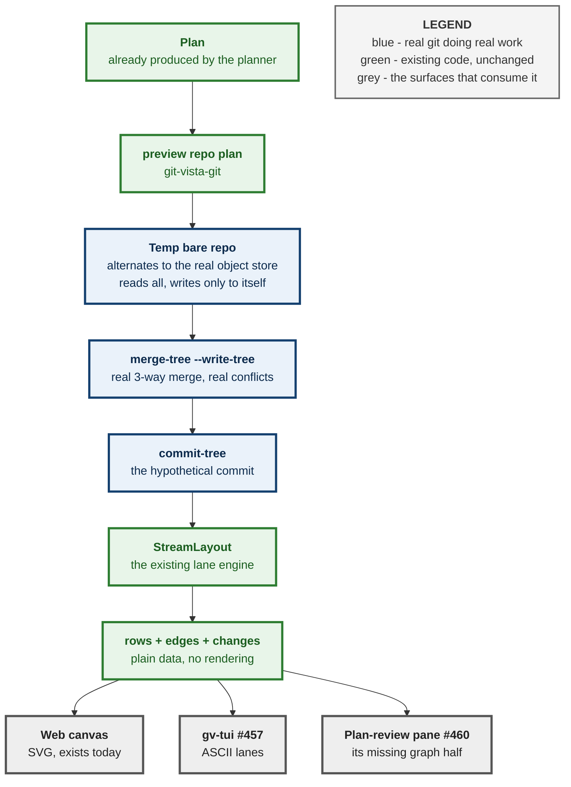

# M10.08 — Graph preview: draw the repository as it *would* be, without touching it

**Status:** design, awaiting owner review · **Date:** 2026-08-29 · **Author:** max
**Depended on by:** [#460](https://github.com/tom2025b/git-vista/issues/460) (M10.05 plan-review pane)
**Related:** [#457](https://github.com/tom2025b/git-vista/issues/457) (terminal graph from the lane core), [#92](https://github.com/tom2025b/git-vista/issues/92) / ADR 0091 (Explain Mode)

---

## 1. What this is, in plain language

You are about to run `revert`, or `cherry-pick`, or a merge, and you cannot picture
what the graph will look like afterwards. Today the app tells you in words what an
operation will do — Explain Mode does that already. It cannot show you.

This draws the *after* graph before you commit to it. Not a simulation of git: real
git computes the answer, against your real objects, and writes nothing to your
repository.

The idea came from [git-school's Visualizing Git](http://git-school.github.io/visualizing-git/),
which animates a toy graph as you type commands. The difference that matters: that
tool models git, and this one runs it.

## 2. Goal and acceptance criteria

**Goal.** Given a `Plan` the planner already produces, return the rows and edges the
graph *would* have, plus what changed — as data, renderable by any surface.

- **A1.** `preview(repo, plan)` returns a hypothetical `Vec<GraphRow>` + `Vec<Edge>`
  laid out by the existing `StreamLayout`, for revert, cherry-pick and merge.
- **A2.** The real repository is **unchanged**: no new object under
  `<commondir>/objects`, no ref moved, no worktree, no index write, and the scratch
  store removed on drop. Asserted by a test that counts objects, compares every ref
  before and after, and asserts the scratch directory is gone.
- **A3.** A merge that would conflict returns `Conflict { paths }` — a real answer,
  not an error and not a guessed graph.
- **A4.** An operation the plumbing cannot express returns `Unsupported`. It never
  returns a graph it is not sure of.
- **A5.** The predicted graph equals the graph produced by actually running the
  operation in a throwaway clone, over every applicable fixture repository.
- **A6.** The web canvas renders before/after with the changes marked.

## 3. The finding that shaped the design

Two facts were measured on 2026-08-29 before any of this was designed, and each
removed an approach that looked reasonable.

**`StreamLayout::push` takes a commit and a membership predicate — not a
repository.** The layout engine never asks whether a commit exists. It will lay out
a hypothetical history exactly as it lays out a real one. That is why this feature
costs a function rather than a renderer.

**A temp bare repo whose `objects/info/alternates` points at the real object store
reads everything and writes only into itself.** Measured on this repository:
`merge-tree --write-tree` produced tree `35fbd212…`, `commit-tree` produced commit
`2b75afa6…`, the temp store could read it back, **the real repository could not**,
and its object count was 19,593 before and 19,593 after.

That is the whole safety argument, and it is a measurement rather than a claim.

## 4. Architecture

### 4.1 Where the code lives — below the renderer, deliberately

`#457` commits the terminal UI to drawing "from the lanes core already computes".
A preview computed in the wasm frontend could never serve that surface: it would be
written twice and drift twice. So the preview returns plain data from **below** every
renderer, and each surface is a renderer of it.

**Amended 2026-08-30 — this section originally said "a function in `git-vista-git`",
and that was wrong against the code.** `git-vista-git` is a pure-`gix` crate that
never spawns a process; it carries its own `ALLOWED_GIT_CRATE_SPAWN_SITES` allowlist
precisely to keep it that way. The sanctioned `git merge-tree --write-tree` path
already exists one crate over, in `git-vista-server/src/activity.rs`
(`revert_would_conflict`, #327), already allowlisted in `argv_boundary.rs`, already
running through the sealed sandbox launcher. The original reasoning is untouched by
the correction — it argues against putting the preview in the **frontend**, not
against putting it in the **server** — and M10's own milestone text settles the rest:
"gv, the browser, MCP and a TUI are all clients of one server", so gv-tui consumes
this over HTTP either way. The split that follows is the corrected placement.



### 4.1b The three-crate split

| Half | Crate | Why there |
|---|---|---|
| Temp object store, `merge-tree`, `commit-tree`, the git-version gate | `git-vista-server` | The only crate allowed to spawn git, and the only one holding the sandbox launcher |
| Lay out before + after, derive `Vec<Change>` | `git-vista-core` | Pure, wasm-safe, no repository — this is `StreamLayout`'s own neighbourhood |
| `PreviewOutcome`, `Change` | `git-vista-protocol` | A6 puts them on the wire; house rule applies — **no `#[serde(default)]` on added fields**, a payload from an older build must fail loudly at the version gate rather than decode as an empty answer |

The pure half is testable with no repository at all: lay out two commit lists and
diff them. It is therefore independent of every sandbox question below.

### 4.1c The sandbox grant decides where the temp store lives — measured

`git_cmd::git_output(repo, args)` builds its Landlock policy in
`sandbox::policy_for(repo, read_only, need)`, and that policy grants exactly
**`repo` and its resolved `commondir` read-write, plus `$HOME` read-only**. Nothing
else on the filesystem is reachable by the child.

Two consequences, both measured on this host on 2026-08-30:

1. **`policy_for` does not enforce the managed root.** Its own doc comment says so,
   and names the reason: ~40 unit tests spawn git against a throwaway
   `tempfile::tempdir()` with no catalog registration. The containment check lives at
   `state::resolve_target`, on the HTTP mutation path. So pointing a spawn at a
   scratch repository is not refused *per se*.
2. **But a scratch store in `/tmp` cannot work anyway.** Its
   `objects/info/alternates` would point at the served repository's object
   directory — a path outside every grant the policy built from the scratch dir.
   Landlock denies the read; the preview would fail for a reason that has nothing to
   do with git.

**So the temp store lives at `<commondir>/gv-preview-<id>/`**, inside the read-write
grant the policy already builds, with `objects/info/alternates` pointing at
`<commondir>/objects` beside it. The spawn passes the **real repository** as `repo`
(so the grant is built from it) and selects the scratch store with `--git-dir`.
One grant, no new sandbox policy, no security-boundary change.

**A read-only repository has no read-write grant at all**, so no scratch store can be
created there. What `preview()` returns in that case is a decision the ADR must
settle: it is not `Unsupported { operation }` — the operation is fine, the
*repository* is. See §9b.

#### The mechanism, re-measured on today's `main`

Run against `8ef604d1` on 2026-08-30, not carried over from the 08-29 numbers:

```
real .git/objects files before : 19,228
merge-tree --write-tree        : rc=0, tree af2aa307…
commit-tree                    : rc=0, commit cef7204e…
real .git/objects files after  : 19,228     <- unchanged
scratch store: cat-file -t cef7204e…        -> commit
real repo:    cat-file -t cef7204e…         -> fatal: could not get object info
```

The hypothetical commit exists, is laid out, and is invisible to the repository it
was computed from. That is the safety argument, still a measurement rather than a
claim.

### 4.2 The vocabulary

```rust
pub fn preview(repo: &Path, plan: &Plan) -> PreviewOutcome;

pub enum PreviewOutcome {
    Graph { rows: Vec<GraphRow>, edges: Vec<Edge>, changes: Vec<Change> },
    Conflict { paths: Vec<String> },
    Unsupported { operation: String },
}

pub enum Change {
    Added(Oid),
    RefMoved { name: String, from: Oid, to: Oid },
    LaneShifted(Oid),
}
```

### 4.3 `Unsupported` is the design, not a gap

The failure mode of a modelled git is not being wrong. It is being *confidently*
wrong — producing a plausible graph that quietly differs from what the command will
actually do, on exactly the operations a user cannot check by eye.

`Unsupported` makes that structurally impossible. If the plumbing cannot express an
operation, the answer is "I cannot show you this", never a picture. A user who sees
nothing goes and reads the docs; a user who sees a wrong picture acts on it.

This mirrors the existing sandbox posture: `INV-13`, there is no degraded mode.

## 5. The test that can go red — A5

The parity test is the one that earns the feature's trust, and it must be able to
fail. For each applicable fixture repository:

1. Build the `Plan`.
2. `preview()` it — collect the predicted commit list and lane assignment.
3. Clone the fixture to a throwaway, **actually run the operation**, and lay out the
   real result.
4. Assert the two are identical.

A predicted graph that differs from the real one fails here, which is the only place
the difference can be caught before a user sees it.

#### What A5 compares — and the trap it must not fall into (added 2026-08-30)

A real `git revert` and this feature's `commit-tree` produce **different OIDs** for
the same logical result: different committer timestamp, different default message.
Asserting OID equality makes A5 permanently red; asserting loosely makes it a green
test that proves nothing — the failure shape this repository has now paid for six
times. So A5 compares, exactly:

- the **parent topology** of every row (each commit's parent OIDs, in order),
- the **lane assignment** and **row order** of every row,
- with the hypothetical commit's OID mapped onto the real one by position, never by
  identity.

Pinning `GIT_AUTHOR_DATE` and `GIT_COMMITTER_DATE` on **both** sides is what makes
even that comparison stable, and whether those survive the sandbox launcher's env
handling is a fact to measure, not assume.

`GraphRow.color` and `GraphRow.on_remote` must also be given a defined value for a
hypothetical commit, or parity will differ for reasons that are not the mechanism.

### Mutation proof

Two mutations minimum, breaking differently, per the standing rule:

- **M1** — splice the hypothetical commit in at the wrong position. Expect `caught`.
- **M2** — return `Graph` where the code should return `Conflict`. Expect `caught`,
  on a different test, because a conflicting merge has no graph to be wrong about.

## 6. Out of scope, deliberately

- **Rebase, reset, force-push.** Expressible only with far more plumbing, and the
  owner's chosen first slice is the confusing operations rather than the destructive
  ones. They return `Unsupported`.
- **Animation.** git-school's charm is watching the graph move. That needs a
  before→after node correspondence — which node became which — and that is a design
  problem in its own right, not a rendering detail. Ship the marked diff first and
  find out whether the motion is missed.
- **The teaching sandbox.** Same function pointed at a scratch repo where mutation is
  allowed. It falls out of this work; it is not part of this slice.

## 7. Risks

| Risk | Mitigation |
|---|---|
| `merge-tree --write-tree` needs git ≥ 2.38 | Measured 2.43.0 here. `SUPPORTED_VERSIONS.md` floor is 2.32 — the preview must degrade to `Unsupported` below 2.38, not fail |
| The temp store grows on repeated previews | It is a temp dir per call, removed on drop. Asserted by test |
| Alternates could be pointed at a repo that moves | Resolve the object path once, at call time, and never cache it across calls |
| Preview drifts as the planner gains operations | `Unsupported` is the default arm, so a new operation is invisible rather than wrong |

## 8. ADR

Yes — one is warranted. This decides a contract: **a preview is computed by real git
against the real object store, and refuses rather than models.** That is expensive to
reverse and easy for a later session to "optimise" into a simulation.

## 9b. What the ADR must settle (added 2026-08-30)

1. **A read-only repository.** No read-write grant, so no scratch store. `Graph` is
   impossible, `Conflict` is untrue, and `Unsupported { operation }` is a lie about
   which thing is unsupported. Either a fourth arm or a reason on the existing one.
2. **`color` and `on_remote` for a commit that does not exist.** Whatever is chosen
   must be chosen once and asserted, because A5 compares these fields.
3. **The git-version floor.** `merge-tree --write-tree` needs git >= 2.38;
   `SUPPORTED_VERSIONS.md` floors at 2.32. The gate must degrade to `Unsupported`,
   and where that check runs (once at boot, or per call) is a decision.

## 9. Open question for the owner

The first slice renders in the **web canvas**, because that renderer exists today.
`#457`'s terminal renderer picks the same data up for free when it lands. Confirmed
by the owner on 2026-08-29; recorded here because a future reader will wonder why a
lazygit user got a web feature first.

---

**Signed:** max · 2026-08-29T09:30:00-04:00
**Amended:** max · 2026-08-30T17:20:00-04:00 — placement corrected to the three-crate
split, the sandbox grant constraint added (§4.1c), A2 tightened, A5's comparison
pinned, and §9b opened. The 08-29 measurement was re-run on `8ef604d1`.
