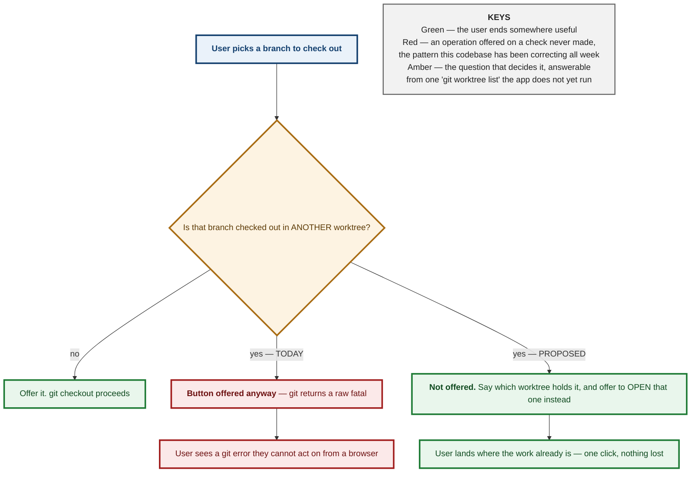

# M3.23 — Linked Worktrees as First-Class Workspaces: Decision Spec

<style>
h1:first-of-type { display: none !important; }
</style>

<div style="background:#FF6B00;color:#fff;margin:3mm -14mm 0 -14mm;padding:9mm 14mm 8mm 14mm">
<p style="display:inline-block;border:1mm solid #fff;padding:2.5mm 5mm;font-size:18pt;font-weight:bold;letter-spacing:3pt;margin:0 0 4mm 0">SAVE</p>
<p style="font-size:11pt;letter-spacing:3.2pt;text-transform:uppercase;font-weight:bold;margin:0 0 1.5mm 0;opacity:.93">Git-Vista &middot; milestone 3 &middot; issue #76</p>
<p style="font-size:29pt;font-weight:bold;letter-spacing:-1pt;line-height:1.02;margin:0 0 3mm 0">Two desks instead of one</p>
<p style="font-size:16pt;font-weight:bold;line-height:1.2;margin:0">Work on two things at once, without putting either away.</p>
</div>

<div style="padding:5mm 0 0 0">

<p style="font-size:13pt;line-height:1.34;margin:0 0 4.5mm 0;color:#141414">Normally a project gives you one desk. To
switch tasks you clear it &mdash; put everything in a drawer, take the new thing
out. Git has a second option almost nobody uses: <b>the same project, open in two
folders at once</b>, each on a different task. Two desks. You already work this
way &mdash; there are six of them on your machine right now. The app just cannot
see them.</p>

<p style="font-size:11pt;text-transform:uppercase;letter-spacing:1.5pt;font-weight:bold;color:#7A2E00;margin:0 0 2.5mm 0">What this document decides</p>

<div style="border-left:4mm solid #1d7a34;background:#eef7f0;padding:2.2mm 0 2.2mm 3.6mm;margin:0 0 2.5mm 0">
<p style="font-size:13.8pt;font-weight:bold;margin:0 0 1mm 0;line-height:1.2;color:#0f4a1f">The hard part was built a year ago</p>
<p style="font-size:11.6pt;line-height:1.3;margin:0;color:#232323">Every desk already gets its own identity in the app,
while all of them correctly share one project identity. There is a real test
that creates a second desk and proves it. Nothing needs redesigning &mdash; the
app simply never <em>looks</em> for the other desks.</p>
</div>

<div style="border-left:4mm solid #a86b12;background:#fdf6ea;padding:2.2mm 0 2.2mm 3.6mm;margin:0 0 2.5mm 0">
<p style="font-size:13.8pt;font-weight:bold;margin:0 0 1mm 0;line-height:1.2;color:#5c3a05">One task can only be on one desk</p>
<p style="font-size:11.6pt;line-height:1.3;margin:0;color:#232323">Git flatly refuses to open the same task at two desks
at once &mdash; and it is right to, because two copies drifting apart is how work
gets lost. But the app does not know that rule yet, so it would offer you a
button that simply fails. The fix is to <b>not offer it</b>, and say which desk
already has it.</p>
</div>

<div style="border-left:4mm solid #a11d1d;background:#fbeeee;padding:2.2mm 0 2.2mm 3.6mm;margin:0 0 2.5mm 0">
<p style="font-size:13.8pt;font-weight:bold;margin:0 0 1mm 0;line-height:1.2;color:#6d1111">Some desks sit outside the fence</p>
<p style="font-size:11.6pt;line-height:1.3;margin:0;color:#232323">The app only serves folders inside an approved area,
on purpose, for security. But a second desk can be created anywhere &mdash; one
of yours already is. So the app can <em>discover</em> a desk it is not allowed
to <em>open</em>. It must say so plainly rather than either hiding it or quietly
breaking the fence.</p>
</div>

</div>

<div style="background:#7A2E00;color:#fff;padding:4.5mm 14mm 5mm 14mm;margin:5.5mm -14mm 0 -14mm">
<p style="font-size:11.6pt;margin:0 0 1.6mm 0;line-height:1.3"><span style="display:inline-block;background:#FF6B00;color:#fff;font-size:9.5pt;font-weight:bold;padding:1mm 2.6mm;margin-right:2.6mm;letter-spacing:.7pt">MILESTONE</span> M3 &mdash; Parallel Work &amp; Recovery</p>
<p style="font-size:11.6pt;margin:0 0 1.6mm 0;line-height:1.3"><span style="display:inline-block;background:#FF6B00;color:#fff;font-size:9.5pt;font-weight:bold;padding:1mm 2.6mm;margin-right:2.6mm;letter-spacing:.7pt">THIS DOC</span> the design for issue #76, before any code</p>
<p style="font-size:11.6pt;margin:0 0 1.6mm 0;line-height:1.3"><span style="display:inline-block;background:#FF6B00;color:#fff;font-size:9.5pt;font-weight:bold;padding:1mm 2.6mm;margin-right:2.6mm;letter-spacing:.7pt">STATUS</span> design only &mdash; identity layer already shipped</p>
<p style="font-size:11.6pt;margin:0;line-height:1.3"><span style="display:inline-block;background:#FF6B00;color:#fff;font-size:9.5pt;font-weight:bold;padding:1mm 2.6mm;margin-right:2.6mm;letter-spacing:.7pt">LIVE</span> six worktrees on this machine today</p>
</div>

<div style="page-break-after:always"></div>

**Status:** Design spec, pre-ADR.
**Companion to:** `2026-08-18-m3-24-stash-workflows.md` (#77). Worktrees and stash are the two answers to the same question — *"I need to work on something else"* — and this one is the answer that does not require putting anything away.

---

## Context

Issue #76 asks to "model linked worktrees as first-class workspaces". The
striking thing, verified before proposing anything, is **how much of that is
already true**.

### What exists today, checked rather than assumed

`grep -rn worktree --include='*.rs' crates/` returns **873 hits**. That number
alone proves nothing — the app's own identifier for a registered repository is
`WorktreeId`, so most hits are about the app's vocabulary rather than about
git's linked worktrees. Reading them apart is the whole job:

| what | state |
|---|---|
| **Identity model** | **DONE.** `WorktreeId::from_git_dir` (`git-vista-core/src/identity.rs:123-138`) keys on the *canonical git dir* — `…/.git` for a main tree, `…/.git/worktrees/<name>` for a linked one. Because those differ, each worktree gets its own id while all share one `RepositoryId`. |
| **A test that proves it** | **DONE.** `linked_worktree_shares_repo_id_but_has_its_own_worktree_id` (`git-vista-git/src/identity.rs:273`) creates a real linked worktree with `git worktree add` and asserts both halves. Not a mock. |
| **Resolution and capability** | **DONE.** `resolve_worktree` and `descriptor_for` (`state.rs:160, 265`) already treat a worktree id as the addressable unit. |
| **Enumeration** | **MISSING.** Nothing in the tree invokes `git worktree list`. The app cannot discover that a repository has siblings at all. |
| **Collision handling** | **MISSING.** One mention of "already checked out" exists (`handlers/branch.rs:70`) and it is about a *different* case — asking for the branch that is already current, a no-op. |
| **UI** | **MISSING.** |

**So #76 is not "build worktree support". It is "surface worktree support that
already exists, and teach the write path one rule it does not know."** That is
the same shape #78 turned out to have, for the same reason: the durable
foundations of this app were built before the features that use them.

### It is not hypothetical — you work this way now

`git worktree list` on this machine, today:

```
/home/tom/projects/Git-Vista               [feature/m3.25-build-an-operation-history-and-recovery]
/home/tom/projects/Git-Vista-336-wt        [fix/336-collapse-323-redundancy]
/home/tom/projects/Git-Vista-codex-379     [feature/issue-379-print-github-links]
/home/tom/projects/Git-Vista-testbed-8081  [testbed/main-20260817-2219]
/home/tom/projects/Git-Vista-testbed-8090  [testbed/main-20260817-1818]
/home/tom/gv/variants/Git-Vista-codex      [codex/65-sheet-wiring]
```

Six worktrees, five branches, two testbeds, one belonging to another agent. The
feature is not speculative: **the workflow writing #78 as this is being written
is running in the first of them.** The app is blind to the other five.

---

## The governing constraint

**Git refuses to check out a branch that is already checked out in another
worktree.** It is not advisory and it is not a flag you can pass away:

```
fatal: 'feature/x' is already used by worktree at '/home/tom/projects/Git-Vista-336-wt'
```

That refusal is correct and protective. Two worktrees on one branch would let
the same branch move underneath itself from two directions, which is precisely
the "work gets lost" failure this milestone exists to prevent.

The app does not know this rule. Today `CheckoutBranch` would offer the button,
run the command, and surface a raw fatal. That is the exact pattern this
codebase has been correcting all week: **an operation offered on the strength of
a check that was never made.**



**The refusal is not a failure to report — it is an answer to act on.** "That
branch is open at the other desk" is useful; "fatal: already used by worktree"
is the same fact spelled as a dead end. And because the app knows *which*
worktree, it can offer the one button that actually helps: open that one.

---

## The security interaction, which is the part that needs care

`Catalog::register` **fails closed outside its allowed roots** — proven by
`register_fails_closed_outside_the_allowed_roots` and
`register_fails_closed_on_a_symlink_escaping_the_allowed_root`
(`catalog.rs:502, 516`). That boundary is deliberate and is not being touched.

But a linked worktree can be created **anywhere on the filesystem**, and one of
yours already is: `/home/tom/gv/variants/Git-Vista-codex` sits outside
`~/projects`.

So enumeration creates a state that did not previously exist: **a worktree the
app can see but is not permitted to serve.**

Three ways to handle it, and only one is honest:

- **Hide it.** The sibling list silently omits worktrees outside the roots. Then
  the app shows five of six and the branch-collision check has a blind spot —
  it would say "that branch is free" when a worktree it refused to look at holds
  it. **A wrong answer produced by a deliberate omission is the worst of the
  three.**
- **Serve it.** Quietly widen the allowed roots to include any discovered
  worktree. This defeats the fence entirely: creating a worktree becomes a way
  to make the app serve any directory.
- **Show it, marked, and refuse to open it.** The sibling list includes it with
  an explicit `outside_allowed_roots` state. It counts for collision detection —
  because git's refusal does not care about the app's fence — but selecting it
  is refused with the reason. **This is the decision.**

That third option is the same shape as `RecoveryClass::CheckFailed` in #78 and
`ForgottenResolution::RepoOffline` in the borg fix: a distinct state for *"this
exists and I cannot act on it"*, rather than collapsing it into either yes or no.

---

## Decision

### 1. Enumeration is a read, and ships first

A new non-mutating query returns the worktree siblings of the current
repository, from `git worktree list --porcelain`:

```rust
pub struct WorktreeSibling {
    /// Stable id — already exists, already correct.
    pub id: WorktreeId,
    pub path: PathBuf,
    /// None for a detached HEAD.
    pub branch: Option<BranchName>,
    pub head: CommitOid,
    pub is_current: bool,
    /// git's own flags, not inferred.
    pub locked: bool,
    pub prunable: bool,
    /// The app's fence, kept separate from git's facts above.
    pub serviceable: Serviceable,
}

pub enum Serviceable {
    /// Inside an allowed root; selecting it will work.
    Yes,
    /// Discovered, real, and refused — with the reason, never silently dropped.
    OutsideAllowedRoots,
    /// The directory is gone but git still lists it (`prunable`).
    Missing,
}
```

**The enumeration ITSELF is fallible, and that needs its own type (codex,
2026-08-19).** `Serviceable` answers "can this discovered worktree be opened?"
It does not answer "did discovery work?" — and as written, a failed
`git worktree list` (spawn error, non-zero exit, unparseable record) would
return or default to an empty sibling list.

An empty list contains no conflicting checkout. So a failed enumeration reads as
**"the branch is free"** and the checkout gets offered. Fail-open, from the one
event that establishes nothing:

```rust
pub enum WorktreeCensus {
    /// The list was read. Possibly empty — a repo with no linked worktrees is
    /// a real observation.
    Observed(Vec<WorktreeSibling>),
    /// `git worktree list` could not be read or parsed. NOT an empty list.
    /// Nothing downstream may treat this as evidence about any branch.
    CensusFailed { reason: String },
}
```

**One fallible enumeration primitive, shared by all three consumers** — the list
UI, plan construction, and `enforce_fresh`. Three call sites deriving the census
independently is how they drift apart, and a divergence between the path that
*offers* an operation and the path that *permits* it is the defect codex found
twice in `recovery_center.rs` during the #78 review.

**The specific trap to avoid when implementing.** The planner's existing
build-time census stores `Vec<bool>`, each bit derived with
`verify_precondition(...).is_ok()`. Copy that shape here and "could not run"
becomes the same `false` as "did not hold" — the collapse this whole milestone
has been removing. Because git itself refuses a branch collision, the new
precondition would then look downstream-guarded, `enforce_fresh` would skip it,
and checkout would reach git's raw fatal: exactly the outcome this feature
exists to prevent.

Pin all four failure modes with tests against a real git: command error, parse
error, outside-root, and missing-worktree.

This is useful on its own, with no write path at all: an app that can *show* you
your six worktrees and which branch each holds is already better than one that
pretends there is one.

**`git worktree list --porcelain`, not the human format.** The porcelain output
is a stable contract; the default format is for eyes and has changed shape
across git versions. This codebase has been bitten by parsing human output
before — the revert path still carries `looks_like_revert_conflict` and a test
proving a tree-untouched refusal must not read as a conflict, because inference
from prose got it wrong once.

### 2. The collision check gates the checkout offer

Before offering `CheckoutBranch`, consult the sibling list. If another worktree
holds that branch, **do not offer the button.** Show which worktree does, and
offer to select it instead.

The precondition is expressible in the existing vocabulary, which is the test of
whether this fits the design:

```rust
/// No OTHER worktree of this repository has `branch` checked out.
/// Git enforces this itself; stating it here is what lets the UI decline
/// to offer an operation that would certainly fail.
BranchNotCheckedOutElsewhere { branch: BranchName },
```

**Its evaluation is three-valued, not two (codex, 2026-08-19).** The precondition
is backed by the census above, so it inherits the census's third state:

| census | precondition result | behaviour |
|---|---|---|
| `Observed`, branch absent from every sibling | **holds** | offer the checkout |
| `Observed`, branch held by a sibling | **fails** | decline, name the worktree |
| `CensusFailed` | **could not evaluate** | decline, say the check could not run |

`CensusFailed` must never be converted to a boolean anywhere on the path from
census to button. The third row declines like the second, but it must say
something different to the user — *"couldn't check whether another worktree has
this branch"* is honest and actionable; *"another worktree has this branch"*
is a fabricated claim about a worktree nobody observed.

**It must also be enforced at execution, not only in the UI.** Every
build-time-failable precondition in this codebase has an executor-side guard —
`planner.rs:1090` is explicit that this is a rule, not a habit — and here the
guard is free, because git itself refuses. The point of the precondition is that
`enforce_fresh` re-checks it immediately before executing, so a worktree that
took the branch *between* planning and executing is a refused race rather than a
raw fatal.

### 3. What creating and removing worktrees looks like

Two new `GitOperation` variants, and one deliberate omission:

```rust
/// `git worktree add <path> <branch>` — open a second desk on an existing
/// branch. RiskLevel::Safe: creates a directory and a metadata file, moves
/// no ref, and git refuses if the branch is taken.
AddWorktree { path: PathBuf, branch: BranchName },

/// `git worktree remove <path>` — close a desk. RiskLevel::Destructive:
/// uncommitted work in that tree is discarded, and git's own --force is the
/// only way past that, which this does not offer.
///
/// `id` is the AUTHORITY; `path` is an expected value, compare-and-swapped
/// against a fresh census immediately before execution. See below.
RemoveWorktree { path: PathBuf, id: WorktreeId },
```

**The pair must be bound, or the record and the deletion can name different
worktrees (codex, 2026-08-19).** As originally written this variant carried a
`path` and an `id` with no stated rule that they must resolve to the same live
sibling. The failure story is concrete: a client reviews sibling **A** by
`WorktreeId`, then submits A's id alongside **B's** path — a stale UI, a worktree
moved on disk, or a malformed request. The operation record says "removed A"
while `git worktree remove <path>` deletes **B**, and `RemoveWorktree` is
`Irrecoverable`, so there is nothing to undo with.

The rule, and it is not optional:

> **The stable `id` is the mutation authority.** Under the repository guard,
> immediately before executing: take a fresh census, resolve `id` to its current
> path, and refuse unless that path equals the submitted `path`. Then remove by
> the resolved path — never by the submitted one.

That is the same compare-and-swap `recover_operation` uses (re-derive
server-side, gate on equality, then execute), and the same shape the corrected
stash identity model uses in #77.

Three cases the write path must refuse explicitly rather than fall through:

| case | why it must refuse |
|---|---|
| `id` resolves to a different path than submitted | the client is acting on a stale view |
| the sibling is `Missing` | its directory is already gone; removal is a prune, a different operation this design deliberately omits |
| the sibling is `OutsideAllowedRoots` | it is visible for collision detection only. Visibility must never widen the *mutation* boundary |
| the census is `CensusFailed` | nothing was observed; a destructive, irrecoverable operation must never proceed on an unread value |

The last row is the same rule as everywhere else in this milestone, and it is
worth stating plainly because `RemoveWorktree` is the highest-stakes place it
applies: **force is an operator accepting a risk they can see; it is never
permission to act on something nobody read.**

**`Missing` siblings need their id derived differently, or the promised single
parse cannot build them (codex, 2026-08-19).** `WorktreeSibling` requires an
`id: WorktreeId`, and the shipped identity layer derives that id from the
**canonical worktree git directory**. But porcelain reports the worktree's
*path*, HEAD, branch and flags — not the linked administrative git-dir path. For
a prunable worktree whose directory is gone, resolving through `<path>/.git`
cannot work, because `<path>` no longer exists.

So the promised "one porcelain parse" cannot construct the promised `Missing`
row. An implementation would be forced to drop those rows, invent an id, or fail
the whole list — and dropping them silently is the worst of the three, since a
`Missing` sibling may still hold a branch checked out.

Resolve this in the design before code, one of two ways:

1. **Specify the mapping.** Each porcelain record maps to the common
   repository's `worktrees/<name>` administrative directory, which survives the
   worktree's own directory being deleted — that is where git keeps the metadata
   that makes it prunable-but-listed. Hash *that* for the existing `WorktreeId`.
   If this mapping can be made total, it is the better answer.
2. **If it cannot be made total, give the missing row its own type** rather than
   fabricating a `WorktreeId`. An id that does not mean what every other id
   means is worse than an honestly different shape.

**`git worktree prune` is deliberately not modelled.** It removes metadata for
worktrees whose directories are already gone — a tidy-up whose effect is
invisible in the UI and whose failure mode is subtle. The sibling list marks
those `Missing`; pruning them can wait for a real complaint.

**`RemoveWorktree` never passes `--force`.** Git refuses to remove a worktree
with uncommitted changes, and that refusal is the same protective shape as
everywhere else in this milestone. Offering the override would make the
destructive path the easy one.

### 4. Recovery

`AddWorktree` gets `RecoveryStrategy::NotNeeded` — it creates a directory and
destroys nothing.

`RemoveWorktree` is **`Irrecoverable`, and this is the one place worth being
blunt.** Removing a worktree deletes a working directory. Uncommitted changes in
it are not in git at all — no reflog, no dangling commit, no recovery pin can
reach them, because they were never objects. The recovery-pin trick that saves a
dropped stash or a deleted tag has nothing to point at.

Git's own refusal on a dirty tree is therefore the *entire* protection, which is
exactly why `--force` is not offered.

---

## What this does NOT do

- **No worktree-aware merge, rebase or push.** Those operate on refs, which are
  already shared; nothing changes.
- **No moving a branch between worktrees.** `git worktree move` relocates a
  directory; switching which desk holds a branch is checkout-in-the-other-tree,
  which the collision check already routes you to.
- **No new sandbox or trust tier.** A linked worktree of an already-registered
  repository is the same repository under the same grant. A worktree *outside*
  the allowed roots is `OutsideAllowedRoots` and stays refused.
- **No pruning.**

---

## Open questions

**1. Should the app offer to CREATE worktrees at all in the first slice?**
Enumeration plus collision-aware checkout delivers most of the value and is
entirely read-side plus one precondition. `AddWorktree` needs a path-picking UI
and a policy for where new worktrees go — a real design question with no obvious
answer, and the reason the first slice could reasonably stop before it.

**2. Where should a new worktree be created?** Your own convention is visible in
the list — `Git-Vista-336-wt`, `Git-Vista-codex-379`, a sibling directory named
for the issue. That is a good convention and the app could follow it. But it
puts a new directory next to your projects rather than inside a managed area,
and the app's other created-directory (clones) lives under a `clones_root` it
controls. Following your convention is friendlier; using a managed root is
tidier and keeps everything inside the fence by construction.

---

## Alternatives considered

**Treat each worktree as a separate repository in the catalog.** Simple, and
wrong: they share a `RepositoryId` precisely because they share objects and
refs. Registering them separately would show the same branches several times and
make it impossible to tell that two entries are one project.

**Parse `git worktree list` human output.** Rejected above; porcelain is the
contract.

**Detect the collision by running the checkout and reading the error.** Would
work, and is how a shell user finds out. Rejected because it means offering a
button whose purpose is to fail, and because the resulting fatal is not
something a browser-only user can act on. The whole point is to answer the
question *before* offering.

**Widen the allowed roots to cover any discovered worktree.** Rejected: it turns
`git worktree add` into a way to make the app serve arbitrary directories, which
inverts a security boundary that has two tests defending it.

---

## Consequences

**The first slice is read-only and small**: one porcelain parse, one new
response type, one UI list. No enum change, no migration, no new risk.

**One new precondition, one new recovery-relevant fact.**
`BranchNotCheckedOutElsewhere` is the only genuinely new rule the write path
learns, and git enforces it independently — so the precondition is a UI-honesty
mechanism rather than the safety mechanism.

**`Serviceable` is the shape to mutation-test.** A test that only checks
`Yes`/`No` will pass while `OutsideAllowedRoots` is silently treated as absent —
which reintroduces the collision blind spot exactly. The test that matters:
*a worktree outside the allowed roots still counts for collision detection.*

**This pairs with #77 and reduces its urgency.** Two desks is the answer to "I
need to work on something else" that requires putting nothing away. If worktrees
land first, stash becomes the smaller, rarer tool it should have been.

---

**Signed:** max · 2026-08-18T21:30:00-04:00
