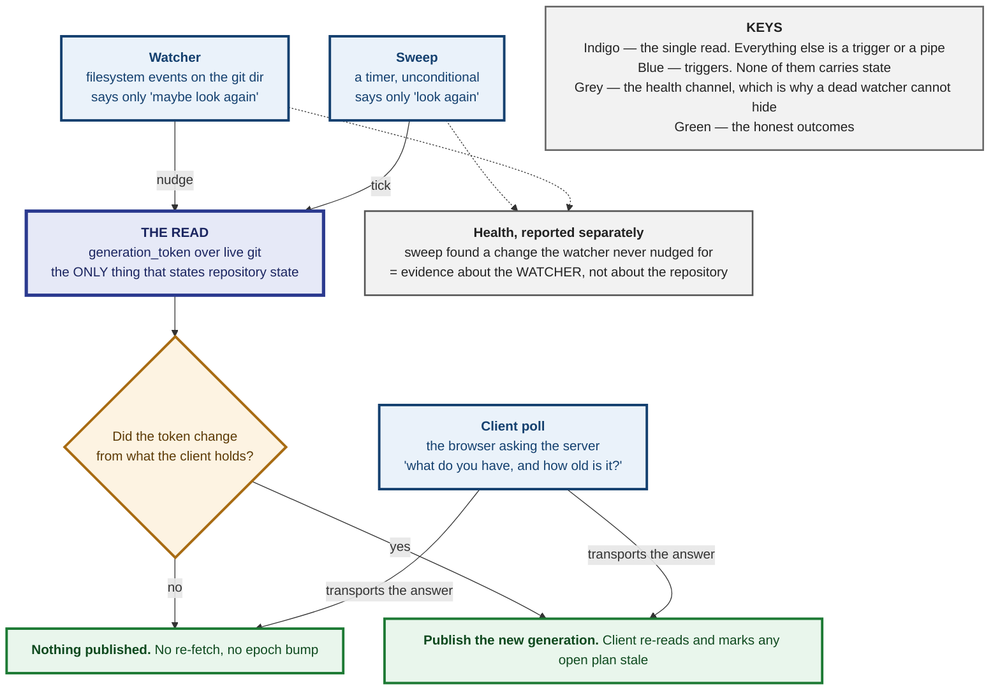
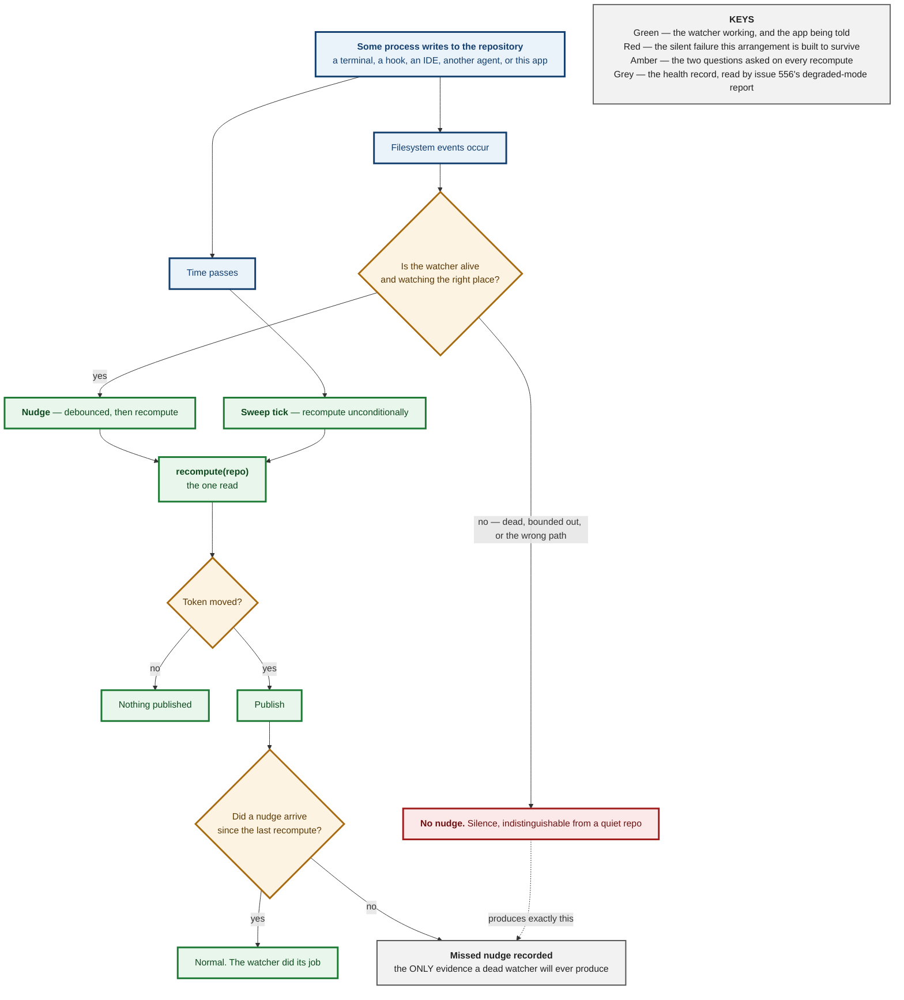
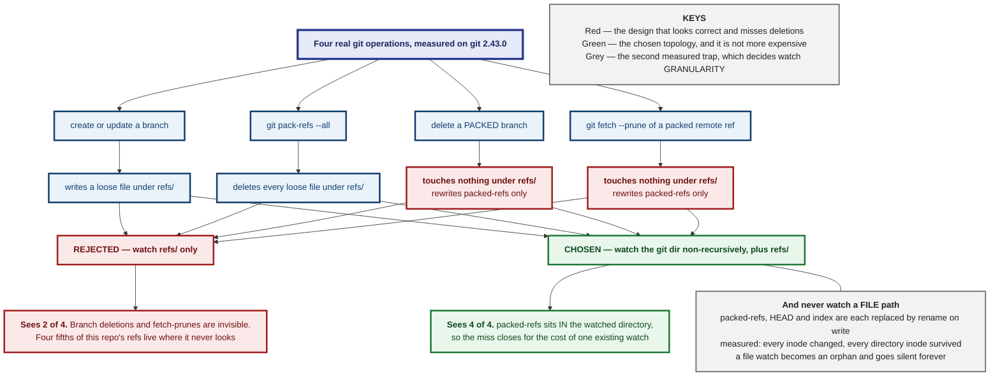
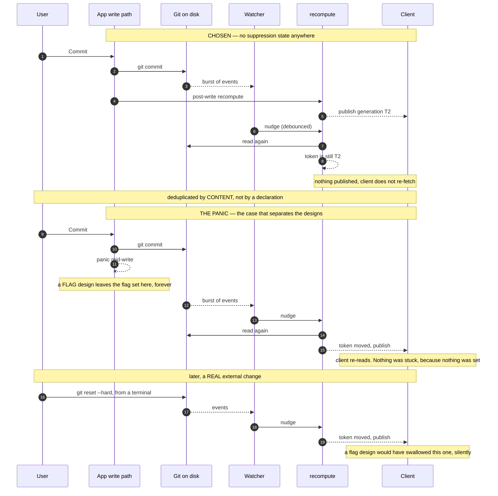
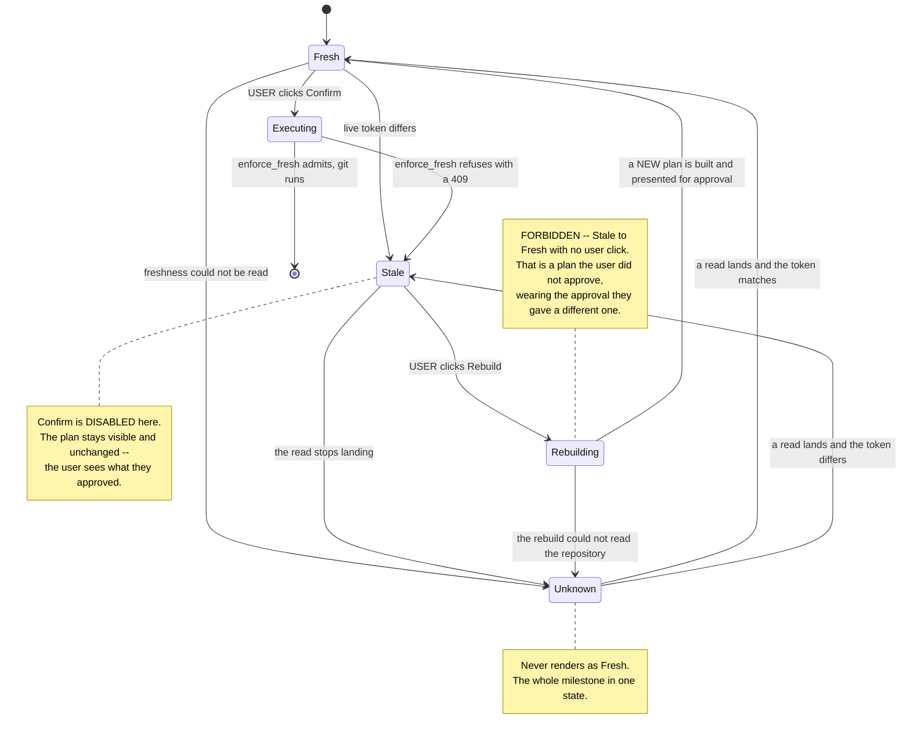
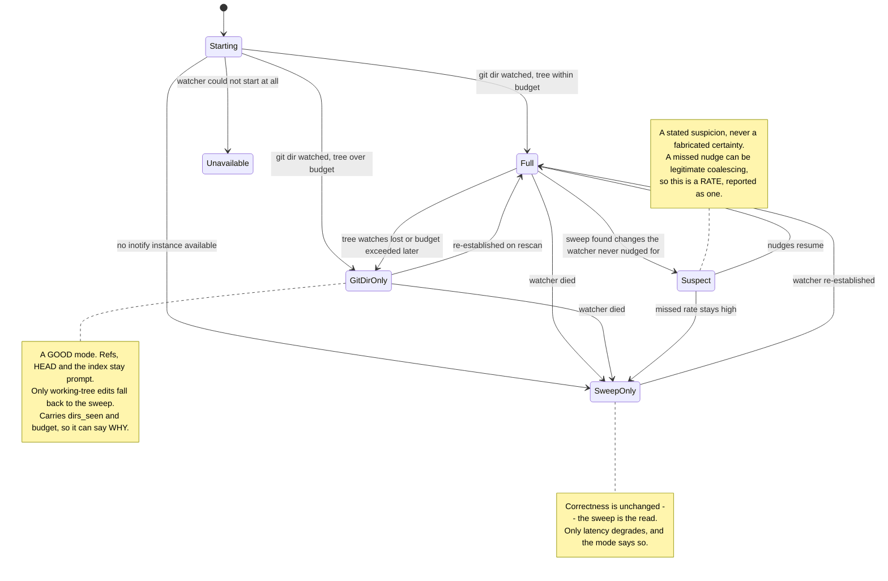
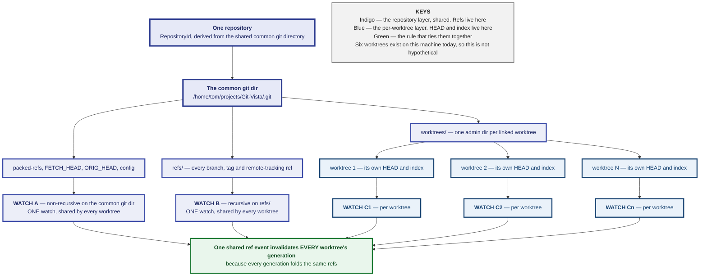

# M3.26 — How the App Learns the Repository Changed Under It: Decision Spec

<style>
h1:first-of-type { display: none !important; }
</style>

<div style="background:#2B3A8F;color:#fff;margin:3mm -14mm 0 -14mm;padding:9mm 14mm 8mm 14mm">
<p style="display:inline-block;border:1mm solid #fff;padding:2.5mm 5mm;font-size:18pt;font-weight:bold;letter-spacing:3pt;margin:0 0 4mm 0">NOTICE</p>
<p style="font-size:11pt;letter-spacing:3.2pt;text-transform:uppercase;font-weight:bold;margin:0 0 1.5mm 0;opacity:.93">Git-Vista &middot; milestone 12 &middot; issue #551</p>
<p style="font-size:29pt;font-weight:bold;letter-spacing:-1pt;line-height:1.02;margin:0 0 3mm 0">Someone else moved your stuff</p>
<p style="font-size:16pt;font-weight:bold;line-height:1.2;margin:0">The app should hear it from the repository &mdash; not from a refusal, three minutes later.</p>
</div>

<div style="padding:5mm 0 0 0">

<p style="font-size:13pt;line-height:1.34;margin:0 0 4.5mm 0;color:#141414">You use a terminal. You use an editor. Sometimes another
agent is working in the same folder. All of them change the project while the
app is showing it to you &mdash; and right now the app does not find out until
you press a button and get told no. <b>Nothing is unsafe.</b> The refusal
always happens and always will. What is missing is being told <em>before</em>
you press the button, and being told honestly when the app has lost track.</p>

<p style="font-size:11pt;text-transform:uppercase;letter-spacing:1.5pt;font-weight:bold;color:#1B2560;margin:0 0 2.5mm 0">What this document decides</p>

<div style="border-left:4mm solid #1d7a34;background:#eef7f0;padding:2.2mm 0 2.2mm 3.6mm;margin:0 0 2.5mm 0">
<p style="font-size:13.8pt;font-weight:bold;margin:0 0 1mm 0;line-height:1.2;color:#0f4a1f">The safety already exists. This is about being told sooner</p>
<p style="font-size:11.6pt;line-height:1.3;margin:0;color:#232323">Every plan you approve carries a fingerprint of the whole
repository, and the app refuses to run it if the fingerprint has changed. That
was built a year ago and it works. This milestone does not rebuild it &mdash;
it makes the screen catch up with what the refusal already knows.</p>
</div>

<div style="border-left:4mm solid #a86b12;background:#fdf6ea;padding:2.2mm 0 2.2mm 3.6mm;margin:0 0 2.5mm 0">
<p style="font-size:13.8pt;font-weight:bold;margin:0 0 1mm 0;line-height:1.2;color:#5c3a05">Git can delete a branch without touching any branch file</p>
<p style="font-size:11.6pt;line-height:1.3;margin:0;color:#232323">Git tidies its bookkeeping by sweeping thousands of
branch names into one file. After that, deleting a branch edits only that one
file &mdash; the folder full of branches never moves. A watcher pointed at the
folder sees a perfectly quiet repository while branches disappear. Measured
here today, not assumed.</p>
</div>

<div style="border-left:4mm solid #a11d1d;background:#fbeeee;padding:2.2mm 0 2.2mm 3.6mm;margin:0 0 2.5mm 0">
<p style="font-size:13.8pt;font-weight:bold;margin:0 0 1mm 0;line-height:1.2;color:#6d1111">A "don't look, that was me" note can get stuck</p>
<p style="font-size:11.6pt;line-height:1.3;margin:0;color:#232323">The obvious way to stop the app reacting to its own work
is to leave itself a note saying "ignore the next change." If the work then
crashes, the note is never taken down &mdash; and from that moment the app
ignores <em>everybody</em>, silently, forever. This document refuses that
design. There is no note.</p>
</div>

<div style="border-left:4mm solid #2B3A8F;background:#eceef8;padding:2.2mm 0 2.2mm 3.6mm;margin:0 0 0 0">
<p style="font-size:13.8pt;font-weight:bold;margin:0 0 1mm 0;line-height:1.2;color:#1B2560">"I could not tell" is a thing the app must be able to say</p>
<p style="font-size:11.6pt;line-height:1.3;margin:0;color:#232323">A watcher that has died and a repository where nothing is
happening look exactly the same: silence. Every mechanism here is required to
report which of the two it is in. That single rule decides most of this
document.</p>
</div>

</div>

<div style="background:#1B2560;color:#fff;padding:4.5mm 14mm 5mm 14mm;margin:5.5mm -14mm 0 -14mm">
<p style="font-size:11.6pt;margin:0 0 1.6mm 0;line-height:1.3"><span style="display:inline-block;background:#4A5BC4;color:#fff;font-size:9.5pt;font-weight:bold;padding:1mm 2.6mm;margin-right:2.6mm;letter-spacing:.7pt">MILESTONE</span> M12 &mdash; Reconciling External Changes</p>
<p style="font-size:11.6pt;margin:0 0 1.6mm 0;line-height:1.3"><span style="display:inline-block;background:#4A5BC4;color:#fff;font-size:9.5pt;font-weight:bold;padding:1mm 2.6mm;margin-right:2.6mm;letter-spacing:.7pt">THIS DOC</span> the design for #551, before any code &mdash; five issues wait on it</p>
<p style="font-size:11.6pt;margin:0 0 1.6mm 0;line-height:1.3"><span style="display:inline-block;background:#4A5BC4;color:#fff;font-size:9.5pt;font-weight:bold;padding:1mm 2.6mm;margin-right:2.6mm;letter-spacing:.7pt">DONE</span> the safety half &mdash; plans already refuse to run on a moved repository</p>
<p style="font-size:11.6pt;margin:0;line-height:1.3"><span style="display:inline-block;background:#4A5BC4;color:#fff;font-size:9.5pt;font-weight:bold;padding:1mm 2.6mm;margin-right:2.6mm;letter-spacing:.7pt">AHEAD</span> the honest half &mdash; noticing, saying so, and admitting when it cannot</p>
</div>

<div style="page-break-after:always"></div>

**Status:** Design spec, pre-ADR. Gates #552, #553, #554, #555 and #556.
**Companion to:** `m3.23-worktrees.md` (#76). That spec found most of its feature
already built and asked the app to *look*; this one finds the safety property
already held and asks the app to *say so in time*. Same shape, and the M11
worktree topology it establishes is load-bearing here — see **The worktree
topology** below.

---

## Context

Issue #79 asks the app to "detect and reconcile changes made by terminals,
hooks, IDEs, and other Git clients." Its five acceptance criteria each hide a
design question with more than one defensible answer, which is why this
document exists before any of them is built.

The striking thing, verified before proposing anything, is the same thing #76
found: **the hard, dangerous half is already done.**

### What exists today, checked rather than assumed

| what | state |
|---|---|
| **The staleness digest** | **DONE.** `generation_token` (`git-vista-server/src/planner.rs:1099`) folds HEAD's branch and tip, **every** ref, `refs/stash` and `git status --porcelain=v2` into one opaque token. Its own doc: *"any of them moving means the repository the plan described no longer exists"* (`planner.rs:1093-1098`). |
| **Enforcement** | **DONE.** `enforce_fresh` (`planner.rs:1300`) recomputes the live token and refuses execution — `409`, fail-closed — the moment it differs from the plan's (`planner.rs:1323`). `Plan::generation`'s own doc says execution *"is admitted only while the worktree's live generation still equals this token"* (`git-vista-protocol/src/plan.rs:1589-1591`). |
| **Unreadable ≠ unchanged** | **DONE, and it is the house style.** `Obs<T>` (`planner.rs:739`) refuses to derive `PartialEq` precisely so two failed reads cannot compare equal (`planner.rs:727-736`), and `stash_digest_input` makes an unreadable stash digest **uniquely** per call so it invalidates every plan rather than hashing as "no stash" (`planner.rs:1167-1174`). |
| **A client-side invalidation intake** | **DONE, and it is the seam this milestone plugs into.** `GraphCore::on_invalidate` (`git-vista/src/features/graph/core.rs:76-97`) takes an `Invalidate { generation, scope }` and re-reads **only when the generation actually differs** — same token means `Applied::NoChange` (`graph/core.rs:91`). |
| **Recognising the app's own write** | **HALF DONE.** `Operations::settle` already publishes the post-execution generation (`git-vista/src/features/operations/core.rs:407-413`), sourced from a live recompute after execution (`planner.rs:349`). Nothing yet compares an *externally-triggered* observation against it. |
| **Noticing anything at all** | **MISSING.** There is no filesystem watcher: the workspace has no `notify`, `inotify` or equivalent dependency (root `Cargo.toml`, `[workspace.dependencies]`). |
| **A periodic re-read** | **MISSING.** The server runs exactly one background timer — `BOOTSTRAP_REFRESH_INTERVAL`, 60 s, refreshing the sign-in token (`session.rs:55`, `main.rs:322-329`). Nothing re-reads the repository. |
| **A push channel to the browser** | **MISSING.** Every route in `main.rs:420-...` is `get`/`post`. No SSE, no WebSocket. |

**So #79 is not "make the app safe against external changes." It is
"make the app *admit* an external change it is already protected from, promptly,
and admit when it cannot tell."** Promptness and honesty, not safety.

### The gap, stated exactly

ADR 0055 already recorded this failure with a real cost: on 2026-08-12 the app
showed a branch and dirty-file badge **19 hours old**, and the operator acted on
it. That ADR's fix was honesty, not promptness — `RepoStatus` gained a
server-stamped `scanned_at` (`handlers/read.rs:913`) and the chip renders its own
age. Its diagnosis is this milestone's premise, quoted from the ADR: the client
*"is fetched once when its Leptos resource's key changes … Nothing refreshes it
on a timer or on window focus."*

M12 is the other half of ADR 0055. Same disease, one layer up: today a plan
sitting on screen after the repository moved is **pixel-identical** to one that
is still good, and the user discovers the difference by being refused.

---

## The governing constraint

Everything below is derived from one sentence, and it is worth stating before
the decisions rather than inside one:

> **An event never carries state. It only ever triggers a read.**

The app's belief about the repository is set by a *read* — `generation_token`
over live git — and by nothing else. A filesystem event is not evidence about
any ref; it is a suggestion that reading again might be worthwhile. A timer is
the same suggestion, arriving on a schedule instead of on a nudge.

Three things fall out immediately, and each of them settles a question that
would otherwise be argued:

1. **The watcher and the sweep cannot disagree about the repository**, because
   neither of them says anything about it. They are two triggers on one code
   path. "Which is authoritative" dissolves — the *read* is authoritative, and
   there is only one.
2. **The only disagreement possible is about the watcher's health**: the sweep
   fired, the read moved, and the watcher never nudged. That is evidence the
   watcher is missing events — which is exactly what #553 asks to be recorded
   rather than discarded.
3. **A watcher can only ever make the app faster, never wronger.** Which means
   its bound (#556) is a latency decision, not a correctness one — and that is
   what makes degrading to sweep-only an honest answer instead of a quiet loss.

The second governing rule is the one #79 states, and it applies to every
mechanism here without exception:

> **"I could not tell" must never render as "nothing changed."**

This codebase already keeps that rule in the small — `Obs::Unknown`,
`HeadBranch::Unknown`, `Advisory::DefaultBranchUnknown`, `Blame::UnknownOperation`
— and a watcher is the one component that breaks it by default, because a dead
watcher and a quiet repository produce byte-identical output: nothing.

The diagram at the end of this section is the whole architecture in one picture;
every decision below is an elaboration of it.



---

## Decision 1 — Both, and they are one code path with two triggers

**The decision.** Ship a watcher *and* a sweep. Neither is authoritative,
because neither states anything: both call the same `recompute(repo)`, which
performs the same read and compares the same token. The sweep runs
unconditionally at its cadence whether or not the watcher is alive; the watcher
exists solely to make the common case faster than the cadence.

**Why not a watcher alone.** Its failure mode is silence, and silence is the
one output that cannot be distinguished from a correct answer. inotify watches
are lost when a watched directory is replaced; the watch limit is a shared
system resource other processes consume; and debouncing (#552) drops events *by
design*. A design in which the watcher is believed has no mechanism by which it
can ever be corrected.

**Why not a sweep alone.** It is correct and it is slow. A cadence tight enough
to feel prompt is a cadence that re-reads a repository hundreds of times an hour
for nothing — on a 4-core box with the system disk spinning, competing with the
`buildlock`'d cargo runs that are the actual work.

**Why they are not "two sources".** Because of the governing constraint. Two
sources of *state* would need a conflict rule, and the rule would be exercised
exactly when something was already wrong. Two triggers on one read need no
conflict rule at all. This is the single most load-bearing simplification in
this document and #552/#553 should be written against it directly: **there is
one `recompute`, and it is the only function permitted to update what the server
believes about the repository.**

**What is done with a disagreement.** When a sweep's recompute finds a moved
token and no watcher nudge arrived since the previous recompute, that is
recorded as a **missed nudge** against the watcher — a counter and a last-missed
timestamp on the watcher's own health record, not a log line that scrolls away.
#553's acceptance requires this be recorded rather than discarded; the reason it
matters is that a watcher which has silently stopped shows up here as a rising
count long before anyone notices the app feels sluggish. A watcher whose missed
count is climbing is a watcher to be reported as degraded, and **the count is
the only evidence that will ever exist**, because the alternative — noticing
that no events are arriving — is indistinguishable from a quiet afternoon.

**The one honest caveat, and it must not be papered over.** A missed nudge is
not *proof* of watcher failure. A change that lands entirely between two
recomputes, or a coalesced burst, can legitimately produce one. So the health
signal is a *rate*, reported as such, and the degraded verdict it feeds is
`WatchHealth::Suspect { missed, since }` — a stated suspicion, never a
fabricated certainty. That distinction is the same one `Obs` draws and the same
one `Serviceable` drew in #76.



---

## Decision 2 — Watch directories, filter by name. Never watch a file

This is the decision that decides whether #552 works at all, and both halves of
it were measured on this box rather than reasoned about.

### The `packed-refs` miss, measured

Git stores a ref either as a loose file under `refs/` or as a line in one
`packed-refs` file. The consequence a watcher design must survive is **asymmetric**,
and the asymmetry is the trap:

| operation | does anything under `refs/` move? | measured |
|---|---|---|
| create or update a branch (packed or not) | **yes** — a loose file is written | `git branch b4` while packed created `.git/refs/heads/b4` |
| `git pack-refs --all` | **yes** — every loose file is *deleted* | `.git/refs/heads/` went from 4 files to 0 |
| **delete a branch that is packed** | **NO** | zero files under `refs/` before and after `git branch -D b2`; only `packed-refs` changed |
| **`git fetch --prune` pruning a packed remote-tracking ref** | **NO** | `refs/remotes/origin/feat-a` vanished from `git for-each-ref`; the only loose file present was unchanged; only `packed-refs` moved |

Measured with git 2.43.0 on this machine on 2026-08-26, in throwaway
repositories. **The reflog is not a rescue**: deleting a packed remote-tracking
ref wrote no reflog line (`.git/logs/HEAD` mtime unchanged), and `pack-refs`
writes none either.

So a watcher pointed only at `refs/` sees a perfectly quiet repository while
branches are being deleted — and deletion is not an exotic case. It is what
`git fetch --prune` does on every fetch after upstream tidies, and this
repository is the shape where it bites: **1023 refs, of which only 203 are
loose; 826 lines in `packed-refs`.** Four fifths of this repository's refs live
in the file a naive watcher never looks at.

The reading side is already fine, and that is worth stating so #552 does not
"fix" it: `refs_digest_input` builds on `git_vista_git::read_refs`
(`planner.rs:1180`), which iterates the **ref store** — `repo.references()?`
then `platform.all()?` (`git-vista-git/src/refs.rs:114-119`) — rather than
walking the `refs/` directory. The digest's coverage of packed refs is not in
question here; only the watcher's.

> **An obligation, not a claim.** No test in this repository currently proves
> that a change to a ref existing *only* in `packed-refs` moves the generation
> token. The one `pack-refs` test in the crate asserts the loose tag file
> disappears (`git-vista-git/src/tags.rs:481-484`), which is a different
> property. #553 must add that test — by running `git pack-refs --all` and then
> `git branch -D`, never by touching the file — and it should be one of the two
> mutations.

### The rename-over miss, measured

Every git write of interest is a lockfile-plus-rename: `packed-refs.lock` →
rename, `HEAD.lock` → rename, `index.lock` → rename. This codebase already
knows it — `refuse_if_git_busy`'s doc describes a process that "died before
renaming it onto `index`" (`coordinator.rs:105-108`).

An inotify watch registered on a *file path* binds the **inode**. After a
rename-over, the watch is holding an orphan and will never fire again, silently
— which is this milestone's own failure mode, aimed at the mechanism this
milestone builds. Measured, same session:

| watched path | inode before | inode after | verdict |
|---|---|---|---|
| `.git/packed-refs` across a packed-branch delete | 39978010 | 39978000 | **replaced** |
| `.git/HEAD` across a `git checkout` | 39977988 | 39977993 | **replaced** |
| `.git/index` across a `git add` | 39977990 | 39978007 | **replaced** |
| `.git/refs/heads` *directory* across `pack-refs --all` | 39977986 | 39977986 | **survives** |

Every file is replaced. Every directory survives. That is the whole decision.

### The decision

**Watch directories; filter events by filename. Never register a watch on a
file path.** Concretely:

- **One non-recursive watch on the common git directory**
  (`git rev-parse --git-common-dir`). This single watch covers `packed-refs`,
  `FETCH_HEAD`, `ORIG_HEAD`, `MERGE_HEAD` and `config` — every one of them a
  rename-over target, none of them individually watched.
- **One non-recursive watch on the per-worktree git directory**
  (`git rev-parse --absolute-git-dir`), covering that worktree's `HEAD` and
  `index`. In the main tree these are the same directory and the watch is not
  duplicated; in a linked worktree they differ, and both are needed. See
  **The worktree topology**.
- **A recursive watch on `<common>/refs`.** It is small and its shape is
  bounded by the number of ref *namespaces*, not the number of refs — 826 of
  this repository's refs are packed into a single file and cost nothing.
- **`<common>/logs` is deliberately NOT watched.** The measurement above shows
  the reflog misses the packed deletions, so it adds cost without closing the
  gap it looks like it would close.
- **The working tree is a separate, budgeted decision** — see Decision 5.

Because packing does not change any ref's *target*, `git pack-refs` moves no
generation token at all; it is a storage rearrangement, and the digest is
invariant across it by construction. The event a watcher must not miss is not
the packing — it is the **deletion of an already-packed ref**, which the common
git-dir watch catches for free.

The diagram at the end of this section contrasts the two watch topologies
against the four measured operations.



---

## Decision 3 — No flag. The app's own write is deduplicated by content

This is the question #554 calls the subtle one, and the honest answer is that
the mechanism already exists and needs no suppression state at all.

### The design that is rejected, and why

The obvious mechanism is a flag: set `expect_own_write = true` before the app's
git command, clear it after, ignore watcher events while it is set. It is
rejected outright, for the reason #79 states: **a flag set before a write is a
flag that stays set if the write panics.** From that moment the app ignores
every genuine external change, and the state is invisible — there is no symptom
except that the app stops noticing things, which is what it looked like before
the feature existed.

Variants of the same idea fail the same way:

- **A bounded suppression window** ("ignore events for 500 ms") cannot get stuck,
  but it swallows any genuine external change landing inside the window. That is
  the direction #554 correctly says loses data, and it trades an observable bug
  for an unobservable one.
- **Path-matching the app's own writes** requires predicting which files git will
  touch, which is exactly the prediction Decision 2 shows is unreliable.

### The decision: compare what was read against what is already believed

**There is no suppression state. Events are never ignored. The app's own write
is deduplicated because its effect is *already reflected* in the token the
client holds — not because anyone remembered to set a flag.**

The mechanism is the one already shipped:

1. The app executes a write through `plan_and_execute`, which recomputes the
   live generation *after* execution and stores it on the terminal operation
   record (`planner.rs:349`).
2. `Operations::settle` publishes it as `Invalidate { generation, scope }`
   (`operations/core.rs:407-413`) — its own doc says the token is carried "so a
   feature holding server state can compare it with what it already has and
   re-read only when the repository actually moved."
3. `GraphCore::on_invalidate` compares, and answers `Applied::NoChange` when the
   token matches (`graph/core.rs:91`).

M12 adds nothing to that path. It adds the *other* trigger: when a watcher nudge
or a sweep tick recomputes and the resulting token equals what the client
already holds, **nothing is published**, and the client does not re-fetch. The
app's own commit produces a burst of events, one recompute, a token the client
already has, and silence. Which is correct, and required no one to declare
anything.

**Why it cannot get stuck: there is nothing to get stuck.** After a mid-write
panic the client simply holds a token that no longer matches live git, so the
next nudge or sweep publishes and it re-reads. The failure direction is *one
extra read*, never a swallowed change. That is the difference between a
mechanism that is usually right and one that cannot be wrong in the dangerous
direction.

### The coordinator guard: defer, never suppress

The server serialises its own writes with one guard per `RepositoryId`
(`coordinator::lock`, `coordinator.rs:70`). It is tempting to treat "the guard
is held" as "these events are ours" — and that is **forbidden**, because it is
false: the guard binds only this process, and the module says so in its own
header (`coordinator.rs:18-21`, ADR 0019). A terminal can write concurrently;
git's own lock file is the only real exclusion.

The guard has exactly one admissible use here: **deferring a recompute until it
drops.** Recomputing mid-write would read a repository in an intermediate state
and produce a token that is neither the before nor the after — churn, not
error, since the post-write recompute corrects it. Deferring is a pure latency
optimisation that changes no verdict, because the recompute still happens and
still compares content.

And deferral cannot get stuck, for a *verified* reason rather than a hoped-for
one: the guard "releases when the returned value drops, **including while
unwinding from a panic**" (`coordinator.rs:64-68`, ADR 0019). A panicking write
releases the guard on the way out, the deferred recompute runs, and the app
notices. This property is precisely what makes deferral admissible where a flag
is not — and #554's mid-write panic test should assert it directly.

### What #554's read-count test must count

Stated explicitly, because it is the highest-risk ambiguity in this milestone
and a wrong reading builds a test that fails a correct implementation:

> The countable quantity is **client-side re-fetches** — `/api/frame`,
> `/api/status`, `/api/activity` and the paged history — and it must be **zero
> extra** for the app's own write beyond the one the settlement already causes.
>
> It is **not** server-side generation recomputes. The app's own write *does*
> cause one extra `recompute` on the server, from its own event burst. That is
> the design working: the recompute is what discovers the token is unchanged,
> and it is ~16 ms of git (see Decision 5) against a re-fetch that repaints the
> graph.

The diagram at the end of this section puts the rejected flag and the chosen
comparison side by side at the moment that separates them: a write that panics.



---

## Decision 4 — A stale plan says so. It is never rebuilt for you

### The rule that decides it

> **A plan that quietly re-derives itself is a plan the user did not approve.**

The options here are therefore not equal, and the security framing is not
decoration. A `Plan` is the reviewed artifact: it names the operation, the refs
that will move, the risk level and the recovery strategy, and the user's click
is consent to *that*. Re-deriving it against a changed repository and leaving it
on screen produces a plan the user never saw, wearing the approval they gave a
different one.

### The decision

**The plan panel gains a freshness state, and a stale plan offers a rebuild the
user must accept. It is never rebuilt in place.**

Three states, not two, because the third is the one this repository keeps
insisting on:

| state | when | what the panel does |
|---|---|---|
| `Fresh` | live token equals the plan's | normal. Confirm is offered |
| `Stale { .. }` | live token differs | says so, names what moved where it can, **disables confirm**, offers "Rebuild this plan" |
| `Unknown { .. }` | freshness could not be determined — the read failed, the sweep is down, the poll is not landing | says **that**, disables confirm, offers a retry |

`Unknown` renders as its own state and never as `Fresh`. This is the governing
rule at its most consequential: a panel that shows a confident green plan
because it could not reach the server is worse than one that shows nothing.

### The invariant to test, and it is the security property

> **The panel's verdict may never be more optimistic than `enforce_fresh`.**

If `enforce_fresh` would refuse (`planner.rs:1323`), the panel must not be
showing `Fresh`. This is testable directly and mechanically, and it is the
assertion #555 should build its mutations around: suppress the staleness signal
and the test must go red; weaken the execution-time check and a *different*
assertion must go red.

It also settles the tempting refinement, which is the trap in this decision.

### Does an unrelated change matter? Recommendation, with the trap named

A plan may be stale in a way that changes everything (the branch about to be
force-pushed moved) or in a way that does not (an unrelated tag was created).
The distinction *is* drawable — a `Plan` carries `RefChange` entries naming the
refs it expects to move (`planner.rs:1731`), already rendered to the user by
`explain/core.rs:323`.

**The recommendation: draw it, but as an additive annotation only — never as a
suppression.** Concretely:

- Every generation change stales the plan. No exceptions, because
  `generation_token` folds the whole repository and `enforce_fresh` will refuse
  regardless of what moved.
- *When* the change touches a ref the plan names, the panel says so specifically
  — "`main` moved; that is the branch this push would update" — which is
  strictly more useful than "the repository changed."
- When it does not, the panel still says stale, and may say "nothing this plan
  touches moved, but the repository did."

The trap being avoided is the inverted version: *only* stale the plan when one
of its own refs moved. That produces a panel showing `Fresh` on a plan the
server will refuse — the exact "looks good, gets refused" gap this milestone
exists to close, rebuilt facing the other way. It fails the invariant above by
construction, which is why the invariant is worth having.

There is also a plain reason not to attempt it: `generation_token` is opaque and
compared only for equality (`planner.rs:1095-1096`). You cannot ask it *what*
changed. Answering "did a ref this plan names move?" needs a second, structured
read, and shipping that as an *annotation* means it can fail without changing
any verdict — whereas shipping it as the staleness rule means its failure is a
wrong verdict.

The diagram at the end of this section is the plan panel's lifecycle, with the
one forbidden transition drawn as forbidden.



---

## Decision 5 — The bound, its derivation, and what is given up

### The working tree is the expensive half, and it is the part being bounded

The git directory watch from Decision 2 is a handful of watches and is never
bounded out. The cost question is entirely about the **working tree**, where
inotify needs one watch per directory, recursively.

The relevant numbers, measured on this box:

| quantity | value |
|---|---|
| `fs.inotify.max_user_watches` | **524288** |
| `fs.inotify.max_user_instances` | **128** |
| `fs.inotify.max_queued_events` | **16384** |
| Git-Vista: non-ignored directories in the working tree | **99** |
| Git-Vista: tracked files | **693** |
| Git-Vista: `target/` — a build tree, ignored | tens of thousands of directories |

The watch limit is a **shared system resource**. Consuming it generously is not
a local decision: it degrades every other watcher on this machine. And a
recursive watch that descends into `target/` during a `buildlock`'d cargo run is
not a theoretical cost — it is the same resource that took load average to 42 on
19 August.

### The decision

**A tiered watch with a derived budget and an observable degraded mode.**

1. **Tier 1 — the git directory. Always on, never bounded out.** A fixed small
   number of watches, independent of repository size. If tier 1 cannot be
   established, the watcher is `Unavailable` and the app is sweep-only, said out
   loud.
2. **Tier 2 — the working tree, recursive, budgeted.** Ignored paths are never
   descended into: `target/`, `node_modules/`, `.git/` itself. Enumeration stops
   the moment the budget is reached — it does not enumerate the whole tree to
   discover it is too big.
3. **The budget is derived, not picked:**

   ```
   per_repo_watch_budget = min(4096, max_user_watches / 128)
   ```

   On this box: `min(4096, 4096) = 4096` directories. On a machine with the
   older 8192 default the same formula yields **64**, which bounds out
   immediately and correctly on anything but a toy repository — that is the
   formula working, not failing. `max_user_watches` is read at startup; if it
   cannot be read, the value is `Unknown` and the budget is a conservative floor
   with the reason stated, never an optimistic guess.

4. **Instances are budgeted too.** `max_user_instances` is **128** on this box
   and is per-user, shared with everything else the user runs. One inotify
   instance per served repository, capped well below the limit.

5. **Hitting the budget is a state, not a quiet reduction:**

   ```
   WatchMode::Full
   WatchMode::GitDirOnly { reason: TreeBudgetExceeded { dirs_seen, budget } }
   WatchMode::SweepOnly { reason }
   WatchMode::Unavailable { reason }
   ```

   Every variant carries its reason. `GitDirOnly` is a perfectly good mode —
   refs, HEAD and the index are still prompt, and only working-tree edits fall
   back to the sweep cadence. The failure this milestone exists to prevent is
   entering it **silently**.

### The cadence, and the number it comes from

One recompute is the reads `generation_token` makes. Measured on the real
Git-Vista repository (693 tracked files, 1023 refs), warm cache, average of ten:

| read | cost |
|---|---|
| `git status --porcelain=v2` | **7 ms** |
| enumerate refs | **5 ms** |
| `git rev-parse HEAD` | **2 ms** |
| `git rev-parse refs/stash` | **2 ms** |
| **one recompute, total** | **≈ 16 ms** |

At a 2-second sweep that is a **0.8% duty cycle** — negligible. But this is a
**warm-cache** figure on a box whose system disk spins, and the sweep would
compete with `buildlock`'d cargo runs for exactly that disk.

**#553 must take the cold-cache measurement and state it in the PR.** A cadence
derived from the warm number alone is a cadence derived from the easy case.

Two further cadence rules that are part of the decision, not optimisations:

- **Back off when no client is connected.** A server nobody is looking at should
  not be re-reading a repository every two seconds. The sweep drops to a long
  interval and returns to the tight one on the first client poll.
- **Debounce with a maximum delay.** A checkout produces hundreds of events;
  coalescing them is necessary and is also how the last event of a burst gets
  dropped. A trailing-edge debounce with a **hard cap** on total delay means a
  continuous burst still reports, and the sweep is the backstop underneath it.
  #552's acceptance requires the edge be tested; the cap is what makes it
  passable.

The diagram at the end of this section is the mode lattice — every transition,
and every one of them saying which mode it entered and why.



---

## Decision 6 — How promptness reaches the browser

The five questions do not ask this, and a build that starts without deciding it
discovers it on day two. There is no push channel: every route is `get`/`post`
(`main.rs:420-...`), and nothing in the workspace speaks SSE or WebSocket.

**The decision: a cheap dedicated endpoint, polled by the client.** The server's
watcher makes its answer *fresh*; the server's sweep makes it *correct*; the
client's poll is transport and nothing else. Three clocks, three failure modes,
each reported separately.

The endpoint returns the current generation, the reading's age (the ADR 0055
pattern, already the house style), and the watch mode with its reason. It is
`no-store`, like every other live read in `read.rs`, and it is answered from the
server's *last recompute* rather than by recomputing per request — otherwise a
2-second client poll silently becomes a 2-second sweep, and the budgeting in
Decision 5 means nothing.

**Why not reuse an existing endpoint.** Checked rather than assumed:
`/api/status` runs a fresh `git status --porcelain=v2 --branch` on every request
(`handlers/read.rs:895-899`) and carries no generation; `/api/status/v2` and
`/api/frame` each carry a generation but do real work per call. None is cheap
enough for a 2-second poll.

**Why not SSE.** It is the natural upgrade and should be named as such. It is
rejected for the first slice because it adds a long-lived connection to an
auth/CSRF surface the security model deliberately keeps narrow, and because a
small `no-store` GET on loopback costs approximately nothing. The important
point is that this is a **transport swap, not a redesign**: the generation-based
comparison in Decision 3 is identical whether the token arrives by poll or by
push.

### The generation-namespace trap, which would otherwise be discovered late

`staging.rs:26-35` records, in the source, that **four mutually incompatible
generation namespaces already exist**, and that comparing a token from one
against a token from another *"409s forever, never admits"*:

| producer | namespace | what it folds |
|---|---|---|
| `planner::generation_token` | bare decimal | HEAD branch + tip, every ref, `refs/stash`, `git status` porcelain |
| `history.rs` | `history-v1:` | HEAD, every full ref name, shallow boundaries — **deliberately no index or worktree** (`history.rs:135-138`) |
| `/api/status/v2` | `status-v1:` | folds in the porcelain bytes |
| the #213 diff read | `diff-v1:` | its own |

**M12 must not mint a fifth.** The endpoint serves the **planner's** token —
bare decimal, from `generation_token` — because that is the one `enforce_fresh`
compares against (`planner.rs:1323`), and Decision 4's invariant is that the
panel may never be more optimistic than `enforce_fresh`. Any other choice breaks
that invariant at the type level.

Two consequences to write down before someone rediscovers them:

- The graph's *data* comes from `/api/frame` under the `history-v1:` token,
  while `GraphCore` holds a planner token for its invalidation decisions
  (seeded from `Settlement`; `GraphCore::at_generation` is test-only, per
  `reachability_census.rs:762-765`). These are different digests over
  overlapping inputs.
- Because the planner token folds worktree status and the history token does
  not, **a pure working-tree edit moves the planner token and re-reads a graph
  that cannot have changed.** That is an over-read, not a wrong answer — the
  fail-safe direction — and it is the price of using the token that matches the
  enforcement gate. It should be stated in #555 rather than "fixed" by
  introducing a fifth namespace.

---

## The worktree topology

M11 (#546–#550) makes linked worktrees first-class, and the watch topology is
not per-repository or per-worktree — **it is both at once.** #552 written
against a single-worktree assumption would be wrong in a way that only shows up
on Tom's own machine, where six worktrees exist today.

The facts, verified:

- In a linked worktree, `.git` is a **file**, not a directory. In this very
  worktree it reads `gitdir: /home/tom/projects/Git-Vista/.git/worktrees/agent-…`.
  `refuse_if_git_busy` already handles this, resolving the git dir with
  `git rev-parse --absolute-git-dir` rather than assuming `<repo>/.git`
  (`coordinator.rs:119-125`).
- Refs, `packed-refs` and the object store are **shared by every linked
  worktree**, and `RepositoryId` is derived from that shared common directory —
  which is why the mutation coordinator keys on `RepositoryId` and not
  `WorktreeId` (`coordinator.rs:12-16`).
- `HEAD` and `index` are **per-worktree**, living under
  `<common>/worktrees/<name>/`.
- A generation is **per-worktree** (`plan.rs:106-107`, ADR 0001), because it
  folds that worktree's HEAD and status.

So: **watch refs once per repository; watch HEAD and index once per worktree;
publish per worktree.** One `git pack-refs` in any worktree is one shared event
that must invalidate every worktree's generation, since every one of them folds
those refs. This falls out of Decision 2's topology for free — the common
git-dir watch is naturally per-repository and the per-worktree git-dir watch is
naturally per-worktree — but only if it is written down first, which is the
point of this section.

The diagram at the end of this section shows which watch belongs to which layer.



---

## What this spec does NOT decide

- **It does not change any safety property.** `enforce_fresh` and
  `generation_token` are untouched. If this entire milestone were reverted, no
  plan would execute that does not execute today.
- **It does not specify the watcher crate.** `notify` is the obvious candidate
  and nothing here depends on it; the requirement is directory watches with
  filename filtering, which every inotify wrapper provides. Choosing and
  reviewing the dependency is #552's job, under `docs/NATIVE_DEPENDENCIES.md`.
- **It does not decide the wire shape of the poll endpoint.** Decision 6 fixes
  its *content* (planner-namespace generation, reading age, watch mode with
  reason) and its cost model. Field names, protocol-version implications and
  whether it is additive to an existing DTO are #552's to settle against
  `version.rs`'s stated policy.
- **It does not address reftable.** Git 2.45 introduced an alternative ref
  storage backend in which `refs/` and `packed-refs` do not exist. **Git on this
  box is 2.43.0 and does not support it** — `git init --ref-format=reftable`
  fails with "unknown option", measured. So it is not a present concern, and a
  watcher must not silently mis-handle it later: #552 should detect a repository
  whose refs it cannot locate and enter `WatchMode::GitDirOnly` with a stated
  reason rather than reporting a healthy watch over directories that do not
  exist. The sweep covers it correctly either way, because the sweep reads
  through git.
- **It does not model network-side changes.** A remote moving is not an external
  change to this repository until a fetch brings it here, at which point it is
  an ordinary ref change.
- **It does not decide whether the app acts on what it notices.** Auto-fetch,
  auto-refresh of a scrolled history, or any other reaction beyond "the screen
  now reflects the repository and any open plan says it is stale" is out of
  scope and would need its own spec.
- **It does not cover `git gc` object churn.** Objects being repacked changes no
  ref and moves no generation. `.git/objects` is deliberately unwatched.

---

## Open questions

### Tom's, and they should not be settled without him

**1. The sweep cadence.** The measurement says a 2-second sweep costs about
0.8% of one core, warm. The honest caveat is that Git-Vista's objects live on
the spinning system disk and the sweep competes with `buildlock`'d cargo runs
for it. **Recommended: 2 seconds while a client is connected, 60 seconds when
none is, with the cold-cache figure measured in #553 before the number is
frozen.** The trade is promptness against disk churn on his box during builds,
and that is his call, not a derivation.

**2. Is the working tree watched recursively at all?** Tier 2 in Decision 5
exists to make an editor save show up in under a second. Without it, a
working-tree edit is caught by the sweep at its cadence and nothing else — which
is *correct*, just slower, and the status chip already carries its own age from
ADR 0055 so the delay is visible rather than hidden. **Recommended: yes, with
the derived budget**, because the M12.06 storm risk is `target/`, and `target/`
is excluded by the ignore rules regardless. But the alternative — git-dir
watches only, sweep for the tree, zero recursive watches ever — is genuinely
defensible on a 4-core box, and it is a smaller first slice. His call.

**3. The M12 identity hue and mnemonic.** This document assigns M12 the indigo
`#2B3A8F` and the mnemonic **NOTICE** — *"It changed. The app says so, or says
it could not."* Per the fixed-mnemonic rule these are assigned once and never
reworded, so it is worth his confirmation before it propagates to cards and
briefs.

### Findings, not decisions — resolvable in the implementing issues

**4. No test proves the digest covers packed-only refs.** Named in Decision 2 as
an obligation on #553. It is a finding about test coverage, not a design
question.

**5. What the client does with `WatchMode` in the UI.** The mode and its reason
must reach the browser (Decision 5). Whether it renders as a chip, a banner, or
only inside the plan panel's `Unknown` state is a UI question for #555/#556, and
the constraint is only that a degraded mode must not be invisible.

**6. Whether the missed-nudge rate has a threshold that changes behaviour.**
Decision 1 makes `Suspect` a reported state. Whether a sustained miss rate
should *demote* the watcher to `SweepOnly` automatically, or only report, is a
tuning question best answered with real numbers from #553.

---

## Alternatives considered

**A watcher that is believed, with a sweep that corrects it.** This is the
design the issue names as the alternative, and it is rejected by the governing
constraint rather than by preference: it requires events to carry state, which
means a conflict rule, which is exercised precisely when something is already
broken. Making the read the only source of state removes the conflict instead of
resolving it.

**A sweep alone, no watcher.** Genuinely defensible and materially simpler, and
it is what the app degrades to. Rejected as the *design* because a cadence tight
enough to feel prompt is a cadence that reads constantly, and on this box that
competes with the builds. The watcher exists to let the sweep be slow.

**A flag, or a bounded suppression window, for self-writes.** Rejected in
Decision 3. The flag can stick; the window swallows real changes. Both trade an
observable failure for an unobservable one, which is the trade this repository
has spent the month reversing.

**Watching individual files.** Rejected on measurement: `packed-refs`, `HEAD`
and `index` are each replaced by rename on every write, so a file watch becomes
an orphan and goes permanently silent — a watcher that stops watching, which is
the exact failure the milestone exists to prevent.

**Watching the reflog as a cheap universal signal.** Attractive — one file,
every ref update appends to it. Rejected on measurement: deleting a packed
remote-tracking ref wrote no reflog line, and `pack-refs` writes none either. It
misses the same cases `refs/`-only watching misses, while looking like it
covers everything.

**Staling a plan only when a ref it names moved.** Rejected in Decision 4:
it makes the panel more optimistic than `enforce_fresh`, which is the gap this
milestone closes, rebuilt facing the other way. Kept as an *annotation*, where
its failure costs precision rather than correctness.

**SSE or WebSocket push.** The natural upgrade, rejected for the first slice on
security-surface and cost grounds (Decision 6). Explicitly a transport swap
later, not a redesign — which is a property of the generation-comparison design
worth preserving deliberately.

**A new generation namespace for "the repository moved".** Rejected in Decision
6. Four incompatible namespaces already exist and the source says comparing
across them 409s forever. The planner's token is the one `enforce_fresh` uses,
so it is the only one that can satisfy Decision 4's invariant.

---

## Consequences

**The safety property is untouched, and that is the point.** Every decision here
adds a signal; none replaces a gate. `enforce_fresh` refuses exactly what it
refuses today. A reviewer's first question — "does this weaken the staleness
enforcement?" — has the answer *no, and it cannot*, because the panel's verdict
is required to be no more optimistic than the gate's.

**The first slice is a server-side sweep with no watcher at all.** Decision 1
makes the watcher a pure latency optimisation, so #553 can ship before #552 and
be useful on its own: an app that notices an external change within a couple of
seconds is already better than one that notices at the moment of refusal. That
ordering inverts the issue numbering, and it is the ordering to prefer.

**`WatchMode` is the shape to mutation-test.** A test that only checks
`Full` versus "not watching" will pass while `GitDirOnly` is silently treated as
healthy — which reintroduces exactly the invisible degradation #556 exists to
prevent. The test that matters: *entering a degraded mode is observable, and
says which mode and why.* The second mutation should make the degraded state
silent rather than removing the bound, since those fail differently.

**Decision 3 removes a whole class of work from #554.** There is no
deduplicator to build, no window to tune, and no stuck state to test for —
because there is no state. What #554 becomes is a test suite proving the
existing generation comparison holds under a mid-write panic, plus the read
counting defined above. That is a smaller issue than it looked.

**The `packed-refs` finding is the one that would have cost a rewrite.** A
watcher shipped against `refs/` alone would have passed every test written
against `git branch` and `git commit`, worked perfectly for weeks, and silently
missed every `fetch --prune` in a repository whose refs are four fifths packed.
Finding it before the build is the entire value of this milestone having a spec.

**It composes with M11 rather than colliding with it.** The per-repository /
per-worktree split falls out of the chosen topology for free, and the coordinator
already keys the right way (`coordinator.rs:12-16`). Had the watcher been
written per-worktree, a `pack-refs` in one worktree would have invalidated one
generation out of six.

---

## ADR

**ADR 0092 is reserved** for the decisions here that are expensive to reverse.
Next free number verified against `docs/adr/` — the highest present is 0091
(`0091-effects-are-derived-not-declared.md`).

Proposed title, in this repository's house style — a claim, not a topic:

> **0092 — An event never carries state; it only triggers a read**

That single decision carries Decisions 1, 3 and 6: it is what makes the sweep and
the watcher one code path, what makes self-write dedup content-addressed and
unstickable, and what makes SSE a later transport swap rather than a redesign.
Reversing it means reintroducing a conflict rule between two sources of truth,
which is a rewrite rather than a change.

A second ADR is likely warranted for Decision 4 — *a stale plan is never
rebuilt without a click* — since it is a security-boundary decision and the
invariant it establishes is testable. It should be numbered when #555 lands
rather than reserved now, so the number is not left dangling if the shape moves.

Decisions 2 and 5 are implementation decisions with measurements behind them;
they belong in the implementing PRs' prose and in code comments, not in an ADR.

---

**Signed:** max · 2026-08-26T17:40:00-04:00
