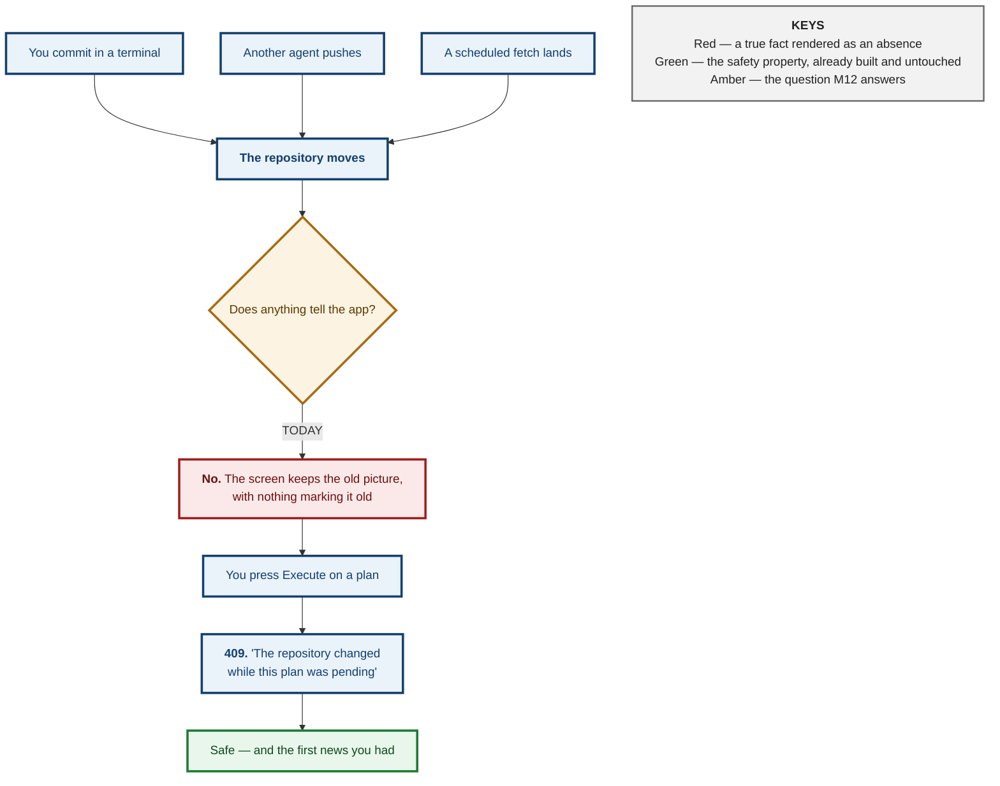
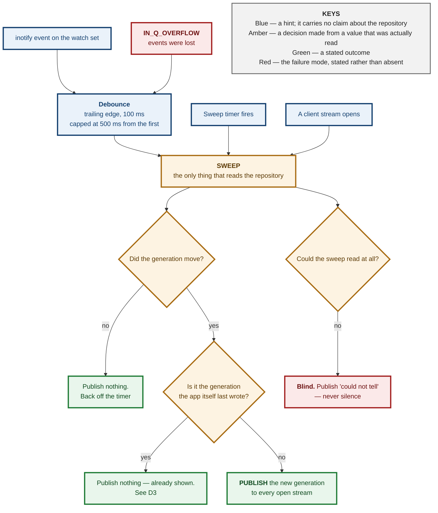
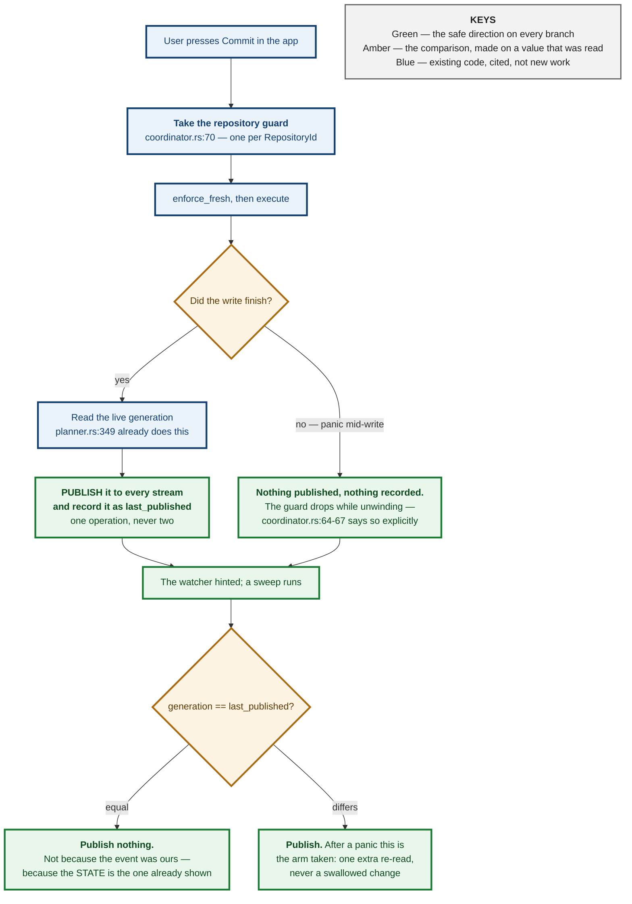
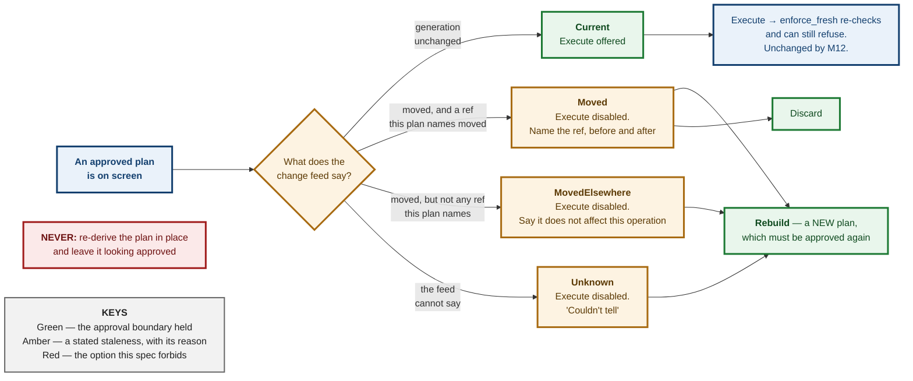
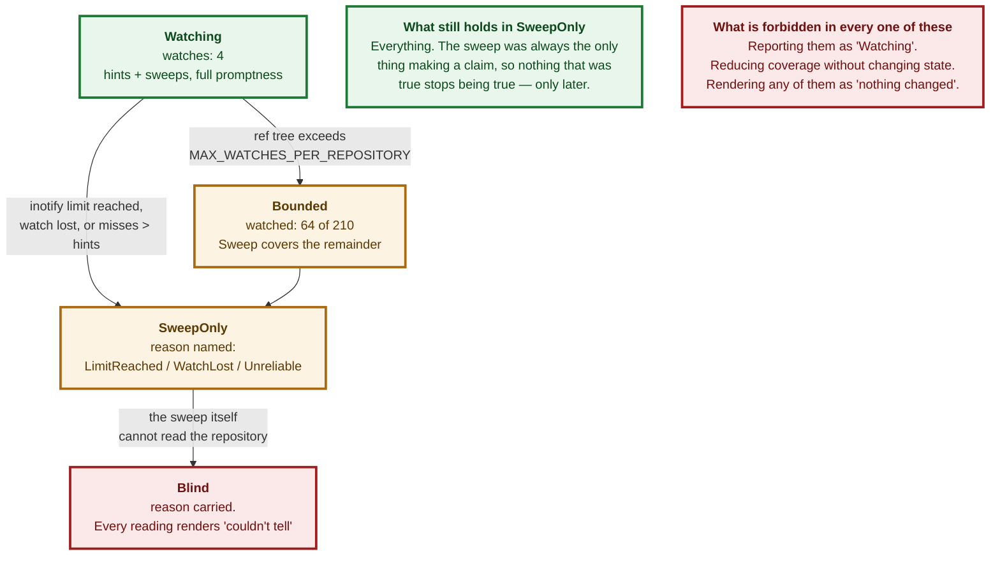

# M3.26 / M12 — Reconciling External Changes: Decision Spec

<style>
h1:first-of-type { display: none !important; }
</style>

<div style="background:#FF6B00;color:#fff;margin:3mm -14mm 0 -14mm;padding:9mm 14mm 8mm 14mm">
<p style="display:inline-block;border:1mm solid #fff;padding:2.5mm 5mm;font-size:18pt;font-weight:bold;letter-spacing:3pt;margin:0 0 4mm 0">NOTICE</p>
<p style="font-size:11pt;letter-spacing:3.2pt;text-transform:uppercase;font-weight:bold;margin:0 0 1.5mm 0;opacity:.93">Git-Vista &middot; milestone 12 &middot; issue #551 (from #79)</p>
<p style="font-size:29pt;font-weight:bold;letter-spacing:-1pt;line-height:1.02;margin:0 0 3mm 0">The world moved while you were looking at it</p>
<p style="font-size:16pt;font-weight:bold;line-height:1.2;margin:0">You ran <code style="background:rgba(0,0,0,.18);padding:0 1.5mm">git pull</code> in a terminal. The app is still showing you the repository from before.</p>
</div>

<div style="padding:5mm 0 0 0">

<p style="font-size:13pt;line-height:1.34;margin:0 0 4.5mm 0;color:#141414">The app reads your repository when you open it, and
after each change <em>it</em> makes. Nothing else. Commit from a terminal, pull, let
another agent push &mdash; the screen does not move, and there is no mark
anywhere saying it might be out of date. A picture from ten seconds ago and a
picture from yesterday look identical.</p>

<p style="font-size:11pt;text-transform:uppercase;letter-spacing:1.5pt;font-weight:bold;color:#7A2E00;margin:0 0 2.5mm 0">What this document decides</p>

<div style="border-left:4mm solid #1d7a34;background:#eef7f0;padding:2.2mm 0 2.2mm 3.6mm;margin:0 0 2.5mm 0">
<p style="font-size:13.8pt;font-weight:bold;margin:0 0 1mm 0;line-height:1.2;color:#0f4a1f">Nothing unsafe can happen today &mdash; that is already built</p>
<p style="font-size:11.6pt;line-height:1.3;margin:0;color:#232323">If the repository moves under an approved action, the app
already refuses to run it. The gap is not danger, it is <b>silence</b>: you find
out by being told no, at the moment you press the button. M12 moves that news
forward to when it happens.</p>
</div>

<div style="border-left:4mm solid #a86b12;background:#fdf6ea;padding:2.2mm 0 2.2mm 3.6mm;margin:0 0 2.5mm 0">
<p style="font-size:13.8pt;font-weight:bold;margin:0 0 1mm 0;line-height:1.2;color:#5c3a05">Watching a folder is the obvious answer and it quietly fails</p>
<p style="font-size:11.6pt;line-height:1.3;margin:0;color:#232323">Git often keeps its branch list in <b>one packed file</b>, not
as one file per branch. Verified below: on a fresh clone the branch folder is
completely <b>empty</b>, and deleting a branch changes nothing inside it. A watcher
aimed at that folder watches nothing, forever, and reports no news exactly the
way a quiet repository does.</p>
</div>

<div style="border-left:4mm solid #a11d1d;background:#fbeeee;padding:2.2mm 0 2.2mm 3.6mm;margin:0 0 2.5mm 0">
<p style="font-size:13.8pt;font-weight:bold;margin:0 0 1mm 0;line-height:1.2;color:#6d1111">The app must not mistake its own writes for yours</p>
<p style="font-size:11.6pt;line-height:1.3;margin:0;color:#232323">The tempting fix &mdash; &ldquo;ignore the next change, it is
mine&rdquo; &mdash; is a switch that stays flipped if the write dies half-way, and
from then on the app ignores <em>your</em> changes and cannot tell. This
repository has already shipped that exact bug once, in a different place, and
paid for it. The answer here is to hold <b>no switch at all</b>.</p>
</div>

</div>

<div style="background:#7A2E00;color:#fff;padding:4.5mm 14mm 5mm 14mm;margin:5.5mm -14mm 0 -14mm">
<p style="font-size:11.6pt;margin:0 0 1.6mm 0;line-height:1.3"><span style="display:inline-block;background:#FF6B00;color:#fff;font-size:9.5pt;font-weight:bold;padding:1mm 2.6mm;margin-right:2.6mm;letter-spacing:.7pt">MILESTONE</span> M12 &mdash; Reconciling External Changes</p>
<p style="font-size:11.6pt;margin:0 0 1.6mm 0;line-height:1.3"><span style="display:inline-block;background:#FF6B00;color:#fff;font-size:9.5pt;font-weight:bold;padding:1mm 2.6mm;margin-right:2.6mm;letter-spacing:.7pt">THIS DOC</span> the design for #551, and the gate on #552&ndash;#556</p>
<p style="font-size:11.6pt;margin:0 0 1.6mm 0;line-height:1.3"><span style="display:inline-block;background:#FF6B00;color:#fff;font-size:9.5pt;font-weight:bold;padding:1mm 2.6mm;margin-right:2.6mm;letter-spacing:.7pt">STATUS</span> design only &mdash; no code written for this issue, deliberately</p>
<p style="font-size:11.6pt;margin:0;line-height:1.3"><span style="display:inline-block;background:#FF6B00;color:#fff;font-size:9.5pt;font-weight:bold;padding:1mm 2.6mm;margin-right:2.6mm;letter-spacing:.7pt">ADR</span> 0092 reserved &mdash; contested with CLOUD-4/#450, see &sect;ADR</p>
</div>

<div style="page-break-after:always"></div>

**Status:** Design spec, pre-ADR. Written for #551; blocks #552, #553, #554, #555, #556.
**Modelled on:** `m3.23-worktrees.md`, and for the same reason — M11 could be
split cleanly because its spec existed first.
**Companion to:** ADR 0001 (the generation algorithm this whole design rides on)
and ADR 0055 (the last time a stale reading in this app was rendered as a fresh
one, and what was done about it).

---

## Context

### What exists today, checked rather than assumed

Seven spec citations in this repository have been wrong. Every claim in this
table was read in the source at the line given, in the tree at
`b7a947f`, before it was written down.

| what | state | where |
|---|---|---|
| **Execution-time staleness** | **DONE.** `generation_token` folds HEAD, every branch/tag/remote-branch ref, `refs/stash` and `git status --porcelain=v2` into one digest; `enforce_fresh` refuses execution unless the live digest still *equals* the plan's. | `planner.rs:1099`, `planner.rs:1300`, `planner.rs:1323` |
| **The three-state discipline** | **DONE, and load-bearing.** `Obs` separates "git said no" from "git could not be asked", and `Obs::Unknown` digests with a **nonce** so an unread repository can never hash equal to itself. | `planner.rs:739`, `planner.rs:809-822` |
| **Post-write generation** | **DONE.** After every executed operation the server already computes the resulting generation and puts it on the operation's terminal record — commented, verbatim, as "the datum a reconnecting client uses to decide whether its cached graph is stale". | `planner.rs:349` |
| **Content-addressed self-write dedup, client side** | **DONE.** `GraphCore::on_invalidate` re-reads only when the settlement's generation differs from the one it holds — and re-reads unconditionally when the server reported **no** generation. | `graph/core.rs:76-98` |
| **A per-repository write guard released on panic** | **DONE.** One `tokio::sync::Mutex` per `RepositoryId`; its doc states the guard "releases when the returned value drops, **including while unwinding from a panic**". | `coordinator.rs:70`, doc at `coordinator.rs:64-67` |
| **A cheap ref+index read with no git spawn** | **DONE.** `read_generation_inputs` takes one `gix` open and collects HEAD, every ref, and the index checksum. No `git status`, no worktree walk. | `git-vista-git/src/identity.rs:172`, `:238` |
| **An SSE transport, bounded** | **DONE, for operations.** `GET /api/operations/{id}/events`, whose first event is the *current* snapshot rather than the next change, capped at `MAX_LIVE_STREAMS = 32` and killed at `MAX_STREAM_LIFETIME = 30 min`. | `handlers/operations.rs:147`, `:73`, `git-vista-server/src/operations.rs:78` |
| **The client's invalidation vocabulary** | **DONE.** `Invalidate { generation, scope }` with `InvalidateScope::{Everything, Graph, Status, Activity}`. | `features/core_traits.rs:68-79` |
| **Any file watching** | **MISSING.** No `notify` dependency in any workspace `Cargo.toml`; zero hits for `inotify`, `fsevent`, `kqueue` or `ReadDirectoryChanges` in `crates/`. | — |
| **Any timer-driven re-read** | **MISSING.** `set_timeout` appears at eight call sites across six files, every one of them one-shot; `set_interval` appears **nowhere** in `crates/`. | `crates/git-vista/src/` |
| **A route serving the planner-recipe generation** | **MISSING.** No `GET` endpoint returns it. `/api/status/v2` serves a `status-v1:`-prefixed token and `/api/frame` a `history-v1:` one; the planner's is a bare decimal, minted only inside plan build and post-execution. | `git-vista-server/src/main.rs:420-475`, `git-vista-server/src/staging.rs:29-33` |

### So what actually happens today

`App` is explicit about it (`app/mod.rs:205-222`). The graph epoch bumps in
exactly four situations: a settled write of the app's own, an explicit Refresh
or the "R" key, a 409 drift reseed, and session landing. **Nothing external
moves it.** The comment on that block even records the previous version of this
same bug — issue #16, where the frontend "used to fetch exactly once on load
(`|| ()`, a constant source that never re-fires)".



**The gap M12 closes is promptness and honesty, not safety.** A spec that
proposes to build the safety property again wastes a milestone. That property is
`enforce_fresh` and it is not touched by anything in this document.

### The 19-hour reading, which is why this matters

ADR 0055 records the incident this milestone is the general case of. On
2026-08-12 the app displayed a branch and dirty-file badge from roughly 19 hours
earlier — `main`/`8881bab` on disk, a different branch and commit on screen —
"with no indication anywhere that the reading was not current. The operator
acted on it." The server was never stale; the client simply never asked again.

The fix then was narrow and correct: stamp the reading with `scanned_at`, render
its age unconditionally, and treat an **undated** reading as stale
(`is_stale(None) == true` — "an undated reading gets no benefit of the doubt").
M12 is that same lesson applied to the whole repository rather than one chip.

---

## The two rules that govern every decision here

> ### **"I could not tell" must never render as "nothing changed."**

Every mechanism in this milestone has a failure mode in which it stops seeing
events, and a quiet watcher and a quiet repository produce identical output.
Each such mode must therefore be a **stated condition**, not an absence. That is
already this codebase's practice — `Obs::Unknown` (`planner.rs:745`),
`Advisory::DefaultBranchUnknown` (`git-vista-protocol/src/plan.rs:1563`), `HeadBranch::Unknown`
(`features/operations/kind.rs:206`), `Blame::UnknownOperation`
(`durable.rs:588`) — and it is precisely the thing a watcher design gets wrong
by default.

> ### **A plan that quietly re-derives itself is a plan the user did not approve.**

This one decides D4. The options are not equal: telling the user their plan is
stale and offering to rebuild it preserves the approval boundary; silently
rebuilding it destroys the boundary while looking helpful.

---

## Evidence gathered for this spec

Everything below was run for this document, in this session, and is reproducible
from the commands quoted. **Environment:** git 2.43.0, Linux 6.18.44, 4 × Xeon
@ 2.80 GHz, 15 GB RAM, warm page cache, inside the cloud container this spec was
written in — **not** on the operator's box. Where a number needs to be measured
on the real machine before it is trusted, that is said.

### E1 — A fresh clone has no loose refs at all

```
$ git clone up.git dn && find dn/.git/refs -type f
(nothing)
$ cat dn/.git/packed-refs
# pack-refs with: peeled fully-peeled sorted
d94ae0b… refs/remotes/origin/main
```

A watcher pointed at `.git/refs/` on a freshly cloned repository is watching an
empty directory. This is the normal state of a clone, not a degenerate one.

### E2 — A ref can be deleted with nothing under `refs/` moving

```
$ git pack-refs --all
$ find .git/refs -type f          # (nothing — all four refs are packed)
$ git branch -D feature/two
Deleted branch feature/two (was 7f14b57).
$ find .git/refs -type f          # (still nothing)
$ cat .git/packed-refs            # feature/two is gone from the file
```

**A ref changed and no file under `.git/refs` was created, modified or
deleted.** This is #552's "miss mode that looks like it works", confirmed rather
than repeated.

### E3 — `packed-refs` goes stale, and loose refs shadow it

After `pack-refs`, a subsequent commit on `feature/one` re-creates
`.git/refs/heads/feature/one` while `packed-refs` still holds the *old* oid for
it. Reading either file alone gives a wrong answer; only "loose shadows packed"
is right. `gix`'s `references().all()` does exactly that
(`git-vista-git/src/refs.rs:114-118`, `git-vista-git/src/identity.rs:189-194`), which is why every
design below reads refs through **git's own ref resolution** and never by
parsing these files.

### E4 — HEAD, index and packed-refs are all replaced by rename

| file | inode before | inode after | |
|---|---|---|---|
| `.git/index` | 1950077 | 1950085 | **replaced** |
| `.git/HEAD` | 1949894 | 1950077 | **replaced** |
| `.git/packed-refs` | 1949922 | 1950087 | **replaced** |

(1950077 appearing twice is not a transcription error — it is the index's old
inode being recycled for the new HEAD, which is itself a small demonstration
that these files are unlinked and replaced rather than written in place.)

Git writes each through a `.lock` file and renames it into place. An inotify
watch on the **file** follows the old inode and stops seeing anything after the
very first write. Watches must therefore be on **directories**, filtered by
basename.

### E5 — `git status` scales with the working tree; ref reads do not

Synthetic repositories, median of five runs after a warm-up:

| tracked files | dirs in worktree | `git status --porcelain=v2` | `git for-each-ref` |
|---|---|---|---|
| 693 (this repo) | 99 | 5.5 ms | 2.6 ms |
| 1 000 | 199 | 15.8 ms | 2.5 ms |
| 10 000 | 752 | 43.0 ms | 3.2 ms |
| 40 000 | 2 270 | 110.9 ms | 2.6 ms |
| 40 000 + 30 000 **ignored** build files | 3 503 | 98.1 ms | 2.8 ms |

Two facts fall out and both decide design below. `status` is **linear in
tracked-file count**; ref reads are **flat** — 2.5 to 3.2 ms from 693 files to
40 000.

**The last row says less than it looks like it says, and the difference
matters.** Its 30 000 build artefacts sit under a `build/` line in
`.gitignore`, so git prunes the whole subtree and they cost nothing measurable
(98.1 ms against the previous row's 110.9 ms is run-to-run noise, not a
speed-up). That is the *good* case for ignored files, and it is the only one
this table establishes. A build directory that is **not** ignored, or ignore
rules that match file-by-file rather than at a directory prefix, get no such
discount — and that is one of the things #556 must measure on a real
repository rather than infer from here.

### E6 — Watch counts, and the shared limit

| watch shape | directories | on |
|---|---|---|
| `.git` recursively | 268 | the 40 k-file repo — of which ~256 are the loose-object `objects/xx` fan-out, pure noise |
| `.git` recursively | 21 | this repository, freshly cloned |
| worktree recursively | 3 503 | the 40 k-file repo with a build directory |
| worktree recursively | 99 | this repository |
| **the named set this spec chooses** | **~4** | this repository (see D2) |

`/proc/sys/fs/inotify/max_user_watches` in this container is **129 978** and
`max_user_instances` is **128**. The number that matters is not this one: the
historical Linux default is **8 192**, many distributions still ship it, and it
is a **per-user** limit shared with every editor, language server and file
manager the operator is running. A design must be a negligible consumer of it,
not merely a legal one.

ADR 0052 records that the operator's own `~/projects` holds **54 git
repositories**. 54 × 3 503 ≈ **189 000** watches — over even this container's
generous limit, before anything else on the machine gets one.

---

## Decision

### D1 — Both a watcher and a sweep. The sweep is the only thing that ever makes a claim.

The watcher does not report *what changed*. It reports only *that it is worth
looking*. Every statement about the repository's state is produced by a sweep:
a read, through git, that computes a generation and compares it for equality.

> **The watcher is a hint about *when* to sweep. The sweep is the sole authority
> on *what is true*.**

This is the answer to #553's "which is authoritative when they disagree", and
the answer is that **the question cannot be asked**: only one of the two ever
makes a claim, so there is nothing to disagree about. That is a stronger
property than picking a winner, and it is the reason this arrangement was
chosen.

Three consequences fall straight out, and each of them is a defect the obvious
design would have had:

- **A missed watcher event costs latency and nothing else.** The next sweep
  reads the world regardless. There is no class of change the system can be
  taught to ignore, because it is never taught about changes at all.
- **A spurious watcher event costs one cheap read.** No correctness surface.
- **inotify queue overflow (`IN_Q_OVERFLOW`) is harmless.** It means "you missed
  some events" — which is exactly what a hint already is. It is handled by
  sweeping, like every other hint.

Debounce becomes safe for the same reason, which answers #552's sharpest
acceptance criterion ("the last event of a burst is not dropped"). Coalescing
hints cannot drop state, because the sweep that follows reads everything. The
one requirement is that a debounce window is **trailing-edge and always
terminates in a sweep**:

- fire a sweep `DEBOUNCE = 100 ms` after the *last* hint in a burst,
- but no later than `MAX_DEBOUNCE_DELAY = 500 ms` after the *first*,

so a long checkout that emits events continuously for two seconds is still swept
four times during it rather than starved until it stops.



#### How a dead watcher is caught, which is #553's real question

Because the sweep runs on a timer *as well*, the system has a free experiment
running continuously: **a timer-triggered sweep that finds a change the watcher
never hinted at is evidence about the watcher.**

That evidence is counted, not discarded:

```rust
/// Evidence that the watcher is not seeing what the sweep sees. Counted
/// per repository, never inferred from silence.
struct WatcherMisses {
    /// Timer sweeps that found a change with no hint inside the grace window.
    missed: u32,
    /// Timer sweeps that found a change the watcher had already hinted at.
    hinted: u32,
    last_missed_at: Option<UnixSeconds>,
}
```

The grace window matters and #553 must test it: a hint can legitimately arrive a
few milliseconds *after* the sweep that beat it. A sweep counts as a miss only
if no hint for that repository arrives within `MISS_GRACE = 2 × DEBOUNCE`
(200 ms) of the sweep completing. Once `missed` exceeds `hinted` over a window
of at least ten changes, the feed **declares the watcher untrusted on evidence**
and moves to `SweepOnly` (D5) — which is a visible state, not a quiet reduction.

`WatcherMisses` is also the number #553 asks to be "recorded, not discarded": it
belongs in the health state the client can read, and it is the only way a
silently-dead watcher fails to survive for weeks.

#### Alternatives considered

- **Watcher authoritative, sweep as a backstop.** The conventional design, and
  the one this rejects hardest. It requires translating an event into a state
  delta — "`refs/heads/main` was written, therefore re-read that ref" — and every
  such translation is a place where a *miss* becomes a *wrong answer* rather
  than a *late* one. inotify hands you a path and a bitmask; it does not hand
  you a value. Any design that acts on the path alone has invented a claim.
- **Two equal sources, reconciled.** Rejected on the issue's own framing: "the
  difference shows up exactly when something is already wrong." Reconciliation
  logic between two sources of truth is code that only ever runs in the state
  nobody tested.
- **Sweep only, no watcher, ever.** Genuinely defensible: zero new
  dependencies, no shared system limit consumed, and E5 shows a ref-only sweep
  costs single-digit milliseconds. Rejected as the *sole* mechanism because
  "promptly" is #79's criterion and the worktree tier is linear in tree size —
  a 2-second poll of `git status` on a large repository during a `cargo build`
  is exactly the storm #556 forbids. **Kept as the degraded mode** (D5), which
  is only possible because the watcher was never load-bearing.

---

### D2 — Watch a small named set of directories. Never files, never a subtree.

The watch set, per served worktree:

| watched | non-recursive | why |
|---|---|---|
| `<git_dir>/` | yes | `HEAD`, `index`, `packed-refs`, `MERGE_HEAD`, `REBASE_HEAD`, `ORIG_HEAD`, `CHERRY_PICK_HEAD` all land here by rename (E4) |
| `<git_dir>/refs/` and each existing directory beneath it | one watch each | loose ref create / delete / retarget |
| `<common_dir>/` and `<common_dir>/refs/` | yes | only when the worktree is *linked*, where `git_dir ≠ common_dir` and the shared refs live in the latter |
| **the working tree** | **NO** | see below — this is the trade |

Filtering is by **basename within a watched directory**, never by watching a
path. E4 is why: every one of those files is replaced by rename, so a
file-targeted watch follows a dead inode after the first write.

**`.git` is never watched recursively.** E6: the loose-object `objects/xx`
fan-out alone is ~256 directories, and every object write is noise — ADR 0001
explicitly excludes "object database changes that preserve reachability" from
the generation, so a recursive `.git` watch would generate hints for events that
by definition cannot change what the app shows.

**A new directory under `refs/` gets a watch on its own `CREATE` event, and that
add is immediately followed by a sweep.** The window between `mkdir
refs/heads/feature/` and the watch being installed is unclosable — a ref file
created inside it in that window is missed. Under D1 that is a latency cost of
one sweep, which is the entire reason D1 is shaped the way it is.

**`refs/` being empty is normal.** E1. An implementation that treats an empty
`refs/` as a broken repository, or that only installs watches for directories it
found there, will watch nothing at all on a fresh clone. `packed-refs` in
`<git_dir>/` is what covers that case, and E2 is why it must be in the set.


#### The working tree is not watched, and that is the trade

An external `vim :w` on a tracked file reaches the app at the **sweep cadence**,
not instantly. This is the one place the design accepts visible latency, and it
buys the whole watch budget: four watches instead of thousands (E6), and no
inotify pressure at all during a build.

It is also the honest ordering of what M12 is *for*. Ref and HEAD movement —
someone else's push, your own terminal commit, a scheduled fetch — is what makes
a plan on screen wrong. A file you are editing yourself is a change you already
know about.

The alternative, kept on the record for when the latency is felt: watch only
directories that currently contain **tracked** files, capped by
`MAX_WATCHES_PER_REPOSITORY` (D5), and fall back to sweep-only for the rest.
That is a real design with a real bound; it is deferred, not dismissed.

#### Alternatives considered

- **Parse `.git/packed-refs` and `.git/refs/*` directly** to get values out of
  the watcher. Rejected on E3: `packed-refs` goes stale the moment a loose ref
  shadows it, and reassembling git's own precedence rules in this codebase is
  the same mistake as parsing human-format git output — the one ADR 0037
  ("Observe state, never parse git's prose") was written about, and which this
  repository still carries a scar from (`looks_like_revert_conflict`,
  `planner/sequence_exec.rs:527`). Refs are read through `gix`, which resolves
  them properly, or not at all.
- **`core.fsmonitor` / Watchman.** Git has a built-in file-system-monitor hook
  that makes `git status` near-constant-time on huge trees. Rejected for M12:
  it is a per-repository *git configuration* change, and this app does not make
  those — checked, not assumed: `GitOperation` has no config-writing variant, and
  every `git config` invocation in `crates/` is either a read (`--list`,
  `--get`) or test-fixture setup. Worth revisiting as an operator-set option,
  never as something the app turns on.
- **Watch `<git_dir>/logs/` (the reflogs).** Attractive because every ref move
  appends there and appends are simple events. Rejected: ADR 0001 deliberately
  excludes reflog growth from the generation, `core.logAllRefUpdates` can be
  off, and it would still miss `packed-refs` rewrites by `gc`.

---

### D3 — Recognise self-generated writes by comparing generations. Hold no flag at all.

This is #554, the honest hard part, and the decision is to make the question
disappear rather than to answer it well.

**There is no deduplicator.** There is no "ignore the next event", no
suppression window, no matching of an inotify event against a pending write.
Instead the server keeps, per served worktree, one value:

```rust
/// The generation this process last *published* on the change feed — which
/// includes the one its own writes produced, because a write publishes too.
///
/// NOT a flag, and deliberately not one: there is no "suppressing" mode to be
/// left in. A stale value causes one redundant re-read. It can never cause a
/// real change to be swallowed, because the only thing it can suppress is a
/// state every open stream has already been told about.
last_published: Option<GenerationToken>,
```

A sweep publishes when the generation it read differs from `last_published`, and
publishes nothing when they are equal. That is the whole mechanism.

**The invariant that makes it safe, and it is the load-bearing sentence of this
section:**

> **`last_published` is written by, and only by, the act of publishing.** It
> never records "what I wrote". It records "what I last told every open stream".

The field name is the specification. Anything that sets `last_published` without
also pushing that generation onto the feed reintroduces exactly the defect this
design exists to remove.

#### Why that phrasing, and not "the generation my write produced"

The datum exists today: `planner.rs:349` computes the post-execution generation
and puts it on the settlement, described in its own comment as "the datum a
reconnecting client uses to decide whether its cached graph is stale". The
tempting shortcut is to record *that* as `last_published` and be done.

**It is a trap, and the guard does not save you from it.** That read happens at
`planner.rs:349`, in the spawned task *after* `plan_and_execute_in` returned —
and the coordinator guard is taken inside that function, at `planner.rs:426`. So
the read is outside the guard. Worse, the guard would not help even if it were
inside: the guard binds *this process's* writes only, and says so
(`coordinator.rs:18-21`, "a git command run from a terminal is outside it, by
construction"). An external change can always land between the app's git write
completing and the post-write read.

If it does, that read observes the **combined** state — the app's write plus the
external change — and recording it as "what I wrote" would make the next sweep
compare equal and stay silent. The external change would be swallowed. That is
the data-losing direction #554 warns about, arrived at from the other end.

Publishing is what closes it. Whatever that read observes, combined state
included, is pushed to every open stream *and then* recorded. There is nothing
left to announce because it has just been announced, and the window's existence
stops mattering.



#### Why this cannot get stuck — the property #554 asks for

Four separate reasons, and they are independent of each other:

1. **It is a value, not a mode.** There is no state in which the system is
   "suppressing". Every sweep does the same comparison it always does.
2. **A panic mid-write takes the safe branch.** If the post-execution read never
   runs, `last_published` keeps an *older* value, so the next sweep sees a
   difference and publishes. The failure mode of the mechanism is a redundant
   re-read.
3. **There is no write window to be inside of.** Because `last_published` is a
   side effect of publishing, it can never name a state nobody was told about —
   so it does not matter how long the write took, whether it overlapped an
   external change, or where the guard's boundaries fall. Nothing has to be
   held, so nothing can be held too long.
4. **The one way to swallow a real change is for that change to produce the
   state already on screen** — and ADR 0001 settled that this is the right
   answer, not a false negative. The `status.rs` module doc puts it directly:
   "there is nothing left to show that differs, so 'no visible change' is the
   honest read".

The counting acceptance criterion in #554 ("proven by counting reads, not by
inspection") tests point 1; the panic criterion tests point 2, and it is a real
test rather than a timing race because point 3 removes the window a
timing-dependent mechanism would have had. **#554 should add a third
test, and it is the one that pins the invariant**: land an external change
between an app write and its post-write read, and assert the feed announces the
resulting state rather than swallowing it.

#### The repository has already paid for the alternative

`refuse_if_git_busy` (`coordinator.rs:127`) carries the scar in its own doc.
Before ADR 0060, a present `index.lock` was read as "another git process is
working" — a flag-shaped claim — and the doc records what happened: "once true,
that assertion could never become false again: every following request against
the repository was refused, **forever**, recoverable only by a human with shell
access." The fix was to stop asserting from the flag's presence and check
liveness instead (`index_lock_is_open_by_a_live_process`, `coordinator.rs:195`).

That is the same defect #554 describes, shipped, in this codebase, in a
neighbouring file. It is the strongest argument available for holding no flag.

#### Alternatives considered

- **A flag set before the write and cleared after.** What #554 names. Rejected
  on the evidence directly above. It also fails a second way that gets less
  attention: two clients, two writes, one flag — the second write's clear
  releases the first write's suppression.
- **A time-bounded suppression window.** Strictly better than a flag: it expires
  whether or not the write completed, so it cannot get *stuck*. Rejected anyway,
  because a window is a guess about duration in both directions. A slow write (a
  push behind a `pre-push` hook — ADR 0058 exists because those are time-bounded
  for a reason) outruns the window and re-reads; worse, a genuine external change
  landing inside the window is **swallowed**. That is the direction that loses
  data, and #554 says it gets the stronger test for exactly this reason.
- **Match the event against what the app wrote (path + expected oid).** Rejected
  because it does not survive contact with inotify: an event carries a path and
  a mask, not a value, so the app must re-read to learn the oid — and once it
  has re-read, it has the generation, and the event has told it nothing the
  generation does not already say.
- **Suppress by process identity (only react to writes not made by our own
  pid).** Impossible: git-vista's writes are made by `git` subprocesses it
  spawns, and inotify does not report the writing pid at all.

#### The limit worth stating

`last_published` is empty after a process restart, so the first sweep after a
restart publishes once even if nothing moved. That is correct, not a defect: a
restarted process genuinely does not know what it last showed anyone.

---

### D4 — A stale plan is marked stale, named, and never rebuilt without approval.

The plan on screen is **never re-derived**. When the repository moves under it,
the panel says so, disables the action, and offers two buttons: **Rebuild**
(which produces a new plan the user must approve again) and **Discard**.

Freshness is a four-state value on the client, computed by comparing the plan's
`generation` against the live generation the change feed publishes:

```rust
enum PlanFreshness {
    /// The live generation still equals the plan's. Execute is offered.
    Current,
    /// The generation moved, and at least one ref this plan NAMES moved with
    /// it (or the worktree status did). The loud case.
    Moved { refs: Vec<RefName> },
    /// The generation moved, but nothing in `expected_ref_changes` did.
    /// Still stale — `enforce_fresh` compares the whole digest — but the
    /// operation itself is unaffected, and saying so is more useful than
    /// not saying it.
    MovedElsewhere,
    /// The change feed is not currently able to say. NOT "current".
    Unknown { reason: FeedUnavailable },
}
```

**All three non-`Current` states disable execute.** That is not a UX preference,
it is what `enforce_fresh` already does: it compares the *whole* digest for
equality (`planner.rs:1323`), so a plan whose generation moved for any reason
will be refused. Leaving the button enabled in `MovedElsewhere` would be
offering a button whose purpose is to fail — the exact pattern
`m3.23-worktrees.md` spent a section correcting, and the pattern this codebase
has been correcting all month.

So the distinction between `Moved` and `MovedElsewhere` is **not what is
offered. It is what is said.**

| state | the panel says | rebuild is framed as |
|---|---|---|
| `Moved` | "`refs/heads/main` moved from `8881bab` to `f59d52d` while this was on screen." | "The plan will be different. Review it again." |
| `MovedElsewhere` | "The repository moved, but not in a way this operation depends on." | "Rebuilding will produce the same operation against the current state." |
| `Unknown` | "Couldn't tell whether this is still current." | "Rebuild to be sure." |

#### Recommendation: draw the distinction. The material is already on the wire.

`Plan::expected_ref_changes: Vec<RefChange>` (`git-vista-protocol/src/plan.rs:1369`) names exactly the
refs the plan expects to move, with `before` and `after` states. The distinction
costs a set intersection on data the client already holds. The reason to draw
it is that the two situations feel completely different to a person: "the branch
you are about to force-push moved" and "somebody's tag landed" both currently
produce the identical refusal, and conflating them trains the user to dismiss
the notice.

**This is a recommendation, not a decision I get to make alone — see Open
Question 4.** Drawing it adds a second sentence to write, test and translate,
and the safety property is identical either way.

#### `Unknown` is mandatory and is where ADR 0055 lands

If the change feed is not running — the stream closed, the sweep is failing, the
tab has been backgrounded past the stream lifetime — the plan panel must say
**"couldn't tell"**, and must disable execute for exactly the reason ADR 0055
gives: `is_stale(None) == true`, "an undated reading gets no benefit of the
doubt." A plan whose freshness was never checked is not a fresh plan.



#### The transport, and the namespace trap that would break it

The feed is **server-sent events**, modelled directly on the operation stream
that already works: `GET /api/operations/{id}/events` (`handlers/operations.rs:147`).
Three of its properties are copied deliberately:

- **The first event is the current snapshot, not the next change.** A client
  that connects late gets an immediate answer instead of waiting for a
  transition that already happened. Without this, a tab that reconnects after a
  suspension sits at `Unknown` until something moves.
- **A `StreamPermit`-style hard cap** (`MAX_LIVE_STREAMS = 32`,
  `git-vista-server/src/operations.rs:78`), so abandoned streams cannot exhaust the server.
- **A lifetime deadline** (`MAX_STREAM_LIFETIME = 30 min`,
  `handlers/operations.rs:73`). When it expires the client reconnects; until it
  does, its freshness is `Unknown` and says so.

**The generation the feed carries must be the planner recipe's.** `git-vista-server/src/staging.rs:24-36`
warns, in terms, that this codebase already has three incompatible generation
producers — `planner::generation_token` (bare decimal), `history.rs`
(`history-v1:`) and `/api/status/v2` (`status-v1:`) — and that "comparing a token
from one against a token from another 409s forever, never admits."

The planner recipe is the right one and it is the one that already fits:
`GraphCore.generation` holds planner-recipe tokens exclusively in production —
its only other setter, `at_generation`, is recorded by the repository's own
reachability census as "a pub test-convenience constructor... only ever called
from the file's own test module" (`reachability_census.rs:762-765`), and
production starts at `GraphCore::default()` with `generation: None`. So the feed
publishes the token `on_invalidate` (`graph/core.rs:76`) already compares, the
existing dedup arm works unchanged, and **no fifth recipe is invented.**

That does mean a new read path: nothing serves the planner-recipe generation
today (verified against `git-vista-server/src/main.rs:420-475`). #555 needs `GET
/api/repository/events` to mint it with `generation_token`'s exact recipe — not a
look-alike.

#### Alternatives considered

- **Silently rebuild the plan when the repository moves.** Rejected by the
  governing rule. It also fails a concrete test: `Plan::operation_hash` binds
  approval to that exact operation (`git-vista-protocol/src/plan.rs:1583`ff), so a re-derived plan is a
  different artifact wearing the approval of the old one.
- **Model staleness as a new `Advisory` variant.** Rejected, and it is worth
  saying why because it looks natural. `Advisory` is a **build-time** field of
  the immutable plan (`git-vista-protocol/src/plan.rs:1551`), `#[serde(deny_unknown_fields)]`, and its
  own doc explains the distinction it encodes: a warning that arrives after the
  fact "is not a warning, it is a receipt". Freshness is a property of *now*,
  not of the approved artifact, so it belongs beside the plan, never inside it.
- **Poll `/api/plan` on a timer to check freshness.** Rejected: building a plan
  is a write-path operation that takes the coordinator guard's neighbourhood of
  reads. Freshness must be answerable by a cheap read, and D5's ref tier is.
- **Leave staleness entirely to the 409.** The status quo. Rejected — it is the
  issue.

---

### D5 — The bound: one repository, four watches, a self-calibrating sweep, and a named degraded mode.

#### (a) Scope — the current selection, not the catalog

The server serves one default selection at a time (`Current`, `git-vista-server/src/state.rs:278-288`).
The change feed watches **that worktree only**. ADR 0052 records 54 repositories
under the operator's `~/projects`; E6 makes watching all of them 189 000 inotify
watches at worktree density, or 54 inotify *instances* against a
`max_user_instances` of 128 at any density — for 53 repositories nobody is
looking at.

#### (b) The numbers, and where each comes from

| constant | value | derived from |
|---|---|---|
| `MAX_WATCHES_PER_REPOSITORY` | **64** | E6: the chosen set is ~4 watches on this repository and would be ~4 on the 40 k-file synthetic too, since it does not scale with the tree. 64 gives an order of magnitude of headroom for a deep `refs/` tree while staying **two orders below the historical 8 192 default**, so git-vista can never be the reason another watcher on the box fails. **#556 must confirm this against a real large repository** — a repo with per-user ref namespaces (`refs/heads/<user>/...`) is the shape that would break it. |
| `DEBOUNCE` | **100 ms** | short enough that a human does not perceive it; long enough to coalesce the hundreds of events one checkout emits |
| `MAX_DEBOUNCE_DELAY` | **500 ms** | so a continuous burst is swept during it, not after it (#552's edge criterion) |
| `MISS_GRACE` | **200 ms** (`2 × DEBOUNCE`) | the window in which a late hint still counts as "the watcher saw it" |
| `SWEEP_BASE` | **2 s** while a client stream is open | Open Question 2 — this is the number that decides whether "promptly" is met |
| `SWEEP_MAX` | **60 s** | the ceiling of the unchanged-sweep backoff |
| **the worktree-tier duty cycle** | **≤ 10 %** | see below |

#### (c) Two tiers, because E5 says they cost different things

- **Ref tier** — `read_generation_inputs` (`git-vista-git/src/identity.rs:172`):
  one `gix` open, HEAD + every ref + the index checksum, **no subprocess and no
  worktree walk**. E5's proxy measurement (`git for-each-ref`, 2.5–3.2 ms) is
  flat from 693 to 40 000 files. Cheap enough to run on every hint.
- **Worktree tier** — `git status --porcelain=v2`, which is what
  `generation_token` actually needs (`planner.rs:1130`). E5: 5.5 ms → 110.9 ms
  across the same range, **linear in tracked-file count**. E5's caveat applies:
  ignored files were free in the one shape measured (a directory-prefix
  `.gitignore` rule), and that is not the general case.

#### (d) The self-calibrating bound, which is what #556 asks for

A picked interval is wrong on both a tiny repository and a huge one. So the
worktree tier is bounded by its **own measured cost** rather than by a guessed
number:

> **The worktree tier never runs concurrently with itself, and never sooner than
> `10 × its own last measured duration` after the previous one finished.**

On this repository (5.5 ms) that permits a sweep every 55 ms — so `SWEEP_BASE`
(2 s) is the binding constraint and the duty cycle is 0.3 %. On a repository
where `git status` takes 2 seconds, the rule pushes the interval to 20 seconds
on its own, with no configuration and no size heuristic. **The app's cost is
capped at 10 % of one core by construction.** That is a bound derived from
something, which is #556's first acceptance criterion, and it is enforced in
code rather than by convention.

#### (e) The degraded mode is defined, and it is the whole point of D1



The health value is served on the feed and is never inferable from silence:

```rust
enum ChangeFeedHealth {
    /// Hints and sweeps both running.
    Watching { watches: usize },
    /// Some of the ref tree is not watched. Sweep covers it; latency is
    /// the sweep interval for those refs, not "never".
    Bounded { watched: usize, wanted: usize, limit: usize },
    /// No watcher. Correctness unchanged (D1); promptness reduced to the
    /// sweep cadence. The reason is always named.
    SweepOnly { reason: WatcherLoss },
    /// The sweep itself could not read the repository. Nothing here is
    /// evidence about the repository. Renders as "couldn't tell".
    Blind { reason: String, since: UnixSeconds },
}

enum WatcherLoss {
    /// inotify refused a watch — the shared per-user limit is exhausted.
    LimitReached,
    /// A watch was lost (directory replaced) and could not be re-established.
    WatchLost { path: String },
    /// The sweep caught the watcher missing changes. Evidence, not a guess.
    Unreliable { missed: u32, hinted: u32 },
    /// This platform has no watcher backend at all.
    Unsupported,
}
```

`Blind` is the direct application of the governing rule, and it is the one
mutation test #556 must have: **make the degraded state silent and a test must
go red.**

#### Alternatives considered

- **A watch budget shared across all catalogued repositories.** Rejected with
  (a): the app serves one selection, so a shared budget solves a problem it does
  not have and adds cross-repository coupling.
- **Scale the sweep interval by repository size (file count, ref count).**
  Rejected in favour of (d). A size heuristic is a proxy for cost; the measured
  duration *is* the cost, and it automatically accounts for a cold cache, a
  network filesystem, a `core.fsmonitor` the operator set up themselves, and a
  machine under load from a build — none of which a file count knows about.
- **Never bound; just watch everything and let inotify fail.** Rejected on E6:
  the limit is shared, the failure is silent from the app's side, and
  "a watcher that silently stops watching is worse than one that never started."

---

## What this design does NOT do

- **It does not touch `enforce_fresh` or `generation_token`.** The safety
  property is already held (`planner.rs:1300`). M12 adds a warning; it never
  replaces the enforcement, and #555's fourth acceptance criterion says so
  explicitly.
- **It does not watch the working tree** in the first slice. External file edits
  arrive at the sweep cadence. Named as a cost in D2, with the bounded design
  that would fix it.
- **It does not add a fifth generation recipe.** The feed carries the planner
  recipe, which is what the client already compares.
- **It does not auto-refresh, auto-rebuild, or auto-approve anything.**
- **It does not decide the multi-repository / fleet case** (#130). One selection,
  one feed.
- **It does not address non-Linux watcher backends.** Every measurement here is
  inotify's. A `notify`-based implementation compiles for macOS and Windows, but
  the bounds in D5 are derived from Linux numbers and `WatcherLoss::Unsupported`
  exists so a platform without a backend is a *stated* condition rather than a
  silent one.
- **It does not fix the two pre-existing silent-omission findings below.** They
  are named, cited, and belong to their own issue — widening M12 to absorb them
  is how a milestone stops landing.
- **It does not decide whether the feed runs with no client attached.** That is
  Open Question 3, and it is Tom's.

---

## Findings — pre-existing, verified, and not this milestone's to fix

**F1 and F2** are instances of the governing rule being broken in code M12 will
lean on. Neither is caused by anything in this design, and neither is M12's to
fix — they want one issue of their own. **F3** is not a defect at all; it is
scope for #555, stated here so it is not discovered late.

**F1 — an unreadable ref is silently dropped from the generation.**
`read_refs_at` skips a ref it cannot read with an `eprintln!` and continues
(`git-vista-git/src/refs.rs:121-127`), and so does `read_generation_inputs`
(`git-vista-git/src/identity.rs:196-202`). A ref that will not resolve is likewise skipped
(`refs.rs:153-155`, `git-vista-git/src/identity.rs:217-219`). The generation digest therefore
computes as though that ref does not exist — "I could not read this ref"
rendering as "there is no such ref", which is precisely `Obs`'s reason to exist,
in the function `Obs` feeds.

**F2 — a failed ref read contributes no ref fields at all.**
`refs_digest_input` maps a `read_refs` error to an empty vector
(`planner.rs:1186`) and its `spawn_blocking` join to `unwrap_or_default()`
(`:1189`). If the ref store will not open while `git rev-parse HEAD` and
`git status` still succeed, `enforce_fresh`'s `Obs::Unknown` gate passes, both
digests lack every ref field, and they compare **equal** — certifying as
unchanged a ref set nobody read. Narrow, but the fail-open direction. The fix
has an obvious shape and it is already in the file: `stash_digest_input`
(`planner.rs:1168-1175`) handles exactly this case by digesting a *unique*
`unreadable\0<timestamp>` value so an unreadable input can never hash equal to
itself.

**F3 — no route serves the planner-recipe generation.** Not a defect today; it
becomes work for #555 (D4). Stated so the estimate is not a surprise.

---

## Open questions

### Tom's decisions — named as his, with a recommendation

**1. Is the working tree watched in the first slice?**
*Recommendation: no.* E6 puts the cost at 3 503 watches versus about four, and
D2 argues ref movement is what makes a plan wrong while a file you are editing
is a change you already know about. **But this is your call, not mine**: you are
the one running `cargo build` on a four-core box with a spinning system disk,
and you are the one who will feel a two-second delay before your own `vim :w`
shows up. If the latency is unacceptable, the bounded worktree watch in D2 is
the design; it costs a slice.

**2. What is `SWEEP_BASE`?**
*Recommendation: 2 s while a stream is open, backing off ×2 per unchanged sweep
to 60 s, reset on any change or hint.* This is the number that decides whether
#79's "promptly" is met, and it is a judgement about your working rhythm rather
than something measurable. The duty-cycle rule in D5(d) means a smaller number
is safe on this repository; it is your tolerance for the app appearing in `top`
that sets it.

**3. Does the change feed run when no client is connected?**
*Recommendation: no — no watcher, no sweep, nothing until the first stream
opens, and stop when the last one closes.* It is the cheapest possible answer to
#556 and it makes the storm question largely moot. **It is yours because it
changes what a reconnecting tab sees**: with the feed idle, a tab that reconnects
after an hour learns the current state from the stream's first snapshot (which
is correct) but the server has no history of what it missed — so "three things
changed while you were away" is not offerable. If you want that, the feed has to
keep running, and D5's bounds start doing real work.

**4. Is the `Moved` / `MovedElsewhere` distinction drawn?**
*Recommendation: yes.* The material is on the wire already
(`Plan::expected_ref_changes`, `git-vista-protocol/src/plan.rs:1369`), the safety property is identical
either way, and conflating "the branch you are about to force-push moved" with
"somebody's tag landed" trains people to dismiss the notice. **Yours because it
is a second sentence to write and maintain for every operation**, and you may
reasonably prefer one honest sentence to two.

**5. Does `ChangeFeedHealth` get a permanent, quiet affordance, or appear only
when degraded?**
*Recommendation: permanent and quiet*, on ADR 0055's own reasoning — the status
chip shows its age unconditionally rather than on hover, precisely because a
trust signal that only appears when things are wrong is a trust signal nobody
learns to read. Yours because it is pixels in your topbar.

### Findings, not decisions

- **F1, F2, F3 above.** F1 and F2 want one issue. F3 is scope for #555.
- **Which `notify` version, or none.** `notify` is the de-facto Rust crate and
  D1 means it is replaceable — the watcher is a hint source with no correctness
  surface, so a pure-sweep build is a legitimate configuration rather than a
  broken one. #552's implementer picks the version; nothing in this design
  depends on the choice.
- **Whether `Bounded` needs a UI at all**, or only `SweepOnly` and `Blind` do.
  #556's implementer will know once the numbers from a real large repository
  exist.

---

## Consequences

**#552 gets simpler than its issue expects.** The watcher carries no state, so
"deduplication", "which event means what", and "did we lose the last event of the
burst" all stop being correctness questions. What is left is the watch set (D2)
and proving `git pack-refs --all` is noticed — which E2 shows is a `packed-refs`
watch, not a `refs/` one.

**#553's authority question is answered by construction.** There is no
disagreement to arbitrate. What #553 gains instead is the `WatcherMisses`
counter, which is the mechanism by which a silently-dead watcher fails to stay
silent.

**#554 gets a mechanism that is testable rather than argued**, and one extra
test it did not know it needed. "Panic mid-write and assert the deduplicator is
not suppressing" is deterministic here because there is no suppression window to
race against. The addition is D3's invariant test: an external change landing
between an app write and its post-write read must still be announced. That case
is reachable in this codebase — the post-write read at `planner.rs:349` sits
outside the coordinator guard taken at `planner.rs:426`, and the guard would not
close the window anyway, since it binds only this process's writes
(`coordinator.rs:18-21`). It is the one place a "record what I wrote" design
would have lost data.

**#555 acquires one route it did not have.** Nothing serves the planner-recipe
generation today (F3). That is the single largest piece of new work M12
contains, and it is a read endpoint plus an SSE stream modelled line-for-line on
one that already ships.

**#556 gets a bound derived from a measurement instead of picked.** The
duty-cycle rule in D5(d) is enforceable in code and self-calibrating; the watch
count is bounded at 64 and is ~4 in practice. What #556 still owes is the
measurement on a genuinely large repository on the real machine — E5 and E6 are
container numbers and say so.

**The client changes less than expected.** `Invalidate { generation, scope }`
(`core_traits.rs:68`) is the shape the feed publishes, and
`GraphCore::on_invalidate` (`graph/core.rs:76`) already does the right thing with
it — including the `None ⇒ re-read unconditionally` arm that is the
client-side spelling of this whole spec's governing rule. The genuinely new
client surface is the plan panel's `PlanFreshness`.

**One risk worth naming.** D1 makes the watcher cheap to lose, which makes it
cheap to *neglect*. If `SweepOnly` becomes the everyday state because nobody
noticed the watcher stopped working, the app is a poller with extra
dependencies. That is exactly what `WatcherMisses` and `ChangeFeedHealth` are
for, and it is why "make the degraded state silent" is a required mutation test
rather than a nice-to-have.

---

## ADR

**ADR 0092 is reserved** for the decisions here that are expensive to reverse:

> **0092 — The sweep is the only authority; the watcher is a hint about when to
> sweep.** Covering D1 (the asymmetry and what it buys), D3 (self-writes are
> recognised by comparing generations, never by holding a flag) and D4's
> approval boundary (a stale plan is marked, never re-derived). D2 and D5 are
> parameters of that decision and ride in the same record.

`docs/adr/` was checked rather than assumed: the highest existing number is
**0091**, and the only gap is **0086**, which is reserved by
`docs/handoffs/2026-08-26/CLOUD-3-issue-487-push-fold.md` ("RESERVED — use only
if your change turns contract-shaped") and is therefore not free.

**The number is contested.** `CLOUD-4-issue-450-lesson-tool.md` also points at
0092 and says so in terms: *"Next free number is 0092; check `docs/adr/` and
coordinate, because CLOUD-2 may also want one."* The rule, so neither session has
to guess: **whichever PR lands first takes 0092; the second takes 0093** and
edits its own reservation line in the same push. This document is written to
survive that edit — nothing outside this section depends on the digit.

---

## Alternatives considered — the ones that span more than one decision

**Ship nothing and lean on Refresh.** The app has a Refresh action and an "R"
key (`app/mod.rs:214-222`), and a disciplined operator could press it. Rejected
because ADR 0055 is the record of what actually happens: a stale reading and a
fresh one were pixel-identical, and the operator acted on the stale one. The
problem is not the absence of a way to refresh, it is the absence of a reason
to.

**Make the generation cheap enough to recompute on every request.** Attractive:
no feed, no watcher, no streams — every read endpoint just returns the current
generation and the client notices. Rejected on E5: the worktree tier is linear
in tree size, so this makes every request pay `git status`, and the client would
still only find out when it happened to ask. It also inverts D5(d) — the cost
would scale with request rate rather than being bounded by its own duration.

**Have git tell us.** `core.fsmonitor`, or a `post-checkout` / `post-merge` /
`reference-transaction` hook that pokes the server. This is the only design that
gets *zero* false negatives, because git itself reports every ref transaction.
Rejected for M12 on the same ground as D2's `core.fsmonitor` note: it requires
writing into the repository's own `.git` configuration or hooks directory, and
the app does neither. ADR 0025 is the record of the posture that produces that:
hook policy is **declared and disclosed**, never quietly changed. A repository
the app has silently installed hooks into is a repository the operator no longer
fully owns. Worth revisiting only as something the operator opts into
explicitly.

**Long-poll instead of SSE.** Would work and needs no new response type.
Rejected because the SSE machinery already exists, is already bounded
(`MAX_LIVE_STREAMS`, `MAX_STREAM_LIFETIME`), already survives client disconnect
correctly (the permit drops with the response body), and already has the
"first event is the current snapshot" property this design needs. Reusing it is
one less thing to get wrong.

---

## Acceptance checklist for this document

1. `docs/superpowers/specs/m3.26-external-changes.md`, tracked; PDF in
   `docs/superpowers/pdf/m3.26-external-changes.pdf`. ✔
2. All five questions answered, each with alternatives and the reason for the
   choice — D1 … D5 above, each ending in an *Alternatives considered* section. ✔
3. Diagrams: the watch/sweep interaction (D1), the self-write deduplication path
   (D3), plus today's gap, the watch set (D2), plan freshness (D4) and the
   degradation ladder (D5). Six in total; rendered and inspected, not just
   grepped. ✔
4. Open questions listed, with the five that are **Tom's** named as his and each
   carrying a recommendation. ✔
5. ADR **0092** reserved, with the 0086 gap checked and the CLOUD-4 collision
   stated along with the tie-break rule. ✔
6. Every claim about existing code carries a `file:line` that was opened. The
   empirical claims (E1–E6) carry the commands that produced them. ✔
7. *What this design does NOT do* — above, including the three findings it
   deliberately leaves alone. ✔
8. **No code written.** No file under `crates/` is touched by this change. ✔

---

**Signed:** max · 2026-08-26
