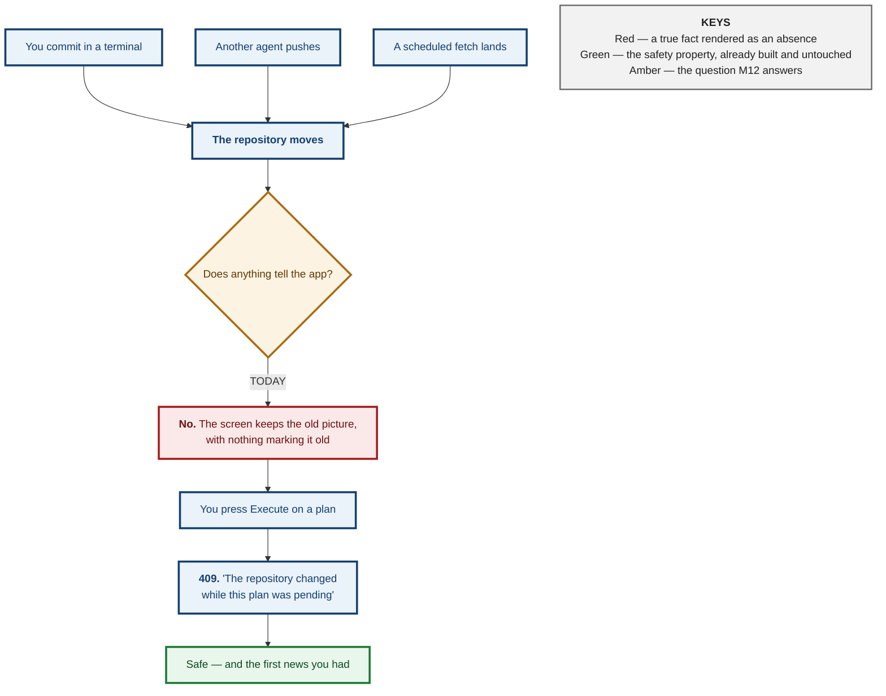
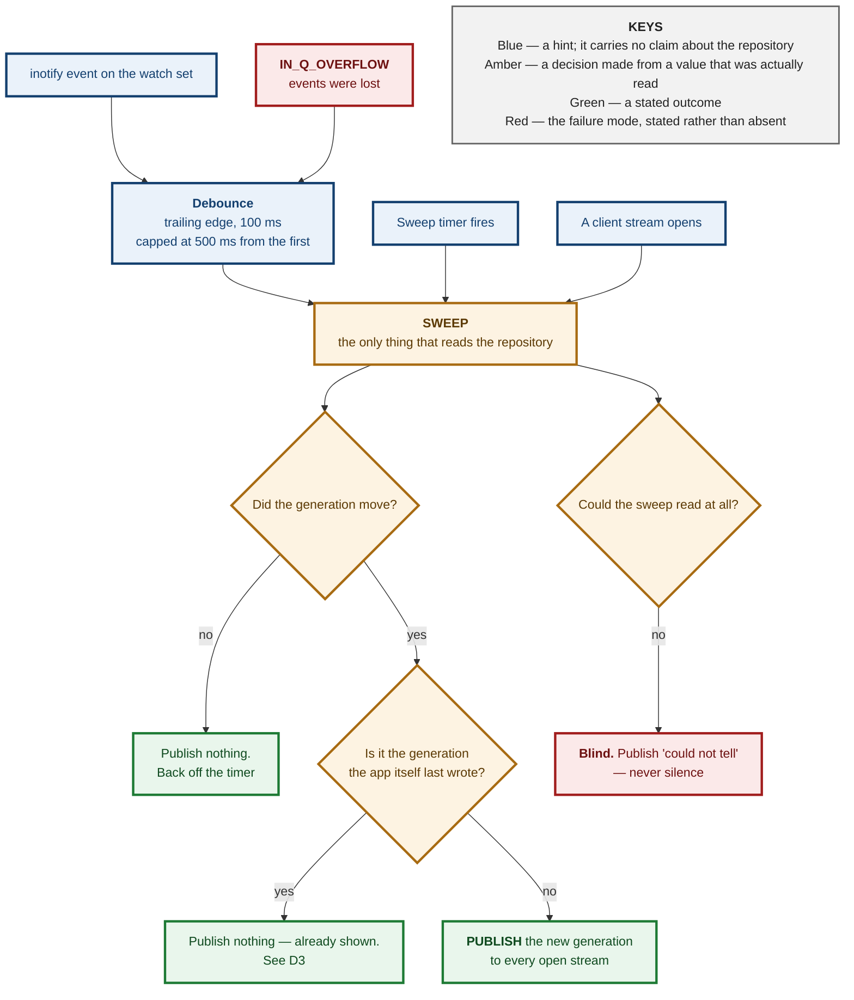
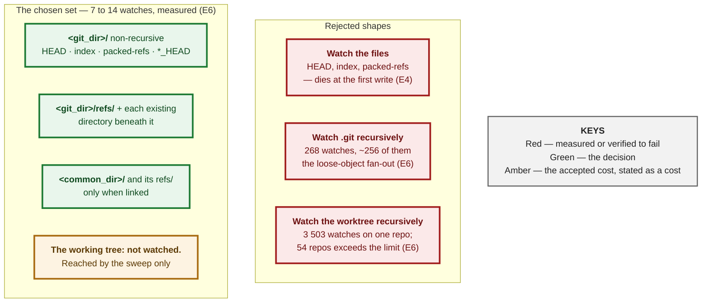
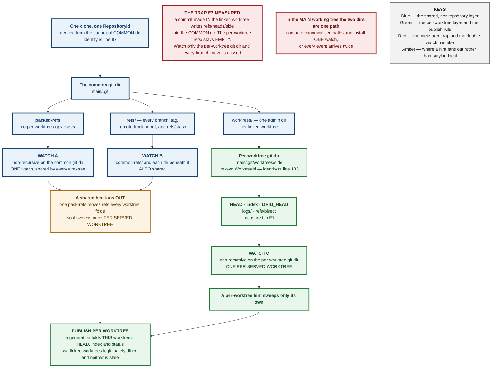
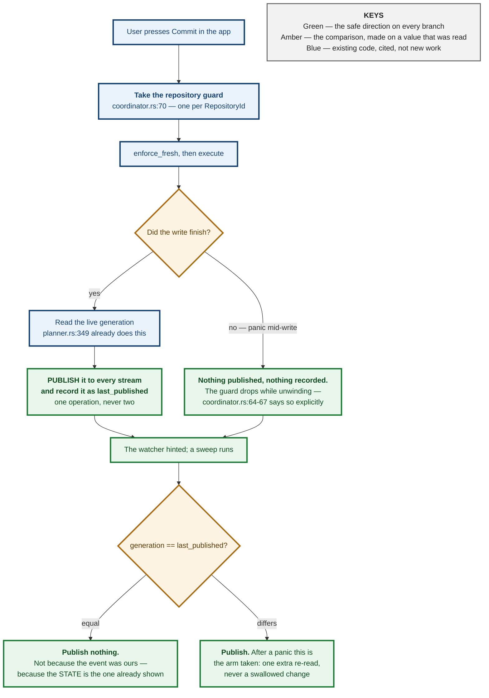
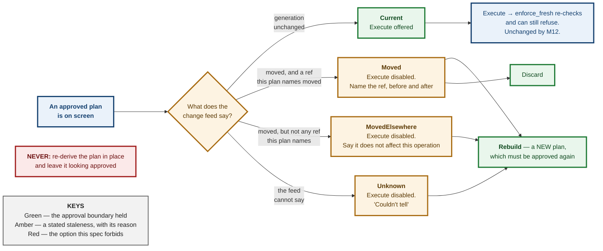
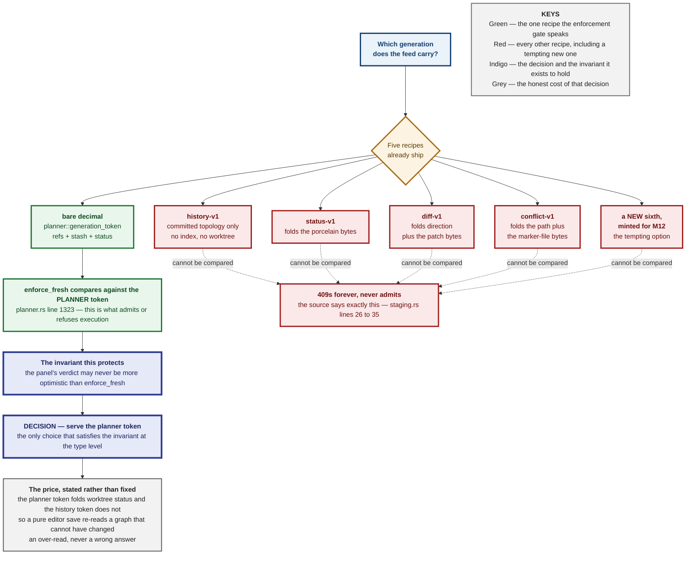
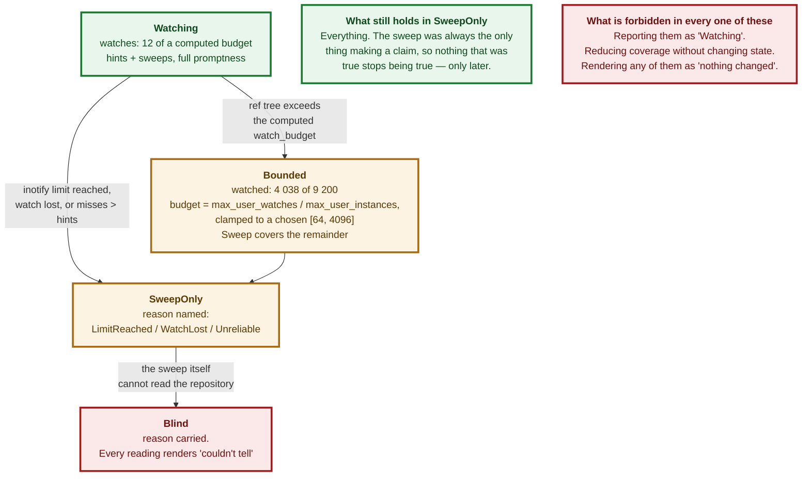

# M3.26 / M12 — Reconciling External Changes: Decision Spec

<style>
h1:first-of-type { display: none !important; }
</style>

<div style="background:#FF6B00;color:#fff;margin:3mm -14mm 0 -14mm;padding:9mm 14mm 8mm 14mm">
<p style="display:inline-block;border:1mm solid #fff;padding:2.5mm 5mm;font-size:18pt;font-weight:bold;letter-spacing:3pt;margin:0 0 4mm 0">NOTICE</p>
<p style="font-size:11pt;letter-spacing:3.2pt;text-transform:uppercase;font-weight:bold;margin:0 0 1.5mm 0;opacity:.93">Git-Vista &middot; milestone 12 &middot; issue #551 (from #79)</p>
<p style="font-size:29pt;font-weight:bold;letter-spacing:-1pt;line-height:1.02;margin:0 0 3mm 0">The world moved while you were looking at it</p>
<p style="font-size:16pt;font-weight:bold;line-height:1.2;margin:0">You ran <code style="background:rgba(0,0,0,.18);padding:0 1.5mm">git pull</code> in a terminal. The app is still showing you the repository from before.</p>
</div>

<div style="padding:5mm 0 0 0">

<p style="font-size:13pt;line-height:1.34;margin:0 0 4.5mm 0;color:#141414">The app reads your repository when you open it, and
after each change <em>it</em> makes. Nothing else. Commit from a terminal, pull, let
another agent push &mdash; the screen does not move, and there is no mark
anywhere saying it might be out of date. A picture from ten seconds ago and a
picture from yesterday look identical.</p>

<p style="font-size:11pt;text-transform:uppercase;letter-spacing:1.5pt;font-weight:bold;color:#7A2E00;margin:0 0 2.5mm 0">What this document decides</p>

<div style="border-left:4mm solid #1d7a34;background:#eef7f0;padding:2.2mm 0 2.2mm 3.6mm;margin:0 0 2.5mm 0">
<p style="font-size:13.8pt;font-weight:bold;margin:0 0 1mm 0;line-height:1.2;color:#0f4a1f">Nothing unsafe can happen today &mdash; that is already built</p>
<p style="font-size:11.6pt;line-height:1.3;margin:0;color:#232323">If the repository moves under an approved action, the app
already refuses to run it. The gap is not danger, it is <b>silence</b>: you find
out by being told no, at the moment you press the button. M12 moves that news
forward to when it happens.</p>
</div>

<div style="border-left:4mm solid #a86b12;background:#fdf6ea;padding:2.2mm 0 2.2mm 3.6mm;margin:0 0 2.5mm 0">
<p style="font-size:13.8pt;font-weight:bold;margin:0 0 1mm 0;line-height:1.2;color:#5c3a05">Watching a folder is the obvious answer and it quietly fails</p>
<p style="font-size:11.6pt;line-height:1.3;margin:0;color:#232323">Git often keeps its branch list in <b>one packed file</b>, not
as one file per branch. Verified below: on a fresh clone the branch folder is
completely <b>empty</b>, and deleting a branch changes nothing inside it. A watcher
aimed at that folder watches nothing, forever, and reports no news exactly the
way a quiet repository does.</p>
</div>

<div style="border-left:4mm solid #a11d1d;background:#fbeeee;padding:2.2mm 0 2.2mm 3.6mm;margin:0 0 2.5mm 0">
<p style="font-size:13.8pt;font-weight:bold;margin:0 0 1mm 0;line-height:1.2;color:#6d1111">The app must not mistake its own writes for yours</p>
<p style="font-size:11.6pt;line-height:1.3;margin:0;color:#232323">The tempting fix &mdash; &ldquo;ignore the next change, it is
mine&rdquo; &mdash; is a switch that stays flipped if the write dies half-way, and
from then on the app ignores <em>your</em> changes and cannot tell. This
repository has already shipped that exact bug once, in a different place, and
paid for it. The answer here is to hold <b>no switch at all</b>.</p>
</div>

</div>

<div style="background:#7A2E00;color:#fff;padding:4.5mm 14mm 5mm 14mm;margin:5.5mm -14mm 0 -14mm">
<p style="font-size:11.6pt;margin:0 0 1.6mm 0;line-height:1.3"><span style="display:inline-block;background:#FF6B00;color:#fff;font-size:9.5pt;font-weight:bold;padding:1mm 2.6mm;margin-right:2.6mm;letter-spacing:.7pt">MILESTONE</span> M12 &mdash; Reconciling External Changes</p>
<p style="font-size:11.6pt;margin:0 0 1.6mm 0;line-height:1.3"><span style="display:inline-block;background:#FF6B00;color:#fff;font-size:9.5pt;font-weight:bold;padding:1mm 2.6mm;margin-right:2.6mm;letter-spacing:.7pt">THIS DOC</span> the design for #551, and the gate on #552&ndash;#556</p>
<p style="font-size:11.6pt;margin:0 0 1.6mm 0;line-height:1.3"><span style="display:inline-block;background:#FF6B00;color:#fff;font-size:9.5pt;font-weight:bold;padding:1mm 2.6mm;margin-right:2.6mm;letter-spacing:.7pt">STATUS</span> design only &mdash; no code written for this issue, deliberately</p>
<p style="font-size:11.6pt;margin:0;line-height:1.3"><span style="display:inline-block;background:#FF6B00;color:#fff;font-size:9.5pt;font-weight:bold;padding:1mm 2.6mm;margin-right:2.6mm;letter-spacing:.7pt">ADR</span> 0094 reserved &mdash; allocated by ADR 0095, see &sect;ADR</p>
</div>

<div style="page-break-after:always"></div>

**Status:** Design spec, pre-ADR. Written for #551; blocks #552, #553, #554, #555, #556.
**Modelled on:** `m3.23-worktrees.md`, and for the same reason — M11 could be
split cleanly because its spec existed first.
**Companion to:** ADR 0001 (the generation algorithm this whole design rides on)
and ADR 0055 (the last time a stale reading in this app was rendered as a fresh
one, and what was done about it).

---

## Context

### What exists today, checked rather than assumed

Seven spec citations in this repository have been wrong. Every claim in this
table was read in the source at the line given, in the tree at
`b7a947f`, before it was written down.

| what | state | where |
|---|---|---|
| **Execution-time staleness** | **DONE.** `generation_token` folds HEAD, every branch/tag/remote-branch ref, `refs/stash` and `git status --porcelain=v2` into one digest; `enforce_fresh` refuses execution unless the live digest still *equals* the plan's. | `planner.rs:1099`, `planner.rs:1300`, `planner.rs:1323` |
| **The three-state discipline** | **DONE, and load-bearing.** `Obs` separates "git said no" from "git could not be asked", and `Obs::Unknown` digests with a **nonce** so an unread repository can never hash equal to itself. | `planner.rs:739`, `planner.rs:809-822` |
| **Post-write generation** | **DONE.** After every executed operation the server already computes the resulting generation and puts it on the operation's terminal record — commented, verbatim, as "the datum a reconnecting client uses to decide whether its cached graph is stale". | `planner.rs:349` |
| **Content-addressed self-write dedup, client side** | **DONE.** `GraphCore::on_invalidate` re-reads only when the settlement's generation differs from the one it holds — and re-reads unconditionally when the server reported **no** generation. | `graph/core.rs:76-98` |
| **A per-repository write guard released on panic** | **DONE.** One `tokio::sync::Mutex` per `RepositoryId`; its doc states the guard "releases when the returned value drops, **including while unwinding from a panic**". | `coordinator.rs:70`, doc at `coordinator.rs:64-67` |
| **A cheap ref+index read with no git spawn** | **DONE.** `read_generation_inputs` takes one `gix` open and collects HEAD, every ref, and the index checksum. No `git status`, no worktree walk. | `git-vista-git/src/identity.rs:172`, `:238` |
| **An SSE transport, bounded** | **DONE, for operations.** `GET /api/operations/{id}/events`, whose first event is the *current* snapshot rather than the next change, capped at `MAX_LIVE_STREAMS = 32` and killed at `MAX_STREAM_LIFETIME = 30 min`. | `handlers/operations.rs:147`, `:73`, `git-vista-server/src/operations.rs:78` |
| **The client's invalidation vocabulary** | **DONE.** `Invalidate { generation, scope }` with `InvalidateScope::{Everything, Graph, Status, Activity}`. | `features/core_traits.rs:68-79` |
| **Any file watching** | **MISSING.** No `notify` dependency in any workspace `Cargo.toml`; zero hits for `inotify`, `fsevent`, `kqueue` or `ReadDirectoryChanges` in `crates/`. | — |
| **Any timer-driven re-read** | **MISSING.** `set_timeout` appears at eight call sites across six files, every one of them one-shot; `set_interval` appears **nowhere** in `crates/`. | `crates/git-vista/src/` |
| **A route serving the planner-recipe generation** | **MISSING.** No `GET` endpoint returns it. `/api/status/v2` serves a `status-v1:`-prefixed token and `/api/frame` a `history-v1:` one; the planner's is a bare decimal, minted only inside plan build and post-execution. | `git-vista-server/src/main.rs:420-475`, `git-vista-server/src/staging.rs:29-33` |

### So what actually happens today

`App` is explicit about it (`app/mod.rs:205-222`). The graph epoch bumps in
exactly four situations: a settled write of the app's own, an explicit Refresh
or the "R" key, a 409 drift reseed, and session landing. **Nothing external
moves it.** The comment on that block even records the previous version of this
same bug — issue #16, where the frontend "used to fetch exactly once on load
(`|| ()`, a constant source that never re-fires)".



**The gap M12 closes is promptness and honesty, not safety.** A spec that
proposes to build the safety property again wastes a milestone. That property is
`enforce_fresh` and it is not touched by anything in this document.

### The 19-hour reading, which is why this matters

ADR 0055 records the incident this milestone is the general case of. On
2026-08-12 the app displayed a branch and dirty-file badge from roughly 19 hours
earlier — `main`/`8881bab` on disk, a different branch and commit on screen —
"with no indication anywhere that the reading was not current. The operator
acted on it." The server was never stale; the client simply never asked again.

The fix then was narrow and correct: stamp the reading with `scanned_at`, render
its age unconditionally, and treat an **undated** reading as stale
(`is_stale(None) == true` — "an undated reading gets no benefit of the doubt").
M12 is that same lesson applied to the whole repository rather than one chip.

---

## The two rules that govern every decision here

> ### **"I could not tell" must never render as "nothing changed."**

Every mechanism in this milestone has a failure mode in which it stops seeing
events, and a quiet watcher and a quiet repository produce identical output.
Each such mode must therefore be a **stated condition**, not an absence. That is
already this codebase's practice — `Obs::Unknown` (`planner.rs:745`),
`Advisory::DefaultBranchUnknown` (`git-vista-protocol/src/plan.rs:1563`), `HeadBranch::Unknown`
(`features/operations/kind.rs:206`), `Blame::UnknownOperation`
(`durable.rs:588`) — and it is precisely the thing a watcher design gets wrong
by default.

> ### **A plan that quietly re-derives itself is a plan the user did not approve.**

This one decides D4. The options are not equal: telling the user their plan is
stale and offering to rebuild it preserves the approval boundary; silently
rebuilding it destroys the boundary while looking helpful.

---

## Evidence gathered for this spec

Everything below was run for this document and is reproducible from the commands
quoted. **It comes from two machines, and which one matters:**

- **E2–E5** — git 2.43.0, Linux 6.18.44, 4 × Xeon @ 2.80 GHz, 15 GB RAM, warm
  page cache, inside the cloud container this spec was first written in —
  **not** on the operator's box. The repository-shape measurements (ref costs,
  `git status` scaling, watch counts) are these.
- **E1, E5a, E6, E6a, E6b and E7** — re-run or added on 2026-08-30 on **the
  operator's actual box**, git 2.53.0, because six claims in the earlier drafts
  turned out to be container facts, recalled constants, or simply wrong: whether
  a fresh clone has loose refs (E1 — it does, two of them), the cost of the two
  sweep tiers on this machine (E5a), the size of the chosen watch set (E6 — 7 to
  14, not "~4"), the inotify limits the watch budget is computed from (E6a), the
  hardware #556's cost argument is anchored on (E6b), and the linked-worktree
  file layout the watch set depends on (E7).

**E2, E3 and E4 were re-run on the operator's box on 2026-08-30, in fresh
throwaway fixtures, and all three reproduce.** A packed ref deleted with nothing
under `refs/` created, modified or removed (E2). A loose ref re-created by a
commit and shadowing a now-stale `packed-refs` entry, with `git rev-parse`
returning the loose value (E3). All three of `index`, `HEAD` and `packed-refs`
carrying different inode numbers after one commit-and-checkout (E4) — the
*mechanism* reproduces; the specific inode numbers in E4's table are a property
of that one fixture and are not expected to repeat.

Where a number still needs to be measured on the real machine before it is
trusted, that is said — and **E5's 1 000 / 10 000 / 40 000-file rows are still
container numbers**, which #556 still owes.

### E1 — A fresh clone keeps almost every ref in `packed-refs`, and exactly two loose

**Corrected 2026-08-30, and the wrong version is left visible on purpose.** An
earlier draft of this section was headed *"a fresh clone has no loose refs at
all"* and showed `find dn/.git/refs -type f` printing nothing. **That does not
reproduce on this box** (git 2.53.0). It is recorded as wrong rather than
quietly rewritten, because the design conclusion survives the correction and the
claim as written did not — which is the difference the rest of this document is
about.

```
$ git clone --no-local /home/tom/projects/git-vista netlike
$ git -C netlike for-each-ref | wc -l            → 11    # every ref
$ grep -c '^[0-9a-f]' netlike/.git/packed-refs   → 9     # packed
$ find netlike/.git/refs -type f                 → 2     # loose
netlike/.git/refs/remotes/origin/HEAD
netlike/.git/refs/heads/fix/node-guard-test-premise
```

A fresh **working** clone lands exactly two loose refs — `refs/remotes/origin/HEAD`
and `refs/heads/<whatever branch it checked out>` — while every other ref goes
into `packed-refs`. Five clone shapes were tried on this box and the split is
clean:

| clone | loose refs under `refs/` |
|---|---|
| `git clone up.git dn` — an ordinary working clone | **2** |
| `git clone -n` — no checkout | **2** |
| `git clone --depth=1 --no-local` | **2** |
| `git clone --bare` | **0** |
| `git clone --mirror` | **0** |

**The design conclusion is unchanged, and it never needed the stronger claim.**
`refs/` on a fresh working clone holds 2 of 11 refs; the other 9 live in a single
file that is not under `refs/` at all, and on a bare or mirror clone `refs/` holds
none of them. A watcher that treats `.git/refs/` as *the* source of ref state is
reading a fifth of the truth in the first case and none of it in the second.
**`packed-refs` must be in the watch set** (D2, E2), and refs must be read through
git's own resolution (E3) — both hold at two loose refs exactly as they held at
the zero the earlier draft asserted.

### E2 — A ref can be deleted with nothing under `refs/` moving

```
$ git pack-refs --all
$ find .git/refs -type f          # (nothing — all four refs are packed)
$ git branch -D feature/two
Deleted branch feature/two (was 7f14b57).
$ find .git/refs -type f          # (still nothing)
$ cat .git/packed-refs            # feature/two is gone from the file
```

**A ref changed and no file under `.git/refs` was created, modified or
deleted.** This is #552's "miss mode that looks like it works", confirmed rather
than repeated.

### E3 — `packed-refs` goes stale, and loose refs shadow it

After `pack-refs`, a subsequent commit on `feature/one` re-creates
`.git/refs/heads/feature/one` while `packed-refs` still holds the *old* oid for
it. Reading either file alone gives a wrong answer; only "loose shadows packed"
is right. `gix`'s `references().all()` does exactly that
(`git-vista-git/src/refs.rs:114-118`, `git-vista-git/src/identity.rs:189-194`), which is why every
design below reads refs through **git's own ref resolution** and never by
parsing these files.

### E4 — HEAD, index and packed-refs are all replaced by rename

| file | inode before | inode after | |
|---|---|---|---|
| `.git/index` | 1950077 | 1950085 | **replaced** |
| `.git/HEAD` | 1949894 | 1950077 | **replaced** |
| `.git/packed-refs` | 1949922 | 1950087 | **replaced** |

(1950077 appearing twice is not a transcription error — it is the index's old
inode being recycled for the new HEAD, which is itself a small demonstration
that these files are unlinked and replaced rather than written in place.)

Git writes each through a `.lock` file and renames it into place. An inotify
watch on the **file** follows the old inode and stops seeing anything after the
very first write. Watches must therefore be on **directories**, filtered by
basename.

### E5 — `git status` scales with the working tree; ref reads do not

Synthetic repositories, median of five runs after a warm-up:

| tracked files | dirs in worktree | `git status --porcelain=v2` | `git for-each-ref` |
|---|---|---|---|
| 693 (this repo) | 99 | 5.5 ms | 2.6 ms |
| 1 000 | 199 | 15.8 ms | 2.5 ms |
| 10 000 | 752 | 43.0 ms | 3.2 ms |
| 40 000 | 2 270 | 110.9 ms | 2.6 ms |
| 40 000 + 30 000 **ignored** build files | 3 503 | 98.1 ms | 2.8 ms |

Two facts fall out and both decide design below. `status` is **linear in
tracked-file count**; ref reads are **flat** — 2.5 to 3.2 ms from 693 files to
40 000.

**The last row says less than it looks like it says, and the difference
matters.** Its 30 000 build artefacts sit under a `build/` line in
`.gitignore`, so git prunes the whole subtree and they cost nothing measurable
(98.1 ms against the previous row's 110.9 ms is run-to-run noise, not a
speed-up). That is the *good* case for ignored files, and it is the only one
this table establishes. A build directory that is **not** ignored, or ignore
rules that match file-by-file rather than at a directory prefix, get no such
discount — and that is one of the things #556 must measure on a real
repository rather than infer from here.

#### E5a — the same two commands, on the operator's actual box

E5 ran in a container, and D5(d) quotes its "this repo" row as though it were
this machine's. It is not. The row was re-measured on the operator's box on
2026-08-30, in `/home/tom/projects/git-vista`, ten runs after a warm-up:

```
$ git ls-files | wc -l                         → 705
$ git for-each-ref | wc -l                     → 668
git --no-optional-locks status --porcelain=v2    min 2.5 ms   median 3.4 ms   max 3.7 ms
git for-each-ref                                 min 2.1 ms   median 3.2 ms   max 3.4 ms
```

Three things follow, and the third is the one that matters to D5.

- **The absolute number is smaller than E5's** — 3.4 ms here against E5's
  5.5 ms, on a repository that has grown from 693 tracked files to 705 in the
  interval. The container was simply the slower machine, which E6a and E6b
  explain: 4 cores against 20, and the "spinning disk" premise was never this
  box's.
- **On this box the two tiers cost nearly the same** — 3.4 ms against 3.2 ms —
  because this repository carries **668 refs**. D5(c)'s split into a cheap ref
  tier and an expensive worktree tier is a claim about how the two *scale*
  (E5: flat against linear), **not** a claim that they are far apart at this
  size. At 705 tracked files they are within run-to-run noise of each other,
  and the split only starts paying somewhere before E5's 10 000-file row.
- **D5(d) does not depend on either number**, which is the point of expressing
  it as `10 × the last measured duration`: on this box the rule permits a sweep
  every 34 ms rather than every 55 ms, and `SWEEP_BASE` (2 s) is the binding
  constraint either way.

**Not measured, and still owed to #556:** a genuinely large repository *on this
box*. E5's 1 000 / 10 000 / 40 000-file rows are container numbers and are not
re-derived here — they are quoted below as container numbers wherever they are
used.

### E6 — Watch counts, and the shared limit

| watch shape | directories | on |
|---|---|---|
| `.git` recursively | 268 | the 40 k-file repo — of which ~256 are the loose-object `objects/xx` fan-out, pure noise |
| `.git` recursively | 21 | this repository, freshly cloned |
| worktree recursively | 3 503 | the 40 k-file repo with a build directory |
| worktree recursively | 99 | this repository |
| **the named set this spec chooses** | **7** | this repository, freshly cloned — `<git_dir>/` plus the 6 directories at and below `refs/` |
| **the named set this spec chooses** | **12** | this repository *as the operator has it checked out* — 11 directories under `refs/`, because branch names are namespaced (`lane/`, `fix/`, `remotes/origin/…`) |
| **the named set, linked worktree** | **14** | this spec's own worktree: 2 on its private git dir, plus 12 on the shared common dir (D2a) |

**The last three rows are corrected, not carried forward.** An earlier draft of
this table said the chosen set was **"~4"** for this repository. Measured on
2026-08-30 it is **7** on a fresh clone and **12** on the operator's live
checkout — the undercount came from counting `refs/`, `refs/heads/` and
`refs/tags/` and forgetting that a namespaced branch (`lane/565`) creates a
directory of its own. The correction changes no decision: 12 is still three
orders of magnitude below the budget D5(b1) derives, and still two orders below
the recursive alternatives in the rows above. It is fixed because a number a
reader can check must be the number they will get. The `.git` recursive and
worktree recursive rows for this repository re-measured at **18** and **96**
against the 21 and 99 recorded here; that is the repository having changed, and
the shape is unaffected.

`/proc/sys/fs/inotify/max_user_watches` in this container is **129 978** and
`max_user_instances` is **128**. The limit is **per-user** and shared with every
editor, language server and file manager the operator is running, so a design
must be a negligible consumer of it, not merely a legal one.

ADR 0052 records that the operator's own `~/projects` holds **54 git
repositories**. 54 × 3 503 ≈ **189 000** watches — over even this container's
generous limit, before anything else on the machine gets one.

#### E6a — the same limits, read on the operator's actual box

E6 is a container number and the design must not be tuned to it. These were read
on the real machine, in the worktree this spec is being edited in, on
2026-08-30:

```
$ cat /proc/sys/fs/inotify/max_user_watches
516898
$ sysctl fs.inotify.max_user_watches fs.inotify.max_user_instances fs.inotify.max_queued_events
fs.inotify.max_user_watches = 516898
fs.inotify.max_user_instances = 128
fs.inotify.max_queued_events = 16384
$ nproc
20
$ lsblk -d -o NAME,ROTA,MODEL          # the disk holding /
nvme0n1        0 PC SN730 NVMe WDC 1024GB
$ df -h /  →  /dev/nvme0n1p6
```

| quantity | container (E6) | **the operator's box** |
|---|---|---|
| `fs.inotify.max_user_watches` | 129 978 | **516 898** |
| `fs.inotify.max_user_instances` | 128 | **128** |
| `fs.inotify.max_queued_events` | — | **16 384** |
| cores | 4 | **20** |
| disk holding `/` | — | **NVMe** (`ROTA=0`) |

**Three numbers in circulation for `max_user_watches` were all wrong, in
different directions**, which is the argument for deriving the bound rather than
picking one against any of them:

- **8 192** — the historical Linux default, and the number the previous draft of
  D5(b) justified `MAX_WATCHES_PER_REPOSITORY = 64` against. It is **63× below**
  what this box actually allows.
- **129 978** — the container above. Not the operator's machine.
- **524 288** — a round number quoted in a competing draft (#561). Close, and
  plausibly the kernel default on some builds, but **not what this box reports**:
  the true value is **516 898**, which is not a power of two because it is
  derived from available memory at boot, not a constant.

> A bound picked against a remembered constant is wrong on every machine where
> the constant is not the value. All three of the numbers above were confidently
> written down by someone; none of them is this box's. **That is why D5(b) reads
> the file.**

#### E6b — #556's premise about this box is wrong, and its cost argument needs re-deriving

Issue #556 opens its "what storm means here, concretely" section with:

> "This box is 4 cores with a spinning system disk…"

**Measured above: 20 cores, and `/` is on an NVMe SSD** (`nvme0n1`, `ROTA=0`).
Neither half of that sentence holds.

The *conclusion* #556 draws from it — that inotify watches are a shared system
limit and that consuming them generously degrades every other watcher — is
correct and independent of the hardware, so nothing in this design changes.
But every argument in #552–#556 that is **anchored on the four-core spinning-disk
sentence** must be re-derived rather than copied:

- **Core count**, where it appears in a duty-cycle or contention argument. The
  D5(d) rule is expressed as a fraction of *one* core and is unaffected; a
  "fraction of the machine" argument written against 4 cores is off by 5×.
- **Seek cost**, wherever a cold-cache or IO-contention claim leans on a
  spinning platter. An NVMe device has no seek penalty, so a cold-cache `git
  status` on this box is much cheaper than the premise implies — which makes the
  sweep tier *safer* than #556 assumes, not more dangerous.
- **The load-average-42 incident of 19 August is still real and still the right
  cautionary tale** — it was caused by five concurrent unlocked cargo builds,
  which is a memory-and-`buildlock` story, not a spindle story. It survives the
  correction intact; only the "spinning disk" attribution does not.

**This does not weaken #556.** It removes a false premise from a true
conclusion, which is the only way to keep the conclusion trustworthy. #556's
acceptance criterion "measured on a genuinely large repository, with the number
in the PR" is unaffected and still owed.

---

## Decision

### D1 — Both a watcher and a sweep. The sweep is the only thing that ever makes a claim.

The watcher does not report *what changed*. It reports only *that it is worth
looking*. Every statement about the repository's state is produced by a sweep:
a read, through git, that computes a generation and compares it for equality.

> **The watcher is a hint about *when* to sweep. The sweep is the sole authority
> on *what is true*.**

This is the answer to #553's "which is authoritative when they disagree", and
the answer is that **the question cannot be asked**: only one of the two ever
makes a claim, so there is nothing to disagree about. That is a stronger
property than picking a winner, and it is the reason this arrangement was
chosen.

Three consequences fall straight out, and each of them is a defect the obvious
design would have had:

- **A missed watcher event costs latency and nothing else.** The next sweep
  reads the world regardless. There is no class of change the system can be
  taught to ignore, because it is never taught about changes at all.
- **A spurious watcher event costs one cheap read.** No correctness surface.
- **inotify queue overflow (`IN_Q_OVERFLOW`) is harmless.** It means "you missed
  some events" — which is exactly what a hint already is. It is handled by
  sweeping, like every other hint.

Debounce becomes safe for the same reason, which answers #552's sharpest
acceptance criterion ("the last event of a burst is not dropped"). Coalescing
hints cannot drop state, because the sweep that follows reads everything. The
one requirement is that a debounce window is **trailing-edge and always
terminates in a sweep**:

- fire a sweep `DEBOUNCE = 100 ms` after the *last* hint in a burst,
- but no later than `MAX_DEBOUNCE_DELAY = 500 ms` after the *first*,

so a long checkout that emits events continuously for two seconds is still swept
four times during it rather than starved until it stops.



#### How a dead watcher is caught, which is #553's real question

Because the sweep runs on a timer *as well*, the system has a free experiment
running continuously: **a timer-triggered sweep that finds a change the watcher
never hinted at is evidence about the watcher.**

That evidence is counted, not discarded:

```rust
/// Evidence that the watcher is not seeing what the sweep sees. Counted
/// per repository, never inferred from silence.
struct WatcherMisses {
    /// Timer sweeps that found a change with no hint inside the grace window.
    missed: u32,
    /// Timer sweeps that found a change the watcher had already hinted at.
    hinted: u32,
    last_missed_at: Option<UnixSeconds>,
}
```

The grace window matters and #553 must test it: a hint can legitimately arrive a
few milliseconds *after* the sweep that beat it. A sweep counts as a miss only
if no hint for that repository arrives within `MISS_GRACE = 2 × DEBOUNCE`
(200 ms) of the sweep completing. Once `missed` exceeds `hinted` over a window
of at least ten changes, the feed **declares the watcher untrusted on evidence**
and moves to `SweepOnly` (D5) — which is a visible state, not a quiet reduction.

`WatcherMisses` is also the number #553 asks to be "recorded, not discarded": it
belongs in the health state the client can read, and it is the only way a
silently-dead watcher fails to survive for weeks.

#### Alternatives considered

- **Watcher authoritative, sweep as a backstop.** The conventional design, and
  the one this rejects hardest. It requires translating an event into a state
  delta — "`refs/heads/main` was written, therefore re-read that ref" — and every
  such translation is a place where a *miss* becomes a *wrong answer* rather
  than a *late* one. inotify hands you a path and a bitmask; it does not hand
  you a value. Any design that acts on the path alone has invented a claim.
- **Two equal sources, reconciled.** Rejected on the issue's own framing: "the
  difference shows up exactly when something is already wrong." Reconciliation
  logic between two sources of truth is code that only ever runs in the state
  nobody tested.
- **Sweep only, no watcher, ever.** Genuinely defensible: zero new
  dependencies, no shared system limit consumed, and E5 shows a ref-only sweep
  costs single-digit milliseconds. Rejected as the *sole* mechanism because
  "promptly" is #79's criterion and the worktree tier is linear in tree size —
  a 2-second poll of `git status` on a large repository during a `cargo build`
  is exactly the storm #556 forbids. **Kept as the degraded mode** (D5), which
  is only possible because the watcher was never load-bearing.

---

### D2 — Watch a small named set of directories. Never files, never a subtree.

The watch set, per served worktree:

| watched | non-recursive | why |
|---|---|---|
| `<git_dir>/` | yes | `HEAD`, `index`, `packed-refs`, `MERGE_HEAD`, `REBASE_HEAD`, `ORIG_HEAD`, `CHERRY_PICK_HEAD` all land here by rename (E4) |
| `<git_dir>/refs/` and each existing directory beneath it | one watch each | loose ref create / delete / retarget |
| `<common_dir>/` and `<common_dir>/refs/` | yes | only when the worktree is *linked*, where `git_dir ≠ common_dir`. **This row carries far more weight than its width suggests — see D2a**, where E7 measures a commit made *in* a linked worktree writing its branch ref into the common dir while the per-worktree `refs/` stays empty |
| **the working tree** | **NO** | see below — this is the trade |

Filtering is by **basename within a watched directory**, never by watching a
path. E4 is why: every one of those files is replaced by rename, so a
file-targeted watch follows a dead inode after the first write.

**`.git` is never watched recursively.** E6: the loose-object `objects/xx`
fan-out alone is ~256 directories, and every object write is noise — ADR 0001
explicitly excludes "object database changes that preserve reachability" from
the generation, so a recursive `.git` watch would generate hints for events that
by definition cannot change what the app shows.

**A new directory under `refs/` gets a watch on its own `CREATE` event, and that
add is immediately followed by a sweep.** The window between `mkdir
refs/heads/feature/` and the watch being installed is unclosable — a ref file
created inside it in that window is missed. Under D1 that is a latency cost of
one sweep, which is the entire reason D1 is shaped the way it is.

**`refs/` being empty is normal.** E1. An implementation that treats an empty
`refs/` as a broken repository, or that only installs watches for directories it
found there, will watch nothing at all on a fresh clone. `packed-refs` in
`<git_dir>/` is what covers that case, and E2 is why it must be in the set.



#### The working tree is not watched, and that is the trade

An external `vim :w` on a tracked file reaches the app at the **sweep cadence**,
not instantly. This is the one place the design accepts visible latency, and it
buys the whole watch budget: **7 to 14 watches instead of thousands** (E6,
measured 2026-08-30), and no inotify pressure at all during a build.

It is also the honest ordering of what M12 is *for*. Ref and HEAD movement —
someone else's push, your own terminal commit, a scheduled fetch — is what makes
a plan on screen wrong. A file you are editing yourself is a change you already
know about.

The alternative, kept on the record for when the latency is felt: watch only
directories that currently contain **tracked** files, capped by
the derived `watch_budget` (D5(b1)), and fall back to sweep-only for the rest.
That is a real design with a real bound; it is deferred, not dismissed.

#### Alternatives considered

- **Parse `.git/packed-refs` and `.git/refs/*` directly** to get values out of
  the watcher. Rejected on E3: `packed-refs` goes stale the moment a loose ref
  shadows it, and reassembling git's own precedence rules in this codebase is
  the same mistake as parsing human-format git output — the one ADR 0037
  ("Observe state, never parse git's prose") was written about, and which this
  repository still carries a scar from (`looks_like_revert_conflict`,
  `planner/sequence_exec.rs:527`). Refs are read through `gix`, which resolves
  them properly, or not at all.
- **`core.fsmonitor` / Watchman.** Git has a built-in file-system-monitor hook
  that makes `git status` near-constant-time on huge trees. Rejected for M12:
  it is a per-repository *git configuration* change, and this app does not make
  those — checked, not assumed: `GitOperation` has no config-writing variant, and
  every `git config` invocation in `crates/` is either a read (`--list`,
  `--get`) or test-fixture setup. Worth revisiting as an operator-set option,
  never as something the app turns on.
- **Watch `<git_dir>/logs/` (the reflogs).** Attractive because every ref move
  appends there and appends are simple events. Rejected: ADR 0001 deliberately
  excludes reflog growth from the generation, `core.logAllRefUpdates` can be
  off, and it would still miss `packed-refs` rewrites by `gc`.

---

### D2a — Worktree topology: the M11 seam, and which of the two directories holds what

D2's watch set has one line that carries far more weight than its width
suggests — *"`<common_dir>/` and `<common_dir>/refs/`, only when the worktree is
linked"*. **M11 (#546–#550) and M12 are being built in parallel, and this is the
seam between them.** A #552 written against a single-worktree assumption is
wrong in a way that shows up only on a machine that has linked worktrees — which
is the operator's machine, and the one this spec is being edited in.

The topology is **not per-repository and not per-worktree. It is both at once**,
and getting the split backwards silently loses either every branch movement or
every HEAD movement.

#### E7 — where each file actually lives, measured rather than recalled

Run for this section, on **git 2.53.0**, in a throwaway fixture: a main tree, a
linked worktree added with `git worktree add`, then a commit, a stash, a bisect
and a `pack-refs` performed **from inside the linked worktree**.

```
$ git worktree add ../side -b side
$ cat side/.git
gitdir: …/main/.git/worktrees/side          # a FILE, not a directory
$ ls -A main/.git/worktrees/side
HEAD  ORIG_HEAD  commondir  gitdir  index  logs  refs
$ cd side && git rev-parse --git-dir --git-common-dir
…/main/.git/worktrees/side                  # per-worktree
…/main/.git                                 # shared
```

| operation, run **from the linked worktree** | what moved | which directory |
|---|---|---|
| `git commit` on branch `side` | `refs/heads/side` | **common** — `main/.git/refs/heads/side`, *not* the worktree's own `refs/` |
| `git stash` | `refs/stash` | **common** — `main/.git/refs/stash` |
| `git bisect start` / `bad` | `refs/bisect/bad` | **per-worktree** — `main/.git/worktrees/side/refs/bisect/bad` |
| `git pack-refs --all` | `packed-refs` | **common** — and there is **no** per-worktree `packed-refs` file at all (`ls` on it: "No such file or directory") |
| checkout / commit | `HEAD` | **per-worktree** — `main/.git/worktrees/side/HEAD` reads `ref: refs/heads/side` while `main/.git/HEAD` still reads `ref: refs/heads/main` |
| any index change | `index` | **per-worktree** |

**Two results are worth stating as traps**, because both are the opposite of
what a reasonable person assumes:

1. **A commit made *in* the linked worktree writes its branch ref into the
   *common* directory.** The per-worktree `refs/` stayed **empty** through the
   commit and the stash — it only ever acquired content during the bisect. A
   watcher that watches `<git_dir>/refs/` for a linked worktree and calls that
   "the refs" watches an empty directory that stays empty, which is E1's failure
   mode wearing a different hat.
2. **A competing draft (#561) places `ORIG_HEAD` in the common git dir. The
   measurement puts it per-worktree** — it is listed in the `ls -A` above, under
   `worktrees/side/`. It is a small error and it is exactly the kind that a
   grafted topology diagram propagates, so it is corrected here rather than
   copied.

#### What that means for the watch set

The split is clean once the measurement is in hand, and it maps onto M11's two
identities exactly:

| identity | derived from | what it owns | which watch |
|---|---|---|---|
| `RepositoryId` | the **canonical common dir** (`git-vista-core/src/identity.rs:87`, `from_common_dir`) | refs, `packed-refs`, the object store — shared by every linked worktree of one clone | **one** non-recursive watch on `<common_dir>/`, plus `<common_dir>/refs/` and each directory beneath it |
| `WorktreeId` | the **canonical git dir** (`git-vista-core/src/identity.rs:133`, `from_git_dir` — `…/.git` for a main tree, `…/.git/worktrees/<name>` for a linked one) | `HEAD`, `index`, `ORIG_HEAD`, `logs/`, `refs/bisect` | **one** non-recursive watch on `<git_dir>/`, per served worktree |

> **Watch refs once per repository. Watch `HEAD` and `index` once per worktree.
> Publish per worktree.**

**In the main working tree the two directories are the same path**, so the set
collapses to D2's 7 watches on a fresh clone and 12 on the operator's live
checkout (E6), and nothing is duplicated — an implementation must
compare the canonicalised paths and install one watch, not two, or it burns a
watch and delivers every event twice.

Three consequences, each of which is a defect if it is discovered late:

- **One shared event invalidates every worktree.** A `git pack-refs`, a fetch,
  or a branch delete in *any* worktree moves refs that *every* worktree's
  generation folds — `read_generation_inputs` collects "every ref"
  (`git-vista-git/src/identity.rs:186-199`), and those refs are the common
  ones. So a single common-dir hint must fan out to a sweep per served worktree,
  not a single sweep.
- **A generation is nevertheless per-worktree**, because it folds *that*
  worktree's HEAD, index and `git status`. Two linked worktrees of one clone
  legitimately hold different generations at the same instant, and neither is
  stale. Publishing one repository-wide generation would be wrong.
- **The coordinator already made this exact decision, and in the other
  direction**, which is the precedent worth following rather than re-litigating:
  the mutation guard keys on `RepositoryId` and says why in its own module doc —
  *"Refs, packed-refs and the object store are shared by every linked worktree of
  one clone, and `RepositoryId` is derived from precisely that shared common
  directory — so a per-repository guard also serializes every worktree of it. A
  per-worktree guard would leave two linked worktrees free to race on one ref"*
  (`coordinator.rs:12-16`). **Writes serialize per repository; readings are
  published per worktree.** Those are different axes and both are correct.

#### Resolving the paths — do not reimplement it

`.git` in a linked worktree is a **file** containing a `gitdir:` pointer, so
`<repo>/.git` is not a directory to watch and must never be assumed to be one.
Two mechanisms already exist and the watcher must use one of them rather than
parsing the pointer itself:

- `refuse_if_git_busy` resolves it with `git rev-parse --absolute-git-dir`
  "rather than assumed to be `<repo>/.git`: a linked worktree's git dir lives
  under the common directory and keeps its own index (and so its own
  `index.lock`), while `.git` in that worktree is a *file* pointing there"
  (`coordinator.rs:120-125`, function at `coordinator.rs:127`).
- `sandbox::worktree` resolves and **validates** the pair, returning
  `LinkedWorktreeDirs { gitdir, commondir }` (`sandbox/worktree.rs:74-79`) under a containment rule:
  the canonical gitdir must lie strictly inside `<canonical commondir>/worktrees/`
  (`sandbox/worktree.rs:26-30`). That rule is a security boundary — its module
  doc explains that honouring an unvalidated `gitdir:` pointer would hand an
  attacker-controlled path an arbitrary grant.

**The watcher takes the validated pair, never a hand-parsed pointer.** Watching
a path derived from an unvalidated `gitdir:` line would be a second consumer of
exactly the input `sandbox/worktree.rs` exists to refuse — and unlike the
sandbox, a watcher failing open is silent. Note the geometries that module
deliberately refuses rather than guesses: **submodule gitdir pointers and
`--separate-git-dir` repositories** (`sandbox/worktree.rs:57-59`). The watcher
inherits that refusal, and a repository whose geometry is not recognised is
`SweepOnly { reason: … }` — a stated condition, per the governing rule, never an
unwatched repository that reports itself as watched.



#### What this section hands to M11, and what it asks of it

- **#552 must take the served worktree's `gitdir`/`commondir` pair as an input**,
  not derive it. If M11 lands a validated accessor for the current selection,
  the watcher consumes it; until then it calls `sandbox::worktree`'s resolver.
- **The open question M11 owns, not M12:** whether the app serves more than one
  worktree of the same clone at once. D5(a) says the server serves one selection
  at a time (`git-vista-server/src/state.rs:278-288`), which makes "one watch set"
  correct **today**. If M11 makes several worktrees live simultaneously, watches A
  and B are shared across them and only watch C multiplies — which is the whole
  reason this section separates the two layers rather than counting watches.

---

### D3 — Recognise self-generated writes by comparing generations. Hold no flag at all.

This is #554, the honest hard part, and the decision is to make the question
disappear rather than to answer it well.

**There is no deduplicator.** There is no "ignore the next event", no
suppression window, no matching of an inotify event against a pending write.
Instead the server keeps, per served worktree, one value:

```rust
/// The generation this process last *published* on the change feed — which
/// includes the one its own writes produced, because a write publishes too.
///
/// NOT a flag, and deliberately not one: there is no "suppressing" mode to be
/// left in. A stale value causes one redundant re-read. It can never cause a
/// real change to be swallowed, because the only thing it can suppress is a
/// state every open stream has already been told about.
last_published: Option<GenerationToken>,
```

A sweep publishes when the generation it read differs from `last_published`, and
publishes nothing when they are equal. That is the whole mechanism.

**The invariant that makes it safe, and it is the load-bearing sentence of this
section:**

> **`last_published` is written by, and only by, the act of publishing.** It
> never records "what I wrote". It records "what I last told every open stream".

The field name is the specification. Anything that sets `last_published` without
also pushing that generation onto the feed reintroduces exactly the defect this
design exists to remove.

#### Why that phrasing, and not "the generation my write produced"

The datum exists today: `planner.rs:349` computes the post-execution generation
and puts it on the settlement, described in its own comment as "the datum a
reconnecting client uses to decide whether its cached graph is stale". The
tempting shortcut is to record *that* as `last_published` and be done.

**It is a trap, and the guard does not save you from it.** That read happens at
`planner.rs:349`, in the spawned task *after* `plan_and_execute_in` returned —
and the coordinator guard is taken inside that function, at `planner.rs:426`. So
the read is outside the guard. Worse, the guard would not help even if it were
inside: the guard binds *this process's* writes only, and says so
(`coordinator.rs:18-21`, "a git command run from a terminal is outside it, by
construction"). An external change can always land between the app's git write
completing and the post-write read.

If it does, that read observes the **combined** state — the app's write plus the
external change — and recording it as "what I wrote" would make the next sweep
compare equal and stay silent. The external change would be swallowed. That is
the data-losing direction #554 warns about, arrived at from the other end.

Publishing is what closes it. Whatever that read observes, combined state
included, is pushed to every open stream *and then* recorded. There is nothing
left to announce because it has just been announced, and the window's existence
stops mattering.



#### Why this cannot get stuck — the property #554 asks for

Four separate reasons, and they are independent of each other:

1. **It is a value, not a mode.** There is no state in which the system is
   "suppressing". Every sweep does the same comparison it always does.
2. **A panic mid-write takes the safe branch.** If the post-execution read never
   runs, `last_published` keeps an *older* value, so the next sweep sees a
   difference and publishes. The failure mode of the mechanism is a redundant
   re-read.
3. **There is no write window to be inside of.** Because `last_published` is a
   side effect of publishing, it can never name a state nobody was told about —
   so it does not matter how long the write took, whether it overlapped an
   external change, or where the guard's boundaries fall. Nothing has to be
   held, so nothing can be held too long.
4. **The one way to swallow a real change is for that change to produce the
   state already on screen** — and ADR 0001 settled that this is the right
   answer, not a false negative. The `status.rs` module doc puts it directly:
   "there is nothing left to show that differs, so 'no visible change' is the
   honest read".

The counting acceptance criterion in #554 ("proven by counting reads, not by
inspection") tests point 1; the panic criterion tests point 2, and it is a real
test rather than a timing race because point 3 removes the window a
timing-dependent mechanism would have had. **#554 should add a third
test, and it is the one that pins the invariant**: land an external change
between an app write and its post-write read, and assert the feed announces the
resulting state rather than swallowing it.

#### The repository has already paid for the alternative

`refuse_if_git_busy` (`coordinator.rs:127`) carries the scar in its own doc.
Before ADR 0060, a present `index.lock` was read as "another git process is
working" — a flag-shaped claim — and the doc records what happened: "once true,
that assertion could never become false again: every following request against
the repository was refused, **forever**, recoverable only by a human with shell
access." The fix was to stop asserting from the flag's presence and check
liveness instead (`index_lock_is_open_by_a_live_process`, `coordinator.rs:195`).

That is the same defect #554 describes, shipped, in this codebase, in a
neighbouring file. It is the strongest argument available for holding no flag.

#### Alternatives considered

- **A flag set before the write and cleared after.** What #554 names. Rejected
  on the evidence directly above. It also fails a second way that gets less
  attention: two clients, two writes, one flag — the second write's clear
  releases the first write's suppression.
- **A time-bounded suppression window.** Strictly better than a flag: it expires
  whether or not the write completed, so it cannot get *stuck*. Rejected anyway,
  because a window is a guess about duration in both directions. A slow write (a
  push behind a `pre-push` hook — ADR 0058 exists because those are time-bounded
  for a reason) outruns the window and re-reads; worse, a genuine external change
  landing inside the window is **swallowed**. That is the direction that loses
  data, and #554 says it gets the stronger test for exactly this reason.
- **Match the event against what the app wrote (path + expected oid).** Rejected
  because it does not survive contact with inotify: an event carries a path and
  a mask, not a value, so the app must re-read to learn the oid — and once it
  has re-read, it has the generation, and the event has told it nothing the
  generation does not already say.
- **Suppress by process identity (only react to writes not made by our own
  pid).** Impossible: git-vista's writes are made by `git` subprocesses it
  spawns, and inotify does not report the writing pid at all.

#### The limit worth stating

`last_published` is empty after a process restart, so the first sweep after a
restart publishes once even if nothing moved. That is correct, not a defect: a
restarted process genuinely does not know what it last showed anyone.

---

### D4 — A stale plan is marked stale, named, and never rebuilt without approval.

The plan on screen is **never re-derived**. When the repository moves under it,
the panel says so, disables the action, and offers two buttons: **Rebuild**
(which produces a new plan the user must approve again) and **Discard**.

Freshness is a four-state value on the client, computed by comparing the plan's
`generation` against the live generation the change feed publishes:

```rust
enum PlanFreshness {
    /// The live generation still equals the plan's. Execute is offered.
    Current,
    /// The generation moved, and at least one ref this plan NAMES moved with
    /// it (or the worktree status did). The loud case.
    Moved { refs: Vec<RefName> },
    /// The generation moved, but nothing in `expected_ref_changes` did.
    /// Still stale — `enforce_fresh` compares the whole digest — but the
    /// operation itself is unaffected, and saying so is more useful than
    /// not saying it.
    MovedElsewhere,
    /// The change feed is not currently able to say. NOT "current".
    Unknown { reason: FeedUnavailable },
}
```

**All three non-`Current` states disable execute.** That is not a UX preference,
it is what `enforce_fresh` already does: it compares the *whole* digest for
equality (`planner.rs:1323`), so a plan whose generation moved for any reason
will be refused. Leaving the button enabled in `MovedElsewhere` would be
offering a button whose purpose is to fail — the exact pattern
`m3.23-worktrees.md` spent a section correcting, and the pattern this codebase
has been correcting all month.

So the distinction between `Moved` and `MovedElsewhere` is **not what is
offered. It is what is said.**

| state | the panel says | rebuild is framed as |
|---|---|---|
| `Moved` | "`refs/heads/main` moved from `8881bab` to `f59d52d` while this was on screen." | "The plan will be different. Review it again." |
| `MovedElsewhere` | "The repository moved, but not in a way this operation depends on." | "Rebuilding will produce the same operation against the current state." |
| `Unknown` | "Couldn't tell whether this is still current." | "Rebuild to be sure." |

#### Recommendation: draw the distinction. The material is already on the wire.

`Plan::expected_ref_changes: Vec<RefChange>` (`git-vista-protocol/src/plan.rs:1369`) names exactly the
refs the plan expects to move, with `before` and `after` states. The distinction
costs a set intersection on data the client already holds. The reason to draw
it is that the two situations feel completely different to a person: "the branch
you are about to force-push moved" and "somebody's tag landed" both currently
produce the identical refusal, and conflating them trains the user to dismiss
the notice.

**This is a recommendation, not a decision I get to make alone — see Open
Question 4.** Drawing it adds a second sentence to write, test and translate,
and the safety property is identical either way.

#### `Unknown` is mandatory and is where ADR 0055 lands

If the change feed is not running — the stream closed, the sweep is failing, the
tab has been backgrounded past the stream lifetime — the plan panel must say
**"couldn't tell"**, and must disable execute for exactly the reason ADR 0055
gives: `is_stale(None) == true`, "an undated reading gets no benefit of the
doubt." A plan whose freshness was never checked is not a fresh plan.



#### The transport, and the namespace trap that would break it

The feed is **server-sent events**, modelled directly on the operation stream
that already works: `GET /api/operations/{id}/events` (`handlers/operations.rs:147`).
Three of its properties are copied deliberately:

- **The first event is the current snapshot, not the next change.** A client
  that connects late gets an immediate answer instead of waiting for a
  transition that already happened. Without this, a tab that reconnects after a
  suspension sits at `Unknown` until something moves.
- **A `StreamPermit`-style hard cap** (`MAX_LIVE_STREAMS = 32`,
  `git-vista-server/src/operations.rs:78`), so abandoned streams cannot exhaust the server.
- **A lifetime deadline** (`MAX_STREAM_LIFETIME = 30 min`,
  `handlers/operations.rs:73`). When it expires the client reconnects; until it
  does, its freshness is `Unknown` and says so.

**The generation the feed carries must be the planner recipe's**, and the reason
is a trap that is otherwise discovered on the day the feed first 409s.
`git-vista-server/src/staging.rs:26-35` records the hazard in the source itself:
comparing a token minted by one recipe against a token minted by another
**"409s forever, never admits."**

That doc comment names *three* producers. **It undercounts, and the miscount is
the trap.** Every prefix below was grepped out of `crates/` and opened at the
line given:

| producer | namespace | what it folds | minted at |
|---|---|---|---|
| `planner::generation_token` | **bare decimal** | HEAD branch + tip, every ref, `refs/stash`, `git status --porcelain=v2` — each observation *tagged*, so "git said no" and "git could not be asked" digest differently | `planner.rs:1099` |
| `history.rs` | `history-v1:` | a `recipe` discriminator, both HEAD halves under the full symbolic name, every ref under its full name, one field per shallow boundary — **deliberately no index and no worktree** ("paged history depends only on committed topology") | `history.rs:157`, fold at `history.rs:134-155` |
| `/api/status/v2` | `status-v1:` | `read_generation_inputs` (HEAD + refs + index) with a SHA-256 of *these exact porcelain bytes* in the worktree slot | `handlers/read.rs:1005`, fold at `handlers/read.rs:985-1004` |
| the #213 staging diff | `diff-v1:` | `read_generation_inputs`, plus a SHA-256 of a **direction discriminator** (`staging-base:worktree-vs-index` / `staging-base:index-vs-head`) followed by the patch bytes, in the worktree slot | `handlers/read.rs:1078`, fold at `handlers/read.rs:1061-1077` |
| the #432 conflict source | `conflict-v1:` | `read_generation_inputs`, plus a SHA-256 of a marker discriminator, **the path**, and the marker-file bytes, in the worktree slot | `conflicts.rs:228`, fold at `conflicts.rs:211-227` |

**Two corrections fall out of having actually run the grep, and both matter.**

*First*, the previous draft of this spec said "three incompatible generation
producers", copying `staging.rs`'s own comment. There are **four** shipping
today, not three: `diff-v1:` is minted at `handlers/read.rs:1078` and consumed
by `require_current_selection`. The `staging.rs` comment is not wrong so much as
self-excluding — it lists the three that existed *before* the namespace it was
written to introduce, and then introduces `diff-v1:` in the next sentence.

*Second*, and this is the one no prior draft caught: there are actually
**five**. `conflict-v1:` (`conflicts.rs:228`, ADR 0069, #432) is a fifth
shipping namespace, minted with the same two-phase discipline as `diff-v1:` —
the handler mints it when serving the document, and the executor re-mints it
from the live file inside the coordinator lock before writing. It appears in no
inventory in this repository's docs, including the one this table was grafted
from.

> **The lesson is the reason the table is here rather than the prose.** An
> inventory of namespaces that is maintained by copying the last inventory
> drifts silently, because a new namespace does not edit the paragraph that
> counted the old ones. The count was wrong in the source comment, wrong in the
> draft that copied it, and wrong again in the four-way version. It is grepped
> here — `grep -rn 'format!("[a-z]*-v1' crates/` — so the next reader can re-run
> the check instead of trusting the number.

**M12 must not mint a sixth.** The feed serves the **planner's** token, bare
decimal, because that is the one `enforce_fresh` compares against
(`planner.rs:1323`), and D4's invariant is that **the panel may never be more
optimistic than `enforce_fresh`**. Any other namespace breaks that invariant at
the type level: the panel would say "current" about a digest the execution gate
does not even speak.

Two consequences to write down before someone rediscovers them:

- The graph's *data* arrives from `/api/frame` under the `history-v1:` token,
  while `GraphCore` holds a **planner** token for its invalidation decisions,
  seeded from the `Settlement`. These are different digests over overlapping
  inputs, and they are not comparable.
- Because the planner token folds worktree status and the history token does
  not, **a pure working-tree edit moves the planner token and therefore re-reads
  a graph that cannot have changed.** That is an over-read, not a wrong answer —
  the fail-safe direction — and it is the price of using the token that matches
  the enforcement gate. #555 should state it rather than "fix" it by minting a
  sixth namespace.



The planner recipe is the right one and it is the one that already fits:
`GraphCore.generation` holds planner-recipe tokens exclusively in production —
its only other setter, `at_generation`, is recorded by the repository's own
reachability census as "a pub test-convenience constructor... only ever called
from the file's own test module" (`reachability_census.rs:762-765`), and
production starts at `GraphCore::default()` with `generation: None`. So the feed
publishes the token `on_invalidate` (`graph/core.rs:76`) already compares, the
existing dedup arm works unchanged, and **no sixth recipe is invented.**

That does mean a new read path: nothing serves the planner-recipe generation
today (verified against `git-vista-server/src/main.rs:420-475`). #555 needs `GET
/api/repository/events` to mint it with `generation_token`'s exact recipe — not a
look-alike.

#### Alternatives considered

- **Silently rebuild the plan when the repository moves.** Rejected by the
  governing rule. It also fails a concrete test: `Plan::operation_hash` binds
  approval to that exact operation (`git-vista-protocol/src/plan.rs:1583`ff), so a re-derived plan is a
  different artifact wearing the approval of the old one.
- **Model staleness as a new `Advisory` variant.** Rejected, and it is worth
  saying why because it looks natural. `Advisory` is a **build-time** field of
  the immutable plan (`git-vista-protocol/src/plan.rs:1551`), `#[serde(deny_unknown_fields)]`, and its
  own doc explains the distinction it encodes: a warning that arrives after the
  fact "is not a warning, it is a receipt". Freshness is a property of *now*,
  not of the approved artifact, so it belongs beside the plan, never inside it.
- **Poll `/api/plan` on a timer to check freshness.** Rejected: building a plan
  is a write-path operation that takes the coordinator guard's neighbourhood of
  reads. Freshness must be answerable by a cheap read, and D5's ref tier is.
- **Leave staleness entirely to the 409.** The status quo. Rejected — it is the
  issue.

---

### D5 — The bound: one repository, a measured watch set, a self-calibrating sweep, and a named degraded mode.

#### (a) Scope — the current selection, not the catalog

The server serves one default selection at a time (`Current`, `git-vista-server/src/state.rs:278-288`).
The change feed watches **that worktree only**. ADR 0052 records 54 repositories
under the operator's `~/projects`; E6 makes watching all of them 189 000 inotify
watches at worktree density, or 54 inotify *instances* against a
`max_user_instances` of 128 at any density — for 53 repositories nobody is
looking at.

#### (b) The numbers, and where each comes from

| constant | value | derived from |
|---|---|---|
| `watch_budget(repo)` | **computed at startup — see (b1)** | Not a constant. **Two kernel reads and two chosen clamp bounds**: `max_user_watches / max_user_instances`, clamped to `[64, 4096]`. On this box that is **4 038** against a watch set of 12 (E6). The clamp bounds are *chosen*, not derived, and (b1) says what each is chosen against. |
| `DEBOUNCE` | **100 ms** | short enough that a human does not perceive it; long enough to coalesce the hundreds of events one checkout emits |
| `MAX_DEBOUNCE_DELAY` | **500 ms** | so a continuous burst is swept during it, not after it (#552's edge criterion) |
| `MISS_GRACE` | **200 ms** (`2 × DEBOUNCE`) | the window in which a late hint still counts as "the watcher saw it" |
| `SWEEP_BASE` | **2 s** while a client stream is open | Open Question 2 — this is the number that decides whether "promptly" is met |
| `SWEEP_MAX` | **60 s** | the ceiling of the unchanged-sweep backoff |
| **the worktree-tier duty cycle** | **≤ 10 %** | see below |

#### (b1) The watch budget: which numbers the kernel gives, and which this design chooses

**#556's first acceptance criterion is that the bound be "derived from something
— not picked."** `MAX_WATCHES_PER_REPOSITORY = 64` was picked. It was justified
against the historical 8 192 inotify default, and E6a measures this box at
**516 898** — the constant the bound was reasoned against is wrong here by a
factor of 63.

**The correction has to go all the way down, or it is the same mistake one level
in.** A previous draft of this section replaced the picked 64 with
`clamp(max_user_watches / 128, 64, 4096)` and called the result *derived*. It was
not. The divisor was a **remembered sysctl value hardcoded as
`const INSTANCE_DIVISOR: usize = 128`**, and both clamp bounds were bare
constants with no stated provenance. Reading one sysctl at startup and then
dividing it by a number from memory is exactly the failure the 8 192 anchor was,
moved one level down where it is harder to see. So this section now says, line by
line, which numbers come from the kernel and which this design chooses — and the
chosen ones are labelled as chosen.

**Both kernel inputs are real files, and both were read on this box on
2026-08-30:**

```
$ cat /proc/sys/fs/inotify/max_user_watches
516898
$ cat /proc/sys/fs/inotify/max_user_instances
128
```

```rust
/// The two kernel limits the budget is a function of. Both are PER-USER and
/// shared with every editor, language server and file manager the operator is
/// running, so git-vista takes a SHARE of them rather than a fixed COUNT.
struct InotifyLimits {
    /// `/proc/sys/fs/inotify/max_user_watches`
    max_user_watches: Option<usize>,
    /// `/proc/sys/fs/inotify/max_user_instances`
    max_user_instances: Option<usize>,
}

/// Read once at startup, never re-read: a budget that changes under a running
/// watcher is a budget nothing can reason about.
fn derive_watch_budget(limits: InotifyLimits) -> WatchBudget {
    match (limits.max_user_watches, limits.max_user_instances) {
        // Both read. The share is one instance's worth of the user's watches.
        (Some(watches), Some(instances)) if instances > 0 => WatchBudget::Derived {
            watches: (watches / instances).clamp(CHOSEN_FLOOR, CHOSEN_CEILING),
            from_watches: watches,
            from_instances: instances,
        },
        // EITHER file could not be read, or the divisor is zero. NOT an
        // optimistic default — see (b2).
        _ => WatchBudget::Undetermined { watches: CHOSEN_FLOOR },
    }
}

// CHOSEN, not derived. Named so that no reader can mistake them for kernel
// values, and argued below so the choice can be disagreed with.
const CHOSEN_FLOOR:   usize = 64;
const CHOSEN_CEILING: usize = 4096;
```

> **The formula, stated once so it can be checked:**
> `budget = clamp(max_user_watches / max_user_instances, 64, 4096)`
> — two kernel reads, two chosen clamp bounds, and nothing remembered.

**Where each number comes from — the table the previous draft owed:**

| number | source | honest status |
|---|---|---|
| the dividend | `/proc/sys/fs/inotify/max_user_watches`, read at startup | **read from the kernel** — 516 898 on this box (E6a) |
| the divisor | `/proc/sys/fs/inotify/max_user_instances`, read at startup | **read from the kernel** — 128 on this box (read 2026-08-30), 128 in the E6 container |
| *dividing* by it rather than by something else | a design decision | **chosen policy**, argued below |
| the floor, **64** | — | **chosen safety factor**, argued below |
| the ceiling, **4 096** | — | **chosen safety factor**, argued below |

**The divisor is read, but choosing to divide by it is still a decision, and
this document will not dress that up as arithmetic.** The kernel nowhere says "a
process may hold `watches / instances` watches". `max_user_instances` caps how
many inotify *instances* one user may open (128 here); `max_user_watches` caps
how many watches that user may hold across all of them. Nothing in the kernel
ties the two together. What the division encodes is a **policy**: *budget
git-vista as though every inotify instance the user is permitted were one of
ours, and none of them may overspend.* That is the strongest politeness property
available out of numbers the kernel actually reports, and — unlike a hardcoded
128 — it follows a machine that is configured differently. It remains a choice,
and this is where it is on the record as one.

**The clamp bounds are chosen. Here is what each is chosen against, so the
choice can be argued with rather than merely obeyed.**

- **The floor, 64, is chosen against D2's measured watch set** — **7** on a
  fresh clone of this repository, **12** on the operator's live checkout, **14**
  for a linked worktree (E6, re-measured 2026-08-30). 64 is **9.1× the fresh
  clone, 5.3× the live checkout and 4.5× the linked worktree**, so a starved or
  unreadable box still runs the whole watch set with room for the `refs/` tree
  to roughly quadruple even in the largest of the three shapes before the budget
  binds. Without a floor, `1024 / 128 = 8` is a perfectly legal kernel
  configuration that yields a budget *below* the 12 this repository needs today,
  and `128 / 128 = 1` yields one that cannot start at all. **Whether 64 is the
  right multiple is a judgement, not a measurement** — it is exposed on the
  health report (b2) precisely so it can be revisited against a real machine
  that hurts, rather than defended as though it had been derived.
- **The ceiling, 4 096, is chosen against the largest watch shape this document
  has ever measured** — E6's 268 directories for a recursive `.git` on the
  40 k-file repository, which is itself a shape D2 rejects. 4 096 is **15×**
  that. Above it the honest reading is not "this repository needs more watches"
  but "this repository's `refs/` tree is a pathology", and D5(e)'s `Bounded`
  state is the right answer rather than a bigger number. **Note what the
  ceiling does not do here**: the division yields 4 038, which is *below* 4 096,
  so on this box the ceiling never binds at all. It is there for a machine with
  a larger `max_user_watches` or a smaller `max_user_instances` — and this box
  is not one. (An earlier sentence in this bullet claimed the ceiling discarded
  3 974 watches here; it does not, and the arithmetic was simply wrong.)

**What the formula yields.** Only the first two rows are machines whose sysctls
this document has actually read. The rest are arithmetic, and are labelled as
arithmetic:

| machine | `max_user_watches` | `max_user_instances` | quotient | after clamp | status |
|---|---|---|---|---|---|
| the operator's box (E6a, re-read 2026-08-30) | 516 898 | 128 | 4 038 | **4 038** | **measured** |
| the container E5/E6 ran in | 129 978 | 128 | 1 015 | **1 015** | **measured** |
| a box still on the historical watch default | 8 192 | 128 *(assumed)* | 64 | **64** | **hypothetical** — this document has never read a box reporting 8 192, and that its instance limit would also be 128 is an assumption, not an observation |
| a deliberately starved box | 1 024 | 128 *(assumed)* | 8 | **64** (floor) | **hypothetical** — shows the floor holding |
| a box with the instance limit raised | 516 898 | 1 024 | 504 | **504** | **hypothetical** — shows the divisor is not frozen at 128, which is the whole point of reading it |

**The old picked 64 survives only as the floor, and it is no longer claimed to
be derived from anything.** The previous draft said 64 was now "the output of
the formula on the worst machine" — that framing quietly rested on the
unverified pairing in row three, and it is withdrawn. 64 is a chosen multiple of
a measured watch set, which is a weaker and truer statement.

#### (b2) What happens when either file cannot be read — the case that must not be optimistic

Both `/proc/sys/fs/inotify/max_user_watches` and
`/proc/sys/fs/inotify/max_user_instances` are absent on non-Linux, and either can
be unreadable inside a restricted container or under a hardened `/proc` mount.
**The unreadable case is not a default; it is a stated condition**, which is
this document's governing rule applied to its own configuration:

> **"I could not read the limit" must never render as "the limit is large."**

Concretely:

1. **The budget falls to `CHOSEN_FLOOR` (64)** — the conservative end, never
   an optimistic guess, and it applies if *either* file is unreadable, not only
   the first. 64 still covers D2's measured 7–14 watches (E6) with headroom, so
   on the overwhelmingly common shape *nothing degrades*.
2. **The reason is carried, not swallowed.** `WatchBudget::Undetermined` is a
   distinct variant from `Derived`, so no code can confuse "64 because the
   kernel's two numbers divided to 64" with "64 because I could not look". That
   collision is real — `8 192 / 128` is 64 exactly — which is why the *variant*,
   never the number, is what the health report reads.
3. **It is visible on the feed.** `ChangeFeedHealth::Watching` carries the
   budget and its provenance, so the operator can see that the number was
   defaulted rather than derived.
4. **It never fails the watcher.** An unreadable limit is not an error — the
   watcher starts, inside the floor. `WatcherLoss::LimitReached` remains
   reserved for inotify *actually refusing a watch*, which is a fact rather than
   an inference.

```rust
enum WatchBudget {
    /// Computed from the kernel's own two numbers. BOTH raw sysctl values are
    /// kept so the health report can show the whole derivation — dividend,
    /// divisor, result — rather than just the result, and so a reader can tell
    /// a clamped budget from an unclamped one.
    Derived {
        watches: usize,
        from_watches: usize,
        from_instances: usize,
    },
    /// One or both limits could not be read, or the divisor was zero. The
    /// CHOSEN floor is in force and SAYS SO — this is never rendered as a
    /// computed budget.
    Undetermined { watches: usize },
}
```

**The mutation test #556 already requires covers this**, and it should be
written against *this* variant as well as against the degraded mode: collapse
`Undetermined` into `Derived` — that is, make an unreadable limit
indistinguishable from a read one — and a test must go red. That is the same
mutation as "make the degraded state silent", aimed at the configuration layer
instead of the runtime one.

**What #556 still owes, and this does not discharge.** The formula bounds the
watch *count*. #556's "measured on a genuinely large repository, with the number
in the PR" is a separate obligation and is untouched: the shape that would
actually stress the budget is a repository with per-user ref namespaces
(`refs/heads/<user>/…`), where the `refs/` directory tree — not the working tree
— is what grows. E5 and E6 are container numbers; E6a fixes only the limits, not
the repository measurements.

#### (c) Two tiers, because E5 says they cost different things

- **Ref tier** — `read_generation_inputs` (`git-vista-git/src/identity.rs:172`):
  one `gix` open, HEAD + every ref + the index checksum, **no subprocess and no
  worktree walk**. E5's proxy measurement (`git for-each-ref`, 2.5–3.2 ms in
  the container) is flat from 693 to 40 000 files, and E5a measures 3.2 ms for
  the same command on the operator's box over 668 refs. Cheap enough to run on
  every hint.
- **Worktree tier** — `git status --porcelain=v2`, which is what
  `generation_token` actually needs (`planner.rs:1130`). E5, **in the
  container**: 5.5 ms → 110.9 ms across the same range, **linear in
  tracked-file count**. Only the first of those points has been re-measured on
  the operator's box (E5a: 3.4 ms); **the 10 000- and 40 000-file numbers are
  unverified on this machine** and are used here only for their shape. E5's
  caveat applies:
  ignored files were free in the one shape measured (a directory-prefix
  `.gitignore` rule), and that is not the general case.

#### (d) The self-calibrating bound, which is what #556 asks for

A picked interval is wrong on both a tiny repository and a huge one. So the
worktree tier is bounded by its **own measured cost** rather than by a guessed
number:

> **The worktree tier never runs concurrently with itself, and never sooner than
> `10 × its own last measured duration` after the previous one finished.**

On this repository that permits a sweep every **34 ms** on the operator's box
(E5a: 3.4 ms) or every 55 ms in the container E5 ran in (5.5 ms) — either way
`SWEEP_BASE` (2 s) is the binding constraint and the duty cycle is 0.2–0.3 %. On a repository
where `git status` takes 2 seconds, the rule pushes the interval to 20 seconds
on its own, with no configuration and no size heuristic. **The app's cost is
capped at 10 % of one core by construction.** That is a bound derived from
something, which is #556's first acceptance criterion, and it is enforced in
code rather than by convention.

#### (e) The degraded mode is defined, and it is the whole point of D1



The health value is served on the feed and is never inferable from silence:

```rust
enum ChangeFeedHealth {
    /// Hints and sweeps both running. `budget` carries its own provenance,
    /// so "64 because the kernel said 8192" and "64 because the limit could
    /// not be read" are never the same report (D5(b2)).
    Watching { watches: usize, budget: WatchBudget },
    /// Some of the ref tree is not watched. Sweep covers it; latency is
    /// the sweep interval for those refs, not "never".
    Bounded { watched: usize, wanted: usize, budget: WatchBudget },
    /// No watcher. Correctness unchanged (D1); promptness reduced to the
    /// sweep cadence. The reason is always named.
    SweepOnly { reason: WatcherLoss },
    /// The sweep itself could not read the repository. Nothing here is
    /// evidence about the repository. Renders as "couldn't tell".
    Blind { reason: String, since: UnixSeconds },
}

enum WatcherLoss {
    /// inotify refused a watch — the shared per-user limit is exhausted.
    LimitReached,
    /// A watch was lost (directory replaced) and could not be re-established.
    WatchLost { path: String },
    /// The sweep caught the watcher missing changes. Evidence, not a guess.
    Unreliable { missed: u32, hinted: u32 },
    /// This platform has no watcher backend at all.
    Unsupported,
}
```

`Blind` is the direct application of the governing rule, and it is the one
mutation test #556 must have: **make the degraded state silent and a test must
go red.**

#### Alternatives considered

- **A watch budget shared across all catalogued repositories.** Rejected with
  (a): the app serves one selection, so a shared budget solves a problem it does
  not have and adds cross-repository coupling.
- **Scale the sweep interval by repository size (file count, ref count).**
  Rejected in favour of (d). A size heuristic is a proxy for cost; the measured
  duration *is* the cost, and it automatically accounts for a cold cache, a
  network filesystem, a `core.fsmonitor` the operator set up themselves, and a
  machine under load from a build — none of which a file count knows about.
- **Never bound; just watch everything and let inotify fail.** Rejected on E6:
  the limit is shared, the failure is silent from the app's side, and
  "a watcher that silently stops watching is worse than one that never started."

---

## What this design does NOT do

- **It does not touch `enforce_fresh` or `generation_token`.** The safety
  property is already held (`planner.rs:1300`). M12 adds a warning; it never
  replaces the enforcement, and #555's fourth acceptance criterion says so
  explicitly.
- **It does not watch the working tree** in the first slice. External file edits
  arrive at the sweep cadence. Named as a cost in D2, with the bounded design
  that would fix it.
- **It does not add a sixth generation recipe.** The feed carries the planner
  recipe, which is what the client already compares. Five already ship — the
  inventory, grepped rather than recalled, is in D4.
- **It does not auto-refresh, auto-rebuild, or auto-approve anything.**
- **It does not decide the multi-repository / fleet case** (#130). One selection,
  one feed.
- **It does not address non-Linux watcher backends.** Every measurement here is
  inotify's. A `notify`-based implementation compiles for macOS and Windows, but
  D5(b1)'s budget is computed from two **Linux** sysctls that do not exist
  elsewhere — on those platforms it takes the `Undetermined` branch by
  construction (D5(b2)) — and `WatcherLoss::Unsupported` exists so a platform
  without a backend is a *stated* condition rather than a silent one. **No
  measurement in this document was taken on macOS or Windows**, and nothing here
  should be read as a claim about them.
- **It does not fix the two pre-existing silent-omission findings below.** They
  are named, cited, and belong to their own issue — widening M12 to absorb them
  is how a milestone stops landing.
- **It does not decide whether the feed runs with no client attached.** That is
  Open Question 3, and it is Tom's.

---

## Findings — pre-existing, verified, and not this milestone's to fix

**F1 and F2** are instances of the governing rule being broken in code M12 will
lean on. Neither is caused by anything in this design, and neither is M12's to
fix — they want one issue of their own. **F3** is not a defect at all; it is
scope for #555, stated here so it is not discovered late.

**F1 — an unreadable ref is silently dropped from the generation.**
`read_refs_at` skips a ref it cannot read with an `eprintln!` and continues
(`git-vista-git/src/refs.rs:121-127`), and so does `read_generation_inputs`
(`git-vista-git/src/identity.rs:196-202`). A ref that will not resolve is likewise skipped
(`refs.rs:153-155`, `git-vista-git/src/identity.rs:217-219`). The generation digest therefore
computes as though that ref does not exist — "I could not read this ref"
rendering as "there is no such ref", which is precisely `Obs`'s reason to exist,
in the function `Obs` feeds.

**F2 — a failed ref read contributes no ref fields at all.**
`refs_digest_input` maps a `read_refs` error to an empty vector
(`planner.rs:1186`) and its `spawn_blocking` join to `unwrap_or_default()`
(`:1189`). If the ref store will not open while `git rev-parse HEAD` and
`git status` still succeed, `enforce_fresh`'s `Obs::Unknown` gate passes, both
digests lack every ref field, and they compare **equal** — certifying as
unchanged a ref set nobody read. Narrow, but the fail-open direction. The fix
has an obvious shape and it is already in the file: `stash_digest_input`
(`planner.rs:1168-1175`) handles exactly this case by digesting a *unique*
`unreadable\0<timestamp>` value so an unreadable input can never hash equal to
itself.

**F3 — no route serves the planner-recipe generation.** Not a defect today; it
becomes work for #555 (D4). Stated so the estimate is not a surprise.

---

## Open questions

### Tom's decisions — named as his, with a recommendation

**1. Is the working tree watched in the first slice?**
*Recommendation: no.* E6 puts the cost at 3 503 watches versus about four, and
D2 argues ref movement is what makes a plan wrong while a file you are editing
is a change you already know about. **But this is your call, not mine**: you are
the one running `cargo build` on this box — **20 cores and an NVMe system
disk**, measured in E6a, not the "4 cores with a spinning system disk" #556
assumes — and you are the one who will feel a two-second delay before your own
`vim :w` shows up. The corrected hardware makes the worktree watch *cheaper*
than #556's premise implies, so this is a more open question than it looked. If the latency is unacceptable, the bounded worktree watch in D2 is
the design; it costs a slice.

**2. What is `SWEEP_BASE`?**
*Recommendation: 2 s while a stream is open, backing off ×2 per unchanged sweep
to 60 s, reset on any change or hint.* This is the number that decides whether
#79's "promptly" is met, and it is a judgement about your working rhythm rather
than something measurable. The duty-cycle rule in D5(d) means a smaller number
is safe on this repository; it is your tolerance for the app appearing in `top`
that sets it.

**3. Does the change feed run when no client is connected?**
*Recommendation: no — no watcher, no sweep, nothing until the first stream
opens, and stop when the last one closes.* It is the cheapest possible answer to
#556 and it makes the storm question largely moot. **It is yours because it
changes what a reconnecting tab sees**: with the feed idle, a tab that reconnects
after an hour learns the current state from the stream's first snapshot (which
is correct) but the server has no history of what it missed — so "three things
changed while you were away" is not offerable. If you want that, the feed has to
keep running, and D5's bounds start doing real work.

**4. Is the `Moved` / `MovedElsewhere` distinction drawn?**
*Recommendation: yes.* The material is on the wire already
(`Plan::expected_ref_changes`, `git-vista-protocol/src/plan.rs:1369`), the safety property is identical
either way, and conflating "the branch you are about to force-push moved" with
"somebody's tag landed" trains people to dismiss the notice. **Yours because it
is a second sentence to write and maintain for every operation**, and you may
reasonably prefer one honest sentence to two.

**5. Does `ChangeFeedHealth` get a permanent, quiet affordance, or appear only
when degraded?**
*Recommendation: permanent and quiet*, on ADR 0055's own reasoning — the status
chip shows its age unconditionally rather than on hover, precisely because a
trust signal that only appears when things are wrong is a trust signal nobody
learns to read. Yours because it is pixels in your topbar.

### Findings, not decisions

- **F1, F2, F3 above.** F1 and F2 want one issue. F3 is scope for #555.
- **Which `notify` version, or none.** `notify` is the de-facto Rust crate and
  D1 means it is replaceable — the watcher is a hint source with no correctness
  surface, so a pure-sweep build is a legitimate configuration rather than a
  broken one. #552's implementer picks the version; nothing in this design
  depends on the choice.
- **Whether `Bounded` needs a UI at all**, or only `SweepOnly` and `Blind` do.
  #556's implementer will know once the numbers from a real large repository
  exist.

---

## Consequences

**#552 gets simpler than its issue expects.** The watcher carries no state, so
"deduplication", "which event means what", and "did we lose the last event of the
burst" all stop being correctness questions. What is left is the watch set (D2)
and proving `git pack-refs --all` is noticed — which E2 shows is a `packed-refs`
watch, not a `refs/` one.

**#553's authority question is answered by construction.** There is no
disagreement to arbitrate. What #553 gains instead is the `WatcherMisses`
counter, which is the mechanism by which a silently-dead watcher fails to stay
silent.

**#554 gets a mechanism that is testable rather than argued**, and one extra
test it did not know it needed. "Panic mid-write and assert the deduplicator is
not suppressing" is deterministic here because there is no suppression window to
race against. The addition is D3's invariant test: an external change landing
between an app write and its post-write read must still be announced. That case
is reachable in this codebase — the post-write read at `planner.rs:349` sits
outside the coordinator guard taken at `planner.rs:426`, and the guard would not
close the window anyway, since it binds only this process's writes
(`coordinator.rs:18-21`). It is the one place a "record what I wrote" design
would have lost data.

**#555 acquires one route it did not have.** Nothing serves the planner-recipe
generation today (F3). That is the single largest piece of new work M12
contains, and it is a read endpoint plus an SSE stream modelled line-for-line on
one that already ships.

**#556 gets two bounds and one corrected premise, and the second bound is
only partly derived — which this document states rather than glosses.** The
duty-cycle rule in D5(d) is enforceable in code, self-calibrating, and derived
end to end: it is a function of the app's own measured cost and of nothing
remembered. The watch count is no longer the picked **64** either — D5(b1) reads
**both** `fs.inotify.max_user_watches` and `fs.inotify.max_user_instances` at
startup and computes `clamp(max_user_watches / max_user_instances, 64, 4096)`,
which is **4 038** on this box against a measured watch set of 12. **But the two
clamp bounds are chosen, not derived, and (b1) now says so in a table and argues
what each is chosen against** — 64 against D2's measured 7–14 watches, 4 096
against E6's largest measured watch shape. An earlier draft claimed the whole
formula was derived while hardcoding the divisor as a remembered `128`; that
claim is withdrawn. The honest summary is: **the dividend and the divisor are
read from the kernel, the decision to divide and the two clamps are design
choices, and every one of those is labelled.** Separately, **#556's own premise that this box is
"4 cores with a spinning system disk" is wrong** — E6b measures 20 cores and an
NVMe — and every cost argument anchored on that sentence needs re-deriving; the
issue's conclusion about the shared inotify limit is unaffected. What #556 still
owes is the
measurement on a genuinely large repository on the real machine — E5 and E6 are
container numbers and say so.

**The client changes less than expected.** `Invalidate { generation, scope }`
(`core_traits.rs:68`) is the shape the feed publishes, and
`GraphCore::on_invalidate` (`graph/core.rs:76`) already does the right thing with
it — including the `None ⇒ re-read unconditionally` arm that is the
client-side spelling of this whole spec's governing rule. The genuinely new
client surface is the plan panel's `PlanFreshness`.

**One risk worth naming.** D1 makes the watcher cheap to lose, which makes it
cheap to *neglect*. If `SweepOnly` becomes the everyday state because nobody
noticed the watcher stopped working, the app is a poller with extra
dependencies. That is exactly what `WatcherMisses` and `ChangeFeedHealth` are
for, and it is why "make the degraded state silent" is a required mutation test
rather than a nice-to-have.

---

## ADR

**ADR 0094 is reserved** for the decisions here that are expensive to reverse:

> **0094 — The sweep is the only authority; the watcher is a hint about when to
> sweep.** Covering D1 (the asymmetry and what it buys), D3 (self-writes are
> recognised by comparing generations, never by holding a flag) and D4's
> approval boundary (a stale plan is marked, never re-derived). D2 and D5 are
> parameters of that decision and ride in the same record.

**The number is 0094, and it is no longer contested — it was allocated for us.**
An earlier draft of this section reserved **0092** and set out a first-past-the-
post tie-break against `CLOUD-4-issue-450-lesson-tool.md`. Both halves of that
are now stale, and the record that settled it is
[ADR 0095](../../adr/0095-the-viewer-says-when-it-is-ready.md):

> "This record is **0095**, taken after the three numbers the landing queue has
> reserved (0092 for the worktree census, 0093 for the lesson tool, **0094 for
> watcher authority**)."
> — `docs/adr/0095-the-viewer-says-when-it-is-ready.md:213`

"Watcher authority" is this document. The lesson tool took 0093, so the
collision the tie-break existed to resolve was resolved by allocation instead
of by racing, and there is nothing left to race for.

**`docs/adr/` was re-checked rather than carried forward**, and the earlier
draft's two factual claims were both wrong by the time they were read:

| the earlier draft said | what `docs/adr/` actually holds |
|---|---|
| "the highest existing number is **0091**" | the highest existing **file** is **0098** (`0098-a-folded-edge-lands-on-its-marker.md`); 0095, 0096 and 0097 also exist |
| "the only gap is **0086**, reserved by a handoff and therefore not free" | 0086 is no longer a gap at all — it is a **filed tombstone**, [ADR 0086](../../adr/0086-a-number-left-deliberately-unused.md), "Accepted — this number is retired; no decision is recorded under it" |

So the live sequence is `…0090, 0091, [0092, 0093, 0094 reserved], 0095, 0096,
0097, 0098`. **0092–0094 are the only numbers below 0098 with no file**, and all
three are spoken for by 0095's allocation. Taking 0094 keeps the one property
the numbering carries — that a higher number is a later decision.

**Why this correction is worth a table rather than a quiet edit.** ADR 0086's own
index entry names the habit that produced the mess, and it names this number:
the gap arose from *"claiming a number when the intent exists rather than when
the file does — the same one that reserved 0092 three separate ways"*
(`docs/adr/README.md:100`). A reservation written into a spec is exactly such a
claim, and this one had gone stale in the interval between being written and
being read. The rule that follows, for whoever files 0094: **re-read the
allocation immediately before creating the file**, because a number reserved in
prose is a claim about a file that does not exist yet, and it decays.

---

## Alternatives considered — the ones that span more than one decision

**Ship nothing and lean on Refresh.** The app has a Refresh action and an "R"
key (`app/mod.rs:214-222`), and a disciplined operator could press it. Rejected
because ADR 0055 is the record of what actually happens: a stale reading and a
fresh one were pixel-identical, and the operator acted on the stale one. The
problem is not the absence of a way to refresh, it is the absence of a reason
to.

**Make the generation cheap enough to recompute on every request.** Attractive:
no feed, no watcher, no streams — every read endpoint just returns the current
generation and the client notices. Rejected on E5: the worktree tier is linear
in tree size, so this makes every request pay `git status`, and the client would
still only find out when it happened to ask. It also inverts D5(d) — the cost
would scale with request rate rather than being bounded by its own duration.

**Have git tell us.** `core.fsmonitor`, or a `post-checkout` / `post-merge` /
`reference-transaction` hook that pokes the server. This is the only design that
gets *zero* false negatives, because git itself reports every ref transaction.
Rejected for M12 on the same ground as D2's `core.fsmonitor` note: it requires
writing into the repository's own `.git` configuration or hooks directory, and
the app does neither. ADR 0025 is the record of the posture that produces that:
hook policy is **declared and disclosed**, never quietly changed. A repository
the app has silently installed hooks into is a repository the operator no longer
fully owns. Worth revisiting only as something the operator opts into
explicitly.

**Long-poll instead of SSE.** Would work and needs no new response type.
Rejected because the SSE machinery already exists, is already bounded
(`MAX_LIVE_STREAMS`, `MAX_STREAM_LIFETIME`), already survives client disconnect
correctly (the permit drops with the response body), and already has the
"first event is the current snapshot" property this design needs. Reusing it is
one less thing to get wrong.

---

## Acceptance checklist for this document

1. `docs/superpowers/specs/m3.26-external-changes.md`, tracked; PDF in
   `docs/superpowers/pdf/m3.26-external-changes.pdf`. ✔
2. All five questions answered, each with alternatives and the reason for the
   choice — D1 … D5 above, each ending in an *Alternatives considered* section. ✔
3. Diagrams — **eight**, each audited by name against this repository's two
   mermaid rules (every `classDef` that sets a `fill` also sets a `color`; every
   node title is `<b>` inside a plain label, never `**bold**` inside a backtick
   label), so they stay legible on GitHub in dark mode as well as in the PDF:

   | # | diagram | section | `classDef`s with `fill` (all with `color`) | `**` inside the block |
   |---|---|---|---|---|
   | 1 | today's gap — what a change does and does not reach | Context | 5 / 5 | none |
   | 2 | the watcher/sweep interaction | D1 | 5 / 5 | none |
   | 3 | the watch set, and the shapes rejected | D2 | 4 / 4 | none |
   | 4 | linked-worktree topology, and which dir holds what | D2a | 5 / 5 | none |
   | 5 | the self-write deduplication path | D3 | 4 / 4 | none |
   | 6 | plan freshness — `Fresh` / `Stale` / `Unknown` | D4 | 5 / 5 | none |
   | 7 | the generation-namespace trap | D4 | 7 / 7 | none |
   | 8 | the degradation ladder | D5(e) | 4 / 4 | none |

   Across those eight fenced blocks there are **39** `classDef` lines; all 39
   set `fill` and all 39 also set `color`, and the count of `**` sequences
   inside the blocks is **zero**. ✔
4. Open questions listed, with the five that are **Tom's** named as his and each
   carrying a recommendation. ✔
5. ADR **0094** reserved — the number ADR 0095 allocated to "watcher
   authority" (`0095-the-viewer-says-when-it-is-ready.md:213`), re-checked
   against the live `docs/adr/` rather than carried forward from the draft that
   claimed 0092. ✔
6. Every claim about existing code carries a `file:line` that was opened — all
   **63 distinct** of them re-resolved against the tracked tree on 2026-08-30,
   with the cited line printed and read; 59 resolve to exactly one tracked file
   by their written path, and the four written as bare basenames
   (`history.rs:157`, `history.rs:134-155`, `conflicts.rs:228`,
   `conflicts.rs:211-227`) were disambiguated by hand — all four are the
   `crates/git-vista-server/src/` file, and all four were opened there. The empirical claims (E1–E7, including
   E5a/E6a/E6b) carry the commands that produced them, and each says which of
   the two machines it was run on. **Three of them did not survive that pass and
   are corrected in place rather than deleted** — E1's "no loose refs at all",
   E6's "~4 watches", and D5(b1)'s hardcoded divisor. ✔
9. **Claims this document has NOT verified are marked as unverified**, not
   asserted: E5's 1 000 / 10 000 / 40 000-file rows (container only), the
   instance limit of a box reporting the historical 8 192 watch default (never
   read), the #561 figure of 524 288 (attributed, not measured), and every
   non-Linux platform (nothing was measured there). ✔
10. **How items 3 and 6 were checked, and what that check is not.** Both were
   run by a script that resolves every `file:line` against `git ls-files` and
   parses every `mermaid` block, and that script was itself mutation-proved five
   ways — hardcode the budget's divisor back, weaken the stated formula back to
   `/ 128`, strip a `color:` from one `classDef`, retitle one node as `**bold**`
   inside a backtick label, and point one citation past end-of-file. Each went
   red; each reverted green. **It is a scratch script, not repository CI** —
   nothing in this repository re-runs it, so these are results from one dated
   pass and not a standing guarantee. Wiring an equivalent into the docs gate
   would make them one, and is not this document's to do. ✔
7. *What this design does NOT do* — above, including the three findings it
   deliberately leaves alone. ✔
8. **No code written.** No file under `crates/` is touched by this change. ✔

---

## Revision history

| date | what changed |
|---|---|
| 2026-08-26 | First draft (#551). |
| 2026-08-30 | **ADR reservation corrected 0092 → 0094** (ADR 0095 had already allocated it; the draft's "highest is 0091" and "0086 is a free gap" were both stale). **Generation-namespace inventory grafted from #561, re-verified, and corrected from four to five** — `conflict-v1:` was missing from every prior inventory. **`MAX_WATCHES_PER_REPOSITORY = 64` replaced with a budget computed at startup from `fs.inotify.max_user_watches`** (E6a: this box reports 516 898, not the 8 192 the 64 was reasoned against), with a stated non-optimistic fallback when the file cannot be read. **E6b records that #556's "4 cores with a spinning system disk" is wrong** — 20 cores, NVMe. **New §D2a and E7** measure the linked-worktree topology that M11 and M12 share. All eight diagrams audited against the `classDef`-needs-`color` and no-`**bold**`-in-backtick-labels rules. |
| 2026-08-30 (second pass) | **The watch budget's divisor is now read too, and the parts that are still chosen say so.** `INSTANCE_DIVISOR = 128` was a remembered sysctl hardcoded as a constant — the same failure as the 8 192 anchor, one level down; D5(b1) now reads `/proc/sys/fs/inotify/max_user_instances` alongside `max_user_watches`, and carries a table separating what the kernel supplies from what this design chooses. The clamp bounds are relabelled `CHOSEN_FLOOR` / `CHOSEN_CEILING` and each is argued against a measured quantity. **E1 was wrong and is corrected in place**: a fresh working clone has **two** loose refs on git 2.53.0, not none — only `--bare` and `--mirror` have none. **E6's "~4 watches" was an undercount**: measured 7 on a fresh clone, 12 on the operator's live checkout, 14 for a linked worktree. **New §E5a** re-measures E5's "this repo" row on the operator's box (3.4 ms, not 5.5 ms) and marks E5's larger rows unverified on this machine. All eight diagrams re-audited. |

---

**Signed:** max · 2026-08-26 (first draft) · max · 2026-08-30T00:00:00-04:00 (revision) · max · 2026-08-30T00:00:00-04:00 (second pass: the watch budget's divisor, E1, E6's watch count, E5a)
